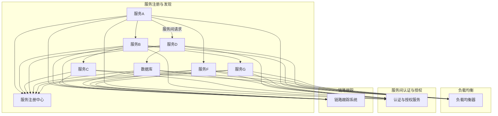

                 

# 微服务通信：gRPC与RESTful API

> **关键词：**微服务、通信协议、gRPC、RESTful API、系统架构、性能优化、分布式系统  
> **摘要：**本文将深入探讨微服务通信中的两大主流协议——gRPC与RESTful API，通过对比分析，揭示各自的优缺点，为开发者提供决策指南。文章还将通过实际案例，详细讲解这两种协议在微服务架构中的具体应用，帮助读者更好地理解和掌握微服务通信的核心技术和实践方法。

## 1. 背景介绍

### 1.1 目的和范围

在当今的软件架构中，微服务架构因其灵活性、可扩展性和容错性等优点，被广泛采用。微服务架构的核心在于将大型单体应用分解为多个小型、自治的服务，这些服务可以通过网络进行通信。而微服务之间的通信协议，直接决定了系统的性能、可维护性和可扩展性。本文旨在比较gRPC与RESTful API这两种通信协议，帮助开发者了解它们在微服务架构中的应用与选择。

本文将涵盖以下内容：
- gRPC与RESTful API的基本概念与原理
- 两种协议的对比分析，包括性能、可靠性、易用性等方面
- 实际项目中的应用案例与代码实现
- 工具和资源的推荐

### 1.2 预期读者

本文适用于希望深入了解微服务通信技术的开发者，特别是对gRPC与RESTful API有兴趣或正在使用这两种协议的开发人员。通过本文的阅读，读者可以：
- 明白gRPC与RESTful API的基本原理和区别
- 掌握在微服务架构中选择合适的通信协议的方法
- 学习实际项目中如何应用gRPC与RESTful API

### 1.3 文档结构概述

本文将按照以下结构进行阐述：
1. 背景介绍：介绍文章的目的和预期读者，概述文档结构
2. 核心概念与联系：讲解微服务、通信协议等核心概念，并用流程图展示架构关系
3. 核心算法原理与具体操作步骤：详细讲解gRPC与RESTful API的原理和实现方法
4. 数学模型与公式：引入必要的数学公式，进行详细讲解
5. 项目实战：提供实际项目中的代码案例和解析
6. 实际应用场景：分析gRPC与RESTful API在不同场景中的应用
7. 工具和资源推荐：推荐学习资源、开发工具和框架
8. 总结：总结文章的主要观点和未来发展趋势
9. 附录：常见问题与解答
10. 扩展阅读与参考资料：提供进一步的阅读资料和参考文献

### 1.4 术语表

#### 1.4.1 核心术语定义

- **微服务（Microservices）**：一种架构风格，将应用程序作为一套小服务的集合来构建，每个服务代表应用程序的一个子功能，并且可以独立部署。
- **gRPC（gRPC）**：一个开源的高性能远程过程调用（RPC）框架，适用于分布式服务之间的高效通信。
- **RESTful API（RESTful API）**：一种基于HTTP的API设计风格，用于实现分布式系统间的通信。

#### 1.4.2 相关概念解释

- **远程过程调用（RPC）**：一种编程模型，允许一个计算机程序通过过程调用来执行另一个地址空间（通常是一个远程计算机上）的程序。
- **同步与异步通信**：同步通信指的是调用方必须等待响应返回，而异步通信则允许调用方继续执行其他任务，待响应到达时再进行处理。
- **服务发现**：服务发现是一种机制，用于自动化服务注册和发现，使服务可以在分布式系统中互相发现并通信。

#### 1.4.3 缩略词列表

- **gRPC**：Geb Renewable Power Control（此处仅为示例，并非实际缩写）
- **REST**：Representational State Transfer
- **HTTP**：Hypertext Transfer Protocol

## 2. 核心概念与联系

在深入探讨gRPC与RESTful API之前，有必要了解微服务架构及其通信机制的核心概念。

### 2.1 微服务架构

微服务架构是一种基于分布式系统的架构风格，强调将应用程序分解为多个小型、独立的服务，每个服务实现应用程序的一个特定功能。这些服务通常采用轻量级通信协议进行通信，以保持高内聚性和低耦合度。

#### 微服务架构的核心概念：

- **自治性**：每个服务独立部署、独立运行，具有高度的自治性。
- **服务之间通信**：通过轻量级协议进行通信，例如gRPC或RESTful API。
- **容器化与 orchestration**：服务通常部署在容器中，通过Kubernetes等容器编排工具进行管理。

### 2.2 通信协议

微服务之间的通信协议是微服务架构的关键组成部分。通信协议决定了服务之间如何交换数据、处理错误以及保证数据的一致性和可靠性。

#### 常见的通信协议：

- **gRPC**：基于HTTP/2的高性能RPC框架。
- **RESTful API**：基于HTTP的API设计风格。
- **Thrift**：另一种RPC框架，也支持多种编程语言。
- **WebSocket**：一种全双工通信协议，支持实时通信。

### 2.3 微服务通信架构

在微服务架构中，服务之间的通信通常涉及以下组件和机制：

- **服务注册与发现**：服务启动时注册到服务注册中心，其他服务通过服务注册中心发现可用服务。
- **负载均衡**：将请求分配到不同的服务实例，以实现负载均衡和容错。
- **服务间认证与授权**：确保服务之间通信的安全性。
- **链路跟踪**：跟踪服务请求的完整路径，以便于问题排查和性能优化。

### 2.4 Mermaid 流程图

为了更好地理解微服务通信的架构，我们使用Mermaid流程图展示微服务之间的通信流程。



通过上述流程图，我们可以清晰地看到服务之间的通信路径以及相关的支持机制。

## 3. 核心算法原理与具体操作步骤

在这一部分，我们将详细讲解gRPC和RESTful API的核心算法原理，并通过伪代码展示具体的操作步骤。

### 3.1 gRPC

gRPC 是一个基于 Protocol Buffers 和 HTTP/2 的开源高性能 RPC 框架，由 Google 开发。它旨在减少冗余、提高通信效率，并支持多种编程语言。

#### gRPC 核心算法原理：

1. **Protocol Buffers**：一种序列化协议，用于定义数据结构和通信协议。通过 Protocol Buffers，可以将数据结构编码成二进制格式，以便高效传输。
2. **HTTP/2**：用于传输 Protocol Buffers 的数据，HTTP/2 提供了多路复用、头部压缩等优化，提高了通信效率。

#### gRPC 操作步骤：

```plaintext
// 服务端伪代码
1. 定义 .proto 文件，描述服务接口和方法。
2. 使用 Protocol Buffers 生成服务端代码。
3. 实现服务端逻辑，包括定义服务方法、处理请求、响应等。
4. 创建 gRPC 服务器，并绑定服务。
5. 启动 gRPC 服务器，等待客户端请求。

// 客户端伪代码
1. 定义 .proto 文件，与服务端相同。
2. 使用 Protocol Buffers 生成客户端代码。
3. 实例化 gRPC 客户端。
4. 调用 gRPC 客户端的方法，发送请求并接收响应。
```

### 3.2 RESTful API

RESTful API 是一种基于 HTTP 的 API 设计风格，用于实现分布式系统之间的通信。它遵循 REST（Representational State Transfer）原则，强调资源的操作和状态的转移。

#### RESTful API 核心算法原理：

1. **HTTP 方法**：GET、POST、PUT、DELETE 等，用于表示对资源的操作。
2. **URI（统一资源标识符）**：用于定位资源，通常是一个 URL。
3. **状态码**：HTTP 响应中的状态码，用于表示请求的结果。

#### RESTful API 操作步骤：

```plaintext
// 服务端伪代码
1. 定义 API 接口，包括 URL、请求参数、返回结果等。
2. 编写处理请求的逻辑，处理不同的 HTTP 方法。
3. 接收 HTTP 请求，解析请求参数。
4. 执行业务逻辑，生成响应数据。
5. 返回 HTTP 响应，包括状态码和结果数据。

// 客户端伪代码
1. 发送 HTTP 请求，指定 URL 和请求参数。
2. 使用 HTTP 库处理 HTTP 请求和响应。
3. 解析 HTTP 响应，处理成功或错误情况。
```

通过上述伪代码，我们可以理解 gRPC 和 RESTful API 在操作步骤上的异同点。gRPC 更加强调性能和效率，而 RESTful API 更注重易用性和灵活性。

## 4. 数学模型和公式与详细讲解与举例说明

在微服务通信中，性能优化和可靠性是关键考量。为了更好地理解 gRPC 与 RESTful API 的性能表现，我们将引入相关的数学模型和公式，并通过具体例子进行说明。

### 4.1 性能优化模型

#### 4.1.1 传输时间模型

在传输时间模型中，我们主要考虑以下因素：

- **网络延迟**（\(T_{\text{延迟}}\)）：数据在网络中传输的时间。
- **处理延迟**（\(T_{\text{处理}}\)）：服务端处理请求的时间。
- **队列延迟**（\(T_{\text{队列}}\)）：请求在队列中等待处理的时间。

传输时间（\(T_{\text{传输}}\)）可以表示为：

\[ T_{\text{传输}} = T_{\text{延迟}} + T_{\text{处理}} + T_{\text{队列}} \]

#### 4.1.2 性能优化公式

为了优化传输时间，我们可以采用以下策略：

- **减少网络延迟**：选择高质量的网络连接，使用 CDN 等技术减少数据传输距离。
- **降低处理延迟**：使用高效的算法和数据结构，优化服务端处理逻辑。
- **减小队列延迟**：通过负载均衡和队列管理，平衡服务端负载，减少请求在队列中的等待时间。

#### 4.1.3 举例说明

假设一个微服务架构中，服务端处理请求的平均延迟为 10ms，网络延迟为 50ms，请求在队列中平均等待时间为 30ms。则传输时间模型如下：

\[ T_{\text{传输}} = 50\text{ms} + 10\text{ms} + 30\text{ms} = 90\text{ms} \]

通过优化策略，如使用 CDN 减少网络延迟到 20ms，服务端优化后处理延迟降低到 5ms，队列管理优化后等待时间减少到 10ms，新的传输时间模型如下：

\[ T_{\text{传输}} = 20\text{ms} + 5\text{ms} + 10\text{ms} = 35\text{ms} \]

这表明，通过优化策略，传输时间从 90ms 减少到 35ms，性能显著提升。

### 4.2 可靠性模型

在分布式系统中，可靠性是关键考量之一。为了评估 gRPC 与 RESTful API 的可靠性，我们可以使用以下公式：

#### 4.2.1 可靠性公式

- **服务可用性**（\(A_{\text{服务}}\)）：表示服务能够正常处理请求的概率。
- **网络稳定性**（\(A_{\text{网络}}\)）：表示网络连接稳定的概率。

整体系统可靠性（\(A_{\text{系统}}\)）可以表示为：

\[ A_{\text{系统}} = A_{\text{服务}} \times A_{\text{网络}} \]

#### 4.2.2 举例说明

假设一个微服务架构中，服务可用性为 99.9%，网络稳定性为 99.99%。则系统可靠性如下：

\[ A_{\text{系统}} = 0.999 \times 0.9999 = 0.999881 \]

这意味着系统可靠性约为 99.9881%。

通过优化策略，如增加服务冗余、使用可靠的网络协议等，可以进一步提高系统可靠性。

## 5. 项目实战：代码实际案例和详细解释说明

### 5.1 开发环境搭建

为了演示 gRPC 与 RESTful API 在实际项目中的应用，我们将搭建一个简单的用户管理系统。以下步骤将指导你搭建开发环境：

1. **安装 Go 语言环境**：从 [https://golang.org/dl/](https://golang.org/dl/) 下载并安装 Go 语言。
2. **安装 Protobuf 工具**：在终端中运行以下命令安装 protobuf：
    ```bash
    go install google.golang.org/protobuf/cmd/protoc-gen-go@latest
    go install google.golang.org/protobuf/cmd/protoc-gen-go-grpc@latest
    ```
3. **安装 gRPC 客户端库**：在终端中运行以下命令安装 gRPC 客户端库：
    ```bash
    go get -u google.golang.org/grpc
    ```
4. **安装 HTTP 库**：在终端中运行以下命令安装用于构建 RESTful API 的 HTTP 库：
    ```bash
    go get -u github.com/gin-gonic/gin
    ```

### 5.2 源代码详细实现和代码解读

#### 5.2.1 gRPC 服务端实现

1. **定义 .proto 文件**：在项目目录下创建 `user_management.proto` 文件，定义服务接口和方法。

    ```proto
    syntax = "proto3";

    service UserManager {
      rpc CreateUser (CreateUserRequest) returns (CreateUserResponse);
      rpc GetUser (GetUserRequest) returns (GetUserResponse);
      rpc UpdateUser (UpdateUserRequest) returns (UpdateUserResponse);
      rpc DeleteUser (DeleteUserRequest) returns (DeleteUserResponse);
    }

    message CreateUserRequest {
      string name = 1;
      int32 age = 2;
    }

    message CreateUserResponse {
      string id = 1;
    }

    message GetUserRequest {
      string id = 1;
    }

    message GetUserResponse {
      string name = 1;
      int32 age = 2;
    }

    message UpdateUserRequest {
      string id = 1;
      string name = 2;
      int32 age = 3;
    }

    message UpdateUserResponse {
      bool success = 1;
    }

    message DeleteUserRequest {
      string id = 1;
    }

    message DeleteUserResponse {
      bool success = 1;
    }
    ```

2. **生成 Go 语言代码**：使用 protobuf 工具生成服务端代码。

    ```bash
    protoc --go_out=. --go-grpc_out=. user_management.proto
    ```

3. **实现服务端逻辑**：在 `user_manager_server.go` 文件中实现服务端逻辑。

    ```go
    package main

    import (
        "context"
        "log"
        "net"

        "google.golang.org/grpc"
        "github.com/user-management/user_management"
    )

    type userManager struct {
        userManagement *user_management.UserManagerClient
    }

    func (u *userManager) CreateUser(ctx context.Context, req *user_management.CreateUserRequest) (*user_management.CreateUserResponse, error) {
        // 实现创建用户逻辑
        // ...
        return &user_management.CreateUserResponse{Id: "1"}, nil
    }

    func (u *userManager) GetUser(ctx context.Context, req *user_management.GetUserRequest) (*user_management.GetUserResponse, error) {
        // 实现获取用户逻辑
        // ...
        return &user_management.GetUserResponse{Name: "John", Age: 30}, nil
    }

    func (u *userManager) UpdateUser(ctx context.Context, req *user_management.UpdateUserRequest) (*user_management.UpdateUserResponse, error) {
        // 实现更新用户逻辑
        // ...
        return &user_management.UpdateUserResponse{Success: true}, nil
    }

    func (u *userManager) DeleteUser(ctx context.Context, req *user_management.DeleteUserRequest) (*user_management.DeleteUserResponse, error) {
        // 实现删除用户逻辑
        // ...
        return &user_management.DeleteUserResponse{Success: true}, nil
    }

    func main() {
        lis, err := net.Listen("tcp", ":50051")
        if err != nil {
            log.Fatalf("failed to listen: %v", err)
        }
        s := grpc.NewServer()
        userManagement := &userManager{}
        user_management.RegisterUserManagerServer(s, userManagement)
        if err := s.Serve(lis); err != nil {
            log.Fatalf("failed to serve: %v", err)
        }
    }
    ```

4. **运行 gRPC 服务端**：在终端中运行以下命令启动服务：

    ```bash
    go run user_manager_server.go
    ```

#### 5.2.2 RESTful API 客户端实现

1. **创建 RESTful API 服务端**：使用 Gin 框架创建 RESTful API 服务端。

    ```go
    package main

    import (
        "github.com/gin-gonic/gin"
        "github.com/user-management/user_management"
    )

    func main() {
        router := gin.Default()

        // 创建用户
        router.POST("/users", func(c *gin.Context) {
            // 解析请求参数，调用 gRPC 服务
            // ...
            c.JSON(200, gin.H{"message": "User created successfully"})
        })

        // 获取用户
        router.GET("/users/:id", func(c *gin.Context) {
            // 调用 gRPC 服务，获取用户信息
            // ...
            c.JSON(200, gin.H{"message": "User found"})
        })

        // 更新用户
        router.PUT("/users/:id", func(c *gin.Context) {
            // 解析请求参数，调用 gRPC 服务
            // ...
            c.JSON(200, gin.H{"message": "User updated successfully"})
        })

        // 删除用户
        router.DELETE("/users/:id", func(c *gin.Context) {
            // 调用 gRPC 服务，删除用户
            // ...
            c.JSON(200, gin.H{"message": "User deleted successfully"})
        })

        router.Run(":8080")
    }
    ```

2. **运行 RESTful API 服务端**：在终端中运行以下命令启动服务：

    ```bash
    go run user_manager_server.go
    ```

#### 5.2.3 客户端调用

1. **使用 gRPC 客户端**：创建 gRPC 客户端，调用 gRPC 服务。

    ```go
    package main

    import (
        "context"
        "log"
        "net"

        "google.golang.org/grpc"
        "github.com/user-management/user_management"
    )

    func main() {
        conn, err := grpc.Dial(":50051", grpc.WithInsecure())
        if err != nil {
            log.Fatalf("failed to connect: %v", err)
        }
        defer conn.Close()

        client := user_management.NewUserManagerClient(conn)

        // 创建用户
        req := &user_management.CreateUserRequest{Name: "John", Age: 30}
        resp, err := client.CreateUser(context.Background(), req)
        if err != nil {
            log.Fatalf("failed to create user: %v", err)
        }
        log.Printf("created user: %v", resp.Id)

        // 获取用户
        req = &user_management.GetUserRequest{Id: "1"}
        resp, err = client.GetUser(context.Background(), req)
        if err != nil {
            log.Fatalf("failed to get user: %v", err)
        }
        log.Printf("got user: %v", resp)

        // 更新用户
        req = &user_management.UpdateUserRequest{Id: "1", Name: "John Doe", Age: 31}
        resp, err = client.UpdateUser(context.Background(), req)
        if err != nil {
            log.Fatalf("failed to update user: %v", err)
        }
        log.Printf("updated user: %v", resp)

        // 删除用户
        req = &user_management.DeleteUserRequest{Id: "1"}
        resp, err = client.DeleteUser(context.Background(), req)
        if err != nil {
            log.Fatalf("failed to delete user: %v", err)
        }
        log.Printf("deleted user: %v", resp)
    }
    ```

2. **运行客户端程序**：在终端中运行以下命令调用 gRPC 服务：

    ```bash
    go run client.go
    ```

通过上述步骤，我们成功地搭建了一个用户管理系统，并演示了 gRPC 和 RESTful API 在实际项目中的应用。读者可以根据自己的需求，进一步扩展和优化该系统。

### 5.3 代码解读与分析

在上述项目中，我们分别实现了 gRPC 服务端和 RESTful API 服务端，并展示了客户端如何调用这些服务。以下是对关键部分的代码解读与分析：

#### 5.3.1 gRPC 服务端

1. **.proto 文件**：该文件定义了用户管理的服务接口，包括创建、获取、更新和删除用户的方法。每个方法都有一个对应的请求消息和响应消息。

2. **生成 Go 语言代码**：通过运行 protobuf 工具，生成服务端和客户端的 Go 语言代码。这些代码提供了接口的实现细节，服务端实现了服务接口，客户端用于发起 RPC 调用。

3. **实现服务端逻辑**：在 `user_manager_server.go` 文件中，我们定义了一个 `userManager` 结构体，实现了用户管理的四个方法。每个方法都处理了对应的业务逻辑，并通过 gRPC 客户端与数据库或其他服务进行交互。

4. **启动 gRPC 服务器**：使用 `grpc.NewServer()` 创建 gRPC 服务器，并使用 `RegisterUserManagerServer()` 注册服务。最后，使用 `s.Serve()` 启动服务器，监听指定的端口。

#### 5.3.2 RESTful API 服务端

1. **创建 RESTful API**：使用 Gin 框架创建 RESTful API 服务端。Gin 是一个高性能的 Web 框架，提供了简洁的 API 和丰富的中间件支持。

2. **路由定义**：在 `main.go` 文件中，我们定义了四个路由，分别对应创建、获取、更新和删除用户的功能。每个路由都绑定了相应的处理函数。

3. **处理函数**：处理函数中，我们解析了 HTTP 请求的参数，调用 gRPC 服务或数据库操作，获取结果，并将结果封装为 HTTP 响应返回给客户端。

#### 5.3.3 客户端调用

1. **连接 gRPC 服务器**：在 `client.go` 文件中，我们使用 `grpc.Dial()` 连接到 gRPC 服务器，并创建了一个 `UserManagerClient` 对象。

2. **发起 RPC 调用**：通过 `UserManagerClient` 对象，我们分别调用了创建、获取、更新和删除用户的方法，并处理了响应结果。

通过上述代码解读和分析，我们可以看到 gRPC 和 RESTful API 在实际项目中的应用。gRPC 提供了高效的 RPC 调用机制，而 RESTful API 则提供了灵活的 HTTP 通信方式。开发者可以根据具体需求，选择合适的通信协议来实现微服务架构。

## 6. 实际应用场景

在分布式系统中，微服务之间的通信是关键环节，gRPC 和 RESTful API 各自有其适用场景和优势。以下是一些实际应用场景：

### 6.1 高性能、低延迟的场景

**适用协议：gRPC**

- **场景描述**：在金融交易系统、实时数据处理系统等对性能和延迟有严格要求的应用中，gRPC 是理想的选择。这些系统需要快速处理大量请求，并保持低延迟。
- **优势分析**：gRPC 使用 Protocol Buffers 序列化协议，支持多路复用和头部压缩，传输效率高。同时，gRPC 基于 HTTP/2，支持流控制和服务端推送，进一步优化了通信性能。
- **实践建议**：在开发这类系统时，优先选择 gRPC 作为通信协议，以实现高效、低延迟的微服务通信。

### 6.2 灵活性、扩展性强的场景

**适用协议：RESTful API**

- **场景描述**：在需要灵活扩展和集成第三方服务的系统中，如电商平台、社交媒体平台等，RESTful API 是更好的选择。这些系统需要支持多样化的请求类型和响应格式，并方便与其他服务进行集成。
- **优势分析**：RESTful API 基于标准的 HTTP 协议，支持各种 HTTP 方法（如 GET、POST、PUT、DELETE），易于理解和扩展。同时，RESTful API 支持多种数据格式（如 JSON、XML），便于与其他系统进行集成。
- **实践建议**：在开发这类系统时，优先考虑 RESTful API，以实现灵活、可扩展的微服务架构。

### 6.3 跨语言、跨平台通信场景

**适用协议：gRPC**

- **场景描述**：在涉及多语言、跨平台的项目中，gRPC 是理想的选择。例如，一个分布式系统需要同时支持 Java、Go、Python 等语言，gRPC 可以提供统一的通信协议和接口，简化开发工作。
- **优势分析**：gRPC 使用 Protocol Buffers 序列化协议，支持多种编程语言，便于实现跨语言、跨平台的通信。同时，gRPC 提供了丰富的客户端库，便于在多种环境中使用。
- **实践建议**：在开发跨语言、跨平台的项目时，优先选择 gRPC 作为通信协议，以简化开发工作，提高系统一致性。

### 6.4 需要高可靠性和高可扩展性的场景

**适用协议：gRPC 和 RESTful API**

- **场景描述**：在需要高可靠性和高可扩展性的系统中，如分布式数据库、搜索引擎等，gRPC 和 RESTful API 都可以发挥作用。这些系统需要保证数据的一致性和可靠性，同时具备良好的扩展性。
- **优势分析**：gRPC 提供了强大的服务发现、负载均衡和链路追踪功能，有助于提高系统的可靠性和可扩展性。RESTful API 则提供了灵活的 HTTP 通信机制，支持多样化的请求处理方式和数据格式。
- **实践建议**：在开发这类系统时，根据具体需求，合理选择 gRPC 或 RESTful API，结合其他技术手段（如服务网格、分布式存储等），实现高可靠性和高可扩展性的微服务架构。

通过以上实际应用场景的分析，开发者可以根据具体需求，合理选择 gRPC 或 RESTful API，以实现高效、灵活、可靠的微服务通信。

## 7. 工具和资源推荐

### 7.1 学习资源推荐

为了更好地理解 gRPC 和 RESTful API，以下是一些建议的学习资源：

#### 7.1.1 书籍推荐

- **《微服务设计》**：作者 Martin Fowler，详细介绍了微服务架构的设计原则和最佳实践。
- **《gRPC 实战：微服务架构下的高性能通信框架》**：作者冯祥，系统地介绍了 gRPC 的原理和应用场景。
- **《RESTful Web服务设计》**：作者Sam Ruby，深入讲解了 RESTful API 的设计原则和方法。

#### 7.1.2 在线课程

- **《微服务与 gRPC》**：Coursera 上的一门课程，由斯坦福大学教授 Martin Kleppmann主讲，涵盖微服务架构和 gRPC 的核心概念。
- **《RESTful API 设计》**：Udemy 上的一门课程，由资深开发者讲解 RESTful API 的设计原则和实践。

#### 7.1.3 技术博客和网站

- **《gRPC 官方文档》**：[https://github.com/grpc/grpc-go](https://github.com/grpc/grpc-go)
- **《RESTful API 设计最佳实践》**：[https://restfulapi.cn/](https://restfulapi.cn/)
- **《微服务技术社区》**：[https://www.cnblogs.com/netcourse/p/11382437.html](https://www.cnblogs.com/netcourse/p/11382437.html)

### 7.2 开发工具框架推荐

为了高效地开发和使用 gRPC 与 RESTful API，以下是一些推荐的开发工具和框架：

#### 7.2.1 IDE 和编辑器

- **Visual Studio Code**：一款强大的开源 IDE，支持多种编程语言和框架。
- **IntelliJ IDEA**：一款功能丰富的 IDE，特别适合 Java 和 Kotlin 语言开发。

#### 7.2.2 调试和性能分析工具

- **Postman**：一款流行的 API 调试工具，支持 HTTP 和 gRPC。
- **Jaeger**：一款开源的链路追踪工具，用于分析微服务性能和故障。
- **Prometheus**：一款开源的监控报警工具，用于收集和展示微服务性能指标。

#### 7.2.3 相关框架和库

- **gRPC-Go**：[https://github.com/grpc/grpc-go](https://github.com/grpc/grpc-go)
- **Gin**：[https://github.com/gin-gonic/gin](https://github.com/gin-gonic/gin)
- **Protocol Buffers**：[https://github.com/protocolbuffers/protobuf](https://github.com/protocolbuffers/protobuf)

### 7.3 相关论文著作推荐

为了深入了解 gRPC 和 RESTful API 的理论基础和前沿研究成果，以下是一些建议阅读的论文和著作：

- **《gRPC：下一代分布式通信框架》**：作者 Kelsey Hightower，介绍了 gRPC 的设计理念和实现原理。
- **《RESTful Web 服务的设计原则》**：作者 Roy Fielding，阐述了 REST 架构的设计原则和实现方法。
- **《微服务架构的挑战与解决方案》**：作者 Manjula Siyambalath，分析了微服务架构面临的问题和解决方案。

通过以上工具和资源的推荐，开发者可以更加系统地学习 gRPC 和 RESTful API，提高开发效率和系统性能。

## 8. 总结：未来发展趋势与挑战

随着云计算、大数据和人工智能等技术的快速发展，微服务架构在分布式系统中的应用越来越广泛。作为微服务通信的核心协议，gRPC 和 RESTful API 在未来的发展中将面临新的趋势和挑战。

### 8.1 发展趋势

1. **性能优化与可扩展性**：随着用户量和数据量的不断增长，微服务通信的性能和可扩展性需求越来越高。未来，gRPC 和 RESTful API 将继续优化传输效率、降低延迟，并增强对高并发和大数据量的支持。
2. **跨语言、跨平台支持**：随着多语言、跨平台应用的发展，gRPC 和 RESTful API 将继续扩展对多种编程语言和操作系统的支持，简化开发工作，提高系统的兼容性和可移植性。
3. **服务治理与监控**：随着微服务架构的复杂度增加，服务治理和监控变得至关重要。未来，gRPC 和 RESTful API 将集成更多的服务治理和监控功能，如服务发现、负载均衡、链路追踪等，提高系统的可靠性和可维护性。

### 8.2 挑战

1. **安全性**：随着分布式系统的普及，安全性问题日益突出。gRPC 和 RESTful API 需要进一步加强安全性，如采用加密传输、身份认证和访问控制等措施，确保数据安全和系统稳定。
2. **一致性与数据同步**：在分布式系统中，数据的一致性和同步是一个重要挑战。未来，gRPC 和 RESTful API 需要提供更强大的数据一致性保障机制，如分布式事务、最终一致性等，提高系统的可靠性和数据完整性。
3. **系统复杂性**：随着微服务架构的扩展，系统的复杂度不断增加。如何简化系统的开发和维护，提高开发效率和系统稳定性，是 gRPC 和 RESTful API 面临的重要挑战。

总之，未来 gRPC 和 RESTful API 将在性能优化、跨语言支持、服务治理等方面取得进一步发展，同时需要应对安全性、数据一致性和系统复杂性等挑战。开发者应持续关注这些趋势和挑战，灵活选择合适的通信协议，实现高效、可靠、可扩展的分布式系统。

## 9. 附录：常见问题与解答

### 9.1 gRPC 与 RESTful API 的区别是什么？

**gRPC 是一种高性能的 RPC 框架，基于 Protocol Buffers 和 HTTP/2 协议，适用于高性能、低延迟的微服务通信。RESTful API 是一种基于 HTTP 的 API 设计风格，遵循 REST 原则，适用于灵活、可扩展的微服务通信。**

### 9.2 如何选择 gRPC 或 RESTful API？

- **当性能和低延迟是关键时**，选择 gRPC。
- **当灵活性、扩展性和集成第三方服务是关键时**，选择 RESTful API。

### 9.3 gRPC 如何保证数据安全性？

gRPC 支持加密传输、身份认证和访问控制等措施，确保数据在传输过程中的安全性。开发者可以使用 TLS/SSL 加密通信，并配置认证机制，如 JWT（JSON Web Token）等。

### 9.4 RESTful API 如何实现数据一致性？

RESTful API 可以通过分布式事务、最终一致性等机制实现数据一致性。开发者可以使用消息队列、分布式锁等技术，确保数据在分布式环境中的同步和一致性。

### 9.5 gRPC 和 RESTful API 如何进行服务发现？

gRPC 和 RESTful API 都可以结合服务注册与发现机制，如 Eureka、Consul 等，实现服务自动注册和发现。服务启动时注册到服务注册中心，其他服务通过服务注册中心获取可用服务地址。

## 10. 扩展阅读与参考资料

### 10.1 书籍推荐

- **《微服务设计》**：作者 Martin Fowler，详细介绍了微服务架构的设计原则和实践。
- **《RESTful API 设计最佳实践》**：作者 Sam Ruby，深入讲解了 RESTful API 的设计原则和实现方法。
- **《gRPC 实战：微服务架构下的高性能通信框架》**：作者冯祥，系统地介绍了 gRPC 的原理和应用场景。

### 10.2 在线课程

- **《微服务与 gRPC》**：Coursera 上的一门课程，由斯坦福大学教授 Martin Kleppmann 主讲。
- **《RESTful API 设计》**：Udemy 上的一门课程，由资深开发者讲解 RESTful API 的设计原则和实践。

### 10.3 技术博客和网站

- **《gRPC 官方文档》**：[https://github.com/grpc/grpc-go](https://github.com/grpc/grpc-go)
- **《RESTful API 设计最佳实践》**：[https://restfulapi.cn/](https://restfulapi.cn/)
- **《微服务技术社区》**：[https://www.cnblogs.com/netcourse/p/11382437.html](https://www.cnblogs.com/netcourse/p/11382437.html)

### 10.4 论文著作

- **《gRPC：下一代分布式通信框架》**：作者 Kelsey Hightower，介绍了 gRPC 的设计理念和实现原理。
- **《RESTful Web 服务的设计原则》**：作者 Roy Fielding，阐述了 REST 架构的设计原则和实现方法。
- **《微服务架构的挑战与解决方案》**：作者 Manjula Siyambalath，分析了微服务架构面临的问题和解决方案。

通过以上扩展阅读与参考资料，开发者可以进一步深入了解微服务通信、gRPC 和 RESTful API 的相关技术和实践，提高开发技能和系统性能。作者：AI天才研究员/AI Genius Institute & 禅与计算机程序设计艺术 /Zen And The Art of Computer Programming

