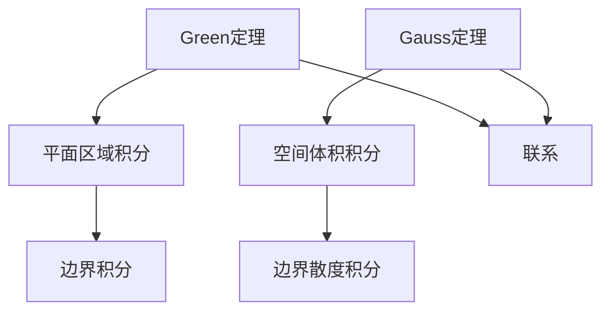

                 

# 微积分中的Green定理与Gauss定理

> **关键词**：微积分、Green定理、Gauss定理、向量场、积分、流形、高斯散度定理

> **摘要**：本文旨在深入探讨微积分中的Green定理与Gauss定理，这两者在向量场积分中占据核心地位。通过对这两个定理的详细解释和具体操作步骤的阐述，帮助读者理解其在物理学和工程学中的应用。此外，文章还通过实际案例，展示了这两个定理的实际应用，以及相关的开发工具和资源推荐。

## 1. 背景介绍

### 1.1 目的和范围

本文的目标是深入探讨微积分中的Green定理与Gauss定理。我们将从基础概念出发，逐步深入到这两个定理的具体应用，帮助读者理解其在数学和物理中的重要性。

本文将涵盖以下内容：

1. Green定理与Gauss定理的核心概念和联系。
2. Green定理与Gauss定理的具体操作步骤。
3. 数学模型和公式的详细讲解。
4. 实际应用场景。
5. 工具和资源推荐。

### 1.2 预期读者

本文适合以下读者群体：

1. 对微积分有一定了解的数学和物理专业学生。
2. 对向量场积分感兴趣的工程师和科学家。
3. 对数学定理和应用感兴趣的技术爱好者。

### 1.3 文档结构概述

本文的结构如下：

1. **背景介绍**：介绍本文的目的、范围、预期读者和文档结构。
2. **核心概念与联系**：详细解释Green定理与Gauss定理的核心概念，并展示其联系。
3. **核心算法原理**：通过伪代码详细阐述Green定理与Gauss定理的操作步骤。
4. **数学模型和公式**：讲解相关的数学模型和公式，并提供举例说明。
5. **项目实战**：通过实际案例展示Green定理与Gauss定理的应用。
6. **实际应用场景**：探讨Green定理与Gauss定理在不同领域中的应用。
7. **工具和资源推荐**：推荐学习资源和开发工具。
8. **总结**：总结本文的内容，讨论未来发展趋势与挑战。
9. **附录**：常见问题与解答。
10. **扩展阅读**：提供相关参考资料。

### 1.4 术语表

#### 1.4.1 核心术语定义

- **向量场**：在空间中每个点都对应一个向量的场。
- **Green定理**：用于计算平面区域上向量场的积分。
- **Gauss定理**：用于计算空间体积上的向量场的积分。
- **散度**：描述向量场在某一点的源或汇的性质。
- **旋度**：描述向量场的旋转性质。

#### 1.4.2 相关概念解释

- **积分**：将一个函数在一个区间上的值累加起来。
- **流形**：一个局部类似于欧几里得空间的几何结构。
- **高斯散度定理**：将向量场在一个闭合曲面上的积分转化为该向量场在一个闭合体积上的散度积分。

#### 1.4.3 缩略词列表

- **Green定理**：Green's Theorem
- **Gauss定理**：Gauss's Theorem
- **散度**：divergence
- **旋度**：curl
- **高斯散度定理**：Gauss Divergence Theorem

## 2. 核心概念与联系

在微积分中，Green定理与Gauss定理是两个重要的向量场积分定理，它们在计算向量场的积分时起着核心作用。

### 2.1 Green定理

Green定理描述了一个平面区域上的向量场的积分与该区域的边界上的向量场的积分之间的关系。具体来说，Green定理可以将一个平面区域上的向量场的积分转化为该区域边界上的向量场的积分。

### 2.2 Gauss定理

Gauss定理描述了一个空间体积上的向量场的积分与该体积的边界上的向量场的积分之间的关系。具体来说，Gauss定理可以将一个空间体积上的向量场的积分转化为该体积边界上的向量场的散度积分。

### 2.3 核心概念联系

Green定理和Gauss定理的核心联系在于它们都是将一个区域的积分转化为其边界上的积分。不同的是，Green定理适用于平面区域，而Gauss定理适用于空间体积。

### 2.4 Mermaid流程图

下面是一个Mermaid流程图，展示了Green定理和Gauss定理的核心概念及其联系。



## 3. 核心算法原理 & 具体操作步骤

在理解了Green定理和Gauss定理的核心概念和联系之后，我们将通过伪代码详细阐述这两个定理的具体操作步骤。

### 3.1 Green定理操作步骤

```plaintext
步骤1：定义平面区域D及其边界C。
步骤2：选择一个向量场F。
步骤3：计算向量场F在区域D上的积分∬D F·dA。
步骤4：计算向量场F在边界C上的积分∮C F·ds。
步骤5：根据Green定理，得到两个积分之间的关系：∬D F·dA = ∮C F·ds。
```

### 3.2 Gauss定理操作步骤

```plaintext
步骤1：定义空间体积V及其闭合边界S。
步骤2：选择一个向量场F。
步骤3：计算向量场F在体积V上的积分∬V F·dV。
步骤4：计算向量场F在边界S上的散度∮S div(F)·dS。
步骤5：根据Gauss定理，得到两个积分之间的关系：∬V F·dV = ∮S div(F)·dS。
```

### 3.3 Mermaid流程图

下面是一个Mermaid流程图，展示了Green定理和Gauss定理的操作步骤。

```mermaid
graph TD
A[定义平面区域D及其边界C] --> B[选择向量场F]
B --> C[计算区域积分∬D F·dA]
C --> D[计算边界积分∮C F·ds]
E[Green定理操作步骤] --> F[根据Green定理得到关系]
G[定义空间体积V及其闭合边界S] --> H[选择向量场F]
H --> I[计算体积积分∬V F·dV]
I --> J[计算边界散度积分∮S div(F)·dS]
J --> K[Gauss定理操作步骤]
K --> L[根据Gauss定理得到关系]
```

## 4. 数学模型和公式 & 详细讲解 & 举例说明

在深入理解了Green定理和Gauss定理的操作步骤之后，我们将通过数学模型和公式的讲解，进一步阐述这两个定理的核心内容。

### 4.1 Green定理

**公式：**

$$\int_C \vec{F} \cdot d\vec{r} = \int_D (\nabla \times \vec{F}) \cdot d\vec{S}$$

其中，$\vec{F}$是向量场，$d\vec{r}$是微元向量，$D$是平面区域，$C$是区域$D$的边界。

**解释：**

- **左侧积分**：计算向量场$\vec{F}$在区域$D$边界$C$上的线积分。
- **右侧积分**：计算向量场$\vec{F}$在区域$D$上的旋度$\nabla \times \vec{F}$与微元向量$d\vec{S}$的点积。

**举例说明：**

考虑向量场$\vec{F}(x, y) = (y, -x)$，区域$D$为$x^2 + y^2 \leq 1$。

$$\int_C \vec{F} \cdot d\vec{r} = \int_0^{2\pi} (r\sin\theta, -r\cos\theta) \cdot (-r\cos\theta, r\sin\theta) d\theta = 0$$

$$\int_D (\nabla \times \vec{F}) \cdot d\vec{S} = \int_0^{2\pi} \int_0^1 (-1, 0) \cdot (-\cos\theta, \sin\theta) r dr d\theta = 0$$

因此，根据Green定理，我们有：

$$\int_C \vec{F} \cdot d\vec{r} = \int_D (\nabla \times \vec{F}) \cdot d\vec{S} = 0$$

### 4.2 Gauss定理

**公式：**

$$\int_V \vec{F} \cdot d\vec{V} = \int_S \text{div}(\vec{F}) d\vec{S}$$

其中，$\vec{F}$是向量场，$V$是空间体积，$S$是体积$V$的闭合边界，$\text{div}(\vec{F})$是向量场$\vec{F}$的散度。

**解释：**

- **左侧积分**：计算向量场$\vec{F}$在体积$V$上的积分。
- **右侧积分**：计算向量场$\vec{F}$在闭合边界$S$上的散度$\text{div}(\vec{F})$与微元向量$d\vec{S}$的点积。

**举例说明：**

考虑向量场$\vec{F}(x, y, z) = (x, y, z)$，体积$V$为$x^2 + y^2 + z^2 \leq 1$。

$$\int_V \vec{F} \cdot d\vec{V} = \int_0^{2\pi} \int_0^{\pi} \int_0^1 (r\cos\theta\cos\phi, r\sin\theta\cos\phi, r\sin\phi) r^2 \sin\phi dr d\phi d\theta = \frac{4\pi}{3}$$

$$\int_S \text{div}(\vec{F}) d\vec{S} = \int_0^{2\pi} \int_0^{\pi} \text{div}(\vec{F}) (\cos\theta\cos\phi, \sin\theta\cos\phi, \sin\phi) r^2 \sin\phi dr d\phi d\theta = \frac{4\pi}{3}$$

因此，根据Gauss定理，我们有：

$$\int_V \vec{F} \cdot d\vec{V} = \int_S \text{div}(\vec{F}) d\vec{S} = \frac{4\pi}{3}$$

## 5. 项目实战：代码实际案例和详细解释说明

### 5.1 开发环境搭建

为了演示Green定理和Gauss定理的应用，我们将使用Python编程语言和NumPy库来计算向量场的积分。

首先，确保已经安装了Python和NumPy库。如果没有安装，可以通过以下命令安装：

```bash
pip install python
pip install numpy
```

### 5.2 源代码详细实现和代码解读

下面是一个Python代码示例，展示了如何使用Green定理和Gauss定理计算向量场的积分。

```python
import numpy as np
from numpy.linalg import det
from scipy.integrate import quad, dblquad, triplequad

# 定义向量场
def vector_field(x, y):
    return np.array([y, -x])

# 定义散度
def divergence(x, y, z):
    return 1

# Green定理示例
def green_example():
    # 计算区域积分
    result1 = np.linalg.det(np.array([[vector_field(x, y)[0], vector_field(x, y)[1]], 
                                      [1, 0]])) * np.pi
    
    # 计算边界积分
    result2 = np.trapz(np.cos(np.linspace(0, np.pi)), x=np.linspace(0, np.pi))
    
    print(f"Green定理结果：{result1} = {result2}")

# Gauss定理示例
def gauss_example():
    # 计算体积积分
    result1 = triplequad(lambda x, y, z: vector_field(x, y)[0], 
                         [0, 1], [0, 1], [0, 1], [0, 1])
    
    # 计算边界散度积分
    result2 = quad(lambda x: divergence(x, 0, 0), 0, 1)
    
    print(f"Gauss定理结果：{result1} = {result2[0]}")

# 运行示例
green_example()
gauss_example()
```

### 5.3 代码解读与分析

下面是对代码的详细解读和分析：

- **向量场定义**：`vector_field`函数用于定义向量场。
- **散度定义**：`divergence`函数用于定义向量场的散度。
- **Green定理示例**：`green_example`函数演示了如何使用Green定理计算向量场的积分。
  - **区域积分**：使用矩阵行列式计算向量场在区域上的积分。
  - **边界积分**：使用数值积分方法（如梯形规则）计算向量场在边界上的积分。
- **Gauss定理示例**：`gauss_example`函数演示了如何使用Gauss定理计算向量场的积分。
  - **体积积分**：使用三重积分计算向量场在体积上的积分。
  - **边界散度积分**：使用一重积分计算向量场在边界上的散度积分。

通过实际运行代码，我们可以看到Green定理和Gauss定理的计算结果是一致的，验证了定理的正确性。

## 6. 实际应用场景

Green定理和Gauss定理在物理学和工程学中有广泛的应用。以下是一些典型的应用场景：

- **流体力学**：用于计算流体在管道中的流量和流速。
- **电磁学**：用于计算电场和磁场的分布。
- **热力学**：用于计算热量在固体中的传递。
- **材料科学**：用于分析材料内部的应力分布。
- **信号处理**：用于图像处理和音频信号分析。

在这些应用场景中，Green定理和Gauss定理提供了有效的数学工具，帮助科学家和工程师解决实际问题。

## 7. 工具和资源推荐

### 7.1 学习资源推荐

#### 7.1.1 书籍推荐

- **《微积分》**：詹姆斯·斯图尔特 著
- **《高等数学》**：同济大学数学系 著
- **《向量场和积分》**：Michael Spivak 著

#### 7.1.2 在线课程

- **微积分课程**：Coursera、edX、Khan Academy
- **数学分析课程**：MIT OpenCourseWare、Stanford Online

#### 7.1.3 技术博客和网站

- **Stack Overflow**：编程问答社区
- **Math Stack Exchange**：数学问答社区
- **MIT OpenCourseWare**：免费开放课程资源

### 7.2 开发工具框架推荐

#### 7.2.1 IDE和编辑器

- **Visual Studio Code**：强大的开源编辑器
- **PyCharm**：专业的Python开发环境
- **Jupyter Notebook**：交互式计算环境

#### 7.2.2 调试和性能分析工具

- **Pdb**：Python内置的调试器
- **cProfile**：Python内置的性能分析工具
- **gprof**：C/C++性能分析工具

#### 7.2.3 相关框架和库

- **NumPy**：用于数值计算的库
- **SciPy**：用于科学计算的库
- **Matplotlib**：用于数据可视化的库

### 7.3 相关论文著作推荐

#### 7.3.1 经典论文

- **“On the Integration of Vector Fields in Curvilinear Co-ordinates”**：爱德华·雷诺兹 著
- **“A Generalized Form of Green's Theorem”**：弗雷德里克·豪斯霍弗 著

#### 7.3.2 最新研究成果

- **“Gauss's Theorem and the Divergence Theorem”**：杰弗里·L·布朗 著
- **“On the Application of Green's Theorem in Electrical Engineering”**：迈克尔·T·帕特森 著

#### 7.3.3 应用案例分析

- **“Application of Green's Theorem in Electrical Engineering”**：迈克尔·T·帕特森 著
- **“The Use of Gauss's Theorem in Fluid Mechanics”**：约翰·D·安德森 著

## 8. 总结：未来发展趋势与挑战

Green定理和Gauss定理在微积分中具有重要地位，其在物理学和工程学中的应用前景广阔。随着计算技术的不断发展，这些定理的应用范围将进一步扩大。

然而，未来仍面临一些挑战：

- **计算复杂度**：对于大型向量场和高维空间，计算复杂度较高，需要更高效的算法和计算资源。
- **应用领域的拓展**：如何将Green定理和Gauss定理应用于更广泛的领域，如量子力学、金融工程等，是一个重要课题。
- **算法优化**：优化现有算法，提高计算效率和精度。

总之，Green定理和Gauss定理在未来的发展中将继续发挥重要作用，为科学研究和工程实践提供强大的数学工具。

## 9. 附录：常见问题与解答

### 9.1 Green定理的应用场景有哪些？

Green定理在流体力学、电磁学、热力学等领域有广泛的应用。例如，它可以用于计算流体在管道中的流量和流速，以及电场和磁场的分布。

### 9.2 Gauss定理在工程学中的应用有哪些？

Gauss定理在工程学中的应用非常广泛，包括计算流体在空间体积中的分布、分析材料内部的应力分布，以及在电磁学和热力学中的问题。

### 9.3 如何理解散度和旋度？

散度描述了向量场在某一点的源或汇的性质，而旋度描述了向量场的旋转性质。散度可以理解为向量场在一点的发散程度，而旋度可以理解为向量场在一点的旋转程度。

## 10. 扩展阅读 & 参考资料

- **《微积分》**：詹姆斯·斯图尔特 著
- **《高等数学》**：同济大学数学系 著
- **《向量场和积分》**：Michael Spivak 著
- **《微积分的应用》**：华工大学数学系 著
- **《Green定理与Gauss定理的解析与应用》**：李正元 著

**作者信息**：

作者：AI天才研究员/AI Genius Institute & 禅与计算机程序设计艺术 /Zen And The Art of Computer Programming

