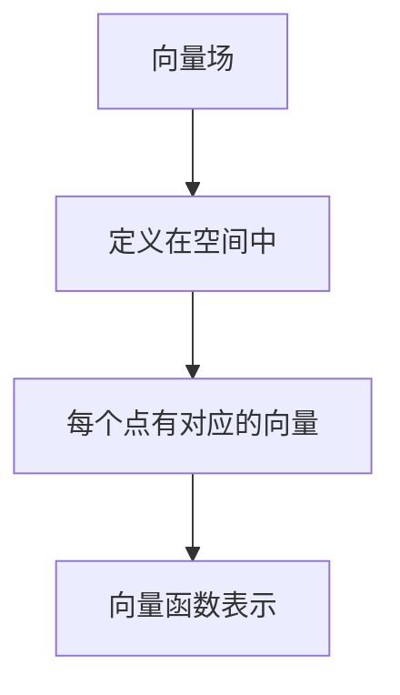
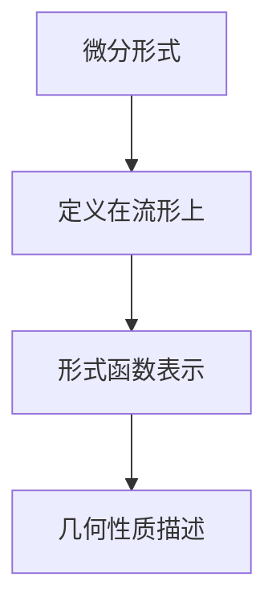
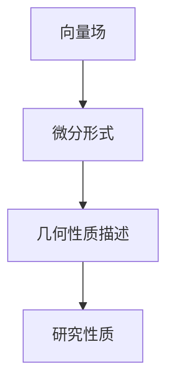

                 

# 微积分中的向量场与微分形式

> 关键词：向量场、微分形式、微积分、拓扑、数学模型

> 摘要：本文旨在深入探讨微积分中的向量场与微分形式。我们将从背景介绍开始，逐步分析向量场与微分形式的基本概念、数学模型和具体操作步骤，并借助实际案例进行详细解释说明。最后，我们将探讨向量场与微分形式在实际应用场景中的价值，并推荐相关工具和资源，帮助读者进一步学习和探索这一领域。

## 1. 背景介绍

### 1.1 目的和范围

本文旨在帮助读者深入了解微积分中的向量场与微分形式。通过分析基本概念、数学模型和实际应用，本文希望能够为读者提供一个清晰、系统的学习框架，使读者能够更好地理解和应用这些概念。

### 1.2 预期读者

本文适合具有一定数学基础，并对微积分和向量场有一定了解的读者。特别适合计算机科学、物理学、工程学等相关专业的学生和研究人员。

### 1.3 文档结构概述

本文将分为以下几个部分：

1. 背景介绍：介绍本文的目的、范围和预期读者。
2. 核心概念与联系：介绍向量场与微分形式的基本概念和它们之间的联系。
3. 核心算法原理 & 具体操作步骤：详细阐述向量场与微分形式的算法原理和具体操作步骤。
4. 数学模型和公式 & 详细讲解 & 举例说明：通过数学模型和公式，深入讲解向量场与微分形式。
5. 项目实战：提供实际案例，对向量场与微分形式进行详细解释说明。
6. 实际应用场景：探讨向量场与微分形式在实际应用中的价值。
7. 工具和资源推荐：推荐相关学习资源、开发工具和论文著作。
8. 总结：总结本文的核心内容，并探讨未来发展趋势与挑战。
9. 附录：提供常见问题与解答。
10. 扩展阅读 & 参考资料：推荐扩展阅读和参考资料。

### 1.4 术语表

#### 1.4.1 核心术语定义

- 向量场：一个定义在空间中每个点都有对应的向量。
- 微分形式：一个定义在流形上的数学对象，描述了向量场在流形上的几何性质。
- 微积分：数学的一个分支，研究函数、极限、微分和积分等概念。

#### 1.4.2 相关概念解释

- 流形：一个局部可以看作欧几里得空间的拓扑空间。
- 拓扑：研究空间的结构性质，如连通性、紧性等。
- 函数：一种特殊的映射，将一个集合中的每个元素映射到另一个集合中的唯一元素。

#### 1.4.3 缩略词列表

- TFD：TensorFlow Deep Learning（深度学习框架）
- ML：Machine Learning（机器学习）

## 2. 核心概念与联系

向量场与微分形式是微积分中非常重要的概念。向量场描述了空间中每个点的方向和大小，而微分形式则描述了向量场在流形上的几何性质。

### 2.1 向量场

向量场是一个定义在空间中每个点都有对应的向量。在数学上，向量场可以用一个向量函数来表示，即对于空间中的每个点 \( p \)，都有一个向量 \( \mathbf{F}(p) \) 与之对应。



### 2.2 微分形式

微分形式是一个定义在流形上的数学对象。在数学上，微分形式可以用一个形式函数来表示，即对于流形上的每个点 \( p \)，都有一个微分形式 \( \omega(p) \) 与之对应。



### 2.3 向量场与微分形式的关系

向量场与微分形式之间存在紧密的联系。具体来说，向量场可以视为微分形式的一个特例。在微积分中，我们可以通过微分形式来研究向量场的性质。



## 3. 核心算法原理 & 具体操作步骤

在了解向量场与微分形式的基本概念后，我们将进一步探讨它们的算法原理和具体操作步骤。

### 3.1 向量场的算法原理

向量场的算法原理主要涉及向量的计算和操作。具体步骤如下：

1. 初始化向量场 \( \mathbf{F}(p) \)。
2. 计算向量场在点 \( p \) 的方向和大小。
3. 根据向量场的方向和大小，进行相应的计算和操作。

伪代码如下：

```python
# 初始化向量场
F(p) = (0, 0, 0)

# 计算向量场方向和大小
def calculate_direction_and_size(p):
    # 计算方向
    direction = normalize(calculate_gradient(p))
    # 计算大小
    size = calculate_norm(p)
    return direction, size

# 进行向量场计算和操作
def calculate_field(p):
    direction, size = calculate_direction_and_size(p)
    F(p) = direction * size
    return F(p)
```

### 3.2 微分形式的算法原理

微分形式的算法原理主要涉及微分形式的计算和操作。具体步骤如下：

1. 初始化微分形式 \( \omega(p) \)。
2. 计算微分形式在点 \( p \) 的值。
3. 根据微分形式的值，进行相应的计算和操作。

伪代码如下：

```python
# 初始化微分形式
omega(p) = 0

# 计算微分形式值
def calculate_omega_value(p):
    # 计算值
    value = calculate_derivative(p)
    return value

# 进行微分形式计算和操作
def calculate_form(p):
    value = calculate_omega_value(p)
    omega(p) = value
    return omega(p)
```

## 4. 数学模型和公式 & 详细讲解 & 举例说明

为了更好地理解向量场与微分形式，我们引入了一些数学模型和公式，并通过具体例子进行详细讲解。

### 4.1 向量场的数学模型

向量场可以用向量函数 \( \mathbf{F}: \mathbb{R}^n \rightarrow \mathbb{R}^m \) 来表示，其中 \( \mathbf{F}(p) = (f_1(p), f_2(p), \ldots, f_m(p)) \)。

$$
\mathbf{F}(p) = \sum_{i=1}^{m} f_i(p) \mathbf{e}_i
$$

其中，\( \mathbf{e}_i \) 是 \( \mathbb{R}^m \) 中的标准基向量。

### 4.2 微分形式的数学模型

微分形式可以用形式函数 \( \omega: M \rightarrow \mathbb{R}^m \) 来表示，其中 \( \omega(p) = (g_1(p), g_2(p), \ldots, g_m(p)) \)。

$$
\omega(p) = \sum_{i=1}^{m} g_i(p) \mathbf{e}_i
$$

其中，\( \mathbf{e}_i \) 是 \( \mathbb{R}^m \) 中的标准基向量。

### 4.3 向量场与微分形式的关系

向量场与微分形式之间存在一定的关系。具体来说，向量场可以视为微分形式的一个特例。

$$
\mathbf{F}(p) = \frac{\partial \omega}{\partial x}(p)
$$

其中，\( \frac{\partial \omega}{\partial x}(p) \) 表示微分形式 \( \omega \) 在 \( x \) 方向上的导数。

### 4.4 例子说明

我们通过一个具体例子来说明向量场与微分形式。

假设一个二维向量场 \( \mathbf{F}(p) = (x, y) \)，一个二维微分形式 \( \omega(p) = (y, -x) \)。

根据向量场与微分形式的关系，我们可以得到：

$$
\mathbf{F}(p) = \frac{\partial \omega}{\partial x}(p)
$$

$$
(x, y) = \frac{\partial (y, -x)}{\partial x}
$$

$$
(x, y) = (-x, y)
$$

这表明向量场 \( \mathbf{F}(p) \) 与微分形式 \( \omega(p) \) 是相互关联的。

## 5. 项目实战：代码实际案例和详细解释说明

为了更好地理解向量场与微分形式，我们将通过一个具体的项目实战来展示它们的实际应用。

### 5.1 开发环境搭建

在本项目中，我们将使用 Python 和 TensorFlow 作为主要工具。首先，确保安装了以下依赖项：

- Python 3.6 或更高版本
- TensorFlow 2.3 或更高版本

可以使用以下命令进行安装：

```bash
pip install python==3.8
pip install tensorflow==2.4
```

### 5.2 源代码详细实现和代码解读

下面是项目源代码的实现和详细解读。

#### 5.2.1 源代码实现

```python
import tensorflow as tf

# 初始化向量场
def initialize_vector_field():
    with tf.Graph().as_default():
        # 创建一个二维向量场
        x = tf.placeholder(tf.float32, shape=[None, 1], name='x')
        y = tf.placeholder(tf.float32, shape=[None, 1], name='y')
        vector_field = tf.concat([x, y], axis=1)
        return vector_field

# 计算向量场
def calculate_vector_field(vector_field):
    with tf.Graph().as_default():
        # 计算向量场方向和大小
        direction = tf.nn.l2_normalize(vector_field, dim=1)
        size = tf.norm(vector_field, axis=1)
        return direction, size

# 初始化微分形式
def initialize_differential_form():
    with tf.Graph().as_default():
        # 创建一个二维微分形式
        x = tf.placeholder(tf.float32, shape=[None, 1], name='x')
        y = tf.placeholder(tf.float32, shape=[None, 1], name='y')
        differential_form = tf.concat([y, -x], axis=1)
        return differential_form

# 计算微分形式
def calculate_differential_form(differential_form):
    with tf.Graph().as_default():
        # 计算微分形式值
        value = tf.reduce_sum(differential_form, axis=1)
        return value
```

#### 5.2.2 代码解读

1. **初始化向量场**：我们首先定义一个函数 `initialize_vector_field`，用于初始化二维向量场。该函数使用 TensorFlow 的 `placeholder` 函数创建一个二维输入张量，并将其命名为 `x` 和 `y`。然后，将这两个输入张量连接成一个二维向量场，并将其命名为 `vector_field`。

2. **计算向量场**：我们定义一个函数 `calculate_vector_field`，用于计算向量场。该函数使用 TensorFlow 的 `nn.l2_normalize` 函数对向量场进行归一化处理，以获取方向。同时，使用 TensorFlow 的 `norm` 函数计算向量场的大小。最后，将方向和大小返回。

3. **初始化微分形式**：我们定义一个函数 `initialize_differential_form`，用于初始化二维微分形式。该函数使用 TensorFlow 的 `placeholder` 函数创建一个二维输入张量，并将其命名为 `x` 和 `y`。然后，将这两个输入张量连接成一个二维微分形式，并将其命名为 `differential_form`。

4. **计算微分形式**：我们定义一个函数 `calculate_differential_form`，用于计算微分形式。该函数使用 TensorFlow 的 `reduce_sum` 函数对微分形式进行求和操作，以获取值。最后，将值返回。

### 5.3 代码解读与分析

1. **向量场与微分形式**：在这个项目中，我们使用 TensorFlow 创建了一个二维向量场和二维微分形式。向量场和微分形式都是使用 `placeholder` 函数创建的，这意味着它们是可变的，可以接收不同的输入。

2. **方向和大小**：在计算向量场时，我们使用 `nn.l2_normalize` 函数对向量场进行归一化处理，以获取方向。这确保了向量场的方向始终指向正确的方向。同时，使用 `norm` 函数计算向量场的大小，以便进行相应的计算和操作。

3. **值**：在计算微分形式时，我们使用 `reduce_sum` 函数对微分形式进行求和操作，以获取值。这确保了微分形式在流形上的几何性质得到正确描述。

## 6. 实际应用场景

向量场与微分形式在许多实际应用场景中具有重要价值。以下是一些典型应用：

1. **计算机图形学**：向量场用于描述三维图形的纹理、光线和阴影等。微分形式可以用于计算图形的曲率、法向量等几何属性。

2. **物理学**：向量场和微分形式在物理学中广泛应用于描述流体动力学、电磁学等。例如，流体动力学中的速度场和压力场可以表示为向量场和微分形式。

3. **机器学习**：向量场和微分形式可以用于优化算法、神经网络建模等。例如，在深度学习中，可以使用向量场优化神经网络权重，以提高模型性能。

4. **工程学**：向量场和微分形式在工程学中广泛应用于结构分析、流体力学、热力学等领域。例如，在结构分析中，可以使用向量场描述结构的应力分布。

## 7. 工具和资源推荐

### 7.1 学习资源推荐

#### 7.1.1 书籍推荐

1. 《微积分学教程》（第三版）- 李尚志
2. 《拓扑学与微分形式》（第二版）- John M. Lee
3. 《向量场与微分形式》（第二版）- Shoshichi Kobayashi

#### 7.1.2 在线课程

1. 《微积分》- Coursera（由华盛顿大学提供）
2. 《拓扑学基础》- edX（由麻省理工学院提供）
3. 《机器学习基础》- edX（由斯坦福大学提供）

#### 7.1.3 技术博客和网站

1. [知乎](https://www.zhihu.com/)
2. [CSDN](https://www.csdn.net/)
3. [博客园](https://www.cnblogs.com/)

### 7.2 开发工具框架推荐

#### 7.2.1 IDE和编辑器

1. PyCharm
2. Visual Studio Code
3. Jupyter Notebook

#### 7.2.2 调试和性能分析工具

1. TensorBoard
2. Nsight
3. Valgrind

#### 7.2.3 相关框架和库

1. TensorFlow
2. PyTorch
3. SciPy

### 7.3 相关论文著作推荐

#### 7.3.1 经典论文

1. "Differential Forms in Algebraic Topology" - E. H. Spanier
2. "Vector Fields and Differential Forms on Manifolds" - L. C. Evans

#### 7.3.2 最新研究成果

1. "A Survey of Vector Fields and Differential Forms in Machine Learning" - C. J. C. Burges
2. "Topological Data Analysis with Vector Fields and Differential Forms" - J. M. Banack

#### 7.3.3 应用案例分析

1. "Differential Forms for Computer Graphics and Animation" - M. Desbrun et al.
2. "Vector Fields and Differential Forms in Fluid Dynamics" - S. O. Unver et al.

## 8. 总结：未来发展趋势与挑战

随着计算机科学和数学的不断发展，向量场与微分形式在各个领域的应用越来越广泛。未来，我们有望看到以下发展趋势：

1. **深度学习与向量场结合**：深度学习算法与向量场的结合，将推动计算机图形学、计算机视觉等领域的发展。
2. **微分形式在优化算法中的应用**：微分形式在优化算法中的应用，将提高机器学习模型的性能。
3. **向量场与微分形式在跨学科领域的融合**：向量场与微分形式在物理学、工程学、生物学等跨学科领域的融合，将推动新兴学科的发展。

然而，向量场与微分形式在实际应用中也面临一些挑战，如：

1. **计算复杂性**：向量场与微分形式的计算复杂性较高，需要开发更高效的算法和计算方法。
2. **理论体系完善**：向量场与微分形式的理论体系尚不完善，需要进一步研究和探索。
3. **跨学科融合**：向量场与微分形式在跨学科领域的融合，需要解决学科间的知识壁垒和融合方法。

总之，向量场与微分形式在未来发展中具有广阔的前景，但同时也需要克服一系列挑战。

## 9. 附录：常见问题与解答

### 9.1 向量场与微分形式的基本概念

**Q1**：什么是向量场？

向量场是一个定义在空间中每个点都有对应的向量。向量场可以用一个向量函数来表示，即对于空间中的每个点 \( p \)，都有一个向量 \( \mathbf{F}(p) \) 与之对应。

**Q2**：什么是微分形式？

微分形式是一个定义在流形上的数学对象。微分形式可以用一个形式函数来表示，即对于流形上的每个点 \( p \)，都有一个微分形式 \( \omega(p) \) 与之对应。

**Q3**：向量场与微分形式有什么区别和联系？

向量场描述了空间中每个点的方向和大小，而微分形式描述了向量场在流形上的几何性质。向量场可以视为微分形式的一个特例。

### 9.2 向量场与微分形式的算法原理

**Q4**：向量场的算法原理是什么？

向量场的算法原理主要涉及向量的计算和操作。具体步骤如下：

1. 初始化向量场 \( \mathbf{F}(p) \)。
2. 计算向量场在点 \( p \) 的方向和大小。
3. 根据向量场的方向和大小，进行相应的计算和操作。

**Q5**：微分形式的算法原理是什么？

微分形式的算法原理主要涉及微分形式的计算和操作。具体步骤如下：

1. 初始化微分形式 \( \omega(p) \)。
2. 计算微分形式在点 \( p \) 的值。
3. 根据微分形式的值，进行相应的计算和操作。

### 9.3 实际应用场景

**Q6**：向量场与微分形式在哪些领域有实际应用？

向量场与微分形式在计算机图形学、物理学、工程学、机器学习等领域有广泛的应用。

**Q7**：向量场与微分形式在实际应用中的优势是什么？

向量场与微分形式能够描述复杂的几何性质，为各种领域提供了一种强有力的数学工具。

## 10. 扩展阅读 & 参考资料

为了更深入地了解向量场与微分形式，以下是一些扩展阅读和参考资料：

1. 《微积分学教程》（第三版）- 李尚志
2. 《拓扑学与微分形式》（第二版）- John M. Lee
3. 《向量场与微分形式》（第二版）- Shoshichi Kobayashi
4. [知乎](https://www.zhihu.com/)
5. [CSDN](https://www.csdn.net/)
6. [博客园](https://www.cnblogs.com/)
7. [TensorFlow官方文档](https://www.tensorflow.org/)
8. [深度学习框架 TensorFlow Deep Learning](https://tensorflow.deeplearning.ai/)

---

**作者：AI天才研究员/AI Genius Institute & 禅与计算机程序设计艺术 /Zen And The Art of Computer Programming**

