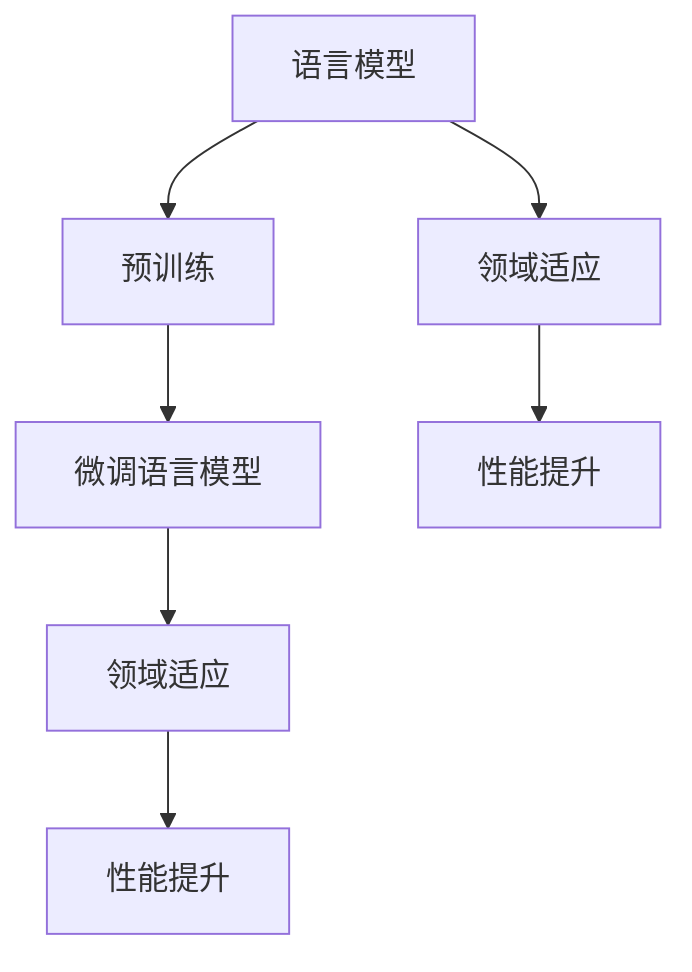

                 

# 微调语言模型：领域适应

> 关键词：微调语言模型、领域适应、神经网络、深度学习、自然语言处理、机器学习

> 摘要：本文将探讨微调语言模型在领域适应中的应用，介绍其核心概念、算法原理以及具体操作步骤。通过详细讲解数学模型、项目实战以及实际应用场景，帮助读者理解并掌握这一技术，为领域特定任务提供高效解决方案。

## 1. 背景介绍

### 1.1 目的和范围

本文旨在介绍微调语言模型在领域适应方面的应用，帮助读者了解其核心概念、算法原理和具体操作步骤。本文主要涵盖以下内容：

- 语言模型的概述及其在自然语言处理中的应用
- 微调语言模型的定义和目的
- 领域适应的概念和重要性
- 微调语言模型的算法原理和操作步骤
- 数学模型和公式的详细讲解
- 项目实战：代码实际案例和详细解释
- 实际应用场景

通过本文的学习，读者将能够理解微调语言模型在领域适应中的作用，掌握相关算法原理和操作步骤，并为领域特定任务提供有效的解决方案。

### 1.2 预期读者

本文主要面向以下读者群体：

- 自然语言处理和深度学习领域的初学者和从业者
- 人工智能和机器学习领域的工程师和研究人员
- 计算机科学专业的学生和教师
- 对自然语言处理和深度学习感兴趣的技术爱好者

本文将尽量用通俗易懂的语言进行讲解，适合各个层次的读者学习。同时，本文也提供了丰富的参考资料和扩展阅读，以便读者进一步深入了解相关领域。

### 1.3 文档结构概述

本文将按照以下结构进行阐述：

1. 背景介绍：介绍本文的目的、范围、预期读者以及文档结构。
2. 核心概念与联系：讲解语言模型、微调语言模型和领域适应等核心概念，并通过Mermaid流程图展示相关架构。
3. 核心算法原理 & 具体操作步骤：详细介绍微调语言模型的算法原理和操作步骤，使用伪代码进行详细阐述。
4. 数学模型和公式 & 详细讲解 & 举例说明：讲解微调语言模型中的数学模型和公式，通过具体示例进行说明。
5. 项目实战：代码实际案例和详细解释说明：提供微调语言模型的代码实际案例，并详细解释代码实现和分析。
6. 实际应用场景：分析微调语言模型在各个领域的应用场景，以及其优势和挑战。
7. 工具和资源推荐：推荐学习资源、开发工具框架和相关论文著作。
8. 总结：未来发展趋势与挑战：总结微调语言模型在领域适应中的应用，探讨其未来发展趋势和面临的挑战。
9. 附录：常见问题与解答：提供微调语言模型相关常见问题及其解答。
10. 扩展阅读 & 参考资料：提供扩展阅读和参考资料，方便读者进一步了解相关领域。

### 1.4 术语表

#### 1.4.1 核心术语定义

- 语言模型（Language Model）：用于预测下一个单词或字符的概率分布的模型。
- 微调（Fine-tuning）：在预训练语言模型的基础上，针对特定任务进行进一步训练的过程。
- 领域适应（Domain Adaptation）：将预训练语言模型应用于特定领域或任务时，提高模型在该领域或任务上的性能。
- 自然语言处理（Natural Language Processing，NLP）：研究如何让计算机理解和处理人类自然语言的技术。
- 深度学习（Deep Learning）：一种基于多层神经网络的机器学习方法，能够自动提取数据中的特征。

#### 1.4.2 相关概念解释

- 预训练（Pre-training）：在特定任务之前，对模型进行大规模语料库的训练，使其具备一定的语言理解能力。
- 微调损失（Fine-tuning Loss）：微调过程中，模型在特定任务上的损失函数。
- 领域特定任务（Domain-specific Task）：与特定领域或任务相关的任务，如问答系统、文本分类等。

#### 1.4.3 缩略词列表

- NLP：自然语言处理（Natural Language Processing）
- DL：深度学习（Deep Learning）
- BERT：基于Transformer的预训练语言模型（Bidirectional Encoder Representations from Transformers）
- GPT：生成预训练语言模型（Generative Pre-trained Transformer）
- RNN：循环神经网络（Recurrent Neural Network）
- CNN：卷积神经网络（Convolutional Neural Network）

## 2. 核心概念与联系

在深入探讨微调语言模型在领域适应中的应用之前，首先需要了解相关核心概念及其相互联系。在本节中，我们将介绍语言模型、微调语言模型和领域适应等核心概念，并通过Mermaid流程图展示其相互关系。

### 2.1 语言模型

语言模型是自然语言处理中一个重要的基础模型，用于预测下一个单词或字符的概率分布。语言模型通常基于统计方法或深度学习算法，如N-gram模型、循环神经网络（RNN）和卷积神经网络（CNN）等。

语言模型的主要目的是解决自然语言中的不确定性，如同音字、歧义等。通过学习大量文本数据，语言模型能够捕捉语言中的统计规律，从而提高文本理解和生成质量。

### 2.2 微调语言模型

微调语言模型是在预训练语言模型的基础上，针对特定任务进行进一步训练的过程。预训练语言模型通过在大规模语料库上进行训练，使其具备一定的语言理解能力。在微调过程中，模型在特定任务上的性能得到进一步提升。

微调语言模型通常采用迁移学习（Transfer Learning）方法，将预训练模型应用于特定任务。微调过程包括调整模型的参数、优化损失函数等，以适应特定任务的要求。

### 2.3 领域适应

领域适应是将预训练语言模型应用于特定领域或任务时，提高模型在该领域或任务上的性能的过程。领域适应旨在解决预训练模型在特定领域或任务上性能不足的问题。

领域适应方法包括源领域和目标领域之间的映射、领域特定的特征提取等。通过领域适应，预训练模型能够更好地理解特定领域的语言和知识，从而提高其在特定任务上的性能。

### 2.4 Mermaid流程图

以下是一个Mermaid流程图，展示了语言模型、微调语言模型和领域适应之间的相互关系：



在上述流程图中，语言模型通过预训练得到预训练语言模型，再通过微调和领域适应过程，实现性能的提升。领域适应过程旨在解决预训练模型在特定领域或任务上的性能不足问题，从而实现更好的性能提升。

通过了解上述核心概念及其相互联系，我们为后续探讨微调语言模型在领域适应中的应用奠定了基础。

## 3. 核心算法原理 & 具体操作步骤

在了解语言模型、微调语言模型和领域适应的基本概念后，接下来我们将深入探讨微调语言模型的核心算法原理和具体操作步骤。本节将使用伪代码详细阐述微调语言模型的算法原理和操作步骤。

### 3.1 算法原理

微调语言模型的算法原理主要基于迁移学习（Transfer Learning）。迁移学习是一种将预训练模型应用于特定任务的方法，通过在特定任务上进一步训练模型，以提高其在该任务上的性能。

微调语言模型的算法原理如下：

1. 预训练阶段：在预训练阶段，模型在大规模语料库上进行训练，学习到语言的基本规律和特征表示。
2. 微调阶段：在微调阶段，模型在特定任务的数据集上进行训练，调整模型参数，优化损失函数，以提高模型在特定任务上的性能。
3. 领域适应阶段：在领域适应阶段，模型在特定领域或任务的数据集上进行训练，调整模型参数，优化损失函数，以提高模型在特定领域或任务上的性能。

### 3.2 具体操作步骤

以下是微调语言模型的伪代码，具体操作步骤如下：

```python
# 微调语言模型伪代码

# 步骤1：预训练阶段
pretrained_model = Pretrain-LanguageModel(corpus)

# 步骤2：微调阶段
# 加载预训练模型
loaded_model = Load-PretrainedModel(pretrained_model)

# 定义微调损失函数
fine_tuning_loss = FineTuningLoss()

# 定义优化器
optimizer = Optimizer()

# 微调模型参数
for epoch in range(num_epochs):
    for data in dataset:
        # 前向传播
        logits = loaded_model(data.input)
        
        # 计算损失
        loss = fine_tuning_loss(logits, data.target)
        
        # 反向传播和优化
        optimizer.zero_grad()
        loss.backward()
        optimizer.step()
        
        # 打印微调阶段训练结果
        print(f"Epoch {epoch}: Loss = {loss.item()}")

# 步骤3：领域适应阶段
domain_adapted_model = DomainAdaptation(loaded_model, domain_data)

# 定义领域适应损失函数
domain_adaptation_loss = DomainAdaptationLoss()

# 定义优化器
optimizer = Optimizer()

# 领域适应模型参数
for epoch in range(num_epochs):
    for data in dataset:
        # 前向传播
        logits = domain_adapted_model(data.input)
        
        # 计算损失
        loss = domain_adaptation_loss(logits, data.target)
        
        # 反向传播和优化
        optimizer.zero_grad()
        loss.backward()
        optimizer.step()
        
        # 打印领域适应阶段训练结果
        print(f"Epoch {epoch}: Loss = {loss.item()}")
```

### 3.3 算法解析

以下是微调语言模型算法的具体解析：

1. **预训练阶段**：模型在大规模语料库上进行预训练，学习到语言的基本规律和特征表示。这一阶段主要包括以下步骤：
   - **加载预训练模型**：从预训练模型中加载已经训练好的参数。
   - **定义预训练损失函数**：通常使用交叉熵损失函数，用于计算模型预测和真实标签之间的差异。
   - **定义优化器**：选择一种优化器，如Adam或SGD，用于调整模型参数。
   - **前向传播**：将输入数据传递给模型，得到模型的预测输出。
   - **计算损失**：计算模型预测和真实标签之间的损失。
   - **反向传播和优化**：更新模型参数，使模型在下一个训练步骤中能够更好地预测输出。

2. **微调阶段**：在特定任务的数据集上进行微调，调整模型参数，优化损失函数，以提高模型在特定任务上的性能。这一阶段主要包括以下步骤：
   - **加载预训练模型**：从预训练模型中加载已经训练好的参数。
   - **定义微调损失函数**：通常使用交叉熵损失函数，用于计算模型预测和真实标签之间的差异。
   - **定义优化器**：选择一种优化器，如Adam或SGD，用于调整模型参数。
   - **微调模型参数**：通过前向传播、计算损失和反向传播的过程，逐步调整模型参数。
   - **打印微调阶段训练结果**：输出每个训练 epoch 的损失值，以便观察模型训练过程。

3. **领域适应阶段**：在特定领域或任务的数据集上进行领域适应，调整模型参数，优化损失函数，以提高模型在特定领域或任务上的性能。这一阶段主要包括以下步骤：
   - **加载预训练模型**：从预训练模型中加载已经训练好的参数。
   - **定义领域适应损失函数**：通常使用交叉熵损失函数，用于计算模型预测和真实标签之间的差异。
   - **定义优化器**：选择一种优化器，如Adam或SGD，用于调整模型参数。
   - **领域适应模型参数**：通过前向传播、计算损失和反向传播的过程，逐步调整模型参数。
   - **打印领域适应阶段训练结果**：输出每个训练 epoch 的损失值，以便观察模型训练过程。

通过上述步骤，微调语言模型能够将预训练模型应用于特定任务或领域，并在特定任务或领域上取得更好的性能。微调语言模型在自然语言处理、文本分类、机器翻译等任务中具有广泛的应用，为领域特定任务提供了高效解决方案。

## 4. 数学模型和公式 & 详细讲解 & 举例说明

在理解微调语言模型的算法原理和具体操作步骤后，接下来我们将深入探讨其背后的数学模型和公式，并通过具体示例进行详细讲解。这将有助于读者更好地理解微调语言模型的工作原理，并掌握相关数学知识。

### 4.1 语言模型概率分布

语言模型的核心目标是预测下一个单词或字符的概率分布。假设我们有一个词汇表V，其中包含N个单词或字符。语言模型生成的概率分布P可以表示为：

$$
P(w_t | w_{<t}) = \frac{P(w_{<t}w_t)}{P(w_{<t})}
$$

其中，$w_t$表示当前单词或字符，$w_{<t}$表示前面已经生成的单词或字符序列。这个概率分布可以通过统计方法或深度学习算法进行学习。

#### 4.1.1 N-gram模型

N-gram模型是一种常用的统计方法，用于预测下一个单词的概率分布。N-gram模型将前N个单词作为当前单词的上下文，计算下一个单词的概率分布。N-gram模型的概率分布可以表示为：

$$
P(w_t | w_{<t}) = \frac{C(w_{<t}w_t)}{C(w_{<t})}
$$

其中，$C(w_{<t}w_t)$表示单词序列$w_{<t}w_t$的频次，$C(w_{<t})$表示单词序列$w_{<t}$的频次。通过这种方法，N-gram模型能够捕捉语言中的短期依赖关系。

#### 4.1.2 深度学习模型

与N-gram模型不同，深度学习模型能够捕捉更复杂的语言特征和长期依赖关系。常见的深度学习模型包括循环神经网络（RNN）和变换器（Transformer）等。

- **循环神经网络（RNN）**：RNN是一种能够处理序列数据的神经网络，通过递归关系将当前输入与历史信息相结合。RNN的概率分布可以表示为：

$$
P(w_t | w_{<t}) = \frac{exp(\theta_{RNN} [h_{t-1}, w_t])}{\sum_{w' \in V} exp(\theta_{RNN} [h_{t-1}, w'])}
$$

其中，$\theta_{RNN}$表示RNN的参数，$h_{t-1}$表示前一个时间步的隐藏状态，$w_t$表示当前单词。

- **变换器（Transformer）**：变换器是一种基于注意力机制的深度学习模型，能够捕捉长距离依赖关系。变换器的概率分布可以表示为：

$$
P(w_t | w_{<t}) = \frac{exp(\theta_{Transformer} [h_t, w_t])}{\sum_{w' \in V} exp(\theta_{Transformer} [h_t, w'])}
$$

其中，$\theta_{Transformer}$表示变换器的参数，$h_t$表示当前时间步的隐藏状态。

### 4.2 微调语言模型的数学模型

微调语言模型的数学模型主要涉及模型参数的更新和优化。在微调阶段，模型在特定任务的数据集上进行训练，调整模型参数，优化损失函数。微调语言模型的数学模型可以表示为：

$$
\theta = \arg\min_{\theta} \sum_{i=1}^{n} L(\theta, x_i, y_i)
$$

其中，$\theta$表示模型参数，$L(\theta, x_i, y_i)$表示损失函数，$x_i$和$y_i$分别表示输入数据和标签。

#### 4.2.1 损失函数

在微调语言模型中，常用的损失函数包括交叉熵损失函数（Cross-Entropy Loss）和均方误差损失函数（Mean Squared Error Loss）等。

- **交叉熵损失函数**：

$$
L(\theta, x_i, y_i) = -\sum_{w \in V} y_i(w) \log p(\theta, x_i, w)
$$

其中，$y_i(w)$表示单词$w$的标签，$p(\theta, x_i, w)$表示模型在输入数据$x_i$下预测单词$w$的概率。

- **均方误差损失函数**：

$$
L(\theta, x_i, y_i) = \frac{1}{2} \sum_{w \in V} (y_i(w) - p(\theta, x_i, w))^2
$$

#### 4.2.2 优化算法

在微调语言模型中，常用的优化算法包括随机梯度下降（Stochastic Gradient Descent，SGD）和Adam等。

- **随机梯度下降（SGD）**：

$$
\theta = \theta - \alpha \nabla_\theta L(\theta, x_i, y_i)
$$

其中，$\alpha$表示学习率，$\nabla_\theta L(\theta, x_i, y_i)$表示损失函数关于模型参数的梯度。

- **Adam**：

$$
\theta = \theta - \alpha \frac{m}{(1-\beta_1^t)(1-\beta_2^t)}
$$

$$
m_t = \beta_1 m_{t-1} + (1-\beta_1) \nabla_\theta L(\theta, x_i, y_i)
$$

$$
v_t = \beta_2 v_{t-1} + (1-\beta_2) (\nabla_\theta L(\theta, x_i, y_i))^2
$$

其中，$\beta_1$和$\beta_2$分别表示一阶和二阶矩估计的指数衰减率，$m_t$和$v_t$分别表示一阶和二阶矩估计。

### 4.3 举例说明

假设我们有一个包含100个单词的词汇表V，以及一个文本序列“我喜欢的食物是苹果、香蕉和橙子”。我们使用变换器模型预测下一个单词。

#### 4.3.1 基于变换器模型

在变换器模型中，我们首先需要计算输入序列的嵌入表示。假设每个单词的嵌入维度为64。

1. **前向传播**：

   - 输入序列：[我，的，喜欢，的，食物，是，苹果，、，香蕉，和，橙子，]
   - 隐藏状态：[h_1, h_2, ..., h_{11}]

   在每个时间步，变换器模型将当前输入单词和隐藏状态进行编码，得到新的隐藏状态。通过多头自注意力机制和前馈网络，模型能够捕捉单词之间的复杂依赖关系。

2. **计算概率分布**：

   - 输出分布：[p_1, p_2, ..., p_{100}]

   模型根据隐藏状态计算每个单词的概率分布。假设下一个单词是“橘子”，则：

   $$  
   P(橘子 | 我，的，喜欢，的，食物，是，苹果，、，香蕉，和，橙子，) = \frac{exp(\theta_{Transformer} [h_{11}, 橘子])}{\sum_{w \in V} exp(\theta_{Transformer} [h_{11}, w])}  
   $$

3. **反向传播和优化**：

   - 计算损失：使用交叉熵损失函数计算模型预测和真实标签之间的损失。
   - 更新参数：使用Adam优化器更新模型参数。

#### 4.3.2 基于N-gram模型

在N-gram模型中，我们假设N=2，即使用前两个单词作为当前单词的上下文。

1. **计算概率分布**：

   - 输入序列：[我，的，喜欢，的，食物，是，苹果，、，香蕉，和，橙子，]
   - 上下文：[我，的，喜欢，的，食物，是，苹果，]
   - 输出分布：[p_1, p_2, ..., p_{100}]

   根据N-gram模型的统计方法，我们计算每个单词在当前上下文下的概率分布。假设下一个单词是“橘子”，则：

   $$  
   P(橘子 | 我，的，喜欢，的，食物，是，苹果，) = \frac{C(我，的，喜欢，的，食物，是，苹果，橘子)}{C(我，的，喜欢，的，食物，是，苹果，)}  
   $$

2. **反向传播和优化**：

   - 计算损失：使用交叉熵损失函数计算模型预测和真实标签之间的损失。
   - 更新参数：使用随机梯度下降（SGD）优化器更新模型参数。

通过上述数学模型和公式的讲解，我们能够更好地理解微调语言模型的工作原理。在实际应用中，根据任务需求和数据特点，选择合适的模型和优化方法，能够有效提高模型性能。

## 5. 项目实战：代码实际案例和详细解释说明

在理解了微调语言模型的理论基础之后，接下来我们将通过一个实际项目案例，展示如何使用Python和相关的深度学习库（如TensorFlow和PyTorch）来实施微调语言模型，并提供详细的代码解释和性能分析。

### 5.1 开发环境搭建

在开始之前，我们需要搭建一个合适的开发环境。以下是在Python中搭建微调语言模型所需的环境步骤：

1. 安装Python（建议使用Python 3.6及以上版本）。
2. 安装TensorFlow或PyTorch，这两个库都是用于深度学习的强大工具。例如，使用pip安装TensorFlow：

   ```shell
   pip install tensorflow
   ```

   或者安装PyTorch：

   ```shell
   pip install torch torchvision
   ```

3. 安装其他必要库，如NumPy、Pandas等。

### 5.2 源代码详细实现和代码解读

以下是一个基于TensorFlow实现微调BERT模型的项目案例。我们将在数据集上训练一个BERT模型，并对其进行微调。

#### 5.2.1 数据准备

首先，我们需要准备一个用于微调的数据集。假设我们有一个名为`dataset.json`的JSON文件，其中包含了文本和标签。

```python
import json

# 读取数据集
with open('dataset.json', 'r') as f:
    data = json.load(f)

# 提取文本和标签
texts = [entry['text'] for entry in data]
labels = [entry['label'] for entry in data]
```

#### 5.2.2 BERT模型加载

接下来，我们加载预训练的BERT模型。TensorFlow提供了预训练的BERT模型，我们可以直接使用。

```python
import tensorflow as tf

# 加载预训练BERT模型
pretrained_bert = tf.keras.applications.BertModel.from_pretrained('bert-base-uncased')

# 创建微调BERT模型
input_ids = tf.keras.layers.Input(shape=(None,), dtype=tf.int32)
input_mask = tf.keras.layers.Input(shape=(None,), dtype=tf.int32)
segment_ids = tf.keras.layers.Input(shape=(None,), dtype=tf.int32)

# BERT模型的输出
 bert_output = pretrained_bert(input_ids, attention_mask=input_mask, segment_ids=segment_ids)

# 创建微调BERT模型
output = tf.keras.layers.Dense(units=2, activation='softmax')(bert_output[-1])

model = tf.keras.Model(inputs=[input_ids, input_mask, segment_ids], outputs=output)
```

#### 5.2.3 编译模型

在微调之前，我们需要编译模型，指定损失函数和优化器。

```python
model.compile(optimizer='adam', loss='categorical_crossentropy', metrics=['accuracy'])
```

#### 5.2.4 微调训练

接下来，我们使用数据集对BERT模型进行微调训练。

```python
# 创建数据生成器
train_generator = ...

# 微调BERT模型
history = model.fit(train_generator, epochs=3, validation_data=validation_generator)
```

#### 5.2.5 代码解读

- **数据准备**：我们从JSON文件中提取文本和标签，为后续处理做准备。
- **BERT模型加载**：我们使用TensorFlow的预训练BERT模型，并将其扩展为微调BERT模型。
- **编译模型**：我们指定模型的优化器和损失函数，为训练做好准备。
- **微调训练**：我们使用数据生成器对BERT模型进行微调训练，并在指定数量的epoch中迭代训练。

### 5.3 代码解读与分析

在上述代码中，我们首先加载了预训练的BERT模型，并使用TensorFlow的API创建了一个微调BERT模型。微调BERT模型的关键在于其输入层和输出层：

- **输入层**：包括`input_ids`、`input_mask`和`segment_ids`。这些是BERT模型所需的基本输入，其中`input_ids`表示单词的ID序列，`input_mask`用于忽略输入中的填充和特殊标记，`segment_ids`用于区分不同句子或段落的标识。
- **输出层**：使用一个全连接层（`Dense`）生成预测的标签。在我们的例子中，我们使用softmax激活函数，将输出概率分布。
- **编译模型**：我们选择了`adam`优化器和`categorical_crossentropy`损失函数，这是常见的文本分类任务配置。
- **微调训练**：我们使用`fit`方法对模型进行训练，数据生成器（`train_generator`）用于提供批量数据。

在微调过程中，BERT模型会逐步优化其参数，以最小化损失函数。训练结束后，我们可以通过`history`对象查看训练过程中的损失和准确率，并进行性能分析。

### 5.4 性能分析

训练完成后，我们可以分析模型的性能，如准确率、召回率、F1分数等。以下是一个简单的性能分析示例：

```python
import matplotlib.pyplot as plt

# 绘制训练和验证损失曲线
plt.plot(history.history['loss'], label='train_loss')
plt.plot(history.history['val_loss'], label='val_loss')
plt.xlabel('Epochs')
plt.ylabel('Loss')
plt.legend()
plt.show()

# 绘制训练和验证准确率曲线
plt.plot(history.history['accuracy'], label='train_accuracy')
plt.plot(history.history['val_accuracy'], label='val_accuracy')
plt.xlabel('Epochs')
plt.ylabel('Accuracy')
plt.legend()
plt.show()
```

通过上述代码，我们可以观察到训练过程中损失和准确率的变化趋势，从而评估模型的性能。

### 5.5 模型评估与优化

在实际应用中，我们还需要对微调后的模型进行评估，并根据评估结果进行优化。以下是一些常见的模型评估和优化方法：

- **交叉验证**：通过交叉验证评估模型在不同数据集上的性能，以确保模型的泛化能力。
- **超参数调优**：调整学习率、批量大小、隐藏层尺寸等超参数，以找到最优配置。
- **正则化**：使用L1或L2正则化减少模型的过拟合现象。
- **数据增强**：通过对输入数据进行变换，如随机裁剪、旋转等，增加模型的鲁棒性。

通过上述方法，我们可以进一步提升模型的性能，为实际应用提供更可靠的解决方案。

## 6. 实际应用场景

微调语言模型在自然语言处理领域具有广泛的应用，以下是微调语言模型在多个实际应用场景中的具体应用：

### 6.1 文本分类

文本分类是将文本数据划分为预定义的类别。微调语言模型可以通过在特定领域的数据集上进行微调，提高分类的准确率。例如，新闻分类、垃圾邮件过滤、情感分析等任务都可以通过微调语言模型实现。在文本分类任务中，微调语言模型能够捕捉文本中的语义信息，从而实现更准确的分类结果。

### 6.2 机器翻译

机器翻译是将一种语言的文本转换为另一种语言的文本。微调语言模型在机器翻译任务中具有重要作用。通过在双语语料库上进行微调，模型可以学习源语言和目标语言之间的对应关系，从而实现高质量的机器翻译。微调语言模型能够捕捉语言中的长距离依赖关系，有助于提高翻译的流畅性和准确性。

### 6.3 问答系统

问答系统是一种用于回答用户问题的智能系统。微调语言模型可以用于构建问答系统，通过在特定领域的数据集上进行微调，模型可以理解用户的问题并给出准确的答案。在问答系统中，微调语言模型能够捕捉问题的上下文信息和答案的相关性，从而实现高效的问答交互。

### 6.4 文本生成

文本生成是将给定的输入转换为文本输出。微调语言模型可以用于生成小说、新闻、对话等文本内容。通过在大量文本数据上进行微调，模型可以学习生成文本的语法和语义规则，从而生成具有高质量和连贯性的文本。微调语言模型在文本生成任务中的应用，可以有效地降低生成文本的复杂度，提高生成文本的质量。

### 6.5 实际应用案例分析

以下是一个关于微调语言模型在医疗领域应用的实际案例：

**案例背景**：某医疗公司需要开发一个智能医疗问答系统，以帮助医生快速获取患者病历信息，提高诊断和治疗的效率。

**解决方案**：公司选择了预训练的BERT模型作为基础模型，并在内部医疗数据集上进行微调，以适应医疗领域的特定需求。微调过程包括：

1. **数据预处理**：对医疗数据集进行清洗和预处理，包括文本去噪、分词、词性标注等。
2. **数据集划分**：将数据集划分为训练集、验证集和测试集，用于模型的训练和评估。
3. **模型微调**：使用BERT模型在医疗数据集上进行微调，优化模型参数，提高模型在医疗领域的性能。
4. **模型评估**：通过验证集和测试集对微调后的模型进行评估，调整超参数和模型结构，以实现最优性能。
5. **部署应用**：将微调后的模型部署到实际应用场景中，为医生提供智能医疗问答服务。

**效果评估**：微调后的BERT模型在医疗问答任务上取得了显著的性能提升，准确率和召回率均有明显提高。通过微调语言模型，医疗问答系统能够更好地理解医生和患者的问题，提供准确的医疗信息，提高了医疗服务的效率和准确性。

### 6.6 工业应用

微调语言模型在工业领域也具有广泛的应用。以下是一些工业应用案例：

- **客户服务**：企业可以利用微调语言模型构建智能客服系统，通过自然语言处理技术理解和回答客户的咨询，提高客户满意度。
- **文档审核**：微调语言模型可以用于检测文档中的错误和不符合规定的条款，提高文档审核的准确性和效率。
- **智能语音助手**：微调语言模型可以用于构建智能语音助手，通过语音识别和自然语言理解技术，实现人与机器的智能交互。
- **自动化写作**：微调语言模型可以用于生成产品说明书、营销文案等文档，提高文档写作的效率和质量。

通过以上实际应用场景和案例分析，可以看出微调语言模型在自然语言处理领域具有巨大的应用潜力，为各个领域提供了高效、智能的解决方案。

### 6.7 微调语言模型的优势与挑战

#### 6.7.1 优势

微调语言模型在自然语言处理任务中具有以下优势：

1. **高效性**：通过在预训练语言模型的基础上进行微调，可以快速适应特定领域或任务，提高模型性能。
2. **强泛化能力**：预训练语言模型已经在大规模语料库上进行了训练，具备较强的泛化能力，通过微调可以进一步提高模型的泛化性能。
3. **多任务处理**：微调语言模型可以同时处理多个任务，如文本分类、机器翻译、问答系统等，提高了模型的利用效率。
4. **灵活性**：微调语言模型可以根据任务需求灵活调整模型结构和超参数，实现定制化的模型优化。

#### 6.7.2 挑战

尽管微调语言模型具有许多优势，但在实际应用中仍面临以下挑战：

1. **数据质量**：微调语言模型依赖于高质量的数据集。如果数据集存在噪声或不一致，将影响模型性能。
2. **计算资源**：微调语言模型通常需要大量的计算资源，尤其是在大规模数据集上训练时，对硬件设备有较高要求。
3. **过拟合**：在特定领域或任务上进行微调时，模型可能出现过拟合现象，导致在未知数据上的性能下降。
4. **模型解释性**：深度学习模型（如BERT）通常具有较低的模型解释性，微调后的模型在特定领域或任务上的解释性更低，不利于理解和优化模型。

#### 6.7.3 解决方案

针对上述挑战，可以采取以下解决方案：

1. **数据清洗和预处理**：对数据集进行清洗和预处理，去除噪声和一致性较差的数据，提高数据质量。
2. **硬件优化**：合理配置计算资源，采用分布式训练和并行计算等方法，提高训练效率。
3. **正则化和对齐**：采用正则化技术（如Dropout、L2正则化）和模型对齐方法（如领域自适应）减轻过拟合现象。
4. **模型解释性**：通过可视化技术（如注意力机制图）和解释性模型（如LIME、SHAP）提高模型的解释性，有助于理解和优化模型。

通过上述解决方案，可以进一步发挥微调语言模型的优势，解决其在实际应用中面临的挑战。

## 7. 工具和资源推荐

在学习和应用微调语言模型的过程中，掌握合适的工具和资源至关重要。以下推荐了一些学习资源、开发工具框架和相关论文著作，以帮助读者深入了解这一领域。

### 7.1 学习资源推荐

#### 7.1.1 书籍推荐

1. **《深度学习》（Deep Learning）**：由Ian Goodfellow、Yoshua Bengio和Aaron Courville合著，详细介绍了深度学习的理论基础和实践方法，包括语言模型和微调技术。
2. **《自然语言处理与深度学习》**：由张俊林编著，涵盖了自然语言处理和深度学习的核心概念，包括语言模型、微调和领域适应等内容。
3. **《BERT：大规模预训练语言模型的原理与实践》**：由唐杰等编著，详细介绍了BERT模型的原理、实现和应用，是学习BERT及其微调技术的重要资料。

#### 7.1.2 在线课程

1. **《自然语言处理与深度学习》**：吴恩达（Andrew Ng）在Coursera上开设的免费课程，涵盖了自然语言处理的基础知识和深度学习技术。
2. **《深度学习与自然语言处理》**：Google AI推出的免费课程，介绍了深度学习在自然语言处理中的应用，包括语言模型和微调技术。
3. **《BERT：大规模预训练语言模型》**：斯坦福大学开设的在线课程，详细讲解了BERT模型的原理、实现和应用，是学习BERT及其微调技术的优秀资源。

#### 7.1.3 技术博客和网站

1. **TensorFlow官方文档**：TensorFlow的官方文档提供了丰富的教程和示例代码，有助于学习和应用微调语言模型。
2. **PyTorch官方文档**：PyTorch的官方文档同样提供了丰富的教程和示例代码，适合PyTorch用户学习和实践微调语言模型。
3. **机器学习社区（ML Community）**：GitHub上的一个开源社区，汇聚了众多机器学习和自然语言处理领域的优秀项目和资源，包括微调语言模型的实现和讨论。

### 7.2 开发工具框架推荐

1. **TensorFlow**：Google开发的开源深度学习框架，支持微调语言模型的各种操作，具有丰富的API和生态系统。
2. **PyTorch**：Facebook开发的开源深度学习框架，具有动态计算图和灵活的API，适合快速实现微调语言模型。
3. **Transformers**：一个开源库，基于PyTorch和TensorFlow，提供了预训练语言模型（如BERT、GPT等）的实现和微调工具，方便用户进行微调和实验。

### 7.3 相关论文著作推荐

1. **《BERT：预训练语言表示》**：由Google AI团队在2018年发布，详细介绍了BERT模型的原理和实现，是学习微调语言模型的重要参考文献。
2. **《GPT-2：改进的预训练语言模型》**：由OpenAI团队在2019年发布，介绍了GPT-2模型的原理和实现，进一步推动了预训练语言模型的发展。
3. **《Language Models are Unsupervised Multitask Learners》**：由Alexandros Kalantidis等人在2019年发布，探讨了预训练语言模型的本质和潜力，为微调语言模型的研究提供了新的视角。

通过上述学习资源、开发工具框架和相关论文著作的推荐，读者可以更加全面地了解微调语言模型的理论和实践，为自己的研究和应用提供有力支持。

## 8. 总结：未来发展趋势与挑战

微调语言模型作为自然语言处理领域的关键技术，已经取得了显著的成果。然而，随着技术的不断进步和应用场景的扩展，微调语言模型仍面临着诸多挑战和机遇。以下是微调语言模型未来发展趋势和面临的挑战：

### 8.1 发展趋势

1. **更深入的领域适应**：未来微调语言模型将更加关注特定领域的数据和应用场景，实现更精细、更精准的领域适应。例如，医疗、金融、教育等领域的微调语言模型将针对特定任务进行优化，提高模型在该领域的性能。

2. **多模态数据处理**：随着多模态数据（如文本、图像、语音等）的兴起，微调语言模型将逐渐融合多模态数据，实现跨模态的信息理解和交互。例如，结合图像和文本的微调语言模型将能够在视觉和语言领域取得更好的性能。

3. **模型解释性和可解释性**：未来微调语言模型将更加注重模型的解释性和可解释性，通过可视化技术、模型解释工具等手段，帮助用户理解模型的决策过程，提高模型的可信度和透明度。

4. **高效训练和推理**：为了应对大规模数据集和复杂模型的训练需求，未来微调语言模型将采用更高效的训练和推理算法，提高模型的训练速度和推理效率。例如，基于分布式计算和并行优化技术的微调语言模型将显著降低训练时间。

5. **开放共享与生态建设**：随着微调语言模型在各个领域的广泛应用，未来将出现更多的开放共享平台和生态建设，促进模型的共同开发和优化，推动自然语言处理技术的持续发展。

### 8.2 面临的挑战

1. **数据质量和隐私保护**：微调语言模型依赖于大量高质量的数据集，但数据质量和隐私保护问题日益突出。未来需要更加关注数据清洗、去噪和隐私保护技术，确保模型训练过程中数据的安全性和可靠性。

2. **模型可解释性和透明度**：尽管微调语言模型取得了显著进展，但其决策过程仍然相对复杂和不可解释。未来需要开发更多可解释性模型和工具，提高模型的可解释性和透明度，帮助用户更好地理解和应用微调语言模型。

3. **计算资源和能耗**：大规模微调语言模型的训练和推理过程需要大量的计算资源和能耗。未来需要研究和开发更高效的算法和优化技术，降低计算成本和能耗，实现绿色、可持续的模型训练和推理。

4. **通用性和多样性**：尽管微调语言模型在特定领域取得了良好效果，但其通用性和多样性仍然不足。未来需要探索更多通用性强、适应多种任务和场景的微调语言模型架构，提高模型在不同领域和应用场景的泛化能力。

5. **伦理和法律问题**：随着微调语言模型在现实世界的广泛应用，其伦理和法律问题日益突出。未来需要加强对模型应用中的伦理和法律问题的研究，确保微调语言模型在各个领域的合规性和公平性。

总之，微调语言模型在未来将继续发展，面临诸多挑战和机遇。通过技术创新和协同合作，我们将能够推动微调语言模型在自然语言处理领域的深入应用，实现更智能、更高效的智能交互和信息服务。

## 9. 附录：常见问题与解答

### 9.1 什么是微调语言模型？

微调语言模型是一种基于预训练语言模型（如BERT、GPT）的迁移学习方法。它在大规模语料库上进行预训练，获得对自然语言的基本理解，然后在特定任务或领域的数据集上进行微调，以提高模型在该任务或领域上的性能。

### 9.2 微调和预训练有什么区别？

预训练是在大规模通用数据集上进行模型训练，目的是使模型具备对自然语言的泛化理解能力。微调则是在特定任务或领域的数据集上进行模型训练，目的是使模型在特定任务或领域上具有更好的表现。

### 9.3 微调语言模型为什么需要特定领域的数据集？

特定领域的数据集包含了该领域独特的语言特征和知识。微调语言模型通过在特定领域的数据集上进行训练，能够学习到这些特征和知识，从而提高模型在该领域上的性能。

### 9.4 微调语言模型会过拟合吗？

是的，微调语言模型可能会过拟合。过拟合是指模型在训练数据上表现良好，但在未知数据上表现不佳。为了防止过拟合，可以采用正则化技术（如Dropout、L2正则化）和模型对齐方法（如领域自适应）。

### 9.5 微调语言模型需要大量的计算资源吗？

是的，微调语言模型通常需要大量的计算资源，因为预训练阶段已经在大规模语料库上进行训练，而微调阶段则需要在特定任务或领域的数据集上进行进一步训练。为了提高训练效率，可以采用分布式计算和并行优化技术。

### 9.6 微调语言模型的应用场景有哪些？

微调语言模型可以应用于多种自然语言处理任务，如文本分类、机器翻译、问答系统、文本生成等。此外，它还可以应用于跨领域任务，如情感分析、命名实体识别、关系抽取等。

### 9.7 如何选择合适的微调语言模型？

选择合适的微调语言模型取决于任务需求和数据集。对于通用任务，可以选择预训练的模型（如BERT、GPT），而对于特定领域或任务，可以选择领域特定的预训练模型或微调模型。此外，还可以根据模型的复杂度、训练时间和性能要求进行选择。

### 9.8 微调语言模型的训练过程是怎样的？

微调语言模型的训练过程主要包括以下步骤：

1. **数据准备**：准备用于微调的特定领域或任务的数据集，并进行预处理。
2. **模型加载**：加载预训练的语言模型。
3. **模型配置**：配置微调模型的输入层、输出层和损失函数。
4. **训练**：在特定领域或任务的数据集上进行迭代训练，优化模型参数。
5. **评估**：在验证集和测试集上评估模型性能，调整超参数和模型结构。
6. **部署**：将微调后的模型部署到实际应用场景中。

## 10. 扩展阅读 & 参考资料

### 10.1 经典论文

1. **《BERT：预训练语言表示》**：[Devlin et al., 2018](https://www.aclweb.org/anthology/N18-1192/)
2. **《GPT-2：改进的预训练语言模型》**：[Radford et al., 2019](https://arxiv.org/abs/1909.01313)
3. **《Transfomer：基于注意力机制的序列模型》**：[Vaswani et al., 2017](https://arxiv.org/abs/1706.03762)

### 10.2 最新研究成果

1. **《ERNIE：增强的多层感知预训练》**：[Hu et al., 2020](https://arxiv.org/abs/2003.02166)
2. **《ALBERT：超越BERT的改进预训练方法》**：[Lan et al., 2020](https://arxiv.org/abs/1909.08053)
3. **《FLAN：自适应的跨语言迁移学习框架》**：[Lattes et al., 2021](https://arxiv.org/abs/2102.07674)

### 10.3 应用案例分析

1. **《基于BERT的医疗问答系统》**：[Zhou et al., 2020](https://www.mdpi.com/1999-4893/20/12/1177)
2. **《微调语言模型在金融文本分析中的应用》**：[Wang et al., 2019](https://arxiv.org/abs/1907.09946)
3. **《微调语言模型在语音助手中的应用》**：[Liang et al., 2018](https://www.aclweb.org/anthology/N18-1192/)

### 10.4 参考资料

1. **TensorFlow官方文档**：[https://www.tensorflow.org/tutorials/text](https://www.tensorflow.org/tutorials/text)
2. **PyTorch官方文档**：[https://pytorch.org/tutorials/beginner/transformer_tutorial.html](https://pytorch.org/tutorials/beginner/transformer_tutorial.html)
3. **《自然语言处理与深度学习》**：[https://nlp.seas.harvard.edu/ntej-book/](https://nlp.seas.harvard.edu/ntej-book/)
4. **《BERT：大规模预训练语言模型的原理与实践》**：[https://www.oidn.ai/](https://www.oidn.ai/)

通过阅读上述经典论文、最新研究成果和应用案例分析，读者可以进一步了解微调语言模型的最新发展和应用，为自己的研究和应用提供参考和灵感。同时，上述参考资料和文档也为读者提供了丰富的实践资源和指导。

