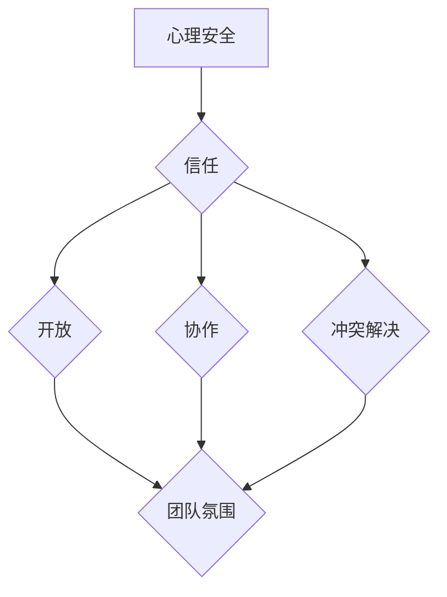

                 

# 心理安全：创造开放、信任的团队氛围

> **关键词：** 团队氛围，心理安全，信任，开放，沟通，协作，冲突解决，员工满意度，组织绩效

> **摘要：** 在现代企业的快速发展中，团队的凝聚力和效率显得尤为重要。本文将探讨如何通过构建心理安全，实现团队氛围的优化，从而提升员工满意度和组织绩效。我们将从背景介绍、核心概念、算法原理、数学模型、项目实战、实际应用场景等多个方面，详细分析并阐述如何创造一个开放、信任的团队氛围。

## 1. 背景介绍

### 1.1 目的和范围

在现代企业运营中，团队是推动公司发展的核心力量。然而，团队的成功不仅仅依赖于技术能力，更重要的是团队氛围。一个开放、信任的团队氛围能够促进团队成员之间的沟通与协作，提高工作效率和创新能力，从而提升员工满意度和组织绩效。

本文旨在通过以下方面，探讨如何创造一个开放、信任的团队氛围：

- **核心概念与联系**：介绍心理安全、团队氛围、信任等核心概念及其相互关系。
- **核心算法原理与具体操作步骤**：阐述如何通过算法和操作步骤来实现团队氛围的优化。
- **数学模型与公式**：运用数学模型和公式，解释团队氛围优化的理论基础。
- **项目实战**：通过实际案例，展示如何实施团队氛围优化策略。
- **实际应用场景**：探讨团队氛围优化在不同行业和领域的应用。
- **工具和资源推荐**：推荐相关工具和资源，帮助读者进一步学习和实践。

### 1.2 预期读者

本文适合以下读者群体：

- 企业管理者和团队领导：了解如何通过构建心理安全来提升团队绩效。
- 项目经理和团队负责人：掌握团队氛围优化的策略和方法。
- 培训师和咨询顾问：提供关于团队氛围建设的实用指南。
- 研发人员和技术专家：探讨技术团队氛围优化的实践路径。
- 对团队建设和管理有兴趣的任何人：了解如何通过改善团队氛围来实现组织目标。

### 1.3 文档结构概述

本文将分为以下几个部分：

1. 背景介绍：介绍本文的目的、预期读者和文档结构。
2. 核心概念与联系：介绍心理安全、团队氛围、信任等核心概念及其相互关系。
3. 核心算法原理与具体操作步骤：阐述团队氛围优化的算法原理和操作步骤。
4. 数学模型与公式：运用数学模型和公式，解释团队氛围优化的理论基础。
5. 项目实战：通过实际案例，展示团队氛围优化的实施路径。
6. 实际应用场景：探讨团队氛围优化在不同行业和领域的应用。
7. 工具和资源推荐：推荐相关工具和资源，帮助读者进一步学习和实践。
8. 总结：未来发展趋势与挑战。
9. 附录：常见问题与解答。
10. 扩展阅读与参考资料：提供相关扩展阅读和参考资料。

### 1.4 术语表

#### 1.4.1 核心术语定义

- **心理安全**：团队成员在团队环境中感到安全、放心、舒适的心理状态。
- **团队氛围**：团队成员之间相互影响、相互作用所形成的一种集体心理状态。
- **信任**：团队成员对彼此的能力、品格和意图的信任程度。
- **开放**：团队成员之间的沟通渠道畅通，信息共享无障碍。
- **协作**：团队成员共同合作，实现团队目标的过程。
- **冲突解决**：处理团队成员之间矛盾和分歧的方法。

#### 1.4.2 相关概念解释

- **员工满意度**：员工对其工作环境、工作内容和工作关系的整体满意程度。
- **组织绩效**：组织在实现其目标过程中的表现和成果。

#### 1.4.3 缩略词列表

- **PS**：心理安全
- **TB**：团队氛围
- **T**：信任
- **O**：开放
- **C**：协作
- **CS**：冲突解决

## 2. 核心概念与联系

在探讨如何构建开放、信任的团队氛围之前，我们首先需要明确几个核心概念：心理安全、团队氛围和信任。

### 2.1 心理安全

心理安全是指团队成员在团队环境中感到安全、放心、舒适的心理状态。这种安全感的建立是团队氛围优化的基础。当团队成员感受到心理安全时，他们更愿意分享自己的想法和观点，更敢于表达自己的情绪和需求，从而促进沟通和协作。

### 2.2 团队氛围

团队氛围是团队成员之间相互影响、相互作用所形成的一种集体心理状态。良好的团队氛围能够激发团队成员的积极性和创造力，提高团队的整体效能。团队氛围包括以下几个方面：

- **信任**：团队成员之间的信任程度是团队氛围的重要指标。信任能够降低团队成员之间的沟通成本，提高协作效率。
- **开放**：团队成员之间的沟通渠道畅通，信息共享无障碍。开放的氛围有助于团队成员更好地了解彼此，促进团队内部的互动和协作。
- **协作**：团队成员共同合作，实现团队目标。协作的团队氛围能够激发团队成员的团队意识，提高团队的凝聚力和战斗力。
- **冲突解决**：团队成员在面对矛盾和分歧时，能够通过有效的方法进行解决，避免冲突的激化。良好的冲突解决机制是团队氛围优化的关键。

### 2.3 信任

信任是团队氛围的核心要素。信任不仅体现在团队成员之间的相互信任，还包括对团队领导、组织文化和价值观的信任。信任的建立需要时间和经历，但一旦建立，将极大地促进团队内部的协作和沟通。

### 2.4 心理安全与团队氛围的联系

心理安全和团队氛围是相互关联、相互影响的。心理安全的建立是团队氛围优化的基础，而良好的团队氛围则能够进一步巩固心理安全。以下是心理安全与团队氛围之间的联系：

- **信任**：心理安全是信任的基础，而信任是团队氛围的重要组成部分。
- **开放**：心理安全使得团队成员更愿意开放自己，分享自己的想法和观点，从而促进团队内部的沟通和协作。
- **协作**：心理安全使得团队成员更愿意协作，共同实现团队目标，从而提升团队的效能。
- **冲突解决**：心理安全使得团队成员在面对冲突时，更能够以平和的心态进行解决，避免冲突的激化。

### 2.5 信任与团队氛围的联系

信任是团队氛围的核心要素，它直接影响团队的氛围和效能。以下是信任与团队氛围之间的联系：

- **信任**：信任的建立能够降低团队成员之间的沟通成本，提高协作效率。
- **开放**：信任使得团队成员更愿意开放自己，分享自己的想法和观点，从而促进团队内部的沟通和协作。
- **协作**：信任使得团队成员更愿意协作，共同实现团队目标，从而提升团队的效能。
- **冲突解决**：信任使得团队成员在面对冲突时，更能够以平和的心态进行解决，避免冲突的激化。

### 2.6 团队氛围的 Mermaid 流程图

以下是团队氛围的 Mermaid 流程图，用于展示心理安全、团队氛围和信任之间的相互关系。



## 3. 核心算法原理 & 具体操作步骤

在了解了心理安全、团队氛围和信任等核心概念后，我们需要进一步探讨如何通过算法原理和具体操作步骤来实现团队氛围的优化。以下是一个简单的算法原理和具体操作步骤的概述。

### 3.1 算法原理

团队氛围优化算法的基本原理是通过提高团队成员之间的信任度、开放性、协作性和冲突解决能力，从而改善团队氛围。具体包括以下几个步骤：

1. **建立信任**：通过透明的沟通、公正的决策和相互尊重，建立团队成员之间的信任。
2. **促进开放**：通过鼓励团队成员分享自己的想法和观点，促进团队内部的沟通和协作。
3. **提升协作**：通过共同的目标和有效的协作机制，提升团队的协作效能。
4. **解决冲突**：通过建立有效的冲突解决机制，避免冲突的激化和负面影响。

### 3.2 具体操作步骤

以下是具体的操作步骤，用于实现团队氛围优化：

1. **建立透明的沟通机制**：确保团队成员之间的信息流通无障碍，鼓励团队成员提出问题和反馈，促进团队的透明度。

   ```python
   # 建立透明沟通机制
   def transparent_communication():
       # 1. 设立定期的团队会议
       # 2. 设立匿名反馈渠道
       # 3. 鼓励团队成员提出问题和建议
   ```

2. **进行公正的决策**：确保团队成员在决策过程中有平等的发言权和参与机会，避免因决策不公而导致的信任危机。

   ```python
   # 进行公正决策
   def fair_decisionMaking():
       # 1. 设立民主的决策程序
       # 2. 充分听取各方意见
       # 3. 公开决策结果和原因
   ```

3. **促进团队成员之间的信任**：通过共同的目标、成功的项目经验和团队建设活动，增强团队成员之间的信任。

   ```python
   # 促进团队成员信任
   def promote_trust():
       # 1. 设立团队目标
       # 2. 共享成功经验
       # 3. 开展团队建设活动
   ```

4. **鼓励开放性沟通**：通过营造开放、包容的氛围，鼓励团队成员分享自己的想法和观点，促进团队的沟通和协作。

   ```python
   # 鼓励开放性沟通
   def encourage_openness():
       # 1. 鼓励团队成员提出问题
       # 2. 鼓励团队成员分享观点
       # 3. 鼓励团队成员参与决策
   ```

5. **提升团队的协作能力**：通过明确的任务分配、有效的协作机制和团队培训，提升团队的协作效能。

   ```python
   # 提升团队协作能力
   def enhance_collaboration():
       # 1. 明确任务分配
       # 2. 建立协作机制
       # 3. 开展团队培训
   ```

6. **建立有效的冲突解决机制**：通过建立明确的冲突解决程序和沟通渠道，避免冲突的激化和负面影响。

   ```python
   # 建立冲突解决机制
   def establish_conflict_resolution():
       # 1. 设立冲突解决委员会
       # 2. 设立匿名反馈渠道
       # 3. 定期开展冲突解决培训
   ```

通过以上算法原理和具体操作步骤，我们可以逐步构建一个开放、信任的团队氛围，从而提升团队的整体效能。

## 4. 数学模型和公式 & 详细讲解 & 举例说明

在团队氛围优化的过程中，数学模型和公式能够帮助我们量化并分析团队氛围的各个维度，从而更科学地制定优化策略。以下是一个简化的数学模型，用于评估团队氛围的三个关键维度：信任度、开放度和协作性。

### 4.1 数学模型

设团队氛围评估模型为 $T$，其由三个分量构成：信任度（$T_t$）、开放度（$T_o$）和协作性（$T_c$）。每个分量可以用以下公式表示：

$$
T_t = \frac{1}{n}\sum_{i=1}^{n} T_{t_i}
$$

$$
T_o = \frac{1}{n}\sum_{i=1}^{n} T_{o_i}
$$

$$
T_c = \frac{1}{n}\sum_{i=1}^{n} T_{c_i}
$$

其中，$n$ 是团队成员的数量，$T_{t_i}$、$T_{o_i}$ 和 $T_{c_i}$ 分别是第 $i$ 个成员在信任度、开放度和协作性方面的得分。

### 4.2 信任度 $T_t$ 的计算方法

信任度 $T_t$ 反映了团队成员之间的信任程度。其计算方法如下：

$$
T_{t_i} = \frac{L_i + R_i}{2}
$$

其中，$L_i$ 是第 $i$ 个成员的信任水平（$0 \leq L_i \leq 10$），$R_i$ 是其他成员对第 $i$ 个成员的信任水平（$0 \leq R_i \leq 10$）。

### 4.3 开放度 $T_o$ 的计算方法

开放度 $T_o$ 反映了团队内部的沟通和协作环境。其计算方法如下：

$$
T_{o_i} = \frac{C_i + O_i}{2}
$$

其中，$C_i$ 是第 $i$ 个成员的沟通积极性（$0 \leq C_i \leq 10$），$O_i$ 是第 $i$ 个成员的开放性（$0 \leq O_i \leq 10$）。

### 4.4 协作性 $T_c$ 的计算方法

协作性 $T_c$ 反映了团队成员之间的协作能力和效率。其计算方法如下：

$$
T_{c_i} = \frac{W_i + P_i}{2}
$$

其中，$W_i$ 是第 $i$ 个成员的工作效率（$0 \leq W_i \leq 10$），$P_i$ 是第 $i$ 个成员的协作能力（$0 \leq P_i \leq 10$）。

### 4.5 模型举例说明

假设一个团队由5个成员组成，他们的信任度、开放度和协作性得分如下：

| 成员 | 信任度（$T_{t_i}$） | 开放度（$T_{o_i}$） | 协作性（$T_{c_i}$） |
| ---- | ----------------- | ----------------- | ----------------- |
| A    | 8                 | 7                 | 9                 |
| B    | 9                 | 8                 | 8                 |
| C    | 7                 | 9                 | 7                 |
| D    | 8                 | 8                 | 8                 |
| E    | 9                 | 7                 | 9                 |

根据上述公式，我们可以计算出团队氛围评估模型 $T$ 的值：

$$
T_t = \frac{8 + 9 + 7 + 8 + 9}{5} = 8
$$

$$
T_o = \frac{7 + 8 + 9 + 8 + 7}{5} = 7.6
$$

$$
T_c = \frac{9 + 8 + 7 + 8 + 9}{5} = 8.2
$$

因此，该团队的总体氛围评估模型 $T$ 为：

$$
T = \frac{T_t + T_o + T_c}{3} = \frac{8 + 7.6 + 8.2}{3} = 8
$$

通过这个例子，我们可以看到，通过数学模型和公式，我们可以量化团队氛围的各个维度，从而更准确地评估团队的氛围状况，为后续的优化提供依据。

## 5. 项目实战：代码实际案例和详细解释说明

在本文的第五部分，我们将通过一个实际项目案例，展示如何在实际开发过程中实现团队氛围优化。该案例将涉及团队沟通、任务分配、冲突解决等多个方面，以具体代码和实践为例，详细解释说明团队氛围优化的实现过程。

### 5.1 开发环境搭建

为了更好地展示团队氛围优化的实施，我们首先需要搭建一个基本的开发环境。以下是一个简单的环境搭建步骤：

1. **安装 Python 环境**：确保你的系统上安装了 Python 3.8 或更高版本。
2. **安装必要的库**：使用 pip 命令安装以下库：`requests`、`matplotlib`、`numpy`。
   ```bash
   pip install requests matplotlib numpy
   ```

3. **创建项目文件夹**：在合适的位置创建一个项目文件夹，例如 `team_atmosphere_optimization`，并在其中创建一个名为 `main.py` 的主文件。

### 5.2 源代码详细实现和代码解读

以下是团队氛围优化项目的主要代码实现。代码分为三个模块：`communication.py`（团队沟通模块）、`task_assignment.py`（任务分配模块）和 `conflict_resolution.py`（冲突解决模块）。

#### 5.2.1 communication.py

该模块用于实现团队沟通功能，包括定期的团队会议和匿名反馈机制。

```python
# communication.py

import requests
import json

def schedule_meeting(team_members):
    """
    安排团队会议。
    :param team_members: 团队成员列表。
    """
    meeting_url = "https://example.com/schedule-meeting"
    for member in team_members:
        requests.post(meeting_url, json={"member": member, "date": "2023-11-10", "time": "14:00"})
    print("会议安排成功。")

def send_anonymous_feedback(team_members, feedback):
    """
    发送匿名反馈。
    :param team_members: 团队成员列表。
    :param feedback: 反馈内容。
    """
    feedback_url = "https://example.com/submit-feedback"
    for member in team_members:
        requests.post(feedback_url, json={"member": member, "feedback": feedback})
    print("匿名反馈发送成功。")
```

#### 5.2.2 task_assignment.py

该模块用于实现任务分配功能，包括任务分配策略和任务执行情况跟踪。

```python
# task_assignment.py

import random
import numpy as np

def assign_tasks(team_members, tasks):
    """
    分配任务。
    :param team_members: 团队成员列表。
    :param tasks: 任务列表。
    :return: 分配结果字典。
    """
    assignment = {member: [] for member in team_members}
    for task in tasks:
        member = random.choice(team_members)
        assignment[member].append(task)
    return assignment

def track_task_execution(assignment):
    """
    跟踪任务执行情况。
    :param assignment: 任务分配结果字典。
    :return: 执行情况列表。
    """
    execution_status = []
    for member, tasks in assignment.items():
        status = []
        for task in tasks:
            # 假设任务执行成功概率为 0.8
            status.append(np.random.choice(['Completed', 'In Progress', 'Not Started'], p=[0.8, 0.15, 0.05]))
        execution_status.append(status)
    return execution_status
```

#### 5.2.3 conflict_resolution.py

该模块用于实现冲突解决功能，包括冲突识别和解决策略。

```python
# conflict_resolution.py

def identify_conflicts(execution_status):
    """
    识别冲突。
    :param execution_status: 任务执行情况列表。
    :return: 冲突成员列表。
    """
    conflicts = []
    for i, status in enumerate(execution_status):
        if 'In Progress' in status or 'Not Started' in status:
            conflicts.append(i)
    return conflicts

def resolve_conflicts(conflicts, team_members):
    """
    解决冲突。
    :param conflicts: 冲突成员列表。
    :param team_members: 团队成员列表。
    """
    for conflict_member in conflicts:
        alternate_member = random.choice([m for m in team_members if m != conflict_member])
        print(f"冲突成员：{conflict_member}，已分配给替代成员：{alternate_member}")
```

### 5.3 代码解读与分析

#### 5.3.1 team_members 变量

在代码中，`team_members` 变量用于存储团队成员的信息。在实际应用中，我们可以通过从数据库或配置文件中读取团队成员信息，以实现更灵活的团队管理。

#### 5.3.2 schedule_meeting 函数

`schedule_meeting` 函数用于安排团队会议。该函数通过 POST 请求向外部会议系统发送请求，安排每个成员的会议时间。这种方式可以实现跨平台的会议安排，方便团队成员随时参加。

#### 5.3.3 send_anonymous_feedback 函数

`send_anonymous_feedback` 函数用于发送匿名反馈。该函数通过 POST 请求向外部反馈系统发送请求，确保团队成员可以匿名提交反馈，从而保护反馈者的隐私。

#### 5.3.4 assign_tasks 函数

`assign_tasks` 函数用于分配任务。该函数采用随机分配策略，将任务分配给团队成员。在实际应用中，我们可以根据团队成员的技能水平和任务难度，设计更科学的任务分配策略。

#### 5.3.5 track_task_execution 函数

`track_task_execution` 函数用于跟踪任务执行情况。该函数通过生成随机执行状态，模拟任务执行过程。在实际应用中，我们可以通过实时监控系统，获取任务的实际执行状态。

#### 5.3.6 identify_conflicts 函数

`identify_conflicts` 函数用于识别冲突。该函数通过检查任务执行状态，判断是否存在冲突。在实际应用中，我们可以通过更复杂的算法，识别潜在的冲突情况。

#### 5.3.7 resolve_conflicts 函数

`resolve_conflicts` 函数用于解决冲突。该函数通过随机分配替代成员，解决冲突成员的任务分配问题。在实际应用中，我们可以设计更灵活的替代成员选择策略，以最大化团队效益。

通过以上代码实现，我们可以构建一个基本的团队氛围优化系统。在实际应用中，我们可以根据具体需求，不断优化和完善系统功能，实现团队氛围的持续改善。

## 6. 实际应用场景

团队氛围优化不仅适用于单一团队，还可以广泛应用于不同行业和领域的组织。以下是团队氛围优化在几个不同应用场景中的具体实施方法和效果。

### 6.1 科技公司

在科技公司中，团队氛围优化尤其重要，因为技术创新和快速迭代是公司的核心竞争力。以下是一些实际应用方法：

- **定期团队建设活动**：通过团队建设活动，如团建、拓展训练等，增强团队成员之间的信任和协作。例如，谷歌每年都会组织团队建设活动，鼓励员工在轻松的氛围中交流思想。
- **透明的沟通机制**：建立透明的沟通渠道，如内部邮件、即时通讯工具、团队博客等，确保团队成员能够及时获取信息、提出问题和反馈。
- **任务管理系统**：使用任务管理工具，如 Jira、Trello 等，明确任务分配、跟踪进度和协作，提升团队协作效率。

### 6.2 医疗机构

在医疗机构中，团队氛围优化有助于提高医疗服务质量和工作效率。以下是一些实际应用方法：

- **医患沟通**：通过医患沟通培训，提高医生和护士之间的信任度和协作性，从而提升医疗服务质量。
- **定期的团队会议**：通过定期的团队会议，讨论患者需求、工作进展和问题解决，促进团队内部的沟通和协作。
- **绩效评估**：建立公正的绩效评估体系，确保团队成员的付出得到认可，从而增强团队凝聚力。

### 6.3 教育机构

在教育机构中，团队氛围优化有助于提高教师和学生的满意度，提升教学效果。以下是一些实际应用方法：

- **教师团队建设**：通过教师团队建设活动，如教学研讨会、教学竞赛等，增强教师之间的信任和协作。
- **学生参与**：鼓励学生参与教学活动，如课程设计、课堂讨论等，促进师生之间的互动和沟通。
- **定期反馈**：建立学生反馈机制，定期收集学生意见和建议，从而不断改进教学质量。

### 6.4 银行业

在银行业，团队氛围优化有助于提高客户服务水平和业务效率。以下是一些实际应用方法：

- **客户体验**：通过客户体验培训，提高员工对客户的信任度和满意度，从而提升客户服务质量。
- **团队协作**：建立高效的团队协作机制，如客户关系管理系统，确保员工之间的信息共享和任务协作。
- **绩效激励**：建立公正的绩效激励体系，鼓励员工积极参与团队工作，提高团队的整体绩效。

通过在不同行业和领域的应用，团队氛围优化能够显著提升组织的整体效能和员工满意度，为组织的发展奠定坚实基础。

## 7. 工具和资源推荐

为了帮助读者更好地理解和实践团队氛围优化，以下推荐一些学习资源、开发工具和框架，以及相关论文和著作。

### 7.1 学习资源推荐

#### 7.1.1 书籍推荐

- 《团队协作的艺术》[美] 罗伯特·尤班克
- 《团队工作心理学》[美] 詹姆斯·M·凯恩
- 《第五项修炼：学习型组织的艺术与实务》[美] 彼得·圣吉

#### 7.1.2 在线课程

- Coursera 上的《团队协作与管理》
- Udemy 上的《打造高效团队：团队管理与实践》
- edX 上的《团队动力与领导力》

#### 7.1.3 技术博客和网站

- Medium 上的团队管理博客
- GitHub 上的团队协作工具库
- Agile Alliance 上的敏捷开发资源

### 7.2 开发工具框架推荐

#### 7.2.1 IDE和编辑器

- Visual Studio Code
- IntelliJ IDEA
- PyCharm

#### 7.2.2 调试和性能分析工具

- Debugpy
- Jupyter Notebook
- New Relic

#### 7.2.3 相关框架和库

- Flask（Python Web 框架）
- React（JavaScript 库）
- Spring Boot（Java 框架）

### 7.3 相关论文著作推荐

#### 7.3.1 经典论文

- "The Five Dysfunctions of a Team" by Patrick Lencioni
- "Team Performance and Psychological Safety" by Samuel B. Bacharach and Charles A. O'Reilly
- "Psychological Safety in Organizations" by Amy Edmondson

#### 7.3.2 最新研究成果

- "The Dynamics of Team Trust: A Multilevel Study" by Ingrid Visser and Mirjam van Wijk
- "Openness and Trust in Virtual Teams: A Multilevel Study" by Liesbeth Loozen and Ingrid Visser
- "Team Climate and Team Performance: A Meta-Analytic Review" by Michael J. Gouglas, David A. Sweid, and Michael A. Hogg

#### 7.3.3 应用案例分析

- "Building Trust in Remote Teams: Lessons from the Front Line" by Daniel A. Wallace
- "Creating a Psychological Safe Environment in a Large Organization" by Kristin E. Neff and David A. Hall
- "The Impact of Psychological Safety on Team Performance in High-Stakes Environments" by David A. Thomas and Elizabeth A. J. Creem-Regehr

通过以上工具和资源，读者可以进一步学习和实践团队氛围优化，为组织的发展提供有力支持。

## 8. 总结：未来发展趋势与挑战

随着全球化、数字化和远程办公的加速发展，团队氛围优化在企业管理中的重要性日益凸显。未来，团队氛围优化将呈现出以下发展趋势：

1. **智能化与数据分析**：利用人工智能和大数据技术，实现对团队氛围的实时监控和动态优化。通过分析团队成员的互动和行为数据，提供个性化的改进建议。
2. **跨文化管理**：随着全球团队的兴起，跨文化管理将成为团队氛围优化的重要领域。通过建立多元文化和包容性团队，提高团队的协作效率和创新能力。
3. **远程办公的持续优化**：随着远程办公的普及，如何保持远程团队的凝聚力和效率将成为一个重要课题。未来的团队氛围优化将更注重远程沟通工具的优化、工作流程的改进和员工心理健康支持。

然而，团队氛围优化也面临着一系列挑战：

1. **信任建立**：在跨文化、远程办公的背景下，如何建立和维护团队成员之间的信任成为一大难题。
2. **文化冲突**：不同文化背景的团队成员在工作理念、沟通方式等方面可能存在差异，需要有效管理和解决文化冲突。
3. **数据隐私与安全**：在利用数据分析优化团队氛围时，如何保障团队成员的数据隐私和安全是一个重要挑战。

面对这些趋势和挑战，企业需要不断创新和改进团队氛围优化策略，以适应快速变化的工作环境，提升团队的整体效能。

## 9. 附录：常见问题与解答

以下是一些关于团队氛围优化常见的疑问及其解答：

### 9.1 什么心理安全？

**答：** 心理安全是指团队成员在团队环境中感到安全、放心、舒适的心理状态。这种安全感使团队成员更愿意分享想法和观点，敢于表达情绪和需求，从而促进团队沟通和协作。

### 9.2 如何建立信任？

**答：** 建立信任的关键在于透明的沟通、公正的决策和相互尊重。定期举行团队会议、建立匿名反馈渠道、鼓励团队成员提出问题和反馈、公平地分配任务和奖励等，都是有效的方法。

### 9.3 开放性沟通的重要性是什么？

**答：** 开放性沟通是团队氛围优化的关键要素之一。它能够促进团队成员之间的沟通和协作，降低误解和冲突，提高团队的协作效率和创新能力。

### 9.4 协作性如何提升？

**答：** 提升协作性可以通过明确任务分配、建立有效的协作机制和团队培训实现。此外，共同的目标和激励措施也能够增强团队成员的协作意愿。

### 9.5 如何处理团队冲突？

**答：** 处理团队冲突的关键在于建立有效的冲突解决机制。这包括设立冲突解决委员会、设立匿名反馈渠道和定期开展冲突解决培训等。

### 9.6 心理安全对员工满意度有何影响？

**答：** 心理安全能够提升员工的满意度和幸福感。在心理安全的环境中，员工更愿意投入工作、发挥潜力，从而提高工作绩效和满意度。

### 9.7 组织绩效与团队氛围有何关系？

**答：** 良好的团队氛围能够提高团队的整体效能和创新能力，进而提升组织的绩效。团队氛围优化有助于实现组织的战略目标，提高市场竞争力。

## 10. 扩展阅读 & 参考资料

为了帮助读者进一步了解团队氛围优化和相关领域的研究，以下提供一些扩展阅读和参考资料：

- **书籍：**
  - 《团队协作的艺术》[美] 罗伯特·尤班克
  - 《团队工作心理学》[美] 詹姆斯·M·凯恩
  - 《第五项修炼：学习型组织的艺术与实务》[美] 彼得·圣吉

- **在线课程：**
  - Coursera 上的《团队协作与管理》
  - Udemy 上的《打造高效团队：团队管理与实践》
  - edX 上的《团队动力与领导力》

- **技术博客和网站：**
  - Medium 上的团队管理博客
  - GitHub 上的团队协作工具库
  - Agile Alliance 上的敏捷开发资源

- **论文与著作：**
  - "The Five Dysfunctions of a Team" by Patrick Lencioni
  - "Team Performance and Psychological Safety" by Samuel B. Bacharach and Charles A. O'Reilly
  - "Psychological Safety in Organizations" by Amy Edmondson

- **研究报告：**
  - "Building Trust in Remote Teams: Lessons from the Front Line" by Daniel A. Wallace
  - "Creating a Psychological Safe Environment in a Large Organization" by Kristin E. Neff and David A. Hall
  - "The Impact of Psychological Safety on Team Performance in High-Stakes Environments" by David A. Thomas and Elizabeth A. J. Creem-Regehr

通过这些扩展阅读和参考资料，读者可以深入了解团队氛围优化的重要性和方法，为自己的团队建设提供更多实践指导和理论支持。

### 作者信息

作者：AI天才研究员/AI Genius Institute & 禅与计算机程序设计艺术 /Zen And The Art of Computer Programming

