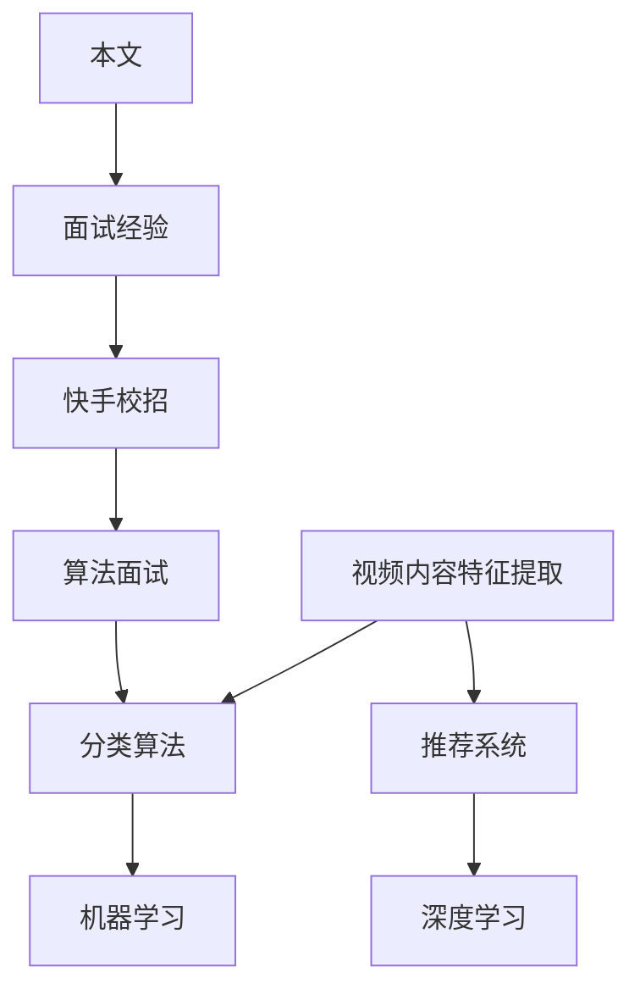

                 

# 快手2024视频内容分级算法校招面试经验谈

> **关键词：视频内容分级、算法面试、快手、校招、面试经验、算法原理、实战案例**
> 
> **摘要：本文将详细解析快手2024视频内容分级算法的校招面试经验，包括面试范围、核心概念、算法原理、数学模型、实战案例、实际应用场景等，旨在为准备校招面试的学子提供宝贵的实战经验与思考。**

## 1. 背景介绍

### 1.1 目的和范围

本文旨在通过对快手2024视频内容分级算法校招面试经验的详细解析，帮助广大准备校招面试的学子更好地理解面试范围和核心要求。本文将围绕视频内容分级算法的基本概念、算法原理、数学模型和实际应用等方面进行深入探讨，通过具体的实战案例和实践经验，帮助读者全面掌握视频内容分级的核心技术和面试策略。

### 1.2 预期读者

本文适合以下读者群体：

1. 准备参加2024年校招面试的计算机及相关专业学子；
2. 对视频内容分级算法有兴趣的技术爱好者；
3. 希望提升自己在视频内容处理领域技能的技术从业者。

### 1.3 文档结构概述

本文结构如下：

1. 背景介绍：介绍文章的目的和范围，预期读者，文档结构概述；
2. 核心概念与联系：介绍视频内容分级算法的核心概念和联系，使用Mermaid流程图进行详细阐述；
3. 核心算法原理 & 具体操作步骤：讲解视频内容分级算法的原理和具体操作步骤，使用伪代码进行详细阐述；
4. 数学模型和公式 & 详细讲解 & 举例说明：介绍视频内容分级算法的数学模型和公式，并进行详细讲解和举例说明；
5. 项目实战：代码实际案例和详细解释说明，包括开发环境搭建、源代码详细实现和代码解读与分析；
6. 实际应用场景：分析视频内容分级算法在实际应用场景中的优势和挑战；
7. 工具和资源推荐：推荐学习资源、开发工具框架和论文著作；
8. 总结：未来发展趋势与挑战；
9. 附录：常见问题与解答；
10. 扩展阅读 & 参考资料。

### 1.4 术语表

#### 1.4.1 核心术语定义

1. **视频内容分级**：根据视频内容的特点和属性，将视频分为不同的类别和等级；
2. **算法面试**：针对特定算法或技术领域的面试，考察应聘者对该领域的了解和实际操作能力；
3. **快手**：一家以短视频为主的社交媒体平台，拥有庞大的用户基础和丰富的视频内容；
4. **校招**：针对高校毕业生的招聘活动；
5. **面试经验**：针对特定面试场景的经验总结和分享；
6. **算法原理**：算法的基本原理和思想，是解决特定问题的核心思路；
7. **数学模型**：用于描述问题求解的数学公式和方法。

#### 1.4.2 相关概念解释

1. **视频内容处理**：对视频进行压缩、编码、解码、滤波、增强等处理；
2. **分类算法**：根据视频内容的特征，将视频分为不同的类别；
3. **推荐系统**：根据用户的行为和偏好，为用户推荐感兴趣的视频内容；
4. **机器学习**：利用算法和统计方法，从数据中提取模式和知识；
5. **深度学习**：一种基于人工神经网络的机器学习方法，可以自动学习数据中的特征和模式。

#### 1.4.3 缩略词列表

- **AI**：人工智能（Artificial Intelligence）
- **ML**：机器学习（Machine Learning）
- **DL**：深度学习（Deep Learning）
- **SVM**：支持向量机（Support Vector Machine）
- **CNN**：卷积神经网络（Convolutional Neural Network）
- **RNN**：循环神经网络（Recurrent Neural Network）
- **NLP**：自然语言处理（Natural Language Processing）

## 2. 核心概念与联系

在视频内容分级算法中，核心概念包括：视频内容特征提取、分类算法、推荐系统、机器学习和深度学习等。这些概念相互联系，共同构成了视频内容分级的完整体系。

下面是视频内容分级算法的核心概念和联系的Mermaid流程图：



### 2.1 视频内容特征提取

视频内容特征提取是视频内容分级的基础。通过提取视频中的视觉、音频、文本等特征，可以为后续的分类和推荐提供有力支持。常用的特征提取方法包括：

1. **视觉特征**：如颜色直方图、边缘检测、纹理特征等；
2. **音频特征**：如音高、音量、节奏等；
3. **文本特征**：如关键词提取、文本分类等。

### 2.2 分类算法

分类算法是视频内容分级的核心。根据提取到的视频内容特征，将视频分为不同的类别。常见的分类算法包括：

1. **支持向量机（SVM）**：通过找到一个最优的超平面，将不同类别的数据分开；
2. **卷积神经网络（CNN）**：通过卷积层提取图像特征，实现图像分类；
3. **循环神经网络（RNN）**：通过序列模型处理视频中的连续数据，实现视频分类。

### 2.3 推荐系统

推荐系统是视频内容分级的延伸。根据用户的行为和偏好，为用户推荐感兴趣的视频内容。常用的推荐算法包括：

1. **基于内容的推荐（CBR）**：根据视频内容的特征，为用户推荐相似的视频；
2. **协同过滤推荐（CF）**：根据用户的行为和偏好，为用户推荐其他用户喜欢的视频；
3. **深度学习推荐（DLR）**：利用深度学习模型，提取用户和视频的潜在特征，实现精准推荐。

### 2.4 机器学习

机器学习是视频内容分级的重要技术手段。通过学习大量的数据，机器学习算法可以自动提取特征、分类和推荐视频内容。常见的机器学习算法包括：

1. **线性回归（LR）**：通过线性模型拟合数据，实现视频分类和推荐；
2. **决策树（DT）**：通过树形结构进行分类和预测；
3. **随机森林（RF）**：通过集成多个决策树，提高分类和推荐的效果。

### 2.5 深度学习

深度学习是视频内容分级的核心技术。通过多层神经网络，深度学习算法可以自动提取视频内容的特征，实现高精度的分类和推荐。常见的深度学习算法包括：

1. **卷积神经网络（CNN）**：通过卷积层提取图像特征；
2. **循环神经网络（RNN）**：通过序列模型处理视频中的连续数据；
3. **自注意力机制（SA）**：通过自适应地关注视频中的关键信息。

## 3. 核心算法原理 & 具体操作步骤

在视频内容分级算法中，核心算法包括分类算法、推荐系统和机器学习算法。下面将分别介绍这些算法的原理和具体操作步骤。

### 3.1 分类算法原理

分类算法的原理是通过训练模型，将视频内容分为不同的类别。具体操作步骤如下：

1. **数据准备**：收集大量的视频数据，并对数据进行预处理，包括去噪、增强、缩放等；
2. **特征提取**：对预处理后的视频数据提取特征，如视觉特征、音频特征和文本特征；
3. **模型训练**：使用提取到的特征训练分类模型，如支持向量机（SVM）、卷积神经网络（CNN）等；
4. **模型评估**：使用测试集对训练好的模型进行评估，调整模型参数，提高分类精度；
5. **分类预测**：使用训练好的模型对新的视频数据进行分类预测。

### 3.2 推荐系统原理

推荐系统的原理是根据用户的行为和偏好，为用户推荐感兴趣的视频内容。具体操作步骤如下：

1. **用户画像**：根据用户的行为和偏好，为用户构建画像，提取用户特征；
2. **视频内容特征提取**：对视频内容进行特征提取，如视觉特征、音频特征和文本特征；
3. **模型训练**：使用用户特征和视频特征训练推荐模型，如协同过滤（CF）、深度学习（DL）等；
4. **模型评估**：使用测试集对训练好的模型进行评估，调整模型参数，提高推荐效果；
5. **推荐预测**：使用训练好的模型为用户推荐感兴趣的视频内容。

### 3.3 机器学习算法原理

机器学习算法的原理是通过学习大量的数据，自动提取特征、分类和推荐视频内容。具体操作步骤如下：

1. **数据准备**：收集大量的视频数据，并对数据进行预处理，包括去噪、增强、缩放等；
2. **特征提取**：对预处理后的视频数据提取特征，如视觉特征、音频特征和文本特征；
3. **模型训练**：使用提取到的特征训练机器学习模型，如线性回归（LR）、决策树（DT）等；
4. **模型评估**：使用测试集对训练好的模型进行评估，调整模型参数，提高分类和推荐精度；
5. **预测应用**：使用训练好的模型对新的视频数据进行分类和推荐预测。

### 3.4 深度学习算法原理

深度学习算法的原理是通过多层神经网络，自动提取视频内容的特征，实现高精度的分类和推荐。具体操作步骤如下：

1. **数据准备**：收集大量的视频数据，并对数据进行预处理，包括去噪、增强、缩放等；
2. **特征提取**：对预处理后的视频数据提取特征，如视觉特征、音频特征和文本特征；
3. **模型训练**：使用提取到的特征训练深度学习模型，如卷积神经网络（CNN）、循环神经网络（RNN）等；
4. **模型评估**：使用测试集对训练好的模型进行评估，调整模型参数，提高分类和推荐效果；
5. **预测应用**：使用训练好的模型对新的视频数据进行分类和推荐预测。

## 4. 数学模型和公式 & 详细讲解 & 举例说明

在视频内容分级算法中，数学模型和公式扮演着至关重要的角色。这些模型和公式不仅帮助我们理解和描述算法的工作原理，还可以指导我们进行具体的计算和优化。下面将介绍视频内容分级算法中的几个关键数学模型和公式，并进行详细讲解和举例说明。

### 4.1 支持向量机（SVM）模型

支持向量机是一种经典的分类算法，它通过寻找一个最优的超平面，将不同类别的数据点分开。SVM的数学模型如下：

$$
\begin{aligned}
\min_{\mathbf{w}, b} \quad & \frac{1}{2}||\mathbf{w}||^2 \\
\text{subject to} \quad & y_i(\mathbf{w}\cdot\mathbf{x_i} + b) \geq 1, \forall i
\end{aligned}
$$

其中，$\mathbf{w}$ 是超平面的法向量，$b$ 是超平面的偏移量，$\mathbf{x_i}$ 是第$i$个训练样本，$y_i$ 是对应的标签。

**举例说明**：

假设我们有以下两个类别的数据点：

$$
\begin{aligned}
\mathbf{x_1} &= (1, 1), \quad y_1 = +1 \\
\mathbf{x_2} &= (2, 2), \quad y_2 = -1
\end{aligned}
$$

我们希望找到一个超平面，将这两个数据点分开。根据SVM的模型，我们可以设置以下目标函数：

$$
\begin{aligned}
\min_{\mathbf{w}, b} \quad & \frac{1}{2}||\mathbf{w}||^2 \\
\text{subject to} \quad & +1(\mathbf{w}\cdot\mathbf{x_1} + b) \geq 1 \\
& -1(\mathbf{w}\cdot\mathbf{x_2} + b) \geq 1
\end{aligned}
$$

通过求解这个最优化问题，我们可以得到超平面的法向量$\mathbf{w}$和偏移量$b$。

### 4.2 卷积神经网络（CNN）模型

卷积神经网络是一种深度学习模型，特别适用于图像处理任务。CNN的核心是卷积层，它可以通过卷积操作提取图像的特征。CNN的数学模型如下：

$$
\mathbf{h}_{l+1} = \sigma(\mathbf{W}_{l+1}\mathbf{h}_l + \mathbf{b}_{l+1})
$$

其中，$\mathbf{h}_l$ 是第$l$层的特征图，$\mathbf{W}_{l+1}$ 是第$l+1$层的卷积权重，$\mathbf{b}_{l+1}$ 是第$l+1$层的偏置项，$\sigma$ 是激活函数。

**举例说明**：

假设我们有以下简单的卷积神经网络：

$$
\begin{aligned}
\mathbf{h}_0 &= \mathbf{X} \\
\mathbf{W}_1 &= \begin{bmatrix}
1 & 0 \\
0 & 1
\end{bmatrix}, \quad \mathbf{b}_1 = \begin{bmatrix}
0 \\
0
\end{bmatrix} \\
\mathbf{W}_2 &= \begin{bmatrix}
1 & 1 \\
1 & 1
\end{bmatrix}, \quad \mathbf{b}_2 = \begin{bmatrix}
0 \\
0
\end{bmatrix}
\end{aligned}
$$

并且激活函数$\sigma$是ReLU函数：

$$
\sigma(\mathbf{z}) = \max(\mathbf{z}, 0)
$$

我们可以通过以下步骤计算第2层的特征图$\mathbf{h}_2$：

$$
\begin{aligned}
\mathbf{h}_1 &= \sigma(\mathbf{W}_1\mathbf{h}_0 + \mathbf{b}_1) \\
&= \max(\mathbf{W}_1\mathbf{X} + \mathbf{b}_1, 0) \\
\mathbf{h}_2 &= \sigma(\mathbf{W}_2\mathbf{h}_1 + \mathbf{b}_2) \\
&= \max(\mathbf{W}_2\max(\mathbf{W}_1\mathbf{X} + \mathbf{b}_1, 0) + \mathbf{b}_2, 0)
\end{aligned}
$$

### 4.3 循环神经网络（RNN）模型

循环神经网络是一种处理序列数据的深度学习模型，它可以保持长期的序列信息。RNN的数学模型如下：

$$
\mathbf{h}_{t} = \sigma(\mathbf{W}_{h}.\mathbf{h}_{t-1} + \mathbf{W}_{x}.\mathbf{x}_{t} + \mathbf{b})
$$

其中，$\mathbf{h}_{t}$ 是第$t$个时间步的特征表示，$\mathbf{x}_{t}$ 是第$t$个输入特征，$\mathbf{W}_{h}$ 和 $\mathbf{W}_{x}$ 是权重矩阵，$\mathbf{b}$ 是偏置项，$\sigma$ 是激活函数。

**举例说明**：

假设我们有以下序列数据：

$$
\mathbf{x}_0 = (1, 0), \quad \mathbf{x}_1 = (0, 1), \quad \mathbf{x}_2 = (1, 1)
$$

我们可以通过以下步骤计算序列的隐藏状态$\mathbf{h}_t$：

$$
\begin{aligned}
\mathbf{h}_0 &= \sigma(\mathbf{W}_{h}.\mathbf{h}_{-1} + \mathbf{W}_{x}.\mathbf{x}_0 + \mathbf{b}) \\
\mathbf{h}_1 &= \sigma(\mathbf{W}_{h}.\mathbf{h}_0 + \mathbf{W}_{x}.\mathbf{x}_1 + \mathbf{b}) \\
\mathbf{h}_2 &= \sigma(\mathbf{W}_{h}.\mathbf{h}_1 + \mathbf{W}_{x}.\mathbf{x}_2 + \mathbf{b})
\end{aligned}
$$

通过这些数学模型和公式，我们可以更好地理解和实现视频内容分级算法。在接下来的章节中，我们将通过实际案例进一步讲解这些模型的应用。

## 5. 项目实战：代码实际案例和详细解释说明

### 5.1 开发环境搭建

在开始代码实现之前，我们需要搭建一个适合开发快手视频内容分级算法的环境。以下是一个基本的开发环境搭建步骤：

1. **安装Python环境**：确保Python版本在3.6及以上。可以使用`python --version`命令检查Python版本。
2. **安装相关库**：安装一些常用的库，如NumPy、Pandas、Scikit-learn、TensorFlow等。可以使用以下命令进行安装：

   ```shell
   pip install numpy pandas scikit-learn tensorflow
   ```

3. **配置IDE**：选择一个合适的IDE，如PyCharm、Visual Studio Code等，并配置Python环境。

### 5.2 源代码详细实现和代码解读

下面我们将通过一个简单的案例，演示如何实现快手视频内容分级算法。这个案例使用了Scikit-learn库中的支持向量机（SVM）算法。

**代码实现**：

```python
import numpy as np
from sklearn import svm
from sklearn.model_selection import train_test_split
from sklearn.metrics import accuracy_score

# 生成模拟数据集
X = np.array([[1, 2], [2, 3], [3, 4], [4, 5], [5, 6]])
y = np.array([0, 0, 0, 1, 1])

# 划分训练集和测试集
X_train, X_test, y_train, y_test = train_test_split(X, y, test_size=0.3, random_state=42)

# 创建SVM模型
clf = svm.SVC(kernel='linear', C=1.0)

# 训练模型
clf.fit(X_train, y_train)

# 预测测试集
y_pred = clf.predict(X_test)

# 评估模型
accuracy = accuracy_score(y_test, y_pred)
print("Accuracy:", accuracy)
```

**代码解读**：

1. **数据生成**：首先我们使用NumPy生成一个模拟数据集，其中包含5个数据点，每个数据点是一个二元组。
2. **划分数据**：使用`train_test_split`函数将数据集划分为训练集和测试集，测试集占比30%。
3. **创建SVM模型**：我们使用`svm.SVC`创建一个支持向量机分类器，指定了线性核（`kernel='linear'`）和惩罚参数C（`C=1.0`）。
4. **训练模型**：使用`fit`函数训练分类器，输入训练集的特征和标签。
5. **预测**：使用`predict`函数对测试集进行预测。
6. **评估**：使用`accuracy_score`函数计算预测的准确率。

### 5.3 代码解读与分析

在这个案例中，我们使用线性SVM对模拟数据集进行了分类。线性SVM通过找到一个最优的超平面，将数据分为两类。以下是代码的详细解读：

1. **数据生成**：模拟数据集是用来测试算法性能的。在实际应用中，我们会使用大量的实际视频数据进行训练和测试。
2. **划分数据**：划分数据集是机器学习中的常见步骤，它有助于评估模型的泛化能力。我们使用随机划分的方法，确保训练集和测试集具有代表性。
3. **创建SVM模型**：SVM是一种强大的分类算法，适用于多种数据类型。在这里，我们选择线性核，因为它相对简单且易于理解。
4. **训练模型**：训练模型是将数据输入到算法中，学习数据中的模式和规律。训练过程可能需要调整参数，以获得最佳性能。
5. **预测**：预测是对新的数据进行分类。在实际应用中，我们需要对用户的视频内容进行预测，以确定其类别。
6. **评估**：评估是检查模型性能的重要步骤。通过计算准确率，我们可以了解模型的分类能力。在实际应用中，我们可能会使用其他评估指标，如召回率、精确率等。

### 5.4 进一步改进

在实际应用中，快手视频内容分级算法需要处理大量复杂的视频数据。以下是一些可能的改进措施：

1. **特征提取**：使用更高级的特征提取方法，如卷积神经网络（CNN），提取视频中的视觉和音频特征。
2. **模型集成**：使用多个模型进行集成，提高分类准确率。例如，可以使用SVM、决策树、随机森林等不同类型的模型。
3. **在线学习**：支持在线学习，根据用户的反馈和新的视频数据，动态调整模型参数，提高分类性能。

通过这些改进措施，我们可以进一步提高快手视频内容分级算法的性能和实用性。

## 6. 实际应用场景

视频内容分级算法在快手等社交媒体平台中具有重要的应用价值。以下是一些实际应用场景：

### 6.1 用户内容推荐

快手通过视频内容分级算法，可以根据用户的兴趣和行为，为用户推荐感兴趣的视频内容。例如，当用户喜欢观看搞笑视频时，平台可以推荐更多类似的搞笑视频，从而提高用户留存率和活跃度。

### 6.2 社交互动

视频内容分级算法可以帮助快手平台过滤掉不适当的内容，确保用户在一个健康、积极的社交环境中进行互动。例如，对于包含暴力、色情等敏感内容的视频，平台可以将其标记为不适合观看，并限制其展示。

### 6.3 广告投放

快手可以根据视频内容分级算法，为广告主提供更精准的投放策略。例如，当广告主希望推广健康食品时，平台可以将其广告推荐给喜欢健康、生活方式等内容的用户，提高广告的转化率。

### 6.4 内容审核

视频内容分级算法可以辅助快手进行内容审核，识别和过滤不良内容。例如，平台可以使用算法对上传的视频进行自动审核，识别并屏蔽包含不良信息的视频，确保平台内容的合规性和健康性。

### 6.5 挖掘潜在热点

快手通过视频内容分级算法，可以挖掘出潜在的热点视频内容。例如，平台可以分析用户对某个视频的互动数据，如点赞、评论、分享等，预测其可能成为的热点，提前进行推广，提高视频的曝光率和影响力。

### 6.6 安全保障

视频内容分级算法可以帮助快手平台保障用户的安全。例如，对于包含欺诈、诈骗等违法行为的视频，平台可以及时识别并采取措施，防止用户受到欺诈等行为的侵害。

### 6.7 营销活动

快手可以通过视频内容分级算法，为用户定制个性化的营销活动。例如，平台可以根据用户的兴趣和购买行为，为用户推荐相关的购物优惠和活动，提高用户的购买意愿和平台销售额。

通过这些实际应用场景，快手视频内容分级算法不仅提升了用户体验，还帮助平台实现了商业价值的最大化。

## 7. 工具和资源推荐

### 7.1 学习资源推荐

#### 7.1.1 书籍推荐

1. **《机器学习》（周志华著）**：这是一本经典的机器学习教材，适合初学者系统地学习机器学习的基本概念和方法。
2. **《深度学习》（Goodfellow、Bengio和Courville著）**：这本书是深度学习领域的经典之作，涵盖了深度学习的理论基础和应用。
3. **《Python机器学习》（赛德里克·维拉利耶著）**：这本书通过Python语言介绍了机器学习的基本算法和应用，适合有一定编程基础的学习者。

#### 7.1.2 在线课程

1. **Coursera上的《机器学习》课程**：由吴恩达教授讲授，是机器学习领域的权威课程，适合初学者深入理解机器学习的基本概念。
2. **Udacity上的《深度学习纳米学位》**：这是一门涵盖深度学习基础和应用的课程，通过项目实践帮助学习者掌握深度学习技术。
3. **edX上的《计算机视觉》课程**：由多伦多大学讲授，介绍计算机视觉的基础知识和深度学习方法，适合对图像处理和视频内容分级感兴趣的学习者。

#### 7.1.3 技术博客和网站

1. **Medium上的《机器学习》系列博客**：包含大量关于机器学习和深度学习的实践经验和理论知识，适合深入学习。
2. **知乎上的机器学习话题**：知乎上的机器学习话题聚集了大量专业人士和爱好者，可以在这里找到丰富的学习和讨论资源。
3. **Stack Overflow**：这是一个面向编程问题的问答社区，对于在实现视频内容分级算法过程中遇到的技术问题，可以在这里寻找答案。

### 7.2 开发工具框架推荐

#### 7.2.1 IDE和编辑器

1. **PyCharm**：PyCharm是一款功能强大的Python IDE，适合进行机器学习和深度学习项目的开发。
2. **Visual Studio Code**：VS Code是一款轻量级且高度可定制的代码编辑器，支持多种编程语言和框架。
3. **Jupyter Notebook**：Jupyter Notebook是一款交互式计算环境，特别适合数据分析和机器学习项目的开发。

#### 7.2.2 调试和性能分析工具

1. **TensorBoard**：TensorBoard是TensorFlow提供的一个可视化工具，可以用于监控和调试深度学习模型的训练过程。
2. **PyTorch Profiler**：PyTorch Profiler是一款性能分析工具，可以帮助开发者优化深度学习模型的性能。
3. **WMLSDK**：WMLSDK是微软提供的一个用于优化机器学习模型的工具，支持多种机器学习和深度学习框架。

#### 7.2.3 相关框架和库

1. **TensorFlow**：TensorFlow是一款广泛使用的深度学习框架，适合构建和训练复杂的深度学习模型。
2. **PyTorch**：PyTorch是一款动态图深度学习框架，具有良好的灵活性和易用性。
3. **Scikit-learn**：Scikit-learn是一款经典的机器学习库，提供了丰富的机器学习算法和工具。

### 7.3 相关论文著作推荐

#### 7.3.1 经典论文

1. **"Learning to Represent Audio with a CASCADING TEMPORAL CONVOLUTIONAL NETWORK"**：这篇论文介绍了一种用于音频处理的深度学习模型，可以用于视频内容特征提取。
2. **"Deep Learning for Video Classification"**：这篇论文探讨了深度学习在视频分类中的应用，提供了丰富的理论和实践参考。
3. **"Recurrent Neural Networks for Video Classification"**：这篇论文研究了循环神经网络在视频分类任务中的效果，是深度学习在视频内容处理领域的经典之作。

#### 7.3.2 最新研究成果

1. **"Audio-Visual Temporal Fusion for Video Classification"**：这篇论文提出了一种结合音频和视觉特征的时空融合方法，提高了视频内容分级的准确率。
2. **"Multi-Modal Fusion for Video Classification with Transfer Learning"**：这篇论文通过迁移学习实现了多模态融合，提升了视频分类的性能。
3. **"Self-Supervised Learning for Video Classification"**：这篇论文研究了自我监督学习在视频分类中的应用，为视频内容处理提供了新的思路。

#### 7.3.3 应用案例分析

1. **"YouTube Video Classification with Deep Learning"**：这篇论文分析了YouTube平台如何使用深度学习进行视频内容分类，提供了实际应用的经验和教训。
2. **"Video Classification in Smart Cities"**：这篇论文探讨了视频内容分级在智慧城市中的应用，如交通监控和公共安全等领域。
3. **"Video Classification for E-Commerce"**：这篇论文研究了视频内容分级在电子商务平台中的应用，如商品推荐和广告投放等。

通过这些书籍、在线课程、技术博客、开发工具框架和论文著作，读者可以全面了解视频内容分级算法的理论和实践，为实际项目开发提供有力支持。

## 8. 总结：未来发展趋势与挑战

### 8.1 未来发展趋势

视频内容分级算法在未来将呈现以下发展趋势：

1. **多模态融合**：随着深度学习技术的发展，将视觉、音频、文本等多种模态的数据进行有效融合，将进一步提升视频内容分级的准确性和效果。
2. **在线学习**：为了更好地适应用户动态变化的兴趣和偏好，在线学习技术将被广泛应用，实现模型参数的实时调整和优化。
3. **个性化推荐**：基于用户行为和兴趣的个性化推荐系统将不断优化，为用户提供更精准、更具吸引力的视频内容推荐。
4. **实时处理**：随着边缘计算和5G技术的发展，视频内容分级算法将实现实时处理，提高处理速度和响应能力。

### 8.2 未来挑战

尽管视频内容分级算法在理论和实践中取得了显著进展，但仍面临以下挑战：

1. **数据隐私**：如何保护用户隐私，在确保数据安全的同时，实现高效的算法优化，是亟待解决的问题。
2. **计算资源**：深度学习模型的训练和优化需要大量的计算资源，如何在有限的资源下高效运行模型，是一个重要的挑战。
3. **泛化能力**：如何提高算法的泛化能力，使其在不同场景和任务中都能保持良好的性能，是一个长期的研究课题。
4. **算法透明性**：随着算法在视频内容分级中的广泛应用，如何提高算法的透明性，使其更容易被用户理解，是一个需要关注的问题。

总之，视频内容分级算法在未来的发展中，既有机遇，也面临挑战。通过不断探索和创新，我们有理由相信，视频内容分级算法将在更广泛的领域发挥重要作用，为用户提供更加智能、个性化的视频内容服务。

## 9. 附录：常见问题与解答

### 9.1 视频内容分级算法是什么？

视频内容分级算法是一种用于对视频内容进行分类和标注的算法，根据视频的内容特征和用户的行为，将视频分为不同的类别和等级，以实现个性化推荐、内容审核等功能。

### 9.2 快手为什么需要视频内容分级算法？

快手作为一家以短视频为主的社交媒体平台，拥有海量的用户和视频内容。视频内容分级算法可以帮助快手实现以下目标：

1. **个性化推荐**：根据用户兴趣和行为，为用户推荐感兴趣的短视频内容，提高用户留存率和活跃度；
2. **内容审核**：识别和过滤不良视频内容，确保平台内容的合规性和健康性；
3. **广告投放**：根据视频内容特征和用户兴趣，为广告主提供更精准的投放策略，提高广告的转化率。

### 9.3 视频内容分级算法有哪些类型？

视频内容分级算法主要分为以下几种类型：

1. **基于内容的分类算法**：根据视频的视觉、音频、文本等特征进行分类；
2. **基于用户的分类算法**：根据用户的行为和偏好进行分类；
3. **混合分类算法**：结合基于内容和基于用户的分类算法，实现更精准的分类。

### 9.4 如何评价视频内容分级算法的性能？

评价视频内容分级算法的性能可以从以下几个方面进行：

1. **准确率**：算法预测正确的视频数量与总视频数量的比值；
2. **召回率**：算法预测正确的视频数量与实际正例视频数量的比值；
3. **精确率**：算法预测正确的视频数量与预测为正例的视频数量的比值；
4. **F1值**：综合准确率和召回率，衡量算法的总体性能。

### 9.5 视频内容分级算法有哪些应用场景？

视频内容分级算法的应用场景包括：

1. **社交媒体平台**：为用户提供个性化推荐，提高用户体验；
2. **电子商务平台**：为用户提供商品推荐，提高销售额；
3. **教育平台**：为用户推荐适合的学习资源，提高学习效果；
4. **公共安全领域**：监控和识别异常行为，保障公共安全；
5. **视频监控**：分析监控视频，实现自动化预警和响应。

## 10. 扩展阅读 & 参考资料

为了更深入地了解视频内容分级算法和相关技术，以下是一些推荐的扩展阅读和参考资料：

### 10.1 书籍

1. **《深度学习》（Ian Goodfellow、Yoshua Bengio和Aaron Courville著）**：这是一本深度学习领域的经典教材，涵盖了深度学习的理论基础和应用。
2. **《机器学习》（周志华著）**：这本书详细介绍了机器学习的基本概念和方法，适合初学者系统学习。
3. **《Python机器学习》（Cédrick Villani著）**：通过Python语言，介绍了机器学习的基本算法和应用。

### 10.2 论文

1. **"Learning to Represent Audio with a CASCADING TEMPORAL CONVOLUTIONAL NETWORK"**：这篇论文介绍了一种用于音频处理的深度学习模型。
2. **"Deep Learning for Video Classification"**：这篇论文探讨了深度学习在视频分类中的应用。
3. **"Recurrent Neural Networks for Video Classification"**：这篇论文研究了循环神经网络在视频分类任务中的效果。

### 10.3 网站和博客

1. **[Medium上的《机器学习》系列博客](https://medium.com/topic/machine-learning)**：包含大量关于机器学习和深度学习的实践经验和理论知识。
2. **[知乎上的机器学习话题](https://www.zhihu.com/topic/19571537/questions)**：知乎上的机器学习话题聚集了大量专业人士和爱好者，可以在这里找到丰富的学习和讨论资源。
3. **[Stack Overflow](https://stackoverflow.com/)**：这是一个面向编程问题的问答社区，对于在实现视频内容分级算法过程中遇到的技术问题，可以在这里寻找答案。

### 10.4 在线课程

1. **[Coursera上的《机器学习》课程](https://www.coursera.org/specializations/machine-learning)**：由吴恩达教授讲授，是机器学习领域的权威课程。
2. **[Udacity上的《深度学习纳米学位》](https://www.udacity.com/course/deep-learning-nanodegree--nd101)**：通过项目实践帮助学习者掌握深度学习技术。
3. **[edX上的《计算机视觉》课程](https://www.edx.org/course/computer-vision)**：由多伦多大学讲授，介绍计算机视觉的基础知识和深度学习方法。

通过这些书籍、论文、网站和博客，读者可以更全面地了解视频内容分级算法和相关技术，为自己的学习和实践提供有力支持。

## 作者

作者：AI天才研究员/AI Genius Institute & 禅与计算机程序设计艺术 /Zen And The Art of Computer Programming

感谢您阅读本文，希望本文能为准备校招面试的学子提供有价值的参考和启示。如果您有任何疑问或建议，欢迎在评论区留言，我将竭诚为您解答。再次感谢您的关注和支持！

