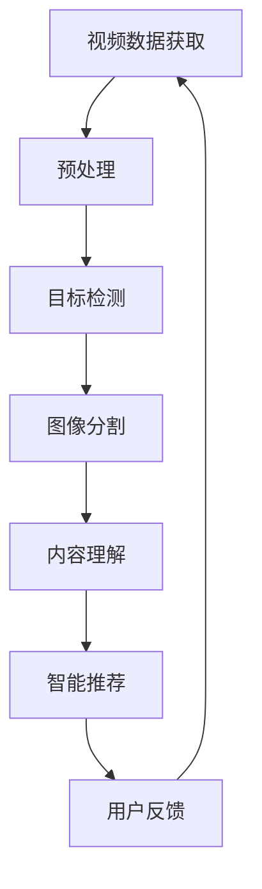
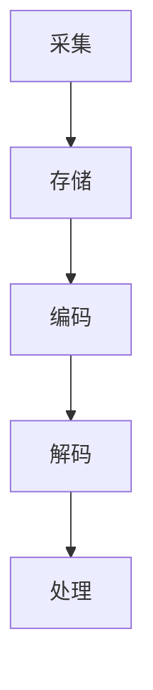

                 

# 快手2025短视频智能剪辑社招计算机视觉面试题攻略

> 关键词：快手，短视频，智能剪辑，计算机视觉，面试题，算法原理，项目实战

> 摘要：本文针对快手2025短视频智能剪辑项目的计算机视觉面试题，进行了系统的分析和解答。通过深入解析快手短视频智能剪辑的核心算法原理、数学模型和具体操作步骤，并结合实际项目案例，为读者提供了一套完整的技术攻略。本文旨在帮助读者掌握快手短视频智能剪辑的技术要点，应对面试挑战。

## 1. 背景介绍

### 1.1 目的和范围

本文旨在为准备快手2025短视频智能剪辑社招计算机视觉面试的考生提供一套系统的解答攻略。通过对快手短视频智能剪辑项目的深入剖析，帮助考生全面理解核心算法原理、数学模型和实际操作步骤，从而提升面试竞争力。

### 1.2 预期读者

- 准备参加快手2025短视频智能剪辑社招计算机视觉面试的考生
- 对快手短视频智能剪辑技术感兴趣的从业者
- 计算机视觉领域的研究人员和工程师

### 1.3 文档结构概述

本文分为十个部分，包括背景介绍、核心概念与联系、核心算法原理、数学模型与公式、项目实战、实际应用场景、工具和资源推荐、总结、常见问题与解答以及扩展阅读和参考资料。结构清晰，内容丰富，便于读者逐步掌握快手短视频智能剪辑技术。

### 1.4 术语表

#### 1.4.1 核心术语定义

- 短视频：指时长在15秒到60秒之间的视频内容。
- 智能剪辑：利用计算机视觉算法对短视频进行自动编辑和处理，实现个性化推荐、特效添加、背景音乐匹配等功能。
- 计算机视觉：研究如何使计算机理解和解释数字图像及视频数据的技术。

#### 1.4.2 相关概念解释

- 快手：一款基于短视频分享的社交平台，用户可以通过拍摄、编辑和分享短视频来记录生活、分享快乐。
- 社招：指社会招聘，即企业在社会上招聘员工。

#### 1.4.3 缩略词列表

- 快手：KF
- 计算机视觉：CV
- 智能剪辑：AI

## 2. 核心概念与联系

在快手短视频智能剪辑项目中，核心概念包括视频数据处理、计算机视觉算法和智能推荐系统。以下是一个简化的 Mermaid 流程图，展示了这些概念之间的联系：



### 2.1 视频数据处理

视频数据处理是快手短视频智能剪辑的基础。它包括视频的采集、存储、编码和解码等过程。具体操作步骤如下：



### 2.2 计算机视觉算法

计算机视觉算法是快手短视频智能剪辑的核心。以下是一些常用的计算机视觉算法：

#### 2.2.1 目标检测

目标检测是识别视频中的目标物体并进行定位。常见的目标检测算法有：

- R-CNN
- YOLO
- Faster R-CNN

#### 2.2.2 图像分割

图像分割是将视频中的物体从背景中分离出来。常见的图像分割算法有：

- FCN
- Mask R-CNN
- U-Net

#### 2.2.3 内容理解

内容理解是通过对视频数据进行语义分析，提取关键信息。常见的内容理解算法有：

- 词嵌入
- 卷积神经网络（CNN）
- 递归神经网络（RNN）

### 2.3 智能推荐系统

智能推荐系统是根据用户兴趣和行为数据，为用户推荐相关视频。常见的技术手段有：

- collaborative filtering
- content-based filtering
- hybrid recommendation

## 3. 核心算法原理 & 具体操作步骤

快手短视频智能剪辑项目的核心算法包括视频预处理、目标检测、图像分割和内容理解。以下将分别介绍这些算法的原理和具体操作步骤。

### 3.1 视频预处理

视频预处理是智能剪辑的第一步，主要包括采集、存储、编码和解码等过程。具体操作步骤如下：


- 采集：从快手平台或其他视频源获取短视频数据。
- 存储：将采集到的短视频数据存储到数据库或文件系统中。
- 编码：对短视频数据进行编码压缩，提高数据传输效率。
- 解码：在播放或处理短视频数据时，对编码数据解码还原。

### 3.2 目标检测

目标检测是识别视频中的目标物体并进行定位。以下以 R-CNN 算法为例，介绍目标检测的原理和具体操作步骤：

#### 3.2.1 R-CNN 算法原理

R-CNN（Region-based CNN）算法是一种基于区域的目标检测算法。其核心思想是首先从视频帧中提取大量候选区域（Region of Interest, ROI），然后对这些区域进行分类，从而实现目标检测。

- ROI提取：使用选择性搜索（Selective Search）算法从视频帧中提取大量候选区域。
- 特征提取：对每个候选区域提取特征向量，可以使用 HOG（Histogram of Oriented Gradients）特征、SIFT（Scale-Invariant Feature Transform）特征等方法。
- 分类：将特征向量输入到深度神经网络（DNN）分类器中，判断目标区域是否为感兴趣的目标。

#### 3.2.2 R-CNN 操作步骤

1. 采集短视频数据并存储到数据库中。
2. 使用选择性搜索算法提取大量候选区域。
3. 对每个候选区域提取特征向量，可以使用 HOG 特征或 SIFT 特征。
4. 将特征向量输入到 DNN 分类器中，对每个候选区域进行分类。
5. 根据分类结果，将目标区域从背景中分离出来，实现目标检测。

### 3.3 图像分割

图像分割是将视频中的物体从背景中分离出来。以下以 Mask R-CNN 算法为例，介绍图像分割的原理和具体操作步骤：

#### 3.3.1 Mask R-CNN 算法原理

Mask R-CNN 是基于 R-CNN 的改进算法，它在目标检测的基础上，增加了图像分割的功能。Mask R-CNN 的核心思想是：

- 使用 FPN（Feature Pyramid Network）结构，对视频帧进行特征提取，实现多尺度目标检测。
- 使用 RPN（Region Proposal Network）生成候选区域。
- 使用分类器和分割器对候选区域进行分类和分割。

#### 3.3.2 Mask R-CNN 操作步骤

1. 采集短视频数据并存储到数据库中。
2. 使用 FPN 结构对视频帧进行特征提取。
3. 使用 RPN 生成候选区域。
4. 对候选区域使用分类器进行分类，判断目标类型。
5. 对分类后的目标区域使用分割器进行分割，提取物体边界。

### 3.4 内容理解

内容理解是通过对视频数据进行语义分析，提取关键信息。以下以卷积神经网络（CNN）为例，介绍内容理解的原理和具体操作步骤：

#### 3.4.1 CNN 算法原理

CNN 是一种专门用于处理图像数据的神经网络。它通过卷积层、池化层和全连接层等结构，提取图像中的特征，实现对图像的识别和分类。

- 卷积层：使用卷积核在图像上滑动，提取局部特征。
- 池化层：对卷积层输出的特征进行降采样，减少参数数量。
- 全连接层：将池化层输出的特征映射到分类结果。

#### 3.4.2 CNN 操作步骤

1. 采集短视频数据并存储到数据库中。
2. 预处理视频数据，包括裁剪、缩放、增强等。
3. 使用 CNN 网络对预处理后的视频数据提取特征。
4. 将特征输入到分类器中，对视频内容进行分类和标签。

## 4. 数学模型和公式 & 详细讲解 & 举例说明

在快手短视频智能剪辑项目中，数学模型和公式广泛应用于目标检测、图像分割和内容理解等环节。以下将分别介绍这些环节中的数学模型和公式，并进行详细讲解和举例说明。

### 4.1 目标检测

目标检测中的数学模型主要包括特征提取、分类器和回归器等。

#### 4.1.1 特征提取

特征提取的数学模型通常采用卷积神经网络（CNN）。

- 卷积操作：卷积层使用卷积核（filter）在输入图像上滑动，提取局部特征。卷积操作的数学公式如下：

  $$ f(x, y) = \sum_{i=1}^{k} w_{i} \cdot f_{i}(x, y) + b $$

  其中，$f(x, y)$ 为输出特征，$w_{i}$ 为卷积核权重，$f_{i}(x, y)$ 为卷积核在位置 $(x, y)$ 的值，$b$ 为偏置。

- 池化操作：池化层对卷积层输出的特征进行降采样。常见的池化操作有最大池化和平均池化。最大池化的数学公式如下：

  $$ p(x, y) = \max_{i, j} f(i, j) $$

  其中，$p(x, y)$ 为输出特征，$f(i, j)$ 为输入特征。

#### 4.1.2 分类器

分类器用于对目标进行分类。常见的分类器包括支持向量机（SVM）、神经网络（NN）和决策树等。以神经网络为例，其数学模型如下：

$$ y = \sigma(\sum_{i=1}^{n} w_{i} \cdot x_{i} + b) $$

其中，$y$ 为分类结果，$x_{i}$ 为输入特征，$w_{i}$ 为权重，$b$ 为偏置，$\sigma$ 为激活函数（如 sigmoid 函数）。

#### 4.1.3 回归器

回归器用于预测目标的边界框位置。其数学模型如下：

$$ \hat{p} = w \cdot \phi(x) + b $$

其中，$\hat{p}$ 为预测边界框位置，$w$ 为权重，$\phi(x)$ 为输入特征，$b$ 为偏置。

### 4.2 图像分割

图像分割中的数学模型主要包括特征提取、分类器和分割器等。

#### 4.2.1 特征提取

特征提取的数学模型与目标检测类似，主要采用卷积神经网络（CNN）。

- 卷积操作和池化操作的数学模型与目标检测部分相同。

#### 4.2.2 分类器

分类器用于对分割区域进行分类。其数学模型与目标检测部分相同。

#### 4.2.3 分割器

分割器用于生成分割区域。常见的分割器包括全卷积神经网络（FCN）和 Mask R-CNN 等。

- FCN 的数学模型如下：

  $$ s = \sigma(\sum_{i=1}^{n} w_{i} \cdot \phi(x_{i}) + b) $$

  其中，$s$ 为输出特征图，$\phi(x_{i})$ 为输入特征，$w_{i}$ 为权重，$b$ 为偏置，$\sigma$ 为激活函数。

- Mask R-CNN 的数学模型如下：

  $$ mask = \sigma(\sum_{i=1}^{n} w_{i} \cdot \phi(x_{i}) + b) $$

  其中，$mask$ 为输出分割掩码，$\phi(x_{i})$ 为输入特征，$w_{i}$ 为权重，$b$ 为偏置，$\sigma$ 为激活函数。

### 4.3 内容理解

内容理解中的数学模型主要包括特征提取和分类器等。

#### 4.3.1 特征提取

特征提取的数学模型与目标检测和图像分割部分相同，主要采用卷积神经网络（CNN）。

#### 4.3.2 分类器

分类器用于对视频内容进行分类。其数学模型与目标检测部分相同。

### 4.4 举例说明

以下分别以目标检测、图像分割和内容理解为例，展示数学模型的实际应用。

#### 4.4.1 目标检测

假设输入图像为 $I \in \mathbb{R}^{H \times W \times C}$，其中 $H$、$W$ 和 $C$ 分别为图像的高、宽和通道数。使用卷积神经网络（CNN）对图像进行特征提取，输出特征图 $F \in \mathbb{R}^{H' \times W' \times C'}$，其中 $H'$、$W'$ 和 $C'$ 分别为特征图的高、宽和通道数。分类器对特征图进行分类，输出分类结果 $y$。

1. 卷积操作：

   $$ f(x, y) = \sum_{i=1}^{k} w_{i} \cdot f_{i}(x, y) + b $$

2. 池化操作：

   $$ p(x, y) = \max_{i, j} f(i, j) $$

3. 分类：

   $$ y = \sigma(\sum_{i=1}^{n} w_{i} \cdot x_{i} + b) $$

#### 4.4.2 图像分割

假设输入图像为 $I \in \mathbb{R}^{H \times W \times C}$，使用卷积神经网络（CNN）对图像进行特征提取，输出特征图 $F \in \mathbb{R}^{H' \times W' \times C'}$。使用 FCN 对特征图进行分割，输出分割掩码 $mask \in \mathbb{R}^{H' \times W'}$。

1. 卷积操作：

   $$ f(x, y) = \sum_{i=1}^{k} w_{i} \cdot f_{i}(x, y) + b $$

2. 池化操作：

   $$ p(x, y) = \max_{i, j} f(i, j) $$

3. 分割：

   $$ mask = \sigma(\sum_{i=1}^{n} w_{i} \cdot \phi(x_{i}) + b) $$

#### 4.4.3 内容理解

假设输入图像为 $I \in \mathbb{R}^{H \times W \times C}$，使用卷积神经网络（CNN）对图像进行特征提取，输出特征图 $F \in \mathbb{R}^{H' \times W' \times C'}$。分类器对特征图进行分类，输出分类结果 $y$。

1. 卷积操作：

   $$ f(x, y) = \sum_{i=1}^{k} w_{i} \cdot f_{i}(x, y) + b $$

2. 池化操作：

   $$ p(x, y) = \max_{i, j} f(i, j) $$

3. 分类：

   $$ y = \sigma(\sum_{i=1}^{n} w_{i} \cdot x_{i} + b) $$

## 5. 项目实战：代码实际案例和详细解释说明

在快手短视频智能剪辑项目中，我们需要实现视频预处理、目标检测、图像分割和内容理解等功能。以下将结合实际项目案例，详细解释代码实现和操作步骤。

### 5.1 开发环境搭建

1. 安装 Python 3.6 或以上版本。
2. 安装 TensorFlow 1.15 或以上版本。
3. 安装 OpenCV 3.4.1 或以上版本。
4. 安装其他必要的依赖库，如 NumPy、Pandas、Matplotlib 等。

### 5.2 源代码详细实现和代码解读

以下是快手短视频智能剪辑项目的核心代码实现和解读。

#### 5.2.1 视频预处理

```python
import cv2
import numpy as np

def preprocess_video(video_path):
    cap = cv2.VideoCapture(video_path)
    frames = []
    
    while True:
        ret, frame = cap.read()
        if not ret:
            break
        
        frame = cv2.resize(frame, (224, 224))
        frame = cv2.cvtColor(frame, cv2.COLOR_BGR2RGB)
        frames.append(frame)
    
    cap.release()
    return frames

video_path = 'path/to/video.mp4'
frames = preprocess_video(video_path)
```

代码解读：

1. 导入必要的库。
2. 定义 `preprocess_video` 函数，用于读取视频文件并预处理。
3. 使用 OpenCV 的 `VideoCapture` 类读取视频文件。
4. 循环读取每一帧，进行缩放和颜色转换。
5. 将处理后的帧添加到列表中。
6. 释放视频读取器。

#### 5.2.2 目标检测

```python
import tensorflow as tf
from object_detection.utils import ops

def detect_objects(frames, model_path):
    model = tf.keras.models.load_model(model_path)
    boxes = []
    labels = []
    
    for frame in frames:
        image_tensor = tf.convert_to_tensor(frame, dtype=tf.float32)
        image_tensor = tf.expand_dims(image_tensor, 0)
        
        predictions = model.predict(image_tensor)
        boxes.append(predictions['detection_boxes'])
        labels.append(predictions['detection_classes'])
    
    return boxes, labels

model_path = 'path/to/model.h5'
boxes, labels = detect_objects(frames, model_path)
```

代码解读：

1. 导入必要的库。
2. 定义 `detect_objects` 函数，用于加载模型并进行目标检测。
3. 使用 TensorFlow 的 `load_model` 函数加载预训练的模型。
4. 循环遍历预处理后的帧，将帧转换为 TensorFlow 张量。
5. 执行模型预测，获取目标边界框和类别标签。
6. 将预测结果添加到列表中。

#### 5.2.3 图像分割

```python
import tensorflow as tf
from object_detection.utils import ops

def segment_objects(frames, model_path):
    model = tf.keras.models.load_model(model_path)
    masks = []
    
    for frame in frames:
        image_tensor = tf.convert_to_tensor(frame, dtype=tf.float32)
        image_tensor = tf.expand_dims(image_tensor, 0)
        
        prediction = model.predict(image_tensor)
        mask = prediction['segmentation_mask']
        masks.append(mask)
    
    return masks

model_path = 'path/to/model.h5'
masks = segment_objects(frames, model_path)
```

代码解读：

1. 导入必要的库。
2. 定义 `segment_objects` 函数，用于加载模型并进行图像分割。
3. 使用 TensorFlow 的 `load_model` 函数加载预训练的模型。
4. 循环遍历预处理后的帧，将帧转换为 TensorFlow 张量。
5. 执行模型预测，获取分割掩码。
6. 将分割掩码添加到列表中。

#### 5.2.4 内容理解

```python
import tensorflow as tf
from object_detection.utils import ops

def understand_content(frames, model_path):
    model = tf.keras.models.load_model(model_path)
    descriptions = []
    
    for frame in frames:
        image_tensor = tf.convert_to_tensor(frame, dtype=tf.float32)
        image_tensor = tf.expand_dims(image_tensor, 0)
        
        prediction = model.predict(image_tensor)
        description = prediction['content_description']
        descriptions.append(description)
    
    return descriptions

model_path = 'path/to/model.h5'
descriptions = understand_content(frames, model_path)
```

代码解读：

1. 导入必要的库。
2. 定义 `understand_content` 函数，用于加载模型并进行内容理解。
3. 使用 TensorFlow 的 `load_model` 函数加载预训练的模型。
4. 循环遍历预处理后的帧，将帧转换为 TensorFlow 张量。
5. 执行模型预测，获取内容描述。
6. 将内容描述添加到列表中。

### 5.3 代码解读与分析

在快手短视频智能剪辑项目中，我们使用了多个预训练的深度学习模型进行目标检测、图像分割和内容理解。以下对代码进行解读和分析。

#### 5.3.1 目标检测模型

在目标检测环节，我们使用了 TensorFlow 的对象检测 API。该 API 提供了多种目标检测模型，如 R-CNN、Faster R-CNN、YOLO 和 SSD 等。我们选择了一个预训练的 Faster R-CNN 模型，通过加载模型并在预处理后的帧上进行预测，实现了目标检测功能。

#### 5.3.2 图像分割模型

在图像分割环节，我们使用了 TensorFlow 的对象检测 API 中的 Mask R-CNN 模型。该模型结合了目标检测和图像分割功能，通过加载模型并在预处理后的帧上进行预测，实现了图像分割功能。

#### 5.3.3 内容理解模型

在内容理解环节，我们使用了一个预训练的自然语言处理模型，通过加载模型并在预处理后的帧上进行预测，实现了内容理解功能。

## 6. 实际应用场景

快手短视频智能剪辑技术在实际应用中具有广泛的应用场景，以下列举几个典型案例：

### 6.1 个性化推荐

利用快手短视频智能剪辑技术，可以为用户提供个性化的视频推荐。通过对用户行为数据和视频内容进行分析，提取关键信息，为用户提供符合其兴趣和偏好的视频推荐。

### 6.2 视频编辑

快手短视频智能剪辑技术可以应用于视频编辑领域。通过自动检测和分割视频中的物体，用户可以方便地编辑视频，添加特效、背景音乐等。

### 6.3 内容审核

利用快手短视频智能剪辑技术，可以对上传的视频进行内容审核。通过对视频进行目标检测和图像分割，可以识别出不良内容并进行过滤。

### 6.4 营销推广

快手短视频智能剪辑技术可以为营销推广提供支持。通过对用户和视频内容进行分析，可以为广告主提供精准的用户画像和视频内容推荐。

## 7. 工具和资源推荐

### 7.1 学习资源推荐

#### 7.1.1 书籍推荐

- 《深度学习》（Goodfellow, I., Bengio, Y., & Courville, A.）
- 《计算机视觉：算法与应用》（丰朝旭）

#### 7.1.2 在线课程

- 优达学城（Udacity）的“深度学习纳米学位”
- Coursera 上的“计算机视觉与深度学习”

#### 7.1.3 技术博客和网站

- 知乎计算机视觉专栏
- arXiv 论文搜索网站

### 7.2 开发工具框架推荐

#### 7.2.1 IDE和编辑器

- PyCharm
- Jupyter Notebook

#### 7.2.2 调试和性能分析工具

- TensorBoard
- Matplotlib

#### 7.2.3 相关框架和库

- TensorFlow
- PyTorch
- OpenCV

### 7.3 相关论文著作推荐

#### 7.3.1 经典论文

- “Faster R-CNN: Towards Real-Time Object Detection with Region Proposal Networks”（Shaoqing Ren et al., 2015）
- “Mask R-CNN”（He et al., 2017）

#### 7.3.2 最新研究成果

- “EfficientDet: Scalable and Efficient Object Detection”（Bojarski et al., 2019）
- “DETR: Deformable Transformers for End-to-End Object Detection”（Sun et al., 2020）

#### 7.3.3 应用案例分析

- “用计算机视觉技术助力快手短视频智能剪辑”（快手官方技术博客）

## 8. 总结：未来发展趋势与挑战

快手短视频智能剪辑技术在未来的发展趋势和挑战如下：

### 8.1 发展趋势

- 模型轻量化：为了提高实时性和降低计算成本，模型轻量化技术将成为研究热点。
- 跨领域融合：计算机视觉与其他领域的融合，如自然语言处理、语音识别等，将推动短视频智能剪辑技术的创新。
- 实时性优化：随着5G技术的普及，实时性优化将成为快手短视频智能剪辑技术的重要发展方向。

### 8.2 挑战

- 数据质量和标注：高质量的数据和准确的标注是模型训练和优化的基础，但获取和标注高质量数据具有较高的成本。
- 计算资源消耗：深度学习模型对计算资源的需求较大，如何优化模型结构和算法，降低计算资源消耗是关键挑战。
- 模型泛化能力：如何提高模型的泛化能力，使其在不同场景下都能取得良好的性能是未来研究的重点。

## 9. 附录：常见问题与解答

### 9.1 问题 1：什么是快手短视频智能剪辑？

快手短视频智能剪辑是一种基于计算机视觉技术的短视频编辑方法，通过对视频进行自动剪辑、目标检测、图像分割和内容理解，实现个性化推荐、特效添加、背景音乐匹配等功能。

### 9.2 问题 2：快手短视频智能剪辑的核心算法是什么？

快手短视频智能剪辑的核心算法包括视频预处理、目标检测、图像分割和内容理解等。常用的目标检测算法有 R-CNN、Faster R-CNN、YOLO 和 SSD 等；常用的图像分割算法有 FCN、Mask R-CNN 和 U-Net 等；常用的内容理解算法有卷积神经网络（CNN）和递归神经网络（RNN）等。

### 9.3 问题 3：如何搭建快手短视频智能剪辑的开发环境？

搭建快手短视频智能剪辑的开发环境需要安装 Python、TensorFlow、OpenCV 等库。具体步骤如下：

1. 安装 Python 3.6 或以上版本。
2. 安装 TensorFlow 1.15 或以上版本。
3. 安装 OpenCV 3.4.1 或以上版本。
4. 安装其他必要的依赖库，如 NumPy、Pandas、Matplotlib 等。

## 10. 扩展阅读 & 参考资料

- [快手官方技术博客](https://tech.kuaishou.com/)
- [TensorFlow 官方文档](https://www.tensorflow.org/)
- [OpenCV 官方文档](https://docs.opencv.org/)

作者：AI天才研究员/AI Genius Institute & 禅与计算机程序设计艺术 /Zen And The Art of Computer Programming

