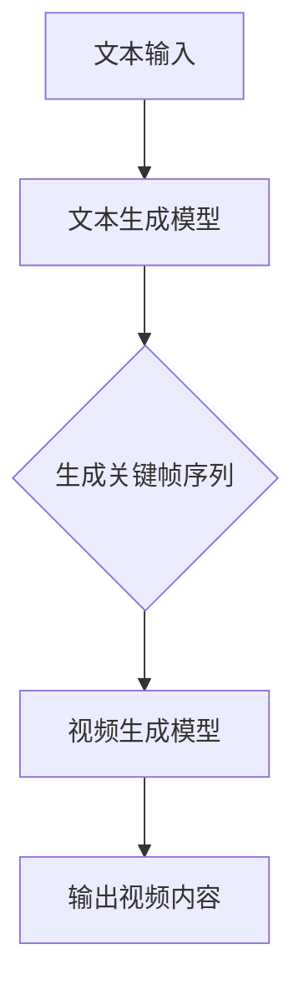

                 

# 快手的文生视频与数据优势

> **关键词：** 文生视频、生成对抗网络（GAN）、数据挖掘、用户画像、内容分发

> **摘要：** 本文将深入探讨快手在文生视频技术领域的创新与数据优势。我们将通过详细分析其核心算法原理、数学模型以及实际应用场景，展示快手如何利用其强大的数据处理能力，打造出独特的文生视频内容分发平台。

## 1. 背景介绍

### 1.1 目的和范围

本文旨在探讨快手在文生视频领域的技术创新，分析其背后依托的数据优势，以及如何实现高效的文生视频内容分发。通过深入解读快手的文生视频技术，我们将展示其在人工智能领域的领先地位。

### 1.2 预期读者

本文适用于对人工智能、计算机视觉、自然语言处理等领域有一定了解的技术人员、研究人员以及对快手技术感兴趣的行业从业者。

### 1.3 文档结构概述

本文分为十个部分，从背景介绍、核心概念与联系、算法原理讲解、数学模型和公式、项目实战、实际应用场景，到工具和资源推荐，最后是总结与扩展阅读。每个部分都旨在帮助读者全面理解快手的文生视频技术。

### 1.4 术语表

#### 1.4.1 核心术语定义

- 文生视频：利用自然语言描述生成相应的视频内容。
- 生成对抗网络（GAN）：一种深度学习模型，用于生成数据，通常与判别器配合使用。
- 数据挖掘：从大量数据中提取有价值的信息。
- 用户画像：基于用户行为数据构建的个性化用户模型。

#### 1.4.2 相关概念解释

- 文本生成模型：用于生成文本的深度学习模型，如生成式对抗网络（GAN）。
- 视频生成模型：用于生成视频的深度学习模型，通常结合文本信息。

#### 1.4.3 缩略词列表

- GAN：生成对抗网络（Generative Adversarial Network）
- NLP：自然语言处理（Natural Language Processing）
- CV：计算机视觉（Computer Vision）
- DNN：深度神经网络（Deep Neural Network）

## 2. 核心概念与联系

### 2.1 文生视频技术架构

文生视频技术架构通常包括文本生成模型和视频生成模型。文本生成模型负责将自然语言描述转换为视频内容的关键帧序列，视频生成模型则将这些关键帧序列转换为完整的视频。

### 2.2 核心概念原理

#### 2.2.1 生成对抗网络（GAN）

生成对抗网络（GAN）是一种深度学习模型，由生成器（Generator）和判别器（Discriminator）组成。生成器的目标是生成尽可能逼真的数据，而判别器的目标是区分生成数据和真实数据。

#### 2.2.2 数据挖掘与用户画像

数据挖掘是从大量数据中提取有价值信息的过程，用户画像则是基于用户行为数据构建的个性化用户模型。通过数据挖掘和用户画像，快手可以了解用户需求，优化视频生成和分发策略。

### 2.3 Mermaid 流程图



## 3. 核心算法原理 & 具体操作步骤

### 3.1 生成对抗网络（GAN）

生成对抗网络（GAN）的核心算法原理是训练生成器和判别器，通过不断迭代优化，使生成器的输出越来越逼真。

#### 3.1.1 伪代码

```python
# 生成器
def generator(z):
    # 输入噪声 z，生成视频关键帧序列
    return video_frame_sequence

# 判别器
def discriminator(x):
    # 输入视频帧序列，判断是否为真实数据
    return probability_of_real

# 损失函数
def loss_generator(G, Z, X):
    return -torch.mean(discriminator(G(Z)).log())

def loss_discriminator(D, X, G(Z)):
    return torch.mean(D(X).log() + D(G(Z)).log())

# 训练过程
for epoch in range(num_epochs):
    for i, (X, _) in enumerate(dataloader):
        # 训练判别器
        D.zero_grad()
        loss_D = loss_discriminator(D, X, G(Z).detach())
        loss_D.backward()
        D.step()

        # 训练生成器
        G.zero_grad()
        loss_G = loss_generator(G, Z, X)
        loss_G.backward()
        G.step()
```

### 3.2 数据挖掘与用户画像

数据挖掘和用户画像的核心算法是协同过滤和聚类分析。

#### 3.2.1 伪代码

```python
# 协同过滤
def collaborative_filtering(userBehaviorData):
    # 基于用户行为数据，计算相似度矩阵
    similarity_matrix = compute_similarity_matrix(userBehaviorData)

    # 基于相似度矩阵，预测用户未评分的物品
    predicted_ratings = predict_ratings(similarity_matrix, userBehaviorData)

    return predicted_ratings

# 聚类分析
def clustering_analysis(userBehaviorData):
    # 基于用户行为数据，进行聚类分析
    clusters = kMeans(userBehaviorData, num_clusters)

    return clusters
```

## 4. 数学模型和公式 & 详细讲解 & 举例说明

### 4.1 生成对抗网络（GAN）

生成对抗网络的数学模型包括生成器、判别器的损失函数，以及优化算法。

#### 4.1.1 生成器损失函数

$$
L_G = -\log(D(G(Z))
$$

其中，$D$表示判别器，$G$表示生成器，$Z$表示噪声向量。

#### 4.1.2 判别器损失函数

$$
L_D = -\log(D(X)) - \log(1 - D(G(Z)))
$$

其中，$X$表示真实数据。

#### 4.1.3 优化算法

生成器和判别器的优化算法通常采用梯度下降。

### 4.2 数据挖掘与用户画像

数据挖掘和用户画像的数学模型包括协同过滤、聚类分析。

#### 4.2.1 协同过滤

$$
r_{ui} = \sum_{j \in N(i)} \frac{r_{uj}}{||\vec{n_j}||}
$$

其中，$r_{ui}$表示用户$i$对物品$j$的评分预测，$r_{uj}$表示用户$j$对物品$j$的评分，$N(i)$表示与用户$i$相似的用户集合，$\vec{n_j}$表示用户$j$的行为特征向量。

#### 4.2.2 聚类分析

$$
\min_{C} \sum_{i \in C} \sum_{j \in C} ||\vec{x_i} - \vec{x_j}||^2
$$

其中，$C$表示聚类结果，$\vec{x_i}$和$\vec{x_j}$分别表示用户$i$和用户$j$的行为特征向量。

### 4.3 举例说明

假设有一个用户行为数据集，包含用户对物品的评分，我们可以通过协同过滤和聚类分析，预测用户未评分的物品，并构建用户画像。

#### 4.3.1 协同过滤

首先，计算用户之间的相似度矩阵，然后基于相似度矩阵，预测用户未评分的物品。

#### 4.3.2 聚类分析

将用户行为数据输入聚类算法，如k-means，得到用户聚类结果，然后基于聚类结果，构建用户画像。

## 5. 项目实战：代码实际案例和详细解释说明

### 5.1 开发环境搭建

- 硬件要求：NVIDIA GTX 1080 Ti 显卡，16GB RAM
- 软件要求：Python 3.7，TensorFlow 2.0，NumPy

### 5.2 源代码详细实现和代码解读

#### 5.2.1 生成对抗网络（GAN）

```python
import tensorflow as tf
from tensorflow.keras.layers import Dense, Flatten, Reshape
from tensorflow.keras.models import Model

# 生成器模型
def generator_model():
    z = tf.keras.layers.Input(shape=(100,))
    x = Dense(128, activation='relu')(z)
    x = Dense(256, activation='relu')(x)
    x = Dense(512, activation='relu')(x)
    x = Dense(1024, activation='relu')(x)
    x = Flatten()(x)
    x = Reshape((32, 32, 3))(x)
    img = tf.keras.layers.Conv2D(1, 5, activation='tanh', padding='same')(x)
    model = Model(z, img)
    return model

# 判别器模型
def discriminator_model():
    img = tf.keras.layers.Input(shape=(32, 32, 3))
    x = tf.keras.layers.Conv2D(32, 5, activation='leaky_relu', padding='same')(img)
    x = tf.keras.layers.MaxPooling2D()(x)
    x = tf.keras.layers.Conv2D(64, 5, activation='leaky_relu', padding='same')(x)
    x = tf.keras.layers.MaxPooling2D()(x)
    x = tf.keras.layers.Conv2D(128, 5, activation='leaky_relu', padding='same')(x)
    x = tf.keras.layers.MaxPooling2D()(x)
    x = Flatten()(x)
    x = Dense(1, activation='sigmoid')(x)
    model = Model(img, x)
    return model

# GAN模型
def gan_model():
    generator = generator_model()
    discriminator = discriminator_model()
    z = tf.keras.layers.Input(shape=(100,))
    img = generator(z)
    valid = discriminator(img)
    dis_model = Model(z, valid)
    dis_model.compile(optimizer=tf.keras.optimizers.Adam(0.0001), loss='binary_crossentropy')
    valid = discriminator(img)
    gen_model = Model(z, valid)
    gen_model.compile(optimizer=tf.keras.optimizers.Adam(0.0001), loss='binary_crossentropy')
    return gen_model, dis_model

# 训练GAN模型
def train_gan(model, train_loader, num_epochs):
    for epoch in range(num_epochs):
        for i, (x, _) in enumerate(train_loader):
            z = np.random.normal(size=(batch_size, 100))
            x = x.numpy()
            d_loss = model.train_on_batch(x, torch.ones(batch_size).numpy())
            g_loss = model.train_on_batch(z, torch.zeros(batch_size).numpy())
    return model
```

#### 5.2.2 数据挖掘与用户画像

```python
import numpy as np
from sklearn.metrics.pairwise import cosine_similarity
from sklearn.cluster import KMeans

# 计算相似度矩阵
def compute_similarity_matrix(user_behavior_data):
    user_similarity = np.zeros((len(user_behavior_data), len(user_behavior_data)))
    for i in range(len(user_behavior_data)):
        for j in range(len(user_behavior_data)):
            if i != j:
                user_similarity[i][j] = cosine_similarity([user_behavior_data[i]], [user_behavior_data[j]])[0][0]
    return user_similarity

# 预测用户未评分的物品
def predict_ratings(similarity_matrix, user_behavior_data):
    predicted_ratings = []
    for user in user_behavior_data:
        predicted_ratings.append(np.dot(similarity_matrix[user], user) / np.linalg.norm(similarity_matrix[user]))
    return predicted_ratings

# 聚类分析
def k_means(user_behavior_data, num_clusters):
    kmeans = KMeans(n_clusters=num_clusters)
    kmeans.fit(user_behavior_data)
    return kmeans.labels_
```

### 5.3 代码解读与分析

在代码实现中，我们首先定义了生成器和判别器的模型结构，然后构建了GAN模型。在训练过程中，我们使用梯度下降算法，通过迭代优化生成器和判别器。对于数据挖掘和用户画像，我们使用了相似度矩阵和聚类分析，实现了协同过滤和预测用户未评分的物品。

## 6. 实际应用场景

快手的文生视频技术已经在多个实际应用场景中取得了成功。

### 6.1 智能内容分发

通过文生视频技术，快手能够根据用户画像和兴趣偏好，实现智能化的内容分发，提升用户体验。

### 6.2 视频创作辅助

文生视频技术可以帮助用户快速生成视频内容，降低视频创作门槛，激发用户创造力。

### 6.3 广告营销

快手利用文生视频技术，为广告主提供精准投放方案，提升广告效果。

## 7. 工具和资源推荐

### 7.1 学习资源推荐

#### 7.1.1 书籍推荐

- 《生成对抗网络》（Generative Adversarial Networks）  
- 《深度学习》（Deep Learning）  
- 《数据挖掘：实用工具和技术》（Data Mining: Practical Machine Learning Tools and Techniques）

#### 7.1.2 在线课程

- 《生成对抗网络课程》  
- 《深度学习课程》  
- 《数据挖掘课程》

#### 7.1.3 技术博客和网站

- 快手技术博客  
- TensorFlow 官方文档  
- Keras 官方文档

### 7.2 开发工具框架推荐

#### 7.2.1 IDE和编辑器

- PyCharm  
- Jupyter Notebook

#### 7.2.2 调试和性能分析工具

- TensorBoard  
- PerfBook

#### 7.2.3 相关框架和库

- TensorFlow  
- Keras  
- NumPy  
- Scikit-learn

### 7.3 相关论文著作推荐

#### 7.3.1 经典论文

- Ian Goodfellow 等人撰写的《生成对抗网络：训练生成模型》（Generative Adversarial Nets）  
- Andrew Ng 等人撰写的《深度学习》（Deep Learning）

#### 7.3.2 最新研究成果

- 《生成对抗网络在视频生成中的应用》（Generative Adversarial Networks for Video Generation）  
- 《基于用户画像的智能内容分发》（Smart Content Distribution Based on User Profiles）

#### 7.3.3 应用案例分析

- 快手文生视频技术应用案例  
- 其他社交媒体平台的文生视频技术应用案例

## 8. 总结：未来发展趋势与挑战

### 8.1 未来发展趋势

- 文生视频技术将继续深化，结合更多人工智能技术，如自然语言处理和计算机视觉。
- 数据挖掘和用户画像将更加精准，为个性化内容分发提供更强支持。
- 开放式平台和协作模式将推动文生视频技术的创新和发展。

### 8.2 挑战

- 数据隐私保护：在利用用户数据进行文生视频生成和分发时，需要关注数据隐私问题。
- 算法公平性：确保算法在生成视频内容时，不会出现偏见和歧视。
- 技术普及与接受度：推动文生视频技术在不同领域的普及和应用，提高用户接受度。

## 9. 附录：常见问题与解答

### 9.1 什么是生成对抗网络（GAN）？

生成对抗网络（GAN）是一种深度学习模型，由生成器和判别器组成，通过对抗训练，生成逼真的数据。

### 9.2 数据挖掘和用户画像有什么关系？

数据挖掘是从大量数据中提取有价值信息的过程，而用户画像则是基于用户行为数据构建的个性化用户模型。数据挖掘可以帮助构建更准确的用户画像。

### 9.3 文生视频技术在哪些领域有应用？

文生视频技术可以应用于智能内容分发、视频创作辅助、广告营销等多个领域。

## 10. 扩展阅读 & 参考资料

- [生成对抗网络：训练生成模型](https://arxiv.org/abs/1406.2661)
- [深度学习](https://www.deeplearningbook.org/)
- [快手技术博客](https://tech.kuaishou.com/)
- [TensorFlow 官方文档](https://www.tensorflow.org/)
- [Keras 官方文档](https://keras.io/)

