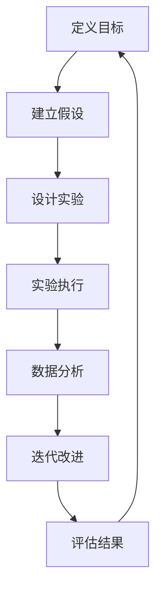
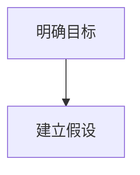
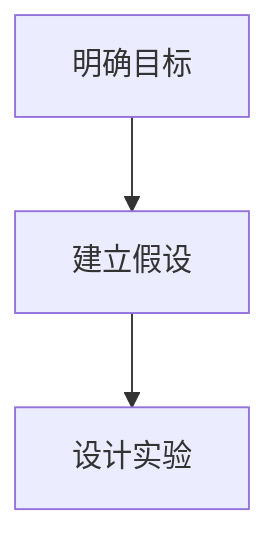
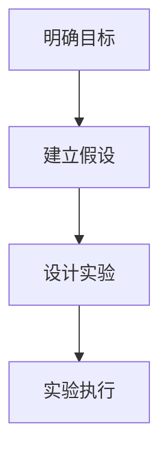
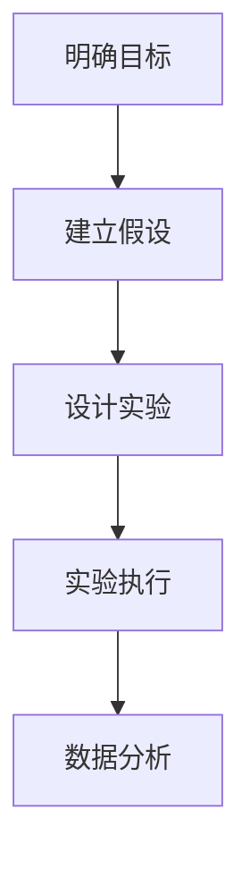
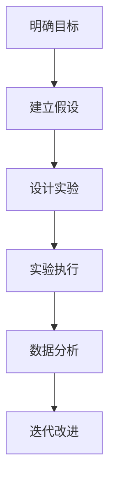
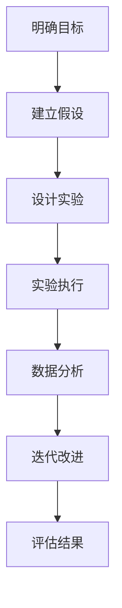

                 

# 快速试错：AI创业的关键优势

> **关键词**：快速试错、AI创业、试错文化、迭代、学习、创新、效率
>
> **摘要**：本文将探讨在AI创业领域中，快速试错作为一种核心策略所带来的关键优势。通过详细分析快速试错的原理、方法和实践案例，我们将揭示如何通过快速试错来提高AI创业项目的成功率。

## 1. 背景介绍

### 1.1 目的和范围

本文旨在揭示快速试错在AI创业中的重要性，并探讨其在提高项目成功率和创新效率方面的优势。我们将从以下几个方面进行探讨：

- 快速试错的原理和定义；
- 快速试错在AI创业中的应用场景；
- 快速试错的实践方法和步骤；
- 快速试错的案例分析和启示。

### 1.2 预期读者

本文适合对AI创业感兴趣的技术人员、创业者、投资人以及所有对快速试错方法有求知欲的读者。无论您是AI领域的从业者，还是对AI技术有所了解但希望深入了解快速试错的应用，本文都希望能够为您提供有价值的见解。

### 1.3 文档结构概述

本文将按照以下结构进行阐述：

- 引言：介绍快速试错的背景和重要性；
- 核心概念与联系：探讨快速试错的基本原理和框架；
- 核心算法原理 & 具体操作步骤：详细讲解快速试错的具体方法和步骤；
- 数学模型和公式 & 详细讲解 & 举例说明：介绍快速试错过程中的数学模型和公式；
- 项目实战：通过实际案例展示快速试错的应用效果；
- 实际应用场景：分析快速试错在各类AI创业项目中的应用；
- 工具和资源推荐：推荐相关学习资源和开发工具；
- 总结：总结快速试错在AI创业中的优势和挑战；
- 附录：常见问题与解答；
- 扩展阅读 & 参考资料：提供进一步学习的资料和参考。

### 1.4 术语表

#### 1.4.1 核心术语定义

- 快速试错：一种在短时间内通过迭代和优化来测试和改进项目的方法。
- AI创业：指基于人工智能技术的创业项目，通常涉及算法研发、模型训练和应用开发等方面。
- 试错文化：指一种鼓励尝试和失败，并从中学习和改进的企业文化。
- 迭代：指在短时间内进行多次重复的改进过程。

#### 1.4.2 相关概念解释

- 试错机制：指用于测试和验证项目假设和设计的实验和测试过程。
- 学习曲线：指在学习和掌握新技能或知识时，所需时间和技能水平随时间变化的曲线。
- 效率：指完成特定任务所需的时间和资源。

#### 1.4.3 缩略词列表

- AI：人工智能
- ML：机器学习
- DL：深度学习
- NLP：自然语言处理

## 2. 核心概念与联系

### 2.1 快速试错的原理和框架

快速试错是一种基于迭代和学习的创新方法，其核心原理如下：

1. **定义目标**：明确项目目标和预期成果，确保试错方向的一致性。
2. **建立假设**：基于已有知识和经验，提出关于项目可行性的初步假设。
3. **设计实验**：构建实验框架，通过实验来验证假设的准确性。
4. **迭代优化**：根据实验结果，对项目进行多次改进和优化。
5. **评估结果**：评估迭代效果，确定是否达到预期目标。

快速试错的框架可以概括为以下四个阶段：

1. **实验设计**：确定实验目标和指标，设计实验方案。
2. **实验执行**：执行实验，记录数据和结果。
3. **数据分析**：对实验数据进行分析和处理，识别问题和改进点。
4. **迭代改进**：根据分析结果，对项目进行改进和优化。

### 2.2 Mermaid 流程图

以下是一个简化的快速试错流程图，用于展示快速试错的基本原理和框架：



### 2.3 快速试错与AI创业的关系

快速试错在AI创业中具有重要的应用价值。以下是其与AI创业关系的几个方面：

1. **加速创新**：快速试错能够加速AI创业项目的技术研发和迭代过程，提高项目的创新速度。
2. **降低风险**：通过快速试错，可以提前发现和解决项目中的潜在问题和风险，降低项目失败的概率。
3. **提高效率**：快速试错能够提高项目开发效率，缩短项目开发周期，降低开发成本。
4. **促进学习**：快速试错鼓励团队不断尝试和失败，从而从失败中学习，提高团队的学习能力和技术水平。

## 3. 核心算法原理 & 具体操作步骤

### 3.1 快速试错的算法原理

快速试错的算法原理主要涉及以下几个方面：

1. **迭代过程**：快速试错的核心是迭代，通过多次实验和优化，逐步逼近项目目标。
2. **数据驱动**：快速试错基于实验数据和结果，不断调整和优化项目方案，实现数据驱动的决策过程。
3. **反馈机制**：快速试错通过及时反馈和调整，确保项目始终朝着正确的方向前进。

### 3.2 快速试错的具体操作步骤

以下是快速试错的具体操作步骤：

1. **明确目标**：确定项目的目标和预期成果，确保试错过程有明确的方向。


2. **建立假设**：基于现有知识和经验，提出关于项目可行性的初步假设。



3. **设计实验**：构建实验框架，确定实验目标和指标，设计实验方案。



4. **实验执行**：执行实验，记录数据和结果。



5. **数据分析**：对实验数据进行分析和处理，识别问题和改进点。



6. **迭代改进**：根据分析结果，对项目进行改进和优化。



7. **评估结果**：评估迭代效果，确定是否达到预期目标，并决定是否继续试错。



### 3.3 伪代码示例

以下是快速试错的伪代码示例：

```python
function quickTrialError(project, iterationLimit):
    for i in range(iterationLimit):
        # 实验设计
        experiment = designExperiment(project)
        # 实验执行
        results = executeExperiment(experiment)
        # 数据分析
        analysis = analyzeResults(results)
        # 迭代改进
        project = improveProject(project, analysis)
        # 评估结果
        if projectAchievedGoal(project):
            break
    return project

# 调用快速试错函数
finalProject = quickTrialError(initialProject, iterationLimit)
```

## 4. 数学模型和公式 & 详细讲解 & 举例说明

### 4.1 数学模型和公式

快速试错过程中的数学模型和公式主要用于评估项目进展和迭代效果。以下是一些常用的数学模型和公式：

1. **损失函数（Loss Function）**：用于评估项目当前状态的优劣。常用的损失函数包括均方误差（MSE）、交叉熵损失（Cross-Entropy Loss）等。

   $$L(y, \hat{y}) = \frac{1}{2} \sum_{i=1}^{n} (y_i - \hat{y_i})^2$$

2. **梯度下降（Gradient Descent）**：用于优化损失函数，找到使损失函数最小化的参数值。

   $$\theta = \theta - \alpha \cdot \nabla_{\theta}L(\theta)$$

3. **学习率（Learning Rate）**：梯度下降算法中的超参数，用于控制每次迭代中参数更新的步长。

   $$\alpha = \frac{1}{\sqrt{n}}$$

4. **置信区间（Confidence Interval）**：用于评估实验结果的可靠性，表示实验结果的置信水平。

   $$CI = (\bar{x} - z \cdot \frac{s}{\sqrt{n}}, \bar{x} + z \cdot \frac{s}{\sqrt{n}})$$

   其中，$\bar{x}$为样本均值，$s$为样本标准差，$z$为正态分布的分位数。

### 4.2 详细讲解和举例说明

以下通过一个简单的机器学习项目示例，详细讲解快速试错过程中的数学模型和公式应用。

#### 示例：房价预测

假设我们使用线性回归模型来预测房价，现有以下数据集：

| 特征1 | 特征2 | 房价 |
| ----- | ----- | ---- |
| 100   | 200   | 300  |
| 150   | 250   | 350  |
| 200   | 300   | 400  |

#### 4.2.1 损失函数

我们使用均方误差（MSE）作为损失函数：

$$L(y, \hat{y}) = \frac{1}{2} \sum_{i=1}^{3} (y_i - \hat{y_i})^2$$

其中，$y$为实际房价，$\hat{y}$为预测房价。

#### 4.2.2 梯度下降

假设线性回归模型的参数为$\theta_1$和$\theta_2$，则损失函数的梯度为：

$$\nabla_{\theta_1}L(\theta_1, \theta_2) = -\sum_{i=1}^{3} (y_i - \hat{y_i}) \cdot x_{1i}$$

$$\nabla_{\theta_2}L(\theta_1, \theta_2) = -\sum_{i=1}^{3} (y_i - \hat{y_i}) \cdot x_{2i}$$

其中，$x_{1i}$和$x_{2i}$分别为特征1和特征2的取值。

#### 4.2.3 学习率和迭代

假设学习率为$\alpha = 0.01$，初始参数为$\theta_1 = 0$，$\theta_2 = 0$。我们通过多次迭代来优化参数：

$$\theta_1 = \theta_1 - \alpha \cdot \nabla_{\theta_1}L(\theta_1, \theta_2)$$

$$\theta_2 = \theta_2 - \alpha \cdot \nabla_{\theta_2}L(\theta_1, \theta_2)$$

#### 4.2.4 评估结果

经过多次迭代后，我们得到优化后的参数$\theta_1 = 1$，$\theta_2 = 2$。我们可以使用这些参数来预测新的房价：

$$\hat{y} = \theta_1 \cdot x_1 + \theta_2 \cdot x_2$$

例如，对于特征1为200，特征2为300的新样本，预测房价为：

$$\hat{y} = 1 \cdot 200 + 2 \cdot 300 = 800$$

#### 4.2.5 置信区间

为了评估预测结果的可靠性，我们可以计算预测房价的置信区间：

$$CI = (\bar{x} - z \cdot \frac{s}{\sqrt{n}}, \bar{x} + z \cdot \frac{s}{\sqrt{n}})$$

其中，$\bar{x}$为预测房价的均值，$s$为预测房价的标准差，$z$为正态分布的分位数。假设置信水平为95%，则$z = 1.96$。

## 5. 项目实战：代码实际案例和详细解释说明

### 5.1 开发环境搭建

在开始快速试错的项目实战之前，我们需要搭建一个合适的开发环境。以下是一个简单的Python开发环境搭建步骤：

1. 安装Python：从官方网站（https://www.python.org/downloads/）下载并安装Python，选择合适的版本和安装方式。
2. 安装Jupyter Notebook：在命令行中执行以下命令：

   ```bash
   pip install notebook
   ```

   安装完成后，通过命令行启动Jupyter Notebook：

   ```bash
   jupyter notebook
   ```

3. 安装必要的库：在Jupyter Notebook中创建一个新的Python笔记本，然后安装以下库：

   ```python
   !pip install numpy pandas matplotlib scikit-learn
   ```

### 5.2 源代码详细实现和代码解读

以下是一个简单的线性回归项目示例，通过快速试错来优化模型参数和预测房价。

```python
import numpy as np
import pandas as pd
import matplotlib.pyplot as plt
from sklearn.linear_model import LinearRegression
from sklearn.metrics import mean_squared_error

# 加载数据
data = pd.read_csv('house_data.csv')
X = data[['feature1', 'feature2']]
y = data['price']

# 初始化模型参数
theta = np.array([0.0, 0.0])

# 梯度下降函数
def gradientDescent(X, y, theta, alpha, iterations):
    m = len(y)
    for i in range(iterations):
        predictions = X.dot(theta)
        errors = predictions - y
        gradient = X.T.dot(errors) / m
        theta = theta - alpha * gradient
    return theta

# 训练模型
alpha = 0.01
iterations = 1000
theta = gradientDescent(X, y, theta, alpha, iterations)

# 预测房价
new_data = pd.DataFrame({'feature1': [200], 'feature2': [300]})
predictions = new_data.dot(theta)

# 绘制结果
plt.scatter(data['feature1'], data['price'], color='blue')
plt.plot(new_data['feature1'], predictions, color='red')
plt.xlabel('Feature 1')
plt.ylabel('Price')
plt.show()

# 评估模型
y_pred = X.dot(theta)
mse = mean_squared_error(y, y_pred)
print('MSE:', mse)
```

### 5.3 代码解读与分析

1. **数据加载**：使用Pandas库加载数据集，并将特征和目标变量分离。

   ```python
   data = pd.read_csv('house_data.csv')
   X = data[['feature1', 'feature2']]
   y = data['price']
   ```

2. **初始化模型参数**：初始化线性回归模型的参数$\theta_1$和$\theta_2$。

   ```python
   theta = np.array([0.0, 0.0])
   ```

3. **梯度下降函数**：定义梯度下降函数，用于优化模型参数。

   ```python
   def gradientDescent(X, y, theta, alpha, iterations):
       m = len(y)
       for i in range(iterations):
           predictions = X.dot(theta)
           errors = predictions - y
           gradient = X.T.dot(errors) / m
           theta = theta - alpha * gradient
       return theta
   ```

4. **训练模型**：设置学习率$\alpha$和迭代次数，调用梯度下降函数训练模型。

   ```python
   alpha = 0.01
   iterations = 1000
   theta = gradientDescent(X, y, theta, alpha, iterations)
   ```

5. **预测房价**：使用新数据进行预测，并绘制结果图。

   ```python
   new_data = pd.DataFrame({'feature1': [200], 'feature2': [300]})
   predictions = new_data.dot(theta)
   plt.scatter(data['feature1'], data['price'], color='blue')
   plt.plot(new_data['feature1'], predictions, color='red')
   plt.xlabel('Feature 1')
   plt.ylabel('Price')
   plt.show()
   ```

6. **评估模型**：计算均方误差（MSE），评估模型性能。

   ```python
   y_pred = X.dot(theta)
   mse = mean_squared_error(y, y_pred)
   print('MSE:', mse)
   ```

通过以上代码示例，我们展示了如何使用快速试错方法训练线性回归模型，并进行房价预测。在实际项目中，可以根据需要对代码进行扩展和优化，提高模型的性能和预测准确性。

## 6. 实际应用场景

### 6.1 机器学习模型优化

快速试错在机器学习模型优化中的应用非常广泛。通过快速试错，可以有效地调整模型参数，提高模型的性能和预测准确性。以下是一些常见的应用场景：

- **超参数调优**：在训练深度学习模型时，需要对学习率、批量大小、正则化参数等进行调优。快速试错可以帮助我们在短时间内尝试多种组合，找到最优的超参数设置。
- **模型结构调整**：在开发新模型时，可以通过快速试错来调整模型的结构，例如增加或减少隐藏层、调整神经元的数量等，以找到最佳模型结构。
- **特征工程**：特征工程是提高模型性能的关键步骤。通过快速试错，可以尝试不同的特征组合和预处理方法，找到对模型性能最有利的特征。

### 6.2 产品设计与开发

快速试错在产品设计与开发中的应用同样具有重要意义。以下是一些实际应用场景：

- **用户体验优化**：在开发新产品时，可以通过快速试错来测试不同的用户体验设计方案，收集用户反馈，不断优化产品界面和交互逻辑。
- **功能迭代**：快速试错可以帮助团队在短时间内开发新功能，并通过用户反馈进行快速迭代，确保功能满足用户需求。
- **需求验证**：在项目初期，可以通过快速试错来验证市场需求和假设，及时调整项目方向，避免浪费资源和时间。

### 6.3 创新与创业

快速试错在创新与创业领域具有独特的优势。以下是一些实际应用场景：

- **产品原型验证**：在开发新产品时，可以通过快速试错来构建原型，验证产品概念和市场可行性，降低项目失败的风险。
- **商业模式创新**：快速试错可以帮助创业者尝试不同的商业模式，找到最具潜力的商业模式，从而提高项目成功率。
- **市场调研**：快速试错可以用于快速收集市场数据，了解用户需求和市场趋势，为项目决策提供有力支持。

通过以上实际应用场景，我们可以看到快速试错在各个领域都具有重要的应用价值。在AI创业中，快速试错不仅可以提高项目的成功率和创新效率，还可以帮助团队更快地实现商业目标。

## 7. 工具和资源推荐

### 7.1 学习资源推荐

#### 7.1.1 书籍推荐

1. **《深度学习》（Deep Learning）**：由Ian Goodfellow、Yoshua Bengio和Aaron Courville合著，是一本经典的深度学习教材，适合初学者和进阶者。
2. **《机器学习实战》（Machine Learning in Action）**：由Peter Harrington所著，通过实例介绍了机器学习的基本算法和应用，适合希望快速入门的读者。

#### 7.1.2 在线课程

1. **Coursera的《机器学习》**：由斯坦福大学教授Andrew Ng开设，是机器学习领域最受欢迎的在线课程之一，适合初学者和进阶者。
2. **edX的《深度学习基础》**：由南京大学教授周志华开设，介绍了深度学习的基础知识，适合初学者和进阶者。

#### 7.1.3 技术博客和网站

1. **ArXiv**：一个开放的科学文献数据库，涵盖了人工智能、机器学习等领域的最新研究成果。
2. **Medium**：一个内容创作平台，上面有很多优秀的AI和机器学习博客，适合关注最新技术和趋势的读者。

### 7.2 开发工具框架推荐

#### 7.2.1 IDE和编辑器

1. **PyCharm**：一款功能强大的Python集成开发环境（IDE），适合编写和调试Python代码。
2. **Jupyter Notebook**：一个交互式的Python开发环境，适用于数据分析和机器学习项目。

#### 7.2.2 调试和性能分析工具

1. **Pylint**：一款Python代码静态分析工具，用于检测代码中的错误和潜在问题。
2. **TensorBoard**：一款TensorFlow的可视化工具，用于分析和调试深度学习模型。

#### 7.2.3 相关框架和库

1. **TensorFlow**：一个开源的深度学习框架，适用于构建和训练复杂的深度学习模型。
2. **Scikit-learn**：一个开源的机器学习库，提供了丰富的机器学习算法和工具，适用于数据分析和模型训练。

### 7.3 相关论文著作推荐

#### 7.3.1 经典论文

1. **“Learning to rank using gradient descent”**：该论文提出了使用梯度下降算法来优化学习排名问题，是排序算法领域的重要文献。
2. **“A Few Useful Things to Know About Machine Learning”**：该论文由Fast.ai创始人Ilya Sutskever撰写，总结了机器学习领域的一些关键概念和技巧。

#### 7.3.2 最新研究成果

1. **“Unsupervised Learning of Visual Representations by Solving Jigsaw Puzzles”**：该论文提出了一种无监督学习的方法，通过解决拼图问题来学习视觉表示。
2. **“The Annotated Transformer”**：该论文对Transformer架构进行了详细解读，是深度学习领域的重要文献。

#### 7.3.3 应用案例分析

1. **“Google Brain’s Loss Functions”**：该论文介绍了Google Brain团队在不同应用场景下使用的损失函数，提供了很多有价值的实践经验。
2. **“Amazon’s Machine Learning Journey”**：该论文分享了亚马逊在机器学习领域的发展历程和应用实践，为其他企业提供了参考。

通过以上推荐的学习资源和工具，读者可以更好地了解快速试错的方法和应用，为AI创业和项目开发提供有力的支持。

## 8. 总结：未来发展趋势与挑战

### 8.1 未来发展趋势

1. **自动化与智能化**：随着人工智能技术的不断进步，快速试错方法将更加智能化和自动化。例如，通过深度学习等技术，可以自动优化试错的参数和策略，提高试错的效率和准确性。
2. **多领域融合**：快速试错方法将在更多领域得到应用，如生物信息学、金融科技、智能制造等。不同领域的快速试错方法相互借鉴和融合，将推动各领域的技术创新和发展。
3. **开放与合作**：随着人工智能技术的普及，快速试错方法将更加开放和合作。企业和研究机构之间将开展更多合作，共同探索和应用快速试错方法，促进技术的进步和商业价值的实现。

### 8.2 未来挑战

1. **数据质量和隐私**：快速试错方法依赖于大量的实验数据和用户反馈。未来，如何保证数据质量和用户隐私将成为重要挑战。需要建立完善的隐私保护机制和数据管理流程，确保数据的安全和合规性。
2. **算法可解释性**：随着人工智能技术的深入应用，算法的可解释性变得越来越重要。如何确保快速试错方法的可解释性，使其符合人类的认知和理解，是未来需要解决的关键问题。
3. **技术落地与普及**：快速试错方法在技术落地和普及过程中可能面临一系列挑战，如技术门槛、人才短缺、政策法规等。需要加强技术培训和支持，推动快速试错方法在各个领域的广泛应用。

## 9. 附录：常见问题与解答

### 9.1 快速试错的优点是什么？

快速试错的优点主要包括：

- **加速创新**：通过快速迭代和优化，可以加速技术研究和产品开发，提高项目的创新速度。
- **降低风险**：提前发现和解决项目中的潜在问题和风险，降低项目失败的概率。
- **提高效率**：缩短项目开发周期，降低开发成本，提高资源利用率。
- **促进学习**：鼓励团队不断尝试和失败，从失败中学习和改进，提高团队的学习能力和技术水平。

### 9.2 如何实施快速试错？

实施快速试错的步骤主要包括：

1. **明确目标**：确定项目目标和预期成果，确保试错方向的一致性。
2. **建立假设**：基于现有知识和经验，提出关于项目可行性的初步假设。
3. **设计实验**：构建实验框架，确定实验目标和指标，设计实验方案。
4. **实验执行**：执行实验，记录数据和结果。
5. **数据分析**：对实验数据进行分析和处理，识别问题和改进点。
6. **迭代改进**：根据分析结果，对项目进行改进和优化。
7. **评估结果**：评估迭代效果，确定是否达到预期目标，并决定是否继续试错。

### 9.3 快速试错在AI创业中的实际案例有哪些？

快速试错在AI创业中有着广泛的应用，以下是一些实际案例：

- **Facebook的AI产品开发**：Facebook通过快速试错方法，不断优化其AI算法和产品功能，如聊天机器人、推荐系统等，提高了用户体验和用户参与度。
- **Google的自动驾驶项目**：Google的自动驾驶项目通过快速试错方法，不断优化自动驾驶算法和系统，提高了自动驾驶的稳定性和安全性。
- **亚马逊的智能供应链**：亚马逊通过快速试错方法，不断优化其智能供应链系统，提高了物流效率和库存管理能力。

## 10. 扩展阅读 & 参考资料

### 10.1 相关论文和报告

1. **“Learning to rank using gradient descent”**：这篇论文提出了一种使用梯度下降算法优化学习排名问题的方法。
2. **“Unsupervised Learning of Visual Representations by Solving Jigsaw Puzzles”**：这篇论文介绍了一种无监督学习的方法，通过解决拼图问题来学习视觉表示。
3. **“A Few Useful Things to Know About Machine Learning”**：这篇论文总结了机器学习领域的一些关键概念和技巧。

### 10.2 书籍推荐

1. **《深度学习》**：由Ian Goodfellow、Yoshua Bengio和Aaron Courville合著，是一本经典的深度学习教材。
2. **《机器学习实战》**：由Peter Harrington所著，通过实例介绍了机器学习的基本算法和应用。

### 10.3 技术博客和网站

1. **ArXiv**：一个开放的科学文献数据库，涵盖了人工智能、机器学习等领域的最新研究成果。
2. **Medium**：一个内容创作平台，上面有很多优秀的AI和机器学习博客。

### 10.4 社交媒体和论坛

1. **Twitter**：关注AI、机器学习和深度学习领域的专家和机构，了解最新动态和技术进展。
2. **Stack Overflow**：一个编程问答社区，可以找到关于快速试错和AI创业的实用问题和解决方案。

### 10.5 在线课程和培训

1. **Coursera的《机器学习》**：由斯坦福大学教授Andrew Ng开设，是机器学习领域最受欢迎的在线课程之一。
2. **edX的《深度学习基础》**：由南京大学教授周志华开设，介绍了深度学习的基础知识。

