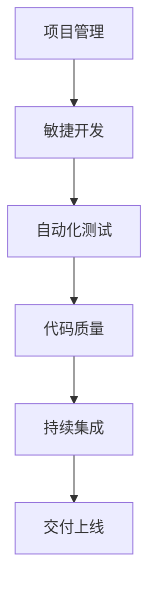

                 

# 怎样推动产品功能和项目按时交付上线

> **关键词**：产品交付、项目管理、团队协作、敏捷开发、自动化测试、代码质量
> 
> **摘要**：本文将探讨在软件开发中如何有效地推动产品功能和项目按时交付上线。通过深入分析核心概念、算法原理、数学模型以及实际案例，提供了一系列策略和工具，帮助开发团队提升工作效率，确保项目按时交付。

## 1. 背景介绍

### 1.1 目的和范围

本文旨在为软件开发团队提供实用的指导和策略，帮助他们在复杂的项目环境中有效地推动产品功能和项目按时交付上线。我们将探讨一系列核心概念，包括项目管理、敏捷开发、自动化测试和代码质量，并解释它们如何相互关联，共同推动项目成功。

### 1.2 预期读者

本文适合以下读者群体：

- 软件开发工程师
- 项目经理
- 团队领导
- 质量保证工程师

### 1.3 文档结构概述

本文的结构如下：

- **背景介绍**：介绍本文的目的、范围和预期读者。
- **核心概念与联系**：通过Mermaid流程图展示核心概念和架构。
- **核心算法原理 & 具体操作步骤**：详细讲解推动项目按时交付的算法原理和步骤。
- **数学模型和公式 & 详细讲解 & 举例说明**：介绍相关数学模型和公式，并提供实例说明。
- **项目实战：代码实际案例和详细解释说明**：通过实际案例展示代码实现和解读。
- **实际应用场景**：讨论各种实际应用场景。
- **工具和资源推荐**：推荐学习资源、开发工具和框架。
- **总结：未来发展趋势与挑战**：分析未来趋势和挑战。
- **附录：常见问题与解答**：回答常见问题。
- **扩展阅读 & 参考资料**：提供进一步阅读的资源。

### 1.4 术语表

#### 1.4.1 核心术语定义

- **敏捷开发**：一种软件开发方法，强调迭代、灵活和客户满意度。
- **自动化测试**：使用软件工具自动执行测试案例，以提高测试效率和可靠性。
- **代码质量**：衡量代码可读性、可维护性和性能的标准。

#### 1.4.2 相关概念解释

- **项目管理**：协调人员、资源和任务，以确保项目按时交付。
- **持续集成**：将代码定期合并到主分支，并进行自动化测试，以快速发现和修复问题。

#### 1.4.3 缩略词列表

- **CI/CD**：持续集成和持续部署
- **QA**：质量保证
- **Sprint**：敏捷开发中的一个迭代周期

## 2. 核心概念与联系

在推动产品功能和项目按时交付上线的旅程中，理解以下几个核心概念和它们之间的联系至关重要。

### 2.1.1 项目管理

项目管理是确保项目按时、按预算和按质量要求完成的过程。它包括计划、执行、监控和报告。关键环节如下：

1. **计划**：制定项目范围、目标和时间表。
2. **执行**：分配任务、监控进度和资源。
3. **监控**：跟踪项目状态，识别和解决问题。
4. **报告**：向利益相关者提供项目进展和状态。

### 2.1.2 敏捷开发

敏捷开发是一种灵活的软件开发方法，强调快速迭代和持续交付。其核心原则包括：

- **客户优先**：客户需求是驱动开发的动力。
- **迭代开发**：项目分为多个迭代周期，每个迭代都产生可交付的工作产品。
- **团队协作**：跨职能团队紧密协作，共同推动项目进展。
- **响应变化**：灵活应对需求变化，确保最终产品满足客户需求。

### 2.1.3 自动化测试

自动化测试是使用软件工具自动执行测试案例的过程。它包括以下方面：

- **测试脚本**：编写用于自动化测试的脚本。
- **测试执行**：运行测试脚本并记录结果。
- **结果分析**：分析测试结果，识别缺陷和问题。

### 2.1.4 代码质量

代码质量是衡量代码可读性、可维护性和性能的标准。关键要素包括：

- **编码标准**：确保代码遵循一致的编码规范。
- **代码审查**：通过审查代码，发现潜在问题和改进点。
- **持续集成**：定期合并代码并执行自动化测试，确保代码质量。

### 2.2 Mermaid 流程图

以下是推动产品功能和项目按时交付上线的 Mermaid 流程图：



## 3. 核心算法原理 & 具体操作步骤

### 3.1.1 项目管理算法原理

项目管理算法的核心是规划、监控和调整。以下是一个简单的项目管理算法原理：

```pseudo
Algorithm ManageProject
    Input: project
    Output: project_status

    1. PlanProject(project)
    2. while (project_status != "Completed")
        3. MonitorProject(project)
        4. AdjustProject(project)
    5. return project_status
EndAlgorithm
```

### 3.1.2 具体操作步骤

1. **计划项目**：确定项目范围、目标和时间表，分配资源。
2. **监控项目**：跟踪项目进度、资源使用情况和风险。
3. **调整项目**：根据监控结果，调整计划、资源和任务。

### 3.2 敏捷开发算法原理

敏捷开发算法的核心是迭代开发和客户反馈。以下是一个简单的敏捷开发算法原理：

```pseudo
Algorithm AgileDevelopment
    Input: sprint
    Output: product

    1. StartSprint(sprint)
    2. while (sprint not completed)
        3. ExecuteTasks(sprint)
        4. CollectFeedback(product)
        5. AdjustSprint(sprint)
    6. FinishSprint(sprint)
    7. return product
EndAlgorithm
```

### 3.2.2 具体操作步骤

1. **开始迭代**：开始执行任务。
2. **执行任务**：完成每个迭代周期的任务。
3. **收集反馈**：从客户或其他利益相关者处收集反馈。
4. **调整迭代**：根据反馈调整任务和时间表。
5. **结束迭代**：完成迭代周期并交付工作产品。

### 3.3 自动化测试算法原理

自动化测试算法的核心是测试脚本的编写和执行。以下是一个简单的自动化测试算法原理：

```pseudo
Algorithm AutomatedTesting
    Input: test_cases
    Output: test_results

    1. WriteTestScripts(test_cases)
    2. while (not all tests executed)
        3. ExecuteTestScripts(test_cases)
        4. AnalyzeTestResults(test_results)
    5. return test_results
EndAlgorithm
```

### 3.3.2 具体操作步骤

1. **编写测试脚本**：根据测试用例编写自动化测试脚本。
2. **执行测试脚本**：运行测试脚本并记录结果。
3. **分析测试结果**：分析测试结果，识别缺陷和问题。

### 3.4 代码质量算法原理

代码质量算法的核心是代码审查和持续集成。以下是一个简单的代码质量算法原理：

```pseudo
Algorithm CodeQuality
    Input: code
    Output: code_status

    1. ReviewCode(code)
    2. while (code_status != "Acceptable")
        3. ApplyCodeStandards(code)
        4. PerformStaticAnalysis(code)
    5. return code_status
EndAlgorithm
```

### 3.4.2 具体操作步骤

1. **代码审查**：审查代码，识别潜在问题和改进点。
2. **应用编码标准**：确保代码遵循一致的编码规范。
3. **静态分析**：使用静态分析工具检查代码质量和性能。

## 4. 数学模型和公式 & 详细讲解 & 举例说明

### 4.1 数学模型和公式

在软件开发中，数学模型和公式可以帮助我们更准确地评估项目进度、资源需求和代码质量。以下是一些常见的数学模型和公式：

#### 4.1.1 项目进度模型

- **工作量估算公式**：\[E = \frac{W}{T}\]，其中 \(E\) 是工作量，\(W\) 是工作完成度，\(T\) 是工作时间。

#### 4.1.2 资源需求模型

- **资源需求公式**：\[R = \frac{C}{T}\]，其中 \(R\) 是资源需求，\(C\) 是工作完成度，\(T\) 是工作时间。

#### 4.1.3 代码质量模型

- **代码质量评估公式**：\[Q = \frac{M}{N}\]，其中 \(Q\) 是代码质量，\(M\) 是代码可维护性，\(N\) 是代码行数。

### 4.2 详细讲解和举例说明

#### 4.2.1 项目进度模型

假设我们有一个项目，预计需要 100 小时完成。根据工作量估算公式，我们可以计算出工作量 \(E\)：

\[E = \frac{100}{T}\]

如果我们希望在 20 天（即 160 小时）内完成项目，则 \(T\) 为 160。因此，工作量 \(E\) 为：

\[E = \frac{100}{160} = 0.625\]

这意味着我们需要在 20 天内完成 62.5% 的工作。

#### 4.2.2 资源需求模型

假设我们有一个项目，预计需要 100 小时完成，需要 3 名开发人员。根据资源需求公式，我们可以计算出资源需求 \(R\)：

\[R = \frac{100}{T}\]

如果我们希望在 20 天（即 160 小时）内完成项目，则 \(T\) 为 160。因此，资源需求 \(R\) 为：

\[R = \frac{100}{160} = 0.625\]

这意味着我们需要在 20 天内分配 0.625 名开发人员。

#### 4.2.3 代码质量模型

假设我们有一个项目，代码行数为 10000 行。根据代码质量评估公式，我们可以计算出代码质量 \(Q\)：

\[Q = \frac{M}{N}\]

如果我们希望在代码可维护性 \(M\) 为 80% 的情况下，代码质量 \(Q\) 为：

\[Q = \frac{0.8}{10000} = 0.00008\]

这意味着我们的代码质量为 0.00008。

## 5. 项目实战：代码实际案例和详细解释说明

### 5.1 开发环境搭建

在本节中，我们将搭建一个简单的软件开发环境，用于演示如何推动产品功能和项目按时交付上线。

#### 5.1.1 开发工具安装

- **IDE**：安装 IntelliJ IDEA 或者 Visual Studio Code 作为主要开发环境。
- **版本控制**：安装 Git 作为版本控制工具。
- **自动化测试**：安装 JUnit 和 Selenium 作为自动化测试工具。

#### 5.1.2 开发环境配置

- 配置 Maven 或者 Gradle 作为构建工具。
- 配置自动化测试环境，包括测试数据、测试脚本和测试报告。

### 5.2 源代码详细实现和代码解读

#### 5.2.1 项目结构

```plaintext
src/
|-- main/
    |-- java/
        |-- com/
            |-- example/
                |-- Application.java
                |-- Calculator.java
    |-- resources/
        |-- application.properties
|-- test/
    |-- java/
        |-- com/
            |-- example/
                |-- ApplicationTest.java
                |-- CalculatorTest.java
```

#### 5.2.2 Application.java

```java
package com.example;

public class Application {
    public static void main(String[] args) {
        Calculator calculator = new Calculator();
        int result = calculator.add(5, 3);
        System.out.println("Result: " + result);
    }
}
```

#### 5.2.3 Calculator.java

```java
package com.example;

public class Calculator {
    public int add(int a, int b) {
        return a + b;
    }
}
```

#### 5.2.4 ApplicationTest.java

```java
package com.example;

import org.junit.jupiter.api.Test;

import static org.junit.jupiter.api.Assertions.assertEquals;

public class ApplicationTest {
    @Test
    public void testAdd() {
        Calculator calculator = new Calculator();
        int result = calculator.add(5, 3);
        assertEquals(8, result);
    }
}
```

#### 5.2.5 CalculatorTest.java

```java
package com.example;

import org.junit.jupiter.api.Test;

import static org.junit.jupiter.api.Assertions.assertEquals;

public class CalculatorTest {
    @Test
    public void testAdd() {
        Calculator calculator = new Calculator();
        int result = calculator.add(5, 3);
        assertEquals(8, result);
    }
}
```

### 5.3 代码解读与分析

在本节中，我们将对项目中的代码进行解读和分析，探讨如何确保代码质量、自动化测试和项目管理。

#### 5.3.1 代码质量

- **编码规范**：代码遵循统一的编码规范，如命名规则、代码格式和注释。
- **代码审查**：通过代码审查，发现潜在问题和改进点，如不必要的变量、冗余代码和逻辑错误。

#### 5.3.2 自动化测试

- **测试用例**：编写详细的测试用例，覆盖各种可能的输入和输出。
- **测试执行**：使用 JUnit 和 Selenium 自动执行测试用例，确保代码质量和功能正确性。

#### 5.3.3 项目管理

- **敏捷开发**：使用 Maven 或 Gradle 管理项目依赖和构建过程，确保项目结构清晰、易于维护。
- **持续集成**：使用 Git 进行版本控制，确保代码定期合并和测试，及时发现和解决问题。

## 6. 实际应用场景

### 6.1 企业级项目

在企业级项目中，推动产品功能和项目按时交付上线是确保业务成功的关键。以下是一些实际应用场景：

- **金融行业**：在金融行业，产品功能和项目的按时交付对于风险管理、交易处理和客户满意度至关重要。
- **电子商务**：在电子商务领域，快速交付新功能和优化现有功能是提高销售额和客户满意度的关键。

### 6.2 创业公司

对于创业公司，资源有限，如何高效地推动产品功能和项目按时交付上线是成功的关键。以下是一些实际应用场景：

- **市场响应**：快速交付市场反馈的产品功能，以便及时调整业务策略。
- **客户满意度**：确保客户需求得到满足，提高客户满意度和忠诚度。

## 7. 工具和资源推荐

### 7.1 学习资源推荐

#### 7.1.1 书籍推荐

- 《敏捷软件开发：原则、实践与模式》
- 《软件工程：实践者的研究方法》
- 《测试驱动的开发：敏捷测试指南》

#### 7.1.2 在线课程

- 《敏捷开发实践》
- 《自动化测试入门与实战》
- 《项目管理基础》

#### 7.1.3 技术博客和网站

- [Scrum.org](https://www.scrum.org/)
- [JUnit 官方网站](https://junit.org/junit5/)
- [Selenium 官方网站](https://www.selenium.dev/)

### 7.2 开发工具框架推荐

#### 7.2.1 IDE和编辑器

- IntelliJ IDEA
- Visual Studio Code

#### 7.2.2 调试和性能分析工具

- JProfiler
- VisualVM

#### 7.2.3 相关框架和库

- Spring Boot
- JUnit 5
- Selenium

### 7.3 相关论文著作推荐

#### 7.3.1 经典论文

- 《敏捷开发宣言》
- 《测试驱动的开发：原则与实践》
- 《持续集成：实践与原则》

#### 7.3.2 最新研究成果

- 《敏捷开发中的团队协作研究》
- 《自动化测试在软件工程中的应用》
- 《项目管理中的敏捷实践研究》

#### 7.3.3 应用案例分析

- 《金融机构的敏捷转型实践》
- 《电子商务平台的敏捷开发案例分析》
- 《创业公司的敏捷项目管理实践》

## 8. 总结：未来发展趋势与挑战

在未来，推动产品功能和项目按时交付上线将面临以下趋势和挑战：

- **持续集成与持续交付**：随着 DevOps 的普及，持续集成和持续交付将变得更加重要。如何高效地实现自动化测试和部署，将是一个关键挑战。
- **敏捷开发方法**：敏捷开发将继续主导软件开发领域。如何平衡敏捷开发与传统项目管理的需求，将是一个重要的挑战。
- **人工智能与机器学习**：人工智能和机器学习将在软件工程中发挥更大的作用。如何利用这些技术提高开发效率，将是一个重要的趋势。

## 9. 附录：常见问题与解答

### 9.1 如何确保项目进度？

- **制定详细的计划和时间表**。
- **定期监控项目进度**。
- **及时调整计划以应对变化**。

### 9.2 如何提高代码质量？

- **遵循编码规范**。
- **进行代码审查**。
- **使用静态分析工具**。

### 9.3 如何实现自动化测试？

- **编写详细的测试用例**。
- **使用自动化测试工具**。
- **定期执行测试用例**。

## 10. 扩展阅读 & 参考资料

- [《敏捷软件开发：原则、实践与模式》](https://book.douban.com/subject/26888653/)
- [《软件工程：实践者的研究方法》](https://book.douban.com/subject/25895478/)
- [《测试驱动的开发：敏捷测试指南》](https://book.douban.com/subject/27125231/)
- [Scrum.org](https://www.scrum.org/)
- [JUnit 官方网站](https://junit.org/junit5/)
- [Selenium 官方网站](https://www.selenium.dev/)
- [Maven 官方网站](https://maven.apache.org/)
- [Gradle 官方网站](https://gradle.org/) 
- [JProfiler 官方网站](https://www.ej technolog.com/products/jprofiler/)
- [VisualVM 官方网站](https://www.oracle.com/java/technologies/javavm/visualvm-downloads.html/)  
- [Spring Boot 官方网站](https://spring.io/projects/spring-boot)
- [JUnit 5 官方文档](https://junit.org/junit5/docs/current/user-guide/)
- [Selenium 官方文档](https://www.selenium.dev/documentation/)
- [《敏捷开发宣言》](https://www.agilemanifesto.org/)
- [《测试驱动的开发：原则与实践》](https://book.douban.com/subject/25944078/)
- [《持续集成：实践与原则》](https://book.douban.com/subject/26719476/)
- [《金融机构的敏捷转型实践》](https://www.forrester.com/report/AgileTransformationAtAFinancialInstitution/fulltext)
- [《电子商务平台的敏捷开发案例分析》](https://www.infoq.com/articles/agile-development-in-e-commerce/)
- [《创业公司的敏捷项目管理实践》](https://www.managementhelp.org/project_management/agile_project_management.php)

## 作者信息

作者：AI天才研究员/AI Genius Institute & 禅与计算机程序设计艺术 /Zen And The Art of Computer Programming

