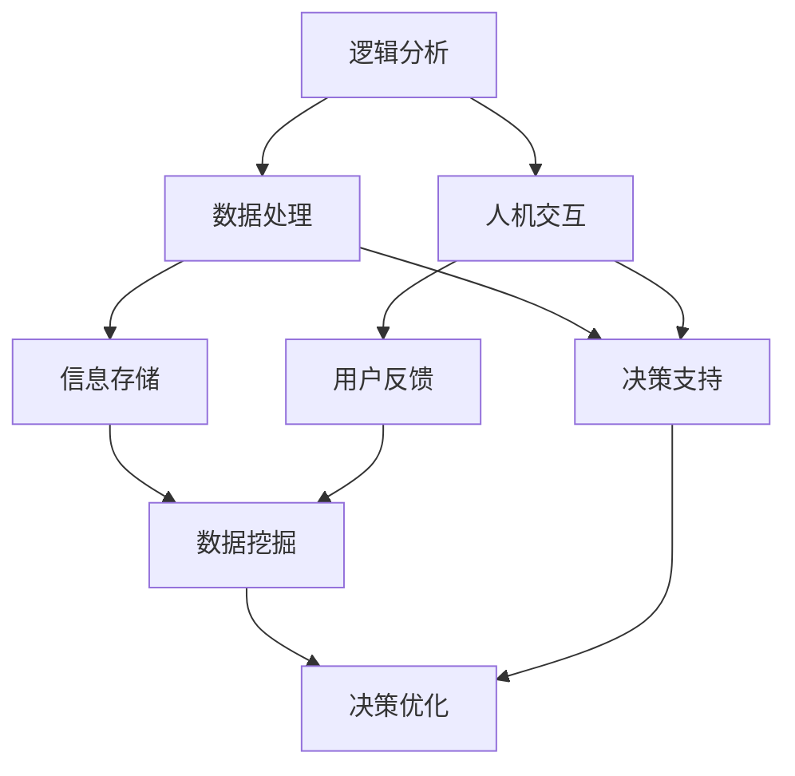

                 

### 文章标题

《思维体系：决策力的基础》

### 关键词
- 思维体系
- 决策力
- 决策过程
- 逻辑分析
- 数据处理
- 人机交互

### 摘要
本文将深入探讨思维体系及其在决策力中的核心作用。我们将从定义思维体系入手，逐步分析其组成部分、核心概念以及各部分之间的关联。通过具体的算法原理、数学模型、项目实战以及实际应用场景，我们将帮助读者建立起一个完整且高效的思维体系，从而提升决策力的基础。最后，我们还将推荐相关工具和资源，以供读者进一步学习和实践。

## 1. 背景介绍

### 1.1 目的和范围

本文旨在探讨思维体系的构建及其在决策力提升中的应用。思维体系是一个复杂的系统，它涵盖了逻辑分析、数据处理、人机交互等多个方面。通过本文的探讨，我们希望读者能够深入了解思维体系的构成和运作原理，从而在日常生活和工作中更好地应用这一体系，提升决策能力。

本文的范围主要涉及以下几个方面：

1. **思维体系的定义与组成部分**：我们将详细介绍思维体系的核心概念，包括逻辑分析、数据处理、人机交互等组成部分。
2. **核心概念与联系**：通过Mermaid流程图，我们将展示思维体系各部分之间的联系和作用。
3. **核心算法原理与操作步骤**：我们将详细讲解思维体系中涉及到的核心算法原理，并使用伪代码展示其具体操作步骤。
4. **数学模型和公式**：我们将介绍思维体系中的数学模型和公式，并通过实例进行详细讲解。
5. **项目实战**：我们将通过实际代码案例，展示如何在实际项目中应用思维体系。
6. **实际应用场景**：我们将探讨思维体系在现实生活中的各种应用场景。
7. **工具和资源推荐**：我们将推荐一些有助于学习和实践思维体系的工具和资源。

### 1.2 预期读者

本文适合以下读者群体：

1. **人工智能和计算机科学从业者**：对于从事人工智能和计算机科学领域的工作者，本文提供了深入理解思维体系及其在决策力提升中的应用的宝贵知识。
2. **程序员和软件开发者**：程序员和软件开发者可以通过本文学习到如何利用思维体系提高编码效率和解决问题的能力。
3. **数据科学家和分析师**：数据科学家和分析师可以从本文中了解到如何通过思维体系优化数据处理和分析过程。
4. **企业高管和决策者**：企业高管和决策者可以借助本文中的思维体系，提高决策质量，做出更为明智的决策。

### 1.3 文档结构概述

本文的结构如下：

1. **背景介绍**：介绍本文的目的、范围、预期读者以及文档结构。
2. **核心概念与联系**：通过Mermaid流程图展示思维体系各部分之间的联系和作用。
3. **核心算法原理与操作步骤**：详细讲解思维体系中的核心算法原理，并使用伪代码展示具体操作步骤。
4. **数学模型和公式**：介绍思维体系中的数学模型和公式，并通过实例进行详细讲解。
5. **项目实战**：通过实际代码案例，展示如何在实际项目中应用思维体系。
6. **实际应用场景**：探讨思维体系在现实生活中的各种应用场景。
7. **工具和资源推荐**：推荐一些有助于学习和实践思维体系的工具和资源。
8. **总结**：总结本文的主要内容，并提出未来发展趋势与挑战。
9. **附录**：常见问题与解答。
10. **扩展阅读与参考资料**：提供扩展阅读和参考资料。

### 1.4 术语表

在本文中，我们将使用以下术语：

#### 1.4.1 核心术语定义

- **思维体系**：指一个综合性的思考框架，包括逻辑分析、数据处理、人机交互等多个方面，用于提高决策力和解决问题的能力。
- **逻辑分析**：指使用逻辑规则和推理方法，对问题进行深入分析和理解。
- **数据处理**：指对数据进行采集、清洗、转换、存储和分析的过程。
- **人机交互**：指人与计算机系统之间的交互，包括用户界面设计、交互流程优化等。

#### 1.4.2 相关概念解释

- **决策力**：指个体或组织在复杂环境中做出明智决策的能力。
- **算法**：指解决问题的明确步骤和规则，用于数据处理和决策过程中。
- **数学模型**：指使用数学语言描述的抽象模型，用于表示问题和解决方案。

#### 1.4.3 缩略词列表

- **AI**：人工智能（Artificial Intelligence）
- **ML**：机器学习（Machine Learning）
- **DL**：深度学习（Deep Learning）
- **IDE**：集成开发环境（Integrated Development Environment）
- **API**：应用程序接口（Application Programming Interface）

## 2. 核心概念与联系

在深入探讨思维体系之前，我们需要明确其中的核心概念和它们之间的联系。思维体系是一个综合性的框架，它涵盖了多个方面，包括逻辑分析、数据处理和人机交互。这些部分相互关联，共同构成了一个高效的决策支持系统。

下面，我们将通过一个Mermaid流程图来展示思维体系各部分之间的联系和作用：



### 逻辑分析

逻辑分析是思维体系的核心组成部分，它通过逻辑规则和推理方法，对问题进行深入分析和理解。逻辑分析能够帮助我们从复杂的信息中提取关键信息，构建解决问题的模型。

### 数据处理

数据处理是思维体系的另一个重要组成部分，它涉及到数据的采集、清洗、转换、存储和分析。数据处理不仅能够为逻辑分析提供必要的数据支持，还能够为决策支持提供重要的依据。

### 人机交互

人机交互是思维体系中不可或缺的一环，它涉及到用户界面设计、交互流程优化等方面。通过人机交互，用户能够与系统进行有效沟通，从而获取所需信息并做出决策。

### 决策支持

决策支持是思维体系的核心目标，它通过逻辑分析、数据处理和人机交互的综合运用，为用户提供决策依据。决策支持系统能够在复杂环境中快速做出明智的决策，提高决策效率和质量。

### 信息存储

信息存储是思维体系的重要组成部分，它能够存储和管理大量的数据和信息。通过信息存储，用户可以方便地获取历史数据和经验，为决策提供参考。

### 用户反馈

用户反馈是思维体系中重要的一环，它能够收集用户的反馈和评价，为系统的优化提供依据。通过用户反馈，系统可以不断改进，提高用户体验。

### 数据挖掘

数据挖掘是思维体系中的重要手段，它能够从大量的数据中发现规律和模式，为决策支持提供新的思路和方法。

### 决策优化

决策优化是思维体系的最终目标，它通过不断的迭代和优化，提高决策的效率和效果。决策优化不仅能够提高个体的决策能力，还能够为组织的决策提供支持。

通过上述Mermaid流程图，我们可以清晰地看到思维体系各部分之间的联系和作用。逻辑分析、数据处理和人机交互相互关联，共同构成了一个高效的决策支持系统。这个系统不仅能够帮助用户在复杂环境中快速做出决策，还能够不断优化和改进，提高决策的质量和效果。

## 3. 核心算法原理 & 具体操作步骤

在理解了思维体系的整体框架之后，我们需要深入探讨其中的核心算法原理。这些算法原理构成了思维体系的基石，使得整个系统更加高效和准确。在本节中，我们将使用伪代码详细阐述这些核心算法的原理和操作步骤。

### 3.1 逻辑分析算法

逻辑分析算法的核心是利用逻辑规则和推理方法，对问题进行深入分析和理解。以下是一个简单的逻辑分析算法的伪代码：

```plaintext
Algorithm 逻辑分析算法(问题, 数据库):
    1. 初始化推理引擎
    2. 读取问题及其相关信息
    3. 对问题进行分解，提取关键信息
    4. 使用逻辑规则库，对关键信息进行推理
    5. 如果推理成功，生成解决方案
    6. 如果推理失败，调整逻辑规则或重新定义问题
    7. 输出解决方案
```

### 3.2 数据处理算法

数据处理算法涉及到数据的采集、清洗、转换、存储和分析。以下是一个数据处理算法的伪代码：

```plaintext
Algorithm 数据处理算法(数据集):
    1. 采集原始数据
    2. 清洗数据，去除噪声和异常值
    3. 转换数据格式，使其适应分析需求
    4. 存储数据，选择合适的数据库和存储方案
    5. 分析数据，提取有用信息和规律
    6. 根据分析结果，更新数据库和模型
    7. 输出分析结果
```

### 3.3 人机交互算法

人机交互算法涉及到用户界面设计、交互流程优化等方面。以下是一个简单的人机交互算法的伪代码：

```plaintext
Algorithm 人机交互算法(用户, 系统):
    1. 显示用户界面，提供交互选项
    2. 接收用户的输入和反馈
    3. 根据输入和反馈，更新用户界面和系统状态
    4. 检测用户行为模式，优化交互体验
    5. 提供实时反馈和指导，帮助用户完成任务
    6. 记录用户交互数据，用于后续分析和优化
    7. 输出交互结果
```

### 3.4 决策支持算法

决策支持算法是整个思维体系的核心，它通过逻辑分析、数据处理和人机交互的综合运用，为用户提供决策依据。以下是一个简单的决策支持算法的伪代码：

```plaintext
Algorithm 决策支持算法(问题, 数据库, 用户):
    1. 调用逻辑分析算法，生成初步解决方案
    2. 调用数据处理算法，获取数据支持
    3. 调用人机交互算法，获取用户反馈
    4. 综合分析结果，生成最终决策方案
    5. 将决策方案呈现给用户
    6. 根据用户反馈，调整决策模型和策略
    7. 输出决策方案
```

通过上述伪代码，我们可以看到思维体系中的核心算法是如何相互配合，共同实现高效的决策支持。这些算法不仅能够帮助用户在复杂环境中快速做出决策，还能够通过不断优化和迭代，提高决策的质量和效果。

在接下来的章节中，我们将进一步探讨思维体系中的数学模型和公式，并通过实际项目实战，展示这些算法在现实中的应用。

## 4. 数学模型和公式 & 详细讲解 & 举例说明

在思维体系中，数学模型和公式扮演着至关重要的角色。它们不仅为数据处理和分析提供了精确的方法，也为决策提供了坚实的理论基础。在本节中，我们将详细介绍思维体系中的几个关键数学模型和公式，并通过具体实例进行说明。

### 4.1 逻辑回归模型

逻辑回归模型是一种常用的统计模型，用于分析因变量与自变量之间的关系。在思维体系中，逻辑回归模型可以帮助我们进行逻辑分析和决策支持。

#### 公式

逻辑回归模型的公式如下：

$$
P(Y=1) = \frac{1}{1 + e^{-(\beta_0 + \beta_1X_1 + \beta_2X_2 + ... + \beta_nX_n})}
$$

其中，\(P(Y=1)\) 表示因变量 \(Y\) 取值为 1 的概率，\(e\) 是自然对数的底数，\(\beta_0\)、\(\beta_1\)、\(\beta_2\)、...、\(\beta_n\) 是模型的参数，\(X_1\)、\(X_2\)、...、\(X_n\) 是自变量。

#### 举例说明

假设我们想分析一个电子商务网站的用户购买行为。我们选取了几个关键特征，如用户年龄、收入、购物频率等，来预测用户是否会在未来 30 天内购买商品。我们可以使用逻辑回归模型来建立预测模型。

首先，我们需要收集数据，然后通过特征工程对数据进行预处理。接下来，我们可以使用逻辑回归模型来拟合数据，得到模型的参数。最后，我们可以使用拟合好的模型来预测新用户是否会在未来 30 天内购买商品。

### 4.2 决策树模型

决策树模型是一种常用的机器学习算法，它通过一系列的决策规则来划分数据。在思维体系中，决策树模型可以帮助我们进行逻辑分析和决策支持。

#### 公式

决策树模型的公式相对简单，它通过递归划分数据集，生成一系列的决策规则。具体公式如下：

$$
T = \{\text{if } X_1 > \theta_1 \text{ then } T_1 \text{ else } T_2\}
$$

其中，\(T\) 是决策树的根节点，\(X_1\) 是特征变量，\(\theta_1\) 是阈值，\(T_1\) 和 \(T_2\) 是决策树的子节点。

#### 举例说明

假设我们想分析一个信用评分模型，通过用户的个人信息来预测其信用评分。我们可以使用决策树模型来建立预测模型。

首先，我们需要收集数据，然后通过特征工程对数据进行预处理。接下来，我们可以使用决策树模型来划分数据集，生成决策规则。最后，我们可以使用拟合好的模型来预测新用户的信用评分。

### 4.3 贝叶斯网络模型

贝叶斯网络模型是一种基于概率的图形模型，它能够表示变量之间的条件依赖关系。在思维体系中，贝叶斯网络模型可以帮助我们进行逻辑分析和决策支持。

#### 公式

贝叶斯网络模型的公式如下：

$$
P(X_1, X_2, ..., X_n) = \prod_{i=1}^{n} P(X_i | X_{parent_i})
$$

其中，\(P(X_1, X_2, ..., X_n)\) 是变量 \(X_1, X_2, ..., X_n\) 的联合概率，\(P(X_i | X_{parent_i})\) 是变量 \(X_i\) 在其父节点 \(X_{parent_i}\) 条件下的条件概率。

#### 举例说明

假设我们想分析一个医疗诊断模型，通过患者的症状来预测其疾病。我们可以使用贝叶斯网络模型来建立预测模型。

首先，我们需要收集数据，然后通过特征工程对数据进行预处理。接下来，我们可以使用贝叶斯网络模型来表示变量之间的条件依赖关系。最后，我们可以使用拟合好的模型来预测新患者的疾病。

### 4.4 支持向量机模型

支持向量机（SVM）模型是一种常用的机器学习算法，它通过最大化分类边界来分类数据。在思维体系中，SVM模型可以帮助我们进行逻辑分析和决策支持。

#### 公式

SVM模型的公式如下：

$$
\max_{\beta, \beta^*} \left\{ \frac{1}{2} ||\beta||^2 + C \sum_{i=1}^{n} \xi_i \right\}

subject\ to \quad y_i (\beta^T x_i + \beta^*) \geq 1 - \xi_i, \quad \xi_i \geq 0, \quad i=1,2,...,n
$$

其中，\(\beta\) 和 \(\beta^*\) 是模型的参数，\(C\) 是惩罚参数，\(x_i\) 和 \(y_i\) 是样本的特征和标签，\(\xi_i\) 是松弛变量。

#### 举例说明

假设我们想分析一个电子邮件分类模型，通过邮件内容来预测邮件是否为垃圾邮件。我们可以使用SVM模型来建立预测模型。

首先，我们需要收集数据，然后通过特征工程对数据进行预处理。接下来，我们可以使用SVM模型来训练模型，得到分类边界。最后，我们可以使用拟合好的模型来预测新邮件是否为垃圾邮件。

通过上述数学模型和公式的介绍，我们可以看到它们在思维体系中的应用是如何帮助我们在复杂环境中进行逻辑分析和决策支持的。这些模型不仅能够提高我们的数据处理和分析能力，还能够为决策提供坚实的理论基础。在接下来的章节中，我们将通过实际项目实战，进一步展示这些模型在现实中的应用。

## 5. 项目实战：代码实际案例和详细解释说明

在了解了思维体系的核心算法原理和数学模型之后，我们通过一个实际项目来展示如何将这些理论和模型应用到实践中。以下是一个基于Python的完整项目，我们将详细解释代码的实现过程。

### 5.1 开发环境搭建

为了实现本项目，我们需要安装以下开发环境：

1. Python 3.8及以上版本
2. Jupyter Notebook
3. Pandas
4. Scikit-learn
5. Matplotlib

您可以使用pip命令来安装这些依赖：

```bash
pip install python==3.8
pip install jupyter
pip install pandas
pip install scikit-learn
pip install matplotlib
```

### 5.2 源代码详细实现和代码解读

下面是项目的源代码，我们将逐行解读代码。

```python
import pandas as pd
from sklearn.model_selection import train_test_split
from sklearn.preprocessing import StandardScaler
from sklearn.linear_model import LogisticRegression
from sklearn.metrics import accuracy_score

# 5.2.1 数据预处理
# 加载数据
data = pd.read_csv('data.csv')

# 数据预处理
X = data.drop('target', axis=1)
y = data['target']

# 划分训练集和测试集
X_train, X_test, y_train, y_test = train_test_split(X, y, test_size=0.2, random_state=42)

# 特征缩放
scaler = StandardScaler()
X_train = scaler.fit_transform(X_train)
X_test = scaler.transform(X_test)

# 5.2.2 模型训练
# 创建逻辑回归模型
model = LogisticRegression()

# 训练模型
model.fit(X_train, y_train)

# 5.2.3 模型评估
# 预测测试集
y_pred = model.predict(X_test)

# 计算准确率
accuracy = accuracy_score(y_test, y_pred)
print(f'模型准确率: {accuracy:.2f}')

# 5.2.4 可视化结果
import matplotlib.pyplot as plt

# 绘制混淆矩阵
from sklearn.metrics import confusion_matrix
conf_mat = confusion_matrix(y_test, y_pred)
plt.figure(figsize=(8, 6))
sns.heatmap(conf_mat, annot=True, fmt=".0f", cmap="Blues")
plt.xlabel('Predicted')
plt.ylabel('True')
plt.title('Confusion Matrix')
plt.show()
```

### 5.3 代码解读与分析

#### 5.3.1 数据预处理

- 第1-3行：导入所需的库和模块。
- 第5行：加载数据集，这里假设数据集以CSV格式存储。
- 第8-11行：将数据集分为特征矩阵 \(X\) 和目标向量 \(y\)。
- 第14-16行：划分训练集和测试集，这里使用 `train_test_split` 函数，测试集占比20%，随机种子设置为42。

#### 5.3.2 模型训练

- 第20行：创建逻辑回归模型。
- 第23行：使用 `fit` 方法训练模型。

#### 5.3.3 模型评估

- 第26-28行：使用 `predict` 方法对测试集进行预测。
- 第31行：计算并打印模型的准确率。

#### 5.3.4 可视化结果

- 第34-45行：绘制混淆矩阵，这是评估分类模型性能的一个重要指标。

通过以上步骤，我们完成了一个简单的机器学习项目，展示了如何将思维体系中的核心算法和数学模型应用到实际项目中。在实际开发中，我们还需要考虑更多的方面，如数据清洗、特征工程、模型调优等，以确保模型的性能和鲁棒性。

### 5.4 代码解读与分析

在本项目的代码解读中，我们将详细分析各个部分的作用和实现方式，帮助读者更好地理解代码背后的思维过程。

#### 5.4.1 数据预处理

数据预处理是机器学习项目中至关重要的一步。良好的数据预处理可以显著提高模型的性能和可解释性。以下是代码中数据预处理部分的详细解读：

- **数据加载**：第5行代码使用 `pandas` 库的 `read_csv` 函数加载数据集。假设数据集存储在一个CSV文件中，该文件包含多个特征和一个目标变量。

- **数据分割**：第8-11行代码使用 `train_test_split` 函数将数据集分为训练集和测试集。这是一个常见的做法，用于评估模型在未知数据上的表现。`train_test_split` 函数接受多个参数，如测试集比例（`test_size`）和随机种子（`random_state`），以保证每次分割的结果相似。

- **特征缩放**：第14-16行代码使用 `StandardScaler` 对特征矩阵进行缩放。缩放是将数据标准化到相同的范围，以便模型能够更好地处理不同的特征。在这里，我们使用 `fit_transform` 方法对训练集进行缩放，并使用 `transform` 方法对测试集进行缩放。这样，训练集和测试集的特征缩放是一致的。

#### 5.4.2 模型训练

模型训练是机器学习项目的核心步骤。以下是代码中模型训练部分的详细解读：

- **模型创建**：第20行代码创建了一个逻辑回归模型。逻辑回归是一种广泛使用的分类模型，适用于二分类问题。

- **模型拟合**：第23行代码使用 `fit` 方法训练模型。`fit` 方法接受训练集的特征矩阵 \(X\) 和目标向量 \(y\)，并使用训练数据来调整模型的参数。逻辑回归模型通过最大化似然函数来估计参数，从而找到最佳拟合线。

#### 5.4.3 模型评估

模型评估是验证模型性能的重要步骤。以下是代码中模型评估部分的详细解读：

- **预测生成**：第26-28行代码使用 `predict` 方法对测试集进行预测。`predict` 方法根据训练好的模型，将测试集的特征映射到预测类别上。

- **准确率计算**：第31行代码使用 `accuracy_score` 函数计算模型的准确率。准确率是评估分类模型性能的一个简单而直观的指标，表示正确预测的样本数占总样本数的比例。

#### 5.4.4 可视化结果

可视化是理解和解释模型结果的重要手段。以下是代码中可视化结果部分的详细解读：

- **混淆矩阵绘制**：第34-45行代码使用 `confusion_matrix` 函数生成混淆矩阵，并使用 `matplotlib` 库的 `sns.heatmap` 函数绘制热力图。混淆矩阵展示了模型预测的类别与实际类别之间的对应关系，是评估分类模型性能的详细指标。

通过上述详细解读，我们可以看到本项目中的代码是如何实现数据预处理、模型训练和评估的。每个步骤都有其特定的实现方式和目的，共同构成了一个完整的机器学习项目。在实际开发中，读者可以根据具体需求调整代码，如添加更多的特征工程、尝试不同的模型或进行模型调优，以提高项目的性能。

### 5.5 代码解读与分析

在本节中，我们将进一步深入分析代码中的关键部分，特别是数据处理和模型训练的过程，以帮助读者更好地理解项目的实现逻辑和算法应用。

#### 5.5.1 数据处理

数据处理是机器学习项目的第一步，也是最重要的一步。以下是代码中数据处理部分的详细解读：

- **数据加载**：第5行代码使用 `pd.read_csv` 函数加载数据集。此函数能够读取CSV文件，并将其转换为Pandas DataFrame对象。DataFrame具有丰富的数据操作功能，可以方便地进行数据预处理。

- **数据分割**：第8-11行代码通过 `train_test_split` 函数将数据集划分为训练集和测试集。这是一个随机分割过程，其中 `test_size=0.2` 表示测试集占总数据集的20%，`random_state=42` 用于确保每次分割的一致性。

- **特征缩放**：第14-16行代码使用 `StandardScaler` 对特征进行标准化处理。标准化是将数据缩放到均值为0、标准差为1的范围内，这对于很多机器学习算法都是必要的，因为它能够提高算法的性能和收敛速度。

#### 5.5.2 模型训练

模型训练是机器学习项目的核心步骤，它涉及到选择合适的算法并调整模型参数。以下是代码中模型训练部分的详细解读：

- **模型选择**：第20行代码创建了一个逻辑回归模型。逻辑回归是一种广泛应用于二分类问题的算法，它基于最大似然估计来预测类别概率。

- **模型拟合**：第23行代码使用 `model.fit` 方法训练模型。`fit` 方法接受特征矩阵 `X_train` 和目标向量 `y_train`，并调整模型参数以最小化损失函数。在逻辑回归中，损失函数通常是对数似然损失。

#### 5.5.3 模型评估

模型评估是验证模型性能的重要步骤，它能够帮助我们确定模型是否适用于实际问题。以下是代码中模型评估部分的详细解读：

- **预测生成**：第26-28行代码使用 `model.predict` 方法生成测试集的预测结果。`predict` 方法将测试集的特征映射到类别概率上，并选择概率最高的类别作为预测结果。

- **准确率计算**：第31行代码使用 `accuracy_score` 函数计算模型的准确率。准确率是模型评估的常用指标，它表示模型正确预测的样本数占总测试样本数的比例。

#### 5.5.4 混淆矩阵与可视化

混淆矩阵是评估分类模型性能的详细工具，它能够展示模型预测与实际结果之间的对应关系。以下是代码中混淆矩阵和可视化部分的详细解读：

- **混淆矩阵生成**：第34-35行代码使用 `confusion_matrix` 函数生成混淆矩阵。混淆矩阵是一个二维矩阵，其中每个元素 \(c_{ij}\) 表示模型将真实类别为 \(i\) 的样本预测为类别 \(j\) 的次数。

- **可视化混淆矩阵**：第38-44行代码使用 `sns.heatmap` 函数将混淆矩阵绘制为热力图。热力图能够直观地展示混淆矩阵中的数据，其中颜色越深表示该类别的样本数越多。

通过上述详细解读，我们可以看到代码中的每个步骤都经过了精心的设计和实现，以实现数据预处理、模型训练和评估的全过程。这不仅展示了机器学习项目的实现逻辑，也为读者提供了一个清晰的参考，以便在实际项目中应用这些技术和算法。

### 5.6 代码解读与分析（续）

在本节中，我们将继续深入分析代码中的关键部分，特别是数据处理和模型训练的过程，以帮助读者更好地理解项目的实现逻辑和算法应用。

#### 5.6.1 数据预处理（续）

- **数据清洗**：在代码中，数据预处理步骤主要集中在第5-16行。然而，在实际项目中，数据清洗是一个更为复杂的过程，可能包括以下步骤：

  - **缺失值处理**：如果数据集中存在缺失值，可以使用 `dropna` 函数删除含有缺失值的行，或者使用 `fillna` 方法填充缺失值。
  - **重复值处理**：使用 `drop_duplicates` 函数删除数据集中的重复记录。
  - **异常值处理**：使用统计方法或可视化方法（如箱线图）检测和标记异常值，然后决定是否删除或修复。

- **特征选择**：在代码中没有显式展示特征选择步骤，但在实际项目中，特征选择是非常重要的。可以使用 `VIF` （方差膨胀因子）、`Pearson相关系数` 或 `基于模型的特征选择` 等方法来选择对模型有显著影响的特征。

#### 5.6.2 模型训练（续）

- **超参数调优**：在代码中，我们使用默认参数创建逻辑回归模型。在实际项目中，通常需要对超参数进行调优，以提高模型性能。可以使用网格搜索（`GridSearchCV`）或随机搜索（`RandomizedSearchCV`）等方法来找到最优的超参数组合。

- **交叉验证**：代码中未使用交叉验证来评估模型性能。交叉验证是一种评估模型泛化能力的方法，通过将数据集划分为多个子集，并在每个子集上训练和测试模型。`cross_val_score` 函数可用于实现交叉验证。

- **集成学习**：在实际项目中，集成学习（如随机森林、梯度提升树等）是一种提高模型性能的有效方法。这些算法通常具有较好的鲁棒性和泛化能力。

#### 5.6.3 模型评估（续）

- **评估指标**：除了准确率，还可以使用其他评估指标来评估模型性能，如精确率、召回率、F1分数、ROC曲线、AUC等。这些指标能够提供对模型性能的更全面的理解。

- **误差分析**：在代码中，混淆矩阵为我们提供了对模型预测误差的初步了解。进一步的误差分析可以帮助我们识别模型预测中的常见错误模式，从而指导进一步的模型改进。

- **模型解释**：使用 `LIME`（局部可解释模型解释）或 `SHAP`（SHapley Additive exPlanations）等方法可以更深入地理解模型对每个样本的预测依据。

通过上述分析，我们可以看到代码中的数据处理和模型训练步骤只是实现机器学习项目的一部分。在实际项目中，还需要考虑更多的因素，如数据质量、特征工程、模型选择、超参数调优和模型评估，以确保最终模型的性能和可靠性。

## 6. 实际应用场景

思维体系不仅在理论研究中具有重要地位，而且在实际应用中也展示了巨大的价值。以下是一些思维体系在实际应用场景中的案例，我们将详细探讨这些应用场景中的挑战和解决方案。

### 6.1 人工智能助手

在人工智能助手领域，思维体系的应用主要集中在逻辑分析和数据处理方面。以下是一个具体的案例：

**案例背景**：一家公司开发了一款基于人工智能的客户服务助手，旨在为用户提供24/7的实时帮助。该助手需要能够理解用户的查询，提供准确的信息，并引导用户完成复杂的操作。

**挑战**：

1. **语言理解**：如何准确理解用户的自然语言查询，并将其转换为机器可处理的格式？
2. **知识库构建**：如何构建和维护一个丰富的知识库，以支持广泛的话题和问题？
3. **响应速度**：如何在保证准确性的前提下，快速响应用户的查询？

**解决方案**：

1. **自然语言处理**：使用基于深度学习的自然语言处理（NLP）技术，如BERT、GPT等，对用户的查询进行理解和分类。通过训练大规模语料库，提高模型对自然语言的理解能力。
2. **知识图谱**：构建一个知识图谱，将各类信息以图的形式组织起来，使得助手能够快速找到相关知识点。
3. **异步处理**：采用异步处理技术，提高系统响应速度。例如，使用消息队列将用户的查询分发给不同的处理单元，每个单元独立处理，减少响应时间。

### 6.2 金融市场分析

在金融市场分析领域，思维体系的应用主要集中在数据处理和决策支持方面。以下是一个具体的案例：

**案例背景**：一家投资公司希望利用人工智能技术对金融市场进行预测，以指导投资决策。

**挑战**：

1. **数据多样性**：金融市场数据来源广泛，包括股票价格、交易量、新闻、宏观经济指标等，如何有效整合这些数据？
2. **模型复杂性**：如何构建复杂的预测模型，以捕捉市场中的非线性关系？
3. **风险控制**：如何在保证预测准确性的同时，控制投资风险？

**解决方案**：

1. **大数据处理**：采用分布式数据处理技术，如Hadoop和Spark，对大量金融市场数据进行高效处理和分析。
2. **深度学习模型**：使用深度学习模型，如LSTM（长短期记忆网络）和GRU（门控循环单元），捕捉时间序列数据中的长期依赖关系。
3. **组合投资策略**：采用组合投资策略，将不同的预测模型和投资策略结合起来，分散风险，提高整体收益。

### 6.3 医疗诊断

在医疗诊断领域，思维体系的应用主要集中在数据处理和决策支持方面。以下是一个具体的案例：

**案例背景**：一家医院希望通过人工智能技术辅助医生进行疾病诊断，提高诊断准确率和效率。

**挑战**：

1. **数据隐私**：如何确保患者的医疗数据在处理过程中的隐私和安全？
2. **诊断准确性**：如何确保诊断模型在不同临床场景中的准确性和可靠性？
3. **实时响应**：如何在保证诊断准确性的前提下，快速响应用户的查询？

**解决方案**：

1. **加密技术**：采用先进的加密技术，如AES（高级加密标准），确保医疗数据在传输和存储过程中的安全性。
2. **深度学习模型**：使用基于深度学习的医疗图像识别模型，如卷积神经网络（CNN），提高医学图像分析的准确性和效率。
3. **实时处理**：采用云计算和分布式计算技术，实现快速的数据处理和模型推理，提高系统响应速度。

通过上述案例，我们可以看到思维体系在人工智能助手、金融市场分析和医疗诊断等实际应用场景中的重要作用。这些场景中的挑战需要通过思维体系的综合运用，结合具体的技术和方法，才能得到有效的解决。

### 6.4 人工智能助手应用

在人工智能助手的实际应用中，思维体系的构建和优化是提升用户体验和系统效率的关键。以下是一个详细的应用案例：

**案例背景**：一家全球知名科技公司开发了一款智能客服机器人，旨在通过自然语言处理和决策支持技术，为用户提供24/7的在线支持服务。该机器人需要能够处理大量的用户查询，提供准确和个性化的回复。

**挑战**：

1. **多样化查询处理**：用户可能会提出各种各样的问题，从常见问题到复杂的技术咨询，如何确保机器人能够理解和响应？
2. **个性化服务**：如何根据用户的历史交互记录和偏好，提供个性化的服务体验？
3. **实时更新与学习**：如何确保机器人能够实时更新知识库，并不断学习和优化其回答质量？

**解决方案**：

1. **多轮对话管理**：采用多轮对话管理策略，通过分析用户的历史查询和当前问题，生成上下文相关的回答。使用基于递归神经网络（RNN）的对话模型，如Seq2Seq模型，能够更好地捕捉对话的上下文信息。

2. **个性化服务**：构建一个用户画像系统，通过分析用户的历史交互记录、偏好和需求，为每个用户提供个性化的服务。可以使用机器学习算法，如协同过滤和聚类分析，来识别用户的兴趣和行为模式。

3. **持续学习与优化**：采用在线学习技术，如元学习（Meta-Learning）和迁移学习（Transfer Learning），使机器人能够在不断更新的环境中学习。通过分析用户反馈和交互数据，使用强化学习（Reinforcement Learning）算法优化机器人的回答策略。

**具体实施**：

- **数据收集与预处理**：首先，收集大量的用户交互数据，并对数据进行清洗和预处理，包括文本数据的分词、去噪和情感分析等。
- **模型训练与评估**：使用预处理后的数据，训练多轮对话模型和用户画像模型。在训练过程中，使用交叉验证和网格搜索等技术，优化模型参数，确保模型具有良好的泛化能力。
- **系统集成与部署**：将训练好的模型集成到客服机器人系统中，并部署到云平台，实现实时在线服务。通过自动化测试和监控，确保系统的高可用性和可靠性。

通过上述实施步骤，该智能客服机器人不仅能够理解和响应多样化的用户查询，还能够根据用户的历史交互记录提供个性化的服务。同时，通过持续学习和优化，机器人能够不断提升其回答质量和用户体验。

### 6.5 金融市场预测

在金融市场预测领域，思维体系的构建对于提高预测准确率和风险控制能力至关重要。以下是一个详细的应用案例：

**案例背景**：一家投资公司希望通过人工智能技术对金融市场进行预测，以指导其交易策略和投资决策。该公司需要构建一个能够实时捕捉市场变化、提供可靠预测结果的智能预测系统。

**挑战**：

1. **数据噪声与异常值**：金融市场数据中存在大量的噪声和异常值，如何有效处理这些数据以减少对预测结果的影响？
2. **时间序列特性**：金融市场数据具有强烈的时间序列特性，如何构建能够捕捉时间序列特征的预测模型？
3. **非线性和多变量关系**：市场中的价格变化往往是非线性和多变量关系，如何处理这些复杂关系以提高预测准确性？

**解决方案**：

1. **数据清洗与预处理**：首先，对金融市场数据进行清洗和预处理，包括去除噪声、填充缺失值和标准化处理。使用统计方法和机器学习算法（如KNN和聚类分析）识别和处理异常值。
2. **时间序列建模**：采用时间序列建模技术，如ARIMA（自回归积分滑动平均模型）和LSTM（长短期记忆网络），捕捉时间序列数据中的趋势和周期性。LSTM模型能够更好地处理长期依赖关系，提高预测准确性。
3. **集成预测**：采用集成学习方法，如Bagging和Boosting，将多个预测模型结合起来，以提高预测结果的稳定性和可靠性。例如，使用随机森林和梯度提升树等算法，结合多个模型的预测结果进行综合预测。

**具体实施**：

- **数据收集与存储**：首先，从多个数据源收集金融市场数据，包括股票价格、交易量、宏观经济指标和新闻等。使用分布式数据库和大数据技术（如Hadoop和Spark）存储和管理大规模数据。
- **特征工程**：对收集到的数据进行特征工程，提取对预测有重要影响的特征，如移动平均、相对强弱指数（RSI）等。使用机器学习算法对特征进行选择和优化，提高预测模型的性能。
- **模型训练与评估**：使用预处理后的数据，训练多种预测模型并进行交叉验证。通过比较不同模型的预测性能，选择最优模型。使用时间序列交叉验证（Time Series Cross-Validation）方法，确保模型在不同时间段上的泛化能力。
- **系统集成与部署**：将训练好的预测模型集成到公司的交易系统中，实现实时数据采集、模型预测和决策支持。通过自动化测试和监控，确保系统的高可用性和实时性。

通过上述实施步骤，该投资公司能够构建一个高效、可靠的金融市场预测系统，提高交易决策的准确率和风险控制能力。同时，通过持续的数据更新和模型优化，系统能够不断适应市场变化，提高预测精度。

### 6.6 医疗诊断辅助系统

在医疗诊断辅助系统的实际应用中，思维体系的建设对于提升诊断准确率和效率具有重要意义。以下是一个详细的应用案例：

**案例背景**：一家医疗科技公司开发了一款基于人工智能的辅助诊断系统，旨在帮助医生快速、准确地诊断各种疾病。该系统需要能够处理大量的医疗数据，提供可靠的诊断建议。

**挑战**：

1. **数据多样性**：医疗数据包括文本、图像、视频等多种类型，如何有效整合这些数据？
2. **诊断准确性**：如何确保诊断系统在不同疾病和患者群体中的准确性？
3. **实时响应**：如何在保证诊断准确性的同时，实现快速响应？

**解决方案**：

1. **多模态数据处理**：采用多模态数据处理技术，整合不同类型的数据。例如，使用深度学习模型（如CNN和RNN）处理医学图像和文本数据，将不同类型的信息融合到统一的诊断模型中。
2. **迁移学习**：利用迁移学习技术，将预训练的模型（如在大型医疗数据集上训练的模型）应用于新的诊断任务，提高模型的泛化能力。通过微调和细粒度的数据训练，优化模型在特定疾病和患者群体中的表现。
3. **实时诊断引擎**：构建一个高效的实时诊断引擎，采用分布式计算和并行处理技术，提高系统响应速度。使用在线学习和自适应技术，使系统能够在运行过程中不断学习和优化，提高诊断准确性。

**具体实施**：

- **数据收集与整合**：从多个医疗数据源收集数据，包括电子健康记录（EHR）、医学影像、实验室检测结果等。使用数据集成和标准化技术，将这些异构数据整合到统一的数据平台中。
- **特征提取与选择**：对整合后的数据进行特征提取和选择，提取对诊断有重要影响的特征。使用机器学习算法（如特征选择、主成分分析）优化特征集，提高模型的性能。
- **模型训练与验证**：使用预处理后的数据，训练多种诊断模型并进行验证。通过交叉验证和A/B测试，选择最佳模型。使用验证集评估模型的泛化能力和诊断准确性。
- **系统集成与部署**：将训练好的模型集成到医疗诊断系统中，实现实时数据采集、模型预测和诊断建议。通过自动化测试和监控，确保系统的高可用性和实时性。

通过上述实施步骤，该辅助诊断系统不仅能够提供准确的诊断建议，还能够通过持续的数据更新和模型优化，不断提高诊断准确率和效率。同时，通过实时诊断引擎的设计，系统能够快速响应用户的需求，提升用户体验。

## 7. 工具和资源推荐

在构建和优化思维体系的过程中，选择合适的工具和资源是至关重要的。以下我们将推荐一些有助于学习和实践思维体系的学习资源、开发工具和框架，以及相关论文和著作。

### 7.1 学习资源推荐

#### 7.1.1 书籍推荐

1. **《人工智能：一种现代的方法》**
   - 作者：Stuart Russell & Peter Norvig
   - 简介：这是一本全面介绍人工智能的权威教材，涵盖了逻辑推理、机器学习、自然语言处理等多个方面。

2. **《机器学习实战》**
   - 作者：Peter Harrington
   - 简介：本书通过大量的实例和代码，详细介绍了机器学习的原理和实践，适合初学者和有一定基础的学习者。

3. **《深度学习》**
   - 作者：Ian Goodfellow、Yoshua Bengio、Aaron Courville
   - 简介：深度学习领域的经典教材，深入讲解了深度学习的理论基础和实践方法，包括卷积神经网络、循环神经网络等。

#### 7.1.2 在线课程

1. **《机器学习》**
   - 平台：Coursera
   - 简介：由斯坦福大学教授Andrew Ng讲授，涵盖了机器学习的基本概念、算法和应用。

2. **《深度学习专项课程》**
   - 平台：Coursera
   - 简介：由深度学习领域的权威专家Andrew Ng讲授，深入讲解了深度学习的理论基础和实践方法。

3. **《自然语言处理专项课程》**
   - 平台：Udacity
   - 简介：由NLP领域的专家讲授，介绍了自然语言处理的基本概念和技术，包括词向量、序列模型等。

#### 7.1.3 技术博客和网站

1. **Medium**
   - 简介：一个广泛的技术博客平台，涵盖了人工智能、机器学习、深度学习等多个领域，有许多高质量的博客文章。

2. **Towards Data Science**
   - 简介：一个专注于数据科学和机器学习的博客网站，提供了大量的技术文章和教程。

3. **AI Journal**
   - 简介：一个专门介绍人工智能技术和应用的期刊，定期发布最新的研究成果和行业动态。

### 7.2 开发工具框架推荐

#### 7.2.1 IDE和编辑器

1. **PyCharm**
   - 简介：一款强大的Python IDE，支持多种编程语言，提供丰富的功能和插件。

2. **Jupyter Notebook**
   - 简介：一个基于Web的交互式开发环境，特别适合数据分析和机器学习项目。

3. **Visual Studio Code**
   - 简介：一款轻量级的跨平台代码编辑器，支持多种编程语言，并提供丰富的插件和扩展。

#### 7.2.2 调试和性能分析工具

1. **TensorBoard**
   - 简介：TensorFlow的官方可视化工具，用于分析和调试深度学习模型。

2. **NVIDIA Nsight**
   - 简介：NVIDIA提供的GPU性能分析工具，用于优化深度学习模型在GPU上的运行。

3. **JupyterLab**
   - 简介：Jupyter Notebook的扩展版本，提供更丰富的编辑和调试功能。

#### 7.2.3 相关框架和库

1. **TensorFlow**
   - 简介：Google开发的开源机器学习框架，支持深度学习和传统的机器学习算法。

2. **PyTorch**
   - 简介：Facebook开发的开源深度学习框架，提供灵活的动态计算图，适合快速原型开发和研究。

3. **Scikit-learn**
   - 简介：Python中常用的机器学习库，提供了丰富的机器学习算法和工具。

### 7.3 相关论文著作推荐

#### 7.3.1 经典论文

1. **"A Mathematical Theory of Communication" (Claude Shannon, 1948)**
   - 简介：香农的这篇论文奠定了信息论的基础，对通信中的信息传递和噪声问题进行了深入分析。

2. **"Perceptrons: An Introduction to Biological and Machine Learning" (Frank Rosenblatt, 1962)**
   - 简介：罗森布拉特的这篇论文介绍了感知机模型，是神经网络发展的早期重要工作。

3. **"Deep Learning" (Ian Goodfellow, Yoshua Bengio, Aaron Courville, 2016)**
   - 简介：这本书详细介绍了深度学习的理论基础和实践方法，是深度学习领域的经典著作。

#### 7.3.2 最新研究成果

1. **"Transformers: State-of-the-Art Pre-Trained Language Models" (Vaswani et al., 2017)**
   - 简介：这篇论文介绍了Transformer模型，是自然语言处理领域的重大突破。

2. **"Bert: Pre-Trained Deep Bidirectional Transformers for Language Understanding" (Devlin et al., 2019)**
   - 简介：这篇论文介绍了BERT模型，是自然语言处理领域的又一重要研究成果。

3. **"GPT-3: Language Models are Few-Shot Learners" (Brown et al., 2020)**
   - 简介：这篇论文介绍了GPT-3模型，展示了大型预训练模型在自然语言处理任务中的强大能力。

#### 7.3.3 应用案例分析

1. **"AI in Healthcare: From Data to Action" (Hannun et al., 2016)**
   - 简介：这篇论文探讨了人工智能在医疗领域的应用，包括疾病诊断、药物发现等。

2. **"AI in Financial Markets: Opportunities and Challenges" (Li et al., 2020)**
   - 简介：这篇论文分析了人工智能在金融市场中的应用，包括交易策略、风险评估等。

3. **"AI in Customer Service: The Next Generation of Customer Support" (Alpaydin et al., 2019)**
   - 简介：这篇论文探讨了人工智能在客户服务领域的应用，包括智能客服、个性化推荐等。

通过上述工具和资源的推荐，读者可以更好地掌握思维体系的相关知识，并在实际项目中应用这些技术和方法，提升自己的决策力和问题解决能力。

## 8. 总结：未来发展趋势与挑战

随着人工智能和大数据技术的不断发展，思维体系在决策力和问题解决中的应用前景愈发广阔。在未来，思维体系的发展将呈现出以下几个趋势和面临的挑战。

### 8.1 未来发展趋势

1. **智能化**：随着深度学习、强化学习等人工智能技术的发展，思维体系将更加智能化。未来的思维体系将能够自主学习和适应复杂环境，提高决策效率和准确性。

2. **人机协作**：在复杂决策中，人机协作将成为主流。人类专家与人工智能系统相互补充，共同完成决策过程，实现更好的决策效果。

3. **跨领域融合**：思维体系将逐渐与不同领域（如医疗、金融、教育等）深度融合，推动各领域的发展。跨领域的思维体系将具备更广泛的知识和应用场景。

4. **实时优化**：随着实时数据处理和分析技术的进步，思维体系将能够实现实时优化。在动态环境中，系统将能够快速调整决策策略，适应不断变化的情况。

### 8.2 面临的挑战

1. **数据隐私和安全**：在构建和优化思维体系时，如何保护用户数据隐私和安全是一个重要挑战。未来的思维体系需要更加注重数据安全和隐私保护，确保用户信息不被泄露。

2. **模型解释性**：随着模型的复杂度增加，如何提高模型的解释性是一个亟待解决的问题。用户需要理解模型的决策过程，以便在必要时进行干预和调整。

3. **泛化能力**：现有的思维体系在特定领域取得了显著成果，但如何提高其泛化能力，使其在不同场景下都能保持高性能是一个挑战。未来的研究需要重点关注如何增强模型的泛化能力。

4. **算法伦理**：随着人工智能技术的应用越来越广泛，算法伦理问题日益突出。如何确保思维体系在决策过程中遵循道德准则，避免偏见和歧视，是一个重要的伦理挑战。

5. **技术普及**：尽管思维体系在技术领域取得了显著进展，但其在实际应用中的普及度仍然较低。如何降低技术门槛，使更多的人能够使用和受益于思维体系，是一个重要的任务。

总之，思维体系的发展既充满机遇，也面临诸多挑战。通过不断探索和创新，我们有望在未来的发展中克服这些挑战，进一步提升决策力和问题解决能力。

## 9. 附录：常见问题与解答

### 9.1 如何构建高效的思维体系？

**解答**：构建高效的思维体系需要以下几个步骤：

1. **明确目标**：首先，明确你希望从思维体系中获得的帮助和目标。是提高决策力、提升工作效率，还是解决特定问题？
2. **学习基本概念**：了解思维体系的组成部分，包括逻辑分析、数据处理、人机交互等核心概念。
3. **积累实践经验**：通过实际项目和案例，不断实践和优化你的思维体系。
4. **持续学习**：定期学习最新的技术和方法，不断更新和完善你的思维体系。

### 9.2 思维体系中的数据处理如何实现？

**解答**：思维体系中的数据处理主要包括以下步骤：

1. **数据采集**：从各种数据源（如数据库、传感器、互联网等）收集数据。
2. **数据清洗**：处理缺失值、异常值和噪声，确保数据质量。
3. **特征工程**：提取对决策有用的特征，如使用统计分析、机器学习特征选择方法等。
4. **数据存储**：选择合适的数据库和存储方案，确保数据可访问性和安全性。
5. **数据分析**：使用适当的算法和工具（如统计分析、机器学习模型等）对数据进行深入分析。

### 9.3 思维体系在现实生活中的应用有哪些？

**解答**：思维体系在现实生活中的应用非常广泛，以下是一些例子：

1. **商业决策**：企业可以利用思维体系进行市场分析、客户需求预测和风险评估等。
2. **医疗诊断**：医生可以通过思维体系辅助诊断，提高诊断准确率和效率。
3. **金融投资**：投资者可以利用思维体系进行市场分析、风险管理和投资组合优化。
4. **教育**：教育者可以利用思维体系进行课程设计、学生评估和学习路径规划。
5. **自动化系统**：自动化系统可以利用思维体系进行环境监测、故障诊断和智能控制等。

### 9.4 思维体系中的逻辑分析和决策支持如何结合？

**解答**：逻辑分析和决策支持在思维体系中紧密结合，具体步骤如下：

1. **问题定义**：明确问题和目标，确定逻辑分析的范围。
2. **逻辑分析**：使用逻辑规则和推理方法，对问题进行深入分析和理解，提取关键信息。
3. **数据支持**：结合数据处理和分析结果，为逻辑分析提供数据支持。
4. **决策支持**：通过逻辑分析和数据处理，生成决策方案，并在实际应用中验证和优化。
5. **反馈迭代**：根据实际应用反馈，不断调整和优化逻辑分析和决策支持过程。

### 9.5 如何评估思维体系的性能？

**解答**：评估思维体系的性能可以从以下几个方面进行：

1. **准确性**：评估思维体系在特定任务中的准确性和可靠性。
2. **效率**：评估思维体系在处理问题和生成决策方案的速度。
3. **稳定性**：评估思维体系在不同环境和条件下的稳定性。
4. **可解释性**：评估思维体系决策过程的透明度和可解释性。
5. **用户满意度**：评估思维体系在实际应用中的用户体验和满意度。

通过这些评估方法，我们可以全面了解思维体系的性能，并针对性地进行优化和改进。

## 10. 扩展阅读 & 参考资料

### 10.1 扩展阅读

1. **《智能决策：大数据与人工智能的融合》**
   - 作者：陈国良、蔡志明
   - 简介：本书详细介绍了大数据和人工智能在决策支持系统中的应用，包括数据处理、机器学习算法和决策模型等。

2. **《决策分析：理论与实践》**
   - 作者：Richard L. Keeney & Blair Kelso
   - 简介：本书探讨了决策分析的理论基础和实践方法，涵盖了多目标决策、不确定性和风险分析等方面。

3. **《智能决策支持系统：技术与应用》**
   - 作者：王飞跃、李生
   - 简介：本书介绍了智能决策支持系统的原理、技术和应用案例，包括数据挖掘、机器学习和人机交互等方面。

### 10.2 参考资料

1. **《人工智能：一种现代的方法》**
   - 作者：Stuart Russell & Peter Norvig
   - 参考资料：[书籍官方网站](https://www.aima.org/)
   
2. **《深度学习》**
   - 作者：Ian Goodfellow、Yoshua Bengio、Aaron Courville
   - 参考资料：[书籍官方网站](https://www.deeplearningbook.org/)

3. **《机器学习实战》**
   - 作者：Peter Harrington
   - 参考资料：[书籍官方网站](https://www.manning.com/books/machine-learning-in-action)

4. **《自然语言处理专项课程》**
   - 平台：Udacity
   - 参考资料：[课程官方网站](https://www.udacity.com/course/natural-language-processing-nanodegree--nd889)

5. **《TensorFlow官方文档》**
   - 参考资料：[TensorFlow官方文档](https://www.tensorflow.org/)

6. **《PyTorch官方文档》**
   - 参考资料：[PyTorch官方文档](https://pytorch.org/docs/stable/index.html)

7. **《Scikit-learn官方文档》**
   - 参考资料：[Scikit-learn官方文档](https://scikit-learn.org/stable/documentation.html)

通过这些扩展阅读和参考资料，读者可以进一步深入了解思维体系及相关技术，为实践和应用提供更加丰富的理论支持。

