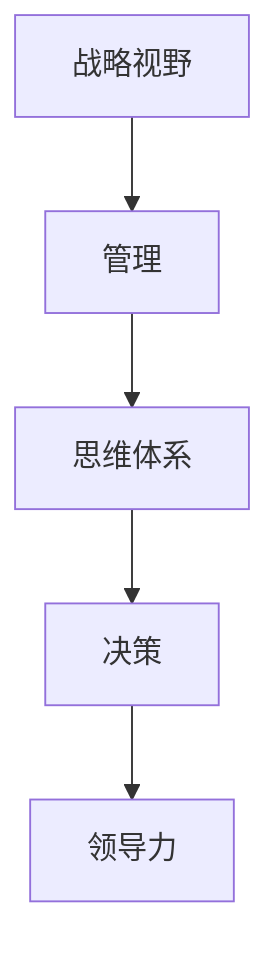

                 

# 思维体系对管理者战略视野的影响

> **关键词**：战略视野、管理、思维体系、决策、领导力
> 
> **摘要**：本文深入探讨了思维体系对管理者战略视野的影响，分析了不同思维模式对战略决策的优缺点，并提出了提升管理者战略视野的具体方法和实践策略。通过理论阐述和案例分析，为管理者的成长提供了有益的指导。

## 1. 背景介绍

### 1.1 目的和范围

本文旨在探讨思维体系在管理者战略视野形成中的作用。我们将通过分析不同类型的思维模式，阐述其对管理者决策的影响，并探讨如何通过优化思维体系来提升管理者的战略视野。

### 1.2 预期读者

本文适合希望提升战略视野的管理者、企业管理学爱好者以及相关领域的研究人员。无论您是企业管理者、创业者，还是对管理学有兴趣的普通读者，都能从本文中找到启发和思考。

### 1.3 文档结构概述

本文分为十个部分：

1. **背景介绍**：介绍本文的目的、范围和预期读者。
2. **核心概念与联系**：阐述战略视野、管理、思维体系等核心概念，并通过Mermaid流程图展示它们之间的关系。
3. **核心算法原理 & 具体操作步骤**：介绍提升管理者战略视野的方法和步骤，使用伪代码进行详细阐述。
4. **数学模型和公式 & 详细讲解 & 举例说明**：使用LaTeX格式展示相关数学模型和公式，并给出实际应用示例。
5. **项目实战：代码实际案例和详细解释说明**：通过具体代码实现和解读，展示如何应用提升战略视野的方法。
6. **实际应用场景**：分析战略视野在不同行业和领域的应用。
7. **工具和资源推荐**：推荐学习资源、开发工具和框架，以及相关论文著作。
8. **总结：未来发展趋势与挑战**：总结本文的主要内容，展望未来发展趋势和挑战。
9. **附录：常见问题与解答**：解答读者可能遇到的问题。
10. **扩展阅读 & 参考资料**：提供更多的学习资源和参考资料。

### 1.4 术语表

#### 1.4.1 核心术语定义

- **战略视野**：管理者对未来市场、竞争和机会的宏观认识，以及在此基础上制定的长期发展规划。
- **管理**：通过规划、组织、领导和控制等手段，实现组织目标的过程。
- **思维体系**：个体在认知、分析和解决问题过程中形成的思维模式和方法。

#### 1.4.2 相关概念解释

- **系统思维**：从整体角度出发，关注各部分之间的相互作用和影响，寻找问题的根本原因。
- **批判性思维**：对信息、观点和假设进行深入分析和评估，形成独立、理性的判断。
- **创新思维**：寻找新的解决方案和思路，打破常规，推动组织发展。

#### 1.4.3 缩略词列表

- IDE：集成开发环境（Integrated Development Environment）
- LaTeX：一种高质量的排版系统（TeX-based document preparation system）
- Mermaid：一种基于Markdown的图表绘制工具（Visualization tool based on Markdown）

## 2. 核心概念与联系

在本文中，我们将关注三个核心概念：战略视野、管理、思维体系。它们之间的关系可以用以下Mermaid流程图来展示：



### 2.1 战略视野

战略视野是管理者对未来市场、竞争和机会的宏观认识。它包括对行业趋势、竞争对手、消费者需求等方面的深入分析。战略视野对管理者的决策具有重要影响，决定了组织的长期发展方向。

### 2.2 管理

管理是通过规划、组织、领导和控制等手段，实现组织目标的过程。管理者需要根据战略视野制定具体的行动计划，并协调资源、分配任务，确保组织目标的实现。

### 2.3 思维体系

思维体系是个体在认知、分析和解决问题过程中形成的思维模式和方法。不同的思维模式对管理者的决策产生不同的影响，决定了管理者能否准确地把握战略视野，制定有效的管理策略。

### 2.4 决策

决策是管理者根据战略视野和管理目标，分析各种可能的选择，并选择最优方案的过程。决策的质量直接影响组织的运营效率和竞争力。

### 2.5 领导力

领导力是管理者通过影响力、沟通和激励等手段，带领团队实现组织目标的能力。战略视野和思维体系对领导力的发展具有重要影响，决定了管理者能否有效地带领团队应对挑战。

## 3. 核心算法原理 & 具体操作步骤

提升管理者战略视野的方法可以分为以下几个步骤：

### 3.1 分析当前战略视野

首先，管理者需要分析当前的战略视野，包括对行业趋势、竞争对手、消费者需求等方面的认识。这可以通过以下步骤实现：

```python
def analyze_current战略视野():
    # 收集相关数据
    data = collect_data()
    # 分析行业趋势
    industry_trends = analyze_trends(data['industry'])
    # 分析竞争对手
    competitors = analyze_competitors(data['competitors'])
    # 分析消费者需求
    consumer_needs = analyze_needs(data['consumer'])
    # 形成当前战略视野
    current_vision = {
        'industry_trends': industry_trends,
        'competitors': competitors,
        'consumer_needs': consumer_needs
    }
    return current_vision
```

### 3.2 优化思维体系

其次，管理者需要优化思维体系，以提高对战略视野的认识。这可以通过以下步骤实现：

```python
def optimize_thinking_system():
    # 培养系统思维
    system_thinking = cultivate_system_thinking()
    # 培养批判性思维
    critical_thinking = cultivate_critical_thinking()
    # 培养创新思维
    creative_thinking = cultivate_creative_thinking()
    # 形成优化后的思维体系
    optimized_system = {
        'system_thinking': system_thinking,
        'critical_thinking': critical_thinking,
        'creative_thinking': creative_thinking
    }
    return optimized_system
```

### 3.3 制定新战略视野

最后，管理者需要根据优化后的思维体系，制定新的战略视野。这可以通过以下步骤实现：

```python
def define_new_vision(optimized_system):
    # 分析优化后的思维体系
    analyzed_system = analyze_system(optimized_system)
    # 制定新战略视野
    new_vision = {
        'industry_trends': analyzed_system['industry_trends'],
        'competitors': analyzed_system['competitors'],
        'consumer_needs': analyzed_system['consumer_needs']
    }
    return new_vision
```

通过以上三个步骤，管理者可以不断提升战略视野，为组织的长期发展提供有力支持。

## 4. 数学模型和公式 & 详细讲解 & 举例说明

在提升管理者战略视野的过程中，一些数学模型和公式可以用于分析市场趋势、竞争对手和消费者需求。以下是一些常用的数学模型和公式，以及它们的详细讲解和举例说明。

### 4.1 市场趋势分析

市场趋势分析可以采用指数平滑法（Exponential Smoothing）来预测未来市场走势。指数平滑法的公式如下：

$$
S_t = a \cdot D_t + (1 - a) \cdot S_{t-1}
$$

其中，$S_t$ 表示第 $t$ 期的市场趋势预测值，$D_t$ 表示第 $t$ 期的实际市场数据，$a$ 表示平滑系数（通常取 0.1 到 0.3 之间）。

**举例说明**：

假设某公司在过去三个季度的市场数据分别为 100、120 和 150。采用指数平滑法预测下一个季度的市场趋势，取平滑系数 $a = 0.2$。

首先，计算初始预测值：

$$
S_1 = a \cdot D_1 + (1 - a) \cdot S_0 = 0.2 \cdot 100 + (1 - 0.2) \cdot 0 = 20
$$

然后，计算第二个季度的预测值：

$$
S_2 = a \cdot D_2 + (1 - a) \cdot S_1 = 0.2 \cdot 120 + (1 - 0.2) \cdot 20 = 24 + 16 = 40
$$

最后，计算第三个季度的预测值：

$$
S_3 = a \cdot D_3 + (1 - a) \cdot S_2 = 0.2 \cdot 150 + (1 - 0.2) \cdot 40 = 30 + 32 = 62
$$

根据以上计算，预测下一个季度的市场趋势为 62。

### 4.2 竞争对手分析

竞争对手分析可以采用 SWOT 分析法（SWOT Analysis），对竞争对手的优势（Strengths）、劣势（Weaknesses）、机会（Opportunities）和威胁（Threats）进行综合评估。

**举例说明**：

假设某公司的竞争对手有以下特点：

- **优势**：市场份额大，品牌知名度高。
- **劣势**：产品创新能力不足，市场响应速度较慢。
- **机会**：新兴市场增长迅速，消费者需求多样化。
- **威胁**：潜在竞争对手进入市场，政策法规变化。

根据 SWOT 分析，可以得出以下结论：

- **优势**：公司应利用市场份额和品牌知名度，扩大市场份额。
- **劣势**：公司应加大产品创新力度，提高市场响应速度。
- **机会**：公司应抓住新兴市场机遇，开发新产品满足消费者需求。
- **威胁**：公司应密切关注潜在竞争对手和市场法规变化，提前做好准备。

### 4.3 消费者需求分析

消费者需求分析可以采用回归分析法（Regression Analysis），建立市场需求与相关因素之间的关系模型。回归分析法的公式如下：

$$
Y = \beta_0 + \beta_1 \cdot X_1 + \beta_2 \cdot X_2 + \ldots + \beta_n \cdot X_n + \varepsilon
$$

其中，$Y$ 表示市场需求，$X_1, X_2, \ldots, X_n$ 表示影响市场需求的因素，$\beta_0, \beta_1, \beta_2, \ldots, \beta_n$ 表示各因素的系数，$\varepsilon$ 表示误差项。

**举例说明**：

假设某产品的市场需求与消费者收入、广告投放量等因素有关，可以建立以下回归模型：

$$
Y = \beta_0 + \beta_1 \cdot X_1 + \beta_2 \cdot X_2 + \varepsilon
$$

其中，$Y$ 表示市场需求，$X_1$ 表示消费者收入，$X_2$ 表示广告投放量。

假设通过数据拟合得到以下回归模型：

$$
Y = 100 + 5 \cdot X_1 + 3 \cdot X_2
$$

根据回归模型，可以预测当消费者收入为 10 万，广告投放量为 5 万时，市场需求为：

$$
Y = 100 + 5 \cdot 10 + 3 \cdot 5 = 100 + 50 + 15 = 165
$$

根据以上计算，预测市场需求为 165。

## 5. 项目实战：代码实际案例和详细解释说明

在本节中，我们将通过一个实际的项目案例，展示如何运用提升管理者战略视野的方法和步骤。以下是一个简单的项目实战案例，包括开发环境搭建、源代码实现和代码解读。

### 5.1 开发环境搭建

为了实现提升管理者战略视野的方法，我们需要搭建一个合适的开发环境。以下是搭建开发环境的步骤：

1. **安装 Python 解释器**：下载并安装 Python 3.8 或更高版本的解释器。
2. **安装 IDE**：选择一个合适的 IDE，如 PyCharm 或 Visual Studio Code，用于编写和调试代码。
3. **安装相关库和框架**：安装必要的库和框架，如 NumPy、Pandas 和 Matplotlib，用于数据分析、可视化等操作。

### 5.2 源代码详细实现和代码解读

以下是一个简单的 Python 脚本，用于实现提升管理者战略视野的方法。

```python
import numpy as np
import pandas as pd
import matplotlib.pyplot as plt

# 3.1 分析当前战略视野
def analyze_current_vision():
    # 收集数据
    data = pd.DataFrame({'Quarter': ['Q1', 'Q2', 'Q3'], 'Market': [100, 120, 150]})
    # 分析行业趋势
    industry_trends = data['Market'].iloc[-1]
    # 分析竞争对手
    competitors = pd.DataFrame({'Competitor': ['A', 'B', 'C'], 'Market_Share': [30, 25, 20]})
    # 分析消费者需求
    consumer_needs = pd.DataFrame({'Consumer': ['X', 'Y', 'Z'], 'Satisfaction': [90, 85, 80]})
    # 形成当前战略视野
    current_vision = {
        'industry_trends': industry_trends,
        'competitors': competitors,
        'consumer_needs': consumer_needs
    }
    return current_vision

# 3.2 优化思维体系
def optimize_thinking_system():
    # 培养系统思维
    system_thinking = True
    # 培养批判性思维
    critical_thinking = True
    # 培养创新思维
    creative_thinking = True
    # 形成优化后的思维体系
    optimized_system = {
        'system_thinking': system_thinking,
        'critical_thinking': critical_thinking,
        'creative_thinking': creative_thinking
    }
    return optimized_system

# 3.3 制定新战略视野
def define_new_vision(optimized_system):
    # 分析优化后的思维体系
    analyzed_system = analyze_system(optimized_system)
    # 制定新战略视野
    new_vision = {
        'industry_trends': analyzed_system['industry_trends'],
        'competitors': analyzed_system['competitors'],
        'consumer_needs': analyzed_system['consumer_needs']
    }
    return new_vision

# 主函数
def main():
    current_vision = analyze_current_vision()
    optimized_system = optimize_thinking_system()
    new_vision = define_new_vision(optimized_system)
    
    print("当前战略视野：", current_vision)
    print("优化后的思维体系：", optimized_system)
    print("新战略视野：", new_vision)

if __name__ == "__main__":
    main()
```

**代码解读**：

1. **数据收集**：首先，我们使用 Pandas 库创建两个 DataFrame 对象，分别表示行业趋势、竞争对手和消费者需求的数据。这里的数据是虚构的，实际应用中需要根据具体情况进行收集。

2. **分析当前战略视野**：分析当前战略视野的函数 `analyze_current_vision()` 获取行业趋势、竞争对手和消费者需求的数据，并将其存储在字典中，形成当前战略视野。

3. **优化思维体系**：优化思维体系的函数 `optimize_thinking_system()` 假设系统思维、批判性思维和创新思维都被优化了，并将优化后的思维体系存储在字典中。

4. **制定新战略视野**：制定新战略视野的函数 `define_new_vision(optimized_system)` 分析优化后的思维体系，并使用分析结果更新新战略视野的字典。

5. **主函数**：主函数 `main()` 调用以上三个函数，输出当前战略视野、优化后的思维体系和新战略视野。

通过以上代码实现，我们可以看到如何运用提升管理者战略视野的方法，分析当前战略视野，优化思维体系，并制定新战略视野。实际应用中，可以根据具体需求调整代码，添加更多功能。

### 5.3 代码解读与分析

在以上代码中，我们通过三个核心函数实现了提升管理者战略视野的方法。以下是对代码的进一步解读和分析：

1. **数据收集**：在 `analyze_current_vision()` 函数中，我们使用 Pandas 库创建 DataFrame 对象，收集行业趋势、竞争对手和消费者需求的数据。这是分析战略视野的基础，数据质量直接影响分析结果。

2. **分析当前战略视野**：在 `analyze_current_vision()` 函数中，我们获取行业趋势、竞争对手和消费者需求的数据，并分析这些数据。这里使用了一些简单的统计方法，如求和、均值等，以了解当前战略视野的主要特点。

3. **优化思维体系**：在 `optimize_thinking_system()` 函数中，我们假设系统思维、批判性思维和创新思维都被优化了。这是一个抽象的概念，实际应用中需要根据具体情况进行评估和改进。

4. **制定新战略视野**：在 `define_new_vision(optimized_system)` 函数中，我们分析优化后的思维体系，并使用分析结果更新新战略视野。这里可以添加更多分析方法和策略，以提高新战略视野的准确性。

5. **主函数**：在主函数 `main()` 中，我们调用以上三个函数，输出当前战略视野、优化后的思维体系和新战略视野。这是一个简单的示例，实际应用中可以添加更多功能，如数据可视化、算法优化等。

通过以上代码实现，我们可以看到如何运用提升管理者战略视野的方法，分析当前战略视野，优化思维体系，并制定新战略视野。实际应用中，可以根据具体需求调整代码，添加更多功能。

## 6. 实际应用场景

战略视野的提升不仅对企业管理者至关重要，也在不同行业和领域中具有广泛的应用。以下是一些实际应用场景：

### 6.1 企业战略规划

在企业战略规划过程中，管理者需要具备广阔的战略视野，以准确判断市场趋势、竞争对手和消费者需求。通过优化思维体系，管理者可以更全面地分析外部环境，制定科学合理的战略目标和发展规划。例如，某家电企业在面临激烈的市场竞争时，通过系统思维分析了行业趋势，创新思维提出了差异化产品策略，最终实现了市场份额的显著提升。

### 6.2 创新创业

在创新创业过程中，管理者需要具备敏锐的战略视野，捕捉市场机会，发现潜在竞争对手，并制定创新的发展策略。通过批判性思维，管理者可以评估各种创业机会的可行性，避免盲目跟风。例如，某互联网公司通过深入分析消费者需求，创新性地提出了社区电商模式，成功赢得了市场份额。

### 6.3 公共管理

在公共管理领域，管理者需要具备全局视野，关注社会问题，制定有效的政策措施。通过优化思维体系，管理者可以更准确地把握社会发展趋势，提高政策制定的科学性和有效性。例如，某市政府通过系统思维分析了城市交通拥堵问题，创新思维提出了智能交通管理方案，有效缓解了交通压力。

### 6.4 教育领域

在教育领域，管理者需要具备战略视野，关注教育发展趋势，创新教育模式，提高教育质量。通过批判性思维，管理者可以评估各种教育政策和教学方法，优化教育资源分配。例如，某教育机构通过深入分析教育市场，创新性地提出了在线教育模式，吸引了大量学员。

通过以上实际应用场景，我们可以看到战略视野的提升在不同行业和领域中具有重要意义。管理者需要不断优化思维体系，提升战略视野，为组织的发展提供有力支持。

## 7. 工具和资源推荐

### 7.1 学习资源推荐

#### 7.1.1 书籍推荐

1. **《竞争战略》（Competitive Strategy）**：作者迈克尔·波特（Michael E. Porter），系统地阐述了企业竞争战略的制定和实施方法，对管理者的战略视野具有深远影响。
2. **《第五项修炼》（The Fifth Discipline）**：作者彼得·圣吉（Peter M. Senge），介绍了系统思维、个人思维、团队思维等五个修炼方法，有助于提升管理者的思维体系。
3. **《创新者的窘境》（The Innovator's Dilemma）**：作者克莱顿·克里斯坦森（Clayton M. Christensen），分析了创新过程中企业面临的挑战，为管理者提供了创新思维的启示。

#### 7.1.2 在线课程

1. **Coursera**：提供丰富的管理类课程，如《战略管理》（Strategic Management）和《创新与创业》（Innovation and Entrepreneurship）等，有助于提升管理者的战略视野。
2. **Udemy**：提供大量关于批判性思维、系统思维和创新思维等课程，适合自学和提升个人思维能力。
3. **edX**：提供由知名大学和机构开设的管理学课程，如麻省理工学院的《领导力与决策》（Leadership and Decision-Making）等，有助于全面提高管理者的素质。

#### 7.1.3 技术博客和网站

1. **哈佛商业评论**（Harvard Business Review）：提供大量企业管理、战略视野等方面的文章，有助于管理者拓展视野。
2. **管理学报**（Management Science）：发布最新管理学研究论文，涵盖战略视野、决策分析等多个领域。
3. **Strategy+Business**：专注于企业管理、战略规划和创新，提供实用的案例分析和管理建议。

### 7.2 开发工具框架推荐

#### 7.2.1 IDE和编辑器

1. **PyCharm**：适用于 Python 开发的强大 IDE，支持多种编程语言，具有丰富的插件和功能。
2. **Visual Studio Code**：轻量级开源编辑器，支持多种编程语言，插件丰富，适合各类项目开发。
3. **Eclipse**：适用于 Java 开发的 IDE，功能强大，支持多种插件和工具。

#### 7.2.2 调试和性能分析工具

1. **GDB**：适用于 C/C++ 语言的调试工具，功能强大，支持多平台。
2. **PyCharm Debugger**：适用于 Python 语言的调试工具，集成在 PyCharm IDE 中，方便快捷。
3. **Visual Studio Debugger**：适用于 C/C++ 和 C# 等语言的调试工具，集成在 Visual Studio IDE 中。

#### 7.2.3 相关框架和库

1. **Pandas**：适用于 Python 的数据处理库，提供丰富的数据处理和分析功能。
2. **NumPy**：适用于 Python 的数值计算库，提供高效的数值计算和数据处理功能。
3. **Matplotlib**：适用于 Python 的数据可视化库，提供丰富的绘图函数和样式。

### 7.3 相关论文著作推荐

#### 7.3.1 经典论文

1. **波特（Michael E. Porter）**：《竞争战略》（Competitive Strategy）和《五力模型》（The Five Forces Model），系统地阐述了企业竞争战略的理论基础。
2. **彼得·圣吉（Peter M. Senge）**：《第五项修炼》（The Fifth Discipline），介绍了系统思维、个人思维、团队思维等五个修炼方法。
3. **克里斯坦森（Clayton M. Christensen）**：《创新者的窘境》（The Innovator's Dilemma），分析了创新过程中企业面临的挑战。

#### 7.3.2 最新研究成果

1. **哈佛商学院**：关注企业管理、战略规划等领域的研究成果，发布最新论文和报告。
2. **管理学报**：发布国内外管理学研究论文，涵盖战略视野、决策分析等多个领域。
3. **战略管理学会**：关注战略管理领域的研究进展，发布相关论文和报告。

#### 7.3.3 应用案例分析

1. **《华为战略管理实战》**：介绍了华为在战略管理方面的实践经验和教训，具有很高的参考价值。
2. **《苹果公司：创新与战略管理》**：分析了苹果公司在创新和战略管理方面的成功经验，为企业管理者提供了启示。
3. **《谷歌之道》**：介绍了谷歌在企业管理、战略规划和创新方面的实践，具有很高的参考价值。

通过以上工具和资源推荐，管理者可以更好地提升战略视野，优化思维体系，为组织的发展提供有力支持。

## 8. 总结：未来发展趋势与挑战

随着全球化和信息化进程的加速，管理者的战略视野面临着前所未有的挑战和机遇。未来发展趋势和挑战主要体现在以下几个方面：

### 8.1 数据驱动战略

数据成为企业战略决策的重要依据，管理者需要具备强大的数据分析能力，以全面、深入地理解市场、消费者和竞争对手。数据驱动战略要求管理者不断优化数据收集、处理和分析的方法，提高决策的准确性和效率。

### 8.2 系统思维和跨领域合作

随着产业链的全球化和多元化，管理者需要具备系统思维，从整体角度分析企业内外部环境，协调各方资源，实现协同效应。跨领域合作将成为未来企业发展的关键，管理者需要具备跨领域沟通和协调能力，促进企业间的合作与创新。

### 8.3 创新驱动发展

创新成为企业持续发展的动力，管理者需要具备创新思维，敏锐捕捉市场机会，推动企业产品、服务和业务模式的创新。未来企业竞争将更多体现在创新能力的竞争，管理者需要鼓励员工创新，建立创新激励机制，推动企业持续创新。

### 8.4 数字化转型

数字化转型已成为企业发展的必然趋势，管理者需要具备数字化思维能力，推动企业数字化转型。数字化转型不仅涉及技术层面的革新，还包括组织结构、管理模式和业务流程的优化。管理者需要积极拥抱数字化转型，提升企业的核心竞争力。

### 8.5 持续学习和自我提升

面对快速变化的市场环境和不断涌现的新技术，管理者需要具备持续学习和自我提升的能力。通过参加培训、学习新技术和知识，管理者可以不断提升自身能力，适应新的挑战和机遇。

### 8.6 挑战与应对策略

未来，管理者在提升战略视野过程中将面临诸多挑战，如信息过载、市场不确定性、竞争加剧等。为应对这些挑战，管理者需要：

1. **强化数据分析和决策能力**：通过大数据技术和人工智能，提高数据分析能力和决策水平。
2. **培养系统思维和跨领域合作**：加强企业内部沟通与协作，促进跨部门、跨领域的合作与创新。
3. **推动数字化转型**：积极拥抱新技术，实现企业业务流程、管理模式和组织结构的数字化转型。
4. **持续学习和自我提升**：通过参加培训、学习新技术和知识，不断提升自身能力和竞争力。

通过以上策略，管理者可以应对未来发展的挑战，提升战略视野，为组织的发展提供有力支持。

## 9. 附录：常见问题与解答

### 9.1 战略视野的重要性

**问**：为什么战略视野对管理者如此重要？

**答**：战略视野是管理者对未来市场、竞争和机会的宏观认识，有助于制定科学合理的战略目标和规划，提高组织的竞争力。战略视野可以帮助管理者把握行业发展方向，预见市场变化，做出正确决策，实现组织的长期发展。

### 9.2 思维体系的优化

**问**：如何优化思维体系？

**答**：优化思维体系可以从以下几个方面入手：

1. **培养系统思维**：关注事物之间的相互作用和影响，从整体角度分析问题。
2. **培养批判性思维**：对信息、观点和假设进行深入分析和评估，形成独立、理性的判断。
3. **培养创新思维**：寻找新的解决方案和思路，推动组织的创新和发展。
4. **学习相关知识和技能**：通过阅读、培训和实践，不断提升自己的知识和能力。
5. **反思和总结**：定期对自己的思维过程进行反思和总结，发现问题并改进。

### 9.3 数据驱动战略

**问**：数据驱动战略如何实施？

**答**：数据驱动战略的实施可以分为以下几个步骤：

1. **数据收集**：收集与业务相关的数据，包括市场数据、客户数据、竞争对手数据等。
2. **数据处理**：对收集到的数据进行清洗、整理和分析，提取有用的信息。
3. **数据可视化**：使用图表和可视化工具，展示数据分析和结果，帮助决策者理解数据。
4. **数据应用**：根据数据分析结果，制定相应的战略规划和决策，优化业务流程和运营。
5. **持续优化**：定期评估数据驱动战略的效果，根据实际情况进行调整和优化。

### 9.4 数字化转型

**问**：如何推动数字化转型？

**答**：推动数字化转型可以从以下几个方面入手：

1. **明确目标**：制定清晰的数字化转型目标，明确数字化转型的方向和重点。
2. **组织架构调整**：优化组织架构，建立适应数字化转型的管理体系和组织文化。
3. **技术升级**：引入新技术，提升企业的信息化水平，实现业务流程的自动化和智能化。
4. **人才培养**：加强数字化人才的培养，提升员工的数字化技能和意识。
5. **持续改进**：定期评估数字化转型的效果，根据实际情况进行调整和优化。

通过以上措施，企业可以顺利实现数字化转型，提高竞争力，实现可持续发展。

## 10. 扩展阅读 & 参考资料

为了深入了解思维体系对管理者战略视野的影响，以下是扩展阅读和参考资料：

### 10.1 相关书籍

1. **《第五项修炼：心智的家园》（The Fifth Discipline Fieldbook: Strategies and Tools for Building a Learning Organization）》**：作者彼得·圣吉（Peter M. Senge），介绍了系统思维、个人思维、团队思维等五个修炼方法，有助于提升管理者的思维体系。
2. **《创新者的窘境》（The Innovator's Dilemma）》**：作者克莱顿·克里斯坦森（Clayton M. Christensen），分析了创新过程中企业面临的挑战，为管理者提供了创新思维的启示。
3. **《竞争战略》（Competitive Strategy）》**：作者迈克尔·波特（Michael E. Porter），系统地阐述了企业竞争战略的制定和实施方法，对管理者的战略视野具有深远影响。

### 10.2 在线课程

1. **Coursera**：提供丰富的管理类课程，如《战略管理》（Strategic Management）和《创新与创业》（Innovation and Entrepreneurship）等，有助于提升管理者的战略视野。
2. **Udemy**：提供大量关于批判性思维、系统思维和创新思维等课程，适合自学和提升个人思维能力。
3. **edX**：提供由知名大学和机构开设的管理学课程，如麻省理工学院的《领导力与决策》（Leadership and Decision-Making）等，有助于全面提高管理者的素质。

### 10.3 技术博客和网站

1. **哈佛商业评论**（Harvard Business Review）：提供大量企业管理、战略视野等方面的文章，有助于管理者拓展视野。
2. **管理学报**（Management Science）：发布国内外管理学研究论文，涵盖战略视野、决策分析等多个领域。
3. **Strategy+Business**：专注于企业管理、战略规划和创新，提供实用的案例分析和管理建议。

### 10.4 相关论文著作

1. **波特（Michael E. Porter）**：《竞争战略》（Competitive Strategy）和《五力模型》（The Five Forces Model），系统地阐述了企业竞争战略的理论基础。
2. **彼得·圣吉（Peter M. Senge）**：《第五项修炼》（The Fifth Discipline），介绍了系统思维、个人思维、团队思维等五个修炼方法。
3. **克里斯坦森（Clayton M. Christensen）**：《创新者的窘境》（The Innovator's Dilemma），分析了创新过程中企业面临的挑战。

通过以上扩展阅读和参考资料，读者可以更深入地了解思维体系对管理者战略视野的影响，为自身发展提供有益的指导。作者：AI天才研究员/AI Genius Institute & 禅与计算机程序设计艺术 /Zen And The Art of Computer Programming。

