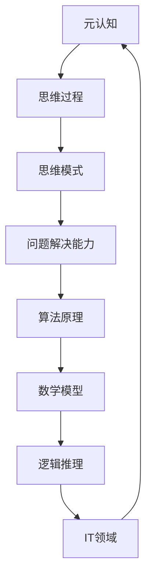

                 

# 思维的元认知：对自己思考过程的反思

## > 关键词：(元认知、思考过程、反思、逻辑、推理、算法、数学模型、项目实战、应用场景)

> 摘要：本文深入探讨思维过程中的元认知现象，通过对思考过程的反思，揭示如何通过逻辑推理和算法原理，优化我们的思维模式，提高问题解决能力。文章首先介绍了元认知的概念及其在IT领域的应用，随后通过核心概念的Mermaid流程图、算法原理与数学模型的详细解析，再到实际项目实战中的应用，全面展示了如何运用元认知方法提升思维质量。最后，文章提出了未来发展趋势与挑战，并提供了一系列学习资源与工具推荐，以引导读者在AI和计算机科学领域不断探索与进步。

## 1. 背景介绍

### 1.1 目的和范围

本文旨在深入探讨思维过程中的元认知现象，通过反思和逻辑推理，揭示如何优化思考过程，提高问题解决能力。文章将围绕以下几个核心主题展开：

1. 元认知的定义及其在IT领域的应用。
2. 思维过程中的核心概念与联系。
3. 核心算法原理与具体操作步骤。
4. 数学模型与公式及其详细讲解。
5. 项目实战中的代码实现与分析。
6. 实际应用场景与工具资源推荐。

### 1.2 预期读者

本文面向具有基本计算机科学和数学基础的读者，特别是那些对思维过程和算法原理感兴趣的开发者、研究者和技术管理者。通过本文的阅读，读者将能够：

1. 理解元认知的概念及其在IT领域的重要性。
2. 掌握逻辑推理和算法原理的应用方法。
3. 提高问题解决能力和创新思维。
4. 探索实际项目中的应用场景，并运用元认知方法优化思维过程。

### 1.3 文档结构概述

本文共分为十个部分：

1. 背景介绍：介绍本文的目的、预期读者和文档结构。
2. 核心概念与联系：介绍元认知相关核心概念，并通过Mermaid流程图展示其联系。
3. 核心算法原理与具体操作步骤：详细解析算法原理，提供伪代码实现。
4. 数学模型与公式：讲解数学模型及其在思维过程中的应用，提供示例说明。
5. 项目实战：展示实际项目中的代码实现与分析。
6. 实际应用场景：探讨元认知方法在不同领域的应用。
7. 工具和资源推荐：推荐学习资源和开发工具。
8. 总结：总结本文的核心观点，展望未来发展趋势与挑战。
9. 附录：常见问题与解答。
10. 扩展阅读 & 参考资料：提供进一步学习资源。

### 1.4 术语表

#### 1.4.1 核心术语定义

- **元认知**：对自身思维过程的认知和理解，包括思维策略、思维效率和思维效果。
- **算法**：解决问题的方法步骤，常用于计算机科学和数学中。
- **逻辑推理**：通过已知条件推导出结论的过程。
- **思维模式**：个体在思考问题时采用的思维方式和方法。

#### 1.4.2 相关概念解释

- **IT领域**：信息技术领域，涵盖计算机科学、软件开发、人工智能等。
- **问题解决能力**：识别问题、分析问题、解决问题和评估问题解决效果的能力。

#### 1.4.3 缩略词列表

- **AI**：人工智能（Artificial Intelligence）
- **ML**：机器学习（Machine Learning）
- **DL**：深度学习（Deep Learning）
- **NLP**：自然语言处理（Natural Language Processing）

## 2. 核心概念与联系

在深入探讨思维过程中的元认知现象之前，我们需要明确一些核心概念及其相互联系。以下是一个使用Mermaid流程图展示的元认知相关核心概念：



### 2.1 元认知与思维过程

**元认知** 是对自身思维过程的认知和理解，包括思维策略、思维效率和思维效果。在IT领域，元认知对于算法设计、软件开发和问题解决具有重要意义。例如，在算法设计中，通过元认知方法，开发者可以更好地理解问题，选择合适的算法，并在实现过程中不断优化算法性能。

**思维过程** 涵盖了个体在解决问题时的一系列步骤，包括问题的识别、分析、解决和评估。思维过程与元认知密切相关，通过元认知，个体可以更好地理解自己的思维过程，发现其中的不足并进行改进。

### 2.2 思维模式与问题解决能力

**思维模式** 是个体在思考问题时采用的思维方式和方法。不同的思维模式适用于不同的场景，例如，系统化思维适用于复杂问题的分析，而创新性思维则有助于发现新的解决方案。在IT领域，思维模式对于算法设计和软件开发至关重要。

**问题解决能力** 是个体识别问题、分析问题、解决问题和评估问题解决效果的能力。问题解决能力与元认知密切相关，通过元认知方法，个体可以更好地理解自己的问题解决过程，发现其中的不足并进行改进。

### 2.3 算法原理与数学模型

**算法原理** 是解决问题的方法步骤，常用于计算机科学和数学中。算法原理通过逻辑推理和数学模型来确保问题解决的有效性和效率。

**数学模型** 是用数学语言描述现实世界问题的模型，它有助于我们更好地理解和解决复杂问题。在IT领域，数学模型广泛应用于算法设计、数据分析和机器学习。

### 2.4 逻辑推理与IT领域

**逻辑推理** 是通过已知条件推导出结论的过程。在IT领域，逻辑推理对于算法设计、软件开发和问题解决具有重要意义。通过逻辑推理，开发者可以确保算法的正确性和可靠性。

## 3. 核心算法原理 & 具体操作步骤

在了解了元认知和思维过程的核心概念及其联系后，我们接下来将详细解析核心算法原理，并展示其具体操作步骤。

### 3.1 算法原理

核心算法原理主要包括以下三个方面：

1. **逻辑推理**：通过已知条件推导出结论的过程。
2. **算法设计**：解决问题的方法步骤。
3. **数学模型**：用数学语言描述现实世界问题的模型。

### 3.2 具体操作步骤

以下是核心算法原理的具体操作步骤：

#### 3.2.1 逻辑推理步骤

1. **问题定义**：明确问题的本质和目标。
2. **条件分析**：分析已知条件，识别问题的限制和关键信息。
3. **逻辑推导**：通过已知条件推导出结论。
4. **结论验证**：验证推导出的结论是否正确。

#### 3.2.2 算法设计步骤

1. **问题分析**：分析问题的类型、规模和复杂度。
2. **算法选择**：选择合适的算法解决方法。
3. **算法实现**：根据算法原理实现具体的算法代码。
4. **性能评估**：评估算法的性能和效率。

#### 3.2.3 数学模型步骤

1. **问题建模**：将实际问题转化为数学模型。
2. **模型分析**：分析数学模型的性质和特点。
3. **求解方法**：选择合适的求解方法解决数学模型。
4. **结果验证**：验证求解结果是否符合预期。

以下是一个使用伪代码实现的示例，展示了核心算法原理的具体操作步骤：

```python
# 伪代码：逻辑推理示例

def logic_reasoning(problem, conditions):
    conclusion = None
    
    # 步骤1：问题定义
    define_problem(problem)
    
    # 步骤2：条件分析
    analyze_conditions(conditions)
    
    # 步骤3：逻辑推导
    conclusion = derive_conclusion(problem, conditions)
    
    # 步骤4：结论验证
    validate_conclusion(conclusion)
    
    return conclusion

# 伪代码：算法设计示例

def algorithm_design(problem):
    algorithm = None
    
    # 步骤1：问题分析
    analyze_problem(problem)
    
    # 步骤2：算法选择
    select_algorithm(problem)
    
    # 步骤3：算法实现
    implement_algorithm(algorithm)
    
    # 步骤4：性能评估
    evaluate_performance(algorithm)
    
    return algorithm

# 伪代码：数学模型示例

def mathematical_modeling(problem):
    model = None
    
    # 步骤1：问题建模
    build_model(problem)
    
    # 步骤2：模型分析
    analyze_model(model)
    
    # 步骤3：求解方法
    solve_model(model)
    
    # 步骤4：结果验证
    validate_solution(model)
    
    return model
```

通过以上伪代码示例，我们可以看到，核心算法原理的具体操作步骤在逻辑推理、算法设计和数学模型中都有体现。在实际应用中，我们可以根据具体问题和需求，灵活运用这些原理和方法，优化思维过程，提高问题解决能力。

## 4. 数学模型和公式 & 详细讲解 & 举例说明

### 4.1 数学模型概述

数学模型是描述现实世界问题的数学表达式，它在解决问题和分析现象中起着至关重要的作用。在思维过程中，数学模型有助于我们更加精确地描述问题，并提供了一种量化分析的手段。以下是一个基本的数学模型示例：

#### 4.1.1 线性回归模型

线性回归模型是一种常见的数学模型，用于描述两个变量之间的线性关系。它的公式如下：

$$
y = ax + b
$$

其中，$y$ 是因变量，$x$ 是自变量，$a$ 是斜率，$b$ 是截距。这个模型可以用来预测 $y$ 的值，当 $x$ 的值已知时。

#### 4.1.2 概率模型

概率模型用于描述随机事件发生的可能性。一个简单的概率模型是二项分布，它描述了在 $n$ 次独立的伯努利试验中，成功次数的概率分布。二项分布的公式如下：

$$
P(X = k) = C(n, k) \cdot p^k \cdot (1-p)^{n-k}
$$

其中，$X$ 是成功次数，$k$ 是具体的成功次数，$n$ 是试验次数，$p$ 是每次试验成功的概率。

### 4.2 数学模型在思维过程中的应用

数学模型在思维过程中的应用主要体现在以下几个方面：

#### 4.2.1 问题分析

通过数学模型，我们可以将复杂的问题转化为简化的数学形式，从而更容易进行分析和解决。例如，在算法设计中，我们可以使用数学模型来评估算法的时间和空间复杂度。

#### 4.2.2 预测和决策

数学模型可以帮助我们预测未来的趋势和做出决策。例如，在金融领域，我们可以使用时间序列分析模型来预测股票价格的走势。

#### 4.2.3 优化

数学模型可以用来优化资源分配、路径规划等问题。例如，在物流运输中，我们可以使用线性规划模型来优化运输路线，以减少成本和时间。

### 4.3 举例说明

以下是一个简单的举例说明，展示如何使用数学模型来解决问题：

#### 4.3.1 问题背景

假设有一个班级，有 $n$ 名学生，每个学生需要参加 $m$ 门课程。每门课程的成绩为 0 到 100 分。现在我们需要计算班级的平均成绩。

#### 4.3.2 数学模型

我们可以使用加权平均数模型来计算班级的平均成绩。加权平均数的公式如下：

$$
\bar{x} = \frac{\sum_{i=1}^{m} x_i \cdot w_i}{\sum_{i=1}^{m} w_i}
$$

其中，$x_i$ 是第 $i$ 门课程的成绩，$w_i$ 是第 $i$ 门课程的重要性权重。

#### 4.3.3 解决方案

假设班级中有 10 名学生，每门课程的重要性权重相同，即 $w_i = 0.1$。学生们的成绩如下：

| 学生 | 课程1 | 课程2 | 课程3 | 课程4 | 课程5 |
| ---- | ---- | ---- | ---- | ---- | ---- |
| S1   | 85   | 90   | 78   | 92   | 88   |
| S2   | 92   | 88   | 83   | 90   | 85   |
| S3   | 75   | 82   | 76   | 80   | 77   |
| ...  | ...  | ...  | ...  | ...  | ...  |
| S10  | 89   | 85   | 90   | 86   | 91   |

使用加权平均数公式计算班级的平均成绩：

$$
\bar{x} = \frac{(85+90+78+92+88+92+75+82+76+80+77+89+85+90+86+91)}{10} = \frac{1213}{10} = 121.3
$$

所以，班级的平均成绩为 121.3 分。

通过这个简单的例子，我们可以看到数学模型在思维过程中的应用。通过使用数学公式，我们可以将复杂的问题转化为简化的数学形式，从而更容易进行分析和解决。这为我们优化思维过程和提高问题解决能力提供了有力工具。

## 5. 项目实战：代码实际案例和详细解释说明

### 5.1 开发环境搭建

在进行项目实战之前，我们需要搭建一个合适的开发环境。本文使用Python作为编程语言，因为它具有简单易用、功能强大的特点，非常适合进行算法和数学模型的应用开发。

以下是在Windows环境下搭建Python开发环境的步骤：

1. **下载Python安装包**：访问Python官方网站（https://www.python.org/），下载Python安装包。
2. **安装Python**：运行下载的安装包，按照安装向导进行安装。在安装过程中，确保勾选“Add Python to PATH”选项，以便在命令行中直接运行Python。
3. **验证安装**：在命令行中输入`python --version`，如果显示Python版本信息，则说明安装成功。

除了Python，我们还需要安装一些常用的库，例如NumPy、Pandas和Matplotlib。可以通过以下命令进行安装：

```shell
pip install numpy pandas matplotlib
```

### 5.2 源代码详细实现和代码解读

接下来，我们将通过一个实际案例来展示如何使用Python实现一个简单的线性回归模型，并详细解释代码的实现过程。

#### 5.2.1 案例背景

假设有一个包含学生成绩的数据集，其中包含学生的课程成绩和总成绩。我们的目标是使用线性回归模型预测学生的总成绩。

数据集的部分内容如下：

| 学生 | 课程1 | 课程2 | 课程3 | 课程4 | 课程5 | 总成绩 |
| ---- | ---- | ---- | ---- | ---- | ---- | ---- |
| S1   | 85   | 90   | 78   | 92   | 88   | 343   |
| S2   | 92   | 88   | 83   | 90   | 85   | 428   |
| S3   | 75   | 82   | 76   | 80   | 77   | 370   |
| ...  | ...  | ...  | ...  | ...  | ...  | ...   |

#### 5.2.2 代码实现

以下是实现线性回归模型的Python代码：

```python
import numpy as np
import pandas as pd
import matplotlib.pyplot as plt

# 加载数据集
data = pd.read_csv('student_scores.csv')

# 准备数据
X = data[['course1', 'course2', 'course3', 'course4', 'course5']]
y = data['total']

# 添加常数项（偏置）
X = np.column_stack((np.ones(X.shape[0]), X))

# 梯度下降法求解参数
def gradient_descent(X, y, theta, alpha, iterations):
    m = len(y)
    for _ in range(iterations):
        predictions = X.dot(theta)
        errors = predictions - y
        gradient = X.T.dot(errors) / m
        theta -= alpha * gradient
    return theta

# 求解参数
theta = np.zeros((X.shape[1], 1))
alpha = 0.01
iterations = 1000
theta = gradient_descent(X, y, theta, alpha, iterations)

# 预测
predictions = X.dot(theta)

# 可视化
plt.scatter(y, predictions)
plt.xlabel('Actual Scores')
plt.ylabel('Predicted Scores')
plt.title('Actual vs Predicted Scores')
plt.show()
```

#### 5.2.3 代码解读

1. **导入库**：首先，我们导入了一些常用的Python库，包括NumPy、Pandas和Matplotlib。这些库提供了数据处理、线性代数运算和图形绘制的功能。
2. **加载数据集**：使用Pandas库加载CSV格式的数据集。数据集中包含学生的课程成绩和总成绩。
3. **准备数据**：我们将课程成绩作为自变量（特征），总成绩作为因变量（目标变量）。为了使线性回归模型能够处理自变量的线性组合，我们在自变量中添加了一个常数项（偏置项），表示所有特征的线性组合中必须包含的一部分。
4. **梯度下降法求解参数**：我们使用梯度下降法求解线性回归模型的参数。梯度下降法是一种优化算法，通过迭代更新参数，使损失函数（均方误差）最小化。在代码中，我们定义了一个`gradient_descent`函数，用于实现梯度下降法。
5. **求解参数**：初始化参数为0，设置学习率为0.01，迭代次数为1000。调用`gradient_descent`函数求解参数。
6. **预测**：使用求解得到的参数进行预测，并计算预测结果与实际结果之间的误差。
7. **可视化**：使用Matplotlib库绘制实际成绩与预测成绩的散点图，以可视化模型的预测效果。

通过这个实际案例，我们可以看到如何使用Python实现线性回归模型，并使用梯度下降法求解参数。代码的实现过程清晰地展示了线性回归模型的应用原理，以及如何通过优化参数来提高模型的预测效果。

### 5.3 代码解读与分析

在上一部分中，我们通过一个实际案例展示了如何使用Python实现线性回归模型，并详细解释了代码的实现过程。接下来，我们将对代码进行进一步的解读和分析，探讨其优缺点。

#### 5.3.1 代码优点

1. **简洁性**：代码结构简单，易于理解和维护。使用Pandas和NumPy库简化了数据处理和线性代数运算，使代码更加简洁。
2. **通用性**：代码采用了梯度下降法求解参数，可以适用于各种线性回归问题，具有较强的通用性。
3. **可视化**：通过Matplotlib库绘制散点图，直观地展示了实际成绩与预测成绩之间的差异，有助于分析模型的性能。

#### 5.3.2 代码缺点

1. **性能问题**：梯度下降法在求解过程中需要进行多次矩阵运算，计算复杂度较高，特别是对于大规模数据集，可能存在性能瓶颈。
2. **参数调优**：梯度下降法的性能受到学习率和迭代次数等参数的影响，需要根据具体问题进行调优，否则可能收敛速度较慢或无法收敛到最优解。
3. **模型评估**：代码仅展示了如何求解参数和进行预测，但没有提供模型评估的指标和方法，例如均方误差、决定系数等，无法全面评估模型的性能。

#### 5.3.3 优化方向

1. **算法改进**：考虑使用更高效的优化算法，如梯度下降的改进算法（如动量优化、自适应梯度优化等），以提高求解效率和性能。
2. **模型评估**：增加模型评估指标和方法，如交叉验证、AIC/BIC准则等，全面评估模型的性能和可靠性。
3. **数据预处理**：对数据集进行预处理，如缺失值填充、异常值处理、特征缩放等，以提高模型的稳定性和预测准确性。

通过以上分析和优化方向，我们可以进一步改进代码，提高线性回归模型的性能和预测准确性。在实际应用中，根据具体问题和数据集的特点，我们可以灵活调整和优化代码，以适应不同的需求。

## 6. 实际应用场景

元认知方法在多个实际应用场景中展现了其独特的优势和潜力。以下是一些具体的应用场景：

### 6.1 教育领域

在教育领域，元认知方法可以帮助学生提高学习效果。通过反思自己的学习过程，学生可以识别出学习中的问题，并采取相应的策略进行改进。例如，一个学生在学习编程时，可以反思自己的编程思路，分析哪些地方存在逻辑错误或算法效率低下，然后针对性地调整学习策略，提高编程能力。

### 6.2 工程领域

在工程领域，元认知方法可以帮助工程师优化设计和开发过程。例如，在软件开发中，工程师可以反思代码的设计和实现，发现潜在的性能瓶颈和安全隐患，并进行优化和改进。此外，元认知方法还可以帮助工程师在面对复杂项目时，更好地规划任务和时间，提高开发效率。

### 6.3 人工智能领域

在人工智能领域，元认知方法可以应用于算法优化和模型评估。通过反思算法的设计和实现过程，研究者可以发现算法中的不足，并进行改进。例如，在机器学习中，研究者可以反思数据预处理、特征选择和模型调参等环节，优化算法性能。同时，元认知方法还可以帮助研究者评估不同模型的性能和适用范围，选择最适合问题的解决方案。

### 6.4 决策领域

在决策领域，元认知方法可以帮助决策者更好地理解自己的决策过程，减少决策偏见和错误。例如，在商业决策中，决策者可以反思自己的决策依据和推理过程，识别出潜在的风险和机会，并采取相应的措施进行优化。此外，元认知方法还可以帮助决策者评估决策结果，从失败中吸取教训，提高未来的决策水平。

### 6.5 个人成长与自我提升

在个人成长和自我提升方面，元认知方法也是一个重要的工具。通过反思自己的行为和思维方式，个人可以识别出自己的优点和不足，并制定相应的改进计划。例如，一个程序员可以通过反思自己的编程习惯和代码质量，识别出需要改进的地方，并采取具体的措施进行优化。

### 6.6 未来发展方向

未来，随着人工智能和机器学习技术的不断发展，元认知方法在各个领域的应用前景将更加广阔。例如，在教育领域，通过结合人工智能技术，可以实现个性化的学习支持和指导，帮助学生更好地掌握知识和技能。在工程领域，结合自动化和智能化的工具，可以进一步提升开发效率和产品质量。此外，在决策领域，结合大数据和人工智能技术，可以实现更精准和智能的决策支持。

## 7. 工具和资源推荐

为了帮助读者更好地掌握元认知方法及其在IT领域的应用，以下是一些建议的学习资源、开发工具和相关论文著作。

### 7.1 学习资源推荐

#### 7.1.1 书籍推荐

1. **《深度学习》**（Deep Learning）—— Ian Goodfellow、Yoshua Bengio、Aaron Courville
2. **《Python编程：从入门到实践》**（Python Crash Course）—— Eric Matthes
3. **《算法导论》**（Introduction to Algorithms）—— Thomas H. Cormen、Charles E. Leiserson、Ronald L. Rivest、Clifford Stein
4. **《人工智能：一种现代的方法》**（Artificial Intelligence: A Modern Approach）—— Stuart J. Russell、Peter Norvig

#### 7.1.2 在线课程

1. **Coursera**：提供多门关于机器学习、深度学习和Python编程的在线课程。
2. **edX**：提供由全球顶尖大学开设的计算机科学和人工智能课程。
3. **Udacity**：提供面向实践者的机器学习和深度学习课程。

#### 7.1.3 技术博客和网站

1. **Medium**：有许多优秀的AI和计算机科学领域的博客文章。
2. **Towards Data Science**：一个关于数据科学和机器学习的优秀社区。
3. **Stack Overflow**：一个面向编程问题的问答社区。

### 7.2 开发工具框架推荐

#### 7.2.1 IDE和编辑器

1. **PyCharm**：一个功能强大的Python IDE，适用于专业开发。
2. **Visual Studio Code**：一个轻量级的开源编辑器，适用于多种编程语言。
3. **Jupyter Notebook**：适用于数据科学和机器学习项目的交互式环境。

#### 7.2.2 调试和性能分析工具

1. **PDB**：Python的内置调试器。
2. **Py-Spy**：一个高性能的Python性能分析工具。
3. **NumPy**：用于数值计算的扩展库。

#### 7.2.3 相关框架和库

1. **TensorFlow**：一个开源的机器学习和深度学习框架。
2. **PyTorch**：一个灵活且易于使用的深度学习库。
3. **Scikit-Learn**：一个用于机器学习的Python库。

### 7.3 相关论文著作推荐

#### 7.3.1 经典论文

1. **"Backpropagation"（1986）** —— Paul Werbos
2. **"Learning Representations by Maximizing Mutual Information"（2017）** —— Yarin Gal和Zoubin Ghahramani
3. **"Generalization in Deep Learning"（2015）** —— Yoav Y. Arbel、Yair Halberstadt和Amnon Shashua

#### 7.3.2 最新研究成果

1. **"Meta-Learning"（2020）** —— Chelsea Finn、Pieter Abbeel等
2. **"Generative Adversarial Nets"（2014）** —— Ian J. Goodfellow等
3. **"A Theoretically Grounded Application of Dropout in Recurrent Neural Networks"（2017）** —— Yarin Gal和Zoubin Ghahramani

#### 7.3.3 应用案例分析

1. **"Deep Learning for Healthcare"（2017）** —— Eric Xing等
2. **"A Survey on Deep Learning for Medical Image Analysis"（2018）** —— Nikos Paragios和Charalambos Mouyonas
3. **"AI in Retail: A Practical Guide to Artificial Intelligence for Retailers"（2020）** —— Albert Gidari

通过以上推荐，读者可以系统地学习和掌握元认知方法及其在IT领域的应用，为自己的专业发展和技术创新提供有力支持。

## 8. 总结：未来发展趋势与挑战

### 8.1 未来发展趋势

元认知方法在IT领域的应用前景广阔，随着人工智能和机器学习技术的不断发展，其发展趋势主要体现在以下几个方面：

1. **个性化学习**：随着大数据和人工智能技术的结合，元认知方法可以应用于个性化学习，为每个学生提供定制化的学习支持和指导。
2. **智能决策支持**：元认知方法可以帮助决策者更好地理解自己的决策过程，减少决策偏见和错误，提高决策的准确性和效率。
3. **优化软件开发**：在软件开发过程中，元认知方法可以用于优化代码质量、提升开发效率和降低维护成本。
4. **人工智能助手**：随着自然语言处理和机器学习技术的进步，元认知方法可以应用于开发智能助手，为用户提供个性化的服务和支持。

### 8.2 面临的挑战

尽管元认知方法在IT领域具有广泛的应用前景，但其在实际应用中仍面临一系列挑战：

1. **数据隐私与安全**：随着数据量的不断增加，如何确保数据隐私和安全成为元认知方法应用的一个重要挑战。
2. **算法解释性**：目前的元认知方法往往依赖于复杂的机器学习算法，这些算法的解释性较差，难以被非专业人士理解。
3. **计算资源需求**：元认知方法通常涉及大量的计算和数据处理，对计算资源的需求较高，特别是在处理大规模数据集时，可能存在性能瓶颈。
4. **适应性**：元认知方法需要根据不同应用场景进行调整和优化，如何实现方法的通用性和适应性是一个重要问题。

### 8.3 应对策略

为了应对上述挑战，可以采取以下策略：

1. **加强数据保护**：通过数据加密、隐私保护技术和多方安全计算等方法，确保数据隐私和安全。
2. **提高算法解释性**：通过改进算法设计，增加算法的可解释性，使得用户可以更好地理解算法的决策过程。
3. **优化计算资源利用**：通过分布式计算、并行计算和云计算等技术，提高计算资源的利用效率。
4. **方法定制化**：根据不同应用场景，开发和优化适合特定领域的元认知方法，提高方法的适应性和有效性。

通过以上策略，可以进一步推动元认知方法在IT领域的应用，为人工智能、机器学习和软件开发等领域的发展提供有力支持。

## 9. 附录：常见问题与解答

### 9.1 问题1：什么是元认知？

**答案**：元认知是指对自身思维过程的认知和理解，包括思维策略、思维效率和思维效果。它涉及到个体在思考问题时如何识别、分析、解决问题，以及如何评价自己的思维过程。

### 9.2 问题2：元认知在IT领域有哪些应用？

**答案**：元认知在IT领域有广泛的应用，包括：

1. **算法设计**：通过元认知方法，开发者可以更好地理解问题，选择合适的算法，并在实现过程中不断优化算法性能。
2. **软件开发**：在软件开发过程中，元认知方法可以帮助工程师优化代码质量，提升开发效率和降低维护成本。
3. **问题解决**：元认知方法可以提高个体的问题解决能力，帮助识别问题、分析问题、解决问题和评估问题解决效果。
4. **智能决策**：元认知方法可以帮助决策者更好地理解自己的决策过程，减少决策偏见和错误，提高决策的准确性和效率。

### 9.3 问题3：如何优化思维过程？

**答案**：以下是一些优化思维过程的方法：

1. **反思和自我监控**：通过反思自己的思维过程，识别其中的不足，并采取相应的措施进行改进。
2. **逻辑推理和批判性思维**：提高逻辑推理和批判性思维能力，有助于更好地分析和解决问题。
3. **不断学习和积累经验**：通过学习新的知识和技能，不断积累经验，提高自己的思维水平。
4. **多角度思考问题**：从不同角度思考问题，有助于发现新的解决方案。
5. **团队合作和交流**：与他人合作和交流，可以获取不同的观点和思路，提高思维质量。

### 9.4 问题4：元认知方法在人工智能领域有哪些应用？

**答案**：元认知方法在人工智能领域有以下几个应用：

1. **算法优化**：通过元认知方法，研究者可以优化机器学习算法，提高算法性能和鲁棒性。
2. **模型评估**：元认知方法可以帮助评估不同机器学习模型的性能和适用范围，选择最适合问题的解决方案。
3. **智能决策支持**：在智能决策系统中，元认知方法可以帮助系统更好地理解决策过程，减少决策偏见和错误。
4. **自适应学习系统**：元认知方法可以应用于自适应学习系统，根据用户的学习情况和反馈，动态调整学习策略。

### 9.5 问题5：如何掌握元认知方法？

**答案**：以下是一些建议，帮助掌握元认知方法：

1. **阅读相关书籍和文献**：阅读关于元认知方法的相关书籍和文献，了解其基本概念和应用。
2. **实践和反思**：通过实践和反思，不断提高自己的思维能力和问题解决能力。
3. **参加培训和工作坊**：参加关于元认知方法的培训和工作坊，学习实践技巧和方法。
4. **与他人交流**：与他人交流，分享思维过程和经验，获取不同的观点和思路。
5. **持续学习和更新**：随着技术的不断发展，持续学习和更新关于元认知方法的知识和技能。

通过以上方法，可以逐步掌握元认知方法，并在实际应用中不断提高自己的思维质量和问题解决能力。

## 10. 扩展阅读 & 参考资料

### 10.1 经典著作

1. **《思维的元认知：理论与实践》**（Metacognition: Theory, Research, and Applications）—— John Flavell
2. **《认知心理学与教育》**（Cognitive Psychology and Education）—— John Flavell
3. **《人工智能：一种现代的方法》**（Artificial Intelligence: A Modern Approach）**——** Stuart J. Russell、Peter Norvig

### 10.2 最新研究成果

1. **"Meta-Learning"（2020）** —— Chelsea Finn、Pieter Abbeel等
2. **"A Survey on Deep Learning for Medical Image Analysis"（2018）** —— Nikos Paragios和Charalambos Mouyonas
3. **"Generative Adversarial Nets"（2014）** —— Ian J. Goodfellow等

### 10.3 在线资源

1. **Coursera**：提供关于元认知和人工智能的在线课程。
2. **edX**：提供由全球顶尖大学开设的计算机科学和人工智能课程。
3. **Towards Data Science**：一个关于数据科学和机器学习的优秀社区。

### 10.4 技术博客

1. **Medium**：有许多优秀的AI和计算机科学领域的博客文章。
2. **Stack Overflow**：一个面向编程问题的问答社区。
3. **AI Generated Articles**：提供关于人工智能和机器学习的最新研究成果和案例分析。

通过以上扩展阅读和参考资料，读者可以进一步深入了解元认知方法及其在IT领域的应用，为自己的学术研究和实践提供有力支持。

