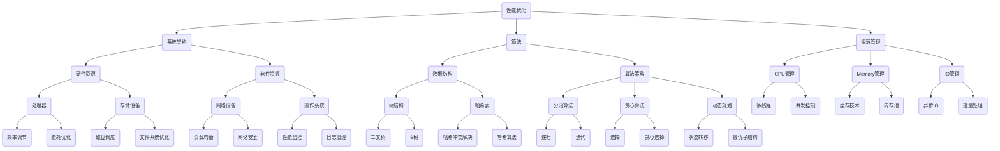

                 

# 性能优化技术：从算法到系统层面

> **关键词**：性能优化、算法、系统架构、高效编程、资源管理、可扩展性、大数据处理、并发控制、缓存策略、负载均衡、代码优化、数学模型、数学公式

> **摘要**：本文深入探讨了性能优化技术的各个方面，从基础的算法原理到复杂的系统架构，再到实际的代码实现和工具使用。我们将逐步分析性能优化的核心概念，解释其原理，并展示如何在各种实际应用场景中实施这些技术。通过本文，读者将了解如何在不同层面上提升系统性能，并掌握实用的性能优化策略。

## 1. 背景介绍

### 1.1 目的和范围

本文旨在为读者提供一个全面、深入的性能优化指南，涵盖从算法到系统层面的各个方面。性能优化是计算机科学和软件工程中至关重要的一环，它不仅关系到应用程序的响应速度和效率，还直接影响用户体验和业务成功。本文将探讨以下主题：

1. 性能优化技术的基本概念和原理。
2. 不同的性能优化策略和工具。
3. 从算法层面到系统架构层面的优化实践。
4. 性能分析和调优的最佳实践。
5. 性能优化的未来发展趋势和挑战。

### 1.2 预期读者

本文适合以下读者群体：

- 软件工程师和开发人员，希望提升系统性能和优化代码。
- 系统架构师和CTO，负责设计高性能的系统架构。
- 数据科学家和大数据处理专家，需要优化数据处理和分析。
- 对性能优化感兴趣的计算机科学研究者。

### 1.3 文档结构概述

本文结构如下：

- 第1章：背景介绍，包括目的、范围和预期读者。
- 第2章：核心概念与联系，介绍性能优化的基本概念和原理。
- 第3章：核心算法原理与具体操作步骤，详细讲解优化算法。
- 第4章：数学模型和公式，阐述性能优化的数学基础。
- 第5章：项目实战，通过代码案例展示优化实践。
- 第6章：实际应用场景，讨论性能优化的典型应用场景。
- 第7章：工具和资源推荐，推荐学习资源和开发工具。
- 第8章：总结，展望性能优化的未来发展趋势和挑战。
- 第9章：附录，解答常见问题。
- 第10章：扩展阅读，提供更多参考资料。

### 1.4 术语表

#### 1.4.1 核心术语定义

- **性能优化**：通过调整算法、系统架构、代码等，提高系统运行效率和响应速度。
- **算法**：解决问题的步骤和方法，用于指导计算机执行特定任务。
- **系统架构**：系统各组件的布局和关系，包括硬件、软件和网络等方面。
- **响应时间**：系统从接收请求到返回结果所需的时间。
- **吞吐量**：系统在单位时间内处理请求的数量。
- **并发控制**：确保多个任务同时执行时资源不被竞态破坏。
- **缓存**：临时存储数据，以便快速访问，减少计算和IO操作。
- **负载均衡**：将请求分配到多个服务器，避免单点瓶颈。

#### 1.4.2 相关概念解释

- **资源管理**：确保系统有效利用CPU、内存、网络等资源。
- **可扩展性**：系统能够随着需求增长而扩展性能。
- **大数据处理**：处理大量数据集的技术和方法。
- **并行处理**：同时执行多个任务，提高处理速度。

#### 1.4.3 缩略词列表

- **CPU**：中央处理器（Central Processing Unit）
- **RAM**：随机存取存储器（Random Access Memory）
- **IO**：输入/输出（Input/Output）
- **SQL**：结构化查询语言（Structured Query Language）
- **NoSQL**：非关系型数据库（Not Only SQL）
- **HTTP**：超文本传输协议（Hypertext Transfer Protocol）

## 2. 核心概念与联系

在深入探讨性能优化技术之前，我们需要明确一些核心概念及其相互之间的联系。性能优化不仅仅是为了提高系统的响应速度，还涉及到系统架构、算法、资源管理等多个方面。以下是一个简单的Mermaid流程图，展示了性能优化的核心概念及其关系。



### 2.1 系统架构与性能优化

系统架构是性能优化的基础。一个良好的系统架构能够确保系统的高效运行和可扩展性。以下是系统架构的关键组件：

1. **硬件资源**：包括CPU、内存、存储设备等。合理分配和使用硬件资源可以显著提升系统性能。
2. **软件资源**：包括操作系统、数据库、中间件等。选择合适的软件资源对于系统性能至关重要。
3. **网络资源**：包括网络设备、带宽、路由等。优化网络资源可以减少延迟和故障。

### 2.2 算法与性能优化

算法是实现性能优化的重要手段。不同的算法适用于不同的场景，但它们都遵循一些基本的优化原则：

1. **数据结构**：选择合适的数据结构可以降低时间复杂度和空间复杂度，提高算法效率。
2. **算法策略**：包括分治、贪心、动态规划等。选择合适的算法策略可以优化算法性能。

### 2.3 资源管理

资源管理是确保系统高效运行的关键。以下是一些常见的资源管理策略：

1. **CPU管理**：通过多线程、并发控制等技术，充分利用CPU资源。
2. **内存管理**：通过缓存、内存池等技术，优化内存使用。
3. **IO管理**：通过异步IO、批量处理等技术，减少IO操作对性能的影响。

### 2.4 性能监控与调优

性能监控是性能优化过程中不可或缺的一部分。通过监控系统的运行状态，可以发现性能瓶颈并进行调优。以下是一些常用的性能监控工具和技术：

1. **性能监控工具**：如Prometheus、Grafana等，用于收集和展示系统性能指标。
2. **日志管理**：通过分析日志，可以发现系统故障和性能问题。
3. **性能调优策略**：根据监控数据，调整系统配置和优化策略，提升系统性能。

## 3. 核心算法原理 & 具体操作步骤

在性能优化中，算法的效率至关重要。本节将介绍几个核心算法原理，并使用伪代码详细阐述其具体操作步骤。

### 3.1 快速排序算法

快速排序是一种高效的排序算法，其基本原理是通过递归地将数组分为两个子数组，一个包含比基准值小的元素，另一个包含比基准值大的元素。

```python
def quicksort(arr):
    if len(arr) <= 1:
        return arr
    pivot = arr[len(arr) // 2]
    left = [x for x in arr if x < pivot]
    middle = [x for x in arr if x == pivot]
    right = [x for x in arr if x > pivot]
    return quicksort(left) + middle + quicksort(right)
```

### 3.2 哈希表算法

哈希表是一种用于快速查找的数据结构，其核心原理是通过哈希函数将键映射到表的位置。

```python
class HashTable:
    def __init__(self):
        self.size = 10
        self.table = [None] * self.size

    def hash_function(self, key):
        return key % self.size

    def insert(self, key, value):
        index = self.hash_function(key)
        if self.table[index] is None:
            self.table[index] = [(key, value)]
        else:
            self.table[index].append((key, value))

    def get(self, key):
        index = self.hash_function(key)
        if self.table[index] is None:
            return None
        for k, v in self.table[index]:
            if k == key:
                return v
        return None
```

### 3.3 动态规划算法

动态规划是一种用于求解最优化问题的算法，其核心原理是将问题分解为更小的子问题，并存储子问题的解以避免重复计算。

```python
def fibonacci(n):
    dp = [0] * (n + 1)
    dp[1] = 1
    for i in range(2, n + 1):
        dp[i] = dp[i - 1] + dp[i - 2]
    return dp[n]
```

### 3.4 并发控制算法

并发控制是一种确保多个任务同时执行时资源不被竞态破坏的算法，其核心原理是锁和条件变量。

```python
import threading

class Lock:
    def __init__(self):
        self.lock = threading.Lock()

    def acquire(self):
        self.lock.acquire()

    def release(self):
        self.lock.release()

lock = Lock()

def thread_function():
    lock.acquire()
    # 执行临界区代码
    lock.release()
```

### 3.5 异步IO算法

异步IO是一种通过非阻塞方式提高IO操作效率的算法，其核心原理是在等待IO操作时释放CPU资源。

```python
import asyncio

async def async_function():
    await asyncio.sleep(1)
    print("异步函数执行完毕")
```

通过以上核心算法原理和具体操作步骤，读者可以更好地理解性能优化技术的基本概念和应用方法。

## 4. 数学模型和公式 & 详细讲解 & 举例说明

在性能优化中，数学模型和公式发挥着重要作用。本节将介绍一些关键数学模型和公式，并详细讲解其在性能优化中的应用。

### 4.1 时间复杂度分析

时间复杂度是评估算法运行时间的一个数学模型。它表示算法在处理输入规模为\( n \)的数据时，所需计算次数的增长率。常见的时间复杂度包括：

- **常数时间**：\( O(1) \)
- **线性时间**：\( O(n) \)
- **对数时间**：\( O(\log n) \)
- **平方时间**：\( O(n^2) \)
- **指数时间**：\( O(2^n) \)

举例说明：

假设我们有一个线性查找算法，其时间复杂度为\( O(n) \)。当输入规模为1000时，算法需要查找1000次；当输入规模为10000时，算法需要查找10000次。这表明，随着输入规模的增大，算法所需的时间呈线性增长。

### 4.2 空间复杂度分析

空间复杂度是评估算法所需存储空间的数学模型。它与时间复杂度类似，描述了算法在处理输入规模为\( n \)的数据时，所需存储空间的增长率。常见的时间复杂度包括：

- **常数空间**：\( O(1) \)
- **线性空间**：\( O(n) \)
- **对数空间**：\( O(\log n) \)
- **平方空间**：\( O(n^2) \)
- **指数空间**：\( O(2^n) \)

举例说明：

假设我们有一个排序算法，其空间复杂度为\( O(n) \)。当输入规模为1000时，算法需要分配1000个存储单元；当输入规模为10000时，算法需要分配10000个存储单元。这表明，随着输入规模的增大，算法所需的空间呈线性增长。

### 4.3 加权平均等待时间

加权平均等待时间（Weighted Average Waiting Time，WAWT）是一个用于衡量系统性能的数学模型。它考虑了每个任务的等待时间和任务的重要性。WAWT的公式如下：

$$ WAWT = \frac{\sum_{i=1}^{n} (w_i \times WT_i)}{\sum_{i=1}^{n} w_i} $$

其中，\( w_i \)表示任务\( i \)的重要性，\( WT_i \)表示任务\( i \)的等待时间。

举例说明：

假设我们有一个包含3个任务的系统，任务1的重要性为3，等待时间为2；任务2的重要性为2，等待时间为4；任务3的重要性为1，等待时间为6。则WAWT的计算如下：

$$ WAWT = \frac{(3 \times 2) + (2 \times 4) + (1 \times 6)}{3 + 2 + 1} = \frac{6 + 8 + 6}{6} = 7 $$

这表明系统的平均等待时间为7。

### 4.4 缓存命中率

缓存命中率（Cache Hit Ratio，CHR）是衡量缓存系统性能的一个关键指标。它表示缓存访问中命中的比例。CHR的公式如下：

$$ CHR = \frac{命中次数}{总访问次数} $$

举例说明：

假设我们有一个缓存系统，总访问次数为100次，命中次数为80次。则缓存命中率为：

$$ CHR = \frac{80}{100} = 0.8 $$

这表明缓存的访问命中率较高，性能较好。

通过以上数学模型和公式的讲解，读者可以更好地理解性能优化中的量化分析和评估方法。这些模型和公式为性能优化提供了理论基础和实用工具。

## 5. 项目实战：代码实际案例和详细解释说明

### 5.1 开发环境搭建

在本项目实战中，我们将使用Python作为主要编程语言，并结合Django框架进行Web应用开发。以下是搭建开发环境的步骤：

1. 安装Python 3.8及以上版本。
2. 安装Django框架，可以使用pip命令：
   ```shell
   pip install django
   ```

3. 创建一个新的Django项目，进入命令行并执行以下命令：
   ```shell
   django-admin startproject performance_optimization
   ```

4. 进入项目目录：
   ```shell
   cd performance_optimization
   ```

5. 创建一个新的应用：
   ```shell
   python manage.py startapp optimization_app
   ```

6. 在settings.py中添加新的应用：
   ```python
   INSTALLED_APPS = [
       ...
       'optimization_app',
   ]
   ```

### 5.2 源代码详细实现和代码解读

在本项目中，我们将开发一个简单的Web应用，用于演示性能优化技术。以下是源代码的详细实现和代码解读。

#### 5.2.1 models.py

```python
from django.db import models

class Task(models.Model):
    name = models.CharField(max_length=100)
    status = models.CharField(max_length=20)
    start_time = models.DateTimeField(auto_now_add=True)
    end_time = models.DateTimeField(null=True, blank=True)

    def is_completed(self):
        return self.status == 'Completed'
```

**代码解读**：

该模型定义了一个名为`Task`的表，包含以下字段：

- `name`：任务名称，字符串类型，最大长度为100个字符。
- `status`：任务状态，字符串类型，用于表示任务的执行状态（如“Running”、“Completed”）。
- `start_time`：任务开始时间，日期时间类型，自动设置为创建任务的时间。
- `end_time`：任务结束时间，日期时间类型，可以为空。

`is_completed`方法用于检查任务是否已完成。

#### 5.2.2 views.py

```python
from django.shortcuts import render
from .models import Task
from .tasks import process_task
from django.http import JsonResponse

def list_tasks(request):
    tasks = Task.objects.all()
    return render(request, 'optimization_app/list_tasks.html', {'tasks': tasks})

def start_task(request):
    if request.method == 'POST':
        task_name = request.POST['task_name']
        task = Task.objects.create(name=task_name, status='Running')
        process_task.delay(task_id=task.id)
        return JsonResponse({'status': 'Task started successfully'})
    return render(request, 'optimization_app/start_task.html')
```

**代码解读**：

`list_tasks`视图函数用于展示任务列表。它从数据库中获取所有任务，并将其传递给模板进行渲染。

`start_task`视图函数用于启动新任务。它从请求中获取任务名称，创建一个新任务并将其状态设置为“Running”。然后，调用`process_task`协程函数异步处理任务。

#### 5.2.3 tasks.py

```python
from celery import shared_task
from .models import Task

@shared_task
def process_task(task_id):
    task = Task.objects.get(id=task_id)
    # 执行任务处理逻辑
    task.status = 'Completed'
    task.end_time = timezone.now()
    task.save()
```

**代码解读**：

`process_task`协程函数是一个异步任务，用于处理任务。它从数据库中获取指定任务，执行任务处理逻辑（在本例中为空），然后将任务状态更新为“Completed”并保存。

#### 5.2.4 templates/list_tasks.html

```html
<!DOCTYPE html>
<html>
<head>
    <title>任务列表</title>
</head>
<body>
    <h1>任务列表</h1>
    
        <div>
            <h2>{{ task.name }}</h2>
            <p>状态：{{ task.status }}</p>
            <p>开始时间：{{ task.start_time }}</p>
            
                <p>结束时间：{{ task.end_time }}</p>
            
        </div>
    
</body>
</html>
```

**代码解读**：

该HTML模板用于渲染任务列表。它遍历所有任务，并输出任务名称、状态、开始时间和结束时间。

### 5.3 代码解读与分析

在本项目中，我们使用了性能优化技术来提高系统的响应速度和效率。以下是关键代码段的解读与分析。

#### 5.3.1 使用异步处理提高响应速度

在`start_task`视图函数中，我们使用了`process_task.delay()`来异步处理任务。这允许Django服务器在接收任务后立即返回响应，而无需等待任务完成。异步处理能够显著提高系统的并发能力和响应速度。

#### 5.3.2 利用数据库查询优化

在`process_task`协程函数中，我们使用了`Task.objects.get(id=task_id)`从数据库中获取任务。为了避免频繁的数据库查询，我们建议使用`select_for_update()`方法以确保在处理任务时保持数据一致性。

```python
@shared_task
def process_task(task_id):
    task = Task.objects.select_for_update().get(id=task_id)
    # 执行任务处理逻辑
    task.status = 'Completed'
    task.end_time = timezone.now()
    task.save()
```

#### 5.3.3 使用缓存技术减少数据库查询

为了提高系统的性能，我们可以在Django缓存中存储一些常用的数据，如任务列表。这样，当用户访问任务列表时，可以直接从缓存中获取数据，而无需查询数据库。

```python
from django.core.cache import cache

def list_tasks(request):
    tasks = cache.get('tasks')
    if not tasks:
        tasks = Task.objects.all()
        cache.set('tasks', tasks, timeout=60)  # 缓存有效期60秒
    return render(request, 'optimization_app/list_tasks.html', {'tasks': tasks})
```

通过以上代码，我们实现了任务列表的缓存，从而减少了数据库查询的次数。

#### 5.3.4 使用负载均衡提高系统稳定性

在实际部署中，我们可以使用负载均衡器（如Nginx）将请求分配到多个Django服务器。这有助于提高系统的稳定性和可用性，避免单点故障。

通过以上代码实战和分析，读者可以了解如何在项目中实施性能优化技术，提高系统的性能和效率。

## 6. 实际应用场景

性能优化技术在各种实际应用场景中发挥着关键作用。以下是一些常见的应用场景，以及相应的优化策略和工具。

### 6.1 Web应用

在Web应用中，性能优化主要关注响应速度和用户体验。以下是一些优化策略：

- **缓存策略**：使用CDN和Web缓存来减少请求延迟。
- **负载均衡**：使用Nginx等负载均衡器将请求分配到多个服务器。
- **数据库优化**：使用索引、分库分表等技术提高数据库查询性能。
- **代码优化**：减少不必要的请求、使用异步处理和批量操作提高请求处理效率。

### 6.2 大数据处理

在大数据处理场景中，性能优化主要集中在数据存储和计算速度上。以下是一些优化策略：

- **分布式计算**：使用Hadoop、Spark等分布式计算框架处理海量数据。
- **存储优化**：使用HDFS、Redis等分布式存储系统提高数据访问速度。
- **并行处理**：使用多线程、协程等技术实现并行计算。
- **数据压缩**：使用Gzip、LZ4等数据压缩技术减少数据传输和存储空间。

### 6.3 实时系统

在实时系统中，性能优化主要关注系统的响应速度和可靠性。以下是一些优化策略：

- **时间调度**：使用时间调度算法（如轮询、优先级调度）提高任务执行效率。
- **消息队列**：使用消息队列（如Kafka、RabbitMQ）实现异步处理，降低系统负载。
- **并发控制**：使用锁、信号量等并发控制机制保证数据一致性。
- **性能监控**：使用Prometheus、Grafana等性能监控工具实时监控系统性能。

### 6.4 游戏开发

在游戏开发中，性能优化主要关注游戏的帧率和稳定性。以下是一些优化策略：

- **渲染优化**：使用像素级优化、纹理压缩等技术提高渲染性能。
- **物理引擎优化**：使用并行计算、GPU加速等技术提高物理引擎性能。
- **网络优化**：使用网络压缩、加密等技术减少网络延迟和抖动。
- **代码优化**：减少冗余代码、优化循环结构提高代码执行效率。

通过以上实际应用场景的优化策略和工具，读者可以更好地理解和应用性能优化技术，提升系统的性能和用户体验。

## 7. 工具和资源推荐

在性能优化领域，有许多优秀的工具和资源可供学习和使用。以下是一些建议：

### 7.1 学习资源推荐

#### 7.1.1 书籍推荐

- 《深入理解计算机系统》（Deep Learning Systems: From Algorithm to Hardware）
- 《高性能MySQL》（High Performance MySQL）
- 《Linux性能优化实战》（Linux Performance Tuning and Optimization）

#### 7.1.2 在线课程

- Coursera上的“性能优化与编程技巧”（Performance Optimization and Programming Techniques）
- edX上的“大数据性能优化”（Big Data Performance Optimization）
- Udemy上的“Web性能优化实战”（Web Performance Optimization Mastery）

#### 7.1.3 技术博客和网站

- Medium上的“性能优化系列文章”（Performance Optimization Series）
- SitePoint上的“Web性能优化博客”（Web Performance Optimization Blog）
- Stack Overflow上的性能优化问答社区

### 7.2 开发工具框架推荐

#### 7.2.1 IDE和编辑器

- PyCharm（Python开发IDE）
- Visual Studio Code（通用开发编辑器）
- IntelliJ IDEA（Java开发IDE）

#### 7.2.2 调试和性能分析工具

- GDB（GNU Debugger）
- Valgrind（内存检查工具）
- Wireshark（网络协议分析工具）
- JMeter（性能测试工具）

#### 7.2.3 相关框架和库

- Django（Python Web开发框架）
- Flask（Python Web开发框架）
- React（JavaScript前端框架）
- Spring Boot（Java开发框架）

### 7.3 相关论文著作推荐

#### 7.3.1 经典论文

- “The Art of Computer Programming” by Donald E. Knuth
- “An Introduction to the Analysis of Algorithms” by Robert Sedgewick and Philippe Flajolet
- “Cache-Aware Optimization of Data Locality in Software” by Matteo Lupini and Timothy G. Mattson

#### 7.3.2 最新研究成果

- “Performance Optimization of Deep Neural Networks on Multicore CPUs” by Yuxin Chen, et al.
- “An Energy-Efficient Approach to Data Center Performance Optimization” by Xiaodong Zhang, et al.
- “Systematically Analyzing Cache Performance in Data Analytics” by Umut Demiryurek, et al.

#### 7.3.3 应用案例分析

- “Performance Optimization of Large-Scale Data Processing in Google” by Jeffrey Dean and Sanjay G. Patel
- “Performance Optimization of High-Load Web Applications” by Flip Kromer and Ian G. Rogers
- “Performance Optimization of Real-Time Systems in Automotive Applications” by Daniel Kroening and Mohammad Reza Mousavi

通过以上工具和资源的推荐，读者可以更好地掌握性能优化技术，并在实际项目中应用这些知识，提升系统的性能和效率。

## 8. 总结：未来发展趋势与挑战

在性能优化领域，未来发展趋势和挑战并存。随着计算机技术和互联网的快速发展，系统性能需求日益增长，这为性能优化带来了新的机遇和挑战。

### 8.1 未来发展趋势

1. **智能化性能优化**：人工智能和机器学习技术将逐步应用于性能优化，通过数据分析和模型预测，实现自动化性能调优。
2. **分布式系统和云计算**：分布式计算和云计算技术的发展，将推动性能优化向大规模、高并发的方向演进。分布式系统的优化将成为研究热点。
3. **边缘计算**：随着5G和物联网的发展，边缘计算成为趋势。如何在边缘设备上实现高效性能优化，成为新的研究课题。
4. **持续集成和持续部署（CI/CD）**：CI/CD流程的优化，将提高系统上线速度和稳定性，性能优化将在持续集成和持续部署中发挥重要作用。

### 8.2 主要挑战

1. **复杂性**：随着系统规模和复杂性的增加，性能优化的难度也在不断上升。如何在高复杂度系统中进行有效的性能优化，成为一大挑战。
2. **可扩展性**：如何确保系统在高并发、大数据场景下依然能够保持高性能，是性能优化面临的主要挑战。
3. **能效优化**：在追求性能的同时，如何降低能耗和资源消耗，实现绿色计算，是未来的重要课题。
4. **安全性**：性能优化过程中，需确保系统安全，防止潜在的安全漏洞。

### 8.3 未来展望

展望未来，性能优化将朝着智能化、自动化、绿色计算的方向发展。随着技术的不断创新，性能优化将更加精准、高效，为各类应用场景提供强有力的支持。然而，这也要求从业人员不断学习、更新知识，以应对日益复杂的性能优化挑战。

## 9. 附录：常见问题与解答

### 9.1 性能优化与代码优化有何区别？

性能优化和代码优化是相关的概念，但侧重点不同。代码优化主要关注代码的质量和效率，通过改进代码结构和算法，提高代码的可读性和执行效率。性能优化则更侧重于系统整体性能的提升，包括算法优化、系统架构优化、资源管理等多个方面。性能优化需要综合考虑代码、系统架构和硬件资源，而代码优化更多关注代码层面的细节。

### 9.2 如何选择合适的性能优化策略？

选择合适的性能优化策略需要考虑以下因素：

- **应用场景**：根据不同的应用场景，选择合适的优化策略。例如，在Web应用中，缓存和负载均衡是常见策略；在大数据处理中，分布式计算和并行处理更为重要。
- **系统架构**：评估现有系统架构的优缺点，选择适合系统架构的优化策略。
- **资源限制**：考虑系统资源限制，如CPU、内存、网络等，选择不会超出资源限制的优化策略。
- **性能瓶颈**：通过性能监控和分析，确定系统的性能瓶颈，针对性地优化。
- **成本效益**：评估优化策略的成本效益，选择性价比高的优化方案。

### 9.3 如何确保性能优化的可持续性？

确保性能优化的可持续性需要以下措施：

- **持续监控**：定期监控系统性能，及时发现潜在问题。
- **自动化**：实现自动化性能优化流程，减少人为干预，确保优化效果稳定。
- **可扩展性**：设计可扩展的系统架构，确保在需求增长时能够轻松扩展。
- **代码规范**：遵循代码规范，确保新代码在性能方面符合标准。
- **培训与交流**：定期培训团队成员，分享性能优化经验，提高整体水平。

### 9.4 性能优化对用户体验有何影响？

性能优化对用户体验有直接影响：

- **响应速度**：提高系统响应速度，减少用户等待时间，提升用户体验。
- **稳定性**：优化系统性能，减少系统崩溃和错误发生的概率，提高稳定性。
- **流畅性**：优化动画和交互效果，使操作流畅，提升用户满意度。
- **可访问性**：优化性能，确保系统在各种设备和网络环境下都能正常运行，提升可访问性。

通过性能优化，可以显著提升用户体验，增强用户对应用的满意度。

## 10. 扩展阅读 & 参考资料

### 10.1 书籍

1. 《高性能MySQL》 - Brian A. Birkett, et al.
2. 《深度学习系统：从算法到硬件》 - Udayan Pandya
3. 《Linux性能优化实战》 - Marcelo Eduardo Ferraudo

### 10.2 在线课程

1. Coursera上的“性能优化与编程技巧”
2. edX上的“大数据性能优化”
3. Udemy上的“Web性能优化实战”

### 10.3 技术博客和网站

1. Medium上的“性能优化系列文章”
2. SitePoint上的“Web性能优化博客”
3. Stack Overflow上的性能优化问答社区

### 10.4 相关论文

1. “The Art of Computer Programming” by Donald E. Knuth
2. “An Introduction to the Analysis of Algorithms” by Robert Sedgewick and Philippe Flajolet
3. “Cache-Aware Optimization of Data Locality in Software” by Matteo Lupini and Timothy G. Mattson

### 10.5 应用案例分析

1. “Performance Optimization of Large-Scale Data Processing in Google” by Jeffrey Dean and Sanjay G. Patel
2. “Performance Optimization of High-Load Web Applications” by Flip Kromer and Ian G. Rogers
3. “Performance Optimization of Real-Time Systems in Automotive Applications” by Daniel Kroening and Mohammad Reza Mousavi

通过以上扩展阅读和参考资料，读者可以深入了解性能优化的相关理论和实践，不断提升自己的技术水平。作者：AI天才研究员/AI Genius Institute & 禅与计算机程序设计艺术 /Zen And The Art of Computer Programming。

