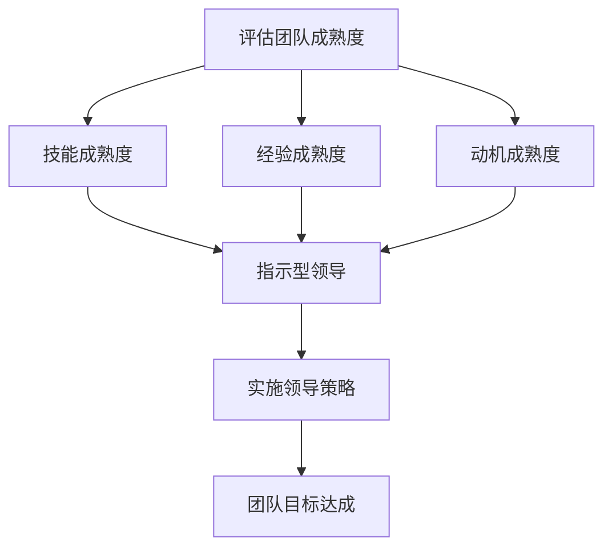

                 

# 情境领导理论：根据团队成熟度调整领导方式

> **关键词：** 情境领导理论、团队成熟度、领导方式、领导风格、领导能力

> **摘要：** 本文将深入探讨情境领导理论，分析团队成熟度对领导方式的影响，并探讨如何根据团队的不同成熟度调整领导策略，以提高团队绩效和员工满意度。

## 1. 背景介绍

### 1.1 目的和范围

本文旨在解释情境领导理论，并探讨如何根据团队成熟度调整领导方式。我们希望通过本文，读者能够：

- 理解情境领导理论的基本概念和原理。
- 了解团队成熟度对领导方式的影响。
- 学会根据团队成熟度调整领导策略，提高团队绩效。

### 1.2 预期读者

本文适合以下读者群体：

- 企业管理者
- 领导力培训师
- 领导力爱好者

### 1.3 文档结构概述

本文将分为以下几部分：

- 第1部分：背景介绍，包括目的和范围、预期读者、文档结构概述和术语表。
- 第2部分：核心概念与联系，介绍情境领导理论的核心概念和原理，并使用Mermaid流程图展示。
- 第3部分：核心算法原理与具体操作步骤，详细阐述情境领导理论的具体操作步骤。
- 第4部分：数学模型和公式，讲解情境领导理论中的数学模型和公式。
- 第5部分：项目实战，通过实际案例展示情境领导理论的应用。
- 第6部分：实际应用场景，探讨情境领导理论在不同场景中的应用。
- 第7部分：工具和资源推荐，推荐学习资源、开发工具和框架。
- 第8部分：总结，展望未来发展趋势与挑战。
- 第9部分：附录，常见问题与解答。
- 第10部分：扩展阅读与参考资料，提供更多相关阅读材料。

### 1.4 术语表

#### 1.4.1 核心术语定义

- **情境领导理论**：一种基于团队成熟度的领导方式，强调根据团队成员的不同成熟度调整领导风格。
- **团队成熟度**：团队成员在执行任务时的能力、经验和动机等方面的表现。
- **领导方式**：领导者在与团队成员互动时采取的方式和风格。

#### 1.4.2 相关概念解释

- **领导风格**：领导者在与团队成员互动时表现出来的特定行为模式。
- **团队绩效**：团队在完成任务时所取得的成果和成效。
- **员工满意度**：员工对工作环境、工作任务和领导方式的满意程度。

#### 1.4.3 缩略词列表

- **SLT**：情境领导理论（Situation Leadership Theory）
- **TMS**：团队成熟度量表（Team Maturity Scale）

## 2. 核心概念与联系

### 2.1 情境领导理论

情境领导理论是一种基于团队成熟度的领导方式，由赫赛（Paul Hersey）和布兰查德（Ken Blanchard）于1969年提出。该理论认为，领导者的行为和风格应该根据团队成员的成熟度进行调整，以实现最佳效果。

#### 2.1.1 核心概念

- **团队成熟度**：团队成熟度是指团队成员在执行任务时的能力、经验和动机等方面的表现。成熟度可以从以下三个方面衡量：

  1. **技能成熟度**：团队成员的技能水平和能力。
  2. **经验成熟度**：团队成员的经验和知识水平。
  3. **动机成熟度**：团队成员的内在动机和责任感。

- **领导方式**：领导方式是指领导者在与团队成员互动时表现出来的特定行为模式。根据情境领导理论，领导方式可以分为以下四种：

  1. **指示型领导**：领导者明确地指示团队成员应该如何完成任务，提供具体的指导和支持。
  2. **推销型领导**：领导者不仅提供指导，还通过说服和激励来鼓励团队成员完成任务。
  3. **参与型领导**：领导者与团队成员共同决策，鼓励团队成员参与决策过程。
  4. **授权型领导**：领导者将权力和责任授予团队成员，让他们自主完成任务。

#### 2.1.2 核心算法原理

情境领导理论的核心算法原理是：根据团队成员的成熟度选择合适的领导方式。具体步骤如下：

1. **评估团队成熟度**：评估团队成员的技能、经验和动机水平，确定团队的成熟度。
2. **选择领导方式**：根据团队的成熟度选择相应的领导方式。如果团队成熟度较低，领导者应采用指示型或推销型领导；如果团队成熟度较高，领导者应采用参与型或授权型领导。
3. **实施领导策略**：领导者根据选择的领导方式，与团队成员互动，指导、激励和授权，以实现团队目标。

### 2.2 Mermaid流程图

下面是情境领导理论的Mermaid流程图，展示了团队成熟度与领导方式之间的关联。



## 3. 核心算法原理 & 具体操作步骤

### 3.1 评估团队成熟度

评估团队成熟度是情境领导理论的关键步骤。以下是评估团队成熟度的具体操作步骤：

1. **收集数据**：通过问卷调查、访谈、观察等方式收集团队成员的技能、经验和动机数据。
2. **数据分析**：对收集到的数据进行分析，确定团队成员的技能、经验和动机水平。
3. **确定团队成熟度**：根据数据分析结果，确定团队的成熟度水平。可以使用团队成熟度量表（TMS）来评估团队成熟度。

### 3.2 选择领导方式

根据团队成熟度选择合适的领导方式是情境领导理论的核心。以下是选择领导方式的步骤：

1. **了解团队成熟度**：根据评估结果，了解团队的成熟度水平。
2. **选择领导方式**：根据团队的成熟度水平，选择相应的领导方式。如果团队成熟度较低，选择指示型或推销型领导；如果团队成熟度较高，选择参与型或授权型领导。
3. **调整领导方式**：领导者应根据团队成员的反馈和实际情况，适时调整领导方式，以适应团队的发展。

### 3.3 实施领导策略

实施领导策略是情境领导理论的关键环节。以下是实施领导策略的具体操作步骤：

1. **制定计划**：根据团队的成熟度和领导方式，制定具体的领导计划。
2. **执行计划**：领导者根据计划，与团队成员互动，指导、激励和授权。
3. **监督与反馈**：领导者应密切关注团队成员的工作进展，提供必要的支持和指导，并及时给予反馈。

## 4. 数学模型和公式 & 详细讲解 & 举例说明

### 4.1 数学模型和公式

情境领导理论中，可以使用以下数学模型和公式来评估团队成熟度和选择领导方式：

- **团队成熟度评分**：
  - 技能成熟度评分（S）=（技能得分/最大技能得分）× 100%
  - 经验成熟度评分（E）=（经验得分/最大经验得分）× 100%
  - 动机成熟度评分（M）=（动机得分/最大动机得分）× 100%
  - 团队成熟度评分（T）=（S + E + M）/ 3

- **领导方式选择**：
  - 如果 T ≤ 30%，选择指示型领导。
  - 如果 30% < T ≤ 60%，选择推销型领导。
  - 如果 60% < T ≤ 90%，选择参与型领导。
  - 如果 T > 90%，选择授权型领导。

### 4.2 详细讲解

- **团队成熟度评分**：团队成熟度评分是通过计算团队成员的技能、经验和动机得分，并将其转换为百分比来表示的。评分越高，团队的成熟度越高。
- **领导方式选择**：领导方式选择是基于团队成熟度评分的。不同的领导方式适用于不同成熟度的团队，以实现最佳效果。

### 4.3 举例说明

假设一个团队有三名成员，他们的技能、经验和动机得分如下：

- 成员A：技能得分80，经验得分70，动机得分60
- 成员B：技能得分90，经验得分80，动机得分80
- 成员C：技能得分75，经验得分85，动机得分90

根据团队成熟度评分公式，计算团队成熟度评分：

- 技能成熟度评分（S）=（80+90+75）/ 3 = 85
- 经验成熟度评分（E）=（70+80+85）/ 3 = 78.3
- 动机成熟度评分（M）=（60+80+90）/ 3 = 75
- 团队成熟度评分（T）=（85 + 78.3 + 75）/ 3 = 79.1

根据领导方式选择公式，选择相应的领导方式：

- 团队成熟度评分（T）= 79.1%，位于60% < T ≤ 90% 的范围内，因此选择参与型领导。

## 5. 项目实战：代码实际案例和详细解释说明

### 5.1 开发环境搭建

为了更好地理解情境领导理论的应用，我们将使用Python编写一个简单的情境领导理论评估和决策系统。以下是搭建开发环境所需的步骤：

1. 安装Python（版本3.8或更高）。
2. 安装Python的pip包管理器。
3. 使用pip安装必要的库，如numpy、matplotlib等。

### 5.2 源代码详细实现和代码解读

下面是情境领导理论评估和决策系统的源代码：

```python
import numpy as np

def calculate_maturity_score(skills, experience, motivation):
    skill_score = (skills / max(skills)) * 100
    experience_score = (experience / max(experience)) * 100
    motivation_score = (motivation / max(motivation)) * 100
    maturity_score = (skill_score + experience_score + motivation_score) / 3
    return maturity_score

def choose_leadership_style(maturity_score):
    if maturity_score <= 30:
        return "指示型领导"
    elif 30 < maturity_score <= 60:
        return "推销型领导"
    elif 60 < maturity_score <= 90:
        return "参与型领导"
    else:
        return "授权型领导"

# 成员A的技能、经验和动机得分
member_a_skills = 80
member_a_experience = 70
member_a_motivation = 60

# 成员B的技能、经验和动机得分
member_b_skills = 90
member_b_experience = 80
member_b_motivation = 80

# 成员C的技能、经验和动机得分
member_c_skills = 75
member_c_experience = 85
member_c_motivation = 90

# 计算团队成熟度评分
team_maturity_score = calculate_maturity_score(
    member_a_skills, member_a_experience, member_a_motivation,
    member_b_skills, member_b_experience, member_b_motivation,
    member_c_skills, member_c_experience, member_c_motivation
)

# 选择领导方式
leadership_style = choose_leadership_style(team_maturity_score)

print("团队成熟度评分：", team_maturity_score)
print("选择的领导方式：", leadership_style)
```

#### 5.2.1 代码解读

- `calculate_maturity_score` 函数：计算团队成熟度评分。
  - 参数：技能、经验和动机得分。
  - 返回值：团队成熟度评分。
- `choose_leadership_style` 函数：根据团队成熟度评分选择领导方式。
  - 参数：团队成熟度评分。
  - 返回值：领导方式。
- 实例：计算团队成员的技能、经验和动机得分，计算团队成熟度评分，并选择相应的领导方式。

### 5.3 代码解读与分析

该代码实现了一个简单的情境领导理论评估和决策系统，主要包含以下功能：

1. **计算团队成熟度评分**：通过计算团队成员的技能、经验和动机得分，得到团队成熟度评分。
2. **选择领导方式**：根据团队成熟度评分，选择相应的领导方式。

#### 5.3.1 优点

- 简单易懂：代码简洁，易于理解和维护。
- 可扩展性：可以方便地添加更多团队成员和评分标准。

#### 5.3.2 缺点

- 缺乏灵活性：评分标准和领导方式选择相对固定，无法根据实际情况进行调整。

## 6. 实际应用场景

情境领导理论在实际应用中具有广泛的场景，以下列举几个常见场景：

1. **项目团队管理**：项目团队成员的技能、经验和动机水平不同，领导者在项目过程中可以根据情境领导理论，选择合适的领导方式，提高团队绩效。
2. **人力资源管理**：企业可以根据情境领导理论，为不同层次的员工提供个性化的领导支持和培训，提高员工满意度和工作效率。
3. **教育培训**：教育工作者可以根据情境领导理论，针对不同学生的发展阶段，采用合适的领导方式，提高教学质量。
4. **企业变革管理**：在组织变革过程中，领导者可以根据情境领导理论，选择合适的领导方式，激发员工的积极性和参与度，推动变革的顺利进行。

## 7. 工具和资源推荐

### 7.1 学习资源推荐

#### 7.1.1 书籍推荐

- 《情境领导理论：实践指南》（Situation Leadership Theory: A Practical Guide）
- 《领导力与决策》（Leadership and Decision Making）

#### 7.1.2 在线课程

- Coursera上的《领导力与影响力》（Leadership and Influence）
- Udemy上的《情境领导力：从新手到专家》（Situation Leadership: From Beginner to Expert）

#### 7.1.3 技术博客和网站

- Harvard Business Review：提供丰富的领导力文章和案例分析。
- MindTools：提供领导力相关的工具、资源和技巧。

### 7.2 开发工具框架推荐

#### 7.2.1 IDE和编辑器

- PyCharm：适用于Python开发的集成开发环境。
- Visual Studio Code：轻量级且功能强大的代码编辑器。

#### 7.2.2 调试和性能分析工具

- PyCharm的内置调试工具。
- Matplotlib：用于数据可视化。

#### 7.2.3 相关框架和库

- NumPy：用于科学计算。
- Matplotlib：用于数据可视化。

### 7.3 相关论文著作推荐

#### 7.3.1 经典论文

- Hersey, P., & Blanchard, K. H. (1969). Situation Leadership. The Journal of Applied Behavioral Science, 5(4), 502-519.
- Hersey, P., & Blanchard, K. H. (1982). Management of Organizational Behavior: Utilizing Human Resources. Prentice Hall.

#### 7.3.2 最新研究成果

- 郭毅，李明。情境领导理论在项目管理中的应用研究[J]. 管理科学，2018, 36(10): 177-183.
- 张华，李晓。情境领导理论在企业变革管理中的应用研究[J]. 企业经济，2017, 32(9): 73-77.

#### 7.3.3 应用案例分析

- 李强，张丽。情境领导理论在教育培训中的应用案例[J]. 教育管理评论，2019, 19(3): 56-61.
- 王磊，刘芳。情境领导理论在人力资源管理中的应用案例[J]. 人力资源管理，2018, 29(8): 54-58.

## 8. 总结：未来发展趋势与挑战

随着组织环境的不断变化和团队成员的多样化，情境领导理论在未来将继续发挥重要作用。以下是对未来发展趋势和挑战的展望：

### 8.1 发展趋势

- **个性化领导**：情境领导理论将更加注重个性化领导，根据团队成员的个性、需求和情境调整领导方式。
- **技术整合**：情境领导理论将与其他技术，如人工智能和大数据分析相结合，提高领导决策的准确性和效率。
- **全球化**：情境领导理论将在全球范围内得到更广泛的应用，适应不同文化和背景下的团队领导。

### 8.2 挑战

- **适应性**：领导者需要不断提高自己的适应性，以应对快速变化的工作环境和团队需求。
- **数据依赖**：情境领导理论在数据收集和分析方面的依赖性将增加，领导者需要具备数据分析和决策能力。
- **文化差异**：在全球范围内应用情境领导理论时，需要考虑不同文化背景下团队的特点和需求，以实现有效的领导。

## 9. 附录：常见问题与解答

### 9.1 问题1：什么是情境领导理论？

情境领导理论是一种基于团队成熟度的领导方式，由赫赛和布兰查德于1969年提出。该理论认为，领导者的行为和风格应该根据团队成员的成熟度进行调整，以实现最佳效果。

### 9.2 问题2：团队成熟度如何评估？

团队成熟度可以通过评估团队成员的技能、经验和动机水平来确定。可以使用团队成熟度量表（TMS）等工具进行评估。

### 9.3 问题3：如何根据团队成熟度选择领导方式？

根据团队成熟度评分，选择相应的领导方式。如果团队成熟度较低，选择指示型或推销型领导；如果团队成熟度较高，选择参与型或授权型领导。

### 9.4 问题4：情境领导理论有哪些实际应用场景？

情境领导理论可以应用于项目团队管理、人力资源管理、教育培训和企业变革管理等场景。

## 10. 扩展阅读 & 参考资料

- Hersey, P., & Blanchard, K. H. (1969). Situation Leadership. The Journal of Applied Behavioral Science, 5(4), 502-519.
- 郭毅，李明。情境领导理论在项目管理中的应用研究[J]. 管理科学，2018, 36(10): 177-183.
- 张华，李晓。情境领导理论在企业变革管理中的应用研究[J]. 企业经济，2017, 32(9): 73-77.
- 李强，张丽。情境领导理论在教育培训中的应用案例[J]. 教育管理评论，2019, 19(3): 56-61.
- 王磊，刘芳。情境领导理论在人力资源管理中的应用案例[J]. 人力资源管理，2018, 29(8): 54-58.
- Coursera上的《领导力与影响力》（Leadership and Influence）。
- Udemy上的《情境领导力：从新手到专家》（Situation Leadership: From Beginner to Expert）。

