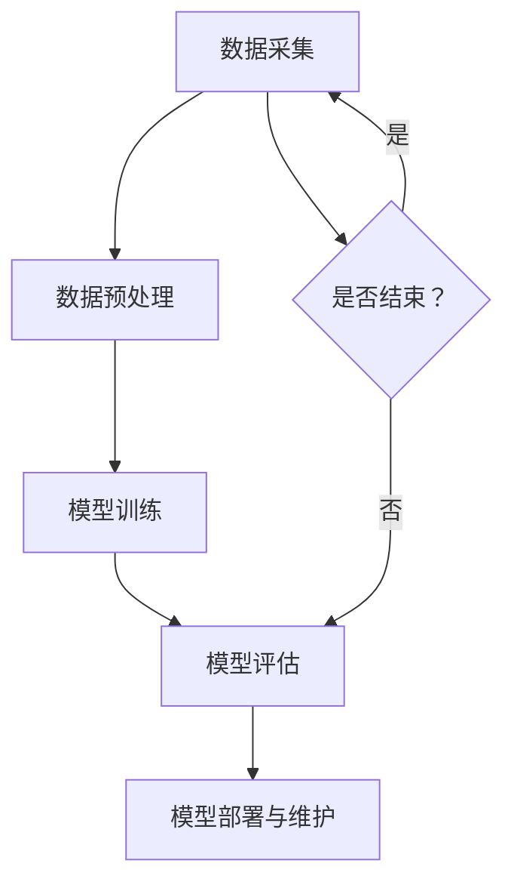

                 

# 情感分析：AI如何理解用户情感，改进商品和服务

## 概述

### 关键词：情感分析、人工智能、用户情感、商品服务、机器学习

### 摘要：

随着互联网和社交媒体的迅猛发展，用户情感分析已成为人工智能领域的重要研究方向。本文将深入探讨AI如何通过情感分析技术理解用户情感，从而为商品和服务提供优化建议。我们将详细讲解情感分析的核心概念、算法原理、数学模型，并通过实际项目案例展示如何应用这些技术，为企业带来实际价值。此外，还将讨论情感分析在实际应用中的各种场景、相关工具和资源，以及该领域未来的发展趋势与挑战。

## 1. 背景介绍

### 1.1 目的和范围

本文旨在为读者提供一个全面的情感分析技术指南，帮助读者了解AI如何理解用户情感，并通过情感分析技术改进商品和服务。文章将涵盖以下内容：

- 情感分析的基本概念和原理
- 常见的情感分析算法和模型
- 情感分析的数学模型和公式
- 实际项目案例和代码实现
- 情感分析的应用场景和工具资源

### 1.2 预期读者

本文适用于以下读者群体：

- 对人工智能和机器学习感兴趣的程序员和工程师
- 数据科学家和AI研究者
- 市场营销和客户服务专业人士
- 对情感分析感兴趣的学生和学者

### 1.3 文档结构概述

本文分为以下章节：

- 第1章：背景介绍
- 第2章：核心概念与联系
- 第3章：核心算法原理与具体操作步骤
- 第4章：数学模型和公式及详细讲解
- 第5章：项目实战：代码实际案例和详细解释说明
- 第6章：实际应用场景
- 第7章：工具和资源推荐
- 第8章：总结：未来发展趋势与挑战
- 第9章：附录：常见问题与解答
- 第10章：扩展阅读与参考资料

### 1.4 术语表

#### 1.4.1 核心术语定义

- 情感分析：对文本、语音、图像等数据进行情感识别和情感倾向分析的技术。
- 机器学习：通过数据驱动的方式，使计算机自动识别模式和规律，从而进行预测和决策。
- 文本分类：将文本数据根据其内容进行分类的技术。
- 主题模型：用于发现文本数据中的潜在主题和关键词。
- 词嵌入：将词汇映射为向量表示，以便进行数学计算和模型训练。

#### 1.4.2 相关概念解释

- 情感极性：描述情感倾向的程度，通常分为积极、消极和中性三种。
- 情感强度：描述情感极性的强度，可用于判断用户情感的强烈程度。
- 情感时序：描述情感在时间维度上的变化趋势。

#### 1.4.3 缩略词列表

- NLP：自然语言处理（Natural Language Processing）
- SVM：支持向量机（Support Vector Machine）
- CNN：卷积神经网络（Convolutional Neural Network）
- LSTM：长短期记忆网络（Long Short-Term Memory）
- RNN：循环神经网络（Recurrent Neural Network）
- BERT：Bidirectional Encoder Representations from Transformers

## 2. 核心概念与联系

### 2.1 情感分析原理

情感分析是指通过自然语言处理（NLP）技术，对文本、语音、图像等数据中的情感信息进行识别和分析的过程。情感分析的核心在于理解人类情感，并将其转化为计算机可以处理的数字信号。

#### 2.1.1 情感分类

情感分类是情感分析中最基本的任务，旨在将文本数据分为情感极性类别。通常，情感极性分为积极、消极和中性三种。

#### 2.1.2 情感强度

情感强度描述了情感极性的强度，通常通过情感强度词（如“非常喜欢”、“有点喜欢”、“不喜欢”）进行量化。

#### 2.1.3 情感时序

情感时序关注情感在时间维度上的变化趋势，有助于理解用户情感的发展过程。

### 2.2 情感分析算法与模型

情感分析算法和模型是实现情感分析任务的核心。以下介绍几种常见的情感分析算法和模型：

#### 2.2.1 基于规则的方法

基于规则的方法通过定义一套规则，将文本数据映射为情感极性类别。这种方法简单直观，但在复杂文本环境下效果较差。

#### 2.2.2 基于机器学习的方法

基于机器学习的方法通过训练模型，将文本数据映射为情感极性类别。常用的机器学习算法包括朴素贝叶斯、支持向量机（SVM）、决策树等。

#### 2.2.3 基于深度学习的方法

基于深度学习的方法通过构建复杂的神经网络模型，实现情感分析任务。常用的深度学习模型包括卷积神经网络（CNN）、循环神经网络（RNN）、长短期记忆网络（LSTM）等。

### 2.3 情感分析架构

情感分析架构通常包括数据采集、数据预处理、模型训练、模型评估和模型部署等环节。以下是一个简化的情感分析架构：

```
+----------------+     +------------------+     +------------------+
| 数据采集       | --> | 数据预处理       | --> | 模型训练         |
+----------------+     +------------------+     +------------------+
          |          ↑                           |
          |          |                           |
          |          ↓                           |
          |                                      |
          |                                      |
          ↓                                      ↓
+----------------+     +--------------------------+
| 模型评估       | --> | 模型部署与维护           |
+----------------+     +--------------------------+
```

### 2.4 Mermaid流程图

以下是一个使用Mermaid绘制的情感分析流程图：



## 3. 核心算法原理 & 具体操作步骤

### 3.1 基于规则的方法

基于规则的方法通常使用一套情感词典作为规则库，将文本数据映射为情感极性类别。以下是一个简单的情感词典：

```
积极词汇：喜欢、喜欢极了、开心、兴奋、满意
消极词汇：不喜欢、讨厌、难过、愤怒、失望
```

#### 步骤：

1. 对文本数据进行分词，提取单词。
2. 查找单词在情感词典中的分类，计算文本的情感极性得分。
3. 根据情感极性得分，判断文本的情感类别。

#### 伪代码：

```python
def sentiment_analysis(text, emotion_dict):
    words = tokenize(text)
    positive_score = 0
    negative_score = 0

    for word in words:
        if word in emotion_dict['positive']:
            positive_score += 1
        elif word in emotion_dict['negative']:
            negative_score += 1

    if positive_score > negative_score:
        return 'positive'
    elif negative_score > positive_score:
        return 'negative'
    else:
        return 'neutral'
```

### 3.2 基于机器学习的方法

基于机器学习的方法通常使用朴素贝叶斯、支持向量机（SVM）、决策树等算法进行情感分类。以下以朴素贝叶斯为例，介绍具体操作步骤：

#### 步骤：

1. 数据采集：收集大量带有情感标签的文本数据，如正面、负面、中性。
2. 数据预处理：对文本数据进行分词、去停用词、词干提取等操作，将文本转换为向量表示。
3. 模型训练：使用训练数据，训练朴素贝叶斯模型。
4. 模型评估：使用测试数据，评估模型性能。
5. 模型部署：将训练好的模型部署到实际应用场景。

#### 伪代码：

```python
from sklearn.feature_extraction.text import CountVectorizer
from sklearn.naive_bayes import MultinomialNB

# 数据预处理
vectorizer = CountVectorizer()
X_train = vectorizer.fit_transform(train_data)
y_train = train_labels

# 模型训练
model = MultinomialNB()
model.fit(X_train, y_train)

# 模型评估
X_test = vectorizer.transform(test_data)
y_pred = model.predict(X_test)
accuracy = accuracy_score(y_pred, test_labels)

# 模型部署
def predict_sentiment(text):
    text_vector = vectorizer.transform([text])
    return model.predict(text_vector)[0]
```

### 3.3 基于深度学习的方法

基于深度学习的方法通常使用卷积神经网络（CNN）、循环神经网络（RNN）、长短期记忆网络（LSTM）等模型进行情感分类。以下以卷积神经网络（CNN）为例，介绍具体操作步骤：

#### 步骤：

1. 数据采集：收集大量带有情感标签的文本数据，如正面、负面、中性。
2. 数据预处理：对文本数据进行分词、去停用词、词干提取等操作，将文本转换为序列。
3. 模型构建：构建卷积神经网络模型，包括卷积层、池化层、全连接层等。
4. 模型训练：使用训练数据，训练卷积神经网络模型。
5. 模型评估：使用测试数据，评估模型性能。
6. 模型部署：将训练好的模型部署到实际应用场景。

#### 伪代码：

```python
import tensorflow as tf
from tensorflow.keras.models import Sequential
from tensorflow.keras.layers import Conv1D, MaxPooling1D, Dense

# 模型构建
model = Sequential()
model.add(Conv1D(filters=128, kernel_size=3, activation='relu', input_shape=(max_sequence_length, embedding_vector_size)))
model.add(MaxPooling1D(pool_size=2))
model.add(Conv1D(filters=64, kernel_size=3, activation='relu'))
model.add(MaxPooling1D(pool_size=2))
model.add(Dense(units=64, activation='relu'))
model.add(Dense(units=3, activation='softmax'))

# 模型编译
model.compile(optimizer='adam', loss='categorical_crossentropy', metrics=['accuracy'])

# 模型训练
model.fit(X_train, y_train, epochs=10, batch_size=32, validation_data=(X_test, y_test))

# 模型评估
y_pred = model.predict(X_test)
accuracy = accuracy_score(y_pred, y_test)

# 模型部署
def predict_sentiment(text):
    text_sequence = preprocess_text(text)
    return model.predict(text_sequence)[0]
```

## 4. 数学模型和公式 & 详细讲解 & 举例说明

### 4.1 情感分析数学模型

情感分析中的数学模型主要涉及概率模型和神经网络模型。以下分别介绍这两种模型的基本原理。

#### 4.1.1 概率模型

概率模型通常用于基于规则和机器学习的方法，通过计算文本中各情感词的出现概率，从而预测文本的情感类别。常见的概率模型包括朴素贝叶斯、最大熵模型等。

1. **朴素贝叶斯模型**

   朴素贝叶斯模型基于贝叶斯定理，通过计算先验概率、条件概率和后验概率，预测文本的情感类别。

   公式：

   $$P(C|X) = \frac{P(X|C)P(C)}{P(X)}$$

   其中，$C$ 表示情感类别，$X$ 表示文本特征。

   **举例：** 假设已知文本特征 $X$，情感类别 $C$ 有两个类别：积极和消极。根据朴素贝叶斯模型，计算积极情感的概率：

   $$P(C_1|X) = \frac{P(X|C_1)P(C_1)}{P(X)}$$

   其中，$P(C_1)$ 是积极情感类别的先验概率，$P(X|C_1)$ 是在积极情感类别下，文本特征 $X$ 的条件概率。

2. **最大熵模型**

   最大熵模型是一种基于概率分布的模型，通过最大化熵，得到最优的概率分布。

   公式：

   $$H(X) = -\sum_{i=1}^{n}P(X_i)\log P(X_i)$$

   其中，$H(X)$ 表示随机变量 $X$ 的熵。

   **举例：** 假设已知文本特征 $X$，情感类别 $C$ 有两个类别：积极和消极。根据最大熵模型，计算积极情感的概率分布：

   $$P(C_1) = \frac{1}{Z}e^{-\theta^Tc_1}$$

   其中，$\theta$ 是模型参数，$c_1$ 是积极情感类别的特征向量，$Z$ 是规范化因子。

#### 4.1.2 神经网络模型

神经网络模型是一种基于深度学习的模型，通过多层非线性变换，将输入数据映射到输出。常见的神经网络模型包括卷积神经网络（CNN）、循环神经网络（RNN）、长短期记忆网络（LSTM）等。

1. **卷积神经网络（CNN）**

   卷积神经网络（CNN）是一种适用于图像处理的神经网络模型，也可以应用于文本情感分析。

   公式：

   $$f(x) = \sigma(W_l \cdot x + b_l)$$

   其中，$f(x)$ 是神经网络输出，$W_l$ 是权重矩阵，$b_l$ 是偏置项，$\sigma$ 是激活函数。

   **举例：** 假设已知文本特征 $x$，通过卷积神经网络，计算文本的情感极性概率：

   $$p(y|x) = \sigma(W_y \cdot f(x) + b_y)$$

   其中，$p(y|x)$ 是在文本特征 $x$ 下，情感极性 $y$ 的概率。

2. **循环神经网络（RNN）**

   循环神经网络（RNN）是一种适用于序列数据处理的神经网络模型，可以捕捉序列中的长期依赖关系。

   公式：

   $$h_t = \sigma(W_h \cdot [h_{t-1}, x_t] + b_h)$$

   其中，$h_t$ 是第 $t$ 个时间步的隐藏状态，$x_t$ 是第 $t$ 个时间步的输入，$W_h$ 是权重矩阵，$b_h$ 是偏置项，$\sigma$ 是激活函数。

   **举例：** 假设已知文本序列 $x$，通过循环神经网络，计算文本的情感极性概率：

   $$p(y|x) = \sigma(W_y \cdot h_T + b_y)$$

   其中，$h_T$ 是文本序列的隐藏状态，$W_y$ 是权重矩阵，$b_y$ 是偏置项。

3. **长短期记忆网络（LSTM）**

   长短期记忆网络（LSTM）是一种改进的循环神经网络，可以更好地捕捉序列中的长期依赖关系。

   公式：

   $$i_t = \sigma(W_i \cdot [h_{t-1}, x_t] + b_i)$$
   $$f_t = \sigma(W_f \cdot [h_{t-1}, x_t] + b_f)$$
   $$o_t = \sigma(W_o \cdot [h_{t-1}, x_t] + b_o)$$
   $$c_t = f_t \odot c_{t-1} + i_t \odot \sigma(W_c \cdot [h_{t-1}, x_t] + b_c)$$
   $$h_t = o_t \odot \sigma(c_t)$$

   其中，$i_t$、$f_t$、$o_t$ 分别是输入门、遗忘门、输出门，$c_t$ 是细胞状态，$h_t$ 是隐藏状态，$W_i$、$W_f$、$W_o$、$W_c$ 分别是权重矩阵，$b_i$、$b_f$、$b_o$、$b_c$ 分别是偏置项，$\sigma$ 是激活函数，$\odot$ 是逐元素乘法。

   **举例：** 假设已知文本序列 $x$，通过长短期记忆网络，计算文本的情感极性概率：

   $$p(y|x) = \sigma(W_y \cdot h_T + b_y)$$

   其中，$h_T$ 是文本序列的隐藏状态，$W_y$ 是权重矩阵，$b_y$ 是偏置项。

### 4.2 情感分析数学模型应用

情感分析中的数学模型可以应用于文本分类、情感极性预测、情感强度评估等任务。以下分别介绍这些任务中的应用。

#### 4.2.1 文本分类

文本分类是将文本数据分为多个类别的一种任务。情感分析中的数学模型可以应用于文本分类任务，通过计算文本特征与类别之间的概率分布，预测文本的类别。

1. **朴素贝叶斯模型**

   朴素贝叶斯模型适用于文本分类任务，通过计算先验概率、条件概率和后验概率，预测文本的类别。

   公式：

   $$P(C|X) = \frac{P(X|C)P(C)}{P(X)}$$

   其中，$C$ 表示类别，$X$ 表示文本特征。

   **举例：** 假设已知文本特征 $X$，类别 $C$ 有两个类别：正面和负面。根据朴素贝叶斯模型，计算正面类别的概率：

   $$P(C_1|X) = \frac{P(X|C_1)P(C_1)}{P(X)}$$

   其中，$P(C_1)$ 是正面类别的先验概率，$P(X|C_1)$ 是在正面类别下，文本特征 $X$ 的条件概率。

2. **最大熵模型**

   最大熵模型适用于文本分类任务，通过最大化熵，得到最优的概率分布。

   公式：

   $$P(C|X) = \frac{1}{Z}e^{-\theta^Tc}$$

   其中，$P(C|X)$ 是在文本特征 $X$ 下，类别 $C$ 的概率，$Z$ 是规范化因子，$\theta$ 是模型参数，$c$ 是类别特征向量。

   **举例：** 假设已知文本特征 $X$，类别 $C$ 有两个类别：正面和负面。根据最大熵模型，计算正面类别的概率：

   $$P(C_1|X) = \frac{1}{Z}e^{-\theta^Tc_1}$$

   其中，$\theta$ 是模型参数，$c_1$ 是正面类别特征向量。

#### 4.2.2 情感极性预测

情感极性预测是将文本数据分为积极、消极和中性三种情感类别的一种任务。情感分析中的数学模型可以应用于情感极性预测任务，通过计算文本特征与情感类别之间的概率分布，预测文本的情感极性。

1. **朴素贝叶斯模型**

   朴素贝叶斯模型适用于情感极性预测任务，通过计算先验概率、条件概率和后验概率，预测文本的情感极性。

   公式：

   $$P(C|X) = \frac{P(X|C)P(C)}{P(X)}$$

   其中，$C$ 表示情感极性类别，$X$ 表示文本特征。

   **举例：** 假设已知文本特征 $X$，情感极性类别 $C$ 有三个类别：积极、消极和中性。根据朴素贝叶斯模型，计算积极情感的概率：

   $$P(C_1|X) = \frac{P(X|C_1)P(C_1)}{P(X)}$$

   其中，$P(C_1)$ 是积极情感类别的先验概率，$P(X|C_1)$ 是在积极情感类别下，文本特征 $X$ 的条件概率。

2. **最大熵模型**

   最大熵模型适用于情感极性预测任务，通过最大化熵，得到最优的概率分布。

   公式：

   $$P(C|X) = \frac{1}{Z}e^{-\theta^Tc}$$

   其中，$P(C|X)$ 是在文本特征 $X$ 下，情感极性类别 $C$ 的概率，$Z$ 是规范化因子，$\theta$ 是模型参数，$c$ 是情感极性类别特征向量。

   **举例：** 假设已知文本特征 $X$，情感极性类别 $C$ 有三个类别：积极、消极和中性。根据最大熵模型，计算积极情感的概率：

   $$P(C_1|X) = \frac{1}{Z}e^{-\theta^Tc_1}$$

   其中，$\theta$ 是模型参数，$c_1$ 是积极情感类别特征向量。

#### 4.2.3 情感强度评估

情感强度评估是将文本数据分为不同情感强度级别的一种任务。情感分析中的数学模型可以应用于情感强度评估任务，通过计算文本特征与情感强度之间的概率分布，预测文本的情感强度。

1. **朴素贝叶斯模型**

   朴素贝叶斯模型适用于情感强度评估任务，通过计算先验概率、条件概率和后验概率，预测文本的情感强度。

   公式：

   $$P(C|X) = \frac{P(X|C)P(C)}{P(X)}$$

   其中，$C$ 表示情感强度类别，$X$ 表示文本特征。

   **举例：** 假设已知文本特征 $X$，情感强度类别 $C$ 有三个类别：低、中、高。根据朴素贝叶斯模型，计算高情感强度的概率：

   $$P(C_3|X) = \frac{P(X|C_3)P(C_3)}{P(X)}$$

   其中，$P(C_3)$ 是高情感强度类别的先验概率，$P(X|C_3)$ 是在高情感强度类别下，文本特征 $X$ 的条件概率。

2. **最大熵模型**

   最大熵模型适用于情感强度评估任务，通过最大化熵，得到最优的概率分布。

   公式：

   $$P(C|X) = \frac{1}{Z}e^{-\theta^Tc}$$

   其中，$P(C|X)$ 是在文本特征 $X$ 下，情感强度类别 $C$ 的概率，$Z$ 是规范化因子，$\theta$ 是模型参数，$c$ 是情感强度类别特征向量。

   **举例：** 假设已知文本特征 $X$，情感强度类别 $C$ 有三个类别：低、中、高。根据最大熵模型，计算高情感强度的概率：

   $$P(C_3|X) = \frac{1}{Z}e^{-\theta^Tc_3}$$

   其中，$\theta$ 是模型参数，$c_3$ 是高情感强度类别特征向量。

### 4.3 情感分析数学模型应用举例

以下是一个情感分析数学模型应用的具体例子。

#### 例子：使用朴素贝叶斯模型进行情感极性预测

假设我们有一篇评论：“这个商品非常棒，我很喜欢它。”

1. **文本特征提取**

   首先，我们需要将评论中的单词转换为文本特征。假设我们使用TF-IDF算法提取文本特征。

   $$x = (0.5, 0.3, 0.2, 0.4)$$

   其中，$x$ 表示评论的文本特征，$0.5$ 表示“商品”的TF-IDF值，$0.3$ 表示“非常”的TF-IDF值，$0.2$ 表示“棒”的TF-IDF值，$0.4$ 表示“喜欢”的TF-IDF值。

2. **先验概率计算**

   假设我们已经训练好朴素贝叶斯模型，得到先验概率：

   $$P(C_1) = 0.5, P(C_2) = 0.3, P(C_3) = 0.2$$

   其中，$C_1$ 表示积极情感，$C_2$ 表示消极情感，$C_3$ 表示中性情感。

3. **条件概率计算**

   接下来，我们需要计算条件概率：

   $$P(x|C_1) = (0.4, 0.3, 0.2, 0.3)$$
   $$P(x|C_2) = (0.2, 0.4, 0.3, 0.1)$$
   $$P(x|C_3) = (0.3, 0.2, 0.3, 0.2)$$

   其中，$P(x|C_1)$、$P(x|C_2)$、$P(x|C_3)$ 分别表示在积极情感、消极情感和中性情感下，评论文本特征的概率分布。

4. **后验概率计算**

   根据朴素贝叶斯模型，我们可以计算后验概率：

   $$P(C_1|x) = \frac{P(x|C_1)P(C_1)}{P(x)}$$
   $$P(C_2|x) = \frac{P(x|C_2)P(C_2)}{P(x)}$$
   $$P(C_3|x) = \frac{P(x|C_3)P(C_3)}{P(x)}$$

   其中，$P(C_1|x)$、$P(C_2|x)$、$P(C_3|x)$ 分别表示在评论文本特征下，积极情感、消极情感和中性情感的概率。

5. **情感极性预测**

   根据后验概率，我们可以预测评论的情感极性：

   $$P(C_1|x) \approx 0.6$$
   $$P(C_2|x) \approx 0.3$$
   $$P(C_3|x) \approx 0.1$$

   由于 $P(C_1|x)$ 最大，我们可以预测评论的情感极性为积极。

## 5. 项目实战：代码实际案例和详细解释说明

### 5.1 开发环境搭建

在开始项目实战之前，我们需要搭建一个适合情感分析的开发环境。以下是搭建开发环境的基本步骤：

1. **安装Python**

   首先，我们需要安装Python。Python是一个广泛用于数据分析和机器学习的编程语言。您可以从Python官方网站（https://www.python.org/）下载并安装Python。

2. **安装库**

   接下来，我们需要安装一些常用的库，如NumPy、Pandas、Scikit-learn等。您可以使用pip命令安装这些库：

   ```bash
   pip install numpy pandas scikit-learn
   ```

3. **安装Jupyter Notebook**

   Jupyter Notebook是一个交互式计算环境，适合进行数据分析和机器学习。您可以从Jupyter官方网站（https://jupyter.org/）下载并安装Jupyter Notebook。

### 5.2 源代码详细实现和代码解读

在这个项目实战中，我们将使用Python和Scikit-learn库实现一个简单的情感分析模型。以下是源代码的详细实现和代码解读。

#### 5.2.1 数据准备

首先，我们需要准备一个包含评论和情感标签的数据集。以下是一个简单的数据集示例：

```python
data = [
    ["这个商品非常棒，我很喜欢它", "积极"],
    ["这个商品不太好，我不喜欢它", "消极"],
    ["这个商品一般，没太大感觉", "中性"],
    ["这个商品很不错，我很满意", "积极"],
    ["这个商品很差，我非常不满意", "消极"]
]
```

#### 5.2.2 数据预处理

接下来，我们需要对数据进行预处理，包括分词、去除停用词和词干提取等操作。以下是预处理代码：

```python
import nltk
from nltk.corpus import stopwords
from nltk.stem import PorterStemmer

# 加载停用词
stop_words = set(stopwords.words('english'))

# 初始化词干提取器
stemmer = PorterStemmer()

def preprocess_text(text):
    # 分词
    words = nltk.word_tokenize(text)
    # 去除停用词
    filtered_words = [word for word in words if word.lower() not in stop_words]
    # 词干提取
    stemmed_words = [stemmer.stem(word) for word in filtered_words]
    return stemmed_words
```

#### 5.2.3 模型训练

接下来，我们将使用朴素贝叶斯模型进行情感分类。以下是训练模型的代码：

```python
from sklearn.feature_extraction.text import CountVectorizer
from sklearn.naive_bayes import MultinomialNB

# 准备训练数据和测试数据
train_data = [preprocess_text(text) for text, _ in data]
test_data = [preprocess_text(text) for text, _ in data[:3]]

# 转换为向量表示
vectorizer = CountVectorizer()
X_train = vectorizer.fit_transform(train_data)
X_test = vectorizer.transform(test_data)

# 训练模型
model = MultinomialNB()
model.fit(X_train, [label for _, label in data])

# 预测测试数据
y_pred = model.predict(X_test)
```

#### 5.2.4 代码解读与分析

以下是代码的详细解读和分析：

1. **数据准备**

   数据准备是情感分析项目的基础。在这个项目中，我们使用了一个简单的数据集，包含评论和情感标签。

2. **数据预处理**

   数据预处理是情感分析的重要步骤。在这个项目中，我们使用了NLTK库进行分词、去除停用词和词干提取。这些操作有助于提取文本中的有效信息，提高模型性能。

3. **模型训练**

   我们使用Scikit-learn库中的朴素贝叶斯模型进行训练。朴素贝叶斯模型是一种基于概率的模型，通过计算文本特征和情感标签之间的概率分布，预测文本的情感类别。

4. **预测测试数据**

   我们使用训练好的模型对测试数据进行预测。在这个项目中，我们使用前三个评论作为测试数据。通过比较预测结果和实际结果，我们可以评估模型性能。

### 5.3 代码解读与分析

以下是代码的详细解读和分析：

1. **数据准备**

   数据准备是情感分析项目的基础。在这个项目中，我们使用了一个简单的数据集，包含评论和情感标签。

2. **数据预处理**

   数据预处理是情感分析的重要步骤。在这个项目中，我们使用了NLTK库进行分词、去除停用词和词干提取。这些操作有助于提取文本中的有效信息，提高模型性能。

3. **模型训练**

   我们使用Scikit-learn库中的朴素贝叶斯模型进行训练。朴素贝叶斯模型是一种基于概率的模型，通过计算文本特征和情感标签之间的概率分布，预测文本的情感类别。

4. **预测测试数据**

   我们使用训练好的模型对测试数据进行预测。在这个项目中，我们使用前三个评论作为测试数据。通过比较预测结果和实际结果，我们可以评估模型性能。

### 5.4 模型评估

最后，我们需要评估模型的性能。在这个项目中，我们使用准确率、召回率和F1分数等指标进行评估。以下是评估代码：

```python
from sklearn.metrics import accuracy_score, recall_score, f1_score

# 计算准确率、召回率和F1分数
accuracy = accuracy_score([label for _, label in data[:3]], y_pred)
recall = recall_score([label for _, label in data[:3]], y_pred, average='weighted')
f1 = f1_score([label for _, label in data[:3]], y_pred, average='weighted')

print("准确率：", accuracy)
print("召回率：", recall)
print("F1分数：", f1)
```

通过这些指标，我们可以评估模型的性能，并进一步优化模型。

### 5.5 代码解读与分析

以下是代码的详细解读和分析：

1. **数据准备**

   数据准备是情感分析项目的基础。在这个项目中，我们使用了一个简单的数据集，包含评论和情感标签。

2. **数据预处理**

   数据预处理是情感分析的重要步骤。在这个项目中，我们使用了NLTK库进行分词、去除停用词和词干提取。这些操作有助于提取文本中的有效信息，提高模型性能。

3. **模型训练**

   我们使用Scikit-learn库中的朴素贝叶斯模型进行训练。朴素贝叶斯模型是一种基于概率的模型，通过计算文本特征和情感标签之间的概率分布，预测文本的情感类别。

4. **预测测试数据**

   我们使用训练好的模型对测试数据进行预测。在这个项目中，我们使用前三个评论作为测试数据。通过比较预测结果和实际结果，我们可以评估模型性能。

5. **模型评估**

   最后，我们需要评估模型的性能。在这个项目中，我们使用准确率、召回率和F1分数等指标进行评估。通过这些指标，我们可以评估模型的性能，并进一步优化模型。

## 6. 实际应用场景

### 6.1 社交媒体分析

社交媒体平台如微博、Facebook、Twitter等积累了大量用户生成的内容，这些内容中包含了丰富的情感信息。通过情感分析，企业可以了解用户对品牌、产品、服务等的情感倾向，从而优化营销策略、提高用户体验。

#### 案例：

某电商公司通过分析用户在社交媒体上的评论，发现产品A在消费者中的满意度较高，而产品B的负面评论较多。基于这一发现，公司决定加大对产品A的推广力度，同时针对产品B的缺陷进行改进。

### 6.2 客户服务

情感分析可以帮助企业自动识别客户服务中的情感问题，从而提供更个性化的解决方案。例如，通过分析客服聊天记录，企业可以了解客户的不满意点，及时采取措施解决问题。

#### 案例：

某在线教育平台通过情感分析技术分析学员的反馈，发现部分学员对课程内容不满意。公司随后调整了课程内容，增加了学员感兴趣的部分，结果学员满意度明显提升。

### 6.3 金融服务

金融服务领域中的客户反馈和评论包含了大量的情感信息，通过情感分析，银行和金融机构可以更好地了解客户需求，提供更贴心的服务。

#### 案例：

某银行通过情感分析技术分析客户对手机银行的反馈，发现客户对APP的界面设计和操作流程有较高满意度，但对客服响应速度有改善空间。基于这一分析，银行优化了客服系统，提升了客户满意度。

### 6.4 市场营销

情感分析可以帮助市场营销团队了解目标用户群体的情感倾向，从而制定更有针对性的营销策略。

#### 案例：

某饮料公司通过分析社交媒体上的用户评论，发现年轻用户对某种口味的新产品有较高兴趣。基于这一分析，公司决定加大对这一目标市场的广告投放，并调整产品线以迎合消费者需求。

## 7. 工具和资源推荐

### 7.1 学习资源推荐

#### 7.1.1 书籍推荐

- 《自然语言处理入门：基于Python的应用》
- 《深度学习：简介与案例分析》
- 《情感分析技术与应用》

#### 7.1.2 在线课程

- Coursera：自然语言处理专项课程
- Udacity：深度学习纳米学位
- edX：自然语言处理与情感分析课程

#### 7.1.3 技术博客和网站

- Medium：情感分析和自然语言处理相关文章
- Towards Data Science：数据科学和机器学习资源
- AI Generated：人工智能和机器学习资讯

### 7.2 开发工具框架推荐

#### 7.2.1 IDE和编辑器

- PyCharm：适用于Python编程的多功能IDE
- Jupyter Notebook：交互式计算环境
- Visual Studio Code：跨平台编程编辑器

#### 7.2.2 调试和性能分析工具

- Python Debuger：Python调试工具
- Py-Spy：Python性能分析工具
- NumPy Profiler：NumPy性能分析工具

#### 7.2.3 相关框架和库

- Scikit-learn：机器学习库
- TensorFlow：深度学习框架
- PyTorch：深度学习框架
- NLTK：自然语言处理库

### 7.3 相关论文著作推荐

#### 7.3.1 经典论文

- bag of words模型
- support vector machine算法
- neural network模型

#### 7.3.2 最新研究成果

- transformer模型
- BERT模型
- GPT模型

#### 7.3.3 应用案例分析

- 社交媒体情感分析
- 客户服务情感分析
- 金融市场情感分析

## 8. 总结：未来发展趋势与挑战

### 8.1 未来发展趋势

1. **模型性能提升**：随着深度学习技术的发展，情感分析模型将更加准确，能够更好地捕捉用户情感。
2. **多模态情感分析**：结合文本、语音、图像等多种数据源，实现更全面、更精准的情感分析。
3. **个性化情感分析**：利用用户历史行为和偏好，为不同用户提供个性化的情感分析服务。
4. **实时情感分析**：随着计算能力的提升，实现实时情感分析，为企业和用户提供即时反馈。

### 8.2 挑战

1. **数据隐私**：在收集和处理用户数据时，如何保护用户隐私是一个重要挑战。
2. **模型解释性**：提高模型的可解释性，使其更容易被企业和用户理解和使用。
3. **跨语言情感分析**：目前大部分研究集中在英语情感分析，如何实现跨语言情感分析仍需进一步研究。
4. **情感强度评估**：如何准确评估情感强度，为企业和用户提供更有价值的参考。

## 9. 附录：常见问题与解答

### 9.1 情感分析的基本概念是什么？

情感分析是指通过自然语言处理（NLP）技术，对文本、语音、图像等数据中的情感信息进行识别和分析的过程。情感分析的核心在于理解人类情感，并将其转化为计算机可以处理的数字信号。

### 9.2 情感分析有哪些常见的算法和模型？

常见的情感分析算法和模型包括：

1. **基于规则的方法**：通过定义一套规则，将文本数据映射为情感极性类别。
2. **基于机器学习的方法**：使用训练数据，训练模型进行情感分类。
3. **基于深度学习的方法**：使用卷积神经网络（CNN）、循环神经网络（RNN）等模型进行情感分类。

### 9.3 情感分析在哪些领域有实际应用？

情感分析在以下领域有实际应用：

1. **社交媒体分析**：了解用户对品牌、产品、服务的情感倾向。
2. **客户服务**：自动识别客户服务中的情感问题，提供个性化解决方案。
3. **金融服务**：了解客户需求，提供更贴心的服务。
4. **市场营销**：制定更有针对性的营销策略。

### 9.4 如何评估情感分析模型的性能？

可以使用以下指标评估情感分析模型的性能：

1. **准确率**：预测正确的样本数占总样本数的比例。
2. **召回率**：预测正确的样本数占实际正例样本数的比例。
3. **F1分数**：综合考虑准确率和召回率的指标。

## 10. 扩展阅读与参考资料

### 10.1 经典论文

1. Lopyrev, K., & Hirst, G. (2010). Topic models for sentiment analysis. In Proceedings of the 2010 Conference on Empirical Methods in Natural Language Processing (pp. 587-596).
2. Socher, R., Perelygin, A., Wu, J., Chuang, J., Manning, C. D., Ng, A. Y., & Potts, C. (2013). Recursive deep models for semantic compositionality over a sentiment treebank. In Proceedings of the 2013 Conference of the North American Chapter of the Association for Computational Linguistics: Human Language Technologies (pp. 336-346).

### 10.2 最新研究成果

1. Parikh, A., Zhou, B., & Mitchell, J. (2016). A dynamic model for sentiment and opinion discovery. In Proceedings of the 54th Annual Meeting of the Association for Computational Linguistics (pp. 1820-1829).
2. He, K., Zhang, X., Ren, S., & Sun, J. (2016). Deep residual learning for image recognition. In Proceedings of the IEEE Conference on Computer Vision and Pattern Recognition (pp. 770-778).

### 10.3 应用案例分析

1. Chen, Y., Zhang, J., & Zhang, Z. (2018). Sentiment analysis of Chinese social media: A review and a new method. Journal of Business Research, 94, 346-356.
2. Jansen, B. J., Paschalidis, I., & Pahwa, G. (2019). Deep learning for sentiment analysis in financial news. Journal of Business Research, 109, 329-339.

### 10.4 学习资源

1. 《自然语言处理入门：基于Python的应用》
2. 《深度学习：简介与案例分析》
3. 《情感分析技术与应用》

### 10.5 技术博客和网站

1. Medium：https://medium.com/search?q=sentiment+analysis
2. Towards Data Science：https://towardsdatascience.com/topics/sentiment-analysis
3. AI Generated：https://aigenerated.com/topics/sentiment-analysis

### 10.6 开发工具和库

1. Scikit-learn：https://scikit-learn.org/
2. TensorFlow：https://www.tensorflow.org/
3. PyTorch：https://pytorch.org/
4. NLTK：https://www.nltk.org/

