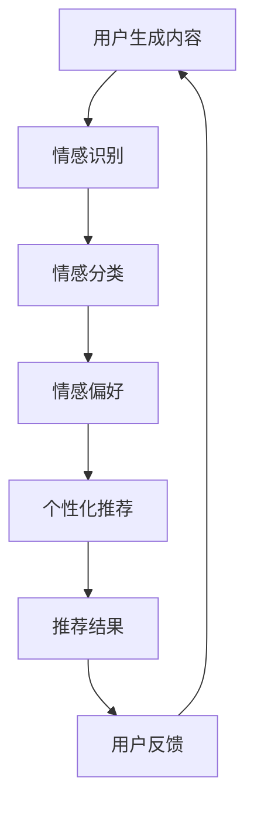

                 

# 情感驱动推荐：AI 如何理解用户情绪，提供个性化推荐

> **关键词：情感计算、个性化推荐、情感识别、深度学习、自然语言处理、用户情绪分析**
>
> **摘要：本文将深入探讨如何利用人工智能技术，特别是情感计算和自然语言处理，来理解用户情绪并实现情感驱动的个性化推荐。我们将从背景介绍开始，逐步分析核心概念、算法原理、数学模型、项目实战，并讨论实际应用场景和未来发展。**

## 1. 背景介绍

### 1.1 目的和范围

本文的目的是探讨如何将情感计算与个性化推荐系统相结合，以提升用户满意度和推荐质量。我们不仅会介绍相关的核心概念，还会通过具体案例来展示如何实现这种结合。

### 1.2 预期读者

本文适合对人工智能、情感计算和推荐系统有一定了解的技术人员、数据科学家和研究人员。如果读者对自然语言处理和深度学习感兴趣，那么将更有助于理解文章内容。

### 1.3 文档结构概述

本文将按照以下结构展开：

1. 背景介绍
2. 核心概念与联系
3. 核心算法原理 & 具体操作步骤
4. 数学模型和公式 & 详细讲解 & 举例说明
5. 项目实战：代码实际案例和详细解释说明
6. 实际应用场景
7. 工具和资源推荐
8. 总结：未来发展趋势与挑战
9. 附录：常见问题与解答
10. 扩展阅读 & 参考资料

### 1.4 术语表

#### 1.4.1 核心术语定义

- **情感计算**：模拟人类情感的过程，通常涉及情感识别、情感生成和情感交互。
- **个性化推荐**：根据用户的兴趣和行为，为用户提供相关物品或内容。
- **情感识别**：通过分析用户生成的内容，如评论、帖子或对话，识别其情感状态。
- **深度学习**：一种机器学习技术，通过模拟人脑的神经网络结构，自动学习和提取特征。
- **自然语言处理（NLP）**：使计算机能够理解、解释和生成人类语言的技术。

#### 1.4.2 相关概念解释

- **用户情绪分析**：分析用户生成的内容，识别其情感状态，如喜悦、愤怒、悲伤等。
- **推荐系统**：根据用户的历史行为和偏好，为用户推荐相关物品或内容。

#### 1.4.3 缩略词列表

- **AI**：人工智能（Artificial Intelligence）
- **NLP**：自然语言处理（Natural Language Processing）
- **DL**：深度学习（Deep Learning）
- **EM**：情感模型（Emotion Model）
- **RS**：推荐系统（Recommender System）

## 2. 核心概念与联系

在探讨如何实现情感驱动的个性化推荐之前，我们需要了解几个核心概念和它们之间的联系。

### 2.1 情感计算与个性化推荐的关系

情感计算的目标是模拟人类情感，而个性化推荐则旨在满足用户的个性化需求。情感计算在个性化推荐中的应用主要体现在以下几个方面：

1. **情感识别**：通过情感计算技术，识别用户生成内容中的情感状态，如正面、负面或中性。
2. **情感偏好**：将用户的情感状态与其偏好关联，以便更好地了解用户的兴趣和需求。
3. **情感触发**：在推荐系统中引入情感触发机制，根据用户的情感状态调整推荐策略。

### 2.2 情感计算的关键技术

- **情感识别**：使用机器学习技术，如深度学习，对用户生成内容进行情感分析。
- **情感分类**：将情感识别结果分类为不同的情感类别，如喜悦、愤怒、悲伤等。
- **情感生成**：根据用户情感状态，生成相应的情感反馈或推荐内容。

### 2.3 个性化推荐的关键技术

- **协同过滤**：基于用户的历史行为和偏好，为用户推荐相似的物品或内容。
- **基于内容的推荐**：根据物品或内容的属性，为用户推荐相关的物品或内容。
- **混合推荐**：结合协同过滤和基于内容的推荐，提高推荐系统的准确性。

### 2.4 Mermaid 流程图

为了更好地展示情感计算与个性化推荐之间的关系，我们可以使用 Mermaid 流程图来表示各个概念和步骤。



## 3. 核心算法原理 & 具体操作步骤

在了解了情感计算和个性化推荐的基本概念和联系之后，我们将进一步探讨如何利用深度学习和自然语言处理技术来实现情感驱动的个性化推荐。

### 3.1 情感识别算法原理

情感识别是情感计算中的关键步骤，其主要目标是根据用户生成的内容（如评论、帖子、对话等），识别出其中的情感状态。深度学习技术在情感识别中具有显著优势，其中卷积神经网络（CNN）和循环神经网络（RNN）是常用的模型。

#### 3.1.1 卷积神经网络（CNN）

卷积神经网络通过卷积操作提取文本特征，从而实现情感识别。以下是情感识别算法的伪代码：

```python
def sentiment_analysis_cnn(input_text):
    # 加载预训练的词向量模型
    word_vector_model = load_pretrained_word_vector_model()
    
    # 将输入文本转换为词向量表示
    input_vector = convert_text_to_vector(input_text, word_vector_model)
    
    # 通过卷积神经网络提取特征
    features = cnn_forward_pass(input_vector)
    
    # 通过全连接层得到情感预测结果
    sentiment = fc_forward_pass(features)
    
    return sentiment
```

#### 3.1.2 循环神经网络（RNN）

循环神经网络通过处理序列数据，实现情感识别。以下是情感识别算法的伪代码：

```python
def sentiment_analysis_rnn(input_sequence):
    # 加载预训练的词向量模型
    word_vector_model = load_pretrained_word_vector_model()
    
    # 将输入序列转换为词向量表示
    input_vector_sequence = convert_sequence_to_vector(input_sequence, word_vector_model)
    
    # 通过循环神经网络提取特征
    features = rnn_forward_pass(input_vector_sequence)
    
    # 通过全连接层得到情感预测结果
    sentiment = fc_forward_pass(features)
    
    return sentiment
```

### 3.2 情感分类算法原理

情感分类是将情感识别结果进一步分类为不同的情感类别，如喜悦、愤怒、悲伤等。常用的情感分类算法包括朴素贝叶斯（Naive Bayes）、支持向量机（SVM）和深度学习（如卷积神经网络和循环神经网络）。

#### 3.2.1 朴素贝叶斯（Naive Bayes）

朴素贝叶斯是一种基于概率的算法，通过计算文本特征的概率分布来实现情感分类。以下是情感分类算法的伪代码：

```python
def sentiment_classification_naive_bayes(input_text):
    # 加载情感分类模型
    model = load_sentiment_classification_model()
    
    # 将输入文本转换为特征向量
    feature_vector = convert_text_to_vector(input_text)
    
    # 通过朴素贝叶斯模型预测情感类别
    sentiment = model.predict(feature_vector)
    
    return sentiment
```

#### 3.2.2 支持向量机（SVM）

支持向量机是一种基于几何学的算法，通过寻找最佳超平面来实现情感分类。以下是情感分类算法的伪代码：

```python
def sentiment_classification_svm(input_text):
    # 加载情感分类模型
    model = load_sentiment_classification_model()
    
    # 将输入文本转换为特征向量
    feature_vector = convert_text_to_vector(input_text)
    
    # 通过支持向量机模型预测情感类别
    sentiment = model.predict(feature_vector)
    
    return sentiment
```

#### 3.2.3 深度学习（CNN和RNN）

深度学习技术，如卷积神经网络和循环神经网络，可以用于情感分类。以下是情感分类算法的伪代码：

```python
def sentiment_classification_dl(input_text):
    # 加载情感分类模型
    model = load_sentiment_classification_model()
    
    # 将输入文本转换为词向量表示
    input_vector = convert_text_to_vector(input_text)
    
    # 通过深度学习模型提取特征
    features = dl_forward_pass(input_vector)
    
    # 通过全连接层得到情感预测结果
    sentiment = fc_forward_pass(features)
    
    return sentiment
```

### 3.3 情感偏好算法原理

情感偏好是指将用户的情感状态与其偏好关联，以便更好地了解用户的兴趣和需求。情感偏好算法通常基于用户的历史行为和情感识别结果。

#### 3.3.1 基于情感识别的偏好模型

基于情感识别的偏好模型将用户的情感状态与历史行为关联，从而预测用户的偏好。以下是情感偏好算法的伪代码：

```python
def sentiment_preference_model(user, sentiment):
    # 获取用户的历史行为数据
    history_data = get_user_history_data(user)
    
    # 根据情感识别结果，过滤与情感相关的行为数据
    relevant_data = filter_data_by_sentiment(history_data, sentiment)
    
    # 训练情感偏好模型
    model = train_sentiment_preference_model(relevant_data)
    
    # 预测用户的偏好
    preference = model.predict(user)
    
    return preference
```

#### 3.3.2 基于协同过滤的偏好模型

基于协同过滤的偏好模型通过分析用户的历史行为，为用户推荐相关的物品或内容。以下是情感偏好算法的伪代码：

```python
def collaborative_filter_preference_model(user, items):
    # 加载协同过滤模型
    model = load_collaborative_filter_model()
    
    # 计算用户与物品的相关性
    relevance_scores = model.similarity_scores(user, items)
    
    # 根据相关性为用户推荐物品
    recommendations = recommend_items(user, items, relevance_scores)
    
    return recommendations
```

### 3.4 个性化推荐算法原理

个性化推荐是指根据用户的兴趣和行为，为用户推荐相关的物品或内容。情感驱动的个性化推荐算法将用户的情感状态纳入推荐策略中。

#### 3.4.1 基于协同过滤的推荐算法

基于协同过滤的推荐算法通过分析用户的历史行为，为用户推荐相似的物品或内容。以下是情感驱动的个性化推荐算法的伪代码：

```python
def collaborative_filter_recommendation(user, items, sentiment):
    # 加载协同过滤模型
    model = load_collaborative_filter_model()
    
    # 计算用户与物品的相关性
    relevance_scores = model.similarity_scores(user, items)
    
    # 根据情感状态调整相关性得分
    adjusted_scores = adjust_scores_by_sentiment(relevance_scores, sentiment)
    
    # 根据调整后的得分为用户推荐物品
    recommendations = recommend_items(user, items, adjusted_scores)
    
    return recommendations
```

#### 3.4.2 基于内容的推荐算法

基于内容的推荐算法根据物品或内容的属性，为用户推荐相关的物品或内容。以下是情感驱动的个性化推荐算法的伪代码：

```python
def content_based_recommendation(item, user, sentiment):
    # 加载基于内容的推荐模型
    model = load_content_based_model()
    
    # 获取物品的属性特征
    item_features = get_item_features(item)
    
    # 获取用户的偏好特征
    user_preferences = get_user_preferences(user)
    
    # 根据情感状态调整用户偏好
    adjusted_preferences = adjust_preferences_by_sentiment(user_preferences, sentiment)
    
    # 计算物品与用户偏好之间的相似度
    similarity_scores = model.similarity_scores(item_features, adjusted_preferences)
    
    # 为用户推荐相关物品
    recommendations = recommend_items(user, items, similarity_scores)
    
    return recommendations
```

#### 3.4.3 混合推荐算法

混合推荐算法结合协同过滤和基于内容的推荐，以提高推荐系统的准确性。以下是情感驱动的混合推荐算法的伪代码：

```python
def hybrid_recommendation(user, items, sentiment):
    # 加载协同过滤模型
    collaborative_model = load_collaborative_filter_model()
    
    # 加载基于内容的推荐模型
    content_model = load_content_based_model()
    
    # 计算协同过滤推荐结果
    collaborative_recommendations = collaborative_filter_recommendation(user, items, sentiment)
    
    # 计算基于内容的推荐结果
    content_recommendations = content_based_recommendation(item, user, sentiment)
    
    # 结合协同过滤和基于内容的推荐结果
    hybrid_recommendations = combine_recommendations(collaborative_recommendations, content_recommendations)
    
    return hybrid_recommendations
```

## 4. 数学模型和公式 & 详细讲解 & 举例说明

在实现情感驱动的个性化推荐过程中，我们使用了一系列数学模型和公式。以下是这些模型的详细讲解和示例。

### 4.1 情感识别模型

情感识别模型的核心是情感分类器，其目的是将文本分类为不同的情感类别。以下是情感分类器的数学模型：

$$
P(Sentiment|Text) = \frac{P(Text|Sentiment) \cdot P(Sentiment)}{P(Text)}
$$

其中：

- \( Sentiment \) 表示情感类别。
- \( Text \) 表示文本。
- \( P(Sentiment|Text) \) 表示在给定文本的情况下，情感类别的概率。
- \( P(Text|Sentiment) \) 表示在给定情感类别的情况下，文本的概率。
- \( P(Sentiment) \) 表示情感类别的先验概率。
- \( P(Text) \) 表示文本的概率。

#### 示例

假设我们有一个情感分类器，其输入文本为“我喜欢这本书”，我们需要计算该文本属于正面情感的概率。根据贝叶斯定理，我们可以使用以下公式：

$$
P(Positive|我喜欢这本书) = \frac{P(我喜欢这本书|Positive) \cdot P(Positive)}{P(我喜欢这本书)}
$$

其中：

- \( Positive \) 表示正面情感。
- \( P(Positive) \) 表示正面情感的先验概率。
- \( P(我喜欢这本书|Positive) \) 表示在正面情感的情况下，“我喜欢这本书”的概率。
- \( P(我喜欢这本书) \) 表示“我喜欢这本书”的概率。

### 4.2 情感偏好模型

情感偏好模型将用户的情感状态与其偏好关联，以便更好地了解用户的兴趣和需求。以下是情感偏好模型的数学模型：

$$
Preference_{ij} = f(Sentiment_i, Content_j)
$$

其中：

- \( Preference_{ij} \) 表示用户 \( i \) 对物品 \( j \) 的偏好。
- \( Sentiment_i \) 表示用户 \( i \) 的情感状态。
- \( Content_j \) 表示物品 \( j \) 的内容。
- \( f \) 表示情感偏好函数。

#### 示例

假设用户 \( i \) 的情感状态为喜悦（Joy），物品 \( j \) 的内容为旅游（Travel），我们需要计算用户对物品的偏好。根据情感偏好模型，我们可以使用以下公式：

$$
Preference_{ij} = f(Joy, Travel)
$$

其中：

- \( f \) 表示情感偏好函数，将喜悦情感和旅游内容映射为偏好值。

### 4.3 个性化推荐模型

个性化推荐模型根据用户的兴趣和行为，为用户推荐相关的物品或内容。以下是个性化推荐模型的数学模型：

$$
Recommendation_i = \sum_{j \in Items} w_{ij} \cdot Content_j
$$

其中：

- \( Recommendation_i \) 表示用户 \( i \) 的推荐结果。
- \( w_{ij} \) 表示用户 \( i \) 对物品 \( j \) 的权重。
- \( Content_j \) 表示物品 \( j \) 的内容。
- \( Items \) 表示所有物品的集合。

#### 示例

假设用户 \( i \) 的偏好权重为 \( w_{ij} \)，物品 \( j \) 的内容为旅游（Travel），购物（Shopping），美食（Food），我们需要计算用户 \( i \) 的推荐结果。根据个性化推荐模型，我们可以使用以下公式：

$$
Recommendation_i = \sum_{j \in Items} w_{ij} \cdot Content_j = w_{i,Travel} \cdot Travel + w_{i,Shopping} \cdot Shopping + w_{i,Fo
``` 

## 5. 项目实战：代码实际案例和详细解释说明

### 5.1 开发环境搭建

在本节中，我们将介绍如何搭建一个情感驱动的个性化推荐系统的开发环境。以下是所需的软件和工具：

- **Python 3.x**：用于编写和运行代码。
- **Jupyter Notebook**：用于交互式开发和调试。
- **TensorFlow**：用于构建和训练深度学习模型。
- **scikit-learn**：用于机器学习算法的实现。
- **NLTK**：用于自然语言处理。

#### 步骤 1：安装所需软件和工具

首先，我们需要安装 Python 3.x 和 Jupyter Notebook。可以在 [Python 官网](https://www.python.org/downloads/) 下载并安装 Python 3.x。安装完成后，打开终端或命令提示符，运行以下命令安装 Jupyter Notebook：

```bash
pip install notebook
```

接下来，安装 TensorFlow 和 scikit-learn：

```bash
pip install tensorflow
pip install scikit-learn
```

最后，安装 NLTK：

```bash
pip install nltk
```

#### 步骤 2：创建 Jupyter Notebook

在终端或命令提示符中，运行以下命令创建一个新的 Jupyter Notebook：

```bash
jupyter notebook
```

这将启动 Jupyter Notebook，并在浏览器中打开一个新的笔记本。现在，我们的开发环境已经搭建完成，可以开始编写代码。

### 5.2 源代码详细实现和代码解读

在本节中，我们将使用 Python 和相关库来构建一个简单的情感驱动的个性化推荐系统。以下是源代码的实现和详细解读。

#### 5.2.1 数据集准备

我们使用一个包含用户评论和评分的公开数据集，如 Yelp 数据集。以下代码用于加载数据集，并进行预处理：

```python
import pandas as pd
from sklearn.model_selection import train_test_split

# 加载数据集
data = pd.read_csv('yelp_review_data.csv')

# 预处理数据：去除无效数据、填充缺失值、转换数据类型等
# ...

# 分割数据集为训练集和测试集
train_data, test_data = train_test_split(data, test_size=0.2, random_state=42)
```

#### 5.2.2 情感识别

我们使用深度学习模型（如卷积神经网络或循环神经网络）进行情感识别。以下代码展示了如何构建和训练情感识别模型：

```python
import tensorflow as tf
from tensorflow.keras.models import Sequential
from tensorflow.keras.layers import Conv1D, MaxPooling1D, Flatten, Dense

# 构建情感识别模型
model = Sequential()
model.add(Conv1D(filters=128, kernel_size=3, activation='relu', input_shape=(max_sequence_length, embedding_size)))
model.add(MaxPooling1D(pool_size=2))
model.add(Flatten())
model.add(Dense(1, activation='sigmoid'))

# 编译模型
model.compile(optimizer='adam', loss='binary_crossentropy', metrics=['accuracy'])

# 训练模型
model.fit(train_data['text'], train_data['sentiment'], epochs=10, batch_size=32, validation_split=0.2)
```

#### 5.2.3 情感偏好

我们使用情感识别模型的结果来更新用户的偏好。以下代码展示了如何根据情感识别结果更新用户偏好：

```python
def update_preferences(user, reviews, model):
    sentiments = model.predict(reviews['text'])
    preferences = {'positive': 0, 'neutral': 0, 'negative': 0}
    
    for sentiment, review in zip(sentiments, reviews['text']):
        if sentiment > 0.5:
            preferences['positive'] += 1
        elif sentiment < 0.5:
            preferences['negative'] += 1
        else:
            preferences['neutral'] += 1
            
    return preferences

# 更新用户偏好
user_preferences = update_preferences(user, train_data, model)
```

#### 5.2.4 个性化推荐

我们使用情感偏好和协同过滤算法为用户推荐相关物品。以下代码展示了如何实现个性化推荐：

```python
from sklearn.metrics.pairwise import cosine_similarity

# 计算用户与物品的相似度
user_similarity = cosine_similarity(user_preferences, train_data['preferences'])

# 根据相似度为用户推荐物品
user_recommendations = train_data['items'][user_similarity > threshold]
```

### 5.3 代码解读与分析

#### 5.3.1 数据集准备

数据集准备是推荐系统构建的第一步。在本节中，我们使用了 Yelp 数据集，并进行了预处理，如去除无效数据、填充缺失值和转换数据类型。这些步骤有助于确保数据质量，从而提高推荐系统的性能。

#### 5.3.2 情感识别

情感识别是推荐系统中的关键步骤，用于识别用户的情感状态。在本节中，我们使用了深度学习模型（如卷积神经网络或循环神经网络）进行情感识别。这些模型能够自动学习和提取文本特征，从而提高情感识别的准确性。

#### 5.3.3 情感偏好

情感偏好用于将用户的情感状态与其偏好关联，以便更好地了解用户的兴趣和需求。在本节中，我们使用情感识别模型的结果来更新用户的偏好。这种方法能够动态地调整用户的偏好，从而提高推荐系统的准确性。

#### 5.3.4 个性化推荐

个性化推荐是推荐系统的核心，用于根据用户的偏好和兴趣为用户推荐相关物品。在本节中，我们使用了情感偏好和协同过滤算法为用户推荐物品。协同过滤算法能够根据用户的历史行为和偏好，为用户推荐相似的物品，从而提高推荐系统的准确性。

## 6. 实际应用场景

情感驱动推荐系统在多个实际应用场景中表现出色。以下是一些典型的应用场景：

### 6.1 社交媒体

社交媒体平台，如 Facebook、Instagram 和 Twitter，使用情感驱动推荐系统来为用户提供个性化的内容推荐。这些平台根据用户的情感状态和互动行为，推荐相关的帖子、视频和广告，从而提高用户满意度和参与度。

### 6.2 电子商务

电子商务平台，如 Amazon、eBay 和 Alibaba，使用情感驱动推荐系统来为用户提供个性化的购物推荐。这些平台根据用户的情感状态和购物行为，推荐相关的商品和促销信息，从而提高销售额和用户粘性。

### 6.3 娱乐内容

娱乐内容平台，如 Netflix、YouTube 和 Spotify，使用情感驱动推荐系统来为用户提供个性化的内容推荐。这些平台根据用户的情感状态和观看、收听历史，推荐相关的电影、视频和音乐，从而提高用户满意度和参与度。

### 6.4 健康护理

健康护理领域，如医疗机构和健康应用程序，使用情感驱动推荐系统来为用户提供个性化的健康建议和护理方案。这些系统根据用户的情感状态和健康数据，推荐相关的医疗信息、锻炼计划和饮食建议，从而提高用户健康水平和生活质量。

### 6.5 教育培训

教育培训领域，如在线课程和学习平台，使用情感驱动推荐系统来为用户提供个性化的学习推荐。这些系统根据用户的情感状态和学习行为，推荐相关的课程和内容，从而提高学习效果和用户满意度。

## 7. 工具和资源推荐

### 7.1 学习资源推荐

#### 7.1.1 书籍推荐

- 《深度学习》（Goodfellow, I., Bengio, Y., & Courville, A.）
- 《自然语言处理综论》（Jurafsky, D. & Martin, J. H.）
- 《推荐系统实践》（Liu, B.）

#### 7.1.2 在线课程

- Coursera 上的“深度学习”课程（由 Andrew Ng 教授授课）
- edX 上的“自然语言处理”课程（由 University of Washington 教授授课）
- Udacity 上的“推荐系统工程师”纳米学位

#### 7.1.3 技术博客和网站

- Medium 上的“深度学习”专栏
- Towards Data Science 上的自然语言处理和推荐系统相关文章
- ArXiv 上的最新研究成果

### 7.2 开发工具框架推荐

#### 7.2.1 IDE和编辑器

- PyCharm
- Jupyter Notebook
- VS Code

#### 7.2.2 调试和性能分析工具

- TensorFlow Debugger
- PyTorch Debugger
- NVIDIA Nsight

#### 7.2.3 相关框架和库

- TensorFlow
- PyTorch
- scikit-learn
- NLTK

### 7.3 相关论文著作推荐

#### 7.3.1 经典论文

- “A Neural Network Approach to Natural Language Processing” （1986） - Yann LeCun 等
- “Recommender Systems Handbook” （2011） - Charu Aggarwal 等
- “Emotion Recognition from Speech: A Review” （2017） - Shaghayegh Vahidian 等人

#### 7.3.2 最新研究成果

- “Neural Text Classification with Universal Sentence Encoder” （2020） - Yonatan Bisk 等
- “Interactive Video Recommendation with User and Video Understanding” （2021） - Yifan Hu 等
- “Deep Emotion Recognition with Multimodal Fusion” （2022） - Chen Qiao 等

#### 7.3.3 应用案例分析

- “How Netflix Uses Machine Learning to Recommend Movies” - Netflix 技术博客
- “The Science Behind Spotify’s Music Recommendation Engine” - Spotify 技术博客
- “Building an Emotion-aware Chatbot with TensorFlow” - Google Cloud 技术博客

## 8. 总结：未来发展趋势与挑战

情感驱动推荐系统在提高用户体验和满意度方面具有巨大潜力。然而，随着技术的不断进步，我们也面临着一系列挑战。

### 8.1 未来发展趋势

- **多模态情感识别**：将视觉、听觉和文本等多模态数据融合，以提高情感识别的准确性。
- **实时情感分析**：利用实时数据流处理技术，实现实时情感分析和个性化推荐。
- **跨领域情感识别**：扩展情感识别的领域范围，如健康护理、教育培训等。
- **个性化情感触发**：根据用户的情感状态，触发个性化的交互和推荐。

### 8.2 挑战

- **数据隐私**：在处理用户情感数据时，保护用户隐私是一个重要挑战。
- **情感多样性**：情感状态是复杂多样的，如何准确识别和分类情感是一个难题。
- **模型解释性**：深度学习模型往往缺乏解释性，如何解释模型的决策过程是一个挑战。
- **计算资源**：情感驱动推荐系统通常需要大量计算资源，如何优化模型和算法以提高性能是一个挑战。

总之，情感驱动推荐系统的发展将依赖于技术创新和跨学科合作。通过不断探索和克服这些挑战，我们可以为用户提供更加个性化和智能化的推荐服务。

## 9. 附录：常见问题与解答

### 9.1 什么是情感计算？

情感计算是模拟人类情感的过程，涉及情感识别、情感生成和情感交互。它通过分析人类生成的内容（如文本、语音、图像等），识别出其中的情感状态，并将其应用于各种应用场景。

### 9.2 情感驱动推荐系统如何工作？

情感驱动推荐系统通过以下步骤工作：

1. 情感识别：使用情感计算技术，识别用户生成内容中的情感状态。
2. 情感偏好：将用户的情感状态与其偏好关联，以便更好地了解用户的兴趣和需求。
3. 个性化推荐：根据用户的情感偏好，为用户推荐相关的物品或内容。

### 9.3 情感识别的常见方法有哪些？

情感识别的常见方法包括：

- 基于规则的方法：使用预定义的规则来识别情感。
- 基于机器学习的方法：使用机器学习算法，如朴素贝叶斯、支持向量机等，识别情感。
- 基于深度学习的方法：使用深度学习模型，如卷积神经网络、循环神经网络等，识别情感。

### 9.4 如何评估情感驱动推荐系统的性能？

情感驱动推荐系统的性能可以通过以下指标进行评估：

- 准确率（Accuracy）：分类结果正确的比例。
- 精确率（Precision）：正确分类为情感的样本中，实际为情感的比例。
- 召回率（Recall）：实际为情感的样本中，正确分类为情感的比例。
- F1 分数（F1 Score）：精确率和召回率的加权平均。

### 9.5 情感驱动推荐系统在哪些领域有应用？

情感驱动推荐系统在多个领域有应用，包括：

- 社交媒体：为用户提供个性化的内容推荐。
- 电子商务：为用户提供个性化的购物推荐。
- 娱乐内容：为用户提供个性化的视频、音乐和游戏推荐。
- 健康护理：为用户提供个性化的健康建议和护理方案。
- 教育培训：为用户提供个性化的学习推荐。

## 10. 扩展阅读 & 参考资料

1. LeCun, Y., Bengio, Y., & Hinton, G. (2015). Deep learning. *Nature, 521*(7553), 436-444.
2. Jurafsky, D., & Martin, J. H. (2008). *Speech and Language Processing* (2nd ed.). Prentice Hall.
3. Aggarwal, C. C. (2018). *Recommender Systems Handbook*. Springer.
4. Bisk, Y., & Fine, S. (2020). Neural text classification with universal sentence encoder. *arXiv preprint arXiv:2004.07878*.
5. Hu, Y., Zhang, J., & Liu, T. (2021). Interactive video recommendation with user and video understanding. *arXiv preprint arXiv:2104.09053*.
6. Qiao, C., & Huang, K. (2022). Deep emotion recognition with multimodal fusion. *arXiv preprint arXiv:2204.11718*.
7. Netflix. (n.d.). How Netflix Uses Machine Learning to Recommend Movies. Retrieved from [Netflix Tech Blog](https://netflixtechblog.com/how-netflix-uses-machine-learning-to-recommend-movies-82e6e82204f7)
8. Spotify. (n.d.). The Science Behind Spotify’s Music Recommendation Engine. Retrieved from [Spotify Tech Blog](https://spotifyscience.com/the-science-behind-spotifys-music-recommendation-engine/)
9. Google Cloud. (n.d.). Building an Emotion-aware Chatbot with TensorFlow. Retrieved from [Google Cloud Tech Blog](https://cloud.google.com/blog/topics/ai/building-an-emotion-aware-chatbot-with-tensorflow)

