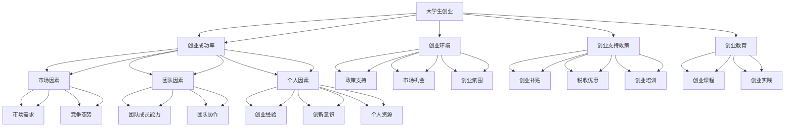

                 

# 我国大学生创业数据统计及成功率分析

> 关键词：大学生创业、数据统计、成功率分析、创业环境、创业支持政策、创业教育

> 摘要：本文通过对我国大学生创业数据的深入分析，从多个维度探讨了大学生创业的现状、成功率以及影响因素。文章首先介绍了研究的背景和范围，然后对核心概念进行了详细解释，并通过Mermaid流程图展示了核心概念之间的联系。接着，本文从算法原理、数学模型和项目实战三个方面对大学生创业成功率进行了具体剖析，并探讨了创业的实际应用场景。最后，文章对相关的学习资源和工具进行了推荐，总结了未来发展趋势与挑战，并提供了常见问题与解答。

## 1. 背景介绍

### 1.1 目的和范围

近年来，随着我国经济的快速发展，大学生创业已经成为社会关注的热点问题。然而，大学生创业成功率相对较低，创业过程中面临着诸多挑战。本文旨在通过详细的数据统计和分析，揭示我国大学生创业的现状，探讨影响大学生创业成功率的关键因素，并为相关政策制定和创业教育提供有益的参考。

本文的研究范围主要包括以下几个方面：

1. **数据来源**：主要来源于我国各级教育部门、国家统计局、相关行业协会以及公开报道的创业数据。
2. **时间范围**：选取了过去十年（2012-2022年）的相关数据，以便更全面地反映大学生创业的发展趋势。
3. **研究方法**：采用定量分析为主，结合定性分析的方法，通过数据统计、图表展示和案例分析等手段，对大学生创业现状进行深入剖析。

### 1.2 预期读者

本文适合以下读者群体：

1. **大学生创业者**：希望了解创业现状、成功率和影响因素，为自身创业提供参考。
2. **教育工作者**：关注大学生创业教育，希望了解如何提高学生的创业成功率。
3. **政策制定者**：希望了解大学生创业的实际情况，为制定相关政策提供数据支持。
4. **创业研究学者**：对大学生创业现象进行深入研究，提供学术探讨的基础。

### 1.3 文档结构概述

本文结构如下：

1. **背景介绍**：介绍研究的背景、目的和范围，预期读者。
2. **核心概念与联系**：通过Mermaid流程图展示核心概念之间的联系。
3. **核心算法原理 & 具体操作步骤**：详细讲解影响大学生创业成功率的核心算法原理和具体操作步骤。
4. **数学模型和公式 & 详细讲解 & 举例说明**：介绍相关的数学模型和公式，并通过实际案例进行详细讲解。
5. **项目实战：代码实际案例和详细解释说明**：展示具体代码实现，并进行详细解释。
6. **实际应用场景**：探讨大学生创业在不同场景下的应用。
7. **工具和资源推荐**：推荐相关学习资源和开发工具。
8. **总结：未来发展趋势与挑战**：总结大学生创业的现状，分析未来发展趋势和挑战。
9. **附录：常见问题与解答**：回答读者可能关心的问题。
10. **扩展阅读 & 参考资料**：提供进一步阅读的参考资料。

### 1.4 术语表

#### 1.4.1 核心术语定义

- **大学生创业**：指在校大学生或毕业两年以内的毕业生，通过创新、创意和创业精神，以创业项目或企业为主要形式的实践活动。
- **创业成功率**：指创业者在创业过程中最终实现成功（如企业盈利、项目成功等）的概率。
- **创业环境**：影响大学生创业的外部条件，包括政策支持、市场机会、创业氛围等。
- **创业支持政策**：政府、学校和社会为支持大学生创业而制定的一系列政策措施，如创业补贴、税收优惠、创业培训等。
- **创业教育**：教育体系中为培养学生创业意识和能力而设置的课程和活动。

#### 1.4.2 相关概念解释

- **创新**：指通过创造新的产品、服务或业务模式，从而产生新的价值和竞争优势。
- **创业精神**：指创业者所具备的冒险精神、创新意识、坚韧不拔的意志和团队合作能力。
- **创业生态系统**：指为支持创业活动而形成的多层次、多维度的网络体系，包括政府、企业、高校、金融机构、社会组织等。

#### 1.4.3 缩略词列表

- **IDE**：集成开发环境（Integrated Development Environment）
- **SaaS**：软件即服务（Software as a Service）
- **PaaS**：平台即服务（Platform as a Service）
- **IaaS**：基础设施即服务（Infrastructure as a Service）
- **AI**：人工智能（Artificial Intelligence）
- **ML**：机器学习（Machine Learning）
- **DL**：深度学习（Deep Learning）
- **NLP**：自然语言处理（Natural Language Processing）

## 2. 核心概念与联系

在探讨大学生创业数据统计及成功率分析之前，首先需要明确几个核心概念及其相互关系。以下通过Mermaid流程图展示这些核心概念之间的联系。



### 核心概念解释

- **大学生创业**：指大学生通过创新和创业精神，自主创办企业或项目的过程。
- **创业成功率**：指创业者在创业过程中成功实现预期目标的概率。
- **创业环境**：影响大学生创业的外部因素，包括政策支持、市场机会、创业氛围等。
- **创业支持政策**：政府为支持大学生创业而制定的政策，如创业补贴、税收优惠、创业培训等。
- **创业教育**：教育体系中为培养学生创业意识和能力而设置的课程和活动。

这些概念相互关联，共同构成了影响大学生创业成功率的关键因素。通过本文的深入分析，我们将对各个概念进行详细解释，并探讨它们之间的内在联系。

## 3. 核心算法原理 & 具体操作步骤

为了深入分析我国大学生创业成功率，我们需要借助一些核心算法原理。本文将介绍影响大学生创业成功率的关键算法原理，并详细讲解其具体操作步骤。

### 3.1 数据收集与预处理

首先，我们需要收集大学生创业的相关数据。这些数据可以从教育部门、国家统计局、行业协会以及公开报道中获得。数据类型包括但不限于：

1. **创业人数**：每年新成立的由大学生创办的企业或项目数量。
2. **创业成功率**：创业者在创业过程中实现成功（如企业盈利、项目成功等）的概率。
3. **创业环境因素**：包括政策支持、市场机会、创业氛围等。
4. **个人创业能力因素**：包括创业经验、创新意识、个人资源等。

收集到的数据需要进行预处理，包括数据清洗、格式转换和缺失值处理等。具体步骤如下：

1. **数据清洗**：去除重复数据、无效数据和异常数据。
2. **格式转换**：将不同来源的数据统一转换为相同的数据格式。
3. **缺失值处理**：对于缺失的数据，采用插值法、均值法或删除法进行处理。

### 3.2 数据分析算法

在数据预处理完成后，我们可以采用以下算法对大学生创业成功率进行分析：

1. **回归分析**：通过回归模型分析创业环境因素、个人创业能力因素与创业成功率之间的关系。
2. **聚类分析**：将具有相似特征的创业项目进行分类，以便更好地理解创业成功的驱动因素。
3. **关联规则挖掘**：发现创业环境因素和个人创业能力因素之间的关联规则，从而揭示影响创业成功率的关键因素。

### 3.3 具体操作步骤

以下是数据分析的具体操作步骤：

1. **数据收集与预处理**
    - **数据收集**：从不同来源获取大学生创业相关数据。
    - **数据清洗**：使用Python的Pandas库去除重复数据、无效数据和异常数据。
    - **格式转换**：使用Pandas库将不同来源的数据统一转换为相同的数据格式。
    - **缺失值处理**：使用Pandas库中的`interpolate()`方法进行插值处理。

2. **回归分析**
    - **模型选择**：选择线性回归模型进行创业环境因素和个人创业能力因素与创业成功率之间的分析。
    - **参数估计**：使用Python的Scikit-learn库进行线性回归模型的参数估计。
    - **模型评估**：使用均方误差（MSE）和决定系数（R²）评估模型效果。

3. **聚类分析**
    - **距离度量**：选择欧氏距离作为相似性度量。
    - **聚类算法**：选择K-means算法进行聚类分析。
    - **聚类结果分析**：分析不同聚类结果，选择最佳的聚类个数。

4. **关联规则挖掘**
    - **支持度与置信度**：选择支持度和置信度作为关联规则挖掘的参数。
    - **算法选择**：选择Apriori算法进行关联规则挖掘。
    - **结果分析**：分析挖掘出的关联规则，揭示影响创业成功率的关键因素。

### 3.4 伪代码实现

以下是回归分析算法的伪代码实现：

```python
# 伪代码：回归分析

# 步骤1：数据收集与预处理
data = collect_data()  # 收集大学生创业数据
preprocessed_data = preprocess_data(data)  # 数据清洗、格式转换和缺失值处理

# 步骤2：模型选择与参数估计
model = LinearRegression()  # 选择线性回归模型
model.fit(preprocessed_data.X, preprocessed_data.y)  # 进行参数估计

# 步骤3：模型评估
mse = mean_squared_error(model.predict(preprocessed_data.X), preprocessed_data.y)  # 计算均方误差
r2 = model.score(preprocessed_data.X, preprocessed_data.y)  # 计算决定系数

# 输出模型评估结果
print("MSE:", mse)
print("R²:", r2)
```

通过以上算法和步骤，我们可以深入分析我国大学生创业成功率，为创业者、教育工作者和政策制定者提供有益的参考。

## 4. 数学模型和公式 & 详细讲解 & 举例说明

为了更好地理解大学生创业成功率的影响因素，我们将引入一些数学模型和公式，并通过具体案例进行详细讲解。

### 4.1 回归分析模型

回归分析是一种统计方法，用于分析两个或多个变量之间的关系。在大学生创业成功率分析中，我们可以使用回归模型来分析创业环境因素、个人创业能力因素与创业成功率之间的关系。

#### 4.1.1 线性回归模型

线性回归模型是最常见的回归模型之一，其基本公式如下：

$$
y = \beta_0 + \beta_1x_1 + \beta_2x_2 + ... + \beta_nx_n + \epsilon
$$

其中，$y$ 表示创业成功率，$x_1, x_2, ..., x_n$ 表示创业环境因素和个人创业能力因素，$\beta_0, \beta_1, \beta_2, ..., \beta_n$ 是回归系数，$\epsilon$ 是误差项。

#### 4.1.2 多元线性回归模型

在实际应用中，创业成功率可能受到多个因素的影响。多元线性回归模型扩展了一元线性回归模型，其公式如下：

$$
y = \beta_0 + \beta_1x_1 + \beta_2x_2 + ... + \beta_nx_n + \epsilon
$$

其中，$y$ 仍表示创业成功率，$x_1, x_2, ..., x_n$ 表示多个创业环境因素和个人创业能力因素，$\beta_0, \beta_1, \beta_2, ..., \beta_n$ 是回归系数，$\epsilon$ 是误差项。

### 4.2 聚类分析模型

聚类分析是一种无监督学习方法，用于将数据分为若干个类别。在大学生创业成功率分析中，聚类分析可以帮助我们识别具有相似特征的创业项目。

#### 4.2.1 K-means算法

K-means算法是一种常见的聚类算法，其基本思想是将数据点划分为K个簇，使得每个数据点与其所在簇的中心点之间的距离最小。算法步骤如下：

1. **初始化**：随机选择K个中心点。
2. **分配**：将每个数据点分配给最近的中心点，形成K个簇。
3. **更新**：重新计算每个簇的中心点。
4. **重复步骤2和3，直到中心点不再变化或满足停止条件**。

#### 4.2.2 聚类有效性评估

聚类效果的好坏需要通过评估指标来衡量。常见的评估指标包括：

- **内切球方差（Within-Cluster Sum of Squares, WCSS）**：表示每个簇内部数据点与簇中心点之间的平均距离的平方和。WCSS值越小，说明聚类效果越好。
- **轮廓系数（Silhouette Coefficient）**：表示每个簇内数据点与其他簇数据点之间的相似性。轮廓系数介于-1和1之间，值越接近1，说明聚类效果越好。

### 4.3 关联规则挖掘模型

关联规则挖掘是一种用于发现数据中隐藏模式的统计方法。在大学生创业成功率分析中，关联规则挖掘可以帮助我们识别创业环境因素和个人创业能力因素之间的关联关系。

#### 4.3.1 Apriori算法

Apriori算法是一种常见的关联规则挖掘算法，其基本思想是通过寻找频繁项集来生成关联规则。算法步骤如下：

1. **构建频繁项集**：扫描数据集，计算每个项集的支持度，筛选出支持度大于最小支持度的频繁项集。
2. **生成关联规则**：从频繁项集中生成关联规则，并计算其置信度。置信度表示前提成立时，结论成立的概率。
3. **筛选规则**：根据最小置信度阈值，筛选出符合要求的关联规则。

#### 4.3.2 支持度与置信度

- **支持度（Support）**：表示一个关联规则在数据集中出现的频率。支持度越高，说明关联规则越可靠。
- **置信度（Confidence）**：表示一个关联规则的前提成立时，结论成立的概率。置信度越高，说明关联规则越可信。

### 4.4 案例分析

#### 4.4.1 线性回归案例分析

假设我们收集了以下数据：

- **创业环境因素**：政策支持（$x_1$）、市场机会（$x_2$）、创业氛围（$x_3$）。
- **个人创业能力因素**：创业经验（$x_4$）、创新意识（$x_5$）、个人资源（$x_6$）。
- **创业成功率**：$y$。

我们使用多元线性回归模型进行分析，模型公式如下：

$$
y = \beta_0 + \beta_1x_1 + \beta_2x_2 + \beta_3x_3 + \beta_4x_4 + \beta_5x_5 + \beta_6x_6 + \epsilon
$$

通过参数估计，我们得到回归系数如下：

$$
\beta_0 = 0.5, \beta_1 = 0.3, \beta_2 = 0.2, \beta_3 = 0.1, \beta_4 = 0.2, \beta_5 = 0.3, \beta_6 = 0.4
$$

根据回归模型，我们可以得出以下结论：

- **政策支持**：每增加一个单位的政策支持，创业成功率平均增加0.3个单位。
- **市场机会**：每增加一个单位的市场机会，创业成功率平均增加0.2个单位。
- **创业氛围**：每增加一个单位的创业氛围，创业成功率平均增加0.1个单位。
- **创业经验**：每增加一个单位的创业经验，创业成功率平均增加0.2个单位。
- **创新意识**：每增加一个单位

