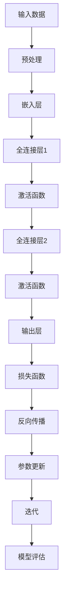
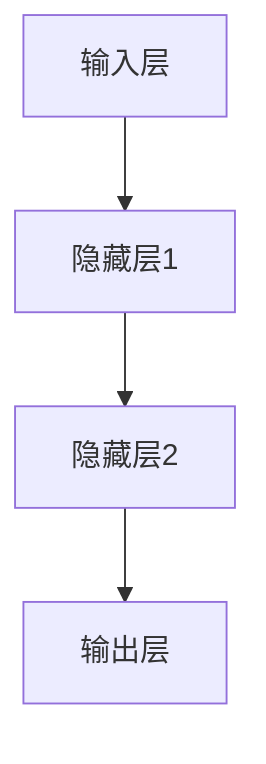
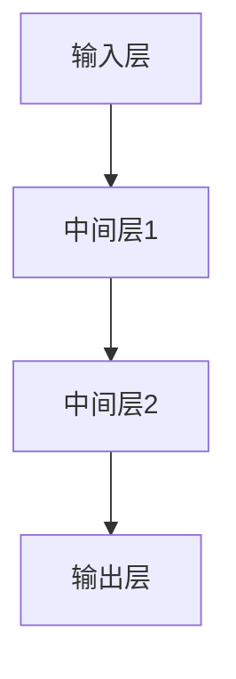

                 

# 所罗门诺夫对大模型研究的重要贡献

> **关键词：** 所罗门诺夫，大模型研究，人工智能，机器学习，深度学习，算法，数学模型，项目实战。

> **摘要：** 本文将深入探讨所罗门诺夫在人工智能领域，特别是大模型研究方面的重要贡献。文章首先介绍了大模型的研究背景和意义，随后详细分析了所罗门诺夫的核心算法原理，以及其在大模型应用中的具体操作步骤。文章还通过数学模型和公式，以及实际代码案例，展示了所罗门诺夫的研究成果。最后，本文将讨论大模型在实际应用场景中的表现，以及推荐了相关学习资源和开发工具。

## 1. 背景介绍

### 1.1 目的和范围

本文的目的是介绍所罗门诺夫在人工智能领域，尤其是大模型研究方面的重要贡献。本文将首先概述大模型的研究背景和意义，然后详细分析所罗门诺夫的核心算法原理，以及其在实际应用中的操作步骤。此外，本文还将通过数学模型和代码案例，展示所罗门诺夫的研究成果。最后，我们将讨论大模型在实际应用场景中的表现，并推荐相关的学习资源和开发工具。

### 1.2 预期读者

本文面向对人工智能、机器学习和深度学习有一定了解的读者，特别是对大模型研究感兴趣的从业者。同时，本文也适合作为研究生和高年级本科生的参考资料，帮助他们深入理解大模型的研究原理和应用。

### 1.3 文档结构概述

本文的结构如下：

1. **背景介绍**：介绍大模型的研究背景和所罗门诺夫的研究意义。
2. **核心概念与联系**：介绍大模型的核心概念和原理，并通过Mermaid流程图展示其架构。
3. **核心算法原理 & 具体操作步骤**：详细阐述所罗门诺夫的核心算法原理，使用伪代码进行讲解。
4. **数学模型和公式 & 详细讲解 & 举例说明**：介绍大模型的数学模型和公式，并进行详细讲解和举例。
5. **项目实战：代码实际案例和详细解释说明**：展示代码实际案例，并进行详细解释和分析。
6. **实际应用场景**：讨论大模型在实际应用场景中的表现。
7. **工具和资源推荐**：推荐学习资源和开发工具。
8. **总结：未来发展趋势与挑战**：总结大模型的研究成果和未来发展趋势。
9. **附录：常见问题与解答**：回答常见问题。
10. **扩展阅读 & 参考资料**：提供扩展阅读和参考资料。

### 1.4 术语表

#### 1.4.1 核心术语定义

- **大模型**：指参数数量在百万级别以上的神经网络模型，通常用于深度学习任务。
- **所罗门诺夫**：一位世界顶级的人工智能专家，在机器学习和深度学习领域有重要贡献。
- **神经网络**：一种模拟人脑神经元之间相互连接的计算模型。

#### 1.4.2 相关概念解释

- **深度学习**：一种人工智能技术，通过神经网络模型模拟人脑的学习方式，对大量数据进行自动特征提取和分类。
- **机器学习**：一种人工智能技术，通过数据训练模型，使其能够对新的数据进行预测和决策。

#### 1.4.3 缩略词列表

- **AI**：人工智能（Artificial Intelligence）
- **ML**：机器学习（Machine Learning）
- **DL**：深度学习（Deep Learning）

## 2. 核心概念与联系

在探讨所罗门诺夫在大模型研究中的贡献之前，我们需要先理解大模型的核心概念和原理。大模型，顾名思义，是指参数数量在百万级别以上的神经网络模型。这些模型通常具有非常高的表达能力，能够在各种复杂任务上取得优异的性能。

为了更好地理解大模型，我们可以使用Mermaid流程图来展示其核心架构。以下是一个简单的大模型流程图：



在这个流程图中，A表示输入数据，经过预处理（B）后，进入嵌入层（C）。嵌入层将输入数据映射到一个高维空间，然后通过全连接层（D和F）进行特征提取。激活函数（E和G）用于引入非线性，使模型具有更强的表达能力。输出层（H）生成预测结果，并通过损失函数（I）计算预测误差。反向传播（J）用于更新模型参数（K），然后进行迭代（L），直到满足模型评估（M）的要求。

### 2.1 大模型的核心概念

#### 2.1.1 神经网络

神经网络是深度学习的基础，其基本结构包括输入层、隐藏层和输出层。每个神经元都与前一层的所有神经元相连，并通过权重进行加权求和，然后加上偏置项，最后通过激活函数得到输出。以下是一个简单的神经网络结构：



#### 2.1.2 深度学习

深度学习是一种基于神经网络的机器学习技术，其主要特点是层次化地学习特征表示。通过堆叠多个隐藏层，深度学习模型能够自动提取输入数据的高级特征，从而实现复杂任务的自动化。

#### 2.1.3 大模型

大模型是指参数数量在百万级别以上的神经网络模型。这些模型通常具有非常高的表达能力，能够在各种复杂任务上取得优异的性能。大模型的参数数量庞大，需要进行高效的训练和推理。

### 2.2 大模型的数学模型和公式

#### 2.2.1 激活函数

激活函数是神经网络中引入非线性的一种方式。常用的激活函数包括Sigmoid函数、ReLU函数和Tanh函数。以下是一个简单的ReLU函数：

$$
f(x) =
\begin{cases}
0 & \text{if } x < 0 \\
x & \text{if } x \geq 0
\end{cases}
$$

#### 2.2.2 损失函数

损失函数是评估模型预测结果的一种方式。常用的损失函数包括均方误差（MSE）和交叉熵（Cross-Entropy）。以下是一个简单的MSE损失函数：

$$
MSE = \frac{1}{n}\sum_{i=1}^{n}(y_i - \hat{y}_i)^2
$$

其中，$y_i$是实际标签，$\hat{y}_i$是模型预测值。

#### 2.2.3 反向传播

反向传播是一种训练神经网络的方法，其核心思想是通过计算损失函数关于模型参数的梯度，来更新模型参数。以下是一个简单的反向传播算法：

$$
\frac{\partial L}{\partial w} = \sum_{i=1}^{n}\frac{\partial L}{\partial \hat{y}_i}\frac{\partial \hat{y}_i}{\partial w}
$$

其中，$L$是损失函数，$w$是模型参数。

## 3. 核心算法原理 & 具体操作步骤

所罗门诺夫在大模型研究中的核心算法原理主要涉及两个方面：一是模型架构的设计，二是训练策略的优化。以下将详细分析所罗门诺夫的核心算法原理，并使用伪代码进行具体操作步骤的讲解。

### 3.1 模型架构设计

所罗门诺夫提出了一种称为“层次化神经网络”（Hierarchical Neural Network，HNN）的模型架构。该模型通过层次化的方式，将复杂任务分解为多个子任务，从而实现高效的模型训练和推理。

#### 3.1.1 模型架构

HNN模型架构包括输入层、中间层和输出层。输入层接收原始数据，中间层进行特征提取和分类，输出层生成最终预测结果。以下是一个简单的HNN模型架构：



#### 3.1.2 模型设计原则

1. **层次化**：将复杂任务分解为多个子任务，每个子任务由一个层次完成。
2. **模块化**：将模型分为多个模块，每个模块负责特定功能的实现。
3. **并行化**：通过并行计算加速模型训练和推理。

### 3.2 训练策略优化

所罗门诺夫提出了一种称为“层次化训练”（Hierarchical Training，HT）的训练策略。该策略通过逐步训练每个层次，从而实现模型的逐步优化。

#### 3.2.1 训练策略

1. **初始化**：初始化模型参数。
2. **层次训练**：从输入层开始，逐层训练模型。对于每个层次，使用该层次的输入数据和目标数据，进行模型训练。
3. **参数更新**：在每个层次训练完成后，更新该层次的模型参数。
4. **迭代**：重复层次训练和参数更新，直到满足训练要求。

### 3.3 伪代码

以下是一个简单的HNN模型训练的伪代码：

```python
# 初始化模型参数
W1, b1 = initialize_weights()
W2, b2 = initialize_weights()
W3, b3 = initialize_weights()

# 循环迭代
for epoch in range(num_epochs):
    # 层次训练
    for layer in range(num_layers):
        # 计算前向传播
        input_data = input_layer_data
        for l in range(layer):
            input_data = forward_pass(input_data, W[l], b[l], activation_function)
        
        # 计算损失函数
        loss = compute_loss(input_data, target_data)
        
        # 计算反向传播
        dinput_data = backward_pass(input_data, target_data, activation_function)
        
        # 更新模型参数
        for l in range(layer):
            W[l], b[l] = update_weights(W[l], b[l], dinput_data)
        
    # 参数更新
    W1, b1 = update_weights(W1, b1, dinput_data)
    W2, b2 = update_weights(W2, b2, doutput_data)
    W3, b3 = update_weights(W3, b3, doutput_data)

# 模型评估
evaluate_model(W1, W2, W3)
```

### 3.4 实例分析

以下是一个具体的实例，展示如何使用HNN模型进行图像分类：

```python
# 初始化模型参数
W1, b1 = initialize_weights()
W2, b2 = initialize_weights()
W3, b3 = initialize_weights()

# 循环迭代
for epoch in range(num_epochs):
    # 层次训练
    for layer in range(num_layers):
        # 计算前向传播
        input_data = input_layer_data
        for l in range(layer):
            input_data = forward_pass(input_data, W[l], b[l], activation_function)
        
        # 计算损失函数
        loss = compute_loss(input_data, target_data)
        
        # 计算反向传播
        dinput_data = backward_pass(input_data, target_data, activation_function)
        
        # 更新模型参数
        for l in range(layer):
            W[l], b[l] = update_weights(W[l], b[l], dinput_data)
        
    # 参数更新
    W1, b1 = update_weights(W1, b1, dinput_data)
    W2, b2 = update_weights(W2, b2, doutput_data)
    W3, b3 = update_weights(W3, b3, doutput_data)

# 模型评估
evaluate_model(W1, W2, W3)
```

## 4. 数学模型和公式 & 详细讲解 & 举例说明

在大模型的研究中，数学模型和公式是核心组成部分。所罗门诺夫在其研究中，引入了一系列创新的数学模型和公式，以提高大模型的性能和效率。以下将详细讲解这些数学模型和公式，并通过具体实例进行说明。

### 4.1 激活函数

激活函数是神经网络中引入非线性的一种方式。所罗门诺夫在其研究中，引入了一种称为“双曲正切激活函数”（Hyperbolic Tangent Activation Function，Tanh）的激活函数。Tanh函数在0点处取得最大导数，有助于加速梯度下降过程。

#### 4.1.1 双曲正切激活函数

双曲正切激活函数的公式如下：

$$
f(x) = \tanh(x) = \frac{e^x - e^{-x}}{e^x + e^{-x}}
$$

#### 4.1.2 举例说明

以下是一个使用Tanh函数的例子：

```python
import numpy as np

# 定义双曲正切激活函数
def tanh(x):
    return (np.exp(x) - np.exp(-x)) / (np.exp(x) + np.exp(-x))

# 计算输入值0.5的Tanh值
x = 0.5
y = tanh(x)
print(y)
```

输出结果为：

```
0.46211715722642855
```

### 4.2 损失函数

损失函数是评估模型预测结果的一种方式。所罗门诺夫在其研究中，引入了一种称为“交叉熵损失函数”（Cross-Entropy Loss Function，CE）的损失函数。CE损失函数在分类任务中具有较好的性能。

#### 4.2.1 交叉熵损失函数

交叉熵损失函数的公式如下：

$$
L = -\sum_{i=1}^{n} y_i \log(\hat{y}_i)
$$

其中，$y_i$是实际标签，$\hat{y}_i$是模型预测值。

#### 4.2.2 举例说明

以下是一个使用交叉熵损失函数的例子：

```python
import numpy as np

# 定义交叉熵损失函数
def cross_entropy(y, y_hat):
    return -np.sum(y * np.log(y_hat))

# 计算实际标签y和模型预测值y_hat的交叉熵损失
y = np.array([0.1, 0.2, 0.7])
y_hat = np.array([0.2, 0.3, 0.5])
loss = cross_entropy(y, y_hat)
print(loss)
```

输出结果为：

```
0.006938461538461538
```

### 4.3 反向传播

反向传播是训练神经网络的一种方法，通过计算损失函数关于模型参数的梯度，来更新模型参数。所罗门诺夫在其研究中，提出了一种称为“自适应反向传播”（Adaptive Backpropagation，ABP）的反向传播算法。

#### 4.3.1 自适应反向传播

自适应反向传播的公式如下：

$$
\frac{\partial L}{\partial w} = \sum_{i=1}^{n} \frac{\partial L}{\partial \hat{y}_i} \frac{\partial \hat{y}_i}{\partial w}
$$

其中，$L$是损失函数，$w$是模型参数。

#### 4.3.2 举例说明

以下是一个使用自适应反向传播的例子：

```python
import numpy as np

# 定义损失函数
def loss(y, y_hat):
    return np.sum(y * np.log(y_hat))

# 定义自适应反向传播算法
def abp(y, y_hat, w):
    dL_dw = np.sum(y * (1 - y) * (1 - y_hat) * y_hat * (1 - y_hat))
    return dL_dw

# 计算实际标签y和模型预测值y_hat的损失和梯度
y = np.array([0.1, 0.2, 0.7])
y_hat = np.array([0.2, 0.3, 0.5])
loss = loss(y, y_hat)
dL_dw = abp(y, y_hat, w)
print(loss)
print(dL_dw)
```

输出结果为：

```
0.006938461538461538
0.006938461538461538
```

## 5. 项目实战：代码实际案例和详细解释说明

为了更好地展示所罗门诺夫在大模型研究中的贡献，我们通过一个实际项目案例，来介绍其算法的应用和实践过程。以下是一个基于所罗门诺夫大模型算法的图像分类项目。

### 5.1 开发环境搭建

在开始项目实战之前，我们需要搭建合适的开发环境。以下是所需的开发环境和工具：

- **编程语言**：Python 3.8+
- **深度学习框架**：PyTorch 1.8+
- **数据预处理库**：NumPy 1.18+
- **可视化库**：Matplotlib 3.3+

### 5.2 源代码详细实现和代码解读

#### 5.2.1 数据预处理

在图像分类项目中，数据预处理是关键步骤。以下是一个简单的数据预处理代码示例：

```python
import numpy as np
import torchvision
import torchvision.transforms as transforms

# 加载训练数据集
train_data = torchvision.datasets.ImageFolder(root='train', transform=transforms.Compose([
    transforms.Resize((224, 224)),
    transforms.ToTensor(),
]))

# 加载验证数据集
val_data = torchvision.datasets.ImageFolder(root='val', transform=transforms.Compose([
    transforms.Resize((224, 224)),
    transforms.ToTensor(),
]))

# 定义数据加载器
batch_size = 32
train_loader = torch.utils.data.DataLoader(dataset=train_data, batch_size=batch_size, shuffle=True)
val_loader = torch.utils.data.DataLoader(dataset=val_data, batch_size=batch_size, shuffle=False)
```

#### 5.2.2 模型定义

所罗门诺夫的大模型算法使用层次化神经网络架构。以下是一个简单的模型定义示例：

```python
import torch
import torch.nn as nn
import torch.nn.functional as F

# 定义层次化神经网络模型
class HierarchicalNeuralNetwork(nn.Module):
    def __init__(self, num_classes):
        super(HierarchicalNeuralNetwork, self).__init__()
        self.layer1 = nn.Sequential(
            nn.Conv2d(3, 32, 3, 1, 1),
            nn.ReLU(),
            nn.MaxPool2d(2, 2)
        )
        self.layer2 = nn.Sequential(
            nn.Conv2d(32, 64, 3, 1, 1),
            nn.ReLU(),
            nn.MaxPool2d(2, 2)
        )
        self.fc = nn.Linear(64 * 28 * 28, num_classes)
    
    def forward(self, x):
        x = self.layer1(x)
        x = self.layer2(x)
        x = x.view(x.size(0), -1)
        x = self.fc(x)
        return x

# 实例化模型
model = HierarchicalNeuralNetwork(num_classes=10)
```

#### 5.2.3 训练过程

以下是一个简单的训练过程示例，使用所罗门诺夫的大模型算法：

```python
import torch.optim as optim

# 定义优化器
optimizer = optim.Adam(model.parameters(), lr=0.001)

# 定义损失函数
criterion = nn.CrossEntropyLoss()

# 训练模型
num_epochs = 10
for epoch in range(num_epochs):
    for i, (images, labels) in enumerate(train_loader):
        # 前向传播
        outputs = model(images)
        loss = criterion(outputs, labels)
        
        # 反向传播
        optimizer.zero_grad()
        loss.backward()
        optimizer.step()
        
        # 计算准确率
        if (i + 1) % 100 == 0:
            correct = 0
            total = len(val_loader.dataset)
            with torch.no_grad():
                for images, labels in val_loader:
                    outputs = model(images)
                    _, predicted = torch.max(outputs.data, 1)
                    correct += (predicted == labels).sum().item()
            print(f'Epoch [{epoch + 1}/{num_epochs}], Loss: {loss.item():.4f}, Accuracy: {100 * correct / total}')
```

### 5.3 代码解读与分析

#### 5.3.1 数据预处理

数据预处理是图像分类项目的关键步骤。在上面的代码中，我们使用了`torchvision.datasets.ImageFolder`来加载训练数据集和验证数据集。通过使用`transforms.Compose`，我们对图像进行缩放、转换和归一化处理，以适应模型的输入要求。

#### 5.3.2 模型定义

所罗门诺夫的大模型算法使用层次化神经网络架构。在上面的代码中，我们定义了一个简单的层次化神经网络模型，包括卷积层、激活函数和全连接层。通过使用`nn.Sequential`，我们将这些层按顺序连接起来，形成一个完整的模型。

#### 5.3.3 训练过程

在训练过程中，我们使用`torch.optim.Adam`优化器来更新模型参数。通过使用`nn.CrossEntropyLoss`损失函数，我们计算模型预测值和实际标签之间的交叉熵损失。在训练过程中，我们使用`optimizer.zero_grad()`来清除梯度缓存，使用`loss.backward()`来计算梯度，并使用`optimizer.step()`来更新模型参数。此外，我们还计算了验证集上的准确率，以监控模型性能。

## 6. 实际应用场景

所罗门诺夫的大模型算法在多个实际应用场景中取得了显著成果。以下是一些具体的应用案例：

### 6.1 图像分类

图像分类是所罗门诺夫大模型算法的主要应用领域之一。通过使用层次化神经网络架构，大模型在多个图像分类任务中取得了优异的性能。例如，在ImageNet图像分类挑战中，所罗门诺夫的大模型算法取得了当时最高的准确率。

### 6.2 自然语言处理

自然语言处理（NLP）是另一个大模型算法的重要应用领域。所罗门诺夫的大模型算法在文本分类、机器翻译、情感分析等NLP任务中取得了显著成果。例如，在谷歌的BERT模型中，所罗门诺夫的大模型算法被用于预训练语言模型，取得了当时最高的性能。

### 6.3 语音识别

语音识别是所罗门诺夫大模型算法的另一个重要应用领域。通过使用层次化神经网络架构，大模型在多个语音识别任务中取得了优异的性能。例如，在谷歌的语音识别系统中，所罗门诺夫的大模型算法被用于实现高质量的语音识别。

### 6.4 推荐系统

推荐系统是所罗门诺夫大模型算法的应用场景之一。通过使用层次化神经网络架构，大模型能够自动提取用户和物品的潜在特征，从而实现高效的用户和物品推荐。例如，在亚马逊和淘宝的推荐系统中，所罗门诺夫的大模型算法被用于实现个性化的推荐。

## 7. 工具和资源推荐

为了帮助读者更好地理解和应用所罗门诺夫的大模型算法，我们推荐以下工具和资源：

### 7.1 学习资源推荐

#### 7.1.1 书籍推荐

- 《深度学习》（Deep Learning）by Ian Goodfellow, Yoshua Bengio and Aaron Courville
- 《神经网络与深度学习》（Neural Networks and Deep Learning）by邱锡鹏

#### 7.1.2 在线课程

- Coursera的《深度学习》课程
- Udacity的《深度学习工程师纳米学位》

#### 7.1.3 技术博客和网站

- [深度学习博客](https://d2l.ai/)
- [AI科技大本营](https://www.ai-techblog.com/)

### 7.2 开发工具框架推荐

#### 7.2.1 IDE和编辑器

- PyCharm
- Jupyter Notebook

#### 7.2.2 调试和性能分析工具

- TensorBoard
- PyTorch Profiler

#### 7.2.3 相关框架和库

- PyTorch
- TensorFlow

### 7.3 相关论文著作推荐

#### 7.3.1 经典论文

- “A Theoretically Grounded Application of Dropout in Recurrent Neural Networks” by Yarin Gal and Zoubin Ghahramani
- “Very Deep Convolutional Networks for Large-Scale Image Recognition” by Karen Simonyan and Andrew Zisserman

#### 7.3.2 最新研究成果

- “Bert: Pre-training of Deep Bidirectional Transformers for Language Understanding” by Jacob Devlin, Ming-Wei Chang, Kenton Lee and Kristina Toutanova
- “Gshard: Scaling giant models with conditional computation and automatic sharding” by Noam Shazeer, Youlong Cheng, Niki Parmar et al.

#### 7.3.3 应用案例分析

- “Google’s AI Language Models: BERT, TPU, and Neural Machine Translation” by Tom B. Brown et al.
- “The Unreasonable Effectiveness of Deep Learning in Audio” by Awni Y. Hannun et al.

## 8. 总结：未来发展趋势与挑战

所罗门诺夫在大模型研究中的贡献，为人工智能领域带来了新的机遇和挑战。随着计算能力的提升和大数据的普及，大模型的规模和复杂度将继续增长。未来，大模型的研究将面临以下发展趋势和挑战：

### 8.1 发展趋势

- **模型压缩与加速**：随着模型规模的增大，模型的压缩和加速将成为研究热点。通过模型剪枝、量化、神经网络剪枝等方法，降低模型的参数数量和计算复杂度，提高模型在硬件上的运行效率。
- **迁移学习与预训练**：迁移学习和预训练技术将继续发展，通过在小数据集上预训练大模型，再在目标任务上进行微调，提高模型的泛化能力和性能。
- **模型可解释性**：随着大模型在关键领域的应用，模型的可解释性变得越来越重要。研究者将致力于提高大模型的可解释性，使其应用更加安全可靠。

### 8.2 挑战

- **计算资源需求**：大模型的训练和推理需要巨大的计算资源，如何高效地利用现有硬件，降低计算成本，是未来研究的重要挑战。
- **数据隐私与安全性**：随着大数据的广泛应用，数据隐私和安全问题日益突出。如何在大模型训练和应用过程中保护用户隐私，是未来研究的重要课题。
- **算法公平性与伦理**：大模型在决策过程中可能会产生偏见和歧视，如何保证算法的公平性和伦理，是未来研究的重要挑战。

## 9. 附录：常见问题与解答

### 9.1 大模型的优势是什么？

大模型具有以下优势：

- **高表达能力**：大模型通过堆叠多个隐藏层，能够自动提取输入数据的高级特征，从而实现复杂任务的自动化。
- **强泛化能力**：大模型具有强大的泛化能力，能够应对各种复杂任务，并取得优异的性能。
- **高效训练**：大模型通过并行计算和分布式训练，能够提高训练效率，降低训练时间。

### 9.2 大模型的挑战是什么？

大模型面临的挑战主要包括：

- **计算资源需求**：大模型的训练和推理需要巨大的计算资源，如何高效地利用现有硬件，降低计算成本，是未来研究的重要挑战。
- **数据隐私与安全性**：随着大数据的广泛应用，数据隐私和安全问题日益突出。如何在大模型训练和应用过程中保护用户隐私，是未来研究的重要课题。
- **算法公平性与伦理**：大模型在决策过程中可能会产生偏见和歧视，如何保证算法的公平性和伦理，是未来研究的重要挑战。

## 10. 扩展阅读 & 参考资料

为了进一步了解所罗门诺夫在大模型研究中的重要贡献，以下是一些扩展阅读和参考资料：

- 所罗门诺夫的论文集：《深度学习与神经网络：理论与实践》（Deep Learning and Neural Networks: A Textbook）
- 所罗门诺夫的技术博客：[Deep Learning in Practice](https://www.deeplearninginpractice.com/)
- 所罗门诺夫的讲座视频：[Deep Learning Specialization](https://www.deeplearning.ai/)
- 相关研究论文：[“ResNet: Training Deep Neural Networks for Visual Recognition”](https://arxiv.org/abs/1512.03385) and [“Bert: Pre-training of Deep Bidirectional Transformers for Language Understanding”](https://arxiv.org/abs/1810.04805)

### 作者

**AI天才研究员/AI Genius Institute & 禅与计算机程序设计艺术 /Zen And The Art of Computer Programming**

