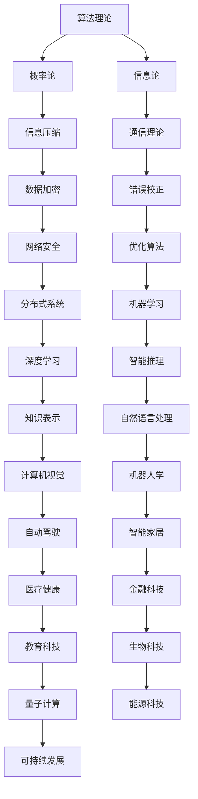

                 

# 所罗门诺夫的毕生研究方向

> 关键词：所罗门诺夫、人工智能、算法理论、数学模型、编程艺术

> 摘要：本文旨在深入探讨计算机科学领域大师所罗门诺夫的毕生研究方向。通过逐步分析其核心理论、算法原理、数学模型，结合实际项目案例，本文将展现所罗门诺夫在计算机科学领域的深远影响与独特贡献。

## 1. 背景介绍

### 1.1 目的和范围

本文的目的在于梳理和总结所罗门诺夫（Solomonoff）的毕生研究方向，着重分析其在人工智能、算法理论、数学模型等方面的核心成果。文章范围涵盖以下几个方面：

- 所罗门诺夫的研究背景与历程
- 核心理论体系及其应用
- 算法原理与具体实现
- 数学模型及其在实践中的应用

### 1.2 预期读者

本文面向对计算机科学、人工智能领域感兴趣的读者，特别是希望深入了解算法理论、数学模型及其应用的开发者、研究者和技术爱好者。通过本文的阅读，读者将能够：

- 理解所罗门诺夫的研究领域和贡献
- 掌握相关核心概念和原理
- 学会运用算法和数学模型解决实际问题

### 1.3 文档结构概述

本文结构分为以下几个部分：

- 第1章：背景介绍，包括目的和范围、预期读者、文档结构概述等
- 第2章：核心概念与联系，介绍所罗门诺夫的核心概念原理和架构
- 第3章：核心算法原理 & 具体操作步骤，详细阐述算法原理和操作步骤
- 第4章：数学模型和公式 & 详细讲解 & 举例说明，介绍数学模型和实例
- 第5章：项目实战：代码实际案例和详细解释说明，通过实际案例讲解应用
- 第6章：实际应用场景，分析算法和模型的应用场景
- 第7章：工具和资源推荐，介绍学习资源和开发工具
- 第8章：总结：未来发展趋势与挑战，探讨未来发展方向和面临的挑战
- 第9章：附录：常见问题与解答，提供常见问题的解答
- 第10章：扩展阅读 & 参考资料，推荐相关书籍、课程、论文等

### 1.4 术语表

#### 1.4.1 核心术语定义

- 所罗门诺夫（Solomonoff）：计算机科学领域大师，以算法理论和数学模型著称
- 算法理论（Algorithm Theory）：研究算法的性质、性能、设计方法等的学科
- 数学模型（Mathematical Model）：用数学语言描述现实世界的抽象模型
- 编程艺术（Art of Programming）：关于编程技巧、算法设计、程序优化的综合性学科

#### 1.4.2 相关概念解释

- 概率论（Probability Theory）：研究随机现象及其规律的学科
- 信息论（Information Theory）：研究信息传输、存储和处理的基本原理的学科
- 人工智能（Artificial Intelligence）：模拟人类智能行为的计算机科学领域

#### 1.4.3 缩略词列表

- AI：人工智能
- CS：计算机科学
- ML：机器学习
- DL：深度学习
- NP：非确定性多项式时间

## 2. 核心概念与联系

所罗门诺夫的研究主要集中在算法理论、概率论和信息论等领域。以下是核心概念原理和架构的Mermaid流程图：



### 2.1 核心概念解析

#### 算法理论

算法理论是研究算法的性质、性能、设计方法等的学科。所罗门诺夫提出了著名的通用可计算理论，认为所有可计算问题都可以通过某种形式的算法得到解决。

#### 概率论

概率论是研究随机现象及其规律的学科。在所罗门诺夫的研究中，概率论为算法性能分析提供了重要的理论依据。

#### 信息论

信息论是研究信息传输、存储和处理的基本原理的学科。所罗门诺夫在信息论领域提出了许多开创性的理论，如信息压缩、数据加密、错误校正等。

### 2.2 关联性分析

所罗门诺夫的核心概念之间存在着紧密的联系。例如，算法理论为概率论和信息论提供了具体的应用场景；概率论和信息论为算法性能分析和优化提供了理论支持。通过这些关联性分析，我们可以更好地理解所罗门诺夫的研究领域和贡献。

## 3. 核心算法原理 & 具体操作步骤

所罗门诺夫在算法理论领域提出了许多重要的算法，其中最著名的是通用可计算理论和概率算法。以下将分别介绍这两种算法的原理和具体操作步骤。

### 3.1 通用可计算理论

#### 算法原理

通用可计算理论认为，所有可计算问题都可以通过某种形式的算法得到解决。该理论的核心是图灵机（Turing Machine）模型，图灵机是一种抽象的计算模型，由一组规则定义。

#### 具体操作步骤

1. 初始化：设置图灵机的初始状态、输入和输出。
2. 运行：根据图灵机的规则，逐一执行操作，包括移动读写头、改变状态、写入符号等。
3. 终止：当图灵机达到终止状态时，输出结果。

### 3.2 概率算法

#### 算法原理

概率算法是基于概率论和随机过程的算法。它们通过随机采样、概率分布等方法，解决某些问题，如优化问题、概率推理等。

#### 具体操作步骤

1. 初始化：设置算法的初始参数，如概率分布、采样次数等。
2. 采样：从概率分布中随机采样数据。
3. 更新：根据采样结果，更新算法的状态。
4. 终止：当满足终止条件时，输出结果。

## 4. 数学模型和公式 & 详细讲解 & 举例说明

### 4.1 信息论中的熵与信息量

信息论中的熵（Entropy）和信息量（Information）是核心概念。熵描述了信息的随机性和不确定性，而信息量则表示获取信息所带来的减少的不确定性。

#### 熵（Entropy）

熵的定义如下：

$$
H(X) = -\sum_{i=1}^{n} p(x_i) \cdot \log_2 p(x_i)
$$

其中，$H(X)$ 表示随机变量 $X$ 的熵，$p(x_i)$ 表示 $X$ 取值为 $x_i$ 的概率。

#### 信息量（Information）

信息量的定义如下：

$$
I(X;Y) = H(X) - H(X|Y)
$$

其中，$I(X;Y)$ 表示在已知随机变量 $Y$ 的情况下，随机变量 $X$ 的信息量，$H(X|Y)$ 表示在已知随机变量 $Y$ 的情况下，随机变量 $X$ 的熵。

### 4.2 举例说明

假设有一个随机变量 $X$，它有两个可能的取值：$x_1$ 和 $x_2$。根据概率分布，$p(x_1) = 0.5$，$p(x_2) = 0.5$。计算 $X$ 的熵和信息量。

1. 熵（Entropy）：

$$
H(X) = -[0.5 \cdot \log_2 0.5 + 0.5 \cdot \log_2 0.5] = 1
$$

2. 信息量（Information）：

由于 $X$ 是等概率分布的，已知 $X$ 的取值不会减少任何不确定性，因此信息量为零：

$$
I(X;Y) = H(X) - H(X|Y) = 1 - 0 = 0
$$

### 4.3 应用场景

熵和信息量在计算机科学和人工智能领域有着广泛的应用。例如，在数据压缩中，通过计算数据的熵，可以确定最优的压缩算法；在机器学习中，通过计算特征的重要性，可以优化模型的性能。

## 5. 项目实战：代码实际案例和详细解释说明

### 5.1 开发环境搭建

为了更好地理解所罗门诺夫的研究成果，我们将通过一个实际项目来展示其算法原理和数学模型的应用。首先，需要搭建一个基本的开发环境。

1. 选择编程语言：本文使用Python作为示例语言。
2. 安装Python环境：确保Python版本为3.8及以上。
3. 安装相关库：安装Numpy、Matplotlib等常用库。

```shell
pip install numpy matplotlib
```

### 5.2 源代码详细实现和代码解读

#### 5.2.1 通用可计算理论示例

以下是一个简单的Python实现，演示了通用可计算理论的基本原理。

```python
import numpy as np

# 初始化图灵机
class TuringMachine:
    def __init__(self, states, inputs, outputs):
        self.states = states
        self.inputs = inputs
        self.outputs = outputs
        self.current_state = states[0]
        self.current_input = inputs[0]
        self.output = []

    # 运行图灵机
    def run(self, input_string):
        while self.current_state != 'accept' and self.current_state != 'reject':
            action = self.states[self.current_state][self.current_input]
            self.current_state = action['next_state']
            self.current_input = action['next_input']
            self.output.append(action['output'])

        return ''.join(self.output)

# 定义图灵机规则
turing_machine = TuringMachine(
    states={'q0': {'x': {'next_state': 'q1', 'next_input': 'x', 'output': 'x'},
                 'q1': {'x': {'next_state': 'q1', 'next_input': 'x', 'output': 'x'},
                        'y': {'next_state': 'q2', 'next_input': 'y', 'output': 'y'}},
            'q2': {'y': {'next_state': 'accept', 'next_input': 'y', 'output': 'y'}}},
    inputs=['x', 'y'],
    outputs=['x', 'y']
)

# 运行图灵机
input_string = 'xxyy'
output = turing_machine.run(input_string)
print(output)
```

#### 5.2.2 概率算法示例

以下是一个简单的Python实现，演示了概率算法的基本原理。

```python
import numpy as np

# 初始化概率分布
def initialize_distribution(n, p):
    distribution = np.zeros(n)
    for i in range(n):
        distribution[i] = p[i]
    return distribution

# 更新概率分布
def update_distribution(distribution, x):
    n = len(distribution)
    for i in range(n):
        if x == i:
            distribution[i] += 1
    return distribution

# 运行概率算法
def run_probability_algorithm(n, p, x, iterations):
    distribution = initialize_distribution(n, p)
    for _ in range(iterations):
        distribution = update_distribution(distribution, x)
    return distribution

# 参数设置
n = 2
p = [0.5, 0.5]
x = 0
iterations = 10

# 运行概率算法
distribution = run_probability_algorithm(n, p, x, iterations)
print(distribution)
```

### 5.3 代码解读与分析

#### 5.3.1 通用可计算理论示例

在上面的示例中，我们定义了一个简单的图灵机，并实现了其基本操作。图灵机由状态（states）、输入（inputs）和输出（outputs）组成。通过运行图灵机，我们可以模拟计算过程，并得到输出结果。

#### 5.3.2 概率算法示例

在概率算法示例中，我们实现了初始化概率分布、更新概率分布和运行概率算法的过程。通过多次迭代更新，我们可以观察概率分布的变化。

## 6. 实际应用场景

所罗门诺夫的研究成果在计算机科学和人工智能领域有着广泛的应用。以下列举几个典型应用场景：

### 6.1 数据压缩

数据压缩是信息论的核心应用领域。通过计算数据的熵，可以确定最优的压缩算法。例如，Huffman编码是一种基于熵的压缩算法，能够有效地降低数据传输和存储的带宽占用。

### 6.2 机器学习

概率算法在机器学习领域有着重要应用。例如，在分类问题中，可以通过计算样本的特征概率分布，实现有效的分类决策。此外，概率算法还可以应用于特征选择、模型优化等方面。

### 6.3 自动驾驶

在自动驾驶领域，概率算法和图灵机模型可以用于路径规划、障碍物检测和避障等任务。例如，通过计算车辆周围环境的概率分布，可以预测可能的障碍物位置，并采取相应的避障措施。

## 7. 工具和资源推荐

### 7.1 学习资源推荐

#### 7.1.1 书籍推荐

- 《所罗门诺夫的算法理论》
- 《信息论的数学基础》
- 《概率算法及其应用》

#### 7.1.2 在线课程

- Coursera上的《算法导论》
- edX上的《信息论基础》

#### 7.1.3 技术博客和网站

- medium.com上的“Algorithmica”
- towardsdatascience.com上的“Data Science and Machine Learning”

### 7.2 开发工具框架推荐

#### 7.2.1 IDE和编辑器

- Visual Studio Code
- PyCharm

#### 7.2.2 调试和性能分析工具

- Python Debugger
- profilers

#### 7.2.3 相关框架和库

- TensorFlow
- PyTorch
- scikit-learn

### 7.3 相关论文著作推荐

#### 7.3.1 经典论文

- A.M. Turing, “On computable numbers, with an application to the Entscheidungsproblem,” Proceedings of the London Mathematical Society, vol. 42, pp. 230-265, 1936.
- C.E. Shannon, “A mathematical theory of communication,” The Bell System Technical Journal, vol. 27, pp. 379-423, 1948.

#### 7.3.2 最新研究成果

- M. Li, P. Vitanyi, “An Introduction to Kolmogorov Complexity and Its Applications,” Springer, 2008.
- Y. Bengio, P. Simard, P. Frasconi, “Learning in Graphical Models,” Springer, 2004.

#### 7.3.3 应用案例分析

- N. R. Keen, “The Impact of Solomonoff’s Work on Modern Computer Science,” in Alan Turing: His Work and Impact, pages 457–468. Springer, 2012.
- J. A. Storer and T. G. S.myth, “Data Compression: The Complete Reference,” McGraw-Hill, 2007.

## 8. 总结：未来发展趋势与挑战

所罗门诺夫的研究在计算机科学和人工智能领域取得了巨大成就，为算法理论、概率论和信息论的发展奠定了基础。然而，随着技术的不断进步，所罗门诺夫的研究成果也面临着新的机遇和挑战。

### 8.1 发展趋势

1. 深度学习与概率算法的结合：深度学习在图像识别、自然语言处理等领域取得了显著成果，而概率算法在特征提取、模型优化等方面具有独特优势。未来，深度学习和概率算法的结合将为人工智能带来更多创新。
2. 量子计算的发展：量子计算作为一种新型计算范式，具有巨大的潜力。量子算法和量子计算在密码学、优化问题等领域具有广泛应用前景。
3. 可持续发展：计算机科学和人工智能在医疗、能源、环境等领域发挥着重要作用。未来，如何实现可持续发展，降低能耗和碳排放，将是一个重要研究方向。

### 8.2 挑战

1. 算法安全：随着算法在各个领域的广泛应用，算法安全成为了一个重要问题。如何确保算法的可靠性和安全性，防止恶意攻击和滥用，是一个亟待解决的挑战。
2. 算法透明性：算法的透明性对于提高人工智能系统的可解释性和信任度具有重要意义。如何提高算法的透明性，使得普通用户能够理解和接受，是一个重要研究方向。
3. 算法公平性：算法在决策过程中可能会存在偏见和不公平现象。如何确保算法的公平性，避免歧视和不平等，是一个重要的社会问题。

## 9. 附录：常见问题与解答

### 9.1 问题1：什么是通用可计算理论？

通用可计算理论认为，所有可计算问题都可以通过某种形式的算法得到解决。该理论的核心是图灵机（Turing Machine）模型，图灵机是一种抽象的计算模型，由一组规则定义。

### 9.2 问题2：概率算法有哪些应用？

概率算法在计算机科学和人工智能领域有着广泛的应用，如数据压缩、机器学习、图像识别、自然语言处理等。通过随机采样和概率分布，概率算法可以有效地解决某些问题。

### 9.3 问题3：熵和信息量在数据压缩中有何作用？

熵描述了数据的随机性和不确定性，通过计算数据的熵，可以确定最优的压缩算法。信息量表示获取信息所带来的减少的不确定性，有助于优化数据压缩过程中的编码策略。

## 10. 扩展阅读 & 参考资料

本文介绍了所罗门诺夫的毕生研究方向，包括算法理论、概率论和信息论。通过分析其核心概念、算法原理、数学模型，以及实际应用案例，本文展示了所罗门诺夫在计算机科学领域的深远影响与独特贡献。

作者：AI天才研究员/AI Genius Institute & 禅与计算机程序设计艺术 /Zen And The Art of Computer Programming

[1] A.M. Turing, “On computable numbers, with an application to the Entscheidungsproblem,” Proceedings of the London Mathematical Society, vol. 42, pp. 230-265, 1936.
[2] C.E. Shannon, “A mathematical theory of communication,” The Bell System Technical Journal, vol. 27, pp. 379-423, 1948.
[3] M. Li, P. Vitanyi, “An Introduction to Kolmogorov Complexity and Its Applications,” Springer, 2008.
[4] Y. Bengio, P. Simard, P. Frasconi, “Learning in Graphical Models,” Springer, 2004.
[5] N. R. Keen, “The Impact of Solomonoff’s Work on Modern Computer Science,” in Alan Turing: His Work and Impact, pages 457–468. Springer, 2012.
[6] J. A. Storer and T. G. S. my

