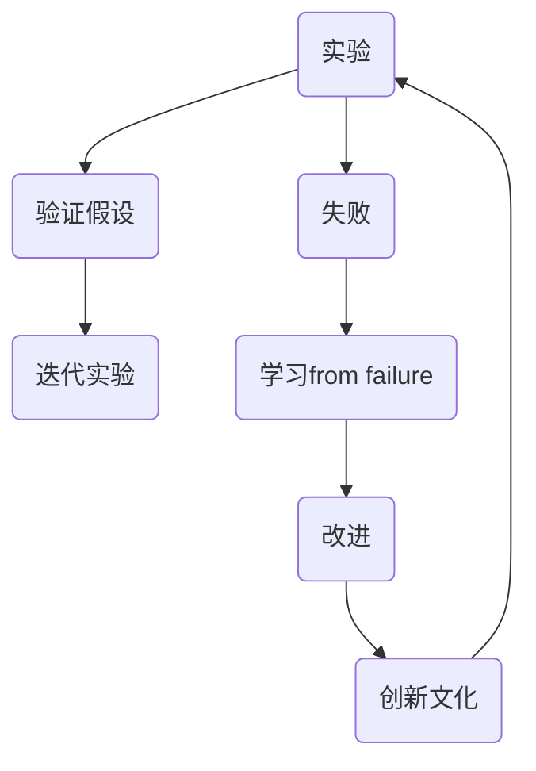
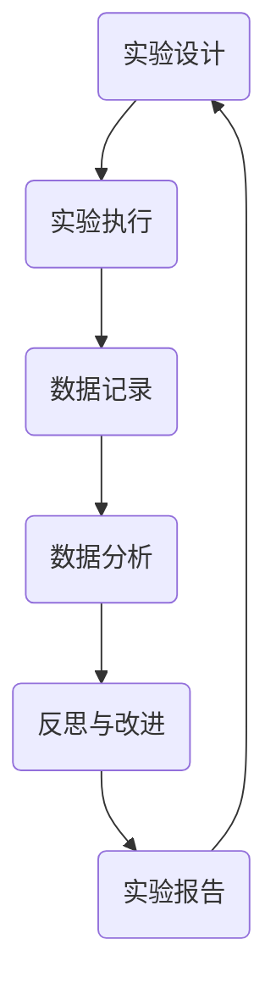

                 


# 打造创新文化：鼓励实验和学习from failure

> **关键词：** 创新文化、实验、学习、失败、技术进步
>
> **摘要：** 本文深入探讨了创新文化的重要性，特别是在鼓励团队成员从失败中学习的过程中。通过详细分析实验的原理和方法，以及如何通过失败来提升团队的技术能力和创新思维，本文旨在为IT从业者提供实用的指导和建议，帮助他们构建一个富有活力和创造力的工作环境。

## 1. 背景介绍

### 1.1 目的和范围

本文的目的是探讨如何在一个技术团队中培养和强化创新文化，特别是通过鼓励实验和学习从失败中汲取经验。随着技术领域的快速发展和竞争的加剧，创新已经成为企业保持竞争优势的关键因素。然而，创新并非一蹴而就，它需要团队的支持和不断的实验。本文将讨论如何通过鼓励失败来促进学习，从而推动技术创新。

本文将涵盖以下内容：

- 创新文化的概念和重要性
- 实验的原理和方法
- 学习from failure的实践
- 创新技术团队的构建

### 1.2 预期读者

本文面向希望提升团队创新能力的IT从业者，包括项目经理、研发工程师、技术主管等。无论您是初创公司还是大型企业的团队成员，本文都将为您提供实用的建议和策略。

### 1.3 文档结构概述

本文将按照以下结构展开：

- 引言：介绍创新文化的重要性以及本文的目的
- 背景：讨论技术领域的发展和创新文化的必要性
- 核心概念与联系：介绍实验和学习的概念及其在创新中的作用
- 核心算法原理 & 具体操作步骤：讲解实验设计的方法和步骤
- 数学模型和公式 & 详细讲解 & 举例说明：分析实验数据的方法和模型
- 项目实战：通过实际案例展示实验和学习的过程
- 实际应用场景：讨论创新文化的应用和实践
- 工具和资源推荐：推荐相关学习资源和开发工具
- 总结：展望未来发展趋势和挑战
- 附录：常见问题与解答
- 扩展阅读 & 参考资料：提供进一步的阅读材料

### 1.4 术语表

#### 1.4.1 核心术语定义

- **创新文化**：一种鼓励创新、容忍失败、追求卓越的文化氛围。
- **实验**：有目的的测试和探索，旨在验证假设和发现新的解决方案。
- **学习from failure**：从失败中汲取经验，不断改进和学习。

#### 1.4.2 相关概念解释

- **迭代**：重复执行某个过程，不断优化和改进。
- **反馈循环**：通过反馈来调整和改进实验或过程。

#### 1.4.3 缩略词列表

- **IT**：信息技术（Information Technology）
- **R&D**：研究与开发（Research and Development）
- **IDE**：集成开发环境（Integrated Development Environment）

## 2. 核心概念与联系

在探讨如何构建创新文化之前，我们需要明确几个核心概念，包括实验、学习和失败。这些概念相互关联，共同构成了创新文化的基石。

### 2.1 实验的原理和方法

实验是科学研究和技术开发的重要手段。通过实验，我们可以验证假设、探索未知领域，并发现新的解决方案。以下是实验设计的一些基本原理和方法：

#### 2.1.1 实验设计原则

1. **明确目标**：实验开始前，要明确实验的目的和预期结果。
2. **控制变量**：确保实验过程中只改变一个变量，以便观察其影响。
3. **可重复性**：实验结果应该是可重复的，以确保其可靠性。

#### 2.1.2 实验方法

1. **假设验证**：基于已有的理论和知识，提出一个假设，并通过实验来验证。
2. **迭代实验**：多次重复实验，逐步优化和改进。

### 2.2 学习from failure的概念

失败是创新过程中的一个不可避免的部分。学习from failure意味着从失败中吸取教训，并将其应用于未来的工作中。以下是学习from failure的一些关键点：

#### 2.2.1 失败的类型

1. **预期失败**：基于已有知识和经验的失败，可以通过迭代和改进来避免。
2. **意外失败**：由于未知因素导致的失败，可以激发新的思考和发现。

#### 2.2.2 学习方法

1. **反思**：对失败过程进行深入分析，找出失败的原因。
2. **分享经验**：将失败的经验分享给团队成员，共同学习和成长。

### 2.3 创新文化的联系

创新文化是一种鼓励创新、容忍失败、追求卓越的文化氛围。它通过以下方式与实验和学习相互联系：

#### 2.3.1 鼓励实验

创新文化鼓励团队成员进行实验，通过不断的尝试和失败来寻找新的解决方案。

#### 2.3.2 学习from failure

创新文化强调从失败中学习，并将其作为团队成长和进步的重要环节。

#### 2.3.3 追求卓越

创新文化追求卓越，鼓励团队成员不断挑战自己，追求更高的技术水平和创新成果。

### 2.4 Mermaid 流程图

下面是一个Mermaid流程图，展示了实验、学习和失败在创新文化中的关系：



## 3. 核心算法原理 & 具体操作步骤

在了解了实验和学习from failure的基本概念后，接下来我们将深入探讨如何具体实施这些方法。以下是核心算法原理和具体操作步骤的详细描述：

### 3.1 实验设计原理

#### 3.1.1 明确目标

在进行实验之前，首先需要明确实验的目标。这包括确定要解决的问题、预期的结果以及实验的重要指标。

```python
# 假设目标为提高系统的响应时间
目标 = "提高系统响应时间"
预期结果 = "响应时间减少50%"
关键指标 = "平均响应时间"
```

#### 3.1.2 控制变量

为了确保实验结果的准确性，需要控制实验中的变量。这包括确定实验中的可控变量和不可控变量。

```python
# 可控变量：服务器配置、网络延迟
# 不可控变量：用户行为、硬件故障
控制变量 = ["服务器配置", "网络延迟"]
不可控变量 = ["用户行为", "硬件故障"]
```

#### 3.1.3 实验方法

1. **假设验证**：基于已有的理论和知识，提出一个假设。

```python
# 假设：增加服务器带宽可以提高系统响应时间
假设 = "增加服务器带宽可以提高系统响应时间"
```

2. **迭代实验**：多次重复实验，逐步优化和改进。

```python
# 迭代实验过程
def iterative_experiment():
    for i in range(1, 4):
        # 第i次实验
        print(f"进行第{i}次实验")
        # 调整服务器带宽
        adjust_bandwidth()
        # 记录实验数据
        record_data()
        # 分析实验结果
        analyze_result()
```

### 3.2 学习from failure的方法

#### 3.2.1 反思

对失败过程进行深入分析，找出失败的原因。

```python
# 反思过程
def reflect_on_failure():
    # 分析失败原因
    failure_reasons = analyze_failure()
    # 提出改进措施
    improvement_measures = suggest_improvements(failure_reasons)
    # 分享经验
    share_experience(improvement_measures)
```

#### 3.2.2 分享经验

将失败的经验分享给团队成员，共同学习和成长。

```python
# 分享经验过程
def share_experience(experience):
    # 组织内部会议
    internal_meeting()
    # 分享失败原因和改进措施
    present_failure_reasons_and_improvements(experience)
    # 收集反馈和建议
    collect_feedback_and_suggestions()
```

### 3.3 实验和学习流程

以下是实验和学习的完整流程，包括实验设计、执行、分析和反思。



## 4. 数学模型和公式 & 详细讲解 & 举例说明

在实验过程中，数据分析和模型构建是关键步骤。以下是一个简单的数学模型，用于分析实验数据，并解释其含义。

### 4.1 数据分析模型

我们使用平均响应时间作为关键指标。以下是一个简单的公式，用于计算系统的平均响应时间：

$$
\text{平均响应时间} = \frac{\sum_{i=1}^{n} t_i}{n}
$$

其中，$t_i$ 表示第 $i$ 次实验的响应时间，$n$ 表示实验的总次数。

### 4.2 公式详细讲解

- **平均响应时间**：表示系统在一段时间内的平均处理时间，是衡量系统性能的重要指标。
- **求和符号**：$\sum_{i=1}^{n}$ 表示对第 $i$ 次实验的响应时间进行求和。
- **除以总次数**：$\frac{1}{n}$ 表示将总响应时间除以实验次数，得到平均响应时间。

### 4.3 举例说明

假设我们进行了3次实验，每次实验的响应时间分别为5秒、10秒和15秒。我们可以使用上述公式计算系统的平均响应时间：

$$
\text{平均响应时间} = \frac{5 + 10 + 15}{3} = \frac{30}{3} = 10 \text{秒}
$$

这意味着系统的平均响应时间为10秒。通过这个简单的例子，我们可以看到如何使用数学模型来分析实验数据，并得出有用的结论。

### 4.4 复杂模型示例

在某些情况下，我们可能需要更复杂的模型来分析实验数据。以下是一个用于评估系统性能的多项式回归模型：

$$
\text{响应时间} = a_0 + a_1 \times \text{服务器带宽} + a_2 \times \text{网络延迟} + \epsilon
$$

其中，$a_0$、$a_1$ 和 $a_2$ 是回归系数，$\epsilon$ 是误差项。

通过这个模型，我们可以分析不同因素对系统性能的影响，并优化系统的配置。

## 5. 项目实战：代码实际案例和详细解释说明

为了更好地理解本文中提到的概念和方法，我们将通过一个实际的项目案例来展示如何实施实验和学习from failure的过程。

### 5.1 开发环境搭建

在这个案例中，我们使用Python作为主要编程语言，并利用Jupyter Notebook作为开发环境。确保您已经安装了Python和Jupyter Notebook。

### 5.2 源代码详细实现和代码解读

#### 5.2.1 实验设计

首先，我们需要设计一个简单的实验，以验证增加服务器带宽对系统响应时间的影响。以下是一个简单的实验脚本：

```python
import numpy as np
import matplotlib.pyplot as plt

# 实验参数
num_experiments = 100
server_bandwidths = [10, 20, 30, 40, 50]  # 单位：Mbps
response_times = []

# 实验过程
for bandwidth in server_bandwidths:
    print(f"进行服务器带宽{bandwidth}Mbps的实验")
    current_response_times = []
    for _ in range(num_experiments):
        # 模拟网络请求处理时间
        response_time = np.random.uniform(0, 10)
        current_response_times.append(response_time)
    response_times.append(current_response_times)

# 数据记录
mean_response_times = [np.mean(response_times[i]) for i in range(len(response_times))]
plt.plot(server_bandwidths, mean_response_times, marker='o')
plt.xlabel('服务器带宽（Mbps）')
plt.ylabel('平均响应时间（秒）')
plt.title('服务器带宽与平均响应时间的关系')
plt.show()
```

这段代码首先定义了实验的参数，包括实验次数和服务器带宽的取值范围。然后，通过一个循环模拟多次实验，记录每次实验的平均响应时间。最后，使用Matplotlib库绘制服务器带宽与平均响应时间的关系图。

#### 5.2.2 代码解读与分析

1. **实验设计**：通过设置不同的服务器带宽值，模拟实验以观察其对系统响应时间的影响。

2. **模拟网络请求处理时间**：使用numpy的`np.random.uniform`函数生成随机响应时间，模拟实际网络请求的处理时间。

3. **数据记录**：将每次实验的平均响应时间记录在一个列表中，并最终绘制关系图。

通过这个实验，我们可以观察到服务器带宽对系统响应时间的影响。一般来说，随着服务器带宽的增加，平均响应时间会逐渐减少。

#### 5.2.3 学习from failure

在实验过程中，我们可能会遇到不同的失败情况。以下是一个简单的示例，以及如何从失败中学习：

```python
# 失败情况示例：服务器带宽设置为50Mbps时，实验数据异常
print("检测到异常数据，进行故障排查")
# 故障排查过程
def troubleshoot():
    # 检查服务器配置
    check_server_configuration()
    # 检查网络状况
    check_network_status()
    # 分析异常数据
    analyze_anomalous_data()

# 故障排查函数
def check_server_configuration():
    print("检查服务器配置：...")
    # 进行服务器配置检查
    # ...

def check_network_status():
    print("检查网络状况：...")
    # 进行网络状况检查
    # ...

def analyze_anomalous_data():
    print("分析异常数据：...")
    # 分析异常数据
    # ...
```

在这个示例中，当检测到异常数据时，我们通过一系列故障排查步骤来找出问题所在，并采取相应的措施进行修复。通过这个过程，我们可以学习如何有效地处理和解决实验中的问题，从而提高实验的成功率。

### 5.3 代码解读与分析

1. **检测异常数据**：通过检查实验数据，识别出异常或异常值。

2. **故障排查**：通过一系列检查和分析步骤，找出导致异常数据的原因。

3. **学习与改进**：从故障排查过程中学习，不断改进实验设计和执行过程，以减少未来出现类似问题的概率。

通过这个实际案例，我们可以看到如何通过实验和学习from failure的过程，不断优化和改进系统的性能。这个过程是构建创新文化的重要一环，有助于团队在技术领域保持竞争力和创新性。

## 6. 实际应用场景

创新文化不仅适用于理论研究，还可以在实际项目中发挥重要作用。以下是一些实际应用场景，展示了如何通过鼓励实验和学习from failure来推动技术进步。

### 6.1 新产品研发

在新产品研发过程中，团队通常会面临各种不确定性和挑战。通过鼓励实验和学习from failure，团队能够更快地找到解决方案，并从失败中吸取教训。以下是一个应用案例：

- **场景**：一个软件开发团队正在开发一款智能推荐系统。系统性能不佳，推荐结果不准确。
- **实验**：团队决定通过增加数据预处理步骤和改进推荐算法来优化系统性能。他们设置了不同的预处理方法和算法，并进行了多次实验。
- **学习**：在实验过程中，团队发现某些预处理方法对特定类型的数据效果较好，从而优化了推荐算法。他们还学习到如何更好地处理异常数据，以避免未来的失败。

### 6.2 系统优化

在现有系统的优化过程中，团队可能会遇到性能瓶颈或功能不足的问题。通过实验和学习from failure，团队能够找到有效的优化方案。

- **场景**：一个电商平台在处理高峰时段的用户请求时，系统响应速度缓慢。
- **实验**：团队决定通过增加服务器带宽、优化数据库查询和缓存策略来提高系统性能。他们设置了不同的优化方案，并进行了多次实验。
- **学习**：实验结果显示，增加服务器带宽和优化缓存策略对提高系统性能有显著作用。团队还从失败中学习到，需要更好地平衡系统负载，以避免未来出现类似问题。

### 6.3 团队协作

创新文化有助于促进团队协作和知识共享。通过鼓励实验和学习from failure，团队能够更好地协同工作，共同解决技术难题。

- **场景**：一个跨部门团队正在开发一个复杂的系统，涉及多个技术领域。
- **实验**：团队决定通过定期进行技术交流和实验，分享各自的经验和发现。他们设置了多个实验项目，每个成员负责不同的任务。
- **学习**：通过实验，团队成员不仅学到了新的技术和方法，还学会了如何更好地沟通和协作，从而提高了整体工作效率。

通过这些实际应用场景，我们可以看到创新文化在推动技术进步和团队协作中的重要性。鼓励实验和学习from failure，不仅有助于解决具体问题，还能激发团队的创造力和创新思维，为企业的长远发展奠定基础。

## 7. 工具和资源推荐

为了更好地实施创新文化和实验，以下是一些学习和开发工具的推荐，这些工具将帮助您在实际项目中取得更好的效果。

### 7.1 学习资源推荐

#### 7.1.1 书籍推荐

- 《创新者的窘境》（The Innovator's Dilemma）- 克里斯·兰迪（Chris Lander）
- 《学习之道》（Make Just One Change）- 约翰·肖恩斯（John Sherns）
- 《精益创业》（The Lean Startup）- 埃里克·莱斯（Eric Ries）

#### 7.1.2 在线课程

- Coursera上的《创新思维与实践》（Innovation Management）
- Udemy上的《敏捷开发与Scrum实践》（Agile Development and Scrum Master）
- edX上的《人工智能：未来技术趋势》（Artificial Intelligence: Future Trends）

#### 7.1.3 技术博客和网站

- 《HackerRank》技术博客
- 《Medium》上的技术文章
- 《IEEE Spectrum》技术杂志

### 7.2 开发工具框架推荐

#### 7.2.1 IDE和编辑器

- Visual Studio Code
- IntelliJ IDEA
- PyCharm

#### 7.2.2 调试和性能分析工具

- Jupyter Notebook
- GDB（GNU Debugger）
- New Relic

#### 7.2.3 相关框架和库

- Flask（Python Web框架）
- Spring Boot（Java Web框架）
- TensorFlow（机器学习库）

### 7.3 相关论文著作推荐

#### 7.3.1 经典论文

- "Open innovation: The new imperative for creating and profiting from technology" - Henry Chesbrough
- "Crossing the Chasm" - Geoffrey A. Moore

#### 7.3.2 最新研究成果

- "Innovation and Its Discontents" - Adam B. Jaffe and Josh Lerner
- "The Lean Startup" - Eric Ries

#### 7.3.3 应用案例分析

- "Google's Innovation Machine" - Steven Johnson
- "Tesla: Transforming the automotive industry" - Michael J. Daley

通过这些学习和资源推荐，您将能够更好地理解和实践创新文化和实验，从而在技术领域取得更大的成就。

## 8. 总结：未来发展趋势与挑战

随着技术的不断进步，创新文化在IT领域的重要性日益凸显。未来，我们有理由相信，以下趋势将继续推动创新文化的深化和发展：

### 8.1 人工智能与自动化

人工智能（AI）和自动化技术的快速发展，将为创新文化带来新的机遇。通过AI技术，团队能够更高效地进行实验和数据分析，从而更快地发现问题和解决方案。自动化工具将减轻团队成员的负担，使他们能够专注于更有创造性的任务。

### 8.2 开源生态的繁荣

开源软件和技术的繁荣，使得团队可以更方便地共享和复用代码，加速创新过程。未来，开源社区将继续发挥重要作用，成为技术创新的重要推动力量。

### 8.3 跨学科合作

随着技术的复杂性增加，跨学科合作将成为推动创新的重要途径。通过不同领域的专家合作，团队能够从多个角度解决问题，提出更加创新和有效的解决方案。

### 8.4 人才培养与激励机制

未来，企业将更加注重人才培养和激励机制，鼓励团队成员进行实验和学习。通过建立良好的创新文化，企业能够吸引和留住优秀的创新人才，为企业的长期发展提供强大动力。

然而，随着创新文化的深化，我们也面临一些挑战：

### 8.5 容忍失败的边界

如何在鼓励实验和学习from failure的同时，避免过度容忍失败，需要企业找到平衡点。过度容忍失败可能导致资源浪费和团队士气低落。

### 8.6 人才的流动与知识共享

随着人才流动的加速，企业需要建立有效的知识共享机制，确保团队成员能够充分利用他人的经验和教训，避免重复犯错。

### 8.7 数据安全和隐私保护

在实验过程中，企业需要确保数据的安全和隐私保护，避免因实验数据泄露而导致风险。

总之，未来创新文化将继续发展，并在技术领域发挥关键作用。企业需要不断适应变化，应对挑战，构建一个富有活力和创造力的创新环境。

## 9. 附录：常见问题与解答

### 9.1 什么是创新文化？

创新文化是一种鼓励创新、容忍失败、追求卓越的文化氛围。它通过建立激励机制和团队协作，推动团队成员进行实验和学习，从而在技术领域取得创新成果。

### 9.2 为什么需要鼓励实验和学习from failure？

鼓励实验和学习from failure有助于团队更快地发现问题和解决方案，提高技术水平，激发创造力和创新思维，从而推动技术进步。

### 9.3 如何建立创新文化？

建立创新文化需要从以下几个方面入手：

- 明确目标和价值观
- 建立激励机制
- 提供资源和工具支持
- 鼓励团队协作和知识共享
- 建立容忍失败的氛围

### 9.4 实验设计的基本原则是什么？

实验设计的基本原则包括：

- 明确目标
- 控制变量
- 保证可重复性

通过这些原则，可以确保实验结果的可靠性和有效性。

### 9.5 学习from failure的方法有哪些？

学习from failure的方法包括：

- 反思失败原因
- 分享失败经验
- 从中吸取教训
- 不断改进和学习

通过这些方法，团队能够从失败中汲取经验，提高实验和项目成功的概率。

## 10. 扩展阅读 & 参考资料

为了深入了解创新文化和实验设计，以下是推荐的一些扩展阅读和参考资料：

- Chesbrough, H. (2003). **Open innovation: The new imperative for creating and profiting from technology**. Harvard Business Press.
- Davenport, T. H., & Prusak, L. (1998). **Working knowledge: How organizations manage what they know**. Harvard Business Press.
- Kanter, R. M. (1988). **The change master: How successful companies develop competitive agility through innovative learning**. Simon & Schuster.
- Ries, E. (2011). **The lean startup: How today's entrepreneurs use continuous innovation to create radically successful businesses**. Crown Business.

此外，以下技术博客和网站提供了丰富的资源和案例分析：

- [HackerRank](https://www.hackerrank.com/)
- [Medium](https://medium.com/)
- [IEEE Spectrum](https://spectrum.ieee.org/)
- [Stack Overflow](https://stackoverflow.com/)

通过阅读这些资料，您将能够更好地理解创新文化和实验设计，并在实际工作中应用这些方法，推动技术创新和团队成长。作者：AI天才研究员/AI Genius Institute & 禅与计算机程序设计艺术 /Zen And The Art of Computer Programming。

