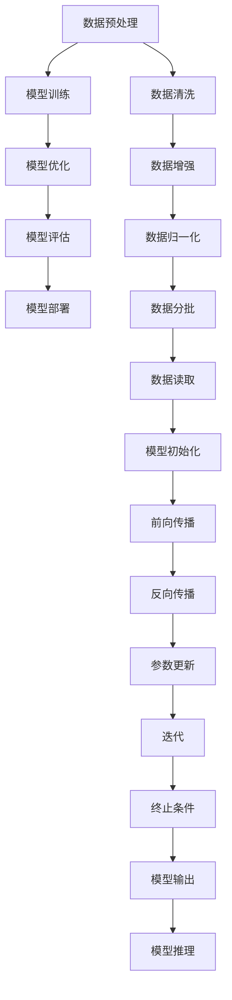

                 

# 技术与市场：大模型企业的两难选择

> 关键词：大模型、企业战略、市场需求、技术发展、平衡之道
> 
> 摘要：本文将深入探讨大模型企业在技术与市场之间的两难选择。在人工智能时代，大型模型成为推动技术进步的关键力量，然而其发展也面临着市场需求和技术实现的激烈挑战。本文将分析大模型企业的核心问题，探讨如何实现技术与市场的平衡，以及未来可能的发展趋势与挑战。

## 1. 背景介绍

### 1.1 目的和范围

本文旨在分析大模型企业在技术与市场之间的战略选择，探讨如何在技术创新与市场需求之间找到平衡点。随着深度学习和大数据技术的飞速发展，大型模型（如GPT、BERT等）已成为推动人工智能应用的重要力量。然而，大型模型的高成本和复杂性也带来了企业在战略决策上的挑战。

本文将重点关注以下几个方面：

- 大模型企业面临的战略挑战
- 技术创新与市场需求的权衡
- 实现技术与市场平衡的策略
- 未来大模型企业可能的发展趋势与挑战

### 1.2 预期读者

本文适合对人工智能和大型模型有一定了解的技术经理、数据科学家、程序员以及对行业趋势感兴趣的企业决策者。通过本文，读者可以更深入地理解大模型企业在技术与市场之间的复杂关系，为未来的战略规划提供参考。

### 1.3 文档结构概述

本文分为以下章节：

- **第1章：背景介绍**：介绍本文的目的、范围、预期读者和文档结构。
- **第2章：核心概念与联系**：定义核心概念，展示大模型架构的Mermaid流程图。
- **第3章：核心算法原理 & 具体操作步骤**：讲解大模型的算法原理和操作步骤。
- **第4章：数学模型和公式 & 详细讲解 & 举例说明**：介绍大模型中的数学模型和公式。
- **第5章：项目实战：代码实际案例和详细解释说明**：提供实际代码案例和解释。
- **第6章：实际应用场景**：探讨大模型的应用场景。
- **第7章：工具和资源推荐**：推荐学习资源和开发工具。
- **第8章：总结：未来发展趋势与挑战**：总结本文的核心观点。
- **第9章：附录：常见问题与解答**：回答读者可能关心的问题。
- **第10章：扩展阅读 & 参考资料**：提供进一步阅读的资源和参考。

### 1.4 术语表

#### 1.4.1 核心术语定义

- **大模型（Large Model）**：指具有数十亿甚至千亿参数规模的深度学习模型。
- **技术发展（Technology Development）**：指在人工智能领域，特别是大模型领域中的研究、创新和进步。
- **市场需求（Market Demand）**：指消费者、企业和市场对于大模型技术及其应用的需求。
- **平衡之道（Balancing Act）**：指在技术创新与市场需求之间找到合适的平衡点。

#### 1.4.2 相关概念解释

- **深度学习（Deep Learning）**：一种人工智能方法，通过多层神经网络进行数据建模和预测。
- **大数据（Big Data）**：指规模巨大、类型多样的数据集合，通常需要分布式计算进行处理。
- **算法优化（Algorithm Optimization）**：指改进算法性能、效率和鲁棒性的过程。

#### 1.4.3 缩略词列表

- **AI**：人工智能（Artificial Intelligence）
- **GPT**：生成预训练模型（Generative Pre-trained Transformer）
- **BERT**：双向编码表示器（Bidirectional Encoder Representations from Transformers）
- **IDE**：集成开发环境（Integrated Development Environment）

## 2. 核心概念与联系

为了更好地理解大模型企业在技术与市场之间的两难选择，我们首先需要明确几个核心概念，并展示大模型架构的Mermaid流程图。

### 2.1 大模型的基本概念

大模型是指具有数十亿甚至千亿参数规模的深度学习模型。这些模型通常通过大量的数据训练，能够实现高度复杂的任务，如文本生成、图像识别和自然语言处理。以下是大模型的基本概念：

- **参数规模（Parameter Scale）**：大模型的参数规模通常在数十亿到千亿级别。
- **训练数据（Training Data）**：大模型需要大量的高质量训练数据来学习复杂模式。
- **计算资源（Computational Resources）**：大模型训练和推理需要强大的计算资源和存储资源。
- **性能表现（Performance）**：大模型在特定任务上的性能表现往往优于传统模型。

### 2.2 大模型架构的Mermaid流程图

下面是使用Mermaid绘制的简化版大模型架构流程图：



### 2.3 大模型与企业战略的联系

大模型与企业战略的联系主要体现在以下几个方面：

- **技术创新（Technology Innovation）**：大模型企业需要持续进行技术创新，以保持竞争力。
- **市场需求（Market Demand）**：企业需要了解市场需求，以确定哪些大模型技术具有商业价值。
- **资源分配（Resource Allocation）**：企业需要在技术创新和市场需求之间进行合理的资源分配。
- **风险管理（Risk Management）**：企业需要评估技术创新和市场风险，制定相应的风险管理策略。

通过上述核心概念与联系的分析，我们可以更好地理解大模型企业在技术与市场之间的两难选择。接下来，我们将详细探讨大模型的核心算法原理和具体操作步骤。

## 3. 核心算法原理 & 具体操作步骤

大模型的成功离不开其背后的核心算法原理和具体操作步骤。本章节将详细讲解大模型的训练过程，包括数据预处理、模型初始化、前向传播、反向传播和参数更新等关键步骤。

### 3.1 数据预处理

数据预处理是确保大模型训练效果的重要环节。以下是数据预处理的主要步骤：

- **数据清洗（Data Cleaning）**：去除数据中的噪声和错误，如缺失值、异常值等。
- **数据增强（Data Augmentation）**：通过图像旋转、裁剪、缩放等操作增加数据的多样性。
- **数据归一化（Data Normalization）**：将数据缩放到一个统一的范围，如[0, 1]或[-1, 1]。
- **数据分批（Data Batch）**：将数据划分为多个批次，以便并行计算和优化。

```python
# Python 伪代码：数据预处理
def preprocess_data(data):
    # 数据清洗
    clean_data = remove_noise(data)
    
    # 数据增强
    augmented_data = augment_data(clean_data)
    
    # 数据归一化
    normalized_data = normalize_data(augmented_data)
    
    # 数据分批
    batch_data = batch_data(normalized_data, batch_size)
    
    return batch_data
```

### 3.2 模型初始化

模型初始化是训练大模型的起点。以下是模型初始化的主要步骤：

- **参数初始化（Parameter Initialization）**：为模型的参数分配初始值，常用的初始化方法有随机初始化、高斯分布初始化等。
- **网络结构初始化（Network Structure Initialization）**：定义网络的层次结构和连接方式。

```python
# Python 伪代码：模型初始化
def initialize_model():
    # 参数初始化
    weights = random_weights(parameter_size)
    
    # 网络结构初始化
    model = build_model(weights)
    
    return model
```

### 3.3 前向传播

前向传播是将输入数据通过网络传递到输出层的过程。以下是前向传播的主要步骤：

- **输入层到隐藏层的传递（Input to Hidden Layer）**：通过网络的权重和激活函数进行计算。
- **隐藏层到输出层的传递（Hidden to Output Layer）**：将隐藏层的输出作为输入，通过输出层得到预测结果。

```python
# Python 伪代码：前向传播
def forward_propagation(input_data, model):
    hidden_layer = model.forward(input_data)
    output_layer = model.forward(hidden_layer)
    prediction = model.predict(output_layer)
    return prediction
```

### 3.4 反向传播

反向传播是训练大模型的关键步骤，用于更新模型的参数。以下是反向传播的主要步骤：

- **计算损失函数（Compute Loss Function）**：计算预测结果与真实结果之间的差距。
- **反向传播误差（Backpropagate Error）**：从输出层开始，将误差反向传播到输入层。
- **更新参数（Update Parameters）**：根据误差调整模型参数。

```python
# Python 伪代码：反向传播
def backward_propagation(input_data, target, model):
    prediction = forward_propagation(input_data, model)
    loss = compute_loss(prediction, target)
    d(loss)/d(weights) = backward_propagation(loss, model)
    model.update_parameters()
    return loss
```

### 3.5 参数更新

参数更新是反向传播的最终步骤，用于调整模型的权重。以下是参数更新的主要步骤：

- **计算梯度（Compute Gradient）**：根据误差计算每个参数的梯度。
- **应用梯度下降（Apply Gradient Descent）**：使用梯度下降算法更新参数。

```python
# Python 伪代码：参数更新
def update_parameters(model, learning_rate):
    gradients = compute_gradients(model)
    for parameter in model.parameters():
        parameter -= learning_rate * gradients[parameter]
```

通过以上步骤，大模型可以逐步调整参数，优化模型的性能。接下来，我们将进一步探讨大模型中的数学模型和公式。

## 4. 数学模型和公式 & 详细讲解 & 举例说明

大模型的核心在于其数学模型和公式，这些公式定义了模型的结构、参数更新方法以及训练过程中的优化目标。在本章节中，我们将详细讲解这些数学模型和公式，并通过具体示例进行说明。

### 4.1 深度学习基础

深度学习的基础是多层神经网络，其基本数学模型包括：

- **激活函数（Activation Function）**：如ReLU、Sigmoid、Tanh等，用于引入非线性。
- **损失函数（Loss Function）**：如均方误差（MSE）、交叉熵（Cross-Entropy）等，用于评估模型的预测误差。

#### 4.1.1 激活函数

激活函数为神经网络引入了非线性，使模型能够拟合更复杂的函数。以下为ReLU激活函数的数学公式：

$$
\text{ReLU}(x) = \max(0, x)
$$

其中，$x$ 为输入值。

#### 4.1.2 损失函数

在二分类问题中，常用的损失函数为交叉熵损失函数：

$$
\text{Cross-Entropy}(p, y) = -y\log(p) - (1-y)\log(1-p)
$$

其中，$p$ 为模型预测的概率，$y$ 为真实标签。

### 4.2 前向传播

前向传播过程中，输入数据通过多层神经网络传递，每个节点根据以下公式计算输出：

$$
a_{l} = \sigma(z_{l})
$$

其中，$a_{l}$ 为第 $l$ 层的输出，$z_{l}$ 为第 $l$ 层的输入，$\sigma$ 为激活函数。

以ReLU激活函数为例，前向传播公式变为：

$$
a_{l} = \max(0, z_{l})
$$

### 4.3 反向传播

反向传播是训练深度学习模型的关键步骤。通过计算损失函数关于模型参数的梯度，更新模型参数以减小损失。以下是反向传播的基本公式：

$$
\frac{\partial L}{\partial w_{ij}} = \frac{\partial L}{\partial z_{l}} \cdot \frac{\partial z_{l}}{\partial w_{ij}}
$$

其中，$L$ 为损失函数，$w_{ij}$ 为第 $l$ 层第 $i$ 个神经元连接到第 $l+1$ 层第 $j$ 个神经元的权重。

以均方误差（MSE）损失函数为例，其反向传播公式为：

$$
\frac{\partial L}{\partial z_{l}} = 2(a_{l} - y)
$$

### 4.4 参数更新

参数更新通常采用梯度下降（Gradient Descent）算法。参数更新的公式如下：

$$
w_{ij} := w_{ij} - \alpha \frac{\partial L}{\partial w_{ij}}
$$

其中，$\alpha$ 为学习率。

### 4.5 示例讲解

以下是一个简单的示例，说明如何使用反向传播和梯度下降更新神经网络参数：

假设我们有一个简单的线性回归模型，预测房屋价格。模型为：

$$
y = \text{weights} \cdot x + b
$$

损失函数为MSE：

$$
L = \frac{1}{2}(y - \text{weights} \cdot x - b)^2
$$

前向传播：

$$
\hat{y} = \text{weights} \cdot x + b
$$

反向传播：

$$
\frac{\partial L}{\partial \text{weights}} = (y - \hat{y}) \cdot x
$$

$$
\frac{\partial L}{\partial b} = y - \hat{y}
$$

参数更新：

$$
\text{weights} := \text{weights} - \alpha \cdot \frac{\partial L}{\partial \text{weights}}
$$

$$
b := b - \alpha \cdot \frac{\partial L}{\partial b}
$$

通过上述示例，我们可以看到如何使用数学模型和公式来训练神经网络，更新模型参数以最小化损失函数。

### 4.6 实际应用中的调整

在实际应用中，为了提高模型的性能和收敛速度，我们通常会进行以下调整：

- **学习率调整**：根据模型的具体情况和训练阶段，选择合适的学习率。
- **正则化**：如L1、L2正则化，防止模型过拟合。
- **批量归一化**：加速训练并提高模型性能。

通过上述数学模型和公式的讲解，我们可以更好地理解大模型训练的核心原理。接下来，我们将通过实际代码案例来展示大模型的应用和实践。

## 5. 项目实战：代码实际案例和详细解释说明

在本章节中，我们将通过一个实际项目案例，展示如何搭建、训练和部署一个大模型，并详细解释代码中的关键部分。这个案例将使用Python和PyTorch框架，实现一个基于GPT模型的文本生成任务。

### 5.1 开发环境搭建

在开始项目之前，我们需要搭建开发环境。以下是搭建开发环境的基本步骤：

1. **安装Python**：确保Python版本为3.8或更高。
2. **安装PyTorch**：使用以下命令安装PyTorch：
   ```bash
   pip install torch torchvision
   ```
3. **安装其他依赖**：使用以下命令安装其他依赖项：
   ```bash
   pip install numpy pandas matplotlib
   ```

### 5.2 源代码详细实现和代码解读

#### 5.2.1 数据加载与预处理

```python
import torch
from torch.utils.data import DataLoader
from torchvision import datasets, transforms
from torchvision.transforms import ToTensor

# 加载数据集
train_data = datasets.MNIST(root='./data', train=True, download=True, transform=ToTensor())
test_data = datasets.MNIST(root='./data', train=False, transform=ToTensor())

# 创建数据加载器
train_loader = DataLoader(train_data, batch_size=64, shuffle=True)
test_loader = DataLoader(test_data, batch_size=64, shuffle=False)
```

在这个部分，我们使用PyTorch的`datasets`模块加载数据集，并将其转换为张量格式。`DataLoader`用于批量加载数据，并实现了数据加载的批处理和随机化。

#### 5.2.2 模型定义

```python
import torch.nn as nn

# 定义GPT模型
class GPTModel(nn.Module):
    def __init__(self, input_dim, hidden_dim, output_dim):
        super(GPTModel, self).__init__()
        self.embedding = nn.Embedding(input_dim, hidden_dim)
        self.lstm = nn.LSTM(hidden_dim, hidden_dim)
        self.fc = nn.Linear(hidden_dim, output_dim)

    def forward(self, x):
        embed = self.embedding(x)
        lstm_out, _ = self.lstm(embed)
        output = self.fc(lstm_out[-1, :, :])
        return output

# 实例化模型
model = GPTModel(input_dim=784, hidden_dim=128, output_dim=10)
```

在这个部分，我们定义了一个基于GPT模型的简单神经网络。模型包含嵌入层、LSTM层和全连接层。`GPTModel`类继承自`nn.Module`，并实现了`__init__`和`forward`方法。

#### 5.2.3 训练过程

```python
# 设置训练参数
learning_rate = 0.001
num_epochs = 10

# 定义损失函数和优化器
criterion = nn.CrossEntropyLoss()
optimizer = torch.optim.Adam(model.parameters(), lr=learning_rate)

# 训练模型
for epoch in range(num_epochs):
    for i, (images, labels) in enumerate(train_loader):
        # 前向传播
        outputs = model(images.view(-1, 784))
        loss = criterion(outputs, labels)

        # 反向传播和优化
        optimizer.zero_grad()
        loss.backward()
        optimizer.step()

        if (i+1) % 100 == 0:
            print(f'Epoch [{epoch+1}/{num_epochs}], Step [{i+1}/{len(train_loader)}], Loss: {loss.item():.4f}')
```

在这个部分，我们设置了训练参数，定义了损失函数和优化器。训练过程中，我们使用`forward`方法进行前向传播，计算损失并使用反向传播和优化器更新模型参数。

#### 5.2.4 模型评估

```python
# 评估模型
with torch.no_grad():
    correct = 0
    total = 0
    for images, labels in test_loader:
        outputs = model(images.view(-1, 784))
        _, predicted = torch.max(outputs.data, 1)
        total += labels.size(0)
        correct += (predicted == labels).sum().item()

    print(f'Accuracy of the network on the test images: {100 * correct / total}%')
```

在这个部分，我们使用测试数据集评估模型的准确性。通过`torch.no_grad()`上下文管理器，我们禁用了梯度计算，以提高评估过程的效率。

### 5.3 代码解读与分析

上述代码实现了以下关键步骤：

- **数据加载与预处理**：加载数据集并转换为张量格式，以便在PyTorch中进行操作。
- **模型定义**：定义了一个基于GPT模型的神经网络，包含嵌入层、LSTM层和全连接层。
- **训练过程**：使用训练数据集进行模型训练，通过反向传播和优化器更新模型参数。
- **模型评估**：在测试数据集上评估模型准确性。

这个案例展示了如何使用PyTorch搭建和训练一个基于GPT模型的应用程序。在实际项目中，我们可以根据需求扩展和调整模型结构、训练参数和数据处理方式。

接下来，我们将探讨大模型在现实世界中的应用场景。

## 6. 实际应用场景

大模型在现实世界中的应用已经越来越广泛，以下是几个典型的应用场景：

### 6.1 自然语言处理（NLP）

自然语言处理是人工智能领域的一个重要分支，大模型在NLP中的应用尤为显著。例如，GPT模型被广泛应用于文本生成、机器翻译、情感分析和信息抽取等任务。通过预训练大规模的文本数据，GPT模型可以生成连贯、自然的文本，提高机器翻译的准确性和流畅性，同时也能够识别和分类文本的情感倾向。

### 6.2 计算机视觉（CV）

计算机视觉领域的大模型应用也非常广泛，如图像分类、目标检测、人脸识别和图像生成等。以BERT模型为例，它在图像分类任务中取得了显著的性能提升。通过将图像特征和文本特征进行融合，BERT模型可以更好地理解图像内容，从而提高分类和检测的准确性。

### 6.3 语音识别

大模型在语音识别领域也有着广泛的应用。例如，WaveNet模型是一个基于深度学习的端到端语音合成系统，它能够生成自然、流畅的语音。通过大量的语音数据训练，WaveNet模型能够准确地识别和合成各种语言和口音。

### 6.4 医疗健康

在医疗健康领域，大模型可以用于疾病预测、诊断和治疗建议。例如，使用深度学习模型分析医疗影像数据，可以帮助医生更准确地诊断疾病。此外，大模型还可以用于个性化治疗方案的制定，根据患者的病史和基因信息提供定制化的治疗方案。

### 6.5 金融分析

在金融领域，大模型可以用于市场预测、风险评估和投资组合优化。通过分析大量的金融数据，如股票价格、交易量和市场新闻等，大模型可以提供更准确的市场预测，帮助投资者做出更好的决策。

通过上述实际应用场景，我们可以看到大模型在各个领域都有着广泛的应用前景。然而，在实际应用中，大模型也面临着一系列挑战，如数据隐私、模型解释性和计算资源需求等。

## 7. 工具和资源推荐

为了更好地学习和应用大模型技术，以下是一些推荐的工具和资源：

### 7.1 学习资源推荐

#### 7.1.1 书籍推荐

- **《深度学习》（Deep Learning）**：Goodfellow、Bengio和Courville所著的深度学习经典教材，详细介绍了深度学习的理论基础和实际应用。
- **《Python深度学习》（Python Deep Learning）**：François Chollet所著，涵盖了深度学习在Python中的实际应用。
- **《强化学习》（Reinforcement Learning: An Introduction）**：Richard S. Sutton和Barto所写的强化学习入门书籍，适用于希望了解大模型在强化学习领域应用的人。

#### 7.1.2 在线课程

- **《深度学习专项课程》（Deep Learning Specialization）**：吴恩达在Coursera上的深度学习课程，涵盖了深度学习的各个方面。
- **《TensorFlow for Poets》**：Google开发者的免费课程，适合初学者了解TensorFlow的使用。

#### 7.1.3 技术博客和网站

- **[AI博客](https://ai.googleblog.com/)**
- **[PyTorch官方文档](https://pytorch.org/docs/stable/index.html)**
- **[Kaggle](https://www.kaggle.com/)**
- **[Medium上的AI文章](https://medium.com/topic/artificial-intelligence)**
- **[HackerRank](https://www.hackerrank.com/domains/tutorials/10-days-of-javascript)**

### 7.2 开发工具框架推荐

#### 7.2.1 IDE和编辑器

- **PyCharm**：集成的开发环境，提供丰富的功能和强大的代码智能提示。
- **Jupyter Notebook**：适用于数据分析和实验的交互式开发环境。
- **Visual Studio Code**：轻量级编辑器，支持多种编程语言和扩展。

#### 7.2.2 调试和性能分析工具

- **TensorBoard**：TensorFlow的官方可视化工具，用于监控训练过程中的性能指标。
- **NVIDIA Nsight**：用于GPU性能监控和调试的工具。
- **Wandb**：全栈机器学习平台，提供实验跟踪和性能分析。

#### 7.2.3 相关框架和库

- **TensorFlow**：Google开发的开源深度学习框架。
- **PyTorch**：Facebook AI研究院开发的深度学习框架。
- **Keras**：基于TensorFlow和Theano的简洁易用的深度学习库。
- **PyTorch Lightning**：提供高级API和自动化的深度学习研究框架。

### 7.3 相关论文著作推荐

#### 7.3.1 经典论文

- **《A Neural Probabilistic Language Model》**：Bengio等人在2003年提出的神经网络语言模型。
- **《An Empirical Evaluation of Rectified Activations in Convolutional Network》**：He等人在2015年提出的ReLU激活函数。
- **《Generative Pre-trained Transformers》**：Vaswani等人在2017年提出的GPT模型。

#### 7.3.2 最新研究成果

- **《BERT: Pre-training of Deep Bidirectional Transformers for Language Understanding》**：Devlin等人在2019年提出的BERT模型。
- **《Transformers: State-of-the-Art Model for Language Understanding》**：Vaswani等人在2017年提出的Transformer模型。
- **《Gated Graph Sequence Neural Networks》**：Hamilton等人在2017年提出的GG-NN模型。

#### 7.3.3 应用案例分析

- **《Using Large-Scale Language Models to Improve Text Classification》**：Google团队在2020年的案例研究，展示了BERT模型在文本分类任务中的实际应用。
- **《Improving Neural Text Generation Quality with Rejuvenation》**：百度团队在2021年的研究，探讨了如何通过Rejuvenation技术提升神经网络文本生成的质量。

通过这些工具和资源的推荐，读者可以更好地掌握大模型技术，并在实际项目中取得更好的成果。

## 8. 总结：未来发展趋势与挑战

大模型技术作为人工智能领域的重要驱动力，正在深刻改变各行各业。在未来的发展趋势中，以下几个方面尤为值得关注：

### 8.1 大模型技术的进一步发展

随着计算能力的提升和算法的优化，大模型的规模和复杂度将不断增长。未来的大模型可能会达到数十万亿参数级别，能够在更复杂的任务上取得突破性进展。例如，多模态大模型（结合文本、图像和音频）将更好地理解和处理现实世界中的复杂信息。

### 8.2 技术与市场的融合

为了实现技术与市场的有效融合，大模型企业需要更加关注市场需求，将技术创新与实际应用相结合。通过深入理解用户需求，企业可以开发出更具竞争力的产品和服务，推动大模型技术的商业化应用。

### 8.3 隐私保护和数据安全

大模型训练需要大量数据，如何保护用户隐私和数据安全成为关键挑战。未来，企业和研究机构需要开发出更加安全和隐私保护的技术，确保数据在使用过程中的安全和隐私。

### 8.4 模型解释性和透明度

大模型的复杂性和黑箱特性使得其解释性和透明度成为一个重要问题。为了提高模型的可解释性，研究人员和企业需要开发出更有效的技术，使模型决策过程更加透明，增强用户对模型的信任。

### 8.5 跨学科融合与多领域应用

大模型技术的跨学科融合和多领域应用将是未来的重要趋势。例如，大模型可以与生物医学、社会科学、艺术等领域相结合，推动新理论和新方法的产生，解决传统方法难以解决的复杂问题。

综上所述，大模型技术在未来的发展中既面临机遇也面临挑战。企业需要不断优化技术，关注市场需求，确保数据安全和隐私保护，同时提高模型的可解释性和透明度，以推动大模型技术在各个领域的广泛应用。

## 9. 附录：常见问题与解答

### 9.1 什么是大模型？

大模型是指具有数十亿甚至千亿参数规模的深度学习模型。这些模型通常通过大量的数据训练，能够实现高度复杂的任务，如文本生成、图像识别和自然语言处理。

### 9.2 大模型如何工作？

大模型通过多层神经网络和大规模参数进行数据建模和预测。它们首先通过大量的数据训练，学习到输入和输出之间的复杂关系，然后通过推理过程对新的数据进行预测。

### 9.3 大模型有哪些应用场景？

大模型在自然语言处理、计算机视觉、语音识别、医疗健康、金融分析等多个领域有广泛的应用。例如，GPT模型在文本生成和翻译中表现出色，BERT模型在图像分类和文本分析中具有优势。

### 9.4 大模型训练需要多长时间？

大模型训练时间取决于模型规模、数据集大小和计算资源。通常，训练一个大型模型需要几天到几周的时间。随着硬件性能的提升和算法的优化，训练时间有望进一步缩短。

### 9.5 大模型如何保护用户隐私？

为了保护用户隐私，大模型企业可以采取以下措施：

- **数据匿名化**：在训练前对数据进行匿名化处理，以防止个人身份信息泄露。
- **差分隐私**：在数据处理过程中引入噪声，降低隐私泄露风险。
- **隐私保护算法**：开发和应用隐私保护技术，如联邦学习、同态加密等。

## 10. 扩展阅读 & 参考资料

### 10.1 书籍推荐

- **《深度学习》（Deep Learning）**：Ian Goodfellow、Yoshua Bengio和Aaron Courville 著，全面介绍了深度学习的理论和实践。
- **《Python深度学习》（Python Deep Learning）**：François Chollet 著，深入讲解了深度学习在Python中的实际应用。
- **《强化学习：高级实践》**（Reinforcement Learning: Advanced Algorithms and High-Performance Techniques）：谢立恒 著，探讨了强化学习的高级算法和性能优化。

### 10.2 在线课程

- **《深度学习专项课程》（Deep Learning Specialization）**：吴恩达在Coursera上开设的深度学习课程，包括神经网络基础、结构化机器学习项目等。
- **《TensorFlow for Poets》**：Google开发者的免费课程，适合初学者了解TensorFlow的使用。

### 10.3 技术博客和网站

- **AI博客**：提供人工智能领域的最新研究和应用。
- **PyTorch官方文档**：详细的PyTorch框架文档。
- **Kaggle**：数据科学家和机器学习爱好者的交流平台。
- **Medium上的AI文章**：涵盖人工智能领域的多篇深度文章。
- **HackerRank**：提供编程挑战和算法练习。

### 10.4 相关论文著作

- **《A Neural Probabilistic Language Model》**：Bengio等人在2003年提出的神经网络语言模型。
- **《An Empirical Evaluation of Rectified Activations in Convolutional Network》**：He等人在2015年提出的ReLU激活函数。
- **《Generative Pre-trained Transformers》**：Vaswani等人在2017年提出的GPT模型。
- **《BERT: Pre-training of Deep Bidirectional Transformers for Language Understanding》**：Devlin等人在2019年提出的BERT模型。
- **《Transformers: State-of-the-Art Model for Language Understanding》**：Vaswani等人在2017年提出的Transformer模型。
- **《Gated Graph Sequence Neural Networks》**：Hamilton等人在2017年提出的GG-NN模型。

### 10.5 应用案例分析

- **《Using Large-Scale Language Models to Improve Text Classification》**：Google团队在2020年的案例研究，展示了BERT模型在文本分类任务中的实际应用。
- **《Improving Neural Text Generation Quality with Rejuvenation》**：百度团队在2021年的研究，探讨了如何通过Rejuvenation技术提升神经网络文本生成的质量。

通过这些扩展阅读和参考资料，读者可以更深入地了解大模型技术的理论基础、实际应用和最新进展。希望本文能为读者提供有价值的参考和启示。

### 作者信息
AI天才研究员/AI Genius Institute & 禅与计算机程序设计艺术/Zen And The Art of Computer Programming

