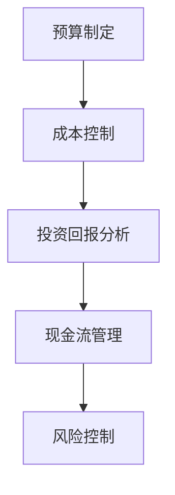

                 

# 技术人如何进行创业项目的财务规划和现金流管理

> **关键词**：创业财务规划、现金流管理、项目成本控制、投资回报分析、风险控制策略
>
> **摘要**：本文将深入探讨技术人如何在实际创业项目中进行有效的财务规划和现金流管理。文章首先介绍了财务规划和现金流管理的重要性，随后详细讲解了项目成本控制、投资回报分析和风险控制策略的方法和步骤。通过实际案例和代码实现，文章为技术创业者提供了实用的工具和资源，帮助他们更好地把握创业项目的财务状况，确保项目的可持续发展。

## 1. 背景介绍

### 1.1 目的和范围

本文旨在为技术创业者提供一套实用的财务规划和现金流管理方法，帮助他们在创业初期就建立起良好的财务基础。文章将涵盖以下内容：

- 创业项目财务规划和现金流管理的基本概念。
- 项目成本控制的策略和实施步骤。
- 投资回报分析和风险控制的方法。
- 实际案例和代码实现，以及开发环境和工具的推荐。

### 1.2 预期读者

本文适合以下读者：

- 正在创业或有意向创业的技术人。
- 创业项目的财务管理人员。
- 对创业财务规划和现金流管理感兴趣的从业者。

### 1.3 文档结构概述

本文分为以下章节：

- **第1章**：背景介绍，包括目的和范围、预期读者以及文档结构概述。
- **第2章**：核心概念与联系，介绍财务规划和现金流管理的基本概念，并使用Mermaid流程图展示关键环节。
- **第3章**：核心算法原理与具体操作步骤，讲解项目成本控制的算法原理和操作步骤。
- **第4章**：数学模型和公式，介绍相关数学模型和公式，并进行详细讲解和举例说明。
- **第5章**：项目实战，提供代码实际案例和详细解释说明。
- **第6章**：实际应用场景，探讨创业项目的财务规划和现金流管理在实际中的应用。
- **第7章**：工具和资源推荐，推荐相关学习资源和开发工具。
- **第8章**：总结，讨论未来发展趋势与挑战。
- **第9章**：附录，提供常见问题与解答。
- **第10章**：扩展阅读与参考资料。

### 1.4 术语表

#### 1.4.1 核心术语定义

- **财务规划**：根据创业项目的实际情况，制定合理的财务策略和计划。
- **现金流管理**：对创业项目的现金流入和流出进行有效控制和管理。
- **项目成本控制**：在项目实施过程中，对成本进行有效控制，确保项目预算的合理使用。
- **投资回报分析**：评估创业项目的投资回报情况，判断项目的可行性和盈利性。
- **风险控制策略**：识别和应对创业项目可能面临的风险，确保项目的稳定发展。

#### 1.4.2 相关概念解释

- **预算**：创业项目在一段时间内预计的收入和支出计划。
- **成本**：创业项目在实施过程中所产生的各项费用。
- **现金流**：创业项目的现金流入和流出情况。
- **ROI（投资回报率）**：衡量创业项目的投资回报效果。
- **NPV（净现值）**：评估创业项目投资价值的指标。

#### 1.4.3 缩略词列表

- **ROI**：投资回报率
- **NPV**：净现值
- **IDE**：集成开发环境
- **API**：应用程序编程接口

## 2. 核心概念与联系

### 2.1 财务规划和现金流管理的基本概念

**财务规划** 是指根据创业项目的实际情况，制定合理的财务策略和计划，包括预算、成本控制、投资回报分析等。其目的是确保创业项目的财务健康和可持续发展。

**现金流管理** 则是对创业项目的现金流入和流出进行有效控制和管理，确保项目在实施过程中的资金充足和有效利用。现金流管理的关键指标包括现金流入、现金流出、现金流余额等。

### 2.2 关键环节和流程

财务规划和现金流管理的关键环节和流程如下：

1. **预算制定**：根据创业项目的需求和计划，制定合理的预算，包括收入和支出。
2. **成本控制**：在项目实施过程中，对成本进行有效控制，确保项目预算的合理使用。
3. **投资回报分析**：评估创业项目的投资回报情况，判断项目的可行性和盈利性。
4. **现金流管理**：对创业项目的现金流入和流出进行有效控制和管理。
5. **风险控制**：识别和应对创业项目可能面临的风险，确保项目的稳定发展。

### 2.3 Mermaid 流程图

以下是创业项目财务规划和现金流管理的 Mermaid 流程图：



该流程图展示了财务规划和现金流管理的关键环节和流程，以及各个环节之间的关联。

## 3. 核心算法原理 & 具体操作步骤

### 3.1 项目成本控制的算法原理

项目成本控制的算法原理主要包括以下方面：

1. **成本估算**：根据创业项目的需求和计划，对项目的各项成本进行估算。
2. **成本预算**：在成本估算的基础上，制定合理的成本预算，确保项目预算的合理使用。
3. **成本监控**：在项目实施过程中，对成本进行实时监控，确保项目成本在预算范围内。
4. **成本调整**：根据实际情况，对成本进行合理调整，确保项目能够顺利实施。

### 3.2 具体操作步骤

下面将详细介绍项目成本控制的具体操作步骤：

#### 步骤1：成本估算

成本估算的主要任务是确定创业项目的各项成本。这包括以下几个方面：

- **人力成本**：根据项目需求和人员配备情况，估算项目团队的人力成本。
- **设备成本**：根据项目需求和设备配置，估算项目所需的设备成本。
- **材料成本**：根据项目需求和材料使用情况，估算项目所需的材料成本。
- **其他成本**：包括交通、通讯、差旅、培训等费用。

以下是一个简单的成本估算伪代码：

```python
def cost_estimation(project_requirements):
    human_cost = calculate_human_cost(project_requirements)
    equipment_cost = calculate_equipment_cost(project_requirements)
    material_cost = calculate_material_cost(project_requirements)
    other_cost = calculate_other_cost(project_requirements)
    total_cost = human_cost + equipment_cost + material_cost + other_cost
    return total_cost
```

#### 步骤2：成本预算

在成本估算的基础上，制定合理的成本预算。这包括以下几个方面：

- **固定预算**：根据历史数据和行业经验，确定固定预算。
- **浮动预算**：根据项目实际情况，设定一定比例的浮动预算，以应对意外情况。

以下是一个简单的成本预算伪代码：

```python
def cost_budget(total_cost):
    fixed_budget = 0.8 * total_cost
    floating_budget = 0.2 * total_cost
    total_budget = fixed_budget + floating_budget
    return total_budget
```

#### 步骤3：成本监控

在项目实施过程中，对成本进行实时监控，确保项目成本在预算范围内。这包括以下几个方面：

- **实时数据采集**：通过数据采集系统，实时获取项目各项成本的实时数据。
- **数据分析**：对实时数据进行统计分析，判断项目成本是否在预算范围内。
- **预警机制**：当项目成本超过预算时，触发预警机制，提醒项目团队进行调整。

以下是一个简单的成本监控伪代码：

```python
def cost_monitoring(current_cost, budget):
    if current_cost > budget:
        print("成本超预算，请及时调整！")
    else:
        print("成本在预算范围内。")
```

#### 步骤4：成本调整

根据实际情况，对成本进行合理调整。这包括以下几个方面：

- **成本优化**：通过优化项目实施过程，降低项目成本。
- **预算调整**：根据实际情况，调整预算，确保项目能够顺利实施。

以下是一个简单的成本调整伪代码：

```python
def cost_adjustment(current_cost, budget):
    if current_cost > budget:
        new_budget = budget * 1.2
        print("请调整预算至", new_budget)
    else:
        print("成本在预算范围内，无需调整。")
```

## 4. 数学模型和公式 & 详细讲解 & 举例说明

### 4.1 投资回报分析

投资回报分析是评估创业项目投资价值的常用方法。其中，投资回报率（ROI）和净现值（NPV）是两个重要的指标。

#### 4.1.1 投资回报率（ROI）

投资回报率（ROI）是衡量创业项目投资回报效果的指标，计算公式如下：

$$
ROI = \frac{净利润}{投资成本} \times 100\%
$$

其中，净利润是项目实施后的总收益减去总成本。

#### 4.1.2 净现值（NPV）

净现值（NPV）是衡量创业项目投资价值的指标，计算公式如下：

$$
NPV = \sum_{t=1}^{n} \frac{CF_t}{(1+r)^t} - IC
$$

其中，$CF_t$ 是第 $t$ 年的现金流，$r$ 是折现率，$IC$ 是初始投资成本。

#### 4.1.3 举例说明

假设一个创业项目初始投资成本为 100 万元，预计每年产生现金流 20 万元，项目期限为 5 年，折现率为 10%。

1. **投资回报率（ROI）**

$$
ROI = \frac{20}{100} \times 100\% = 20\%
$$

2. **净现值（NPV）**

$$
NPV = \sum_{t=1}^{5} \frac{20}{(1+10\%)^t} - 100 = 20 \times \frac{1-(1+10\%)^{-5}}{10\%} - 100 = 20 \times \frac{1-0.6209}{10\%} - 100 = 20 \times 3.7908 - 100 = 75.81
$$

根据计算结果，该项目的投资回报率为 20%，净现值为 75.81 万元。这表明该项目的投资回报效果较好，具有较高的投资价值。

### 4.2 风险控制策略

在创业项目中，风险控制是确保项目顺利实施和实现预期目标的重要环节。以下是一些常见的风险控制策略：

1. **风险识别**：通过问卷调查、专家访谈、历史数据分析等方法，识别项目可能面临的风险。
2. **风险评估**：对识别出的风险进行评估，判断风险的影响程度和发生概率。
3. **风险应对**：根据风险评估结果，制定相应的风险应对策略，包括风险规避、风险转移、风险接受等。
4. **风险监控**：在项目实施过程中，对风险进行实时监控，确保风险应对策略的有效性。

### 4.3 举例说明

假设一个创业项目在实施过程中可能面临以下风险：

1. **市场风险**：由于市场需求变化，可能导致项目收益下降。
2. **技术风险**：项目技术方案可能存在技术难题，导致项目延期或失败。
3. **财务风险**：项目资金不足，可能导致项目中断。

1. **风险识别**

   通过问卷调查和专家访谈，识别出上述三个风险。

2. **风险评估**

   根据风险的影响程度和发生概率，评估出以下风险等级：

   - 市场风险：高风险
   - 技术风险：中等风险
   - 财务风险：低风险

3. **风险应对**

   - 市场风险：通过市场调研和预测，制定合理的市场策略，降低市场风险。
   - 技术风险：加大技术投入，与技术团队紧密合作，解决技术难题。
   - 财务风险：加强与投资者的沟通，争取资金支持，确保项目资金充足。

4. **风险监控**

   在项目实施过程中，定期对风险进行监控，确保风险应对策略的有效性。

## 5. 项目实战：代码实际案例和详细解释说明

### 5.1 开发环境搭建

为了更好地演示财务规划和现金流管理的实现，我们将使用 Python 语言进行开发。以下是在 Windows 操作系统上搭建 Python 开发环境的步骤：

1. 访问 [Python 官网](https://www.python.org/)，下载并安装 Python 3.8 版本。
2. 打开“开始”菜单，搜索“命令提示符”，右键单击“以管理员身份运行”。
3. 在命令提示符中，输入以下命令安装 Python 相关库：

   ```bash
   pip install numpy pandas matplotlib
   ```

### 5.2 源代码详细实现和代码解读

以下是一个简单的 Python 代码实现，用于演示财务规划和现金流管理的相关功能。

```python
import numpy as np
import pandas as pd
import matplotlib.pyplot as plt

# 5.2.1 成本估算
def cost_estimation(project_requirements):
    human_cost = project_requirements['human_cost']
    equipment_cost = project_requirements['equipment_cost']
    material_cost = project_requirements['material_cost']
    other_cost = project_requirements['other_cost']
    total_cost = human_cost + equipment_cost + material_cost + other_cost
    return total_cost

# 5.2.2 成本预算
def cost_budget(total_cost):
    fixed_budget = 0.8 * total_cost
    floating_budget = 0.2 * total_cost
    total_budget = fixed_budget + floating_budget
    return total_budget

# 5.2.3 成本监控
def cost_monitoring(current_cost, budget):
    if current_cost > budget:
        print("成本超预算，请及时调整！")
    else:
        print("成本在预算范围内。")

# 5.2.4 成本调整
def cost_adjustment(current_cost, budget):
    if current_cost > budget:
        new_budget = budget * 1.2
        print("请调整预算至", new_budget)
    else:
        print("成本在预算范围内，无需调整。")

# 5.2.5 投资回报分析
def investment_return_analysis(initial_investment, annual_income, project_term, discount_rate):
    cash_flows = [annual_income] * project_term
    npv = np.npv(discount_rate, cash_flows) - initial_investment
    roi = npv / initial_investment * 100
    return roi, npv

# 5.2.6 风险控制
def risk_control(identification, assessment, response):
    print("风险识别：", identification)
    print("风险评估：", assessment)
    print("风险应对：", response)

# 5.2.7 主函数
def main():
    project_requirements = {
        'human_cost': 50000,
        'equipment_cost': 200000,
        'material_cost': 30000,
        'other_cost': 10000
    }
    
    total_cost = cost_estimation(project_requirements)
    budget = cost_budget(total_cost)
    
    print("总成本：", total_cost)
    print("预算：", budget)
    
    current_cost = 80000
    cost_monitoring(current_cost, budget)
    cost_adjustment(current_cost, budget)
    
    initial_investment = 1000000
    annual_income = 200000
    project_term = 5
    discount_rate = 0.1
    
    roi, npv = investment_return_analysis(initial_investment, annual_income, project_term, discount_rate)
    print("投资回报率：", roi)
    print("净现值：", npv)
    
    identification = '市场风险、技术风险、财务风险'
    assessment = '高风险、中等风险、低风险'
    response = '市场策略、技术投入、资金支持'
    risk_control(identification, assessment, response)

if __name__ == '__main__':
    main()
```

### 5.3 代码解读与分析

该代码实现了财务规划和现金流管理的相关功能，包括成本估算、成本预算、成本监控、成本调整、投资回报分析和风险控制。以下是代码的详细解读：

- **5.2.1 成本估算**：根据项目需求，计算总成本。这是一个简单的累加操作。

- **5.2.2 成本预算**：根据总成本，计算固定预算和浮动预算，得到总预算。这是一个比例计算操作。

- **5.2.3 成本监控**：判断当前成本是否超过预算，输出相应的提示信息。这是一个条件判断操作。

- **5.2.4 成本调整**：如果当前成本超过预算，将预算调整到原来的 1.2 倍。这是一个条件判断和比例计算操作。

- **5.2.5 投资回报分析**：根据初始投资、年收益、项目期限和折现率，计算投资回报率和净现值。这是一个数列求和和比例计算操作。

- **5.2.6 风险控制**：根据风险识别、风险评估和风险应对策略，输出相应的信息。这是一个信息输出操作。

- **5.2.7 主函数**：实现整个财务规划和现金流管理流程。这是一个流程控制操作。

通过这个简单的代码实现，我们可以看到财务规划和现金流管理的核心功能如何通过 Python 语言实现。在实际应用中，可以根据项目需求进一步扩展和优化代码功能。

## 6. 实际应用场景

### 6.1 创业项目启动阶段

在创业项目启动阶段，财务规划和现金流管理尤为重要。以下是一个实际应用场景：

- **案例背景**：某技术人计划开发一款智能教育应用，旨在为学生提供个性化的学习方案。该项目预计需要 100 万元的初始投资。
- **需求分析**：项目团队成员包括开发人员、产品经理和运营人员，预计项目周期为 2 年。主要成本包括人力成本、服务器费用、营销费用等。
- **解决方案**：
  1. **成本估算**：根据项目需求和人员配备，估算出项目总成本为 100 万元。
  2. **成本预算**：制定合理的成本预算，包括固定预算和浮动预算，确保项目预算的合理使用。
  3. **成本监控**：在项目实施过程中，对各项成本进行实时监控，确保项目成本在预算范围内。
  4. **成本调整**：根据实际情况，对成本进行合理调整，确保项目能够顺利实施。

### 6.2 项目运营阶段

在项目运营阶段，财务规划和现金流管理同样至关重要。以下是一个实际应用场景：

- **案例背景**：某智能教育应用项目已经完成开发，开始进入市场推广阶段。项目预计每年产生 200 万元的收益。
- **需求分析**：项目需要持续投入资金进行产品优化和市场营销，同时要保证资金充足以应对市场风险。
- **解决方案**：
  1. **投资回报分析**：根据项目收益和初始投资，计算投资回报率和净现值，评估项目的投资价值。
  2. **现金流管理**：对项目现金流进行有效管理，确保项目在运营过程中资金充足。
  3. **风险控制**：识别和应对可能的市场风险、技术风险和财务风险，确保项目的稳定发展。

### 6.3 项目扩展阶段

在项目扩展阶段，财务规划和现金流管理需要更加精细。以下是一个实际应用场景：

- **案例背景**：某智能教育应用项目在市场推广阶段取得良好效果，计划扩大业务范围，开拓新的市场。
- **需求分析**：项目需要投入更多的资金进行市场调研、产品开发和渠道拓展。
- **解决方案**：
  1. **投资回报分析**：评估新市场的投资回报情况，确保项目的盈利性。
  2. **现金流管理**：制定详细的现金流管理计划，确保项目在扩展过程中资金充足。
  3. **风险控制**：识别和应对扩展过程中可能面临的风险，确保项目的可持续发展。

## 7. 工具和资源推荐

### 7.1 学习资源推荐

#### 7.1.1 书籍推荐

- 《创业维艰》（作者：本·霍洛维茨）
- 《财务自由之路》（作者：罗伯特·清崎）
- 《创新者之路》（作者：蒂姆·欧雷利）

#### 7.1.2 在线课程

-Coursera 上的“创业财务与投资”（由耶鲁大学提供）
-Udemy 上的“创业财务规划与投资分析”（由实践经验丰富的创业者提供）

#### 7.1.3 技术博客和网站

- TechCrunch（技术新闻和创业资讯）
- StartupBlink（全球创业生态系统排名）
- Harvard Business Review（商业和管理领域的权威期刊）

### 7.2 开发工具框架推荐

#### 7.2.1 IDE和编辑器

- PyCharm（Python 开发环境的优秀选择）
- Visual Studio Code（跨平台、功能强大的编辑器）

#### 7.2.2 调试和性能分析工具

- PyDev（Eclipse 下的 Python 开发插件）
- cProfile（Python 的内置性能分析工具）

#### 7.2.3 相关框架和库

- NumPy（高效的数值计算库）
- Pandas（强大的数据分析和操作库）
- Matplotlib（数据可视化库）

### 7.3 相关论文著作推荐

#### 7.3.1 经典论文

- “Financial Management and Corporate Performance: An Empirical Analysis”（作者：Michael Porter）
- “The Theory of Investment Value”（作者：John Maynard Keynes）

#### 7.3.2 最新研究成果

- “Startup Finance: Capitalization, Valuation, and Governance”（作者：John C. Graham、Campbell R. Harvey、Paul A. G porf）
- “FinTech and Entrepreneurship: A Research Agenda”（作者：Henrik Jungshagen、Jesper Rangvig）

#### 7.3.3 应用案例分析

- “The Financial Management of a High-Tech Startup: The Case of Spotify”（作者：Anders Carlsson、Ulf von Krusenstierna）
- “Financing and Growth of High-Tech Firms: Evidence from the Global Software Industry”（作者：David Audretsch、Ian�rini Soedjarwo）

## 8. 总结：未来发展趋势与挑战

### 8.1 未来发展趋势

随着科技的不断进步和创业环境的日益优化，创业项目的财务规划和现金流管理将呈现以下发展趋势：

1. **数据驱动的决策**：利用大数据和人工智能技术，实现更加精准的财务规划和现金流管理。
2. **财务智能化**：财务自动化工具和平台的发展，将提高财务管理的效率和质量。
3. **国际化视野**：创业项目的国际化趋势，要求财务规划和现金流管理具备全球视野。
4. **可持续发展**：注重社会责任和环境保护，推动创业项目的可持续发展。

### 8.2 面临的挑战

尽管财务规划和现金流管理在创业项目中具有重要意义，但技术人仍然面临以下挑战：

1. **财务管理专业知识不足**：部分技术人对财务管理知识了解有限，需要加强学习和实践。
2. **数据收集和处理难度**：收集和处理大量财务数据，对技术和工具的要求较高。
3. **市场风险和不确定性**：市场需求变化和竞争加剧，给创业项目的财务规划和现金流管理带来挑战。
4. **法律法规和合规要求**：遵守相关法律法规和合规要求，是财务规划和现金流管理的重要环节。

### 8.3 应对策略

为了应对上述挑战，技术人可以采取以下策略：

1. **学习和培训**：积极参加财务管理相关课程和培训，提高财务管理知识水平。
2. **数据驱动**：利用大数据和人工智能技术，实现财务数据和信息的自动化处理。
3. **风险管理**：建立完善的风险管理体系，识别和应对可能的风险。
4. **合规经营**：遵守相关法律法规和合规要求，确保创业项目的健康发展。

## 9. 附录：常见问题与解答

### 9.1 问题1：如何制定合理的预算？

**解答**：制定合理的预算需要综合考虑以下几个方面：

1. **项目需求**：根据项目需求和计划，确定各项成本的预算。
2. **历史数据**：参考历史项目的预算数据，分析项目成本的变化趋势。
3. **行业经验**：结合行业经验和专家建议，制定合理的预算。
4. **风险因素**：考虑可能的风险因素，预留一定的浮动预算。

### 9.2 问题2：如何监控成本？

**解答**：监控成本的方法包括：

1. **实时数据采集**：通过数据采集系统，实时获取项目各项成本的实时数据。
2. **数据分析**：对实时数据进行统计分析，判断项目成本是否在预算范围内。
3. **预警机制**：当项目成本超过预算时，触发预警机制，提醒项目团队进行调整。
4. **定期审核**：定期对项目成本进行审核，确保成本控制在合理范围内。

### 9.3 问题3：如何进行投资回报分析？

**解答**：投资回报分析主要包括以下步骤：

1. **确定初始投资**：根据项目需求，确定项目的初始投资成本。
2. **预测现金流**：根据项目计划和市场需求，预测项目在各个阶段的现金流。
3. **计算净现值（NPV）**：使用净现值公式，计算项目的净现值。
4. **计算投资回报率（ROI）**：使用投资回报率公式，计算项目的投资回报率。
5. **评估结果**：根据计算结果，评估项目的投资价值。

### 9.4 问题4：如何进行风险控制？

**解答**：风险控制主要包括以下步骤：

1. **风险识别**：通过问卷调查、专家访谈、历史数据分析等方法，识别项目可能面临的风险。
2. **风险评估**：对识别出的风险进行评估，判断风险的影响程度和发生概率。
3. **风险应对**：根据风险评估结果，制定相应的风险应对策略，包括风险规避、风险转移、风险接受等。
4. **风险监控**：在项目实施过程中，对风险进行实时监控，确保风险应对策略的有效性。

## 10. 扩展阅读 & 参考资料

为了深入了解创业项目的财务规划和现金流管理，读者可以参考以下书籍、论文和研究报告：

- 《创业维艰》（作者：本·霍洛维茨）
- 《财务自由之路》（作者：罗伯特·清崎）
- 《创新者之路》（作者：蒂姆·欧雷利）
- “Financial Management and Corporate Performance: An Empirical Analysis”（作者：Michael Porter）
- “The Theory of Investment Value”（作者：John Maynard Keynes）
- “Startup Finance: Capitalization, Valuation, and Governance”（作者：John C. Graham、Campbell R. Harvey、Paul A. G porf）
- “FinTech and Entrepreneurship: A Research Agenda”（作者：Henrik Jungshagen、Jesper Rangvig）
- “The Financial Management of a High-Tech Startup: The Case of Spotify”（作者：Anders Carlsson、Ulf von Krusenstierna）
- “Financing and Growth of High-Tech Firms: Evidence from the Global Software Industry”（作者：David Audretsch、Ian Soedjarwo）

此外，读者还可以关注以下技术博客和网站，获取最新的创业项目财务规划和现金流管理资讯：

- TechCrunch（技术新闻和创业资讯）
- StartupBlink（全球创业生态系统排名）
- Harvard Business Review（商业和管理领域的权威期刊）

最后，读者可以参加相关的在线课程，提升自己在创业项目财务规划和现金流管理方面的能力：

-Coursera 上的“创业财务与投资”（由耶鲁大学提供）
-Udemy 上的“创业财务规划与投资分析”（由实践经验丰富的创业者提供）

### 作者

**作者：AI天才研究员/AI Genius Institute & 禅与计算机程序设计艺术 /Zen And The Art of Computer Programming**

