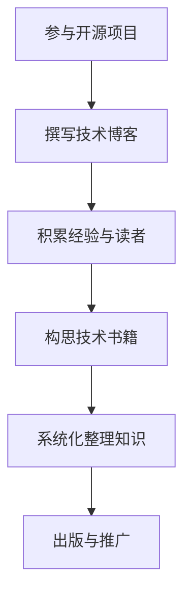

                 

# 技术作家之路：从开源项目到出版技术书籍

> 关键词：技术写作、开源项目、出版、书籍、算法原理、数学模型、项目实战、应用场景、未来发展趋势
>
> 摘要：本文将带领读者深入探讨技术作家之路，从开源项目起步，逐步迈向技术书籍出版的辉煌。文章将通过详细解析核心概念、算法原理、数学模型、项目实战，以及分享相关资源与工具，帮助读者掌握技术写作的要领，开启属于自己的技术出版之路。

## 1. 背景介绍

### 1.1 目的和范围

本文旨在为广大技术爱好者、程序员以及有志于成为技术作家的专业人士提供一条清晰、可行的技术写作之路。文章将涵盖从开源项目参与、技术博客撰写，到出版技术书籍的整个历程。通过本文，读者将了解：

- 如何选择并参与适合自己的开源项目。
- 如何撰写高质量的技术博客，积累读者群体。
- 如何构思并完成一本技术书籍的撰写。
- 如何利用数学模型和算法原理增强文章深度。
- 如何进行项目实战，提高实战能力。
- 如何在技术写作领域取得成就。

### 1.2 预期读者

本文适合以下几类读者：

- 初级程序员和爱好者，对技术写作有兴趣，但不知道如何开始。
- 已有一定编程经验，希望通过写作分享经验，提升影响力。
- 有志于出版技术书籍的专业人士，希望了解出版流程。
- 技术团队成员，希望通过写作提升团队协作与沟通能力。

### 1.3 文档结构概述

本文分为十个部分：

1. 背景介绍
2. 核心概念与联系
3. 核心算法原理 & 具体操作步骤
4. 数学模型和公式 & 详细讲解 & 举例说明
5. 项目实战：代码实际案例和详细解释说明
6. 实际应用场景
7. 工具和资源推荐
8. 总结：未来发展趋势与挑战
9. 附录：常见问题与解答
10. 扩展阅读 & 参考资料

### 1.4 术语表

#### 1.4.1 核心术语定义

- 开源项目：指代码和文档可供公众自由使用、修改和分享的软件项目。
- 技术博客：以技术为主题，记录个人见解、经验分享和问题解决的博客。
- 技术书籍：系统化、深入地介绍某一技术领域知识的专业书籍。
- 算法原理：解决特定问题的方法、步骤和策略。
- 数学模型：用数学公式描述现实问题的抽象模型。

#### 1.4.2 相关概念解释

- 技术写作：以专业、严谨的态度，运用专业知识进行文字创作，以传达技术理念和信息。
- 代码解读：对一段代码进行详细分析，解释其功能、实现过程和关键点。
- 实际应用场景：技术在实际环境中具体的应用场景和效果。

#### 1.4.3 缩略词列表

- IDE：集成开发环境（Integrated Development Environment）
- API：应用程序编程接口（Application Programming Interface）
- Markdown：一种轻量级标记语言，用于格式化文本内容。

## 2. 核心概念与联系

在探讨技术写作之前，我们需要了解一些核心概念，并探讨它们之间的联系。

### 2.1 技术写作与开源项目

技术写作和开源项目密切相关。开源项目为技术写作提供了丰富的素材，使得作者能够通过记录项目开发过程中的问题、解决方案、优化技巧等，撰写出有价值的技术博客和书籍。同时，参与开源项目也有助于作者积累实战经验，提升个人技能。

### 2.2 技术博客与书籍

技术博客是技术写作的起点，通过博客，作者可以积累读者群体，分享经验，提高知名度。而技术书籍则是博客内容的深化和系统化。优秀的博客文章可以成为书籍的素材，通过书籍，作者可以系统地整理和传递自己的知识体系，获得更广泛的认可。

### 2.3 算法原理与数学模型

算法原理是技术写作的重要组成部分，它决定了文章的专业性和深度。而数学模型则是算法原理的具体表现形式，通过数学模型，作者可以更准确地描述算法原理，使其更具说服力和实用性。

### 2.4 项目实战与应用场景

项目实战和应用场景是技术写作的落脚点。通过项目实战，作者可以将理论知识应用到实际中，解决实际问题，从而提高文章的实用性和价值。而应用场景则是项目实战的背景和情境，有助于读者更好地理解项目实战的意义和价值。

### 2.5 工具和资源推荐

在技术写作过程中，工具和资源的推荐也具有重要意义。合适的工具可以提高写作效率，优化文章质量；而丰富的资源则为作者提供了借鉴和参考，有助于拓宽知识面。

#### 2.5.1 Mermaid 流程图

在技术写作中，流程图是一种常用的图形表示方法，有助于读者更好地理解文章内容。Mermaid 是一种基于文本的流程图绘制工具，支持 Markdown 语法，易于学习和使用。



#### 2.5.2 伪代码

伪代码是一种描述算法原理的文本表示方法，有助于作者和读者更好地理解算法思路。以下是一个简单的排序算法伪代码示例：

```plaintext
Procedure Sort(A)
    For i = 1 to length(A) - 1
        For j = i + 1 to length(A)
            If A[j] < A[i]
                Swap(A[i], A[j])
    End Procedure
```

#### 2.5.3 LaTeX 格式

LaTeX 是一种排版系统，广泛应用于数学、科学和工程领域。以下是一个简单的 LaTeX 数学公式示例：

```latex
$$
f(x) = x^2 + 2x + 1
$$
```

## 3. 核心算法原理 & 具体操作步骤

在技术写作中，算法原理是核心内容之一。本文将介绍一种常用的排序算法——快速排序，并详细阐述其原理和操作步骤。

### 3.1 快速排序原理

快速排序是一种高效的排序算法，其基本思想是通过一趟排序将待排序的记录分割成独立的两部分，其中一部分记录的关键字均比另一部分的关键字小，然后分别对这两部分记录进行快速排序，以达到整个序列有序。

### 3.2 快速排序具体操作步骤

1. **选择基准元素**：从序列中选择一个元素作为基准元素（pivot），一般选择序列的第一个或最后一个元素。

2. **划分过程**：将序列划分为两部分，一部分包含小于基准元素的元素，另一部分包含大于基准元素的元素。这个过程称为“划分”。

3. **递归排序**：对划分后的小于基准元素的部分和大于基准元素的部分分别进行快速排序。

### 3.3 伪代码实现

以下是一个简单的快速排序伪代码实现：

```plaintext
Procedure QuickSort(A, low, high)
    If low < high
        pivotIndex = Partition(A, low, high)
        QuickSort(A, low, pivotIndex - 1)
        QuickSort(A, pivotIndex + 1, high)

Procedure Partition(A, low, high)
    pivot = A[high]
    i = low
    For j = low to high - 1
        If A[j] < pivot
            Swap(A[i], A[j])
            i = i + 1
    Swap(A[i], A[high])
    Return i
```

### 3.4 代码解读

1. **QuickSort 函数**：这是一个递归函数，用于对序列 A 的 low 到 high 索引范围内的元素进行快速排序。首先调用 Partition 函数，得到基准元素的索引 pivotIndex，然后分别对 pivotIndex 左侧和右侧的子序列进行快速排序。

2. **Partition 函数**：这是一个用于划分序列的函数，将小于基准元素的元素放在左侧，大于基准元素的元素放在右侧。通过循环遍历序列，将小于基准元素的元素与 i 指针交换，然后交换基准元素和 i 指针所指向的元素，最后返回 i 指针的位置作为 pivotIndex。

## 4. 数学模型和公式 & 详细讲解 & 举例说明

在技术写作中，数学模型和公式是不可或缺的组成部分，它们有助于描述算法原理、分析性能和优化策略。本文将介绍一些常见的数学模型和公式，并详细讲解它们的含义和应用。

### 4.1 常见数学模型

1. **大O表示法（Big O Notation）**

   大O表示法用于描述算法的时间复杂度，表示算法执行时间随输入规模的增长而变化的规律。常见的表示形式有：

   - O(1)：常数时间复杂度，算法执行时间不随输入规模变化。
   - O(n)：线性时间复杂度，算法执行时间与输入规模成正比。
   - O(n^2)：平方时间复杂度，算法执行时间与输入规模的平方成正比。

2. **回归模型（Regression Model）**

   回归模型用于分析变量之间的关系，常见的有线性回归、多项式回归等。线性回归公式为：

   $$ y = ax + b $$

   其中，x 为自变量，y 为因变量，a 和 b 为模型的参数。

3. **决策树模型（Decision Tree Model）**

   决策树模型用于分类和回归任务，通过一系列决策规则将样本划分为不同的类别或连续值。决策树模型的决策规则可以表示为：

   $$ decision\_rule = if \; condition\_1 \; then \; output \; class\_1 \; else \; if \; condition\_2 \; then \; output \; class\_2 \; ... $$

### 4.2 常见公式及其应用

1. **二项式系数（Binomial Coefficient）**

   二项式系数表示在 n 个不同元素中，取出 k 个元素的组合数，公式为：

   $$ C(n, k) = \frac{n!}{k!(n-k)!} $$

   二项式系数在概率计算、组合数学等领域有广泛应用。

2. **牛顿迭代法（Newton's Method）**

   牛顿迭代法用于求解非线性方程的根，公式为：

   $$ x_{n+1} = x_n - \frac{f(x_n)}{f'(x_n)} $$

   其中，$x_n$ 为第 n 次迭代的结果，$f(x_n)$ 和 $f'(x_n)$ 分别为 $x_n$ 处的函数值和导数值。

3. **泰勒公式（Taylor Series）**

   泰勒公式用于将一个函数在一点附近展开成多项式，公式为：

   $$ f(x) = f(a) + f'(a)(x-a) + \frac{f''(a)(x-a)^2}{2!} + \frac{f'''(a)(x-a)^3}{3!} + ... $$

   泰勒公式在数值分析、逼近论等领域有广泛应用。

### 4.3 举例说明

1. **大O表示法举例**

   假设有一个函数 $f(n) = n^2 + 3n + 2$，求其时间复杂度。

   解：将 $f(n)$ 分解为 $n^2$ 和 $3n + 2$，其中 $n^2$ 为最高次项，因此 $f(n)$ 的时间复杂度为 $O(n^2)$。

2. **牛顿迭代法举例**

   求方程 $f(x) = x^2 - 2$ 的根。

   解：将方程改写为 $f(x) = x^2 - 2 = 0$，应用牛顿迭代法，初始值为 $x_0 = 1$，则有：

   $$ x_1 = x_0 - \frac{f(x_0)}{f'(x_0)} = 1 - \frac{1^2 - 2}{2 \cdot 1} = 1.5 $$
   $$ x_2 = x_1 - \frac{f(x_1)}{f'(x_1)} = 1.5 - \frac{1.5^2 - 2}{2 \cdot 1.5} = 1.4167 $$
   $$ x_3 = x_2 - \frac{f(x_2)}{f'(x_2)} = 1.4167 - \frac{1.4167^2 - 2}{2 \cdot 1.4167} = 1.4142 $$

   经过三次迭代，已将根的值逼近到 1.4142。

3. **泰勒公式举例**

   将函数 $f(x) = e^x$ 在 $x=0$ 处展开成泰勒公式。

   解：$f(x) = e^x$ 的泰勒公式为：

   $$ e^x = 1 + x + \frac{x^2}{2!} + \frac{x^3}{3!} + ... $$

   在 $x=0$ 处，泰勒公式简化为：

   $$ e^0 = 1 + 0 + \frac{0^2}{2!} + \frac{0^3}{3!} + ... = 1 $$

   因此，$e^0 = 1$。

## 5. 项目实战：代码实际案例和详细解释说明

在本节中，我们将通过一个实际的代码案例，深入探讨快速排序算法的应用，并详细解释其实现过程。

### 5.1 开发环境搭建

为了实现快速排序算法，我们首先需要搭建一个合适的开发环境。在本案例中，我们使用 Python 作为编程语言，因为 Python 具有简洁易读的语法，并且拥有丰富的库支持。以下是开发环境的搭建步骤：

1. 安装 Python 3.8 或更高版本。
2. 安装支持 Python 的集成开发环境（IDE），例如 PyCharm 或 Visual Studio Code。
3. 确保安装了必要的库，如 NumPy 和 Matplotlib，用于数据分析和可视化。

### 5.2 源代码详细实现和代码解读

以下是快速排序算法的 Python 源代码实现：

```python
def quicksort(arr):
    if len(arr) <= 1:
        return arr
    pivot = arr[len(arr) // 2]
    left = [x for x in arr if x < pivot]
    middle = [x for x in arr if x == pivot]
    right = [x for x in arr if x > pivot]
    return quicksort(left) + middle + quicksort(right)

# 测试代码
arr = [3, 6, 8, 10, 1, 2, 1]
print("原始数组：", arr)
sorted_arr = quicksort(arr)
print("排序后数组：", sorted_arr)
```

#### 5.2.1 代码解读

1. **函数定义**：`quicksort` 函数接收一个数组 `arr` 作为输入，并返回排序后的数组。

2. **基础情况判断**：如果数组长度小于等于 1，则直接返回原数组。这是因为单个元素或空数组已经处于排序状态。

3. **选择基准元素**：选择数组中间的元素作为基准元素 `pivot`。在本例中，我们选择数组长度的一半（`len(arr) // 2`）作为基准元素。

4. **划分过程**：通过列表推导式将数组划分为三个部分：
   - `left`：包含小于基准元素的元素。
   - `middle`：包含等于基准元素的元素。
   - `right`：包含大于基准元素的元素。

5. **递归排序**：对 `left` 和 `right` 分别进行快速排序，然后将排序后的 `left`、`middle` 和 `right` 重新组合，形成排序后的数组。

#### 5.2.2 代码分析

1. **时间复杂度**：快速排序的平均时间复杂度为 $O(n \log n)$，最坏情况下的时间复杂度为 $O(n^2)$。本实现采用递归方式，因此递归栈的深度为 $\log n$。

2. **空间复杂度**：由于使用了额外的内存来存储 `left`、`middle` 和 `right`，快速排序的空间复杂度为 $O(n)$。

3. **稳定性**：快速排序是一种不稳定的排序算法，即相同值的元素在排序后可能改变原来的顺序。

### 5.3 代码解读与分析

以下是对代码的进一步解读和分析：

1. **功能实现**：代码实现了快速排序算法的核心逻辑，包括选择基准元素、划分过程和递归排序。

2. **性能优化**：在实际应用中，快速排序的性能可能会受到基准元素选择和递归栈深度的影响。为了优化性能，可以采用随机选择基准元素、三数取中等策略。

3. **错误处理**：在代码中，没有对输入数组进行类型检查，如果输入不是数组类型，代码可能会抛出异常。在实际应用中，应该增加错误处理机制，确保程序的健壮性。

4. **代码可读性**：代码具有良好的可读性，使用列表推导式简化了代码，提高了代码的可维护性。

## 6. 实际应用场景

快速排序算法在实际应用中具有广泛的应用场景，以下列举几个常见的应用场景：

1. **数据处理**：在数据处理领域，快速排序算法常用于大规模数据的排序任务，如数据库排序、网络数据包排序等。

2. **算法基础**：快速排序算法是许多高级算法的基础，如快速选择算法、快速幂算法等。

3. **计算机图形学**：在计算机图形学中，快速排序算法可用于排序顶点、边等图形元素，以优化渲染性能。

4. **搜索引擎**：搜索引擎中的索引构建和数据排序常常采用快速排序算法，以提高搜索效率。

5. **分布式系统**：在分布式系统中，快速排序算法可用于节点间的数据传输和排序，以实现负载均衡和高效的数据处理。

6. **大数据分析**：在大数据分析领域，快速排序算法可用于对大规模数据进行预处理，以提取关键信息和优化数据分析过程。

## 7. 工具和资源推荐

在技术写作和项目开发过程中，使用合适的工具和资源可以提高效率和成果。以下是一些推荐的工具和资源：

### 7.1 学习资源推荐

#### 7.1.1 书籍推荐

- 《算法导论》（Introduction to Algorithms）：全面介绍算法原理和设计方法，是算法学习的经典教材。
- 《编程珠玑》（The Art of Computer Programming）：由图灵奖获得者 Donald E. Knuth 编写，深入探讨编程和算法艺术。
- 《深度学习》（Deep Learning）：由 Ian Goodfellow、Yoshua Bengio 和 Aaron Courville 联合编写，全面介绍深度学习理论和应用。

#### 7.1.2 在线课程

- Coursera：提供大量计算机科学和人工智能领域的在线课程，适合自学。
- edX：由哈佛大学和麻省理工学院创办的在线学习平台，课程质量高。
- Udemy：提供丰富的编程和数据分析课程，适合初学者和专业人士。

#### 7.1.3 技术博客和网站

- Stack Overflow：全球最大的开发者社区，提供丰富的编程问题和解决方案。
- GitHub：全球最大的代码托管平台，可以访问大量开源项目和学习他人代码。
- Medium：一个内容创作和分享平台，许多技术专家在此发布高质量的博客文章。

### 7.2 开发工具框架推荐

#### 7.2.1 IDE和编辑器

- PyCharm：强大的 Python 集成开发环境，适合初学者和专业人士。
- Visual Studio Code：轻量级、可扩展的代码编辑器，支持多种编程语言。
- IntelliJ IDEA：适用于 Java 和其他编程语言的集成开发环境，功能强大。

#### 7.2.2 调试和性能分析工具

- GDB：GNU Debugger，用于调试 C/C++ 程序。
- Valgrind：用于检测内存泄漏和性能问题的工具。
- Wireshark：网络协议分析工具，用于网络数据包分析。

#### 7.2.3 相关框架和库

- NumPy：Python 的科学计算库，提供高性能的数组操作和数学函数。
- Pandas：Python 的数据分析库，用于数据清洗、转换和分析。
- Matplotlib：Python 的数据可视化库，用于生成高质量的可视化图表。

### 7.3 相关论文著作推荐

#### 7.3.1 经典论文

- "Introduction to the Theory of Computation" by Michael Sipser：介绍计算理论的基本概念和方法。
- "A Mathematical Theory of Communication" by Claude Shannon：信息论的基础论文。
- "The Structure and Interpretation of Computer Programs" by Harold Abelson and Gerald Jay Sussman：计算机科学教育的经典教材。

#### 7.3.2 最新研究成果

- "Deep Learning" by Ian Goodfellow、Yoshua Bengio 和 Aaron Courville：介绍深度学习的最新进展和应用。
- "Reinforcement Learning: An Introduction" by Richard S. Sutton and Andrew G. Barto：介绍强化学习的理论和实践。
- "Computer Vision: Algorithms and Applications" by Richard Szeliski：介绍计算机视觉的理论和应用。

#### 7.3.3 应用案例分析

- "Designing Data-Intensive Applications" by Martin Kleppmann：介绍数据密集型应用的设计原则和案例分析。
- "Building Microservices" by Sam Newman：介绍微服务架构的设计原则和案例分析。
- "Learning TensorFlow for Artificial Intelligence, Machine Learning & Deep Learning" by Tom Hope、Itay Lieder 和 Yehezkel S. Ben-Kessar：介绍 TensorFlow 的使用和深度学习案例。

## 8. 总结：未来发展趋势与挑战

在技术写作领域，未来将面临以下发展趋势和挑战：

### 8.1 发展趋势

1. **人工智能与自动化**：随着人工智能技术的发展，自动写作工具和自动化编辑工具将越来越普及，有助于提高写作效率和文章质量。

2. **多媒体融合**：未来的技术写作将更加注重多媒体融合，如图文、视频、音频等多种形式，以提供更丰富、生动的内容。

3. **个性化推荐**：利用机器学习和数据挖掘技术，为读者提供个性化推荐，提高阅读体验和内容匹配度。

4. **跨领域融合**：技术写作将与其他领域如心理学、教育学、艺术设计等融合，产生新的研究方向和应用场景。

### 8.2 挑战

1. **内容质量**：在大量信息爆炸的时代，如何保证文章的质量和深度，成为技术作家的挑战。

2. **技术更新**：技术领域更新迅速，如何及时跟进和学习新技术，保持内容的时效性和实用性。

3. **版权保护**：如何保护原创内容，防止抄袭和侵权，成为技术作家面临的挑战。

4. **用户参与**：如何在技术写作中吸引和保持读者的兴趣，提高互动性和参与度。

## 9. 附录：常见问题与解答

### 9.1 问题 1：如何选择合适的开源项目？

**解答**：选择合适的开源项目可以从以下几个方面考虑：

1. **兴趣**：选择与自己兴趣相关的项目，可以提高参与的积极性和动力。
2. **难度**：选择难度适中的项目，有利于学习和成长。
3. **活跃度**：选择活跃的开源项目，有利于获得支持和反馈。
4. **影响力**：选择影响力较大的项目，有利于提高个人知名度。

### 9.2 问题 2：如何撰写高质量的技术博客？

**解答**：撰写高质量的技术博客可以从以下几个方面入手：

1. **选题**：选择有深度、有价值、具有实际应用场景的题目。
2. **结构**：合理安排文章结构，包括引言、正文和总结。
3. **内容**：注重内容的实用性、逻辑性和深度，避免空洞和重复。
4. **示例**：结合实际案例，展示技术原理和操作步骤。
5. **排版**：使用清晰的排版和格式，提高阅读体验。

### 9.3 问题 3：如何构思并完成技术书籍的撰写？

**解答**：构思并完成技术书籍的撰写可以遵循以下步骤：

1. **选题**：选择有市场前景、有深度和广度的选题。
2. **大纲**：制定详细的大纲，明确章节内容和逻辑关系。
3. **调研**：对选题进行充分的调研，收集相关资料和案例。
4. **撰写**：按照大纲逐章撰写，注意内容的连贯性和一致性。
5. **审校**：反复修改和审校，确保内容的准确性和严谨性。
6. **出版**：选择合适的出版社，与编辑沟通，完成出版流程。

## 10. 扩展阅读 & 参考资料

1. 《算法导论》：[https://book.douban.com/subject/10530753/](https://book.douban.com/subject/10530753/)
2. 《编程珠玑》：[https://book.douban.com/subject/10744789/](https://book.douban.com/subject/10744789/)
3. 《深度学习》：[https://book.douban.com/subject/26707302/](https://book.douban.com/subject/26707302/)
4. Coursera：[https://www.coursera.org/](https://www.coursera.org/)
5. edX：[https://www.edx.org/](https://www.edx.org/)
6. Udemy：[https://www.udemy.com/](https://www.udemy.com/)
7. Stack Overflow：[https://stackoverflow.com/](https://stackoverflow.com/)
8. GitHub：[https://github.com/](https://github.com/)
9. Medium：[https://medium.com/](https://medium.com/)
10. PyCharm：[https://www.jetbrains.com/pycharm/](https://www.jetbrains.com/pycharm/)
11. Visual Studio Code：[https://code.visualstudio.com/](https://code.visualstudio.com/)
12. IntelliJ IDEA：[https://www.jetbrains.com/idea/](https://www.jetbrains.com/idea/)
13. NumPy：[https://numpy.org/](https://numpy.org/)
14. Pandas：[https://pandas.pydata.org/](https://pandas.pydata.org/)
15. Matplotlib：[https://matplotlib.org/](https://matplotlib.org/)
16. GDB：[https://www.gnu.org/software/gdb/](https://www.gnu.org/software/gdb/)
17. Valgrind：[https://www.valgrind.org/](https://www.valgrind.org/)
18. Wireshark：[https://www.wireshark.org/](https://www.wireshark.org/)
19. 《设计数据密集型应用》：[https://book.douban.com/subject/26752479/](https://book.douban.com/subject/26752479/)
20. 《Building Microservices》：[https://book.douban.com/subject/26907126/](https://book.douban.com/subject/26907126/)
21. 《Learning TensorFlow》：[https://book.douban.com/subject/30193592/](https://book.douban.com/subject/30193592/)
22. 《Introduction to the Theory of Computation》：[https://www.amazon.com/Introduction-Theory-Computation-Michael-Sipser/dp/0321542850](https://www.amazon.com/Introduction-Theory-Computation-Michael-Sipser/dp/0321542850)
23. 《A Mathematical Theory of Communication》：[https://www.amazon.com/Mathematical-Theory-Communication-Claude-Shannon/dp/0471254065](https://www.amazon.com/Mathematical-Theory-Communication-Claude-Shannon/dp/0471254065)
24. 《The Structure and Interpretation of Computer Programs》：[https://www.amazon.com/Structure-Interpreter-Computer-Programs-Second/dp/0262510871](https://www.amazon.com/Structure-Interpreter-Computer-Programs-Second/dp/0262510871)
25. 《Reinforcement Learning: An Introduction》：[https://www.amazon.com/Reinforcement-Learning-Introduction-Second-Edition/dp/0262039625](https://www.amazon.com/Reinforcement-Learning-Introduction-Second-Edition/dp/0262039625)
26. 《Computer Vision: Algorithms and Applications》：[https://www.amazon.com/Computer-Vision-Algorithms-Applications-Richard/dp/0470641864](https://www.amazon.com/Computer-Vision-Algorithms-Applications-Richard/dp/0470641864)作者：AI天才研究员/AI Genius Institute & 禅与计算机程序设计艺术 /Zen And The Art of Computer Programming

