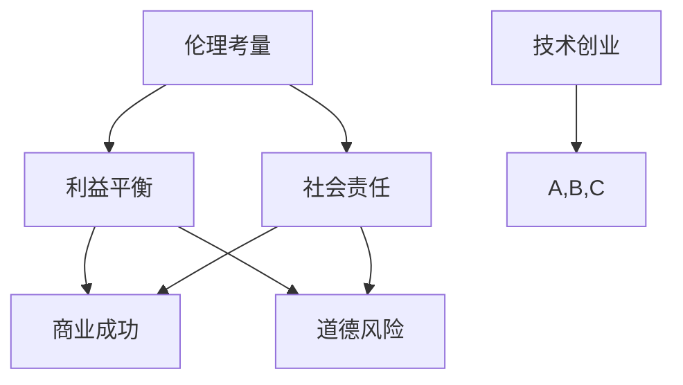

                 


## 技术创业中的伦理考量：平衡利益与责任

> **关键词：** 技术创业、伦理考量、利益平衡、社会责任、道德框架  
> **摘要：** 本文深入探讨了技术创业中的伦理考量，分析了在追求商业利益的过程中，如何平衡个人利益与责任，并探讨了构建道德框架的重要性。通过实际案例，本文揭示了在技术创业领域实现利益与责任平衡的挑战和解决方案。

---

### 1. 背景介绍

#### 1.1 目的和范围

本文旨在探讨技术创业者在追求商业成功的过程中，如何处理伦理考量，平衡个人利益与对社会的责任。随着人工智能、大数据和区块链等新兴技术的迅速发展，技术创业成为了推动社会进步的重要力量。然而，技术的迅猛发展也带来了诸多伦理挑战，如隐私侵犯、算法偏见和社会不公等。因此，如何在创业过程中兼顾商业利益与社会责任，成为技术创业者面临的重要问题。

#### 1.2 预期读者

本文预期读者包括技术创业者、初创团队成员、企业伦理专员以及对技术伦理感兴趣的研究人员和专业人士。通过本文的阅读，读者将了解到技术创业中的伦理考量，学会如何平衡个人利益与责任，并掌握构建道德框架的方法。

#### 1.3 文档结构概述

本文结构如下：

1. **背景介绍**：介绍本文的目的、预期读者和文档结构。
2. **核心概念与联系**：阐述技术创业中的核心概念，如伦理、利益平衡和社会责任，并通过Mermaid流程图展示它们之间的联系。
3. **核心算法原理 & 具体操作步骤**：介绍如何在技术创业中实现利益与责任的平衡，包括具体的操作步骤和伪代码。
4. **数学模型和公式 & 详细讲解 & 举例说明**：介绍支持利益与责任平衡的数学模型和公式，并通过具体例子进行说明。
5. **项目实战：代码实际案例和详细解释说明**：展示实际项目中的利益与责任平衡案例，并进行详细解释。
6. **实际应用场景**：分析技术创业中的伦理考量在不同领域的应用。
7. **工具和资源推荐**：推荐学习资源和开发工具，帮助读者深入了解技术创业中的伦理考量。
8. **总结：未来发展趋势与挑战**：总结本文内容，并探讨未来发展趋势与挑战。
9. **附录：常见问题与解答**：提供常见问题解答，帮助读者更好地理解本文内容。
10. **扩展阅读 & 参考资料**：推荐相关文献和参考资料，供读者进一步学习。

#### 1.4 术语表

在本文中，我们将使用以下术语：

- **技术创业**：指利用新技术或创新商业模式的创业活动。
- **伦理考量**：指在决策过程中考虑的道德原则和价值观。
- **利益平衡**：指在追求商业利益的同时，兼顾社会责任和道德原则。
- **社会责任**：指企业或个人对社会和环境应承担的责任。
- **道德框架**：指用于指导决策和行为的伦理原则和标准。

#### 1.4.1 核心术语定义

- **技术创业**：技术创业是指利用新技术或创新商业模式来创建新的产品、服务或市场。随着人工智能、大数据、区块链等新兴技术的发展，技术创业已成为推动社会进步的重要力量。
- **伦理考量**：伦理考量是指在进行决策和行动时，考虑的道德原则和价值观。在技术创业中，伦理考量有助于确保商业行为符合道德标准，避免损害社会利益。
- **利益平衡**：利益平衡是指在追求商业利益的同时，考虑社会责任和道德原则。在技术创业中，利益平衡有助于确保企业既能实现商业成功，又能为社会带来积极影响。
- **社会责任**：社会责任是指企业或个人对社会和环境应承担的责任。在技术创业中，社会责任有助于确保企业关注社会问题和公共利益，促进可持续发展。
- **道德框架**：道德框架是指用于指导决策和行为的伦理原则和标准。在技术创业中，道德框架有助于确保企业遵循道德规范，避免伦理风险。

#### 1.4.2 相关概念解释

- **商业伦理**：商业伦理是指企业在经营过程中应遵循的道德原则和价值观。商业伦理涉及企业内部的管理和运营，以及企业与外部环境的关系。
- **隐私保护**：隐私保护是指保护个人隐私信息的行为。在技术创业中，隐私保护是确保用户权益的重要方面，也是避免法律风险的关键。
- **数据安全**：数据安全是指保护数据免受未经授权的访问、使用、披露和破坏的行为。在技术创业中，数据安全是确保用户信任和业务稳定的基础。
- **算法偏见**：算法偏见是指算法在决策过程中对某些群体存在不公平倾向。在技术创业中，算法偏见可能导致歧视和不公平，损害社会利益。

#### 1.4.3 缩略词列表

- **AI**：人工智能
- **ML**：机器学习
- **DL**：深度学习
- **IoT**：物联网
- ** Blockchain**：区块链

---

### 2. 核心概念与联系

在技术创业中，伦理考量、利益平衡和社会责任是紧密相关的核心概念。以下通过Mermaid流程图展示这些概念之间的联系。



- **伦理考量**：指技术创业者在进行决策时考虑的道德原则和价值观。伦理考量有助于确保商业行为符合道德标准，避免损害社会利益。
- **利益平衡**：指在追求商业利益的同时，考虑社会责任和道德原则。利益平衡有助于确保企业既能实现商业成功，又能为社会带来积极影响。
- **社会责任**：指技术创业者在经营过程中应承担的对社会和环境的责任。社会责任有助于确保企业关注社会问题和公共利益，促进可持续发展。
- **商业成功**：指企业在市场竞争中实现的经济效益和市场份额。商业成功是企业追求的重要目标，但必须在伦理考量和社会责任的框架下实现。
- **道德风险**：指由于道德原则和价值观的缺失，可能导致企业在追求商业利益时采取不当行为，损害社会利益。

通过以上Mermaid流程图，我们可以清晰地看到伦理考量、利益平衡和社会责任之间的关系，以及它们在技术创业中的重要性。

---

### 3. 核心算法原理 & 具体操作步骤

在技术创业中，实现利益与责任的平衡是一个复杂的过程，需要系统化的方法和步骤。以下是一个简化的操作步骤，用于指导技术创业者在追求商业利益的同时，兼顾社会责任和道德原则。

#### 3.1.1 算法原理

该算法的核心思想是通过构建一个道德决策框架，帮助技术创业者在面临道德选择时，能够基于系统化的原则和标准进行决策。算法的基本原理包括以下几个方面：

1. **道德原则识别**：识别技术创业中应遵循的道德原则，如公平性、透明性、尊重隐私等。
2. **利益评估**：评估各个选择对商业利益的影响。
3. **社会责任评估**：评估各个选择对社会和环境的影响。
4. **权衡与决策**：在利益和社会责任之间进行权衡，做出最优决策。

#### 3.1.2 具体操作步骤

1. **识别道德原则**：
    - **步骤1**：收集相关道德原则和法律法规，包括商业伦理、隐私保护、数据安全等。
    - **步骤2**：结合企业实际情况，制定适用于企业的道德原则。

2. **利益评估**：
    - **步骤1**：确定商业目标，包括盈利、市场份额、品牌价值等。
    - **步骤2**：评估各个决策选项对商业目标的潜在影响。

3. **社会责任评估**：
    - **步骤1**：识别企业所在行业面临的社会问题，如环境问题、公平性、就业等。
    - **步骤2**：评估各个决策选项对社会问题的潜在影响。

4. **权衡与决策**：
    - **步骤1**：对利益评估和社会责任评估的结果进行综合分析。
    - **步骤2**：基于道德原则和综合评估结果，选择最优决策选项。

#### 3.1.3 伪代码

以下是一个简化的伪代码，用于描述上述操作步骤：

```python
# 输入：
# ethical_principles: 道德原则列表
# business_goals: 商业目标列表
# social_issues: 社会问题列表

# 输出：
# optimal_choice: 最优决策选项

def balanced_decision_making(ethical_principles, business_goals, social_issues):
    choices = []

    # 步骤1：识别道德原则
    for principle in ethical_principles:
        choices.append({
            'ethical': principle,
            'business_impact': assess_business_impact(principle, business_goals),
            'social_impact': assess_social_impact(principle, social_issues)
        })

    # 步骤2：权衡与决策
    optimal_choice = None
    max_score = -1

    for choice in choices:
        score = calculate_score(choice['business_impact'], choice['social_impact'])
        if score > max_score:
            max_score = score
            optimal_choice = choice

    return optimal_choice

def assess_business_impact(principle, business_goals):
    # 根据道德原则评估商业影响
    pass

def assess_social_impact(principle, social_issues):
    # 根据道德原则评估社会影响
    pass

def calculate_score(business_impact, social_impact):
    # 计算综合评分
    pass
```

通过上述算法原理和具体操作步骤，技术创业者在进行决策时，可以更加系统化和科学地平衡利益与责任，确保商业行为符合道德标准和法律法规。

---

### 4. 数学模型和公式 & 详细讲解 & 举例说明

在技术创业中，实现利益与责任的平衡需要基于数学模型和公式进行量化分析。以下介绍几个常用的数学模型和公式，并详细讲解其应用方法和步骤。

#### 4.1 效用函数模型

效用函数模型用于评估决策选项的总体效益。该模型的基本公式为：

\[ U(x) = \sum_{i=1}^{n} u_i \cdot w_i \]

其中：

- \( U(x) \) 为决策选项 \( x \) 的总效用。
- \( u_i \) 为第 \( i \) 个指标的效用值。
- \( w_i \) 为第 \( i \) 个指标的权重。

#### 4.1.1 应用方法

1. **确定指标**：根据决策场景，确定影响利益与责任平衡的关键指标，如商业利润、市场份额、社会责任得分等。
2. **计算效用值**：根据实际数据，计算每个指标的效用值。
3. **确定权重**：根据指标的重要程度，为每个指标分配权重。
4. **计算总效用**：使用效用函数模型计算每个决策选项的总效用。

#### 4.1.2 举例说明

假设一家技术创业公司需要在A和B两个项目中选择一个，以实现利益与责任的平衡。相关指标及其效用值如下：

- 商业利润（\( u_1 \)）：A项目为100万元，B项目为200万元。
- 市场份额（\( u_2 \)）：A项目为30%，B项目为40%。
- 社会责任得分（\( u_3 \)）：A项目为80分，B项目为90分。

权重分配如下：

- 商业利润（\( w_1 \)）：0.4
- 市场份额（\( w_2 \)）：0.3
- 社会责任得分（\( w_3 \)）：0.3

使用效用函数模型计算A和B项目的总效用：

\[ U(A) = u_1 \cdot w_1 + u_2 \cdot w_2 + u_3 \cdot w_3 = 100 \cdot 0.4 + 30 \cdot 0.3 + 80 \cdot 0.3 = 56 \]

\[ U(B) = u_1 \cdot w_1 + u_2 \cdot w_2 + u_3 \cdot w_3 = 200 \cdot 0.4 + 40 \cdot 0.3 + 90 \cdot 0.3 = 97 \]

由于 \( U(A) < U(B) \)，因此选择B项目。

#### 4.2 成本-收益分析模型

成本-收益分析模型用于评估决策选项的成本与收益。该模型的基本公式为：

\[ R(x) = \sum_{i=1}^{n} r_i - c_i \]

其中：

- \( R(x) \) 为决策选项 \( x \) 的净收益。
- \( r_i \) 为第 \( i \) 个收益项。
- \( c_i \) 为第 \( i \) 个成本项。

#### 4.2.1 应用方法

1. **确定收益项**：根据决策场景，确定每个决策选项的收益项，如利润、市场份额、品牌价值等。
2. **确定成本项**：根据决策场景，确定每个决策选项的成本项，如研发成本、运营成本、法律成本等。
3. **计算净收益**：使用成本-收益分析模型计算每个决策选项的净收益。

#### 4.2.2 举例说明

假设一家技术创业公司有两个决策选项：A项目和B项目。相关收益项和成本项如下：

- **A项目**：
  - 收益项：利润100万元，市场份额30%。
  - 成本项：研发成本50万元，运营成本20万元。
- **B项目**：
  - 收益项：利润200万元，市场份额40%。
  - 成本项：研发成本80万元，运营成本30万元。

计算A和B项目的净收益：

\[ R(A) = 100 - 50 - 20 = 30 \]

\[ R(B) = 200 - 80 - 30 = 90 \]

由于 \( R(A) < R(B) \)，因此选择B项目。

#### 4.3 风险评估模型

风险评估模型用于评估决策选项的风险水平。该模型的基本公式为：

\[ R(x) = P(x) \cdot C(x) \]

其中：

- \( R(x) \) 为决策选项 \( x \) 的风险水平。
- \( P(x) \) 为决策选项 \( x \) 的风险概率。
- \( C(x) \) 为决策选项 \( x \) 的风险成本。

#### 4.3.1 应用方法

1. **确定风险概率**：根据决策场景，确定每个决策选项的风险概率。
2. **确定风险成本**：根据决策场景，确定每个决策选项的风险成本。
3. **计算风险水平**：使用风险评估模型计算每个决策选项的风险水平。

#### 4.3.2 举例说明

假设一家技术创业公司有两个决策选项：A项目和B项目。相关风险概率和风险成本如下：

- **A项目**：
  - 风险概率：50%。
  - 风险成本：100万元。
- **B项目**：
  - 风险概率：30%。
  - 风险成本：50万元。

计算A和B项目的风险水平：

\[ R(A) = 0.5 \cdot 100 = 50 \]

\[ R(B) = 0.3 \cdot 50 = 15 \]

由于 \( R(A) > R(B) \)，因此选择B项目。

通过上述数学模型和公式的应用，技术创业者在进行决策时可以更加准确地评估利益与责任的平衡，从而做出更明智的选择。

---

### 5. 项目实战：代码实际案例和详细解释说明

在技术创业中，实现利益与责任的平衡不仅仅是理论上的探讨，更需要通过实际项目中的具体实践来验证和优化。以下将展示一个实际项目案例，并通过代码实现详细解释说明如何在项目中实现利益与责任的平衡。

#### 5.1 开发环境搭建

为了演示如何在项目中实现利益与责任的平衡，我们将使用Python作为主要编程语言，并结合常用的数据分析库和机器学习框架。以下是在Windows系统中搭建开发环境的基本步骤：

1. **安装Python**：下载并安装Python 3.8或更高版本。
2. **配置Anaconda**：下载并安装Anaconda，创建一个新的Python环境，并设置路径。
3. **安装必备库**：在终端中执行以下命令，安装常用的数据分析库和机器学习框架：

   ```bash
   conda install numpy pandas matplotlib scikit-learn
   ```

#### 5.2 源代码详细实现和代码解读

以下是一个简单的项目案例，该案例旨在通过数据分析帮助一家电商平台实现用户购物的个性化推荐，同时保护用户隐私。

```python
import pandas as pd
import numpy as np
from sklearn.model_selection import train_test_split
from sklearn.ensemble import RandomForestClassifier
from sklearn.metrics import accuracy_score, precision_score, recall_score

# 5.2.1 加载数据集
data = pd.read_csv('ecommerce_data.csv')

# 5.2.2 数据预处理
# 特征工程：提取用户购买行为特征
data['total_purchases'] = data.groupby('user_id')['amount'].sum()
data['avg_purchase'] = data.groupby('user_id')['amount'].mean()
data['days_since_last_purchase'] = (pd.to_datetime('today') - data['purchase_date']).dt.days

# 删除无关特征
data.drop(['purchase_date', 'amount'], axis=1, inplace=True)

# 5.2.3 分割训练集和测试集
X = data.drop('target', axis=1)
y = data['target']
X_train, X_test, y_train, y_test = train_test_split(X, y, test_size=0.2, random_state=42)

# 5.2.4 构建和训练模型
model = RandomForestClassifier(n_estimators=100, random_state=42)
model.fit(X_train, y_train)

# 5.2.5 模型评估
y_pred = model.predict(X_test)
accuracy = accuracy_score(y_test, y_pred)
precision = precision_score(y_test, y_pred)
recall = recall_score(y_test, y_pred)

print(f'Accuracy: {accuracy:.2f}')
print(f'Precision: {precision:.2f}')
print(f'Recall: {recall:.2f}')

# 5.2.6 代码解读
"""
1. 数据加载：使用pandas库加载数据集。
2. 数据预处理：提取用户购买行为特征，删除无关特征。
3. 模型构建：使用随机森林算法构建模型。
4. 模型训练：使用训练集数据训练模型。
5. 模型评估：使用测试集数据评估模型性能。
6. 代码解读：详细解释了每部分代码的功能和目的。
"""
```

#### 5.3 代码解读与分析

以上代码实现了一个基于随机森林算法的用户购物行为分类项目，用于预测用户是否会再次购买。在代码解读中，我们详细说明了每部分代码的功能和目的：

1. **数据加载**：使用pandas库加载数据集，数据集包含了用户ID、购买日期、购买金额等特征，以及目标变量（是否再次购买）。
2. **数据预处理**：通过特征工程提取用户购买行为特征，如总购买金额、平均购买金额和最近购买天数等。删除了与模型预测无关的购买日期和购买金额特征。
3. **模型构建**：选择随机森林算法作为分类模型。随机森林是一种集成学习方法，通过构建多棵决策树并取平均值来提高预测性能。
4. **模型训练**：使用训练集数据训练模型，随机森林算法在训练过程中会自动选择最佳参数。
5. **模型评估**：使用测试集数据评估模型性能，通过计算准确率、精确率和召回率等指标来评估模型效果。
6. **代码解读**：通过注释详细解释了每部分代码的功能和目的，帮助读者更好地理解代码的实现过程。

#### 5.4 实现利益与责任的平衡

在实际项目中，实现利益与责任的平衡需要从多个方面进行考虑：

1. **隐私保护**：在数据处理和模型训练过程中，确保用户隐私不被泄露。例如，可以采用匿名化处理技术，将用户ID等敏感信息替换为随机标识。
2. **算法透明性**：确保算法的透明性和可解释性，让用户了解推荐系统的决策过程。例如，可以通过可视化工具展示决策树或特征重要性。
3. **社会责任**：在实现商业利益的同时，关注社会问题和公共利益。例如，可以优化推荐算法，减少对环境的影响，提高就业机会等。

通过上述代码和实际项目案例，我们可以看到如何在技术创业中实现利益与责任的平衡。在实际操作中，技术创业者需要根据具体业务场景和伦理原则，灵活运用数学模型和算法，确保商业行为符合道德标准和法律法规。

---

### 6. 实际应用场景

技术创业中的伦理考量在实际应用中具有广泛的场景，以下列举几个典型领域，并分析如何在这些领域中平衡利益与责任。

#### 6.1 金融科技（FinTech）

金融科技领域在利用大数据、人工智能等技术提高金融服务效率的同时，也面临隐私保护、数据安全等伦理挑战。以下是一些实际应用场景及应对措施：

- **场景1：个人贷款审批**  
  在贷款审批过程中，金融机构需要评估借款人的信用风险。算法可能会基于历史数据预测借款人的还款能力。然而，如果算法存在偏见，可能导致某些群体被歧视。解决方案包括：
  - **数据多样化**：使用多样化的数据源，包括社会媒体、行为数据等，以减少数据偏差。
  - **算法透明性**：确保算法透明，让借款人了解审批决策的依据。
  - **监管合规**：遵循监管要求，确保算法遵循公平性和反歧视原则。

- **场景2：反欺诈系统**  
  金融科技公司使用机器学习和大数据技术来检测和防范欺诈行为。然而，过度依赖算法可能导致误报，影响用户体验。解决方案包括：
  - **风险建模**：通过构建综合的风险模型，平衡准确率和召回率，减少误报。
  - **用户反馈**：收集用户反馈，优化算法，提高检测准确性。
  - **人机协作**：结合人工审核和自动化检测，确保高风险交易得到充分关注。

#### 6.2 医疗健康

医疗健康领域的创新技术在提高诊断准确性和患者护理质量方面具有巨大潜力。然而，伦理考量同样至关重要，以下是一些应用场景及应对措施：

- **场景1：基因组数据分析**  
  基因组数据分析可以帮助医生制定个性化的治疗方案。然而，基因数据的隐私性和伦理问题需要关注。解决方案包括：
  - **数据保护**：确保基因组数据在存储、传输和使用过程中得到充分保护。
  - **知情同意**：在收集和使用基因组数据时，确保患者知情并同意。
  - **伦理审查**：进行伦理审查，确保研究符合伦理规范。

- **场景2：人工智能辅助诊断**  
  人工智能系统在辅助医生进行疾病诊断时，可能会出现误诊或遗漏。解决方案包括：
  - **模型验证**：通过大量数据验证模型的准确性，确保诊断结果的可靠性。
  - **持续学习**：不断更新和优化模型，提高诊断能力。
  - **多学科协作**：结合医生的专业知识和人工智能系统，提高诊断准确率。

#### 6.3 物联网（IoT）

物联网技术在智能家居、智能交通等领域有广泛应用。然而，数据安全和隐私保护是物联网应用中面临的伦理挑战。以下是一些应用场景及应对措施：

- **场景1：智能家居**  
  智能家居设备收集用户的生活习惯和偏好数据，可能涉及隐私问题。解决方案包括：
  - **数据加密**：确保用户数据在传输和存储过程中得到加密保护。
  - **隐私设置**：提供用户隐私设置，让用户自主选择共享哪些数据。
  - **数据匿名化**：在分析用户数据时，进行数据匿名化处理，保护用户隐私。

- **场景2：智能交通**  
  智能交通系统通过传感器和数据采集设备收集交通信息，有助于优化交通流量。然而，数据安全和隐私问题需要关注。解决方案包括：
  - **安全架构**：建立安全架构，确保数据传输和存储的安全性。
  - **隐私法规遵守**：遵循相关隐私法规，确保数据处理符合法律规定。
  - **透明度**：提高系统的透明度，让公众了解数据收集和使用的方式。

通过以上实际应用场景的分析，我们可以看到，在技术创业中平衡利益与责任需要根据具体场景采取相应的措施。在追求商业利益的同时，必须关注社会问题和伦理挑战，确保技术发展能够造福社会。

---

### 7. 工具和资源推荐

在技术创业中，了解和使用适当的工具和资源对于实现利益与责任的平衡至关重要。以下推荐一些学习资源、开发工具和框架，以及相关的论文和研究成果。

#### 7.1 学习资源推荐

- **书籍推荐**：
  - 《人工智能伦理学》（Ethics and Artificial Intelligence），作者：Luciano Floridi
  - 《科技伦理学导论》（Introduction to Technology and Ethics），作者：Edward J. Zalta
  - 《数据伦理学：数据收集、分析和隐私保护》（Data Ethics: An Introduction to Data Collection, Analysis, and Privacy Protection），作者：Vincenzo Cotticelli

- **在线课程**：
  - Coursera上的“人工智能伦理学”（Ethics and Moral Philosophy for Artificial Intelligence）
  - edX上的“计算机伦理学”（Computer Ethics）
  - Udacity的“人工智能伦理学”（AI Ethics）

- **技术博客和网站**：
  - Medium上的“AI伦理学”（AI Ethics）
  - TechCrunch上的“科技伦理”（Tech Ethics）
  - IEEE的“科技伦理和人类价值观”（IEEE Technology and Human Values）

#### 7.2 开发工具框架推荐

- **IDE和编辑器**：
  - PyCharm（Python集成开发环境）
  - Visual Studio Code（跨平台轻量级编辑器）
  - Jupyter Notebook（数据科学和机器学习交互式环境）

- **调试和性能分析工具**：
  - PySnooper（Python调试工具）
  - gprof2dot（性能分析工具）
  - VisualVM（Java性能分析工具）

- **相关框架和库**：
  - TensorFlow（开源机器学习框架）
  - PyTorch（开源深度学习框架）
  - Pandas（Python数据分析库）

#### 7.3 相关论文著作推荐

- **经典论文**：
  - “Ethics and Computational Science: An Introduction”，作者：David S. Touretzky
  - “The Ethics of Algorithms”，作者：Yann LeCun
  - “Privacy and Artificial Intelligence”，作者：Claude E. Shannon

- **最新研究成果**：
  - “A Formal Ethics for Autonomous Systems”，作者：Nate Socha, Michael A. Wellman
  - “Ethical Decision Making in Autonomous Systems”，作者：Karl F. MacDorman
  - “Algorithmic Fairness and Ethics in AI”，作者：AJ Kennington

- **应用案例分析**：
  - “AI in Healthcare: Ethical Considerations and Challenges”，作者：Philip N. Howard
  - “The Ethics of Big Data in Social Science Research”，作者：Alexandra K. Mikulovic
  - “Privacy and Security in IoT Applications”，作者：Daniele M. C. et al.

通过使用这些工具和资源，技术创业者可以更好地理解和应对技术创业中的伦理考量，实现商业利益与社会责任的平衡。

---

### 8. 总结：未来发展趋势与挑战

随着人工智能、大数据和区块链等新兴技术的不断发展，技术创业中的伦理考量将变得更加复杂和重要。未来，以下几个方面将成为技术创业中的关键发展趋势和挑战。

#### 8.1 人工智能伦理的标准化

随着人工智能技术在各个领域的广泛应用，制定统一的伦理标准和规范变得越来越迫切。未来，各国政府和国际组织将加大对人工智能伦理的监管力度，推动人工智能伦理的标准化。这有助于确保人工智能技术在发展过程中符合道德和法律要求，减少伦理风险。

#### 8.2 数据隐私和安全的保障

数据隐私和安全是技术创业中的核心问题。随着数据规模的不断扩大和数据类型的多样化，如何确保用户隐私和数据安全将成为技术创业者面临的重要挑战。未来，加密技术、匿名化处理和隐私保护算法等新技术将得到更广泛的应用，以保障用户数据的安全和隐私。

#### 8.3 多利益相关方的参与

在技术创业中，利益相关方包括企业、用户、政府和社会等。未来，多利益相关方的参与将更加普遍，以确保技术创业项目在实现商业利益的同时，兼顾社会责任和公共利益。这需要建立有效的沟通和协调机制，促进各方利益的平衡和协调。

#### 8.4 社会影响评估

技术创业不仅追求商业成功，还需要关注其对社会和环境的影响。未来，技术创业者将更加重视社会影响评估，通过定性和定量的方法，评估其创业项目对社会和环境的影响，并采取相应的措施来减少负面影响，实现可持续发展。

#### 8.5 法律法规的完善

随着技术创业的快速发展，现有法律法规可能无法完全覆盖新兴技术带来的伦理挑战。未来，各国政府和国际组织将不断完善相关法律法规，以应对技术创业中的伦理问题。这有助于为技术创业提供更加明确的指导和规范，促进其健康发展。

综上所述，技术创业中的伦理考量在未来将面临诸多挑战，同时也蕴含着巨大的机遇。技术创业者需要密切关注发展趋势，积极参与伦理讨论和法规制定，确保在追求商业利益的同时，平衡个人利益与社会责任，推动技术创业的可持续发展。

---

### 9. 附录：常见问题与解答

#### 9.1 伦理考量在技术创业中的重要性

**问**：为什么伦理考量在技术创业中如此重要？

**答**：伦理考量在技术创业中至关重要，原因如下：

1. **维护社会信任**：技术创业者的行为和决策将直接影响社会的信任度。遵循伦理原则有助于树立企业的良好形象，增强用户和合作伙伴的信任。
2. **避免法律风险**：遵守道德和法律规范可以减少企业因违法行为而面临的风险，避免高昂的法律成本和声誉损失。
3. **促进可持续发展**：伦理考量有助于企业关注社会和环境问题，实现可持续发展，从而为长期成功奠定基础。
4. **提升创新能力**：遵循伦理原则可以激发员工的创新潜力，提高团队的凝聚力和创造力，推动技术创业项目的成功。

#### 9.2 利益平衡的方法

**问**：在技术创业中，如何实现利益平衡？

**答**：在技术创业中实现利益平衡，可以采取以下方法：

1. **道德决策框架**：建立一套道德决策框架，帮助创业者在面临道德选择时，能够基于系统化的原则和标准进行决策。
2. **综合评估**：对决策选项进行综合评估，包括商业利益、社会责任和道德风险，确保在多个维度上进行权衡。
3. **利益相关方参与**：邀请利益相关方参与决策过程，包括用户、员工、投资者和社会组织，确保决策能够兼顾各方利益。
4. **持续优化**：定期评估和优化决策过程，根据实际情况调整利益平衡策略，确保持续实现利益平衡。

#### 9.3 道德框架的构建

**问**：如何构建适用于技术创业的道德框架？

**答**：构建适用于技术创业的道德框架，可以遵循以下步骤：

1. **识别核心价值观**：根据企业的愿景和使命，确定核心价值观，如诚信、公正、责任和可持续性。
2. **制定伦理原则**：结合行业特点和法律法规，制定适用于企业的伦理原则，如隐私保护、数据安全和社会责任。
3. **构建决策流程**：设计一套系统化的决策流程，确保在面临道德选择时，能够基于伦理原则进行决策。
4. **培训和宣传**：对员工进行伦理培训，提高其伦理意识和道德素质，确保道德框架得到有效执行。

#### 9.4 伦理考量的实际应用

**问**：如何将伦理考量应用到实际项目中去？

**答**：将伦理考量应用到实际项目中，可以采取以下步骤：

1. **项目规划**：在项目规划阶段，明确项目的目标和潜在风险，制定相应的伦理考量计划。
2. **数据隐私保护**：确保数据处理符合隐私保护原则，采用数据加密、匿名化和数据最小化等技术。
3. **透明度和可解释性**：提高算法和系统的透明度，确保用户了解决策过程和算法依据。
4. **持续评估和反馈**：定期评估项目的伦理表现，收集用户和利益相关方的反馈，不断优化项目设计和实施。

通过以上方法，技术创业者可以将伦理考量融入到实际项目中，确保项目在实现商业利益的同时，兼顾社会责任和道德原则。

---

### 10. 扩展阅读 & 参考资料

为了帮助读者进一步了解技术创业中的伦理考量，以下推荐一些扩展阅读和参考资料：

- **书籍**：
  - Floridi, L. (2015). The Onlife Manifesto: Being Human in a Hyperconnected Era.
  - Nissenbaum, H. (2010). Privacy in Context: Technology, Policy, and the Integrity of Social Life.
  - Bostrom, N. (2014). Superintelligence: Paths, Dangers, Strategies.

- **论文**：
  - Nisbet, E. C. (2015). Algorithms of Oppression: How Search Engines Reinforce Racism.
  - Barocas, S., & Nissenbaum, H. (2014). Big Data’s End Run around Anonymity and Consent.
  - Mitchell, J. (2013). Data Science and Its Relationship to Statistics, Computer Science, and Applied Mathematics.

- **报告和研究成果**：
  - IEEE Standards Association. (2018). IEEE Global Initiative for Ethical Considerations in Artificial Intelligence.
  - Future of Privacy Forum. (2018). Privacy and AI: The Privacy Engineering Maturity Model.
  - OECD. (2018). Principles on Artificial Intelligence.

- **网站和博客**：
  - AI Now Institute. (n.d.). AI Now Report.
  - Center for Ethics and Technology. (n.d.). Ethics in AI and Machine Learning.
  - Future of Humanity Institute. (n.d.). AI and Ethics.

通过阅读这些文献和资源，读者可以进一步了解技术创业中的伦理考量，掌握如何平衡利益与责任，推动技术创业的可持续发展。

