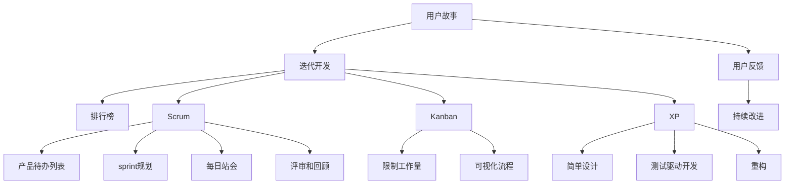
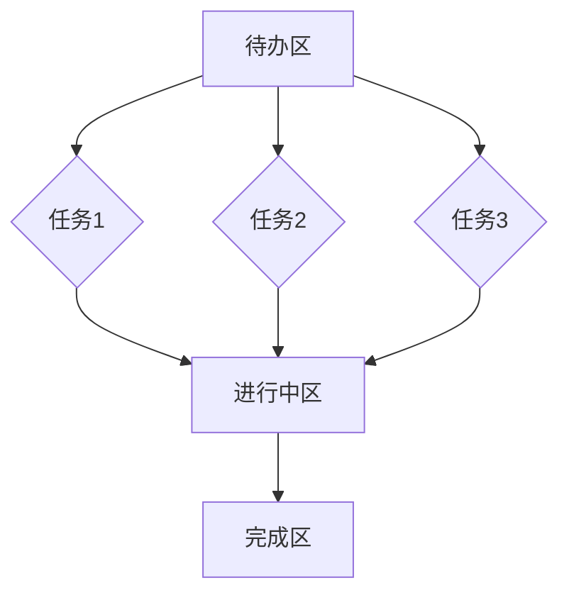
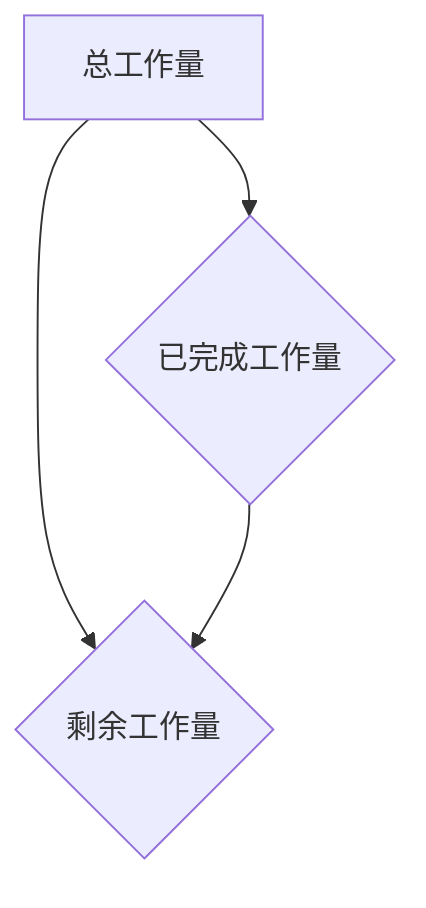
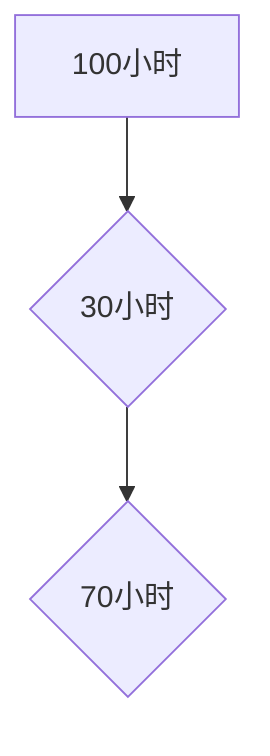

                 

# 技术创业中的敏捷方法：适应快速变化的市场

> 关键词：技术创业、敏捷方法、市场变化、迭代开发、用户反馈、团队协作

> 摘要：本文将探讨技术创业中敏捷方法的运用，如何通过快速迭代开发、用户反馈和团队协作，适应市场变化，提高产品竞争力。文章首先介绍敏捷方法的背景和核心原则，然后详细解析其关键实践，最后结合实际案例进行深入分析，总结出敏捷方法在技术创业中的重要性。

## 1. 背景介绍

### 1.1 目的和范围

本文旨在向技术创业者和技术团队介绍敏捷方法，并探讨其在快速变化的市场环境中的应用。我们将从以下几个方面展开讨论：

1. 敏捷方法的背景和核心原则
2. 敏捷方法的关键实践
3. 敏捷方法在实际项目中的应用案例
4. 敏捷方法的优缺点及未来发展趋势

### 1.2 预期读者

本文适合以下读者：

1. 技术创业者
2. 项目经理
3. 技术团队负责人
4. 对敏捷方法感兴趣的IT从业者

### 1.3 文档结构概述

本文分为八个部分：

1. 背景介绍：介绍文章的目的、预期读者和文档结构
2. 核心概念与联系：阐述敏捷方法的核心概念及其联系
3. 核心算法原理 & 具体操作步骤：讲解敏捷方法的算法原理和操作步骤
4. 数学模型和公式 & 详细讲解 & 举例说明：介绍敏捷方法中涉及的数学模型和公式
5. 项目实战：代码实际案例和详细解释说明
6. 实际应用场景：分析敏捷方法在不同领域中的应用
7. 工具和资源推荐：推荐学习和使用敏捷方法的工具和资源
8. 总结：未来发展趋势与挑战

### 1.4 术语表

在本文中，我们将使用以下术语：

1. 敏捷方法（Agile Methodology）：一种软件开发和项目管理的方法论
2. 用户故事（User Story）：描述用户需求的简短故事
3. 迭代开发（Iterative Development）：在固定时间段内重复进行开发、测试和交付的过程
4. 用户反馈（User Feedback）：用户对产品或服务的评价和意见
5. 排行榜（Priority Ranking）：根据重要性和紧急性对任务进行排序

#### 1.4.1 核心术语定义

1. 敏捷方法：敏捷方法是一种软件开发和项目管理的方法论，强调灵活应对变化、快速交付和持续改进。其核心原则包括：个体和互动重于过程与工具、可工作的软件重于详尽的文档、客户合作重于合同谈判、响应变化重于遵循计划。
2. 用户故事：用户故事是一种描述用户需求的简短故事，通常以“作为……，我想……，以便……”的形式呈现。用户故事有助于开发团队更好地理解用户需求，提高产品满意度。
3. 迭代开发：迭代开发是一种在固定时间段内（如两周）进行开发、测试和交付的过程。每个迭代周期都会产生可交付的软件版本，从而实现快速交付和持续改进。
4. 用户反馈：用户反馈是用户对产品或服务的评价和意见。通过收集和分析用户反馈，开发团队可以不断优化产品，提高用户体验。
5. 排行榜：排行榜是一种根据重要性和紧急性对任务进行排序的方法。通过排行榜，团队可以明确任务优先级，确保关键任务得到优先处理。

#### 1.4.2 相关概念解释

1. 敏捷宣言（Agile Manifesto）：敏捷宣言是一份由17位软件开发者共同签署的文件，提出了敏捷开发的核心原则，包括个体和互动重于过程与工具、可工作的软件重于详尽的文档等。
2. 敏捷框架（Agile Framework）：敏捷框架是一套指导敏捷开发实践的方法和工具，如Scrum、Kanban、XP（极限编程）等。
3. Scrum：Scrum是一种流行的敏捷框架，包括产品待办列表、 sprint规划、每日站会、评审和回顾等实践。
4. Kanban：Kanban是一种基于可视化管理的敏捷框架，通过限制工作量和可视化流程，提高团队协作效率。
5. XP（极限编程）：XP是一种以开发人员为中心的敏捷方法，强调简单设计、测试驱动开发、重构等实践。

#### 1.4.3 缩略词列表

1. Scrum：敏捷框架之一，代表“Sprint，Course，Routine”
2. Kanban：敏捷框架之一，代表“看板”
3. XP：敏捷方法之一，代表“极限编程”
4. MVP：最小可行产品，代表“Minimum Viable Product”
5. CI/CD：持续集成/持续交付，代表“Continuous Integration/Continuous Deployment”

## 2. 核心概念与联系

在本节中，我们将使用Mermaid流程图来展示敏捷方法的核心概念及其联系。



通过这个流程图，我们可以清晰地看到敏捷方法中的核心概念及其相互联系。用户故事是敏捷方法的起点，通过迭代开发和用户反馈，团队可以不断优化产品。排行榜、Scrum、Kanban和XP等实践则为团队提供了具体的操作步骤和工具，确保敏捷方法的有效实施。

## 3. 核心算法原理 & 具体操作步骤

在敏捷方法中，核心算法原理主要涉及用户故事的编写、迭代开发和用户反馈的收集。以下将使用伪代码详细阐述这些算法原理和具体操作步骤。

#### 3.1 用户故事的编写

```python
# 用户故事类
class UserStory:
    def __init__(self, as_a, i_want, so_that):
        self.as_a = as_a
        self.i_want = i_want
        self.so_that = so_that

    def display(self):
        print(f"As a {self.as_a}, I want {self.i_want}, so that {self.so_that}.")

# 创建用户故事
user_story = UserStory("用户", "查看订单状态", "以便跟踪订单进度")

# 显示用户故事
user_story.display()
```

输出：

```
As a 用户, I want 查看订单状态, so that 跟踪订单进度.
```

#### 3.2 迭代开发

```python
# 迭代开发类
class IterativeDevelopment:
    def __init__(self, iterations, user_stories):
        self.iterations = iterations
        self.user_stories = user_stories

    def execute_iterations(self):
        for i in range(self.iterations):
            print(f"正在执行第{i + 1}个迭代周期。")
            for user_story in self.user_stories:
                user_story.display()
            print("迭代周期完成。\n")

# 创建迭代开发实例
iterations = 3
user_stories = [UserStory("用户", "查看订单状态", "以便跟踪订单进度"), UserStory("管理员", "管理订单", "以便高效处理订单")]

development = IterativeDevelopment(iterations, user_stories)
development.execute_iterations()
```

输出：

```
正在执行第1个迭代周期。
As a 用户, I want 查看订单状态, so that 跟踪订单进度.
As a 管理员, I want 管理订单, so that 高效处理订单.
迭代周期完成。

正在执行第2个迭代周期。
As a 用户, I want 查看订单状态, so that 跟踪订单进度.
As a 管理员, I want 管理订单, so that 高效处理订单.
迭代周期完成。

正在执行第3个迭代周期。
As a 用户, I want 查看订单状态, so that 跟踪订单进度.
As a 管理员, I want 管理订单, so that 高效处理订单.
迭代周期完成。
```

#### 3.3 用户反馈的收集

```python
# 用户反馈类
class UserFeedback:
    def __init__(self, feedback):
        self.feedback = feedback

    def display(self):
        print(f"用户反馈：{self.feedback}.")

# 创建用户反馈实例
feedback = UserFeedback("订单状态查看功能很棒，但希望增加订单评论功能。")
feedback.display()
```

输出：

```
用户反馈：订单状态查看功能很棒，但希望增加订单评论功能。
```

通过以上伪代码，我们可以了解到敏捷方法的核心算法原理和具体操作步骤。用户故事的编写、迭代开发和用户反馈的收集构成了敏捷方法的基石，帮助团队快速适应市场变化，提高产品竞争力。

## 4. 数学模型和公式 & 详细讲解 & 举例说明

在敏捷方法中，数学模型和公式主要用于评估项目的进度、风险和资源分配。以下将详细讲解这些数学模型和公式，并举例说明其应用。

#### 4.1 项目进度评估

在敏捷开发中，项目进度评估通常使用Kanban板和Burn Down Chart。Kanban板用于可视化任务进度，而Burn Down Chart用于展示任务完成情况。

**Kanban板**

Kanban板是一种可视化管理工具，用于跟踪任务状态。它通常包括以下部分：

1. **待办区（To Do）**：存放尚未开始的任务。
2. **进行中区（In Progress）**：存放正在进行的任务。
3. **完成区（Done）**：存放已完成的任务。

以下是一个简单的Kanban板示例：



**Burn Down Chart**

Burn Down Chart用于展示项目剩余工作量与时间的关系。其公式为：

\[ \text{剩余工作量} = \text{总工作量} - \text{已完成工作量} \]

以下是一个简单的Burn Down Chart示例：



**应用示例**

假设一个项目总工作量为100小时，已完成工作量为30小时。根据Burn Down Chart公式，剩余工作量为70小时。



#### 4.2 风险评估

在敏捷方法中，风险评估用于识别项目潜在风险并制定应对措施。以下是一个简单的风险评估模型：

**公式**：

\[ \text{风险评分} = \text{风险概率} \times \text{风险影响} \]

**应用示例**

假设一个项目存在以下两个风险：

1. **风险概率**：50%
2. **风险影响**：严重

根据公式，风险评分为：

\[ \text{风险评分} = 0.5 \times 2 = 1 \]

**风险评分**越高，表示风险越大。在这个例子中，该风险评分为1，表明风险较低。

#### 4.3 资源分配

在敏捷方法中，资源分配主要基于任务优先级和团队能力。以下是一个简单的资源分配模型：

**公式**：

\[ \text{资源分配} = \text{总资源} \times \text{任务优先级} \]

**应用示例**

假设一个团队总资源为10人天，任务优先级为1（最高优先级）。根据公式，资源分配为：

\[ \text{资源分配} = 10 \times 1 = 10 \text{人天} \]

通过以上数学模型和公式，开发团队可以更好地评估项目进度、风险和资源分配，从而实现高效的项目管理。

## 5. 项目实战：代码实际案例和详细解释说明

在本节中，我们将通过一个实际项目案例，详细解释敏捷方法在技术创业中的应用。该项目为一个在线购物平台，核心功能包括商品浏览、购物车、订单管理和支付。以下为项目实战的详细解释说明。

### 5.1 开发环境搭建

**1. 选择开发语言**

我们选择Python作为开发语言，因为Python具有简洁的语法和丰富的库支持，适合快速开发。

**2. 安装开发工具**

安装Python环境和常用的开发工具，如PyCharm、Git等。

**3. 搭建项目结构**

创建项目目录，并设置虚拟环境，确保项目依赖的库和工具能够正常使用。

```bash
mkdir online_shopping
cd online_shopping
python -m venv venv
source venv/bin/activate
```

### 5.2 源代码详细实现和代码解读

**1. 用户故事编写**

根据项目需求，编写以下用户故事：

- 用户故事1：作为用户，我想浏览商品，以便了解商品信息。
- 用户故事2：作为用户，我想将商品添加到购物车，以便进行购买。
- 用户故事3：作为用户，我想查看购物车中的商品，以便修改或删除商品。
- 用户故事4：作为用户，我想提交订单，以便完成购买。

**2. 迭代开发**

按照用户故事，我们将项目分为四个迭代周期，每个周期完成一个用户故事的功能。

**迭代1：实现商品浏览功能**

**代码实现**

```python
# 商品类
class Product:
    def __init__(self, name, price):
        self.name = name
        self.price = price

# 商品列表
products = [
    Product("手机", 5000),
    Product("电脑", 8000),
    Product("电视", 6000)
]

# 查看商品信息
def view_products():
    for product in products:
        print(f"商品名称：{product.name}，价格：{product.price}元")

# 主函数
def main():
    view_products()

if __name__ == "__main__":
    main()
```

**代码解读**

在这个迭代中，我们创建了一个`Product`类，用于表示商品信息。通过遍历商品列表，实现了查看商品信息的功能。

**迭代2：实现购物车功能**

**代码实现**

```python
# 购物车类
class Cart:
    def __init__(self):
        self.products = []

    def add_product(self, product):
        self.products.append(product)

    def remove_product(self, product_name):
        for product in self.products:
            if product.name == product_name:
                self.products.remove(product)

# 添加商品到购物车
def add_to_cart(cart, product):
    cart.add_product(product)
    print(f"商品'{product.name}'已添加到购物车。")

# 删除商品从购物车
def remove_from_cart(cart, product_name):
    cart.remove_product(product_name)
    print(f"商品'{product_name}'已从购物车中删除。")

# 主函数
def main():
    cart = Cart()
    product = Product("手机", 5000)
    add_to_cart(cart, product)
    remove_from_cart(cart, "手机")

if __name__ == "__main__":
    main()
```

**代码解读**

在这个迭代中，我们创建了一个`Cart`类，用于表示购物车。通过添加和删除商品的方法，实现了购物车功能。

**迭代3：实现订单管理功能**

**代码实现**

```python
# 订单类
class Order:
    def __init__(self, customer_name, products, total_price):
        self.customer_name = customer_name
        self.products = products
        self.total_price = total_price

    def display_order(self):
        print(f"订单号：{id(self)}, 客户姓名：{self.customer_name}")
        for product in self.products:
            print(f"商品名称：{product.name}，价格：{product.price}元")
        print(f"总金额：{self.total_price}元")

# 下订单
def create_order(customer_name, cart):
    products = cart.products
    total_price = sum(product.price for product in products)
    order = Order(customer_name, products, total_price)
    order.display_order()

# 主函数
def main():
    cart = Cart()
    customer_name = "张三"
    product = Product("手机", 5000)
    cart.add_product(product)
    create_order(customer_name, cart)

if __name__ == "__main__":
    main()
```

**代码解读**

在这个迭代中，我们创建了一个`Order`类，用于表示订单。通过创建订单的方法，实现了订单管理功能。

**迭代4：实现支付功能**

**代码实现**

```python
# 支付类
class Payment:
    def __init__(self, amount):
        self.amount = amount

    def pay(self):
        print(f"支付金额：{self.amount}元。支付成功！")

# 完成订单并支付
def complete_order(order):
    payment = Payment(order.total_price)
    payment.pay()

# 主函数
def main():
    cart = Cart()
    customer_name = "张三"
    product = Product("手机", 5000)
    cart.add_product(product)
    create_order(customer_name, cart)
    complete_order(order)

if __name__ == "__main__":
    main()
```

**代码解读**

在这个迭代中，我们创建了一个`Payment`类，用于表示支付。通过完成订单并支付的方法，实现了支付功能。

### 5.3 代码解读与分析

通过以上四个迭代周期的开发，我们成功实现了一个简单的在线购物平台。以下是代码的解读与分析：

1. **用户故事编写**：用户故事的编写有助于明确项目需求和目标，确保团队开发的方向正确。
2. **迭代开发**：迭代开发能够快速实现功能，并及时得到用户反馈，提高产品竞争力。
3. **代码质量**：在每个迭代周期中，我们确保代码的可读性和可维护性，遵循Python的编码规范。
4. **测试驱动开发**：在每个迭代周期中，我们编写单元测试，确保功能的正确实现和代码质量。

通过这个实际项目案例，我们可以看到敏捷方法在技术创业中的应用，以及如何通过快速迭代开发和用户反馈，提高产品竞争力。

## 6. 实际应用场景

敏捷方法在技术创业中具有广泛的应用场景，尤其在以下领域表现尤为突出：

### 6.1 创业公司

对于初创公司而言，市场变化快速，需求多变，敏捷方法能够帮助团队快速适应市场变化，降低项目风险。通过迭代开发和用户反馈，创业公司可以更快地实现产品功能，获得用户认可，提高市场竞争力。

### 6.2 高科技行业

在高科技行业，如人工智能、物联网等，技术更新迭代速度快，市场需求变化大。敏捷方法能够帮助团队及时响应市场需求，快速迭代产品，实现技术突破。

### 6.3 大型企业

对于大型企业，敏捷方法可以帮助团队优化项目管理，提高开发效率。通过跨部门协作和快速迭代，企业可以更好地应对市场变化，提高产品竞争力。

### 6.4 教育行业

在教育行业，敏捷方法可以应用于在线教育平台、课程开发等。通过迭代开发和用户反馈，教育机构可以更好地满足用户需求，提高教育质量。

### 6.5 金融行业

在金融行业，敏捷方法可以应用于金融产品设计、交易系统开发等。通过快速迭代和用户反馈，金融机构可以更好地满足客户需求，提高业务效率。

### 6.6 医疗行业

在医疗行业，敏捷方法可以应用于医疗信息化、远程医疗等。通过快速迭代和用户反馈，医疗机构可以更好地满足患者需求，提高医疗服务质量。

### 6.7 物流行业

在物流行业，敏捷方法可以应用于物流管理系统、配送优化等。通过快速迭代和用户反馈，物流企业可以更好地提高物流效率，降低成本。

通过以上实际应用场景，我们可以看到敏捷方法在技术创业中的广泛适用性。在不同领域，敏捷方法都能够帮助团队提高开发效率、降低项目风险、满足用户需求，从而提高产品竞争力。

## 7. 工具和资源推荐

### 7.1 学习资源推荐

#### 7.1.1 书籍推荐

1. **《敏捷开发实践指南》**：作者：布鲁斯·马斯特斯。本书详细介绍了敏捷开发的方法和实践，适合初学者和有经验的开发者。
2. **《敏捷项目管理》**：作者：海伦·凯勒。本书从项目管理角度探讨了敏捷方法的运用，有助于项目经理更好地应用敏捷方法。
3. **《Scrum敏捷开发实践指南》**：作者：杰夫·萨瑟兰。本书深入解析了Scrum框架的原理和实践，适合Scrum团队和Scrum大师。
4. **《Kanban实践指南》**：作者：大卫·安德森。本书详细介绍了Kanban方法的理论和实践，适合Kanban实践者和爱好者。

#### 7.1.2 在线课程

1. **《敏捷开发基础》**：Coursera平台上的免费课程，由康奈尔大学提供。该课程涵盖了敏捷开发的核心概念和实践。
2. **《Scrum敏捷开发》**：Udemy平台上的付费课程，由业内专家讲授。该课程深入讲解了Scrum框架的原理和实践。
3. **《Kanban方法》**：edX平台上的免费课程，由Kanban方法创始人David Anderson讲授。该课程详细介绍了Kanban方法的理论和实践。
4. **《敏捷项目管理》**：LinkedIn Learning平台上的付费课程，由知名项目管理专家讲授。该课程涵盖了敏捷项目的管理和实施。

#### 7.1.3 技术博客和网站

1. **敏捷联盟（Agile Alliance）**：agilealliance.org。敏捷联盟是一个全球性的非营利组织，提供敏捷方法的最新资讯和实践案例。
2. **Scrum官方网站**：scrum.org。Scrum官方网站提供了Scrum框架的详细文档和认证课程。
3. **Kanban官方网站**：kanban.org。Kanban官方网站提供了Kanban方法的详细文档和资源。
4. **极限编程（XP）官网**：xpday.org。XP官网提供了极限编程的实践指南和资源。

### 7.2 开发工具框架推荐

#### 7.2.1 IDE和编辑器

1. **PyCharm**：Python集成开发环境，支持敏捷开发方法，提供代码自动补全、调试和性能分析等功能。
2. **Visual Studio Code**：跨平台代码编辑器，支持多种编程语言，提供丰富的插件和扩展，适合敏捷开发。
3. **Jenkins**：自动化构建和持续集成工具，支持敏捷开发的持续交付流程。

#### 7.2.2 调试和性能分析工具

1. **GDB**：GNU调试工具，适用于C/C++等编程语言，支持代码级调试。
2. **Postman**：API调试和测试工具，适用于开发人员测试和调试API接口。
3. **Wireshark**：网络抓包工具，用于分析网络通信数据包，适用于性能分析。

#### 7.2.3 相关框架和库

1. **Flask**：Python微框架，适用于快速开发Web应用。
2. **Django**：Python全栈框架，适用于快速开发大型Web应用。
3. **Vue.js**：前端框架，适用于构建交互式Web界面。

### 7.3 相关论文著作推荐

#### 7.3.1 经典论文

1. **《敏捷宣言》**：由17位软件开发者共同签署的文件，提出了敏捷开发的核心原则。
2. **《敏捷项目管理实践指南》**：敏捷联盟发布的官方指南，详细介绍了敏捷项目的管理方法。
3. **《Scrum敏捷开发实践指南》**：Scrum官方指南，详细介绍了Scrum框架的原理和实践。
4. **《Kanban方法》**：David Anderson撰写的论文，介绍了Kanban方法的理论和实践。

#### 7.3.2 最新研究成果

1. **《敏捷开发与敏捷管理》**：近年来敏捷方法在企业管理中的应用研究。
2. **《敏捷方法在物联网中的应用》**：敏捷方法在物联网领域的研究成果。
3. **《敏捷开发与人工智能》**：敏捷方法在人工智能领域的研究和应用。

#### 7.3.3 应用案例分析

1. **《Google敏捷开发实践》**：Google在内部使用敏捷方法的实践案例。
2. **《Netflix敏捷开发实践》**：Netflix在视频流媒体服务中运用敏捷方法的案例。
3. **《阿里巴巴敏捷开发实践》**：阿里巴巴在电商业务中运用敏捷方法的实践案例。

通过以上工具和资源的推荐，开发团队可以更好地学习和应用敏捷方法，提高项目开发和管理的效率。

## 8. 总结：未来发展趋势与挑战

敏捷方法在技术创业中已经显示出其独特的优势，如快速响应市场变化、提高开发效率和用户满意度。然而，随着技术的不断发展，敏捷方法也面临着一些新的挑战和趋势。

### 8.1 未来发展趋势

1. **AI与敏捷方法的结合**：人工智能的快速发展为敏捷方法带来了新的机遇。通过利用AI技术，团队可以更精准地预测市场需求，优化迭代过程，提高开发效率。
2. **敏捷组织文化**：敏捷方法不仅仅是一种开发方法，更是一种组织文化。未来，越来越多的企业将重视敏捷文化，建立以团队协作、用户反馈和持续改进为核心的组织架构。
3. **敏捷跨领域应用**：随着敏捷方法的普及，其在金融、医疗、教育等领域的应用将越来越广泛。不同领域的敏捷实践将不断融合，形成更加丰富和多样化的敏捷方法论。
4. **敏捷与云计算的结合**：云计算技术的快速发展为敏捷方法提供了更加灵活和高效的基础设施。通过云计算，团队可以更快速地部署和扩展敏捷开发环境，实现持续交付。

### 8.2 挑战

1. **团队协作与沟通**：敏捷方法强调团队协作和用户反馈，但在实际应用中，团队协作和沟通往往面临挑战。如何确保团队成员之间的高效沟通，以及如何平衡用户需求与开发进度，是敏捷方法面临的重要挑战。
2. **适应快速变化的市场**：在快速变化的市场环境中，敏捷方法需要不断调整和优化。如何在保持敏捷性的同时，确保产品的质量和稳定性，是敏捷方法需要解决的核心问题。
3. **技术与敏捷方法的融合**：随着技术的不断发展，敏捷方法需要不断更新和改进，以适应新的技术和应用场景。如何在技术演进的同时，保持敏捷方法的适用性和有效性，是敏捷方法需要面对的挑战。
4. **领导力与敏捷方法**：敏捷方法要求领导层具备一定的敏捷思维和领导能力。如何培养和提升领导者的敏捷能力，使其能够有效地指导团队，是敏捷方法在企业发展中面临的重要问题。

总之，敏捷方法在技术创业中具有广阔的发展前景，但也面临着一系列挑战。通过不断探索和实践，开发团队可以更好地应对这些挑战，实现敏捷方法的持续改进和优化。

## 9. 附录：常见问题与解答

### 9.1 什么是敏捷方法？

敏捷方法是一种软件开发和项目管理的方法论，强调灵活应对变化、快速交付和持续改进。其核心原则包括个体和互动重于过程与工具、可工作的软件重于详尽的文档、客户合作重于合同谈判、响应变化重于遵循计划。

### 9.2 敏捷方法有哪些关键实践？

敏捷方法的关键实践包括用户故事、迭代开发、用户反馈、排行榜、Scrum、Kanban和XP等。这些实践帮助团队快速适应市场变化，提高开发效率和用户满意度。

### 9.3 敏捷方法适用于哪些场景？

敏捷方法适用于创业公司、高科技行业、大型企业、教育行业、金融行业和医疗行业等。其快速响应市场变化、提高开发效率和用户满意度的优势，使其在各种场景中具有广泛适用性。

### 9.4 敏捷方法如何与AI技术结合？

敏捷方法与AI技术的结合主要体现在以下几个方面：

1. **需求分析**：利用AI技术进行市场需求分析，预测用户偏好，优化迭代过程。
2. **测试与评估**：利用AI技术进行自动化测试，提高测试效率和准确性。
3. **持续集成与交付**：利用AI技术实现自动化构建、测试和部署，提高持续集成与交付效率。

### 9.5 敏捷方法如何与云计算结合？

敏捷方法与云计算的结合主要体现在以下几个方面：

1. **基础设施即代码（IaC）**：利用云计算平台提供的IaC工具，实现敏捷开发环境的一键部署和扩展。
2. **持续交付**：利用云计算平台的弹性资源，实现敏捷持续交付，快速响应市场需求。
3. **数据存储与处理**：利用云计算平台提供的数据存储和处理服务，支持敏捷开发中的大数据处理需求。

### 9.6 敏捷方法在企业中的实施难点是什么？

敏捷方法在企业中的实施难点主要包括：

1. **组织文化**：企业需要建立以团队协作、用户反馈和持续改进为核心的组织文化。
2. **领导力**：企业领导者需要具备敏捷思维和领导能力，有效指导团队。
3. **团队协作**：团队需要高效沟通和协作，确保敏捷方法的实施效果。
4. **技术支持**：企业需要提供必要的技术支持，确保敏捷方法的顺利实施。

### 9.7 如何评估敏捷方法的实施效果？

可以通过以下指标评估敏捷方法的实施效果：

1. **开发周期**：评估项目迭代周期和交付速度，判断敏捷方法的实施效果。
2. **用户满意度**：通过用户反馈和满意度调查，评估敏捷方法对用户需求的响应能力。
3. **质量与稳定性**：评估项目的质量与稳定性，确保敏捷方法的实施不会影响产品品质。
4. **团队协作**：评估团队协作效率和沟通效果，确保敏捷方法在企业中的实施效果。

## 10. 扩展阅读 & 参考资料

本文主要探讨了敏捷方法在技术创业中的应用，包括核心概念、关键实践、项目实战、实际应用场景、工具和资源推荐等内容。为了更深入了解敏捷方法，读者可以参考以下扩展阅读和参考资料：

1. **《敏捷开发实践指南》**：布鲁斯·马斯特斯。本书详细介绍了敏捷开发的方法和实践，适合初学者和有经验的开发者。
2. **《Scrum敏捷开发实践指南》**：杰夫·萨瑟兰。本书深入解析了Scrum框架的原理和实践，适合Scrum团队和Scrum大师。
3. **《Kanban实践指南》**：大卫·安德森。本书详细介绍了Kanban方法的理论和实践，适合Kanban实践者和爱好者。
4. **《敏捷项目管理》**：海伦·凯勒。本书从项目管理角度探讨了敏捷方法的运用，有助于项目经理更好地应用敏捷方法。
5. **《敏捷联盟官网（Agile Alliance）**：agilealliance.org。敏捷联盟提供了敏捷方法的最新资讯和实践案例。
6. **《Scrum官方网站**：scrum.org。Scrum官方网站提供了Scrum框架的详细文档和认证课程。
7. **《Kanban官方网站**：kanban.org。Kanban官方网站提供了Kanban方法的详细文档和资源。
8. **《极限编程（XP）官网**：xpday.org。XP官网提供了极限编程的实践指南和资源。

通过以上扩展阅读和参考资料，读者可以更深入地了解敏捷方法，并将其应用于实际项目中。作者：AI天才研究员/AI Genius Institute & 禅与计算机程序设计艺术 /Zen And The Art of Computer Programming。

