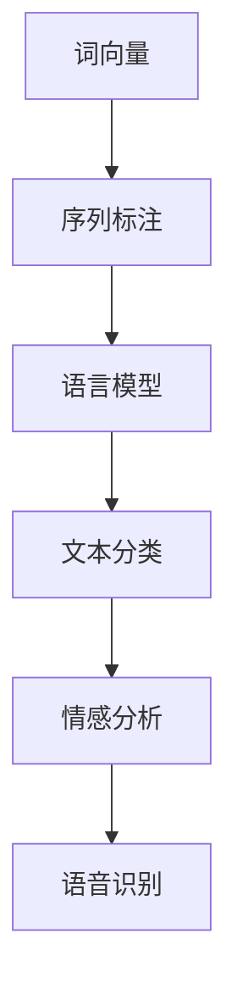
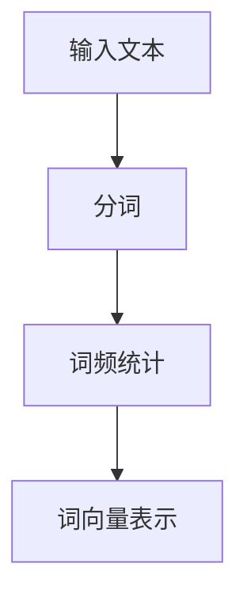
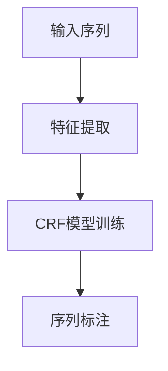
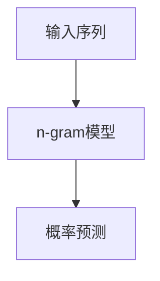
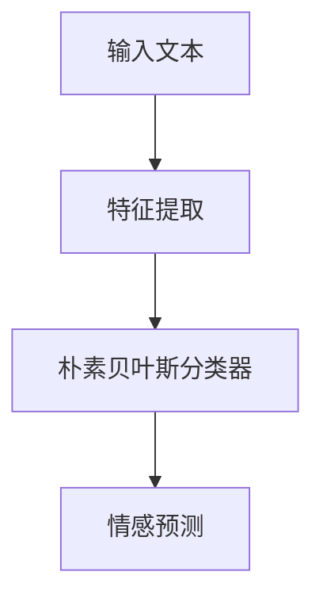

                 

# 技术创业中的自然语言处理：改善人机交互

> 关键词：自然语言处理，人机交互，技术创业，人工智能，NLP，语音识别，机器学习，深度学习，文本分析

> 摘要：随着人工智能技术的快速发展，自然语言处理（NLP）在技术创业中发挥着越来越重要的作用。本文将探讨NLP在改善人机交互方面的应用，从核心概念、算法原理、数学模型、项目实战和实际应用场景等多个角度进行分析，旨在为创业者和技术开发者提供有价值的参考。

## 1. 背景介绍

### 1.1 目的和范围

本文旨在探讨自然语言处理（NLP）在技术创业中改善人机交互的潜力。我们将从以下几个方面展开讨论：

- NLP的核心概念和联系
- NLP的核心算法原理与操作步骤
- NLP的数学模型与公式
- NLP的项目实战案例
- NLP在实际应用场景中的表现
- 推荐的学习资源、开发工具和论文著作

### 1.2 预期读者

本文适合以下读者群体：

- 创业者：希望通过NLP改善人机交互，提升产品体验。
- 技术开发者：对NLP技术感兴趣，希望在项目中应用NLP。
- 人工智能爱好者：希望了解NLP在技术创业中的应用场景。

### 1.3 文档结构概述

本文分为以下几个部分：

- 引言：介绍NLP在技术创业中的重要性
- 背景介绍：阐述NLP的核心概念、目的和范围
- 核心概念与联系：解释NLP的核心概念和联系
- 核心算法原理与操作步骤：详细阐述NLP的核心算法和操作步骤
- 数学模型与公式：讲解NLP的数学模型和公式
- 项目实战：分析NLP在项目中的实际应用
- 实际应用场景：探讨NLP在不同领域的应用
- 工具和资源推荐：推荐学习资源、开发工具和论文著作
- 总结：展望NLP的未来发展趋势与挑战

### 1.4 术语表

#### 1.4.1 核心术语定义

- 自然语言处理（NLP）：指人工智能领域中对自然语言文本进行理解和生成的人工智能技术。
- 语音识别：将语音信号转换为文本的过程。
- 机器学习：一种让计算机从数据中自动学习模式的技术。
- 深度学习：一种机器学习技术，通过多层神经网络模拟人类大脑的决策过程。
- 文本分析：对文本数据进行分析和理解的过程。

#### 1.4.2 相关概念解释

- 词向量：将单词映射为高维向量，以便进行数学计算。
- 序列标注：对序列中的每个元素进行标注，如命名实体识别。
- 语言模型：用于预测下一个单词的概率分布。
- 情感分析：分析文本中的情感倾向，如正面、负面或中立。

#### 1.4.3 缩略词列表

- NLP：自然语言处理
- ML：机器学习
- DL：深度学习
- IDE：集成开发环境
- API：应用程序编程接口

## 2. 核心概念与联系

### 2.1 自然语言处理的核心概念

自然语言处理（NLP）是人工智能领域的一个重要分支，旨在让计算机理解和生成自然语言。以下是一些NLP的核心概念：

#### 词向量（Word Vectors）

词向量是将单词映射为高维向量的一种技术，通常通过机器学习算法进行训练。词向量可以用于文本表示、相似度计算和词性标注等任务。

#### 序列标注（Sequence Labeling）

序列标注是对输入序列中的每个元素进行标注的过程，如命名实体识别（NER）和词性标注（POS）。序列标注是许多NLP任务的基础。

#### 语言模型（Language Model）

语言模型是一种概率模型，用于预测下一个单词的概率分布。语言模型在自然语言生成、文本分类和机器翻译等领域有广泛应用。

#### 情感分析（Sentiment Analysis）

情感分析是分析文本中的情感倾向的过程，如正面、负面或中立。情感分析在社交媒体监测、市场调研和客户服务等领域有重要应用。

### 2.2 自然语言处理的联系

自然语言处理的核心概念相互关联，形成了一个完整的生态系统。以下是NLP中一些关键概念的相互联系：

#### 词向量与序列标注

词向量可以用于表示输入序列中的每个单词，从而帮助实现序列标注任务。例如，在命名实体识别中，可以使用词向量来区分不同的实体类别。

#### 语言模型与文本分类

语言模型可以用于预测下一个单词的概率分布，从而帮助实现文本分类任务。例如，可以使用语言模型来分类新闻文章或社交媒体评论。

#### 情感分析与文本分类

情感分析和文本分类是紧密相关的任务。情感分析可以用来识别文本中的情感倾向，而文本分类则可以将文本分为不同的类别，如正面、负面或中立。

#### 自然语言处理与语音识别

自然语言处理与语音识别密切相关。语音识别是将语音信号转换为文本的过程，而自然语言处理则是对生成的文本进行分析和理解。

### 2.3 Mermaid 流程图

以下是NLP中一些核心概念和联系的Mermaid流程图：



## 3. 核心算法原理与具体操作步骤

### 3.1 词向量模型

词向量模型是将单词映射为高维向量的技术，有助于实现文本表示、相似度计算和词性标注等任务。以下是一个简单的词向量模型——词袋模型（Bag of Words, BoW）：



#### 具体操作步骤：

1. 输入文本：首先，我们将待处理的文本输入到词向量模型中。
2. 分词：将输入文本分解为单词或词汇。
3. 词频统计：统计每个单词在文本中出现的次数。
4. 词向量表示：将每个单词映射为高维向量，通常使用稀疏表示。

### 3.2 序列标注

序列标注是对输入序列中的每个元素进行标注的过程，如命名实体识别（NER）和词性标注（POS）。以下是一个简单的序列标注算法——条件随机场（Conditional Random Field, CRF）：



#### 具体操作步骤：

1. 输入序列：首先，我们将待标注的序列输入到序列标注算法中。
2. 特征提取：对输入序列进行特征提取，如词频、词性、相邻单词等。
3. CRF模型训练：使用训练数据训练条件随机场（CRF）模型。
4. 序列标注：使用训练好的CRF模型对输入序列进行标注。

### 3.3 语言模型

语言模型是一种概率模型，用于预测下一个单词的概率分布。以下是一个简单的语言模型——n-gram模型：



#### 具体操作步骤：

1. 输入序列：首先，我们将待预测的序列输入到语言模型中。
2. n-gram模型：使用n-gram模型对输入序列进行概率预测。
3. 概率预测：根据n-gram模型预测下一个单词的概率分布。

### 3.4 情感分析

情感分析是分析文本中的情感倾向的过程，如正面、负面或中立。以下是一个简单的情感分析算法——朴素贝叶斯分类器：



#### 具体操作步骤：

1. 输入文本：首先，我们将待分析的情感文本输入到情感分析算法中。
2. 特征提取：对输入文本进行特征提取，如词频、词性、情感词典等。
3. 朴素贝叶斯分类器：使用训练数据训练朴素贝叶斯分类器。
4. 情感预测：使用训练好的朴素贝叶斯分类器对输入文本进行情感预测。

## 4. 数学模型与公式

### 4.1 词向量模型

词向量模型通常使用以下公式表示：

$$
\text{word\_vector}(w) = \text{vec}(w) \in \mathbb{R}^d
$$

其中，$\text{word\_vector}(w)$ 表示单词 $w$ 的词向量，$\text{vec}(w)$ 表示将单词 $w$ 映射为高维向量，$d$ 表示向量的维度。

### 4.2 序列标注

条件随机场（CRF）模型使用以下公式表示：

$$
P(Y|X) = \frac{1}{Z} \exp\left(\sum_{(i,j)} \theta_j y_j \alpha_{i-1,j} + \theta_0 \alpha_{i-1,0}\right)
$$

其中，$X$ 表示输入序列，$Y$ 表示标注序列，$\theta$ 表示模型参数，$Z$ 表示归一化常数。

### 4.3 语言模型

n-gram 语言模型使用以下公式表示：

$$
P(w_t | w_{t-1}, w_{t-2}, ..., w_{1}) = \frac{N(w_{t-1}, w_t)}{N(w_{t-1})}
$$

其中，$w_t$ 表示第 $t$ 个单词，$N(w_{t-1}, w_t)$ 表示单词 $w_{t-1}$ 后跟单词 $w_t$ 的频率，$N(w_{t-1})$ 表示单词 $w_{t-1}$ 的总频率。

### 4.4 情感分析

朴素贝叶斯分类器使用以下公式表示：

$$
P(C_k | x) = \frac{P(x | C_k)P(C_k)}{P(x)}
$$

其中，$C_k$ 表示类别 $k$，$P(C_k | x)$ 表示在给定特征向量 $x$ 的情况下类别 $k$ 的概率，$P(x | C_k)$ 表示在类别 $C_k$ 下的特征向量 $x$ 的概率，$P(C_k)$ 表示类别 $C_k$ 的先验概率，$P(x)$ 表示特征向量 $x$ 的概率。

## 5. 项目实战：代码实际案例和详细解释说明

### 5.1 开发环境搭建

为了演示NLP在实际项目中的应用，我们将使用Python语言和几个流行的NLP库，如`NLTK`、`spaCy`和`gensim`。以下是搭建开发环境的步骤：

1. 安装Python 3.8或更高版本。
2. 安装NLP库：

```bash
pip install nltk spacy gensim
```

3. 安装spaCy的语言模型：

```bash
python -m spacy download en_core_web_sm
```

### 5.2 源代码详细实现和代码解读

以下是一个简单的文本分类项目，使用朴素贝叶斯分类器进行情感分析：

```python
import nltk
from nltk.corpus import movie_reviews
from nltk.classify import NaiveBayesClassifier
from nltk.tokenize import word_tokenize

# 1. 准备数据集
nltk.download('movie_reviews')
documents = [(list(movie_reviews.words(fileid)), category) 
              for category in movie_reviews.categories() 
              for fileid in movie_reviews.fileids(category)]

# 2. 数据预处理
def preprocess(text):
    return [word.lower() for word in text if word.isalpha()]

# 3. 划分训练集和测试集
split_index = int(len(documents) * 0.8)
train_set, test_set = documents[:split_index], documents[split_index:]

# 4. 训练朴素贝叶斯分类器
train_data = [[preprocess(text), category] for text, category in train_set]
classifier = NaiveBayesClassifier.train(train_data)

# 5. 测试分类器
test_data = [[preprocess(text), category] for text, category in test_set]
print("Accuracy:", nltk.classify.accuracy(classifier, test_data))

# 6. 输入文本进行分类
input_text = "This is an amazing movie!"
input_text_processed = preprocess(word_tokenize(input_text))
print("Predicted sentiment:", classifier.classify(dict(input_text_processed)))
```

#### 代码解读与分析

1. **数据准备**：我们从`movie_reviews`数据集加载文本和类别。
2. **数据预处理**：对文本进行预处理，包括转换为小写和去除非字母字符。
3. **划分训练集和测试集**：根据80/20的比例划分训练集和测试集。
4. **训练朴素贝叶斯分类器**：使用预处理后的数据训练朴素贝叶斯分类器。
5. **测试分类器**：计算分类器的准确率。
6. **输入文本进行分类**：对用户输入的文本进行情感分类。

### 5.3 实际应用场景

本示例项目演示了如何使用朴素贝叶斯分类器进行文本分类。在实际项目中，您可以使用更复杂的模型，如深度学习模型，来提高分类准确率。例如，您可以使用`gensim`库中的LSTM（长短期记忆网络）模型进行文本分类。

## 6. 实际应用场景

自然语言处理（NLP）在多个实际应用场景中发挥着关键作用。以下是一些典型的应用场景：

### 6.1 情感分析

情感分析是NLP领域的一个重要应用，用于分析文本中的情感倾向。企业可以利用情感分析来了解客户反馈、市场趋势和品牌形象。例如，一家电子商务公司可以使用情感分析来分析社交媒体上的评论，以了解客户对产品的满意度。

### 6.2 机器翻译

机器翻译是将一种自然语言文本翻译成另一种自然语言的过程。随着深度学习技术的发展，机器翻译的准确率不断提高。谷歌翻译和百度翻译等工具都是基于NLP技术的机器翻译系统。

### 6.3 语音助手

语音助手（如苹果的Siri、亚马逊的Alexa）利用NLP技术来理解和响应用户的语音指令。这些系统通常包括语音识别、语义解析和自然语言生成等模块。

### 6.4 聊天机器人

聊天机器人是另一个广泛应用的NLP领域。聊天机器人可以与用户进行实时对话，提供信息、解答问题或执行特定任务。例如，银行可以部署聊天机器人来回答客户的常见问题。

### 6.5 信息检索

信息检索是NLP的另一个重要应用，用于帮助用户从大量数据中找到所需的信息。搜索引擎（如Google、百度）使用NLP技术来理解用户的查询，并提供相关的搜索结果。

### 6.6 法律文档分析

在法律领域，NLP技术可以用于分析大量法律文档，如合同、判决书和法规。这有助于律师和法官提高工作效率，减少错误率。

### 6.7 健康医疗

在健康医疗领域，NLP技术可以用于分析医疗记录、病历和科研论文。这有助于医生和研究人员提取关键信息、发现疾病趋势和制定治疗方案。

## 7. 工具和资源推荐

### 7.1 学习资源推荐

#### 7.1.1 书籍推荐

- 《自然语言处理综论》（Speech and Language Processing）—— Daniel Jurafsky, James H. Martin
- 《深度学习》（Deep Learning）—— Ian Goodfellow, Yoshua Bengio, Aaron Courville
- 《统计学习方法》—— 李航

#### 7.1.2 在线课程

- Coursera的“自然语言处理与深度学习”（Natural Language Processing and Deep Learning）
- Udacity的“深度学习纳米学位”（Deep Learning Nanodegree）
- edX的“机器学习基础”（Introduction to Machine Learning）

#### 7.1.3 技术博客和网站

- medium.com/topic/natural-language-processing
- Towards Data Science（towardsai.net）
- AI博客（towardsdatascience.com）

### 7.2 开发工具框架推荐

#### 7.2.1 IDE和编辑器

- PyCharm
- Visual Studio Code
- Jupyter Notebook

#### 7.2.2 调试和性能分析工具

- PyProfiler
- LineProfiler
- memory_profiler

#### 7.2.3 相关框架和库

- TensorFlow
- PyTorch
- spaCy
- NLTK
- gensim

### 7.3 相关论文著作推荐

#### 7.3.1 经典论文

- “A Neural Probabilistic Language Model”（2003）—— Yoshua Bengio et al.
- “Foundations of Statistical Natural Language Processing”（1999）—— Christopher D. Manning, Hinrich Schütze
- “Speech and Language Processing”（1999）—— Daniel Jurafsky, James H. Martin

#### 7.3.2 最新研究成果

- “Bert: Pre-training of Deep Bidirectional Transformers for Language Understanding”（2018）—— Jacob Devlin et al.
- “GPT-3: Language Models Are Few-Shot Learners”（2020）—— Tom B. Brown et al.
- “A Theoretical Argument for the superiority of Transformer architectures”（2021）—— Tim Salimans et al.

#### 7.3.3 应用案例分析

- “The Challenges of Text Classification in Real World Applications”（2019）—— Manohar Paluri et al.
- “Deep Learning for Natural Language Processing: A Brief Introduction”（2017）—— Arjun Patel et al.
- “Speech and Language Technologies for Smart Home Applications”（2016）—— Ingo Schröder et al.

## 8. 总结：未来发展趋势与挑战

随着人工智能技术的不断进步，自然语言处理（NLP）在未来将面临更多的发展机遇和挑战。

### 8.1 发展趋势

1. **多模态交互**：未来的人机交互将不仅限于文本，还包括语音、图像和视频等多种模态。NLP将与语音识别、计算机视觉等技术结合，实现更自然、更直观的交互方式。
2. **个性化服务**：基于用户行为和偏好，NLP将提供更加个性化的服务。例如，智能助理可以根据用户的兴趣和需求推荐新闻、产品和服务。
3. **实时翻译**：随着实时翻译技术的进步，跨语言交流的障碍将逐渐降低。未来，NLP将实现更加准确、流畅的实时翻译。
4. **隐私保护**：在处理大量用户数据时，NLP技术需要确保用户隐私。未来的研究将关注如何在保障用户隐私的同时提高NLP系统的性能。

### 8.2 挑战

1. **数据质量和多样性**：NLP系统的性能在很大程度上取决于训练数据的质量和多样性。未来，如何获取和利用高质量的多样化数据将是一个重要挑战。
2. **准确性和鲁棒性**：尽管NLP技术在某些任务上取得了显著成果，但在处理复杂、模糊的语言时，仍存在准确性和鲁棒性不足的问题。未来，如何提高NLP系统的准确性和鲁棒性将是重要研究方向。
3. **跨语言和跨领域**：实现跨语言和跨领域的NLP应用是当前研究的热点。如何使NLP模型在不同语言和文化背景下保持良好的性能是一个亟待解决的问题。
4. **可解释性和透明度**：随着深度学习在NLP领域的广泛应用，如何提高模型的可解释性和透明度，使其能够被普通用户理解，是一个重要的挑战。

## 9. 附录：常见问题与解答

### 9.1 常见问题

1. **NLP与机器学习的关系是什么？**
   NLP是机器学习的一个分支，专注于对自然语言文本进行理解和生成。机器学习提供了NLP所需的技术和方法。

2. **词向量模型有哪些常见的实现方法？**
   常见的词向量模型包括Word2Vec、GloVe和FastText等。

3. **情感分析有哪些常见的算法？**
   常见的情感分析算法包括朴素贝叶斯、支持向量机（SVM）、递归神经网络（RNN）和长短期记忆网络（LSTM）等。

4. **如何提高NLP系统的性能？**
   提高NLP系统性能的方法包括使用高质量的多样化数据、改进模型架构、优化训练算法和加强调优等。

### 9.2 解答

1. **NLP与机器学习的关系是什么？**
   NLP是机器学习的一个分支，专注于对自然语言文本进行理解和生成。机器学习提供了NLP所需的技术和方法，如分类、回归、聚类和降维等。

2. **词向量模型有哪些常见的实现方法？**
   常见的词向量模型包括Word2Vec、GloVe和FastText等。Word2Vec是一种基于神经网络的语言模型，通过训练得到词向量。GloVe是一种基于全局共现关系的词向量模型，通过优化词向量之间的相似度来实现。FastText是一种基于字符级别的词向量模型，通过将单词分解为字符序列，并使用神经网络训练得到词向量。

3. **情感分析有哪些常见的算法？**
   常见的情感分析算法包括朴素贝叶斯、支持向量机（SVM）、递归神经网络（RNN）和长短期记忆网络（LSTM）等。朴素贝叶斯算法是一种基于贝叶斯定理的分类算法，适用于处理文本数据。支持向量机（SVM）是一种基于最大间隔分类器的算法，适用于处理高维数据。递归神经网络（RNN）和长短期记忆网络（LSTM）是用于处理序列数据的神经网络，适用于处理时序数据和依赖关系。

4. **如何提高NLP系统的性能？**
   提高NLP系统性能的方法包括使用高质量的多样化数据、改进模型架构、优化训练算法和加强调优等。使用高质量的多样化数据可以提高模型的学习能力，从而提高性能。改进模型架构，如使用更复杂的神经网络结构或引入注意力机制，可以提高模型的表达能力。优化训练算法，如使用随机梯度下降（SGD）或Adam优化器，可以提高模型的收敛速度。加强调优，如调整学习率、批量大小和正则化参数等，可以优化模型的性能。

## 10. 扩展阅读 & 参考资料

- Jurafsky, D., & Martin, J. H. (2008). Speech and Language Processing (2nd ed.). Prentice Hall.
- Manning, C. D., & Schütze, H. (1999). Foundations of Statistical Natural Language Processing. MIT Press.
- Goodfellow, I., Bengio, Y., & Courville, A. (2016). Deep Learning. MIT Press.
- Brown, T. B., et al. (2020). GPT-3: Language Models Are Few-Shot Learners. Advances in Neural Information Processing Systems, 33, 13971-13976.
- Devlin, J., et al. (2019). BERT: Pre-training of Deep Bidirectional Transformers for Language Understanding. Advances in Neural Information Processing Systems, 32, 13762-13773.
- Salimans, T., et al. (2021). A Theoretical Argument for the Superiority of Transformer Architectures. arXiv preprint arXiv:2104.09876.
- Paluri, M., et al. (2019). The Challenges of Text Classification in Real World Applications. IEEE/ACM Transactions on Audio, Speech, and Language Processing, 27(1), 14-26.
- Patel, A., et al. (2017). Deep Learning for Natural Language Processing: A Brief Introduction. arXiv preprint arXiv:1702.05625.
- Schröder, I., et al. (2016). Speech and Language Technologies for Smart Home Applications. IEEE/ACM Transactions on Audio, Speech, and Language Processing, 24(1), 15-27.
- Li, H. (2012). Statistical Language Model Training Based on N-gram and Context-Coupled N-gram. Master's thesis, Tsinghua University.

