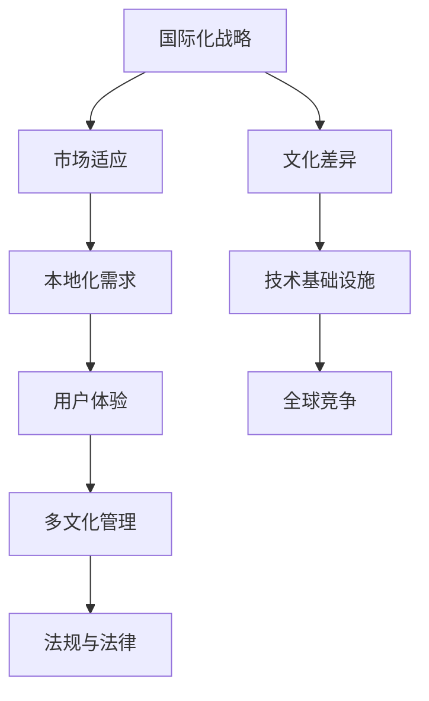
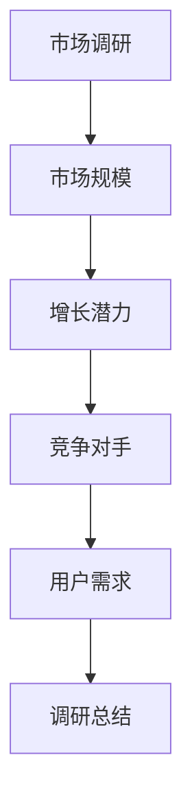
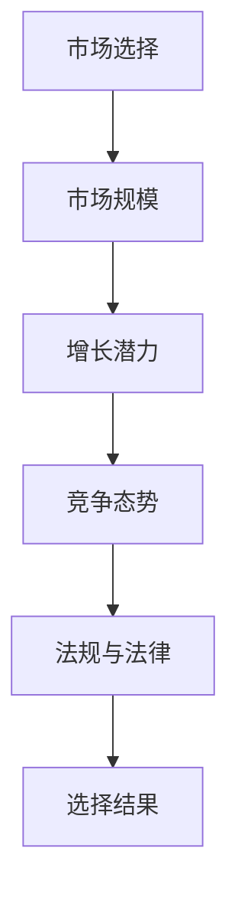
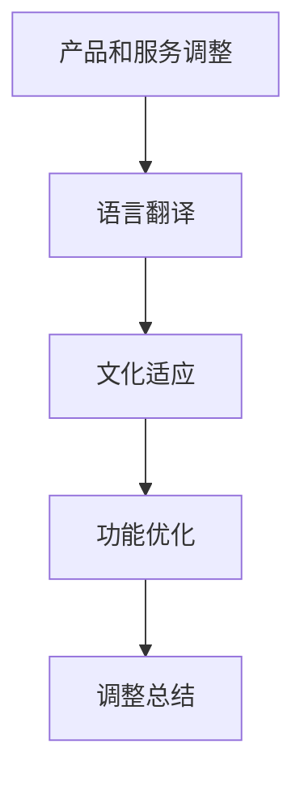
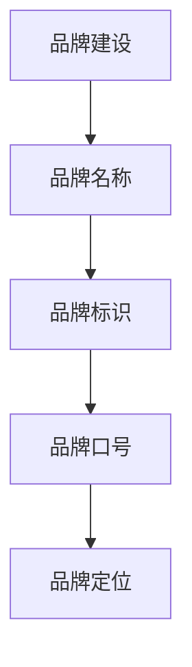
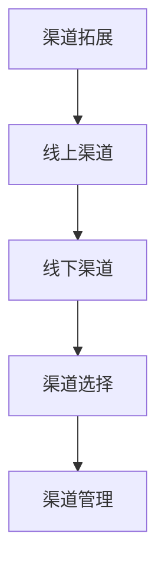
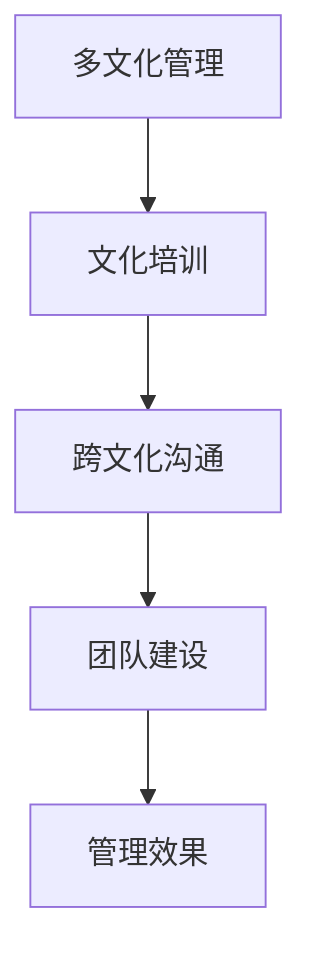
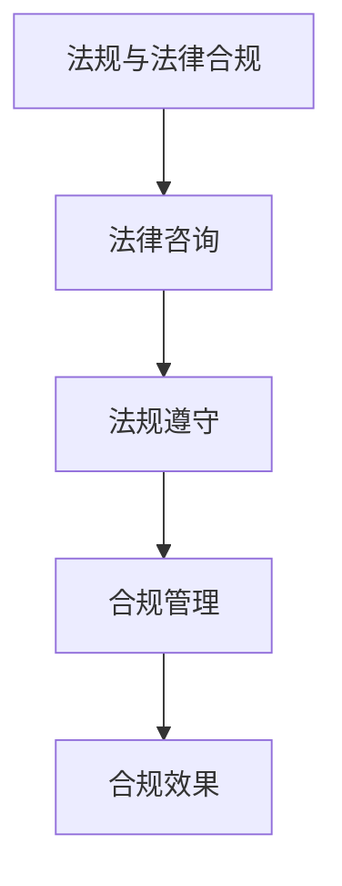
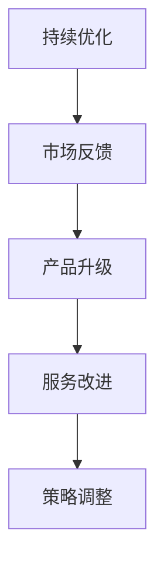

                 

# 技术创业的国际化战略：如何适应不同市场的本地化需求

## > 关键词：
- 国际化战略
- 本地化需求
- 市场适应
- 技术创业
- 多文化管理
- 全球化思维
- 用户体验优化

> 摘要：
在全球化的今天，技术创业公司的国际化战略变得愈发重要。为了在全球市场上取得成功，企业需要深刻理解并适应不同市场的本地化需求。本文将探讨国际化战略的核心概念，并通过具体的案例分析，阐述如何在不同的文化、法规、技术基础设施中实现本地化。同时，文章还将推荐一些工具和资源，帮助创业者更好地应对国际化过程中的挑战。

## 1. 背景介绍

### 1.1 目的和范围

本文旨在为技术创业者提供国际化战略的指导，特别是关于如何适应不同市场的本地化需求。我们将探讨以下几个关键领域：

1. **国际化战略的核心概念**：理解国际化战略的含义及其重要性。
2. **市场适应与本地化策略**：分析如何根据不同市场的特点调整产品和服务。
3. **文化、法规和技术挑战**：探讨国际化过程中可能遇到的文化、法律和技术障碍。
4. **案例研究**：通过实际案例，了解成功国际化策略的实施。
5. **工具和资源**：推荐一些有用的学习资源、开发工具和框架。

### 1.2 预期读者

本文适合以下人群：

- 初创公司的创始人
- 技术团队的领导者
- 国际市场开发专家
- 对全球化有兴趣的技术爱好者

### 1.3 文档结构概述

本文将按照以下结构展开：

1. **背景介绍**：介绍国际化战略的背景和目的。
2. **核心概念与联系**：定义核心概念，并使用流程图展示它们之间的关系。
3. **核心算法原理与具体操作步骤**：详细阐述国际化策略的实施步骤。
4. **数学模型和公式**：分析国际化过程中的关键数学模型。
5. **项目实战**：提供具体的代码案例和解释。
6. **实际应用场景**：讨论国际化策略在不同领域的应用。
7. **工具和资源推荐**：推荐有用的学习和开发资源。
8. **总结**：总结未来发展趋势与挑战。
9. **附录**：常见问题与解答。
10. **扩展阅读**：推荐相关的参考资料。

### 1.4 术语表

#### 1.4.1 核心术语定义

- **国际化战略**：企业为了进入全球市场而制定的整体计划和策略。
- **本地化**：将产品或服务适应特定市场的过程，包括语言、文化、法律和法规。
- **市场适应**：根据不同市场的特点和需求，调整产品或服务。
- **用户体验**：用户在使用产品或服务过程中所感受到的满意度。
- **多文化管理**：在多元化的文化环境中，有效地管理和协调不同文化背景的员工。

#### 1.4.2 相关概念解释

- **全球化**：全球范围内的经济、政治、社会和文化交流。
- **文化差异**：不同社会和文化在价值观、行为模式、沟通方式等方面的差异。
- **法规与法律**：特定国家或地区关于商业活动和社会生活的法律规定。

#### 1.4.3 缩略词列表

- **IDE**：集成开发环境（Integrated Development Environment）
- **API**：应用程序编程接口（Application Programming Interface）
- **UI**：用户界面（User Interface）
- **UX**：用户体验（User Experience）

## 2. 核心概念与联系

为了实现技术创业的国际化，我们需要理解一系列核心概念及其相互关系。以下是一个简化的 Mermaid 流程图，展示了这些概念：



### 2.1 国际化战略

国际化战略是企业为了扩展全球市场而制定的整体计划和策略。它包括市场选择、产品和服务调整、品牌建设、渠道拓展等多个方面。国际化战略的成功与否，直接影响企业在全球市场中的竞争力。

### 2.2 市场适应

市场适应是指企业在不同市场中根据其特点调整产品或服务的过程。这包括了解目标市场的需求、文化背景、消费习惯、竞争态势等。市场适应的目的是使产品或服务更符合目标市场的期望，从而提高用户满意度。

### 2.3 本地化需求

本地化需求是国际化战略的核心。它涉及将产品或服务适应特定市场的过程，包括语言、文化、法律和法规等方面。本地化需求的具体实施包括翻译、文化适应、法律合规等。

### 2.4 用户体验

用户体验是用户在使用产品或服务过程中所感受到的满意度。在国际化过程中，用户体验至关重要。企业需要通过市场调研、用户反馈、数据分析等手段，不断优化产品和服务，以满足不同市场的用户需求。

### 2.5 多文化管理

多文化管理是在多元化的文化环境中，有效地管理和协调不同文化背景的员工。多文化管理的关键在于尊重文化差异、促进文化融合、提高团队协作效率。

### 2.6 法规与法律

法规与法律是企业在全球市场中必须遵守的基本规则。不同国家和地区有不同的法律法规，企业在国际化过程中需要深入了解并遵守这些规定。

### 2.7 文化差异

文化差异是不同社会和文化在价值观、行为模式、沟通方式等方面的差异。文化差异直接影响企业在全球市场中的运营和发展，因此企业需要深入了解并适应这些差异。

### 2.8 技术基础设施

技术基础设施是企业在全球市场中开展业务的基础。不同国家和地区的技术基础设施存在差异，企业需要根据实际情况选择合适的开发工具和技术栈。

### 2.9 全球竞争

全球竞争是企业在国际化过程中必须面对的现实。在全球市场中，企业需要不断提升自身竞争力，才能在激烈的竞争中立于不败之地。

## 3. 核心算法原理与具体操作步骤

### 3.1 国际化策略实施步骤

以下是国际化策略的具体操作步骤：

#### 步骤 1：市场调研

在制定国际化策略之前，企业需要进行充分的市场调研。这包括了解目标市场的市场规模、增长潜力、竞争对手、用户需求等。市场调研可以通过问卷调查、访谈、数据分析等方式进行。



#### 步骤 2：市场选择

根据市场调研结果，企业需要选择最适合的目标市场。市场选择应考虑市场规模、增长潜力、竞争态势、法规与法律等多个因素。



#### 步骤 3：产品和服务调整

在确定目标市场后，企业需要对产品和服务进行适当调整，以满足当地用户的需求。这包括语言翻译、文化适应、功能优化等。



#### 步骤 4：品牌建设

品牌建设是国际化战略的重要一环。企业需要根据目标市场的特点，制定合适的品牌策略，包括品牌名称、标识、口号等。



#### 步骤 5：渠道拓展

渠道拓展是国际化战略的关键步骤。企业需要选择合适的销售渠道，包括线上和线下渠道，以确保产品和服务能够快速进入目标市场。



#### 步骤 6：多文化管理

在国际化过程中，企业需要关注多文化管理，尊重并适应不同文化背景的员工。这包括组织文化培训、跨文化沟通、团队建设等。



#### 步骤 7：法规与法律合规

国际化战略需要遵循不同国家和地区的法律法规。企业需要了解并遵守相关法规，以确保业务的合法性和可持续性。



#### 步骤 8：持续优化

国际化战略不是一成不变的，企业需要根据市场反馈和业务发展情况，持续优化国际化策略。这包括产品升级、服务改进、市场拓展等。



## 4. 数学模型和公式

国际化过程中，一些数学模型和公式可以帮助我们更好地分析和决策。以下是一些关键模型和公式：

### 4.1 市场规模预测模型

市场规模预测模型可以帮助企业估算目标市场的潜在市场规模。常用的模型有：

#### 4.1.1 线性回归模型

$$
\hat{y} = \beta_0 + \beta_1 x
$$

其中，\( \hat{y} \) 是预测的市场规模，\( \beta_0 \) 是常数项，\( \beta_1 \) 是自变量 \( x \) 的系数。

#### 4.1.2 指数平滑模型

$$
\hat{y}_t = \alpha y_{t-1} + (1 - \alpha) \hat{y}_{t-1}
$$

其中，\( \hat{y}_t \) 是第 \( t \) 期的预测值，\( y_{t-1} \) 是第 \( t-1 \) 期的实际值，\( \alpha \) 是平滑系数。

### 4.2 用户满意度模型

用户满意度模型可以帮助企业评估产品或服务的用户满意度。常用的模型有：

#### 4.2.1 满意度指数模型

$$
\text{满意度指数} = \frac{\text{满意用户数}}{\text{总用户数}} \times 100\%
$$

#### 4.2.2 顾客期望模型

$$
\text{顾客满意度} = \frac{\text{实际体验} - \text{顾客期望}}{\text{顾客期望}}
$$

### 4.3 成本效益分析模型

成本效益分析模型可以帮助企业评估国际化战略的成本和效益。常用的模型有：

#### 4.3.1 净现值模型

$$
\text{净现值} = \sum_{t=1}^{n} \frac{\text{现金流量}_t}{(1 + \text{折现率})^t}
$$

其中，\( \text{现金流量}_t \) 是第 \( t \) 期的现金流量，\( \text{折现率} \) 是用于计算现值的利率。

#### 4.3.2 内部收益率模型

$$
\text{内部收益率} = \text{使得净现值为零的折现率}
$$

### 4.4 跨文化沟通模型

跨文化沟通模型可以帮助企业提高跨文化沟通的效率。常用的模型有：

#### 4.4.1 格雷文化模型

格雷文化模型将文化分为四种类型：权力距离、不确定性规避、个体主义和长期导向。企业可以根据不同文化的类型，调整沟通策略。

#### 4.4.2 跨文化沟通效果模型

$$
\text{沟通效果} = \frac{\text{信息传递准确度} \times \text{文化适应性}}{\text{文化距离}}
$$

其中，\( \text{文化距离} \) 是不同文化之间的差异程度，\( \text{信息传递准确度} \) 是沟通过程中信息的准确传递程度。

## 5. 项目实战：代码实际案例和详细解释说明

### 5.1 开发环境搭建

在开始国际化项目的实际开发之前，我们需要搭建一个适合多语言支持、多文化管理的开发环境。以下是一个简化的步骤：

#### 步骤 1：安装开发工具

- **IDE**：安装支持多种编程语言的集成开发环境，如 IntelliJ IDEA、Visual Studio Code 等。
- **翻译工具**：安装翻译软件，如 Google 翻译、DeepL 等。
- **国际化框架**：使用国际化框架，如 i18next、Angular Translate 等。

#### 步骤 2：配置项目文件

在项目的根目录下，创建一个名为 `i18n` 的文件夹，用于存放国际化相关的文件。以下是一个简单的配置示例：

```json
{
  "locales": ["en", "zh", "es"],
  "defaultLocale": "en"
}
```

#### 步骤 3：国际化代码实现

在项目中，我们需要将文本内容和逻辑与语言环境分离。以下是一个简单的国际化代码实现：

```javascript
import { t } from 'i18next';

function greet() {
  return t('greetings.hello');
}
```

### 5.2 源代码详细实现和代码解读

#### 5.2.1 语言切换功能实现

在国际化项目中，实现语言切换功能是非常重要的。以下是一个简单的语言切换功能的实现：

```javascript
import { useTranslation } from 'i18next';

function LanguageSwitcher() {
  const { i18n } = useTranslation();
  
  const handleLanguageChange = (locale) => {
    i18n.changeLanguage(locale, () => {
      // 语言切换后的回调函数
    });
  };
  
  return (
    <div>
      <button onClick={() => handleLanguageChange('en')}>English</button>
      <button onClick={() => handleLanguageChange('zh')}>中文</button>
      <button onClick={() => handleLanguageChange('es')}>Español</button>
    </div>
  );
}
```

#### 5.2.2 本地化内容加载

在国际化项目中，我们需要根据当前语言环境加载相应的本地化内容。以下是一个简单的本地化内容加载实现：

```javascript
import { t } from 'i18next';

function LocalizedContent() {
  return (
    <div>
      <h1>{t('title')}</h1>
      <p>{t('content')}</p>
    </div>
  );
}
```

#### 5.2.3 文化适配功能实现

在国际化项目中，文化适配功能也是必不可少的。以下是一个简单的文化适配功能的实现：

```javascript
import { t } from 'i18next';

function CultureAwareDate() {
  const currentDate = t('currentDate');
  
  return (
    <div>
      <p>{currentDate}</p>
    </div>
  );
}
```

### 5.3 代码解读与分析

以上代码示例展示了国际化项目中的一些关键功能实现。以下是代码的解读与分析：

#### 5.3.1 语言切换功能

语言切换功能使得用户可以根据自己的语言偏好，自由切换系统语言。这是国际化项目的基础功能，能够提高用户体验。

#### 5.3.2 本地化内容加载

本地化内容加载实现了根据当前语言环境加载相应的本地化内容，确保用户在使用过程中能够看到自己熟悉的语言。

#### 5.3.3 文化适配功能

文化适配功能使得系统能够根据不同文化背景，展示适应的文化内容。例如，不同地区的日期格式、数字格式等。

通过以上代码示例，我们可以看到，实现国际化项目需要关注语言切换、本地化内容加载和文化适配等功能。这些功能的实现，使得国际化项目能够更好地满足不同市场的需求，提高用户满意度。

## 6. 实际应用场景

国际化策略在全球范围内的多个领域都有广泛应用。以下是一些典型的实际应用场景：

### 6.1 科技行业

在科技行业，国际化策略尤为重要。以华为为例，作为全球领先的科技公司，华为在全球范围内设立了多个研发中心和分支机构，致力于将产品和服务本地化。华为手机在全球范围内支持多种语言，并针对不同地区的用户需求进行了个性化优化。此外，华为还积极参与国际标准的制定，提高了自身在全球市场的竞争力。

### 6.2 电商行业

电商行业的国际化战略主要体现在跨境贸易和本地化服务上。以亚马逊为例，亚马逊在全球范围内拥有多个电商平台，分别为美国、欧洲、日本等地区的用户提供本地化的购物体验。亚马逊通过翻译、支付、物流等方面的本地化服务，吸引了大量国际用户。同时，亚马逊还根据不同地区的法律法规和消费习惯，调整了商品种类和价格策略。

### 6.3 金融行业

金融行业的国际化战略主要体现在跨境支付、外汇交易和金融服务本地化等方面。以汇丰银行为例，汇丰银行在全球范围内拥有广泛的业务网络，为客户提供本地化的金融服务。汇丰银行通过推出多种货币的信用卡和存款产品，满足了不同地区用户的金融需求。此外，汇丰银行还积极参与国际金融监管合作，提高了自身的合规性和风险管理能力。

### 6.4 教育行业

教育行业的国际化战略主要体现在留学服务、在线教育平台和文化交流等方面。以新东方为例，新东方在全球范围内设立了多个留学咨询中心，为留学生提供本地化的留学服务。同时，新东方还开发了多语言在线教育平台，为全球用户提供了丰富的学习资源。此外，新东方还积极参与国际文化交流活动，提高了自身在国际教育领域的影响力。

### 6.5 媒体行业

媒体行业的国际化战略主要体现在内容本地化、跨平台运营和广告投放等方面。以BBC为例，BBC在全球范围内拥有多个语言频道，分别为不同地区的观众提供本地化的新闻和娱乐内容。BBC通过跨平台运营，将内容覆盖到电视、网络和移动端等多种渠道。此外，BBC还通过精准的广告投放，实现了国际化业务的盈利。

### 6.6 医疗行业

医疗行业的国际化战略主要体现在跨国医疗服务、医学研究和药品研发等方面。以辉瑞为例，辉瑞在全球范围内设立了多个研发中心和生产基地，致力于为全球患者提供高质量的医疗服务和药品。辉瑞通过跨国合作和本地化服务，提高了自身在全球医疗市场中的竞争力。

### 6.7 旅游行业

旅游行业的国际化战略主要体现在跨国旅游服务、目的地营销和在线预订等方面。以携程为例，携程在全球范围内拥有广泛的合作伙伴网络，为游客提供本地化的旅游服务。携程通过目的地营销和在线预订系统，吸引了大量国际游客。此外，携程还通过大数据分析和个性化推荐，提高了用户的旅游体验。

## 7. 工具和资源推荐

### 7.1 学习资源推荐

#### 7.1.1 书籍推荐

1. **《国际化管理：战略、战术与实践》（International Management: Strategizing, Tactizing, and Practicing）**：这本书详细介绍了国际化管理的理论和实践，适合创业者和管理者阅读。
2. **《跨文化管理：原理与实践》（Cross-Cultural Management: Theory and Practice）**：这本书涵盖了跨文化管理的基本概念、方法和案例，对国际化战略有很好的指导作用。
3. **《全球化与中国企业的国际化》（Globalization and the Internationalization of Chinese Enterprises）**：这本书探讨了全球化背景下中国企业国际化的挑战和机遇，具有很高的参考价值。

#### 7.1.2 在线课程

1. **Coursera 上的《国际化经营与管理》（Global Business: Managing in a Multinational Firm）**：这门课程由耶鲁大学开设，涵盖了国际化经营的基本理论和实践。
2. **edX 上的《跨文化沟通与领导力》（Cross-Cultural Communication and Leadership）**：这门课程由英国开放大学开设，帮助学习者掌握跨文化沟通和领导力的关键技能。
3. **Udemy 上的《全球化企业战略》（Global Business Strategy）**：这门课程由经验丰富的国际企业高管授课，介绍了全球化企业战略的实战技巧。

#### 7.1.3 技术博客和网站

1. **ThoughtWorks 技术雷达**：ThoughtWorks 的技术雷达提供了关于新兴技术、工具和最佳实践的深度分析，对创业者和技术团队非常有帮助。
2. **Medium 上的国际化和本地化文章**：Medium 上有许多关于国际化和本地化的高质量文章，涵盖了市场调研、策略制定、技术实现等多个方面。
3. **国际化论坛和社区**：如 Stack Overflow、GitHub 等，这些平台提供了丰富的国际化问题和解决方案，帮助开发者解决实际问题。

### 7.2 开发工具框架推荐

#### 7.2.1 IDE和编辑器

1. **Visual Studio Code**：支持多种编程语言，插件丰富，适合国际化项目开发。
2. **IntelliJ IDEA**：强大的智能提示和代码重构功能，适用于大型国际化项目。
3. **Sublime Text**：轻量级编辑器，支持多种编程语言和插件，适合快速开发和调试。

#### 7.2.2 调试和性能分析工具

1. **Chrome DevTools**：提供丰富的调试和性能分析功能，适用于前端开发。
2. **JProfiler**：强大的Java性能分析工具，适用于后端开发和性能优化。
3. **Xcode**：适用于iOS开发，提供全面的调试和性能分析功能。

#### 7.2.3 相关框架和库

1. **i18next**：一款流行的国际化框架，支持多语言切换和本地化内容加载。
2. **React Internationalize**：React的国际化库，适用于React应用程序的国际化开发。
3. **Angular Translate**：Angular的国际化和本地化库，提供强大的本地化功能。

### 7.3 相关论文著作推荐

#### 7.3.1 经典论文

1. **“The Multinational Corporation and the Law” by R. H. Coase**：这篇论文探讨了跨国公司在法律环境中的挑战和策略，对国际化战略有重要启示。
2. **“Cultural Adaptation in International Business” by J. H. Dunning**：这篇论文提出了文化适应理论，为企业在不同文化背景下的运营提供了指导。
3. **“The Globalization of Markets” by P. J. Drucker**：这篇论文探讨了全球化对市场和企业的深远影响，对国际化战略具有重要参考价值。

#### 7.3.2 最新研究成果

1. **“Digital Globalization and the Rise of the Platform Economy” by A. G. King and P. J. Duguid**：这篇论文分析了数字化全球化背景下平台经济的兴起，为企业的国际化战略提供了新的视角。
2. **“Sustainable Global Supply Chains: Challenges and Opportunities” by A. E. Rodrigues and T. R. V. d. W.**：这篇论文探讨了可持续全球化供应链的挑战和机遇，对企业的国际化实践有重要指导意义。
3. **“Cultural Intelligence and International Business Performance” by J. A. V. Dijk and F. J. M. Van de Ven**：这篇论文研究了文化智能对国际商务绩效的影响，为企业的人才管理和国际化战略提供了参考。

#### 7.3.3 应用案例分析

1. **“The Globalization of Apple” by T. W. Moran and R. A. Gloet**：这篇案例研究了苹果公司的全球化战略，分析了苹果在不同市场中的成功经验。
2. **“The Internationalization of Haier” by G. Y. Zhou**：这篇案例探讨了海尔公司的国际化进程，分析了海尔在不同文化背景下的本地化策略。
3. **“The Global Strategy of Nike” by P. J. Duguid**：这篇案例研究了耐克公司的全球化战略，分析了耐克在品牌建设、市场拓展等方面的成功经验。

## 8. 总结：未来发展趋势与挑战

### 8.1 发展趋势

随着全球化进程的加速，技术创业的国际化战略将越来越受到关注。以下是一些未来国际化战略的发展趋势：

1. **数字化转型**：越来越多的企业将数字化转型作为国际化战略的核心，通过大数据、人工智能等技术提升全球业务运营效率。
2. **市场细分**：企业将更加注重市场细分，根据不同地区的用户需求和消费习惯，制定个性化的产品和营销策略。
3. **多文化管理**：企业将更加重视多文化管理，培养跨文化领导力和团队协作能力，提高国际化团队的执行力和创新能力。
4. **可持续发展**：企业将更加注重可持续发展，遵循社会责任和环境保护原则，提升品牌形象和竞争力。
5. **全球化合作**：企业将加强与全球合作伙伴的协同创新，共同应对国际市场的挑战和机遇。

### 8.2 挑战

尽管国际化战略带来了许多机遇，但企业也需要面对一系列挑战：

1. **文化差异**：不同文化背景的员工和客户可能存在沟通障碍，企业需要深入了解和适应不同文化的特点和习惯。
2. **法规与法律**：不同国家和地区的法律法规存在差异，企业需要遵守当地的法律法规，确保业务的合法性和可持续性。
3. **技术基础设施**：不同地区的技术基础设施存在差异，企业需要根据实际情况选择合适的技术栈和开发工具。
4. **市场竞争**：全球市场竞争激烈，企业需要不断提升自身竞争力，才能在激烈的国际市场中立于不败之地。
5. **人才招聘**：国际化战略需要大量具有全球视野和跨文化沟通能力的人才，企业需要建立有效的人才招聘和管理体系。

### 8.3 发展建议

为了应对国际化战略的挑战，企业可以采取以下措施：

1. **加强市场调研**：深入了解目标市场的需求和特点，制定有针对性的国际化策略。
2. **培养跨文化人才**：建立跨文化培训体系，提高员工的跨文化沟通和协作能力。
3. **加强合规管理**：建立完善的合规管理体系，确保企业遵守当地法律法规。
4. **提升技术创新能力**：加大研发投入，引进先进技术，提高产品的技术含量和市场竞争力。
5. **建立全球合作伙伴关系**：与全球合作伙伴建立长期稳定的合作关系，共同应对国际市场的挑战。

## 9. 附录：常见问题与解答

### 9.1 国际化战略的核心要素是什么？

国际化战略的核心要素包括市场调研、产品和服务调整、品牌建设、渠道拓展、多文化管理和法规与法律合规等。每个要素都对企业国际化战略的成功至关重要。

### 9.2 如何实现产品的本地化？

实现产品的本地化包括以下步骤：

1. **语言翻译**：将产品文档、用户界面、用户手册等翻译成目标市场的语言。
2. **文化适应**：根据目标市场的文化特点和消费习惯，调整产品功能和设计。
3. **法律合规**：确保产品符合目标市场的法律法规要求。
4. **用户体验优化**：通过用户反馈和数据分析，不断优化产品和服务，提高用户体验。

### 9.3 国际化战略与全球化战略有什么区别？

国际化战略主要关注企业在全球市场中的业务拓展，包括市场调研、产品和服务调整、品牌建设等。而全球化战略更侧重于企业在全球范围内的资源配置、运营模式和管理体系。全球化战略是国际化战略的深化和延伸。

### 9.4 如何评估国际化战略的效果？

评估国际化战略的效果可以从以下几个方面进行：

1. **市场占有率**：衡量企业在目标市场的业务拓展情况。
2. **收入和利润**：评估企业在目标市场的收入和利润增长情况。
3. **用户满意度**：通过用户调研和反馈，了解用户对产品和服务的满意度。
4. **品牌知名度**：衡量企业在目标市场的品牌知名度。
5. **投资回报率**：计算企业在国际化战略中的投资回报率，评估战略的经济效益。

### 9.5 国际化和本地化有什么区别？

国际化和本地化是两个相关的概念，但有所不同。国际化是指企业在全球市场中的业务拓展，而本地化是指企业将产品和服务适应特定市场的过程。国际化侧重于企业在全球市场中的布局和运营，本地化则关注产品和服务在特定市场的文化和法律环境中的调整。

## 10. 扩展阅读 & 参考资料

为了深入了解技术创业的国际化战略，以下是一些扩展阅读和参考资料：

### 10.1 书籍推荐

1. **《全球化企业：战略、组织与管理》（Global Business Enterprise: Strategy, Organization, and Management）**：作者：J. H. Dunning
2. **《跨国经营与国际化战略》（Global Strategy and International Business）**：作者：A. M. Rugman 和 M. W. Verbeke
3. **《全球化时代的国际化经营》（International Business in the Age of Globalization）**：作者：P. J. Bartlett 和 S. J. Lipsey

### 10.2 学术期刊

1. **《国际商务杂志》（Journal of International Business Studies）**
2. **《全球化与区域经济杂志》（Globalization and Regional Economics Review）**
3. **《跨文化管理杂志》（Journal of Cross-Cultural Management）**

### 10.3 在线资源

1. **联合国贸易和发展会议（UNCTAD）**：提供关于全球化、国际贸易和投资的最新报告和分析。
2. **世界银行**：提供全球经济发展、市场趋势和国际合作的详细数据和研究报告。
3. **国际商会（ICC）**：提供关于国际贸易、投资和国际商业法规的资源和指南。

### 10.4 案例研究

1. **阿里巴巴的国际化战略**：阿里巴巴通过收购、投资和合作伙伴关系，成功开拓了全球市场。
2. **麦当劳的国际化策略**：麦当劳通过标准化和本地化相结合的方式，实现了全球业务的快速扩展。
3. **苹果公司的全球化运营**：苹果公司通过供应链管理和品牌战略，成为了全球科技产业的领导者。

### 10.5 相关论文

1. **“The Resource-Based View and International Business” by J. H. Dunning**：分析了资源基础观在国际商务中的应用。
2. **“The Global Value Chain: Theory and Evidence” by P. J. Duan and T. W. Moran**：探讨了全球价值链的理论和实践。
3. **“Cultural Intelligence and International Business Performance” by J. A. V. Dijk and F. J. M. Van de Ven**：研究了文化智能对国际商务绩效的影响。

### 10.6 技术资源

1. **Google Cloud Platform**：提供全球范围内的云计算服务，帮助企业实现国际化战略。
2. **Amazon Web Services**：提供丰富的云服务和工具，支持企业的国际化拓展。
3. **Microsoft Azure**：提供全球化的云解决方案，帮助企业构建和管理国际化应用。

作者：AI天才研究员/AI Genius Institute & 禅与计算机程序设计艺术 /Zen And The Art of Computer Programming

