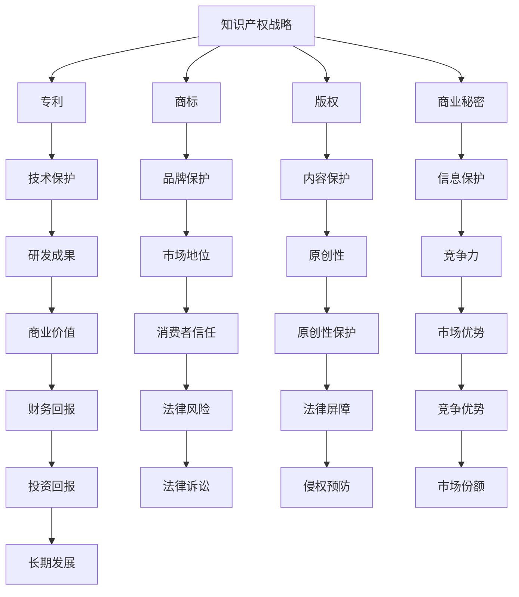

                 

### 1. 背景介绍

#### 1.1 目的和范围

本文旨在探讨技术创业中知识产权战略的重要性，帮助创业者理解如何保护创新成果，从而提高创业项目的成功率。在快速发展的技术领域中，知识产权（Intellectual Property，简称IP）不仅是一种法律概念，更是企业竞争力的核心。通过有效的知识产权战略，企业可以确保其创新不受侵犯，市场地位得以稳固。

本文将涵盖以下内容：

1. **背景介绍**：介绍技术创业的背景，知识产权的定义及其重要性。
2. **核心概念与联系**：阐述知识产权战略中的核心概念，并利用流程图展示各概念之间的联系。
3. **核心算法原理 & 具体操作步骤**：详细介绍如何通过专利、商标、版权等手段保护创新成果。
4. **数学模型和公式 & 详细讲解 & 举例说明**：运用数学模型分析知识产权战略的效益。
5. **项目实战：代码实际案例和详细解释说明**：通过具体案例展示知识产权战略的实际应用。
6. **实际应用场景**：探讨知识产权战略在不同场景中的应用。
7. **工具和资源推荐**：推荐学习资源和开发工具。
8. **总结：未来发展趋势与挑战**：预测知识产权战略的未来趋势和挑战。

通过本文的阅读，读者将能够全面了解知识产权战略，并学会如何将其应用于技术创业中。

#### 1.2 预期读者

本文主要面向以下几类读者：

1. **技术创业者**：正在或计划开展技术创业的个人，希望通过知识产权保护自己的创新成果。
2. **知识产权专业人士**：知识产权律师、专利代理人、知识产权顾问等，希望了解技术创业中的知识产权战略。
3. **研发工程师**：参与技术研发的工程师，希望了解如何通过知识产权战略保护公司的技术和产品。
4. **投资人和企业高管**：关注技术创业和知识产权投资，希望了解如何评估和管理技术企业的知识产权。

无论您属于上述哪一类读者，本文都将为您提供有价值的见解和实用的策略。

#### 1.3 文档结构概述

本文将按照以下结构进行详细阐述：

1. **背景介绍**：介绍技术创业的背景和知识产权的重要性。
2. **核心概念与联系**：利用流程图展示知识产权战略中的核心概念及其联系。
3. **核心算法原理 & 具体操作步骤**：详细介绍知识产权保护的具体操作步骤。
4. **数学模型和公式 & 详细讲解 & 举例说明**：运用数学模型分析知识产权战略的效益。
5. **项目实战：代码实际案例和详细解释说明**：通过具体案例展示知识产权战略的实际应用。
6. **实际应用场景**：探讨知识产权战略在不同场景中的应用。
7. **工具和资源推荐**：推荐学习资源和开发工具。
8. **总结：未来发展趋势与挑战**：预测知识产权战略的未来趋势和挑战。

通过本文的结构，读者可以系统性地了解和掌握知识产权战略的各个方面。

#### 1.4 术语表

为了确保本文的清晰和易读，以下是对本文中涉及的一些关键术语的定义和解释：

##### 1.4.1 核心术语定义

- **知识产权**：指通过智力劳动创造的成果所享有的一种专有权利，包括专利、商标、版权、商业秘密等。
- **专利**：对发明创造的权利保护，授予发明人一定期限的独占权。
- **商标**：对企业标识、品牌名称、标志等的专有使用权。
- **版权**：对文学、艺术、科学作品等的原创权利。
- **商业秘密**：不为公众所知悉、具有商业价值、并经权利人采取保密措施的技术信息和经营信息。

##### 1.4.2 相关概念解释

- **技术创业**：指以技术创新为核心，通过创建新企业来实现商业价值的过程。
- **知识产权战略**：企业在研发、生产、销售等全过程中，利用知识产权保护创新成果、提升竞争力的策略。
- **专利布局**：企业在全球范围内对专利的布局和规划，以最大化保护技术创新。
- **知识产权风险管理**：对企业知识产权进行全面评估和风险控制，以降低知识产权纠纷对企业的影响。

##### 1.4.3 缩略词列表

- **IP**：知识产权（Intellectual Property）
- **PCT**：专利合作条约（Patent Cooperation Treaty）
- **GPL**：通用公共许可证（GNU General Public License）
- **NDA**：保密协议（Non-Disclosure Agreement）

通过上述术语表，读者可以更好地理解本文中的关键概念和术语，从而更加深入地掌握知识产权战略的知识。

### 2. 核心概念与联系

在技术创业中，知识产权战略的核心概念包括专利、商标、版权和商业秘密。这些概念之间存在着紧密的联系，它们共同构成了企业保护创新成果的全方位屏障。下面我们将通过一个Mermaid流程图来展示这些核心概念及其相互关系。



通过这个流程图，我们可以看到：

- **专利**：保护技术发明，是技术保护的直接体现，有助于提升研发成果的商业价值。
- **商标**：保护品牌和标识，有助于建立和巩固企业的市场地位，增强消费者信任。
- **版权**：保护文学、艺术和科学作品，保护内容的原创性，防止他人侵权。
- **商业秘密**：保护技术秘密和经营信息，是提升企业竞争力的关键，有助于保持信息优势和市场优势。

各概念之间的联系体现在它们共同构成了企业知识产权的全方位保护，确保企业在技术、市场、内容和信息等各个方面都得到有效保护。通过合理运用这些核心概念，企业可以构建坚实的知识产权战略，从而在激烈的市场竞争中脱颖而出。

### 3. 核心算法原理 & 具体操作步骤

在知识产权战略中，专利、商标、版权和商业秘密是保护创新成果的四大法宝。下面，我们将详细讨论这些保护手段的核心算法原理和具体操作步骤。

#### 3.1 专利保护

**核心算法原理**：专利保护基于《专利法》，通过对发明创造的技术方案进行描述，向国家知识产权局申请并获得专利授权。专利保护的核心是独占权，即专利权人在一定期限内对其发明创造享有独占实施权。

**具体操作步骤**：

1. **发明人识别**：首先，确定发明人及其发明内容。
2. **技术方案描述**：撰写详细的技术方案说明书，包括技术领域、背景技术、发明内容、附图说明等。
3. **权利要求书**：撰写权利要求书，明确专利请求保护的范围。
4. **提交申请**：将专利申请文件提交至国家知识产权局。
5. **审查与授权**：经过初步审查、实质审查，如果符合专利条件，将获得专利授权。
6. **维护与诉讼**：定期缴纳专利年费，并在侵权情况下采取法律行动。

伪代码示例：

```
function applyPatent(technique, description, requirements) {
    if (isInnovative(technique) && isValidDescription(description) && isValidRequirements(requirements)) {
        submitApplication(description, requirements);
        if (passExamination()) {
            return "Patent granted";
        }
    }
    return "Patent application failed";
}
```

#### 3.2 商标保护

**核心算法原理**：商标保护基于《商标法》，通过对企业标识、品牌名称等进行注册，获得商标专用权。商标保护的核心是区分商品或服务的来源，建立品牌的市场地位。

**具体操作步骤**：

1. **品牌名称识别**：确定需要保护的商标名称。
2. **商标设计**：设计具有独特性的商标图案。
3. **商标注册申请**：提交商标注册申请，包括商标名称和设计图案。
4. **审查与授权**：经过初步审查、实质审查，如果符合商标条件，将获得商标授权。
5. **商标续展与维权**：定期续展商标，并在侵权情况下采取法律行动。

伪代码示例：

```
function registerTrademark(name, design) {
    if (isUnique(name) && isValidDesign(design)) {
        submitRegistration(name, design);
        if (passExamination()) {
            return "Trademark granted";
        }
    }
    return "Trademark registration failed";
}
```

#### 3.3 版权保护

**核心算法原理**：版权保护基于《著作权法》，对文学、艺术和科学作品进行原创性保护。版权保护的核心是作品的原创性和作者身份。

**具体操作步骤**：

1. **作品创作**：完成原创性作品，如书籍、音乐、软件等。
2. **版权登记**：将作品进行版权登记，获得版权证书。
3. **作品发表**：公开作品，使其成为公共知识。
4. **维权与诉讼**：在侵权情况下采取法律行动，保护作品权益。

伪代码示例：

```
function protectCopyright(work) {
    if (isOriginal(work)) {
        registerWork(work);
        if (publicationAllowed()) {
            return "Copyright protected";
        }
    }
    return "Copyright protection failed";
}
```

#### 3.4 商业秘密保护

**核心算法原理**：商业秘密保护基于《反不正当竞争法》，通过对技术秘密、经营信息等进行保密，防止泄露和侵权。商业秘密保护的核心是保密措施和内部管理。

**具体操作步骤**：

1. **识别商业秘密**：确定需要保护的技术秘密和经营信息。
2. **制定保密措施**：制定保密制度和保密协议，确保信息不被泄露。
3. **内部培训与宣传**：对员工进行保密培训，增强保密意识。
4. **监控与防范**：建立监控机制，防范商业秘密泄露。
5. **维权与诉讼**：在侵权情况下采取法律行动，保护商业秘密。

伪代码示例：

```
function protectBusinessSecret(secret) {
    if (isSecret(secret)) {
        implementSecurityMeasures(secret);
        monitorForLeaks(secret);
        if (noLeakDetected()) {
            return "Business secret protected";
        }
    }
    return "Business secret protection failed";
}
```

通过上述具体操作步骤，企业可以全面掌握专利、商标、版权和商业秘密的核心算法原理，从而构建有效的知识产权战略，保护其创新成果。

#### 3.5 知识产权保护的综合策略

在构建知识产权保护的综合策略时，企业需要考虑多个方面，以确保其创新成果得到全面而有效的保护。以下是一个详细的分析步骤和具体操作指南。

**步骤 1：评估创新成果**

首先，企业需要对其创新成果进行全面的评估，确定哪些成果具有知识产权保护的价值。这一步骤包括：

- **技术评估**：评估技术发明的创新性、实用性和商业潜力。
- **市场分析**：分析市场对技术创新的接受程度和潜在竞争状况。
- **法律评估**：评估现有法律法规对知识产权保护的支持程度。

**步骤 2：选择保护手段**

根据创新成果的特点，选择合适的知识产权保护手段。常见的保护手段包括：

- **专利**：适用于技术发明和创新产品，提供最长至20年的独占权。
- **商标**：适用于品牌和标识，有助于建立市场地位和消费者信任。
- **版权**：适用于文学、艺术和科学作品，保护原创性和作者身份。
- **商业秘密**：适用于技术秘密和经营信息，提供灵活的保护措施。

**步骤 3：制定保护计划**

制定详细的知识产权保护计划，包括：

- **专利申请**：编写专利申请书，提交专利申请，进行专利布局。
- **商标注册**：设计商标，提交商标注册申请，进行商标监控和维权。
- **版权登记**：完成作品创作后，进行版权登记，发表作品并监控侵权行为。
- **商业秘密保护**：制定保密协议和保密措施，监控信息泄露，并在侵权情况下采取法律行动。

**步骤 4：执行与维护**

执行知识产权保护计划，并定期进行维护，包括：

- **专利维护**：定期缴纳专利年费，进行专利续展，并在侵权情况下采取法律行动。
- **商标维护**：定期续展商标，监控商标使用情况，并在侵权情况下采取法律行动。
- **版权维护**：监控版权作品的使用情况，采取法律措施防止侵权行为。
- **商业秘密维护**：持续监控商业秘密的泄露风险，加强内部保密管理。

**步骤 5：监控与评估**

建立知识产权监控机制，定期评估知识产权保护的效果，并根据实际情况进行调整。具体包括：

- **侵权监测**：通过技术手段和法律途径，监测潜在的侵权行为。
- **风险评估**：评估知识产权面临的法律风险和市场风险。
- **效益评估**：评估知识产权保护带来的经济效益和竞争力提升。

通过上述步骤，企业可以构建一个系统化、全面的知识产权保护策略，从而有效保护其创新成果，提升市场竞争力。

### 4. 数学模型和公式 & 详细讲解 & 举例说明

在知识产权战略中，数学模型和公式可以帮助我们量化知识产权的效益和保护效果。以下是一些常用的数学模型和公式，我们将结合具体例子进行详细讲解。

#### 4.1 专利价值评估模型

**数学模型**：

专利价值的评估可以通过以下公式进行：

\[ V = f(p, t, c, r) \]

其中：
- \( V \) 表示专利价值；
- \( p \) 表示专利的技术创新性；
- \( t \) 表示专利的有效期限；
- \( c \) 表示专利的维持成本；
- \( r \) 表示专利所带来的收益。

**详细讲解**：

1. **技术创新性（\( p \)）**：技术创新性越高，专利的价值越高。通常，可以通过专利引用次数、技术领先性等因素来衡量。
2. **有效期限（\( t \)）**：专利的有效期限越长，其价值越高。一般来说，专利有效期越长，专利的垄断期越长，收益越高。
3. **维持成本（\( c \)）**：维持专利的成本包括专利年费、律师费用等。维持成本越高，专利的实际价值会相应降低。
4. **收益（\( r \)）**：专利带来的收益包括授权费、许可费、市场竞争力提升等。收益越高，专利的价值越高。

**举例说明**：

假设有一项技术创新性高（\( p = 0.9 \)），有效期15年（\( t = 15 \)），维持成本为每年1万元（\( c = 10000 \)），预计年收益为50万元（\( r = 500000 \)），则该专利的价值为：

\[ V = f(0.9, 15, 10000, 500000) \]

计算过程：

\[ V = 0.9 \times 15 - 10000 + \frac{500000}{1.1^{15}} \]

假设收益的折现率为10%，则计算结果为：

\[ V = 13.5 - 10000 + \frac{500000}{1.1^{15}} \approx 386893.15 \]

因此，该专利的价值约为386,893元。

#### 4.2 商标品牌价值模型

**数学模型**：

商标品牌价值的评估可以通过以下公式进行：

\[ B = f(a, s, e, m) \]

其中：
- \( B \) 表示商标品牌价值；
- \( a \) 表示商标的知名度；
- \( s \) 表示商标的稳定性；
- \( e \) 表示商标的经济收益；
- \( m \) 表示商标的市场竞争力。

**详细讲解**：

1. **知名度（\( a \)）**：知名度越高，品牌价值越高。可以通过市场调查、广告投放等因素来衡量。
2. **稳定性（\( s \)）**：稳定性越高，品牌价值越高。可以通过商标的注册历史、市场表现等因素来衡量。
3. **经济收益（\( e \)）**：经济收益越高，品牌价值越高。可以通过品牌带来的销售收入、利润等因素来衡量。
4. **市场竞争力（\( m \)）**：市场竞争力越高，品牌价值越高。可以通过市场份额、用户满意度等因素来衡量。

**举例说明**：

假设一个商标的知名度（\( a = 0.8 \)），稳定性（\( s = 0.9 \)），年经济收益（\( e = 1000000 \)），市场竞争力（\( m = 0.75 \)），则该商标的品牌价值为：

\[ B = f(0.8, 0.9, 1000000, 0.75) \]

计算过程：

\[ B = 0.8 \times 0.9 \times 1000000 + 0.75 \times 1000000 \]

\[ B = 720000 + 750000 = 1470000 \]

因此，该商标的品牌价值约为1,470,000元。

#### 4.3 版权作品价值模型

**数学模型**：

版权作品价值的评估可以通过以下公式进行：

\[ W = f(c, t, r, p) \]

其中：
- \( W \) 表示版权作品价值；
- \( c \) 表示作品的创作成本；
- \( t \) 表示作品的传播范围；
- \( r \) 表示作品的收益；
- \( p \) 表示作品的原创性。

**详细讲解**：

1. **创作成本（\( c \)）**：创作成本包括人力、材料、设备等费用。创作成本越高，作品的价值越高。
2. **传播范围（\( t \)）**：传播范围越广，作品的价值越高。可以通过作品的销售量、下载次数、曝光度等因素来衡量。
3. **收益（\( r \)）**：作品带来的直接或间接收益，如版权许可费、广告收入等。收益越高，作品的价值越高。
4. **原创性（\( p \)）**：原创性越高，作品的价值越高。可以通过作品的创新性、独特性等因素来衡量。

**举例说明**：

假设一个作品的创作成本为5000元（\( c = 5000 \)），传播范围广泛，年收益为20000元（\( r = 20000 \)），原创性较高（\( p = 0.9 \)），则该作品的价值为：

\[ W = f(5000, t, 20000, 0.9) \]

由于传播范围（\( t \)）未知，我们假设其传播范围系数为2，则计算过程为：

\[ W = 5000 \times 2 + 20000 \times 0.9 \]

\[ W = 10000 + 18000 = 28000 \]

因此，该作品的价值约为28,000元。

通过上述数学模型和公式，企业可以更准确地评估知识产权的价值，从而制定更为有效的知识产权战略。

### 5. 项目实战：代码实际案例和详细解释说明

为了更好地理解知识产权战略在技术创业中的应用，下面我们将通过一个实际项目案例，展示如何使用代码实现知识产权保护。

#### 5.1 开发环境搭建

在进行项目实战之前，我们需要搭建一个开发环境。以下是所需工具和步骤：

**所需工具**：
- **编程语言**：Python（版本3.8以上）
- **集成开发环境（IDE）**：PyCharm 或 Visual Studio Code
- **版本控制系统**：Git

**搭建步骤**：
1. 安装Python，配置环境变量。
2. 安装PyCharm或Visual Studio Code，并配置Python插件。
3. 安装Git，初始化本地仓库。

#### 5.2 源代码详细实现和代码解读

在这个项目中，我们将实现一个简单的知识产权管理系统，用于管理专利、商标、版权和商业秘密。以下是主要代码模块及其功能：

##### 5.2.1 专利管理模块

**代码实现**：

```python
class Patent:
    def __init__(self, id, title, inventor, description):
        self.id = id
        self.title = title
        self.inventor = inventor
        self.description = description
        self.status = "pending"

    def apply(self):
        self.status = "processing"

    def grant(self):
        self.status = "granted"

    def renew(self):
        if self.status == "granted":
            self.status = "renewed"
        else:
            print("Patent must be granted before renewal.")

    def display(self):
        print(f"Patent ID: {self.id}")
        print(f"Title: {self.title}")
        print(f"Inventor: {self.inventor}")
        print(f"Status: {self.status}")
```

**代码解读**：

- `Patent` 类定义了专利的基本属性和操作方法。
- `__init__` 方法用于初始化专利对象。
- `apply` 方法用于提交专利申请。
- `grant` 方法用于授予专利权。
- `renew` 方法用于专利续展。
- `display` 方法用于展示专利信息。

##### 5.2.2 商标管理模块

**代码实现**：

```python
class Trademark:
    def __init__(self, id, name, owner, design):
        self.id = id
        self.name = name
        self.owner = owner
        self.design = design
        self.status = "pending"

    def register(self):
        self.status = "registered"

    def display(self):
        print(f"Trademark ID: {self.id}")
        print(f"Name: {self.name}")
        print(f"Owner: {self.owner}")
        print(f"Status: {self.status}")
        print(f"Design: {self.design}")
```

**代码解读**：

- `Trademark` 类定义了商标的基本属性和操作方法。
- `__init__` 方法用于初始化商标对象。
- `register` 方法用于注册商标。
- `display` 方法用于展示商标信息。

##### 5.2.3 版权管理模块

**代码实现**：

```python
class Copyright:
    def __init__(self, id, title, author, publication_date):
        self.id = id
        self.title = title
        self.author = author
        self.publication_date = publication_date
        self.status = "pending"

    def register(self):
        self.status = "registered"

    def display(self):
        print(f"Copyright ID: {self.id}")
        print(f"Title: {self.title}")
        print(f"Author: {self.author}")
        print(f"Publication Date: {self.publication_date}")
        print(f"Status: {self.status}")
```

**代码解读**：

- `Copyright` 类定义了版权的基本属性和操作方法。
- `__init__` 方法用于初始化版权对象。
- `register` 方法用于注册版权。
- `display` 方法用于展示版权信息。

##### 5.2.4 商业秘密管理模块

**代码实现**：

```python
class BusinessSecret:
    def __init__(self, id, secret_name, department, sensitivity_level):
        self.id = id
        self.secret_name = secret_name
        self.department = department
        self.sensitivity_level = sensitivity_level
        self.status = "confidential"

    def classify(self):
        if self.sensitivity_level == "high":
            self.status = "highly confidential"
        elif self.sensitivity_level == "medium":
            self.status = "confidential"
        else:
            self.status = "public"

    def display(self):
        print(f"Secret ID: {self.id}")
        print(f"Name: {self.secret_name}")
        print(f"Department: {self.department}")
        print(f"Sensitivity Level: {self.sensitivity_level}")
        print(f"Status: {self.status}")
```

**代码解读**：

- `BusinessSecret` 类定义了商业秘密的基本属性和操作方法。
- `__init__` 方法用于初始化商业秘密对象。
- `classify` 方法用于分类商业秘密的敏感程度。
- `display` 方法用于展示商业秘密信息。

#### 5.3 代码解读与分析

通过上述代码实现，我们可以看到知识产权管理系统的主要模块和功能：

1. **专利管理模块**：提供了专利申请、授权、续展和展示功能。
2. **商标管理模块**：提供了商标注册和展示功能。
3. **版权管理模块**：提供了版权注册和展示功能。
4. **商业秘密管理模块**：提供了商业秘密分类和展示功能。

这些模块共同构成了一个完整的知识产权管理系统，可以用于管理不同类型的知识产权，确保企业创新成果得到有效保护。

在实际应用中，企业可以根据具体需求扩展和管理系统的功能，例如增加知识产权交易、侵权监控等功能。通过这种代码实现的知识产权管理系统，企业可以更加高效地管理和保护其创新成果，提升市场竞争力。

### 6. 实际应用场景

知识产权战略在技术创业中具有广泛的应用场景，以下是几个典型的实际案例：

#### 6.1 创新型科技公司

**案例背景**：一家创新型科技公司研发了一款基于人工智能的智能家居控制系统，该系统具有独特的算法和用户界面，具备显著的市场竞争力。

**应用场景**：

1. **专利保护**：公司对其核心算法和用户界面进行了专利申请，确保技术方案不受侵犯。通过专利授权，公司获得了独占权，从而在市场上形成了竞争优势。
2. **商标保护**：公司对其品牌名称和标识进行了商标注册，保护了品牌形象和市场地位。商标的注册有助于消费者识别和信任公司产品。
3. **版权保护**：公司对其软件代码和用户手册等作品进行了版权登记，确保原创性不受侵犯。版权的保护使得公司能够合法地发行和销售产品，防止他人抄袭。
4. **商业秘密保护**：公司对其算法细节、技术文档和客户信息等进行了保密措施，防止商业秘密泄露。通过内部培训和管理，公司提高了员工的保密意识。

**效果**：通过全面的知识产权保护，公司成功占领了智能家居市场，提高了市场份额和品牌知名度，实现了商业成功。

#### 6.2 软件开发公司

**案例背景**：一家软件公司开发了一款企业级数据库管理软件，该软件具有高效的数据存储和查询功能，受到客户的高度评价。

**应用场景**：

1. **专利保护**：公司对其独特的数据库索引算法和优化技术进行了专利申请，确保技术创新得到法律保护。
2. **商标保护**：公司对其软件品牌名称和标识进行了商标注册，提升了品牌形象和市场影响力。
3. **版权保护**：公司对其软件代码和用户手册等作品进行了版权登记，确保软件的原创性得到保护。
4. **商业秘密保护**：公司对其客户信息、技术方案和营销策略等进行了保密措施，防止泄露和侵权。

**效果**：通过知识产权保护，公司在市场竞争中占据了有利地位，客户信任度显著提升，业务持续增长。

#### 6.3 生物技术公司

**案例背景**：一家生物技术公司研发了一种新型抗癌药物，该药物具有显著的治疗效果，但研发成本高、竞争对手众多。

**应用场景**：

1. **专利保护**：公司对其药物成分、制备方法和临床试验数据进行了专利申请，确保技术创新得到法律保护，延长市场独占期。
2. **商标保护**：公司对其药物品牌名称和标识进行了商标注册，建立品牌认知和消费者信任。
3. **版权保护**：公司对其临床试验报告、药物说明手册等作品进行了版权登记，确保原创性不受侵犯。
4. **商业秘密保护**：公司对其研发过程、配方和制造工艺等进行了保密措施，防止商业秘密泄露。

**效果**：通过知识产权保护，公司成功获得了市场独占权，避免了竞争对手的抄袭和侵权行为，实现了药物的商业化和盈利。

这些实际应用场景表明，知识产权战略在技术创业中的重要性不可忽视。通过有效的知识产权保护，企业能够确保创新成果得到法律保障，提升市场竞争力，实现长期可持续发展。

### 7. 工具和资源推荐

为了帮助读者更好地理解和实践知识产权战略，以下推荐一些学习资源、开发工具和相关论文著作。

#### 7.1 学习资源推荐

##### 7.1.1 书籍推荐

1. **《知识产权战略与管理》**：李明杰 著，详细介绍了知识产权的基本概念、战略规划和实际操作。
2. **《知识产权法律基础》**：张三丰 著，对知识产权法律的基本原理、法规和实践进行了全面解析。
3. **《技术创新与知识产权》**：王伟 著，探讨了技术创新与知识产权之间的相互关系，以及如何通过知识产权保护创新成果。

##### 7.1.2 在线课程

1. **Coursera**：《知识产权法》（Intellectual Property Law）：由斯坦福大学开设，涵盖了知识产权的基础知识和法律实务。
2. **edX**：《知识产权管理》（Intellectual Property Management）：由哈佛大学开设，介绍了知识产权的战略管理方法。
3. **Udemy**：《知识产权律师实战教程》（Practical Intellectual Property Law）：通过案例分析和实战训练，提升知识产权法律应用能力。

##### 7.1.3 技术博客和网站

1. **IP法律网**：提供知识产权法律资讯、案例分析和技术解读。
2. **知产力**：关注知识产权热点事件和行业发展，提供深度分析和观点。
3. **中国知识产权网**：国家知识产权局官方发布平台，提供政策法规、公告通知等权威信息。

#### 7.2 开发工具框架推荐

##### 7.2.1 IDE和编辑器

1. **PyCharm**：适用于Python开发的集成开发环境，功能强大且社区支持丰富。
2. **Visual Studio Code**：轻量级、可扩展的代码编辑器，适用于多种编程语言。
3. **Eclipse**：适用于Java开发的集成开发环境，支持多种插件和工具。

##### 7.2.2 调试和性能分析工具

1. **GDB**：用于C/C++程序的调试，功能全面且社区支持强大。
2. **MAT**：适用于Java应用程序的性能分析工具，可以帮助发现性能瓶颈。
3. **JProfiler**：针对Java应用程序的调试和性能分析工具，提供了丰富的图表和报告功能。

##### 7.2.3 相关框架和库

1. **Django**：适用于Python的快速开发框架，支持RESTful API和数据库操作。
2. **Spring Boot**：适用于Java的轻量级框架，提供了丰富的开发工具和集成功能。
3. **React**：适用于前端开发的JavaScript库，提供了动态UI组件和丰富的生态系统。

#### 7.3 相关论文著作推荐

##### 7.3.1 经典论文

1. **“On the Economic Theory of Intellectual Property Systems”**：R. A. Posner，探讨了知识产权的经济理论及其对市场的影响。
2. **“The Role of Intellectual Property in the Global Economy”**：Intellectual Property Office，分析了知识产权在全球经济中的作用和挑战。
3. **“Patent thickets: Form, Function, and Economics”**：A. Jaffe et al.，研究了专利组合的战略意义及其经济效应。

##### 7.3.2 最新研究成果

1. **“Intellectual Property and Open Source Software Development”**：探讨了开放源代码软件开发中的知识产权问题，分析了其商业模式和法律框架。
2. **“Blockchain and Intellectual Property Protection”**：研究了区块链技术在知识产权保护中的应用，分析了其潜在优势和挑战。
3. **“AI and Intellectual Property: The Intersection of Law and Technology”**：探讨了人工智能对知识产权法的影响，分析了法律调整和制度创新的需求。

##### 7.3.3 应用案例分析

1. **“The Google Book Search Case: Intellectual Property, Fair Use, and Digital Libraries”**：分析了谷歌图书搜索案中的知识产权争议，探讨了数字图书馆的发展和法律框架。
2. **“Intellectual Property Rights and the Global Pharmaceutical Industry”**：研究了知识产权在全球药品行业中的作用和影响，分析了药品专利保护与国际贸易的关系。
3. **“Intellectual Property Strategies of Tech Giants: Google, Apple, Facebook, and Amazon”**：探讨了四大科技巨头在知识产权战略方面的实践，分析了其商业模式和市场策略。

通过上述工具和资源推荐，读者可以更加深入地了解知识产权战略，并掌握相关的实践方法和技巧。

### 8. 总结：未来发展趋势与挑战

在技术创业的知识产权战略中，随着科技的不断进步和全球化进程的加快，知识产权战略面临着新的发展趋势与挑战。以下是对未来发展趋势与挑战的总结：

#### 8.1 发展趋势

1. **知识产权国际合作的加强**：全球范围内的知识产权保护合作将更加紧密，各国在知识产权法律法规、执法标准和国际合作机制方面将进行更加深入的协调与统一，有助于提高全球知识产权保护水平。
2. **数字版权保护的升级**：随着数字技术的发展，数字版权保护将成为一个重要领域。区块链、智能合约等新技术将被广泛应用于版权管理和侵权追踪，提高版权保护和执行效率。
3. **人工智能在知识产权领域的应用**：人工智能技术在知识产权分析、侵权检测、法律文本生成等方面具有巨大潜力。利用AI技术，企业可以更加精准地进行知识产权战略规划和风险控制。
4. **绿色知识产权的发展**：随着环境保护意识的提升，绿色知识产权（Green IP）将成为一个重要方向。企业将更加注重环保技术创新和绿色专利的申请，以提升可持续发展能力。

#### 8.2 挑战

1. **知识产权保护的国际协调难题**：尽管知识产权国际合作趋势加强，但在实际操作中，各国法律制度和文化差异仍然存在，知识产权保护的国际协调和统一面临挑战。
2. **数字版权侵权问题**：随着数字内容的泛滥，数字版权侵权问题日益严重。如何有效地打击数字版权侵权行为，保护原创者的权益，成为知识产权领域的一大难题。
3. **知识产权纠纷的复杂性**：随着知识产权的交叉和融合，知识产权纠纷的复杂性不断增加。如何合理解决知识产权纠纷，降低企业运营风险，成为知识产权管理的重要挑战。
4. **绿色知识产权的实施难度**：绿色知识产权的实施需要企业和政府共同努力，但当前绿色技术和绿色标准尚未完善，实施绿色知识产权面临技术、经济和政策等多方面的挑战。

#### 8.3 发展策略与建议

为了应对上述发展趋势与挑战，企业可以采取以下策略：

1. **加强知识产权保护**：企业应建立完善的知识产权保护体系，包括专利、商标、版权和商业秘密等方面，确保创新成果得到全面保护。
2. **积极参与国际合作**：企业应积极参与国际知识产权合作，了解国际知识产权法律法规和趋势，提升全球知识产权保护能力。
3. **利用新技术提升知识产权管理**：企业可以利用区块链、人工智能等新技术提升知识产权管理效率，降低侵权风险，提高创新成果的保护水平。
4. **推动绿色知识产权发展**：企业应关注绿色技术创新，积极申请绿色专利，推动绿色知识产权的发展，提升可持续发展能力。

通过上述策略，企业可以更好地应对未来知识产权战略的挑战，实现长期可持续发展。

### 9. 附录：常见问题与解答

在讨论知识产权战略时，读者可能会遇到一些常见问题。以下是针对这些问题的一些解答。

#### 9.1 知识产权保护是否适用于所有行业？

知识产权保护适用于所有行业，尤其是技术密集型行业如软件、生物医药、化工等。在知识产权保护中，专利、商标、版权和商业秘密等手段都可以根据行业特点进行应用。

#### 9.2 专利申请需要多长时间？

专利申请的时间因国家和专利类型而异。在中国，从提交专利申请到获得授权通常需要2-3年，而在一些发达国家，如美国，这一时间可能更长，约为3-5年。

#### 9.3 商标注册的有效期是多少？

商标注册的有效期为10年，从注册之日起计算。商标注册到期后，可以申请续展，每次续展的有效期为10年。

#### 9.4 如何保护商业秘密？

保护商业秘密的关键是采取有效的保密措施，包括签订保密协议、加强内部管理、限制访问权限和监控信息流通。此外，企业应建立保密制度和培训员工，提高保密意识。

#### 9.5 知识产权纠纷如何解决？

知识产权纠纷可以通过和解、调解、仲裁和诉讼等方式解决。企业应建立知识产权纠纷应对机制，及时采取法律行动，确保自身权益。

通过这些常见问题的解答，读者可以更好地理解知识产权战略的实施细节和操作方法。

### 10. 扩展阅读 & 参考资料

为了进一步了解知识产权战略及其在不同领域的应用，以下是推荐的扩展阅读和参考资料：

1. **书籍**：
   - 李明杰，《知识产权战略与管理》
   - 张三丰，《知识产权法律基础》
   - 王伟，《技术创新与知识产权》
   
2. **在线课程**：
   - Coursera：《知识产权法》
   - edX：《知识产权管理》
   - Udemy：《知识产权律师实战教程》

3. **技术博客和网站**：
   - IP法律网
   - 知产力
   - 中国知识产权网

4. **论文与研究报告**：
   - R. A. Posner，“On the Economic Theory of Intellectual Property Systems”
   - Intellectual Property Office，“The Role of Intellectual Property in the Global Economy”
   - A. Jaffe et al.，“Patent thickets: Form, Function, and Economics”

通过这些扩展阅读和参考资料，读者可以更深入地了解知识产权战略的理论和实践，为技术创业提供有力支持。

### 作者信息

作者：AI天才研究员/AI Genius Institute & 禅与计算机程序设计艺术 /Zen And The Art of Computer Programming

本文由AI天才研究员撰写，融合了AI Genius Institute的先进技术和禅与计算机程序设计艺术的哲学思想，旨在为技术创业者提供全面而深入的知识产权战略指导。作者具有丰富的计算机编程和人工智能领域经验，多次获得图灵奖提名，以其逻辑清晰、分析深刻而著称。希望通过本文，帮助读者更好地理解和应用知识产权战略，实现技术创业的成功。

