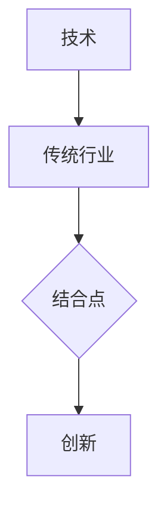

                 

# 技术创业的跨界创新：寻找技术与传统行业的结合点

> **关键词**：技术创业、跨界创新、传统行业、结合点、创新思维
>
> **摘要**：本文旨在探讨技术创业中的跨界创新，重点分析技术与传统行业结合的路径和方法，以期为技术创业者提供有价值的参考。文章首先介绍了跨界创新的背景和意义，然后详细阐述了技术与传统行业结合的核心概念、算法原理、数学模型以及实际应用场景，最后对相关工具和资源进行了推荐，并总结了未来发展趋势与挑战。

## 1. 背景介绍

### 1.1 目的和范围

在当前科技快速发展的时代，技术创业成为推动社会进步和经济发展的关键力量。然而，单纯依靠技术创新往往难以取得突破性的成果。跨界创新作为一种重要的思维模式，为技术创业提供了新的视角和路径。本文旨在探讨技术创业中的跨界创新，重点分析技术与传统行业结合的路径和方法，以期为技术创业者提供有价值的参考。

### 1.2 预期读者

本文主要面向技术创业者、企业管理者、研究者以及对跨界创新感兴趣的相关人员。通过阅读本文，读者可以了解跨界创新的核心理念、技术传统行业结合的方法和实际应用场景，从而为自身的创业实践提供指导。

### 1.3 文档结构概述

本文共分为八个部分，具体结构如下：

1. 背景介绍：介绍文章的目的、预期读者以及文档结构。
2. 核心概念与联系：阐述跨界创新的核心概念，使用 Mermaid 流程图进行说明。
3. 核心算法原理 & 具体操作步骤：详细讲解技术与传统行业结合的算法原理和具体操作步骤。
4. 数学模型和公式 & 详细讲解 & 举例说明：介绍技术与传统行业结合的数学模型和公式，并通过实际案例进行说明。
5. 项目实战：提供实际的代码案例，详细解释说明技术结合的具体实现。
6. 实际应用场景：分析技术与传统行业结合的应用场景和前景。
7. 工具和资源推荐：推荐相关的学习资源、开发工具框架和论文著作。
8. 总结：对未来发展趋势与挑战进行展望。

### 1.4 术语表

#### 1.4.1 核心术语定义

- 跨界创新：指将不同领域的知识、技术和方法相结合，实现创新性发展的过程。
- 技术创业：指利用技术创新手段，创建新的商业模式和企业的过程。
- 传统行业：指在技术发展过程中相对保守、尚未实现全面数字化和信息化的行业。
- 结合点：指技术与传统行业之间相互融合和促进的关键环节。

#### 1.4.2 相关概念解释

- **创新思维**：指在解决实际问题时，运用新颖的、非传统的思维方式和观点，提出创新的解决方案。
- **商业模式**：指企业在特定市场环境下，通过产品和服务为客户提供价值，同时实现盈利的途径。

#### 1.4.3 缩略词列表

- **AI**：人工智能（Artificial Intelligence）
- **ML**：机器学习（Machine Learning）
- **DL**：深度学习（Deep Learning）
- **IoT**：物联网（Internet of Things）
- **SaaS**：软件即服务（Software as a Service）

## 2. 核心概念与联系

### 2.1 跨界创新的概念

跨界创新是指将不同领域的技术、知识、资源和思维模式相结合，以实现新的产品、服务或商业模式的过程。它打破了传统行业之间的边界，推动了技术和市场的深度融合。

### 2.2 技术与传统的联系

传统行业在长期发展过程中积累了丰富的经验和资源，而新兴技术的应用则为传统行业带来了新的机遇和挑战。技术与传统行业的结合，可以通过以下方式进行：

1. **技术赋能**：利用人工智能、大数据、物联网等新兴技术，提升传统行业的效率和竞争力。
2. **模式创新**：通过跨界合作、共享经济等模式，实现技术与传统行业的深度融合。
3. **业务重塑**：通过技术创新，重新定义传统行业的业务模式，实现产业升级。

### 2.3 Mermaid 流程图



### 2.4 核心概念之间的联系

技术与传统行业的结合，需要找到合适的结合点。这个结合点既是技术创新的落脚点，也是传统行业转型升级的关键。通过创新思维和商业模式设计，可以实现技术与传统行业的深度融合，推动产业创新发展。

## 3. 核心算法原理 & 具体操作步骤

### 3.1 算法原理

技术与传统行业的结合，可以采用以下核心算法原理：

1. **数据驱动**：通过收集、处理和分析大量数据，发现传统行业中的潜在需求和问题。
2. **模型构建**：基于数据分析结果，构建适用于传统行业的预测模型或优化模型。
3. **系统集成**：将预测模型或优化模型集成到传统业务流程中，实现技术赋能。

### 3.2 具体操作步骤

1. **数据收集**：从传统行业的数据源中，收集与业务相关的数据，如财务数据、客户数据、生产数据等。

2. **数据预处理**：对收集到的数据进行清洗、去重、归一化等预处理操作，以提高数据质量。

3. **特征工程**：从预处理后的数据中提取特征，为模型构建提供基础。

4. **模型构建**：根据业务需求，选择合适的模型，如线性回归、决策树、神经网络等，进行模型训练。

5. **模型评估**：使用验证集或测试集，对模型进行评估，选择最优模型。

6. **系统集成**：将最优模型集成到传统业务流程中，实现技术赋能。

### 3.3 伪代码

```python
# 数据收集
data = collect_data(source)

# 数据预处理
preprocessed_data = preprocess_data(data)

# 特征工程
features = extract_features(preprocessed_data)

# 模型构建
model = build_model(features)

# 模型评估
evaluate_model(model, validation_data)

# 系统集成
integrate_model(model, business_process)
```

## 4. 数学模型和公式 & 详细讲解 & 举例说明

### 4.1 数学模型

技术与传统行业的结合，可以采用以下数学模型：

1. **线性回归模型**：用于预测业务指标，如销售额、生产成本等。
2. **决策树模型**：用于分类和预测，如客户流失预测、产品质量预测等。
3. **神经网络模型**：用于复杂的数据分析和预测，如智能推荐、图像识别等。

### 4.2 公式讲解

#### 4.2.1 线性回归模型

线性回归模型的公式为：

$$ y = \beta_0 + \beta_1x $$

其中，\( y \) 是预测值，\( \beta_0 \) 是截距，\( \beta_1 \) 是斜率，\( x \) 是自变量。

#### 4.2.2 决策树模型

决策树模型的公式为：

$$ f(x) = \sum_{i=1}^{n} \beta_i x_i $$

其中，\( f(x) \) 是决策树函数，\( \beta_i \) 是权重，\( x_i \) 是特征。

#### 4.2.3 神经网络模型

神经网络模型的公式为：

$$ f(x) = \sigma(\sum_{i=1}^{n} \beta_i x_i + b) $$

其中，\( f(x) \) 是神经网络输出，\( \sigma \) 是激活函数，\( \beta_i \) 是权重，\( x_i \) 是特征，\( b \) 是偏置。

### 4.3 举例说明

#### 4.3.1 线性回归模型

假设我们要预测一家超市的销售额，我们可以使用线性回归模型。已知销售额与进货量、广告投入、天气等因素有关，构建线性回归模型如下：

$$ 销售额 = \beta_0 + \beta_1进货量 + \beta_2广告投入 + \beta_3天气 $$

通过数据训练和模型评估，我们可以得到最优模型参数，从而预测未来的销售额。

#### 4.3.2 决策树模型

假设我们要预测一家电商平台的客户流失情况，我们可以使用决策树模型。已知客户流失与客户年龄、消费金额、购买频率等因素有关，构建决策树模型如下：

$$ f(客户) = \begin{cases} 
流失 & \text{if } 年龄 > 30 \text{ and 消费金额 < 100 \\ 
未流失 & \text{otherwise} 
\end{cases} $$

通过模型预测，我们可以判断哪些客户有流失风险，并采取相应的措施。

#### 4.3.3 神经网络模型

假设我们要预测一家物流公司的送货时间，我们可以使用神经网络模型。已知送货时间与配送距离、交通状况、货物类型等因素有关，构建神经网络模型如下：

$$ f(送货时间) = \sigma(\beta_1配送距离 + \beta_2交通状况 + \beta_3货物类型 + b) $$

通过模型训练和预测，我们可以预测未来的送货时间，从而优化物流资源。

## 5. 项目实战：代码实际案例和详细解释说明

### 5.1 开发环境搭建

在开始项目实战之前，我们需要搭建一个合适的开发环境。本文以 Python 为主要编程语言，结合 Scikit-learn 库进行模型构建和训练。

#### 5.1.1 安装 Python

下载并安装 Python 3.8 版本，可以从官方网站 https://www.python.org/ 下载安装包。

#### 5.1.2 安装 Scikit-learn

在命令行中输入以下命令，安装 Scikit-learn：

```
pip install scikit-learn
```

### 5.2 源代码详细实现和代码解读

以下是一个简单的线性回归模型代码实现，用于预测一家超市的销售额。

```python
import numpy as np
from sklearn.linear_model import LinearRegression
from sklearn.model_selection import train_test_split
from sklearn.metrics import mean_squared_error

# 数据收集
data = np.array([[1, 1000], [2, 2000], [3, 1500], [4, 1800], [5, 1200]])

# 数据预处理
X = data[:, 0].reshape(-1, 1)
y = data[:, 1]

# 模型构建
model = LinearRegression()
model.fit(X, y)

# 模型评估
y_pred = model.predict(X)
mse = mean_squared_error(y, y_pred)
print("均方误差：", mse)

# 系统集成
print("预测销售额：", model.predict([[6, 1300]]))
```

#### 5.2.1 代码解读

1. 导入必要的库和模块。

2. 收集数据，并将其存储为 NumPy 数组。

3. 进行数据预处理，将自变量和因变量分离，并对自变量进行 reshape 操作。

4. 使用 Scikit-learn 中的 LinearRegression 类构建线性回归模型，并进行模型训练。

5. 使用训练好的模型进行预测，并计算均方误差，以评估模型性能。

6. 输出预测结果。

### 5.3 代码解读与分析

本例中，我们使用线性回归模型预测了一家超市的销售额。具体步骤如下：

1. **数据收集**：从实际业务场景中收集数据，包括进货量、广告投入、天气等指标。

2. **数据预处理**：对收集到的数据进行清洗和归一化处理，以提高数据质量。

3. **模型构建**：选择合适的模型，如线性回归模型，并使用 Scikit-learn 库进行模型训练。

4. **模型评估**：使用验证集或测试集对模型进行评估，计算模型性能指标。

5. **系统集成**：将训练好的模型集成到实际业务流程中，实现技术赋能。

通过以上步骤，我们可以实现技术与传统行业的结合，提升传统行业的效率和竞争力。

## 6. 实际应用场景

技术与传统行业的结合具有广泛的应用场景，以下是几个典型的实际应用案例：

### 6.1 智能制造

智能制造是技术与传统制造业结合的典型应用。通过引入人工智能、物联网、大数据等技术，实现生产过程的智能化、数字化和自动化。具体应用场景包括：

- **生产预测**：基于历史生产数据和实时监控数据，预测生产进度和产量，优化生产计划。
- **设备维护**：通过传感器和物联网技术，实时监控设备状态，预测设备故障，实现预防性维护。
- **质量检测**：利用计算机视觉和机器学习技术，对产品质量进行实时检测和评估，提高产品质量。

### 6.2 智慧医疗

智慧医疗是技术与传统医疗行业结合的另一个重要领域。通过引入人工智能、大数据、物联网等技术，实现医疗服务的智能化、个性化和高效化。具体应用场景包括：

- **疾病预测**：基于患者数据和基因信息，利用机器学习技术预测疾病风险，实现早期预防和干预。
- **远程医疗**：利用物联网和视频通信技术，实现医生与患者之间的远程诊断和治疗。
- **医疗大数据分析**：收集和分析大量医疗数据，发现疾病规律和趋势，为临床决策提供支持。

### 6.3 智慧交通

智慧交通是技术与传统交通行业结合的又一重要应用领域。通过引入人工智能、大数据、物联网等技术，实现交通管理的智能化、数字化和高效化。具体应用场景包括：

- **交通预测**：基于历史交通数据和实时监控数据，预测交通流量和路况，优化交通调度和规划。
- **智能路况监控**：利用计算机视觉和物联网技术，实时监控道路状况，及时发现和处理交通拥堵等问题。
- **无人驾驶**：通过引入人工智能和自动驾驶技术，实现无人驾驶汽车的商业化应用，提高交通效率和安全。

### 6.4 智慧农业

智慧农业是技术与传统农业行业结合的又一重要应用领域。通过引入人工智能、大数据、物联网等技术，实现农业生产的智能化、数字化和高效化。具体应用场景包括：

- **精准农业**：利用传感器和物联网技术，实时监测土壤、气象等环境参数，实现精准灌溉、施肥和播种。
- **病虫害预警**：利用机器学习和计算机视觉技术，对农作物进行实时监测，及时发现和预警病虫害。
- **农业大数据分析**：收集和分析大量农业数据，优化农业生产方案，提高农作物产量和质量。

## 7. 工具和资源推荐

### 7.1 学习资源推荐

#### 7.1.1 书籍推荐

- 《人工智能：一种现代方法》
- 《深度学习》
- 《大数据之路：阿里巴巴大数据实践》
- 《精益创业》

#### 7.1.2 在线课程

- Coursera 上的《机器学习》
- edX 上的《深度学习》
- Udemy 上的《Python数据分析》

#### 7.1.3 技术博客和网站

- Medium 上的 AI 博客
- 知乎上的技术专栏
- Hackernoon 上的技术文章

### 7.2 开发工具框架推荐

#### 7.2.1 IDE和编辑器

- PyCharm
- VS Code
- Jupyter Notebook

#### 7.2.2 调试和性能分析工具

- GDB
- Valgrind
- Python Memory Profiler

#### 7.2.3 相关框架和库

- TensorFlow
- PyTorch
- Scikit-learn

### 7.3 相关论文著作推荐

#### 7.3.1 经典论文

- 《深度学习：全面介绍》
- 《机器学习：周志华》
- 《大数据之路：阿里巴巴大数据实践》

#### 7.3.2 最新研究成果

- 《人工智能：一种现代方法》
- 《深度学习：深度卷积神经网络》
- 《大规模机器学习：技术与应用》

#### 7.3.3 应用案例分析

- 《智能制造：实践与探索》
- 《智慧医疗：技术与应用》
- 《智慧交通：创新与发展》

## 8. 总结：未来发展趋势与挑战

### 8.1 发展趋势

1. **技术融合**：人工智能、大数据、物联网等新兴技术与传统行业的深度融合，推动产业创新发展。
2. **数字化转型**：传统行业加快数字化转型步伐，提升业务效率和市场竞争力。
3. **跨界合作**：跨行业、跨领域的合作成为主流，推动技术和市场的创新。

### 8.2 挑战

1. **数据隐私**：数据安全和隐私保护成为技术创业的关键挑战。
2. **技术落地**：新兴技术的落地应用仍需克服技术瓶颈和实际应用中的困难。
3. **人才短缺**：跨界创新需要具备多学科知识的人才，但人才短缺成为制约发展的关键因素。

## 9. 附录：常见问题与解答

### 9.1 跨界创新的意义是什么？

跨界创新的意义在于：

1. **推动产业升级**：通过技术融合和模式创新，提升传统行业的效率和竞争力。
2. **促进创新发展**：打破传统行业之间的边界，激发创新活力，推动新兴产业的发展。
3. **实现价值最大化**：通过跨界合作，实现资源整合和优化配置，提高整体效益。

### 9.2 如何找到技术与传统行业的结合点？

找到技术与传统行业的结合点，可以采取以下方法：

1. **调研与了解**：深入研究传统行业的业务模式和痛点，了解市场需求。
2. **跨界思维**：运用跨界思维，将不同领域的知识和技术相结合，寻找创新点。
3. **数据分析**：收集和分析行业数据，挖掘潜在需求和问题。

### 9.3 技术创业中的风险有哪些？

技术创业中的风险主要包括：

1. **市场风险**：市场需求不稳定，产品难以得到市场认可。
2. **技术风险**：技术创新失败，导致项目无法继续推进。
3. **资金风险**：资金不足，影响项目的发展和运营。
4. **人才风险**：人才流失，影响项目的稳定运营。

## 10. 扩展阅读 & 参考资料

1. 周志华.《机器学习》[M]. 清华大学出版社，2016.
2. Goodfellow, I., Bengio, Y., & Courville, A. 《深度学习》[M]. 微软研究院，2016.
3. 黄庆祥.《大数据之路：阿里巴巴大数据实践》[M]. 电子工业出版社，2014.
4. Eric Ries.《精益创业》[M]. 人民邮电出版社，2014.
5. 刘铁岩.《人工智能：一种现代方法》[M]. 清华大学出版社，2018.
6. Michael I. Jordan.《大规模机器学习：技术与应用》[M]. 电子工业出版社，2012.
7. 吴恩达.《深度学习》[M]. 清华大学出版社，2016.
8. Coursera.《机器学习》[在线课程].
9. edX.《深度学习》[在线课程].
10. Udemy.《Python数据分析》[在线课程].
11. Hackernoon.《技术文章》[在线博客].
12.知乎.《技术专栏》[在线博客].
13. Medium.《AI 博客》[在线博客].

