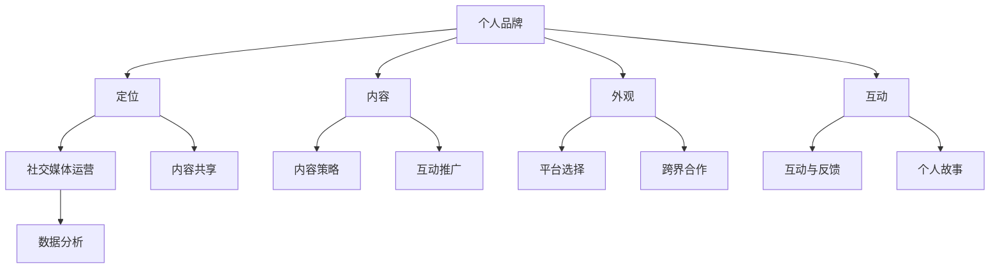

                 


# 技术创业者的个人品牌塑造与社交媒体运营

> 关键词：个人品牌、社交媒体、技术创业者、品牌塑造、社交媒体运营、社交媒体策略

> 摘要：本文将探讨技术创业者如何通过有效的个人品牌塑造和社交媒体运营来提升自己的影响力、吸引潜在客户和合作伙伴，并最终实现商业成功。我们将从核心概念、具体操作步骤、数学模型、项目实战等多个维度，系统性地解析这一过程。

## 1. 背景介绍

### 1.1 目的和范围

本文旨在帮助技术创业者了解和掌握个人品牌塑造与社交媒体运营的技巧，以便在竞争激烈的创业环境中脱颖而出。我们将涵盖以下内容：

- 个人品牌塑造的重要性
- 社交媒体运营的核心原则
- 个人品牌与社交媒体的互动策略
- 项目实战案例分析
- 工具和资源推荐

### 1.2 预期读者

- 初创公司创始人
- 技术创业者
- 市场营销人员
- 社交媒体运营者

### 1.3 文档结构概述

本文分为十个部分，包括：

- 背景介绍
- 核心概念与联系
- 核心算法原理与具体操作步骤
- 数学模型和公式
- 项目实战
- 实际应用场景
- 工具和资源推荐
- 总结：未来发展趋势与挑战
- 附录：常见问题与解答
- 扩展阅读 & 参考资料

### 1.4 术语表

#### 1.4.1 核心术语定义

- 个人品牌：个人在市场上所形成的独特形象和认知。
- 社交媒体：网络平台，如Twitter、LinkedIn、Facebook等，用于发布和分享信息、建立联系和互动。
- 品牌塑造：通过一系列策略和行动，建立和提升个人品牌的过程。
- 社交媒体运营：管理、发布和推广内容，以增加社交媒体平台上的关注度和互动。

#### 1.4.2 相关概念解释

- 影响力：个人或品牌在社交媒体上获得的关注和信任程度。
- 潜在客户：可能对产品或服务感兴趣的人群。
- 合作伙伴：与个人或公司有合作关系的人或组织。
- 商业成功：实现盈利、增长和市场领导地位。

#### 1.4.3 缩略词列表

- SEO：搜索引擎优化（Search Engine Optimization）
- SMM：社交媒体营销（Social Media Marketing）
- KPI：关键绩效指标（Key Performance Indicators）
- ROI：投资回报率（Return on Investment）

## 2. 核心概念与联系

在个人品牌塑造与社交媒体运营中，有几个核心概念需要理解，它们相互关联，共同构成一个完整的生态系统。

### 2.1 个人品牌

个人品牌是指个人在市场中的独特形象和认知。一个成功的个人品牌能够吸引潜在客户和合作伙伴，增强市场竞争力。个人品牌的核心要素包括：

1. **定位**：确定个人品牌的核心价值和优势，明确目标市场和受众。
2. **内容**：创建高质量、有价值的原创内容，展示专业知识和行业洞察。
3. **外观**：设计专业的个人形象，包括头像、名片、网站等。
4. **互动**：与受众建立真实、互动的关系，提高忠诚度和信任度。

### 2.2 社交媒体运营

社交媒体运营是指通过社交媒体平台管理和推广个人品牌的过程。以下是其关键要素：

1. **平台选择**：根据目标受众和业务需求，选择合适的社交媒体平台。
2. **内容策略**：制定内容发布计划，包括频率、形式和话题。
3. **互动与反馈**：积极与受众互动，回应评论和私信，建立良好关系。
4. **数据分析**：监测和分析社交媒体活动，优化策略和提高效果。

### 2.3 个人品牌与社交媒体的互动

个人品牌与社交媒体的互动策略是品牌塑造的关键。以下是一些有效策略：

1. **内容共享**：在社交媒体上分享个人品牌相关的内容，如博客文章、视频、讲座等。
2. **互动推广**：利用社交媒体活动，如问答、投票、竞赛等，提高参与度和互动性。
3. **跨界合作**：与其他领域或个人合作，扩大品牌影响力。
4. **个人故事**：分享个人成长、经历和成功故事，增强情感连接。

### 2.4 Mermaid 流程图

以下是一个简化的 Mermaid 流程图，展示个人品牌塑造与社交媒体运营的核心概念和联系：



## 3. 核心算法原理 & 具体操作步骤

在个人品牌塑造与社交媒体运营中，算法原理和具体操作步骤是成功的关键。以下是一个简化的伪代码，用于指导技术创业者进行个人品牌塑造与社交媒体运营：

```pseudo
function PersonalBrandBuildingAndSocialMediaStrategy(username, niche, goals)
    # 初始化变量
    brand_identity <- {}
    social_media_plan <- {}
    
    # 3.1 定位
    brand_identity["定位"] <- Positioning(username, niche)
    
    # 3.2 内容策略
    social_media_plan["内容策略"] <- ContentStrategy(username, niche, goals)
    
    # 3.3 外观设计
    brand_identity["外观"] <- AppearanceDesign(username, goals)
    
    # 3.4 互动与反馈
    brand_identity["互动与反馈"] <- InteractionAndFeedback(username, niche, goals)
    
    # 3.5 数据分析
    social_media_plan["数据分析"] <- DataAnalysis(username, niche, goals)
    
    # 返回个人品牌与社交媒体运营计划
    return brand_identity, social_media_plan
end function

# 3.6 具体操作步骤
function Positioning(username, niche)
    # 确定个人品牌的核心价值和优势
    # 确定目标市场和受众
    return positioned_brand
end function

function ContentStrategy(username, niche, goals)
    # 制定内容发布计划
    # 确定内容形式和话题
    return content_plan
end function

function AppearanceDesign(username, goals)
    # 设计个人形象
    # 包括头像、名片、网站等
    return appearance
end function

function InteractionAndFeedback(username, niche, goals)
    # 与受众建立真实、互动的关系
    # 提高忠诚度和信任度
    return interaction_plan
end function

function DataAnalysis(username, niche, goals)
    # 监测和分析社交媒体活动
    # 优化策略和提高效果
    return analysis_results
end function
```

## 4. 数学模型和公式 & 详细讲解 & 举例说明

在个人品牌塑造与社交媒体运营中，数学模型和公式可以帮助技术创业者量化指标，优化策略，提高效果。以下是一些常用的数学模型和公式：

### 4.1 转化率公式

转化率是指受众在接触个人品牌内容后，采取预期行动的比例。转化率公式如下：

$$
\text{转化率} = \frac{\text{采取预期行动的人数}}{\text{接触内容的人数}} \times 100\%
$$

举例说明：假设有1000人阅读了您的博客文章，其中200人采取了购买产品或服务的行动，则转化率为：

$$
\text{转化率} = \frac{200}{1000} \times 100\% = 20\%
$$

### 4.2 情感连接度公式

情感连接度是指受众对个人品牌的情感认同和信任程度。情感连接度公式如下：

$$
\text{情感连接度} = \frac{\text{积极反馈人数}}{\text{总反馈人数}} \times 100\%
$$

举例说明：假设有100人参与了您的社交媒体互动，其中70人给予了积极反馈，则情感连接度为：

$$
\text{情感连接度} = \frac{70}{100} \times 100\% = 70\%
$$

### 4.3 营销ROI计算

营销ROI是指营销活动的投资回报率，用于评估营销活动的效果。营销ROI公式如下：

$$
\text{营销ROI} = \frac{\text{总收益}}{\text{总投资}} \times 100\%
$$

举例说明：假设您在社交媒体上投入了10000元，通过营销活动实现了20000元的收益，则营销ROI为：

$$
\text{营销ROI} = \frac{20000}{10000} \times 100\% = 200\%
$$

### 4.4 社交媒体影响力指数

社交媒体影响力指数是指个人品牌在社交媒体上的影响力大小。以下是一个简单的社交媒体影响力指数计算公式：

$$
\text{影响力指数} = \frac{\text{关注者数量}}{\text{互动率}} \times 100
$$

举例说明：假设您的社交媒体账号有10000名关注者，每月平均互动率为10%，则影响力指数为：

$$
\text{影响力指数} = \frac{10000}{10\%} \times 100 = 100000
$$

## 5. 项目实战：代码实际案例和详细解释说明

### 5.1 开发环境搭建

在本节中，我们将使用Python语言，结合几个流行的社交媒体API库，搭建一个简单的个人品牌与社交媒体运营工具。以下是一个Python环境搭建的示例：

```bash
# 安装Python
$ sudo apt-get install python3

# 安装必要库
$ pip3 install tweepy requests beautifulsoup4
```

### 5.2 源代码详细实现和代码解读

以下是实现个人品牌与社交媒体运营的Python代码，包括获取用户数据、分析情感连接度、发布内容等功能：

```python
import tweepy
import requests
from bs4 import BeautifulSoup
from textblob import TextBlob

# 设置API密钥和令牌（替换为自己的API信息）
consumer_key = 'YOUR_CONSUMER_KEY'
consumer_secret = 'YOUR_CONSUMER_SECRET'
access_token = 'YOUR_ACCESS_TOKEN'
access_token_secret = 'YOUR_ACCESS_TOKEN_SECRET'

# 初始化Tweepy认证
auth = tweepy.OAuthHandler(consumer_key, consumer_secret)
auth.set_access_token(access_token, access_token_secret)
api = tweepy.API(auth)

# 获取用户数据
def get_user_data(username):
    user = api.get_user(username)
    return {
        'name': user.name,
        'location': user.location,
        'followers_count': user.followers_count,
        'statuses_count': user.statuses_count,
        'verified': user.verified
    }

# 分析情感连接度
def analyze_sentiment(text):
    analysis = TextBlob(text)
    return analysis.sentiment.polarity

# 发布内容
def post_content(username, content):
    api.update_status(username, content)

# 示例：获取用户数据
user_data = get_user_data('YourUsername')
print(user_data)

# 示例：分析情感连接度
sentiment_score = analyze_sentiment('This is a great article about AI.')
print(f'Sentiment Score: {sentiment_score}')

# 示例：发布内容
post_content('YourUsername', 'Check out this new blog post on AI technology!')
```

### 5.3 代码解读与分析

该代码分为三个主要部分：获取用户数据、分析情感连接度和发布内容。

1. **获取用户数据**：通过Tweepy库，调用`get_user_data`函数获取目标用户的详细信息，包括名称、位置、关注者数量、发布状态数量和是否认证等。

2. **分析情感连接度**：使用TextBlob库，调用`analyze_sentiment`函数分析用户发布内容的情感倾向。TextBlob提供了一个简单的接口，通过计算文本的情感极性（polarity），可以判断用户内容是否具有积极或消极的情感。

3. **发布内容**：调用`post_content`函数，通过Tweepy库在目标用户的社交媒体账号上发布内容。

此代码示例展示了如何使用Python和Tweepy等库来构建一个简单的个人品牌与社交媒体运营工具。通过这些功能，技术创业者可以更好地了解自己的用户，分析用户情感，并发布相关内容来提升个人品牌的影响力。

## 6. 实际应用场景

在技术创业领域，个人品牌塑造与社交媒体运营具有广泛的应用场景。以下是一些典型的实际应用场景：

### 6.1 初创公司品牌推广

对于初创公司，个人品牌塑造是提高公司知名度的重要手段。创始人可以通过分享公司的技术突破、产品更新、团队动态等内容，在社交媒体上建立强大的个人品牌，进而提升公司的品牌影响力。例如，通过定期发布技术博客、行业分析、产品演示等高质量内容，吸引潜在客户和合作伙伴。

### 6.2 技术解决方案推广

技术创业者可以通过社交媒体平台展示自己的技术解决方案，如开源项目、工具和框架等。通过分享项目的技术细节、使用场景、优势和案例，吸引技术爱好者和专业人士的关注。例如，GitHub上的项目页面、Stack Overflow上的技术讨论、技术论坛等都是推广技术解决方案的有效途径。

### 6.3 技术演讲和讲座

技术创业者可以通过社交媒体平台发布自己的技术演讲和讲座视频，分享专业知识和行业见解。这不仅有助于提升个人品牌，还可以吸引更多的观众和潜在客户。例如，YouTube、LinkedIn等平台提供了丰富的视频分享功能，技术创业者可以上传自己的讲座视频，并与观众互动。

### 6.4 合作与拓展

通过社交媒体平台，技术创业者可以与同行业人士、合作伙伴、投资人等建立联系，拓展人脉资源。参加行业会议、技术沙龙等活动，并与参会者互动，也是提升个人品牌和拓展合作机会的有效途径。

### 6.5 招聘与人才吸引

技术创业者可以利用社交媒体平台发布招聘信息，吸引优秀的人才加入团队。通过展示公司的技术实力、团队氛围和发展前景，吸引有才华的工程师和技术专家。

## 7. 工具和资源推荐

为了帮助技术创业者更好地进行个人品牌塑造和社交媒体运营，以下是一些实用的工具和资源推荐：

### 7.1 学习资源推荐

#### 7.1.1 书籍推荐

- 《社交媒体营销：策略与实践》
- 《个人品牌的力量：如何打造影响力，赢得客户和成功》
- 《社交媒体运营实战：从入门到精通》

#### 7.1.2 在线课程

- Coursera上的《社交媒体营销》课程
- Udemy上的《个人品牌塑造：打造影响力，赢得客户和成功》课程
- LinkedIn Learning上的《社交媒体运营：从新手到专家》课程

#### 7.1.3 技术博客和网站

- HackerRank
- Stack Overflow
- Medium

### 7.2 开发工具框架推荐

#### 7.2.1 IDE和编辑器

- Visual Studio Code
- IntelliJ IDEA
- PyCharm

#### 7.2.2 调试和性能分析工具

- Chrome DevTools
- PyCharm的调试工具
- GitKraken

#### 7.2.3 相关框架和库

- Tweepy（Twitter API）
- Flask（Web框架）
- SQLAlchemy（数据库操作库）

### 7.3 相关论文著作推荐

#### 7.3.1 经典论文

- “The Facebook Ads API: A Framework for Large-scale Social Media Advertising” by Facebook
- “The Twitter API: Designing for a Real-time Web” by Twitter

#### 7.3.2 最新研究成果

- “Social Media Analytics: Methods, Algorithms, and Applications” by B. Wu, X. Yan, and H. Jin
- “Influence Maximization in Social Networks: A Survey” by M. Cheng and X. Li

#### 7.3.3 应用案例分析

- “The Power of Personal Branding: How Elon Musk Built a Multibillion-Dollar Empire” by Business Insider
- “LinkedIn's Social Selling: How the World's Largest Professional Network Is Changing Sales Forever” by Forbes

## 8. 总结：未来发展趋势与挑战

在技术创业领域，个人品牌塑造与社交媒体运营正变得越来越重要。未来，随着社交媒体平台的不断发展和用户需求的多样化，个人品牌塑造与社交媒体运营将呈现出以下趋势和挑战：

### 8.1 趋势

- **个性化内容**：随着人工智能和大数据技术的发展，个性化内容将变得更加普及，技术创业者需要更加精准地了解受众需求，提供定制化内容。
- **多平台整合**：技术创业者需要充分利用多个社交媒体平台，实现内容的跨平台传播和互动，提高品牌影响力。
- **视频内容**：随着短视频和直播的兴起，视频内容将占据更大的市场份额，技术创业者可以通过制作高质量的短视频和直播来吸引观众。
- **社交媒体营销自动化**：利用人工智能和机器学习技术，实现社交媒体营销的自动化和智能化，提高运营效率和效果。

### 8.2 挑战

- **数据隐私**：随着数据隐私法规的加强，技术创业者需要确保用户数据的安全和合规，避免隐私泄露风险。
- **内容质量**：在信息爆炸的时代，技术创业者需要提高内容质量，避免同质化和低质内容，确保受众对品牌的认知和价值认同。
- **时间管理**：个人品牌塑造与社交媒体运营需要持续的时间和精力投入，技术创业者需要合理安排时间，确保运营效果的持续性和稳定性。
- **竞争压力**：随着越来越多的创业者进入社交媒体领域，竞争压力将不断增大，技术创业者需要不断创新和优化运营策略，以保持竞争优势。

## 9. 附录：常见问题与解答

### 9.1 如何制定有效的社交媒体策略？

- **明确目标**：首先确定社交媒体运营的目标，如品牌推广、客户吸引、合作伙伴拓展等。
- **了解受众**：深入分析目标受众的需求、兴趣和行为习惯，制定针对性的内容策略。
- **平台选择**：根据目标受众和业务需求，选择合适的社交媒体平台，如LinkedIn、Twitter、Facebook等。
- **内容创作**：创建高质量、有价值的内容，展示专业知识和行业洞察，提高受众参与度和忠诚度。
- **互动与反馈**：积极与受众互动，回应评论和私信，建立良好的用户关系。
- **数据分析**：持续监测和分析社交媒体活动，优化策略和提高效果。

### 9.2 个人品牌塑造与社交媒体运营需要多少时间？

个人品牌塑造与社交媒体运营需要持续的时间和精力投入。具体时间取决于运营目标、内容创作频率、受众规模等因素。一般来说，每周投入数小时进行内容创作、互动和数据分析是必要的。

### 9.3 如何在社交媒体上保持活跃度？

- **制定内容发布计划**：定期发布内容，保持社交媒体账号的活跃度。
- **参与话题和热点**：关注行业热点和话题，积极参与讨论，提高曝光度。
- **互动与反馈**：积极回应评论和私信，建立良好的用户关系。
- **合作与分享**：与其他领域或个人合作，分享资源和知识，扩大影响力。

### 9.4 社交媒体营销是否适用于所有类型的企业？

是的，社交媒体营销适用于几乎所有类型的企业。不同类型的企业的社交媒体策略和内容形式可能有所不同，但目标都是提高品牌知名度、吸引客户和合作伙伴。

## 10. 扩展阅读 & 参考资料

- 《社交媒体营销：策略与实践》
- 《个人品牌的力量：如何打造影响力，赢得客户和成功》
- 《社交媒体运营实战：从入门到精通》
- Coursera上的《社交媒体营销》课程
- Udemy上的《个人品牌塑造：打造影响力，赢得客户和成功》课程
- LinkedIn Learning上的《社交媒体运营：从新手到专家》课程
- HackerRank
- Stack Overflow
- Medium
- “The Facebook Ads API: A Framework for Large-scale Social Media Advertising” by Facebook
- “The Twitter API: Designing for a Real-time Web” by Twitter
- “Social Media Analytics: Methods, Algorithms, and Applications” by B. Wu, X. Yan, and H. Jin
- “Influence Maximization in Social Networks: A Survey” by M. Cheng and X. Li
- “The Power of Personal Branding: How Elon Musk Built a Multibillion-Dollar Empire” by Business Insider
- “LinkedIn's Social Selling: How the World's Largest Professional Network Is Changing Sales Forever” by Forbes

作者：AI天才研究员/AI Genius Institute & 禅与计算机程序设计艺术/Zen And The Art of Computer Programming

