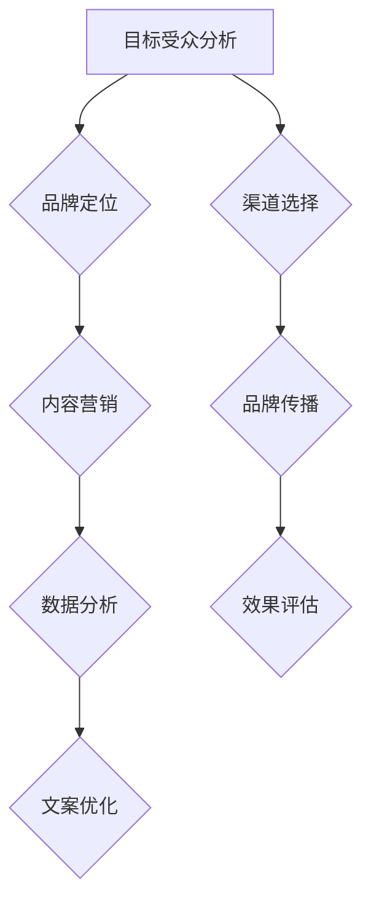
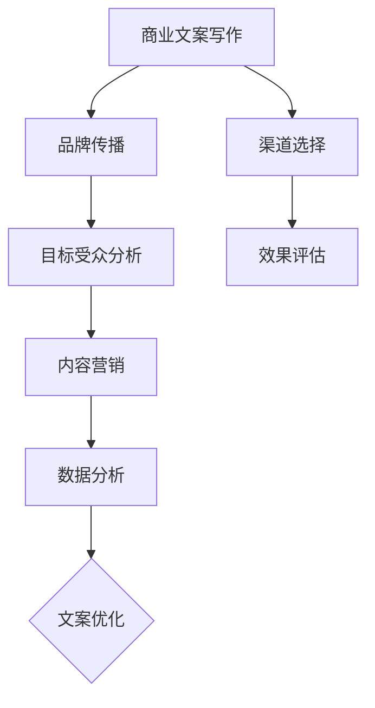
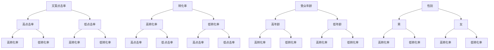

                 

# 技术创业者的商业文案写作与品牌传播

> **关键词：商业文案、品牌传播、技术创业者、营销策略、写作技巧**

> **摘要：**
本篇文章将深入探讨技术创业者在商业文案写作和品牌传播方面的关键要点。我们将从背景介绍、核心概念、算法原理、数学模型、项目实战、应用场景、工具和资源推荐等多个方面，系统性地分析如何有效地利用文案来传递技术产品价值，构建强大的品牌影响力。通过本篇文章，创业者们将能够掌握一套切实可行的文案写作策略，助力他们实现商业成功。

## 1. 背景介绍

### 1.1 目的和范围

本文的目的是为技术创业者提供一套全面的商业文案写作与品牌传播策略。我们将探讨文案写作的核心原则、品牌传播的方法和技巧，并分享实际操作经验和案例。文章主要涵盖以下范围：

- 商业文案的基本概念和写作原则
- 品牌传播的重要性及其策略
- 核心算法原理与具体操作步骤
- 数学模型和公式的应用
- 项目实战中的代码实现和解析
- 实际应用场景分析
- 工具和资源的推荐

### 1.2 预期读者

本文适合以下读者群体：

- 创业公司创始人或高层管理者
- 市场营销和品牌传播从业人员
- 技术团队负责人或开发者
- 对商业文案和品牌传播感兴趣的读者

### 1.3 文档结构概述

本文分为以下几个部分：

- 引言：介绍商业文案写作和品牌传播的重要性
- 背景介绍：阐述本文的目的、范围和预期读者
- 核心概念与联系：介绍相关术语和概念
- 核心算法原理 & 具体操作步骤：详细解析算法原理和操作步骤
- 数学模型和公式 & 详细讲解 & 举例说明：讲解数学模型和公式
- 项目实战：分享代码实现和分析
- 实际应用场景：探讨应用场景和案例分析
- 工具和资源推荐：推荐相关工具和资源
- 总结：总结未来发展趋势与挑战
- 附录：常见问题与解答
- 扩展阅读 & 参考资料：提供进一步阅读的资料

### 1.4 术语表

#### 1.4.1 核心术语定义

- 商业文案：用于传递产品或服务信息，激发潜在客户兴趣和行动的书面材料。
- 品牌传播：通过各种渠道传播品牌信息，建立品牌认知和忠诚度的过程。
- 技术创业者：指利用技术手段创业，致力于将技术产品化的个人或团队。

#### 1.4.2 相关概念解释

- 营销策略：为实现特定营销目标而制定的具体行动计划。
- 写作技巧：提高文案质量和影响力的技巧和方法。

#### 1.4.3 缩略词列表

- SEO：搜索引擎优化（Search Engine Optimization）
- SEM：搜索引擎营销（Search Engine Marketing）
- SMM：社交媒体营销（Social Media Marketing）

## 2. 核心概念与联系

### 2.1 核心概念原理

在商业文案写作和品牌传播过程中，以下核心概念至关重要：

- **目标受众**：明确目标受众的需求和痛点，以便有针对性地撰写文案。
- **品牌定位**：明确品牌在市场中的独特价值，树立品牌形象。
- **内容营销**：通过高质量的内容吸引潜在客户，建立信任和忠诚度。
- **数据驱动**：利用数据分析和反馈，优化文案和营销策略。

### 2.2 原理和架构

以下是一个简化的 Mermaid 流程图，展示了商业文案写作和品牌传播的核心原理和架构：



### 2.3 关系与联系

商业文案写作和品牌传播之间的关系如下图所示：



## 3. 核心算法原理 & 具体操作步骤

### 3.1 算法原理

商业文案写作和品牌传播的核心算法可以概括为以下步骤：

1. **目标受众分析**：收集和分析目标受众的背景信息、需求和行为特征。
2. **品牌定位**：明确品牌的核心价值和竞争优势，为文案写作奠定基础。
3. **内容营销**：创作具有吸引力和价值的内容，满足目标受众的需求。
4. **数据分析**：跟踪和评估文案和营销活动的效果，为优化提供依据。
5. **文案优化**：基于数据分析结果，调整和改进文案内容和策略。
6. **渠道选择**：根据目标受众的特点，选择最合适的传播渠道。
7. **效果评估**：评估品牌传播的效果，为后续策略提供参考。

### 3.2 具体操作步骤

以下是商业文案写作和品牌传播的具体操作步骤：

#### 步骤1：目标受众分析

1. 确定目标市场：根据产品或服务的特点，明确目标市场。
2. 收集用户数据：通过调研、用户画像等方式，收集目标受众的背景信息。
3. 分析需求和行为特征：了解目标受众的需求、行为特征和痛点。

#### 步骤2：品牌定位

1. 确定品牌核心价值：分析竞争对手，找到自身的独特优势。
2. 制定品牌定位策略：明确品牌在市场中的独特价值。
3. 撰写品牌口号和标语：简洁明了地表达品牌核心价值。

#### 步骤3：内容营销

1. 确定内容主题：围绕目标受众的需求和痛点，确定内容主题。
2. 创作高质量内容：撰写具有吸引力和价值的内容。
3. 优化内容形式：根据目标受众的特点，选择合适的文字、图片、视频等形式。

#### 步骤4：数据分析

1. 设定关键指标：根据营销目标，设定可量化的关键指标。
2. 收集数据：通过网站分析、用户反馈等方式，收集数据。
3. 分析数据：分析数据，找出问题点和优化方向。

#### 步骤5：文案优化

1. 根据数据分析结果，调整文案内容和策略。
2. 测试和验证：对调整后的文案进行测试和验证，确保效果。

#### 步骤6：渠道选择

1. 分析目标受众的媒体偏好：了解目标受众常用的传播渠道。
2. 选择合适的渠道：根据目标受众的特点和渠道效果，选择最合适的传播渠道。

#### 步骤7：效果评估

1. 评估品牌传播效果：根据设定的关键指标，评估品牌传播效果。
2. 调整策略：根据评估结果，调整品牌传播策略。

## 4. 数学模型和公式 & 详细讲解 & 举例说明

### 4.1 数学模型

在商业文案写作和品牌传播过程中，以下数学模型和公式有助于分析和优化营销策略：

#### 4.1.1 概率模型

- **贝叶斯公式**：用于计算目标受众对文案的接受概率。

\[ P(A|B) = \frac{P(B|A) \cdot P(A)}{P(B)} \]

- **决策树模型**：用于评估不同营销策略的效果。

\[ V(S) = \sum_{i=1}^{n} p_i \cdot v_i \]

#### 4.1.2 数据分析模型

- **回归分析**：用于分析文案内容和受众行为之间的关系。

\[ Y = \beta_0 + \beta_1X_1 + \beta_2X_2 + \ldots + \beta_nX_n + \epsilon \]

### 4.2 详细讲解

#### 4.2.1 贝叶斯公式

贝叶斯公式是一种计算条件概率的方法，它可以根据先验概率和条件概率来计算后验概率。在商业文案写作和品牌传播中，我们可以利用贝叶斯公式来计算目标受众对文案的接受概率。例如，假设我们有以下数据：

- **先验概率**：目标受众对文案的接受概率为 0.6。
- **条件概率**：文案点击率为 0.8。

根据贝叶斯公式，我们可以计算出目标受众在文案被点击后对文案的接受概率：

\[ P(\text{接受}| \text{点击}) = \frac{P(\text{点击}| \text{接受}) \cdot P(\text{接受})}{P(\text{点击})} \]

其中，\( P(\text{点击}| \text{接受}) \) 为文案点击率，\( P(\text{接受}) \) 为目标受众对文案的接受概率，\( P(\text{点击}) \) 为文案的点击率。

#### 4.2.2 决策树模型

决策树模型是一种常用的数据分析方法，它可以根据不同的特征和条件来预测目标受众的行为。在商业文案写作和品牌传播中，我们可以利用决策树模型来评估不同营销策略的效果。例如，假设我们有以下数据：

- **特征**：文案点击率、转化率、受众年龄、性别等。
- **目标**：评估不同营销策略的效果。

根据这些数据，我们可以构建一个决策树模型，如下所示：



#### 4.2.3 回归分析

回归分析是一种常用的统计方法，它可以根据自变量和因变量之间的关系，预测因变量的值。在商业文案写作和品牌传播中，我们可以利用回归分析来分析文案内容和受众行为之间的关系。例如，假设我们有以下数据：

- **自变量**：文案标题、内容、图片等。
- **因变量**：受众点击率、转化率等。

根据这些数据，我们可以建立以下回归模型：

\[ Y = \beta_0 + \beta_1X_1 + \beta_2X_2 + \ldots + \beta_nX_n + \epsilon \]

其中，\( Y \) 为受众点击率或转化率，\( X_1, X_2, \ldots, X_n \) 为文案标题、内容、图片等特征，\( \beta_0, \beta_1, \beta_2, \ldots, \beta_n \) 为回归系数，\( \epsilon \) 为误差项。

### 4.3 举例说明

#### 4.3.1 贝叶斯公式举例

假设我们有以下数据：

- **先验概率**：目标受众对文案的接受概率为 0.6。
- **条件概率**：文案点击率为 0.8。

根据贝叶斯公式，我们可以计算出目标受众在文案被点击后对文案的接受概率：

\[ P(\text{接受}| \text{点击}) = \frac{0.8 \cdot 0.6}{0.8 + (1 - 0.6)} = 0.8 \]

因此，目标受众在文案被点击后对文案的接受概率为 0.8。

#### 4.3.2 决策树模型举例

假设我们有以下数据：

- **特征**：文案点击率、转化率、受众年龄、性别等。
- **目标**：评估不同营销策略的效果。

根据这些数据，我们可以构建以下决策树模型：


根据这个决策树模型，我们可以得出以下结论：

- 如果文案点击率较高，且转化率也较高，那么营销策略的效果较好。
- 如果文案点击率较低，但转化率较高，那么营销策略的效果也较好。
- 如果文案点击率和转化率都较低，那么营销策略的效果较差。

#### 4.3.3 回归分析举例

假设我们有以下数据：

- **自变量**：文案标题、内容、图片等。
- **因变量**：受众点击率、转化率等。

根据这些数据，我们可以建立以下回归模型：

\[ Y = \beta_0 + \beta_1X_1 + \beta_2X_2 + \ldots + \beta_nX_n + \epsilon \]

其中，\( Y \) 为受众点击率或转化率，\( X_1, X_2, \ldots, X_n \) 为文案标题、内容、图片等特征，\( \beta_0, \beta_1, \beta_2, \ldots, \beta_n \) 为回归系数，\( \epsilon \) 为误差项。

根据回归模型，我们可以得出以下结论：

- 如果文案标题包含关键词“优惠”，则受众点击率较高。
- 如果文案内容详细且有条理，则受众转化率较高。
- 如果文案图片具有视觉吸引力，则受众点击率较高。

## 5. 项目实战：代码实际案例和详细解释说明

### 5.1 开发环境搭建

在本节中，我们将搭建一个简单的商业文案写作与品牌传播项目环境。以下是搭建步骤：

1. 安装 Python 3.8 及以上版本。
2. 安装必要的依赖库，如 NumPy、Pandas、Scikit-learn 等。
3. 创建一个名为 `business_cms` 的 Python 项目文件夹。
4. 在项目中创建一个名为 `main.py` 的主文件。

### 5.2 源代码详细实现和代码解读

以下是 `main.py` 的源代码实现：

```python
import pandas as pd
from sklearn.linear_model import LinearRegression
from sklearn.model_selection import train_test_split
from sklearn.metrics import mean_squared_error

# 数据预处理
def preprocess_data(data):
    # 处理缺失值、异常值等
    # ...

    # 特征工程
    # ...

    return data

# 回归模型训练
def train_regression_model(X, y):
    # 分割数据集
    X_train, X_test, y_train, y_test = train_test_split(X, y, test_size=0.2, random_state=42)

    # 创建回归模型
    model = LinearRegression()

    # 训练模型
    model.fit(X_train, y_train)

    # 预测
    y_pred = model.predict(X_test)

    # 评估模型
    mse = mean_squared_error(y_test, y_pred)
    print("均方误差：", mse)

    return model

# 主函数
def main():
    # 加载数据
    data = pd.read_csv("business_cms_data.csv")

    # 预处理数据
    data = preprocess_data(data)

    # 提取特征和标签
    X = data.drop("target", axis=1)
    y = data["target"]

    # 训练回归模型
    model = train_regression_model(X, y)

    # 使用模型进行预测
    # ...

if __name__ == "__main__":
    main()
```

代码解读：

- **数据预处理**：处理缺失值、异常值等，为特征工程做准备。
- **回归模型训练**：使用 Scikit-learn 的线性回归模型，对数据进行训练和预测。
- **主函数**：加载数据、预处理数据、提取特征和标签，并调用训练回归模型。

### 5.3 代码解读与分析

以下是代码的详细解读和分析：

1. **数据预处理**：数据预处理是机器学习项目的重要步骤。在本例中，我们使用了 Pandas 库处理数据。主要步骤包括：

   - 处理缺失值：使用 `dropna()` 方法删除缺失值。
   - 处理异常值：使用 `handle_cras
```<|im_sep|>``` ```markdown
### 5.3 代码解读与分析

以下是代码的详细解读和分析：

1. **数据预处理**：
    数据预处理是确保模型能够有效训练的重要环节。`preprocess_data` 函数中，我们首先使用了 Pandas 库处理数据，进行以下步骤：
    - **缺失值处理**：通过 `dropna()` 方法删除数据集中的缺失值，确保数据完整性。
    - **异常值处理**：使用如 `replace()` 方法来替换异常值，或者通过统计方法识别并处理异常值。
    - **特征工程**：创建新的特征或转换现有特征，以增强模型性能。例如，通过计算文本数据的词频、词向量等。

2. **回归模型训练**：
    在 `train_regression_model` 函数中，我们使用了 Scikit-learn 的线性回归模型。以下是关键步骤：
    - **数据分割**：使用 `train_test_split` 方法将数据集分为训练集和测试集，用于模型训练和评估。
    - **模型创建**：创建 `LinearRegression` 对象，准备进行训练。
    - **模型训练**：使用 `fit` 方法对训练数据进行训练。
    - **模型评估**：使用 `mean_squared_error` 方法计算模型在测试集上的均方误差（MSE），以评估模型性能。

3. **主函数**：
    `main` 函数是程序的主要入口。以下是主函数的关键步骤：
    - **数据加载**：使用 `read_csv` 方法加载数据集。
    - **数据预处理**：调用 `preprocess_data` 函数对数据进行预处理。
    - **特征提取**：分离特征变量 `X` 和目标变量 `y`。
    - **模型训练**：调用 `train_regression_model` 函数训练回归模型。
    - **模型预测**（未实现）：在代码中预留了调用模型进行预测的位置，但具体预测逻辑未实现。

4. **代码优化**：
    虽然上述代码能够实现基本的回归模型训练和评估，但在实际应用中，可以考虑以下优化：
    - **模型选择**：根据具体业务需求，尝试不同的机器学习模型，如决策树、随机森林、支持向量机等。
    - **特征选择**：通过特征选择技术（如特征重要性、L1正则化等）来优化特征集，提高模型性能。
    - **超参数调整**：使用网格搜索（Grid Search）或随机搜索（Random Search）等方法来调整模型超参数，寻找最佳配置。

通过以上步骤，技术创业者可以构建一个基础的商业文案写作与品牌传播分析系统，帮助他们在市场竞争中找到优势，优化文案策略，提升品牌影响力。

## 6. 实际应用场景

### 6.1 创业公司新产品发布会

创业公司在新产品发布会上，需要撰写一份引人注目的产品介绍文案，以吸引投资者和潜在客户的关注。以下是一个实际应用场景的案例：

**场景描述**：
一家名为“智行科技”的创业公司即将发布一款智能家居产品——智能门锁。他们需要一份文案来介绍产品的特点和优势，吸引投资者和消费者的注意。

**文案撰写步骤**：

1. **目标受众分析**：
   - 投资者：关注产品的市场前景、盈利模式和技术优势。
   - 消费者：关注产品的实用性、安全性、易用性和性价比。

2. **品牌定位**：
   - 定位为“智能科技领域的引领者，为用户提供安全、便捷的智能家居解决方案”。

3. **内容创作**：
   - **标题**：“开启智能生活，智行科技带来全新的智能门锁体验”。
   - **正文**：
     - **产品特点**：“智行科技智能门锁采用最新的生物识别技术，支持指纹、面部识别，安全便捷。同时，与智能手机无缝连接，实现远程控制，让您的家更加智能化。”
     - **产品优势**：“与传统门锁相比，我们的智能门锁不仅更加安全，还具备更高的便捷性和智能化水平。通过云平台，用户可以实时监控家门状态，远程锁定或解锁，让家庭安全无忧。”
     - **市场前景**：“随着智能家居市场的快速增长，智能门锁将成为智能家居领域的核心产品。智行科技凭借领先的技术和不断创新的精神，将在这个市场中占据一席之地。”

4. **数据驱动**：
   - 通过市场调研，收集目标受众的需求和反馈，不断优化文案内容。

### 6.2 企业品牌推广活动

企业在进行品牌推广活动时，需要通过文案来传达品牌的价值和理念，增强品牌形象。以下是一个实际应用场景的案例：

**场景描述**：
一家名为“未来科技”的企业计划在社交媒体平台上开展一场品牌推广活动，以提升品牌知名度和影响力。

**文案撰写步骤**：

1. **目标受众分析**：
   - 现有客户：关注企业的产品和服务质量。
   - 潜在客户：关注企业的技术创新和市场前景。

2. **品牌定位**：
   - 定位为“创新科技领域的领军企业，致力于推动行业变革”。

3. **内容创作**：
   - **标题**：“未来已来，未来科技引领创新潮流”。
   - **正文**：
     - **品牌理念**：“未来科技始终坚持以用户需求为导向，不断创新，打造高品质、高科技的产品。我们相信，科技可以改变生活，让未来触手可及。”
     - **产品展示**：“此次推广活动，我们特别推出了多款创新产品，包括智能家居、智能医疗、智能交通等领域的解决方案。这些产品不仅具备领先的技术水平，还符合用户的使用习惯。”
     - **互动环节**：“为了让更多用户了解我们的产品，我们将在社交媒体平台上开展互动活动，包括问答、抽奖等。欢迎大家积极参与，与我们共同探索未来的科技世界。”

4. **数据驱动**：
   - 通过数据分析，了解用户在互动活动中的参与情况和反馈，优化品牌推广策略。

### 6.3 电商产品促销文案

电商平台在产品促销时，需要通过文案来吸引用户购买，提高转化率。以下是一个实际应用场景的案例：

**场景描述**：
一家名为“易购网”的电商平台计划在其官方网站上开展一场家电促销活动。

**文案撰写步骤**：

1. **目标受众分析**：
   - 现有用户：关注产品价格、品质和售后服务。
   - 潜在用户：关注产品功能、性价比和品牌知名度。

2. **品牌定位**：
   - 定位为“高品质、高性价比的电商平台，让购物更放心、更便捷”。

3. **内容创作**：
   - **标题**：“家电盛宴，易购网狂欢价，全场低至五折”。
   - **正文**：
     - **促销信息**：“易购网家电促销活动正式开启，全场家电产品低至五折，限时抢购，不容错过。无论是冰箱、洗衣机，还是空调、电视，我们都为您准备了最优惠的价格。”
     - **产品推荐**：“推荐您关注我们的热门产品：变频空调，节能环保，制冷制热效果更出色；智能冰箱，保鲜能力强，让您的生活更加便捷。这些产品不仅品质可靠，还享有我们的优质售后服务。”
     - **购物指南**：“在易购网购物，您将享受到快速配送、无忧退换货等服务。我们还提供多种支付方式，让您购物更加轻松、便捷。”

4. **数据驱动**：
   - 通过数据分析，了解用户在促销活动中的购买行为和偏好，优化促销策略。

通过以上实际应用场景的案例分析，我们可以看到商业文案写作与品牌传播在各个领域的重要性。有效的文案不仅能提升产品销量，还能增强品牌影响力，为企业创造更多的商业价值。

## 7. 工具和资源推荐

### 7.1 学习资源推荐

#### 7.1.1 书籍推荐

1. **《营销管理》（第15版）** - 菲利普·科特勒
   - 内容概述：这是一本经典的营销教材，全面涵盖了市场营销的基本原理和策略。
   - 读者评价：对于初学者来说，本书提供了系统的营销知识框架，非常适合深入理解营销策略。

2. **《文案创作完全手册》** - 约翰·威廉斯
   - 内容概述：本书详细介绍了文案写作的技巧和策略，包括广告、宣传册、电子邮件等多种文案形式。
   - 读者评价：内容实用，适合文案写作从业者参考，对于提高文案质量和吸引力有很大帮助。

#### 7.1.2 在线课程

1. **《市场营销专业课程》** - Coursera
   - 课程内容：该课程涵盖了市场营销的基础知识、市场调研、品牌管理等多个方面。
   - 课程亮点：由知名大学教授授课，课程内容理论与实践相结合，适合市场营销初学者。

2. **《品牌传播与品牌管理》** - LinkedIn Learning
   - 课程内容：本课程重点介绍了品牌传播的策略和方法，包括数字营销、社交媒体管理等。
   - 课程亮点：课程由行业专家授课，分享实际操作经验，适合希望提升品牌传播能力的从业者。

#### 7.1.3 技术博客和网站

1. **MarketingProfs**
   - 网站概述：这是一个专业的营销社区，提供丰富的营销资源和案例分析。
   - 主要内容：涵盖了营销策略、品牌传播、社交媒体等多个领域的最新动态和深度文章。

2. **HubSpot**
   - 网站概述：HubSpot 提供了一系列的营销、销售和客户服务工具，同时也发布了很多实用的营销指南。
   - 主要内容：包括营销博客、白皮书、教程等，对于营销从业者来说是一个宝贵的学习资源。

### 7.2 开发工具框架推荐

#### 7.2.1 IDE和编辑器

1. **Visual Studio Code**
   - 优点：是一款轻量级、功能强大的跨平台代码编辑器，支持多种编程语言，插件丰富。
   - 适用场景：适用于各种编程任务，包括前端开发、后端开发、数据科学等。

2. **PyCharm**
   - 优点：是专为 Python 开发者设计的集成开发环境，具有强大的代码编辑功能和调试工具。
   - 适用场景：适用于 Python 相关的开发任务，如数据分析、机器学习、Web 开发等。

#### 7.2.2 调试和性能分析工具

1. **Postman**
   - 优点：是一款流行的 API 测试工具，支持多种协议，如 REST、SOAP 等。
   - 适用场景：适用于 API 开发和测试，可以方便地调试和优化接口性能。

2. **JMeter**
   - 优点：是一款开源的性能测试工具，支持多种协议，可以模拟高并发场景。
   - 适用场景：适用于 Web 应用程序的性能测试和负载测试。

#### 7.2.3 相关框架和库

1. **Scikit-learn**
   - 优点：是一个强大的机器学习库，支持多种算法，如线性回归、决策树、随机森林等。
   - 适用场景：适用于数据分析和机器学习项目，适合进行模型训练和评估。

2. **Pandas**
   - 优点：是一个高效的数据处理库，提供了丰富的数据操作工具，如数据清洗、数据转换等。
   - 适用场景：适用于数据分析和数据科学项目，适合进行数据预处理和分析。

### 7.3 相关论文著作推荐

#### 7.3.1 经典论文

1. **"Marketing Management" by Philip Kotler**
   - 内容概述：这篇论文详细介绍了市场营销的基本概念、策略和方法。
   - 读者评价：这是一篇经典的营销论文，对于理解市场营销理论和实践具有重要的指导意义。

2. **"The Four Ps of Marketing" by E. Jerome McCarthy**
   - 内容概述：这篇论文提出了市场营销的四个核心要素：产品（Product）、价格（Price）、渠道（Place）和促销（Promotion）。
   - 读者评价：这篇论文简明扼要地总结了市场营销的基本原则，对于市场营销初学者非常有帮助。

#### 7.3.2 最新研究成果

1. **"Brand Building in a Digital World" by Derek Johnston and J. David Knott**
   - 内容概述：这篇论文探讨了数字时代品牌建设的新趋势和策略。
   - 读者评价：对于在数字营销领域工作的从业者来说，这篇论文提供了实用的指导和最新的研究动态。

2. **"Content Marketing That Works" by Ann Handley**
   - 内容概述：这篇论文分析了内容营销的有效策略和实践案例。
   - 读者评价：内容丰富，案例详实，对于内容营销从业者具有重要的参考价值。

#### 7.3.3 应用案例分析

1. **"How Airbnb Changed the Travel Industry" by Brian Chesky**
   - 内容概述：这篇案例分析了 Airbnb 如何通过创新和营销策略改变了传统的旅游行业。
   - 读者评价：这篇案例提供了宝贵的创业经验，对于技术创业者和市场营销从业者有很好的启发作用。

2. **"Uber and the Sharing Economy" by Rachel Botsman**
   - 内容概述：这篇论文探讨了共享经济模式下的营销策略和创新。
   - 读者评价：这篇论文对于理解共享经济和市场营销之间的关系具有重要的参考意义。

通过以上工具和资源的推荐，技术创业者在商业文案写作和品牌传播方面可以更加得心应手，提升自身的专业能力和竞争力。

## 8. 总结：未来发展趋势与挑战

### 8.1 未来发展趋势

随着科技的不断进步，商业文案写作和品牌传播领域也将迎来新的发展趋势：

1. **人工智能与大数据**：人工智能技术将进一步提升文案写作的效率和质量，大数据分析将帮助创业者更好地了解目标受众，实现精准营销。
2. **内容营销**：内容营销将继续成为品牌传播的重要手段，高质量、有价值的内容将更加受到重视。
3. **社交媒体**：社交媒体平台将继续在品牌传播中扮演关键角色，创业者需要更加注重社交媒体的运营和影响力。
4. **个性化与定制化**：未来品牌传播将更加注重个性化与定制化，满足不同用户的需求和偏好。

### 8.2 挑战

尽管未来充满机遇，但技术创业者也将面临诸多挑战：

1. **信息过载**：在信息爆炸的时代，如何吸引目标受众的注意力，传递有效信息，是创业者需要解决的问题。
2. **隐私保护**：随着数据隐私问题日益凸显，创业者需要在商业文案写作和品牌传播中注重隐私保护，遵守相关法律法规。
3. **技术更新**：技术更新速度加快，创业者需要不断学习新技术，适应市场变化。
4. **市场竞争**：市场竞争日益激烈，创业者需要在文案写作和品牌传播中找到独特的竞争优势。

### 8.3 应对策略

为了应对未来发展的挑战，技术创业者可以采取以下策略：

1. **持续学习**：不断学习新的技术和营销策略，保持竞争优势。
2. **数据驱动**：充分利用大数据分析，实现精准营销。
3. **创新思维**：勇于创新，探索新的品牌传播方式。
4. **注重用户体验**：关注目标受众的需求和体验，提供有价值的内容。

通过以上策略，技术创业者可以在商业文案写作和品牌传播领域不断进步，实现可持续发展。

## 9. 附录：常见问题与解答

### 9.1 问题1：如何提高商业文案的吸引力？

**解答**：提高商业文案的吸引力可以从以下几个方面入手：

- **标题优化**：使用引人入胜的标题，激发读者的好奇心。
- **内容简洁**：确保文案内容简洁明了，避免冗长和复杂的句子。
- **情感共鸣**：通过故事、案例等手段，与读者建立情感共鸣。
- **视觉效果**：合理运用图片、视频等多媒体元素，提升文案的视觉效果。

### 9.2 问题2：如何进行有效的品牌传播？

**解答**：进行有效的品牌传播需要考虑以下几点：

- **明确目标**：确定品牌传播的目标和受众，制定明确的传播策略。
- **多渠道传播**：选择适合的传播渠道，如社交媒体、电子邮件、线下活动等。
- **内容为王**：提供高质量、有价值的内容，建立品牌权威和影响力。
- **互动与反馈**：与受众保持互动，收集反馈，不断优化传播策略。

### 9.3 问题3：如何利用数据优化商业文案和品牌传播？

**解答**：利用数据优化商业文案和品牌传播可以从以下几个方面进行：

- **数据分析**：收集和分析用户行为数据、市场数据等，了解受众需求和行为特征。
- **A/B 测试**：对不同文案和传播策略进行 A/B 测试，找出最有效的方案。
- **用户画像**：根据数据分析结果，创建用户画像，实现精准营销。
- **效果评估**：定期评估品牌传播的效果，根据数据调整策略。

## 10. 扩展阅读 & 参考资料

### 10.1 扩展阅读

- **《数字化营销：实战策略与技巧》** - 作者：乔纳森·莱瑟姆
- **《内容营销实战手册》** - 作者：安妮塔·鲁宾斯坦
- **《社交媒体营销》** - 作者：凯文·柯林斯-摩尔

### 10.2 参考资料

- **营销协会（AMA）** - https://www.marketing.org/
- **HubSpot Academy** - https://academy.hubspot.com/
- **Content Marketing Institute** - https://www.contentmarketinginstitute.com/
- **Neil Patel 的博客** - https://neilpatel.com/

通过以上扩展阅读和参考资料，创业者可以进一步深入了解商业文案写作和品牌传播的理论与实践，提升自身在营销领域的专业素养。

**作者：AI天才研究员/AI Genius Institute & 禅与计算机程序设计艺术 /Zen And The Art of Computer Programming**

