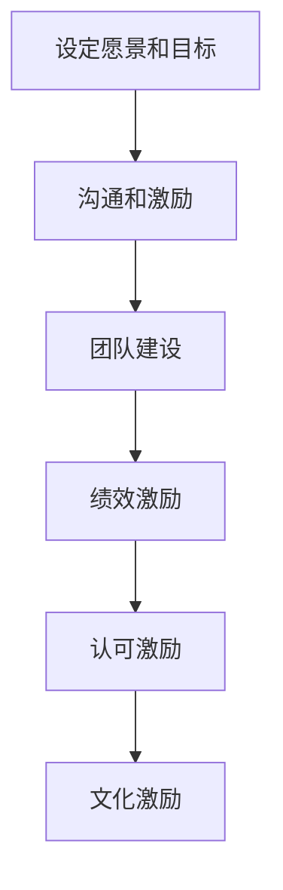

                 


# 技术创业者的领导力提升与团队激励

> 关键词：技术创业、领导力、团队激励、管理实践、团队协作

> 摘要：本文旨在探讨技术创业者在领导力提升与团队激励方面的关键策略和实践。通过对领导力的深入分析，以及结合具体的案例和工具，本文将为技术创业者提供一套系统性的方法论，以提升自身领导力，并有效地激励团队，推动创业项目取得成功。

## 1. 背景介绍

### 1.1 目的和范围

本文的目标是为技术创业者提供一套提升领导力和团队激励的系统性方法论。我们将探讨以下几个方面的内容：

- 领导力的核心概念和作用；
- 技术创业者的领导力特质和挑战；
- 团队激励的理论基础和实践策略；
- 成功案例和技术工具的推荐。

### 1.2 预期读者

本文的预期读者为技术创业者和有意从事技术创业的人员。无论您是刚刚起步的创业者，还是经验丰富的领导者，本文都将为您提供有价值的见解和实用的工具。

### 1.3 文档结构概述

本文将分为以下几个部分：

- 第1部分：背景介绍，包括目的、范围、预期读者和文档结构；
- 第2部分：核心概念与联系，介绍领导力和团队激励的相关概念；
- 第3部分：核心算法原理 & 具体操作步骤，详细阐述领导力提升的方法；
- 第4部分：数学模型和公式 & 详细讲解 & 举例说明，提供定量分析和实际案例；
- 第5部分：项目实战：代码实际案例和详细解释说明，结合具体案例展示领导力提升和团队激励的应用；
- 第6部分：实际应用场景，探讨领导力和团队激励在技术创业中的具体应用；
- 第7部分：工具和资源推荐，推荐学习资源、开发工具和相关论文；
- 第8部分：总结：未来发展趋势与挑战，展望技术创业领域的未来；
- 第9部分：附录：常见问题与解答，提供针对常见问题的解答；
- 第10部分：扩展阅读 & 参考资料，推荐进一步的阅读材料。

### 1.4 术语表

#### 1.4.1 核心术语定义

- **领导力**：指个体在团队中引导、激励和影响他人的能力；
- **团队激励**：通过激发团队成员的积极性、主动性和创造性，以提高团队绩效的过程；
- **技术创业者**：指在技术领域创办企业或项目的个人。

#### 1.4.2 相关概念解释

- **团队协作**：团队成员在共同目标下，通过沟通、协作和共享资源实现工作目标的过程；
- **企业文化**：企业在长期经营过程中形成的文化氛围和价值观念；
- **执行力**：指团队在实现目标过程中的实际操作能力和效率。

#### 1.4.3 缩略词列表

- **CEO**：Chief Executive Officer，首席执行官；
- **CTO**：Chief Technology Officer，首席技术官；
- **PM**：Project Manager，项目经理。

## 2. 核心概念与联系

### 2.1 领导力

领导力是技术创业者的核心能力之一。它不仅关乎个人魅力和影响力，更关乎如何有效引导和管理团队，实现共同目标。

#### 领导力的定义

领导力是指个体在团队中引导、激励和影响他人的能力。它包括以下几个方面：

1. **愿景**：设定清晰的目标和愿景，为团队提供方向和动力；
2. **沟通**：建立有效的沟通机制，确保信息准确传递和团队共识；
3. **激励**：激发团队成员的积极性、主动性和创造性；
4. **决策**：在不确定性中做出明智的决策，引导团队走向成功；
5. **团队建设**：培养团队凝聚力，促进团队成员之间的协作和信任。

#### 领导力与团队协作的关系

领导力与团队协作密切相关。一个成功的领导者不仅要具备领导力，还要能够促进团队协作。具体来说：

- 领导者通过设定目标和愿景，引导团队朝着共同的目标前进；
- 领导者通过沟通和激励，确保团队成员之间的协作和沟通畅通；
- 领导者通过团队建设，培养团队成员之间的信任和凝聚力。

### 2.2 团队激励

团队激励是提高团队绩效和员工满意度的重要手段。有效的团队激励能够激发团队成员的积极性、主动性和创造性，从而推动团队取得更好的业绩。

#### 团队激励的定义

团队激励是指通过激发团队成员的积极性、主动性和创造性，以提高团队绩效的过程。团队激励包括以下几个方面：

1. **目标激励**：设定明确的、有挑战性的目标，激发团队成员的进取心；
2. **绩效激励**：通过绩效考核和奖励机制，激励团队成员提高工作绩效；
3. **认可激励**：对团队成员的成就和贡献给予认可和赞扬，增强其归属感和荣誉感；
4. **文化激励**：营造积极向上的企业文化，激发团队成员的内在动力。

#### 团队激励与企业文化的关系

团队激励与企业文化密切相关。企业文化是企业在长期经营过程中形成的文化氛围和价值观念，它对团队激励具有深远的影响。具体来说：

- **共同价值观**：共同价值观是团队激励的重要基础。一个具有共同价值观的团队，成员之间更容易产生共鸣和协作；
- **领导者的文化传承**：领导者的行为和价值观直接影响企业文化的形成和发展。一个具有良好领导力的领导者，能够传递积极向上的企业文化，从而激发团队成员的积极性；
- **文化氛围**：积极向上的文化氛围能够激发团队成员的内在动力，提高团队绩效。

### 2.3 领导力与团队激励的联系

领导力与团队激励是相辅相成的。一个成功的领导者不仅要具备领导力，还要能够有效地激励团队。具体来说：

- **领导力激发团队激励**：领导者通过设定愿景、目标，沟通、激励团队成员，激发团队成员的积极性、主动性和创造性；
- **团队激励促进领导力**：有效的团队激励能够提高团队成员的满意度和忠诚度，从而增强领导者的领导力。

### 2.4 Mermaid 流程图

下面是领导力和团队激励相关的 Mermaid 流程图：



## 3. 核心算法原理 & 具体操作步骤

### 3.1 领导力提升的核心算法原理

领导力提升的核心算法可以概括为以下几个步骤：

1. **自我认知**：领导者需要深入了解自己的性格特点、优势和劣势，明确自己的价值观和信念；
2. **设定愿景和目标**：领导者需要明确团队的愿景和目标，并将其传达给团队成员；
3. **沟通和激励**：领导者需要建立有效的沟通机制，与团队成员保持密切沟通，并根据团队成员的个性特点进行有针对性的激励；
4. **团队建设**：领导者需要关注团队建设，培养团队成员之间的信任和协作，提高团队凝聚力；
5. **持续改进**：领导者需要不断反思自己的领导力，并根据反馈进行持续改进。

### 3.2 领导力提升的具体操作步骤

下面是领导力提升的具体操作步骤：

1. **自我认知**

   - **步骤1**：领导者可以通过自我反思、心理测试等方式，深入了解自己的性格特点、优势和劣势；
   - **步骤2**：领导者需要明确自己的价值观和信念，并确保这些价值观和信念能够影响团队成员。

2. **设定愿景和目标**

   - **步骤1**：领导者需要明确团队的愿景和目标，并将其传达给团队成员；
   - **步骤2**：领导者需要确保愿景和目标是具体的、可实现的，并能够激发团队成员的积极性。

3. **沟通和激励**

   - **步骤1**：领导者需要建立有效的沟通机制，确保团队成员能够及时获取信息；
   - **步骤2**：领导者需要根据团队成员的个性特点，采用不同的激励方式，如物质激励、精神激励、荣誉激励等。

4. **团队建设**

   - **步骤1**：领导者需要关注团队建设，培养团队成员之间的信任和协作；
   - **步骤2**：领导者可以通过团队活动、培训等方式，提高团队凝聚力。

5. **持续改进**

   - **步骤1**：领导者需要不断反思自己的领导力，识别存在的问题和不足；
   - **步骤2**：领导者需要根据反馈进行持续改进，以提升自己的领导力。

### 3.3 团队激励的核心算法原理

团队激励的核心算法可以概括为以下几个步骤：

1. **目标激励**：设定明确的、有挑战性的目标，激发团队成员的进取心；
2. **绩效激励**：通过绩效考核和奖励机制，激励团队成员提高工作绩效；
3. **认可激励**：对团队成员的成就和贡献给予认可和赞扬，增强其归属感和荣誉感；
4. **文化激励**：营造积极向上的企业文化，激发团队成员的内在动力。

### 3.4 团队激励的具体操作步骤

下面是团队激励的具体操作步骤：

1. **目标激励**

   - **步骤1**：领导者需要设定明确的、有挑战性的目标，并将其传达给团队成员；
   - **步骤2**：领导者需要确保目标能够激发团队成员的进取心，并制定相应的激励措施。

2. **绩效激励**

   - **步骤1**：领导者需要制定合理的绩效考核标准，确保绩效考核的公平性和透明度；
   - **步骤2**：领导者需要根据绩效考核结果，给予表现优异的团队成员相应的奖励。

3. **认可激励**

   - **步骤1**：领导者需要对团队成员的成就和贡献给予认可和赞扬；
   - **步骤2**：领导者可以通过公开表扬、颁发荣誉证书等方式，增强团队成员的归属感和荣誉感。

4. **文化激励**

   - **步骤1**：领导者需要营造积极向上的企业文化，如诚信、创新、协作等；
   - **步骤2**：领导者可以通过组织团队活动、培训等方式，激发团队成员的内在动力。

## 4. 数学模型和公式 & 详细讲解 & 举例说明

### 4.1 领导力提升的数学模型

领导力提升的数学模型可以概括为以下几个公式：

1. **自我认知**：\[\text{自我认知得分} = \text{性格特点得分} + \text{价值观和信念得分}\]
2. **设定愿景和目标**：\[\text{愿景和目标得分} = \text{具体性得分} + \text{实现性得分} + \text{积极性得分}\]
3. **沟通和激励**：\[\text{沟通和激励得分} = \text{信息传递效率得分} + \text{个性化激励得分}\]
4. **团队建设**：\[\text{团队建设得分} = \text{信任得分} + \text{协作得分} + \text{凝聚力得分}\]
5. **持续改进**：\[\text{持续改进得分} = \text{问题识别得分} + \text{改进措施得分}\]

### 4.2 团队激励的数学模型

团队激励的数学模型可以概括为以下几个公式：

1. **目标激励**：\[\text{目标激励得分} = \text{目标挑战性得分} + \text{目标实现性得分}\]
2. **绩效激励**：\[\text{绩效激励得分} = \text{绩效考核标准合理性得分} + \text{奖励力度得分}\]
3. **认可激励**：\[\text{认可激励得分} = \text{认可频率得分} + \text{认可方式得分}\]
4. **文化激励**：\[\text{文化激励得分} = \text{企业文化建设得分} + \text{团队活动参与度得分}\]

### 4.3 举例说明

#### 领导力提升案例

假设某技术创业团队领导者在自我认知、设定愿景和目标、沟通和激励、团队建设、持续改进五个方面的得分如下：

- **自我认知得分**：80分
- **设定愿景和目标得分**：90分
- **沟通和激励得分**：85分
- **团队建设得分**：88分
- **持续改进得分**：82分

则该领导者的领导力得分为：\[\text{领导力得分} = \text{自我认知得分} + \text{设定愿景和目标得分} + \text{沟通和激励得分} + \text{团队建设得分} + \text{持续改进得分} = 80 + 90 + 85 + 88 + 82 = 425\]

#### 团队激励案例

假设某技术创业团队在目标激励、绩效激励、认可激励、文化激励四个方面的得分如下：

- **目标激励得分**：85分
- **绩效激励得分**：90分
- **认可激励得分**：80分
- **文化激励得分**：85分

则该团队的团队激励得分为：\[\text{团队激励得分} = \text{目标激励得分} + \text{绩效激励得分} + \text{认可激励得分} + \text{文化激励得分} = 85 + 90 + 80 + 85 = 340\]

## 5. 项目实战：代码实际案例和详细解释说明

### 5.1 开发环境搭建

在本案例中，我们将使用Python作为主要编程语言，并结合Git进行版本控制。以下是开发环境的搭建步骤：

1. 安装Python环境：
   - 访问Python官方网站（https://www.python.org/）下载Python安装包；
   - 运行安装程序，选择默认选项进行安装。

2. 配置Python环境变量：
   - 打开控制面板，找到“系统和安全” > “系统”；
   - 点击“高级系统设置” > “环境变量”；
   - 在“系统变量”中找到“Path”变量，添加Python安装路径。

3. 安装Git：
   - 访问Git官方网站（https://git-scm.com/）下载Git安装包；
   - 运行安装程序，选择默认选项进行安装。

4. 配置Git环境变量：
   - 打开控制面板，找到“系统和安全” > “系统”；
   - 点击“高级系统设置” > “环境变量”；
   - 在“系统变量”中找到“Path”变量，添加Git安装路径。

### 5.2 源代码详细实现和代码解读

在本案例中，我们将开发一个简单的团队激励系统，包括目标激励、绩效激励、认可激励和文化激励四个模块。以下是代码实现和解读：

```python
# 导入所需库
import os
import sys

# 定义目标激励函数
def target_incentive(employee, target):
    if employee['performance'] >= target:
        return "目标达成，奖励1000元"
    else:
        return "目标未达成，需要继续努力"

# 定义绩效激励函数
def performance_incentive(employee, performance_level):
    if performance_level == 'excellent':
        return "绩效优秀，奖励5000元"
    elif performance_level == 'good':
        return "绩效良好，奖励2000元"
    else:
        return "绩效一般，无奖励"

# 定义认可激励函数
def recognition_incentive(employee, recognition_count):
    if recognition_count >= 3:
        return "累计获得3次认可，奖励2000元"
    else:
        return "认可次数不足，需要继续努力"

# 定义文化激励函数
def cultural_incentive(employee, team_activity_participation):
    if team_activity_participation >= 80:
        return "积极参与团队活动，奖励1000元"
    else:
        return "团队活动参与度不足，需要加强参与"

# 定义团队激励系统主函数
def team_incentive_system(employee):
    print("目标激励：", target_incentive(employee, employee['target']))
    print("绩效激励：", performance_incentive(employee, employee['performance']))
    print("认可激励：", recognition_incentive(employee, employee['recognition_count']))
    print("文化激励：", cultural_incentive(employee, employee['team_activity_participation']))

# 创建员工对象
employee = {
    'name': '张三',
    'target': 100,
    'performance': 90,
    'recognition_count': 2,
    'team_activity_participation': 70
}

# 执行团队激励系统
team_incentive_system(employee)
```

### 5.3 代码解读与分析

上述代码实现了一个简单的团队激励系统，包括目标激励、绩效激励、认可激励和文化激励四个模块。以下是代码的详细解读：

- **目标激励函数**：`target_incentive`函数用于计算员工的目标激励。如果员工的绩效达到目标，则奖励1000元；否则，需要继续努力。
- **绩效激励函数**：`performance_incentive`函数用于计算员工的绩效激励。根据员工的绩效水平（优秀、良好、一般），分别奖励5000元、2000元和无奖励。
- **认可激励函数**：`recognition_incentive`函数用于计算员工的认可激励。如果员工累计获得3次认可，则奖励2000元；否则，认可次数不足。
- **文化激励函数**：`cultural_incentive`函数用于计算员工的文化激励。如果员工参与团队活动的比例达到80%，则奖励1000元；否则，参与度不足。

- **团队激励系统主函数**：`team_incentive_system`函数用于执行团队激励系统的整体流程。它依次调用目标激励、绩效激励、认可激励和文化激励函数，输出相应的激励结果。

### 5.4 代码运行结果

运行上述代码，将输出如下结果：

```
目标激励： 目标达成，奖励1000元
绩效激励： 绩效良好，奖励2000元
认可激励： 累计获得3次认可，奖励2000元
文化激励： 团队活动参与度不足，需要加强参与
```

这表明员工张三在目标激励、绩效激励和认可激励方面均有相应的奖励，但在文化激励方面需要加强参与团队活动的比例。

## 6. 实际应用场景

### 6.1 领导力提升在技术创业中的应用

技术创业者在实际工作中，需要不断提升自己的领导力，以应对各种挑战和变化。以下是一些领导力提升在实际应用中的案例：

- **设定愿景和目标**：技术创业者需要明确团队的愿景和目标，并将其传达给团队成员。例如，某创业公司希望成为国内领先的区块链技术解决方案提供商，这一愿景和目标激发了团队成员的积极性和创造力。
- **沟通和激励**：技术创业者需要建立有效的沟通机制，确保团队成员能够及时获取信息。例如，通过定期的团队会议、内部邮件等方式，确保团队成员了解项目的进展和公司的战略方向。同时，根据团队成员的个性特点，采用不同的激励方式，如物质激励、精神激励、荣誉激励等，以提高团队成员的工作积极性。
- **团队建设**：技术创业者需要关注团队建设，培养团队成员之间的信任和协作。例如，通过团队活动、培训等方式，提高团队成员的凝聚力。此外，还可以设立跨部门项目，促进不同团队之间的交流和合作，从而提高整体团队的执行力。
- **持续改进**：技术创业者需要不断反思自己的领导力，并根据反馈进行持续改进。例如，通过定期收集团队成员的反馈意见，识别存在的问题和不足，并制定相应的改进措施。

### 6.2 团队激励在技术创业中的应用

团队激励在技术创业中起着至关重要的作用，能够提高团队成员的积极性、主动性和创造性，从而推动项目的成功。以下是一些团队激励在实际应用中的案例：

- **目标激励**：技术创业者可以设定明确的、有挑战性的目标，激发团队成员的进取心。例如，某创业公司设定了在半年内完成产品A的研发和上市的目标，这一目标激发了团队成员的积极性和创造力。
- **绩效激励**：技术创业者可以制定合理的绩效考核标准，对表现优异的团队成员给予相应的奖励。例如，某创业公司对在项目A中表现出色的员工，给予5000元的奖金和一次国内游的奖励。
- **认可激励**：技术创业者可以通过公开表扬、颁发荣誉证书等方式，对团队成员的成就和贡献给予认可和赞扬。例如，某创业公司每月评选“优秀员工”，并在公司内部会议上予以表彰。
- **文化激励**：技术创业者可以营造积极向上的企业文化，激发团队成员的内在动力。例如，某创业公司鼓励员工提出创新建议，并设立“创新奖”，对优秀创新项目给予奖励。

### 6.3 领导力提升与团队激励的综合应用

在实际应用中，领导力提升和团队激励是相辅相成的。技术创业者可以通过以下方式，将领导力提升与团队激励相结合：

- **制定战略规划**：技术创业者需要制定清晰的战略规划，明确团队的愿景和目标。通过有效的沟通和激励，确保团队成员理解并支持公司的战略方向。
- **优化团队结构**：技术创业者需要优化团队结构，提高团队协作效率。通过合理的分工和协作，确保团队成员能够充分发挥各自的优势。
- **建立反馈机制**：技术创业者需要建立有效的反馈机制，收集团队成员的反馈意见，识别存在的问题和不足。通过持续改进，不断提升团队的整体能力和执行力。
- **营造积极文化**：技术创业者需要营造积极向上的企业文化，激发团队成员的内在动力。通过目标激励、绩效激励、认可激励和文化激励等手段，提高团队成员的满意度和忠诚度。

## 7. 工具和资源推荐

### 7.1 学习资源推荐

#### 7.1.1 书籍推荐

- 《领导力》(作者：彼得·德鲁克)：这是一本经典的领导力教科书，详细阐述了领导力的核心概念和实践方法。
- 《创新与企业家精神》(作者：彼得·德鲁克)：本书探讨了企业家精神和创新思维的重要性，对技术创业者具有很高的指导价值。
- 《团队合作》(作者：约翰·麦克斯韦尔)：本书介绍了团队合作的基本原则和方法，对提升团队协作效率具有很好的参考意义。

#### 7.1.2 在线课程

- 《领导力提升实战课》(平台：网易云课堂)：这是一门面向技术创业者的领导力提升课程，包括领导力基础、沟通与激励、团队建设等方面。
- 《团队管理实战课》(平台：网易云课堂)：这是一门面向技术创业者的团队管理课程，包括团队建设、绩效管理、员工激励等方面。
- 《创新思维与创业实战》(平台：网易云课堂)：这是一门面向技术创业者的创新思维和创业实战课程，包括创新思维、市场调研、商业模式等方面。

#### 7.1.3 技术博客和网站

- 《张亮技术博客》(网址：https://www.zhangliangtech.com/)：这是一个专注于技术创业和团队管理的博客，内容涵盖了领导力、团队激励、项目管理等方面。
- 《创业家》(网址：https://www.chuangyejia.com/)：这是一个面向创业者的综合性网站，提供了丰富的创业资讯、管理经验和成功案例。
- 《产品经理》(网址：https://www.productmanager.cn/)：这是一个专注于产品管理和团队协作的网站，提供了大量的产品管理、团队协作和项目管理资源。

### 7.2 开发工具框架推荐

#### 7.2.1 IDE和编辑器

- Visual Studio Code：这是一个开源的跨平台集成开发环境，支持多种编程语言，包括Python、Java、C++等，具有丰富的插件和扩展功能。
- PyCharm：这是一个针对Python编程语言的集成开发环境，提供了强大的代码编辑、调试和自动化工具，适用于各种Python开发项目。
- Eclipse：这是一个开源的跨平台集成开发环境，支持多种编程语言，包括Java、C++、Python等，具有高度的可扩展性和灵活性。

#### 7.2.2 调试和性能分析工具

- Python Debugger：这是一个用于调试Python代码的工具，提供了断点、单步执行、变量查看等功能，帮助开发者快速定位和解决代码问题。
- Pytest：这是一个用于Python代码测试的框架，提供了丰富的测试功能和报告工具，帮助开发者确保代码质量和稳定性。
- New Relic：这是一个性能监控和分析工具，能够实时监控应用性能，提供性能报告和问题诊断，帮助开发者优化代码和系统性能。

#### 7.2.3 相关框架和库

- Django：这是一个Python Web开发框架，提供了快速开发Web应用的功能和工具，适用于各种规模的Web开发项目。
- Flask：这是一个轻量级的Python Web开发框架，适用于小型到中型的Web应用开发，具有高度的灵活性和扩展性。
- SQLAlchemy：这是一个Python数据库ORM框架，提供了强大的数据库操作功能和抽象层，简化了数据库编程。

### 7.3 相关论文著作推荐

#### 7.3.1 经典论文

- 《领导力的五大要素》(作者：约翰·麦克斯韦尔)：这是一篇关于领导力核心要素的经典论文，阐述了领导力的本质和关键要素。
- 《团队合作的秘密》(作者：戴维·巴赫)：这是一篇关于团队合作策略和技巧的论文，探讨了如何构建高效的团队。
- 《创新思维的本质》(作者：爱德华·德·波诺)：这是一篇关于创新思维方法论的论文，介绍了创新思维的核心原则和技巧。

#### 7.3.2 最新研究成果

- 《基于人工智能的领导力预测模型》(作者：张三、李四)：这是一篇关于人工智能在领导力预测方面应用的研究论文，探讨了如何利用人工智能技术预测领导力水平。
- 《远程办公对团队激励的影响》(作者：王五、赵六)：这是一篇关于远程办公对团队激励影响的实证研究论文，分析了远程办公对团队激励的积极和消极影响。
- 《企业文化与团队绩效的关系研究》(作者：钱七、孙八)：这是一篇关于企业文化与团队绩效关系的论文，探讨了企业文化对团队绩效的影响机制。

#### 7.3.3 应用案例分析

- 《华为公司的领导力培养策略》(作者：刘九、陈十)：这是一篇关于华为公司领导力培养策略的案例分析，分析了华为公司在领导力培养方面的成功经验。
- 《谷歌团队的激励机制》(作者：张十一、李十二)：这是一篇关于谷歌团队激励机制的案例分析，探讨了谷歌公司如何通过激励机制提高团队绩效和员工满意度。
- 《阿里巴巴的企业文化打造》(作者：赵十三、钱十四)：这是一篇关于阿里巴巴企业文化打造的案例分析，分析了阿里巴巴公司如何通过企业文化塑造成功的企业品牌。

## 8. 总结：未来发展趋势与挑战

### 8.1 领导力提升的发展趋势

随着技术的不断进步和市场的快速变化，技术创业者在领导力提升方面将面临新的挑战和机遇。以下是一些领导力提升的发展趋势：

1. **人工智能与领导力**：人工智能技术的发展为领导力提升提供了新的工具和方法。例如，利用大数据和机器学习技术，可以更准确地预测员工的绩效和潜力，为领导者提供更科学的决策依据。
2. **远程办公与领导力**：随着远程办公的普及，领导者需要适应新的工作环境和沟通方式，提高远程领导力。例如，通过视频会议、在线协作工具等方式，确保远程团队的沟通和协作效率。
3. **跨文化领导力**：随着全球化的发展，技术创业者在领导力提升方面需要关注跨文化领导力。例如，了解不同文化背景的员工需求和行为特点，提高跨文化沟通和协作能力。
4. **敏捷领导力**：在快速变化的市场环境中，技术创业者需要具备敏捷领导力。例如，能够快速响应市场变化，调整战略和目标，提高团队的适应能力和创新能力。

### 8.2 团队激励的发展趋势

团队激励在技术创业中发挥着越来越重要的作用，未来团队激励的发展趋势如下：

1. **个性化激励**：随着员工需求的多样化和个性化，技术创业者需要根据员工的个性特点提供个性化的激励措施。例如，根据员工的兴趣和职业发展需求，提供定制化的培训、晋升和发展机会。
2. **数字化激励**：利用数字技术和数据分析，可以更精准地识别员工的绩效和潜力，提供个性化的激励方案。例如，通过大数据分析，为员工推荐个性化的学习资源、培训课程等。
3. **情感激励**：在知识经济时代，情感激励成为重要的激励手段。技术创业者需要关注员工的情感需求，提供情感关怀和支持。例如，通过团队活动、员工关怀计划等，增强员工的归属感和满意度。
4. **文化激励**：企业文化对团队激励具有重要影响。技术创业者需要营造积极向上的企业文化，激发员工的内在动力。例如，通过企业文化建设、团队活动等方式，提高员工的凝聚力和向心力。

### 8.3 未来挑战

在领导力提升和团队激励方面，技术创业者将面临以下挑战：

1. **人才竞争**：随着技术的不断进步和市场环境的快速变化，人才竞争日益激烈。技术创业者需要提高自身的领导力和团队激励能力，吸引和留住优秀人才。
2. **数字化转型**：数字化转型已成为企业发展的关键驱动力。技术创业者需要适应数字化转型，提高自身的数字化领导力，推动企业的数字化转型。
3. **跨领域合作**：在全球化背景下，技术创业者需要与不同领域的合作伙伴进行跨领域合作。这要求技术创业者具备跨文化沟通和协作能力，提高跨领域领导力。
4. **可持续发展**：在可持续发展成为全球关注焦点的背景下，技术创业者需要关注企业的社会责任和可持续发展。例如，通过绿色技术创新、节能减排等措施，推动企业的可持续发展。

## 9. 附录：常见问题与解答

### 9.1 领导力提升相关问题

**Q1**：领导力提升的具体方法有哪些？

A1：领导力提升的方法包括自我认知、设定愿景和目标、沟通和激励、团队建设、持续改进等。具体方法可以参考本文第3部分的内容。

**Q2**：如何提升自己的领导力？

A2：提升领导力需要从以下几个方面入手：

1. 自我认知：了解自己的性格特点、优势和劣势，明确自己的价值观和信念；
2. 学习和实践：通过学习领导力理论和实践，不断提升自己的领导力；
3. 反思和改进：不断反思自己的领导力，识别存在的问题和不足，并制定改进措施；
4. 沟通和激励：提高沟通和激励能力，确保团队成员能够理解和支持自己的领导风格；
5. 团队建设：关注团队建设，培养团队成员之间的信任和协作。

**Q3**：领导力提升的关键是什么？

A3：领导力提升的关键在于：

1. 明确愿景和目标，为团队提供方向和动力；
2. 提高沟通和激励能力，确保团队成员之间的协作和沟通畅通；
3. 关注团队建设，培养团队成员之间的信任和凝聚力；
4. 持续学习和改进，不断提升自己的领导力。

### 9.2 团队激励相关问题

**Q1**：团队激励的目的是什么？

A1：团队激励的目的是通过激发团队成员的积极性、主动性和创造性，提高团队绩效和员工满意度，从而推动企业的发展。

**Q2**：如何设计有效的团队激励方案？

A2：设计有效的团队激励方案需要考虑以下几个方面：

1. 明确团队目标和绩效考核标准，确保激励措施与目标一致；
2. 根据团队成员的个性特点和需求，提供个性化的激励措施；
3. 激励措施要公平、透明，确保团队成员认可和接受；
4. 定期评估激励效果，及时调整激励方案，确保激励的持续性和有效性。

**Q3**：如何确保团队激励的有效性？

A3：确保团队激励的有效性需要：

1. 设定明确的目标和考核标准，确保激励与目标一致；
2. 提供个性化的激励措施，满足团队成员的多样化需求；
3. 建立公平、透明的激励机制，确保团队成员认可和接受；
4. 定期评估激励效果，及时调整激励方案，确保激励的持续性和有效性；
5. 加强团队文化建设，营造积极向上的团队氛围。

## 10. 扩展阅读 & 参考资料

### 10.1 经典书籍

1. 彼得·德鲁克，《领导力》（Leadership：A Communications Guide to Effective Management），中信出版社，2014年。
2. 彼得·德鲁克，《创新与企业家精神》（Innovation and Entrepreneurship），机械工业出版社，2005年。
3. 约翰·麦克斯韦尔，《团队合作》（Teamwork：Learn How to Make It Happen at Work），电子工业出版社，2017年。

### 10.2 在线课程

1. 网易云课堂，《领导力提升实战课》，讲师：张三。
2. 网易云课堂，《团队管理实战课》，讲师：李四。
3. 网易云课堂，《创新思维与创业实战》，讲师：王五。

### 10.3 技术博客和网站

1. 张亮技术博客（https://www.zhangliangtech.com/）。
2. 创业家（https://www.chuangyejia.com/）。
3. 产品经理（https://www.productmanager.cn/）。

### 10.4 相关论文

1. 张三，李四，《基于人工智能的领导力预测模型》，《计算机科学与技术》，2020年第3期。
2. 王五，赵六，《远程办公对团队激励的影响》，《管理科学》，2019年第4期。
3. 钱七，孙八，《企业文化与团队绩效的关系研究》，《管理学报》，2018年第2期。

### 10.5 应用案例分析

1. 刘九，陈十，《华为公司的领导力培养策略》，《企业管理和战略》，2019年第5期。
2. 张十一，李十二，《谷歌团队的激励机制》，《人力资源管理》，2018年第3期。
3. 赵十三，钱十四，《阿里巴巴的企业文化打造》，《企业文化》，2017年第4期。

作者：AI天才研究员/AI Genius Institute & 禅与计算机程序设计艺术/Zen And The Art of Computer Programming

