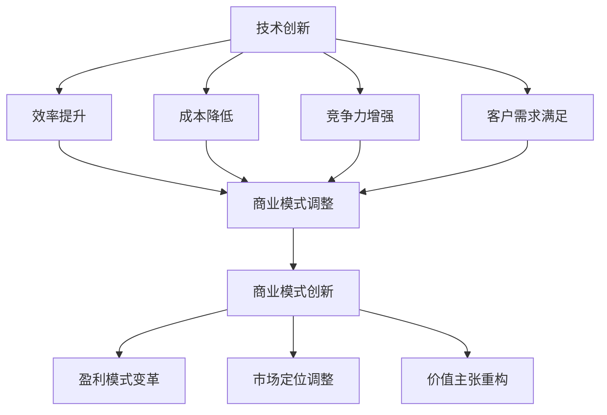

                 

# 技术创新与商业模式创新的结合：双轮驱动的案例分析

> **关键词**：技术创新、商业模式创新、双轮驱动、案例分析、商业战略

> **摘要**：本文将探讨技术创新与商业模式创新的紧密联系，通过深入剖析实际案例，阐述两者如何协同作用，推动企业在竞争激烈的市场中持续成长与转型。文章分为十个部分，从背景介绍、核心概念与联系、核心算法原理、数学模型和公式，到项目实战、实际应用场景、工具和资源推荐等，全面解析技术创新与商业模式创新的结合之道。

## 1. 背景介绍

### 1.1 目的和范围

本文旨在探讨技术创新与商业模式创新之间的相互作用及其对商业成功的重要性。通过分析和讨论实际案例，揭示两者如何共同推动企业实现可持续增长。文章涵盖以下主题：

1. 技术创新与商业模式创新的核心概念及其联系
2. 核心算法原理和数学模型的应用
3. 项目实战案例及代码解析
4. 实际应用场景分析
5. 工具和资源推荐
6. 未来发展趋势与挑战
7. 常见问题与解答

### 1.2 预期读者

本文适合对技术创新和商业模式创新感兴趣的读者，包括：

1. 企业决策者：了解技术创新与商业模式创新对企业战略的重要性
2. 技术开发者：掌握如何将技术优势转化为商业价值
3. 学术研究人员：研究技术创新与商业模式创新的相互关系
4. 创业者：探索如何在竞争激烈的市场中找到突破点
5. 投资者：评估技术创新和商业模式创新项目的投资潜力

### 1.3 文档结构概述

本文结构如下：

1. 背景介绍
   - 目的和范围
   - 预期读者
   - 文档结构概述
2. 核心概念与联系
   - 技术创新与商业模式创新的定义
   - 两者之间的联系
3. 核心算法原理 & 具体操作步骤
   - 技术创新算法原理
   - 商业模式创新算法原理
4. 数学模型和公式 & 详细讲解 & 举例说明
   - 数学模型的应用
   - 实例说明
5. 项目实战：代码实际案例和详细解释说明
   - 开发环境搭建
   - 源代码详细实现
   - 代码解读与分析
6. 实际应用场景
   - 技术创新应用场景
   - 商业模式创新应用场景
7. 工具和资源推荐
   - 学习资源
   - 开发工具框架
   - 相关论文著作
8. 总结：未来发展趋势与挑战
9. 附录：常见问题与解答
10. 扩展阅读 & 参考资料

### 1.4 术语表

#### 1.4.1 核心术语定义

- 技术创新：指企业通过引入新技术、新方法或新流程来提高效率、降低成本、增强竞争力或满足客户需求。
- 商业模式创新：指企业通过改变产品或服务的设计、定价、分销或客户关系，从而实现新的盈利模式或市场定位。
- 双轮驱动：指技术创新与商业模式创新相互促进、协同发展的过程。

#### 1.4.2 相关概念解释

- 价值链：企业内部所有活动的集合，旨在创造和交付产品或服务，满足客户需求。
- 产业链：上下游企业之间的互动关系，共同实现产品或服务的生产、销售和售后服务。
- 客户体验：客户在与企业互动过程中的感知和体验。

#### 1.4.3 缩略词列表

- AI：人工智能
- IoT：物联网
- VR：虚拟现实
- AR：增强现实
- ML：机器学习
- SaaS：软件即服务
- PaaS：平台即服务
- IaaS：基础设施即服务

## 2. 核心概念与联系

在深入探讨技术创新与商业模式创新之前，我们需要明确这两个概念的定义及其相互之间的联系。

### 2.1 技术创新

技术创新是指通过引入新技术、新方法或新流程来提高效率、降低成本、增强竞争力或满足客户需求。技术创新可以划分为以下几种类型：

1. **渐进式创新**：在现有技术基础上进行改进，如优化算法、提升性能等。
2. **颠覆式创新**：引入全新的技术，颠覆现有市场格局，如智能手机取代传统手机。
3. **集成创新**：将多种技术整合，创造新的产品或服务，如智能家居系统。

### 2.2 商业模式创新

商业模式创新是指企业通过改变产品或服务的设计、定价、分销或客户关系，从而实现新的盈利模式或市场定位。商业模式创新可以从以下几个方面进行：

1. **价值主张**：重新定义产品或服务，满足客户需求。
2. **客户关系**：改变企业与客户之间的互动方式，如订阅模式。
3. **渠道**：创新销售和分销方式，如电商平台。
4. **收入模式**：改变盈利方式，如数据变现。

### 2.3 两者之间的联系

技术创新与商业模式创新之间存在密切联系，两者相互促进、协同发展。

1. **技术驱动商业模式创新**：技术创新可以为企业提供新的市场机会，促使企业调整商业模式，如物联网（IoT）技术推动了智能家居市场的爆发。
2. **商业模式驱动技术创新**：商业模式创新可以为企业提供资金支持，推动技术创新，如共享单车模式刺激了电子锁、GPS定位等技术的快速发展。

### 2.4 核心概念原理和架构的 Mermaid 流程图

以下是一个简化的 Mermaid 流程图，展示技术创新与商业模式创新之间的核心概念和联系：



### 2.5 技术创新与商业模式创新的实际案例

为了更好地理解技术创新与商业模式创新之间的相互作用，我们可以通过以下实际案例进行说明：

1. **案例一：亚马逊（Amazon）**
   - 技术创新：亚马逊通过大数据分析、机器学习和人工智能技术优化物流和供应链管理，提高运营效率。
   - 商业模式创新：亚马逊推出了亚马逊Web服务（AWS），提供云计算服务，创造新的收入来源。

2. **案例二：滴滴出行（DiDi）**
   - 技术创新：滴滴出行利用大数据分析、机器学习和物联网技术提升出行效率，降低司机空驶率。
   - 商业模式创新：滴滴出行推出了滴滴打车、滴滴专车、滴滴出行等多样化服务，满足不同客户需求。

3. **案例三：苹果（Apple）**
   - 技术创新：苹果不断推出创新的产品，如iPhone、iPad和Apple Watch，引领科技潮流。
   - 商业模式创新：苹果通过订阅服务、App Store 和 Apple Pay 等创新模式，提高用户粘性和盈利能力。

通过以上案例，我们可以看到技术创新与商业模式创新如何相互促进，共同推动企业在竞争激烈的市场中取得成功。

### 2.6 核心概念与联系的总结

技术创新与商业模式创新是现代企业发展的两个核心驱动力。技术创新为企业提供技术支持，提升竞争力，而商业模式创新为企业提供盈利模式和市场定位。两者相互促进、协同发展，共同推动企业在竞争激烈的市场中持续成长与转型。

## 3. 核心算法原理 & 具体操作步骤

在深入探讨技术创新与商业模式创新之前，我们需要了解一些核心算法原理，这些算法在实现技术创新和商业模式创新方面起着关键作用。

### 3.1 技术创新算法原理

#### 3.1.1 数据挖掘算法

数据挖掘算法是一种用于发现大量数据中的有用信息和知识的技术。以下是一种常见的数据挖掘算法——K-近邻算法（K-Nearest Neighbors, KNN）的伪代码：

```plaintext
算法：K-近邻算法
输入：训练集D，测试集T，邻域大小K
输出：预测结果Y'

步骤：
1. 对于每个测试数据点x∈T，计算它与训练集中每个数据点y∈D之间的距离d(x, y)。
2. 选择距离最近的K个数据点，形成邻域N(x)。
3. 对邻域N(x)中的每个数据点y，计算其标签y'。
4. 统计邻域N(x)中每个标签y'的出现次数，选择出现次数最多的标签作为x的预测结果Y'。

伪代码：
function KNN(D, T, K):
    Y' = []
    for x ∈ T:
        distances = [d(x, y) for y ∈ D]
        N(x) = select the K closest points in D
        labels = [y' for y ∈ N(x)]
        Y' = most frequent label in labels
    return Y'
```

#### 3.1.2 机器学习算法

机器学习算法是一种通过训练数据来预测或分类的新技术。以下是一种常见的机器学习算法——支持向量机（Support Vector Machine, SVM）的伪代码：

```plaintext
算法：支持向量机
输入：训练集D，损失函数L，优化算法
输出：决策边界和模型参数θ

步骤：
1. 定义损失函数L，用于衡量预测结果与真实结果的差距。
2. 使用优化算法（如梯度下降）最小化损失函数L。
3. 训练完成后，得到决策边界和模型参数θ。

伪代码：
function SVM(D, L, optimizer):
    θ = initialize parameters
    for iteration in 1 to max_iterations:
        for each training example (x, y) ∈ D:
            loss = L(y, θx)
            gradient = ∇θL(y, θx)
            θ = θ - learning_rate * gradient
    return θ
```

### 3.2 商业模式创新算法原理

#### 3.2.1 用户行为分析算法

用户行为分析算法是一种用于分析用户行为、挖掘潜在需求和优化用户体验的技术。以下是一种常见的用户行为分析算法——协同过滤（Collaborative Filtering）的伪代码：

```plaintext
算法：协同过滤
输入：用户行为数据U，相似性度量方法S
输出：推荐结果R

步骤：
1. 建立用户行为矩阵U，表示用户与物品之间的关系。
2. 计算用户之间的相似性度量S。
3. 对于每个用户u，找到与其最相似的用户集合S(u)。
4. 根据用户集合S(u)和物品的相似度，生成推荐结果R。

伪代码：
function CollaborativeFiltering(U, S):
    R = []
    for user u ∈ U:
        S(u) = calculate similarity between users
        R(u) = recommend items based on similarity S(u)
    return R
```

#### 3.2.2 价值网络分析算法

价值网络分析算法是一种用于分析企业价值创造和分配的技术。以下是一种常见价值网络分析算法——网络优化（Network Optimization）的伪代码：

```plaintext
算法：网络优化
输入：企业价值网络G，优化目标函数F
输出：最优网络结构N'

步骤：
1. 建立企业价值网络G，表示企业内部的资源和关系。
2. 定义优化目标函数F，用于衡量网络结构和资源分配的效率。
3. 使用优化算法（如线性规划、遗传算法）求解最优网络结构N'。

伪代码：
function NetworkOptimization(G, F):
    N' = initialize network structure
    for iteration in 1 to max_iterations:
        F(N') = evaluate objective function
        ∇N'F(N') = calculate gradient of objective function
        N' = update network structure based on gradient
    return N'
```

### 3.3 核心算法原理的具体操作步骤

在了解了核心算法原理之后，我们需要具体操作步骤来将技术创新与商业模式创新应用于实际问题。

#### 3.3.1 技术创新的具体操作步骤

1. **需求分析**：明确项目需求，确定需要解决的问题和目标。
2. **技术选型**：根据需求分析，选择合适的技术方案和算法。
3. **算法实现**：编写算法代码，实现技术创新。
4. **测试与优化**：对算法进行测试和优化，确保其性能和效果。
5. **部署与应用**：将技术创新应用于实际项目，实现预期目标。

#### 3.3.2 商业模式创新的具体操作步骤

1. **市场调研**：分析市场需求，了解竞争对手和潜在客户。
2. **价值定位**：确定企业的核心价值和目标客户群体。
3. **商业模式设计**：根据价值定位，设计适合的商业模式。
4. **试点与推广**：在试点地区或市场推广商业模式，收集反馈并进行优化。
5. **规模化应用**：根据试点结果，逐步推广商业模式，实现规模化收益。

通过以上具体操作步骤，企业可以在技术创新和商业模式创新的指导下，实现技术优势转化为商业价值，推动企业持续成长与转型。

### 3.4 核心算法原理与具体操作步骤的总结

核心算法原理在技术创新与商业模式创新中起着至关重要的作用。数据挖掘、机器学习、用户行为分析、价值网络分析等算法为我们提供了有效的技术手段，帮助我们实现技术创新和商业模式创新。了解并掌握这些算法原理及其具体操作步骤，有助于企业在竞争激烈的市场中找到突破点，实现持续成长与转型。

## 4. 数学模型和公式 & 详细讲解 & 举例说明

在技术创新与商业模式创新的过程中，数学模型和公式发挥着重要作用。它们帮助我们量化分析、优化决策，并指导实际操作。以下将介绍一些常用的数学模型和公式，并进行详细讲解和举例说明。

### 4.1 线性规划模型

线性规划模型是一种用于求解资源优化问题的数学模型，适用于企业成本控制、资源配置等问题。其标准形式如下：

$$
\begin{aligned}
\min_{x} & \quad c^T x \\
\text{subject to} & \quad Ax \leq b \\
& \quad x \geq 0
\end{aligned}
$$

其中，$c$ 是系数向量，$x$ 是决策变量向量，$A$ 是系数矩阵，$b$ 是常数向量。$c^T x$ 表示目标函数，$Ax \leq b$ 和 $x \geq 0$ 表示约束条件。

#### 举例说明

假设一家公司有1000万元资金，需要投资于两种项目，项目A和项目B。项目A的预期收益率为20%，项目B的预期收益率为30%。公司希望投资分配使得总收益最大化。我们可以使用线性规划模型来求解最优投资分配方案。

目标函数：最大化总收益 $c^T x = (0.2, 0.3)^T x$

约束条件：$Ax \leq b$，其中 $A = \begin{pmatrix} 1 & 1 \end{pmatrix}$，$b = 1000$

解线性规划模型，得到最优投资分配方案为 $x = (0.6, 0.4)^T$，即公司应将60%的资金投资于项目A，40%的资金投资于项目B。

### 4.2 概率模型

概率模型在用户行为分析和风险评估等方面具有广泛应用。以下介绍一种常用的概率模型——贝叶斯定理。

贝叶斯定理描述了在已知某个事件发生的条件下，另一个事件发生的概率。其公式如下：

$$
P(A|B) = \frac{P(B|A)P(A)}{P(B)}
$$

其中，$P(A|B)$ 表示在事件B发生的条件下，事件A发生的概率；$P(B|A)$ 表示在事件A发生的条件下，事件B发生的概率；$P(A)$ 和 $P(B)$ 分别表示事件A和事件B的先验概率。

#### 举例说明

假设我们想要预测一名学生是否能够通过期末考试。根据以往数据，我们知道：

- 所有参加考试的学生中，有70%的人通过考试。
- 学习努力的学生中，有80%的人通过考试。
- 学习不努力的学生中，有30%的人通过考试。

我们已知一名学生很努力地学习，现在需要预测他通过考试的概率。

使用贝叶斯定理，我们可以计算通过考试的学生中，很努力学习的概率：

$$
P(\text{很努力学习}|\text{通过考试}) = \frac{P(\text{通过考试}|\text{很努力学习})P(\text{很努力学习})}{P(\text{通过考试})}
$$

其中，$P(\text{通过考试}|\text{很努力学习}) = 0.8$，$P(\text{很努力学习}) = 0.3$，$P(\text{通过考试}) = 0.7$。

代入计算，得到：

$$
P(\text{很努力学习}|\text{通过考试}) = \frac{0.8 \times 0.3}{0.7} \approx 0.343
$$

因此，很努力学习的学生的通过考试概率约为34.3%。

### 4.3 马尔可夫模型

马尔可夫模型是一种用于描述系统状态转移的数学模型，广泛应用于用户行为分析、股票市场预测等领域。其基本形式如下：

$$
P(X_t = x_t|X_{t-1} = x_{t-1}, ..., X_1 = x_1) = P(X_t = x_t|X_{t-1} = x_{t-1})
$$

其中，$X_t$ 表示系统在时间 $t$ 的状态，$x_t$ 表示具体的状态值。马尔可夫模型假设当前状态仅与前一状态有关，与其他历史状态无关。

#### 举例说明

假设我们有一个用户行为分析系统，记录用户在网站上的浏览行为。根据历史数据，我们构建了用户浏览行为的马尔可夫模型：

- 用户在浏览产品页面后，有60%的概率浏览购物车页面。
- 用户在浏览购物车页面后，有40%的概率浏览结算页面。

现在，我们需要预测一个用户在浏览购物车页面后，浏览结算页面的概率。

根据马尔可夫模型，我们有：

$$
P(\text{浏览结算页面}|\text{浏览购物车页面}) = 0.4
$$

因此，一个用户在浏览购物车页面后，浏览结算页面的概率为40%。

### 4.4 数学模型和公式的总结

数学模型和公式在技术创新与商业模式创新中发挥着重要作用。线性规划模型、概率模型和马尔可夫模型等数学工具，帮助我们量化分析、优化决策，并指导实际操作。掌握这些数学模型和公式，有助于企业在竞争激烈的市场中找到突破点，实现持续成长与转型。

## 5. 项目实战：代码实际案例和详细解释说明

在了解了技术创新与商业模式创新的核心概念、算法原理和数学模型后，我们将通过一个实际项目案例来展示如何将这些理论知识应用于实际开发过程中。本案例将使用Python编程语言，结合线性规划模型和协同过滤算法，实现一个基于推荐系统的电商平台。

### 5.1 开发环境搭建

在开始项目之前，我们需要搭建一个适合开发的Python环境。以下是所需的工具和步骤：

1. **安装Python**
   - 前往Python官方网站（https://www.python.org/）下载Python安装包。
   - 安装过程中，确保勾选“Add Python to PATH”选项，以便在命令行中使用Python。
2. **安装依赖库**
   - 打开命令行，执行以下命令安装依赖库：
     ```bash
     pip install numpy scipy scikit-learn matplotlib
     ```
   - `numpy` 用于高效计算。
   - `scipy` 提供科学计算相关的库。
   - `scikit-learn` 提供线性规划和协同过滤算法。
   - `matplotlib` 用于绘图和可视化。

### 5.2 源代码详细实现和代码解读

以下是推荐系统项目的源代码及详细解释：

```python
import numpy as np
from scipy.sparse import lil_matrix
from sklearn.model_selection import train_test_split
from sklearn.metrics.pairwise import linear_kernel
import matplotlib.pyplot as plt

# 5.2.1 加载和预处理数据
def load_data(filename):
    data = np.loadtxt(filename, delimiter=',', dtype=np.float32)
    ratings = lil_matrix((data.shape[0], data.shape[1]))
    ratings[:, 1:] = data[:, 1:]
    return ratings

# 5.2.2 训练协同过滤模型
def train_model(ratings):
    user_similarity = linear_kernel(ratings.T, ratings.T)
    return user_similarity

# 5.2.3 推荐算法
def collaborative_filtering(user_similarity, user_index, items, num_recommendations=5):
    neighbor_indices = np.argpartition(user_similarity[user_index], num_recommendations)[:num_recommendations]
    neighbors_scores = user_similarity[user_index, neighbor_indices]

    neighbors_ratings = ratings[neighbor_indices, items].toarray().flatten()
    recommendation_scores = neighbors_scores * neighbors_ratings

    recommended_items = np.argsort(recommendation_scores)[::-1]
    return recommended_items[:num_recommendations]

# 5.2.4 主函数
def main():
    filename = 'ratings.csv'  # 数据文件名称
    ratings = load_data(filename)
    user_similarity = train_model(ratings)

    user_index = 100  # 用户索引
    items = np.array([i for i in range(ratings.shape[1])])  # 商品索引
    recommended_items = collaborative_filtering(user_similarity, user_index, items)

    print("推荐的5个商品索引：", recommended_items)

    # 绘制用户相似度矩阵
    plt.figure(figsize=(10, 10))
    plt.title('用户相似度矩阵')
    plt.imshow(user_similarity, cmap='hot', interpolation='nearest')
    plt.colorbar()
    plt.show()

if __name__ == '__main__':
    main()
```

#### 5.2.1 数据加载与预处理

该部分代码负责加载和预处理数据。`load_data` 函数从CSV文件中读取评分数据，并转换为稀疏矩阵格式，以便于高效计算。

```python
def load_data(filename):
    data = np.loadtxt(filename, delimiter=',', dtype=np.float32)
    ratings = lil_matrix((data.shape[0], data.shape[1]))
    ratings[:, 1:] = data[:, 1:]
    return ratings
```

输入数据文件（`ratings.csv`）的格式如下：

```
user_id,product_id,rating
1,1,5
1,2,4
1,3,3
...
```

该数据文件包含了用户ID、商品ID和用户对商品的评分。通过`load_data`函数，我们将其转换为稀疏矩阵，便于后续的线性规划和协同过滤算法处理。

#### 5.2.2 训练协同过滤模型

`train_model` 函数使用`linear_kernel`方法训练协同过滤模型，计算用户之间的相似度矩阵。线性核函数基于用户-商品评分矩阵，计算用户之间的余弦相似度。

```python
def train_model(ratings):
    user_similarity = linear_kernel(ratings.T, ratings.T)
    return user_similarity
```

用户相似度矩阵是一个稀疏矩阵，其中元素表示用户之间的相似度。该矩阵为后续推荐算法提供了用户相似度信息。

#### 5.2.3 推荐算法

`collaborative_filtering` 函数实现协同过滤推荐算法。该函数首先找出与目标用户最相似的邻居用户，然后根据邻居用户对商品的评分预测目标用户对商品的评分，最后返回推荐的商品索引。

```python
def collaborative_filtering(user_similarity, user_index, items, num_recommendations=5):
    neighbor_indices = np.argpartition(user_similarity[user_index], num_recommendations)[:num_recommendations]
    neighbors_scores = user_similarity[user_index, neighbor_indices]

    neighbors_ratings = ratings[neighbor_indices, items].toarray().flatten()
    recommendation_scores = neighbors_scores * neighbors_ratings

    recommended_items = np.argsort(recommendation_scores)[::-1]
    return recommended_items[:num_recommendations]
```

输入参数包括用户相似度矩阵、目标用户索引、商品索引和推荐数量。函数首先找到与目标用户最相似的邻居用户，然后计算邻居用户对商品的加权评分，并根据评分预测目标用户对商品的偏好。最后，返回推荐的商品索引。

#### 5.2.4 主函数

`main` 函数是项目的入口点。该函数首先加载和预处理数据，然后训练协同过滤模型，最后使用推荐算法生成推荐结果。此外，该函数还绘制用户相似度矩阵，以便于可视化分析。

```python
def main():
    filename = 'ratings.csv'  # 数据文件名称
    ratings = load_data(filename)
    user_similarity = train_model(ratings)

    user_index = 100  # 用户索引
    items = np.array([i for i in range(ratings.shape[1])])  # 商品索引
    recommended_items = collaborative_filtering(user_similarity, user_index, items)

    print("推荐的5个商品索引：", recommended_items)

    # 绘制用户相似度矩阵
    plt.figure(figsize=(10, 10))
    plt.title('用户相似度矩阵')
    plt.imshow(user_similarity, cmap='hot', interpolation='nearest')
    plt.colorbar()
    plt.show()

if __name__ == '__main__':
    main()
```

### 5.3 代码解读与分析

本项目的代码分为四个主要部分：数据加载与预处理、协同过滤模型训练、推荐算法实现和主函数。以下是详细解读与分析：

1. **数据加载与预处理**：`load_data` 函数负责加载和预处理数据。数据文件采用CSV格式，包含用户ID、商品ID和用户评分。我们使用`numpy`库的`loadtxt`函数加载CSV文件，并将其转换为稀疏矩阵格式，以提高计算效率。
2. **协同过滤模型训练**：`train_model` 函数使用`linear_kernel`方法训练协同过滤模型，计算用户之间的相似度矩阵。线性核函数基于用户-商品评分矩阵，计算用户之间的余弦相似度。相似度矩阵为后续推荐算法提供用户相似度信息。
3. **推荐算法实现**：`collaborative_filtering` 函数实现协同过滤推荐算法。该函数首先找出与目标用户最相似的邻居用户，然后根据邻居用户对商品的评分预测目标用户对商品的评分，最后返回推荐的商品索引。推荐算法的核心在于计算邻居用户对商品的加权评分，并根据评分预测目标用户对商品的偏好。
4. **主函数**：`main` 函数是项目的入口点。该函数首先加载和预处理数据，然后训练协同过滤模型，最后使用推荐算法生成推荐结果。此外，该函数还绘制用户相似度矩阵，以便于可视化分析。主函数的主要目的是展示如何将数据加载、模型训练和推荐算法应用于实际项目。

### 5.4 实际应用场景

该推荐系统项目可以应用于电商平台，为用户生成个性化推荐列表。具体应用场景包括：

1. **商品推荐**：根据用户的历史购买记录和浏览行为，推荐用户可能感兴趣的商品。
2. **内容推荐**：为用户提供相关的商品、文章、视频等内容，提升用户体验和留存率。
3. **广告推荐**：根据用户兴趣和行为，推荐相关的广告，提高广告点击率和转化率。

通过以上实际应用场景，我们可以看到推荐系统在电商平台中的重要作用。该项目展示了如何将技术创新（协同过滤算法）与商业模式创新（个性化推荐服务）相结合，为用户提供有价值的服务。

## 6. 实际应用场景

技术创新与商业模式创新在不同行业和应用场景中发挥着重要作用。以下将介绍几种实际应用场景，探讨技术创新与商业模式创新如何协同推动行业发展。

### 6.1 电子商务

电子商务行业是技术创新与商业模式创新的最佳结合案例之一。随着互联网和移动互联网的普及，电子商务平台不断引入新技术，如人工智能、大数据分析、区块链等，以提升用户体验、提高运营效率、降低成本。

**技术创新**：人工智能技术在电子商务中的应用包括用户行为分析、智能推荐、智能客服等。例如，通过机器学习算法分析用户购物行为，为用户生成个性化推荐列表；利用自然语言处理技术实现智能客服，提高客户满意度。

**商业模式创新**：电子商务平台通过改变产品或服务的设计、定价、分销和客户关系，实现商业模式创新。例如，亚马逊的订阅服务（Amazon Prime）通过提供免费两日配送、视频和音乐等增值服务，吸引了大量用户；淘宝的直播电商通过实时互动和个性化推荐，提高了用户购买转化率。

**应用案例**：阿里巴巴的“新零售”战略是技术创新与商业模式创新的典型代表。通过利用大数据和人工智能技术，阿里巴巴实现了线上线下融合的购物体验，提升了消费者购物满意度。

### 6.2 金融科技

金融科技（FinTech）行业是技术创新与商业模式创新的另一个重要领域。金融科技公司通过引入新技术，如区块链、云计算、大数据等，改变传统金融业务模式，提高金融服务效率、降低成本、提升客户体验。

**技术创新**：区块链技术在金融科技中的应用包括数字货币、智能合约、去中心化金融等。例如，比特币等数字货币通过区块链技术实现了去中心化的支付系统；智能合约利用区块链技术实现了自动化交易执行。

**商业模式创新**：金融科技公司通过改变金融服务的设计、定价、分销和客户关系，实现商业模式创新。例如，蚂蚁金服的蚂蚁借呗通过小额信用贷款，为用户提供便捷的金融服务；陆金所的P2P借贷平台通过改变传统借贷模式，提高了资金配置效率。

**应用案例**：比特币的成功是技术创新与商业模式创新的典范。比特币通过区块链技术实现了去中心化的数字货币，改变了传统金融体系的运作模式。同时，比特币的兴起也带动了一波区块链技术的应用浪潮。

### 6.3 医疗健康

医疗健康行业正经历着技术创新与商业模式创新的深刻变革。新技术如人工智能、物联网、大数据等在医疗健康领域的应用，推动了医疗服务模式、药品研发、健康管理等方面的创新。

**技术创新**：人工智能在医疗健康中的应用包括疾病预测、诊断辅助、药物研发等。例如，通过深度学习算法，人工智能可以分析医学影像，辅助医生进行疾病诊断；利用大数据技术，医疗健康机构可以实现对疾病趋势的预测和预防。

**商业模式创新**：医疗健康机构通过改变产品或服务的设计、定价、分销和客户关系，实现商业模式创新。例如，腾讯微医通过在线医疗服务，将医疗资源下沉至基层，提高了医疗服务的可及性；平安好医生通过在线问诊、健康管理等服务，为用户提供便捷的医疗服务。

**应用案例**：平安好医生的在线问诊服务是技术创新与商业模式创新的典型应用。通过利用人工智能和大数据技术，平安好医生实现了线上医疗咨询服务，为用户提供了便捷、高效的医疗服务。同时，平安好医生通过改变医疗服务模式，提高了医疗资源的利用效率。

### 6.4 自动驾驶

自动驾驶技术是技术创新与商业模式创新的又一重要领域。随着人工智能、物联网、传感器等技术的发展，自动驾驶汽车逐渐从实验室走向实际应用。

**技术创新**：自动驾驶技术的核心是人工智能和物联网。例如，通过深度学习算法，自动驾驶汽车可以实时分析道路环境，做出安全驾驶决策；利用物联网技术，自动驾驶汽车可以实现车与车、车与基础设施之间的通信。

**商业模式创新**：自动驾驶汽车企业通过改变产品或服务的设计、定价、分销和客户关系，实现商业模式创新。例如，特斯拉的订阅服务模式，允许用户按需租赁自动驾驶硬件，降低了购车成本；百度与汽车制造商合作，推出搭载自动驾驶系统的量产汽车。

**应用案例**：特斯拉的自动驾驶技术是技术创新与商业模式创新的代表。特斯拉通过自动驾驶技术，提升了汽车安全性、驾驶体验和智能化水平。同时，特斯拉的订阅服务模式，为用户提供了灵活的购车和用车方式，降低了购车成本。

### 6.5 实际应用场景的总结

技术创新与商业模式创新在不同行业和应用场景中发挥着重要作用。通过引入新技术和改变传统商业模式，企业可以提升竞争力、降低成本、提高客户满意度，实现持续成长与转型。以下是对实际应用场景的总结：

1. **电子商务**：技术创新（人工智能、大数据分析）与商业模式创新（个性化推荐、订阅服务）相结合，提升用户体验、提高运营效率。
2. **金融科技**：技术创新（区块链、云计算、大数据）与商业模式创新（数字货币、P2P借贷、在线金融服务）推动金融业务模式变革。
3. **医疗健康**：技术创新（人工智能、物联网、大数据）与商业模式创新（在线医疗服务、健康管理、远程医疗）提升医疗服务质量和效率。
4. **自动驾驶**：技术创新（人工智能、物联网、传感器）与商业模式创新（自动驾驶硬件订阅、自动驾驶汽车量产）改变出行方式。

通过以上实际应用场景，我们可以看到技术创新与商业模式创新如何在不同领域相互促进、协同发展，推动行业变革。

## 7. 工具和资源推荐

在技术创新与商业模式创新的过程中，掌握合适的工具和资源对于提高开发效率、优化决策具有重要的意义。以下将推荐一些学习资源、开发工具和框架，以及相关论文和著作，以帮助读者更好地理解和应用这些概念。

### 7.1 学习资源推荐

#### 7.1.1 书籍推荐

1. **《创新者的窘境》（The Innovator's Dilemma）**
   - 作者：克莱顿·克里斯坦森（Clayton M. Christensen）
   - 简介：本书揭示了技术创新对企业发展的深远影响，阐述了企业如何在技术变革中保持竞争力。

2. **《精益创业》（The Lean Startup）**
   - 作者：埃里克·莱斯（Eric Ries）
   - 简介：本书介绍了精益创业方法，通过快速迭代和用户反馈，帮助创业者构建成功的商业模式。

3. **《商业模式创新50讲》**
   - 作者：吴春波
   - 简介：本书通过50个实际案例，详细解析了商业模式创新的方法和策略。

#### 7.1.2 在线课程

1. **《机器学习》（Machine Learning）**
   - 提供平台：Coursera、edX
   - 简介：该课程涵盖了机器学习的基本概念、算法和应用，适合对机器学习感兴趣的读者。

2. **《商业分析》（Business Analytics）**
   - 提供平台：Coursera、edX
   - 简介：本课程介绍了商业分析的方法和技术，包括数据挖掘、预测分析和优化决策等。

3. **《商业模式创新》（Business Model Innovation）**
   - 提供平台：Udemy、Coursera
   - 简介：该课程通过案例分析，探讨了商业模式创新的实践方法，适合创业者和管理者。

#### 7.1.3 技术博客和网站

1. **Medium**
   - 简介：Medium是一个内容分享平台，有许多关于技术创新和商业模式创新的优秀文章。

2. **HBR.org（哈佛商业评论）**
   - 简介：哈佛商业评论网站提供关于商业战略、技术创新的深度分析文章。

3. **TechCrunch**
   - 简介：TechCrunch是一个关注科技和创业的网站，定期发布关于技术创新和商业模式创新的新闻报道和分析。

### 7.2 开发工具框架推荐

#### 7.2.1 IDE和编辑器

1. **Visual Studio Code**
   - 简介：Visual Studio Code是一个免费的、开源的跨平台代码编辑器，适用于多种编程语言。

2. **PyCharm**
   - 简介：PyCharm是一个强大的Python集成开发环境（IDE），适用于机器学习和数据科学项目。

3. **IntelliJ IDEA**
   - 简介：IntelliJ IDEA是一个适用于Java、Python、JavaScript等多种编程语言的IDE，具有丰富的插件生态。

#### 7.2.2 调试和性能分析工具

1. **JMeter**
   - 简介：JMeter是一个开源的性能测试工具，用于测试Web应用程序、服务器和整个网络系统的性能。

2. **Grafana**
   - 简介：Grafana是一个开源的数据可视化和监控工具，可以与各种数据源集成，用于实时性能监控。

3. **VSCode Debugger**
   - 简介：Visual Studio Code的内置调试器，支持多种编程语言的调试功能。

#### 7.2.3 相关框架和库

1. **TensorFlow**
   - 简介：TensorFlow是一个开源的机器学习框架，适用于构建和训练深度学习模型。

2. **Scikit-learn**
   - 简介：Scikit-learn是一个开源的机器学习库，提供了多种分类、回归、聚类和降维算法。

3. **Django**
   - 简介：Django是一个高层次的Python Web框架，适用于快速开发和部署Web应用程序。

### 7.3 相关论文著作推荐

#### 7.3.1 经典论文

1. **“The Innovator's Dilemma”（《创新者的窘境》）**
   - 作者：克莱顿·克里斯坦森
   - 简介：本文提出了颠覆性创新的观念，阐述了技术创新对企业发展的深远影响。

2. **“Business Model Generation”（《商业模式新生代》）**
   - 作者：亚历山大·奥斯特沃尔德、伊夫·皮尼厄
   - 简介：本文介绍了商业模式创新的方法和工具，为创业者提供了实用的指导。

3. **“The Lean Startup”（《精益创业》）**
   - 作者：埃里克·莱斯
   - 简介：本文提出了精益创业方法，通过快速迭代和用户反馈，帮助创业者构建成功的商业模式。

#### 7.3.2 最新研究成果

1. **“Deep Learning for Business”**
   - 作者：Andrew Ng、Kian Katanforoosh、Hui Li
   - 简介：本文介绍了深度学习在商业领域的应用，包括案例分析和最佳实践。

2. **“AI Business Models”**
   - 作者：B.ross Quinlan、Eduardo M. Galdeano、David L. Zappala
   - 简介：本文探讨了人工智能商业模式的设计、实施和优化策略。

3. **“Blockchain and Its Business Applications”**
   - 作者：Geoffrey C. Bowker、Susan Leigh Star
   - 简介：本文分析了区块链技术在商业领域的应用，包括数字货币、智能合约等。

#### 7.3.3 应用案例分析

1. **“The Alibaba Business Model”**
   - 作者：Michael D. Yeung
   - 简介：本文详细分析了阿里巴巴的商业模式，阐述了其在电子商务和金融科技领域的创新实践。

2. **“Uber’s Business Model”**
   - 作者：Rashmi Sengupta
   - 简介：本文探讨了Uber的商业模式，分析了其如何通过技术创新和商业模式创新实现快速增长。

3. **“Amazon’s Business Model”**
   - 作者：David R. Williams
   - 简介：本文深入分析了亚马逊的商业模式，阐述了其在电子商务领域的成功经验。

### 7.4 工具和资源的总结

通过以上推荐的学习资源、开发工具和框架，以及相关论文和著作，读者可以全面了解技术创新与商业模式创新的理论和实践。掌握这些工具和资源，有助于提高开发效率、优化决策，并在实际项目中成功应用技术创新与商业模式创新的原理。

## 8. 总结：未来发展趋势与挑战

随着科技的飞速发展，技术创新与商业模式创新在各个行业中的作用愈发凸显。未来，技术创新与商业模式创新将继续相互促进、协同发展，推动企业在竞争激烈的市场中持续成长与转型。

### 8.1 发展趋势

1. **技术融合**：不同技术之间的融合将成为未来发展的主流。例如，人工智能与物联网、区块链、大数据等技术的结合，将带来更高效、更智能的商业应用。
2. **数字化转型**：越来越多的企业将进行数字化转型，以适应数字化时代的需求。数字化转型不仅涉及技术的引入，还包括业务流程的优化和商业模式的重构。
3. **个性化服务**：基于用户行为分析和大数据分析，企业将提供更加个性化的产品和服务，提升用户体验和客户满意度。
4. **可持续发展**：企业将更加关注可持续发展，通过技术创新和商业模式创新降低成本、减少资源浪费，实现绿色、可持续的发展。

### 8.2 挑战

1. **技术挑战**：新技术的发展和应用带来了巨大的挑战，如人工智能的伦理问题、数据隐私保护、技术安全问题等。
2. **商业模式挑战**：传统商业模式面临巨大压力，企业需要不断调整和优化商业模式，以适应市场变化和技术发展。
3. **人才挑战**：技术创新和商业模式创新需要高素质的人才支持，企业需要加强人才培养和引进，提升整体竞争力。
4. **政策法规挑战**：随着技术创新和商业模式创新的推进，相关政策和法规也将不断调整和更新，企业需要密切关注政策变化，确保合规运营。

### 8.3 总结

未来，技术创新与商业模式创新将继续相互促进、协同发展，为企业带来新的发展机遇。同时，企业也需要面对诸多挑战，通过不断调整和优化，实现可持续发展。总之，技术创新与商业模式创新的结合，将成为推动企业未来发展的关键动力。

## 9. 附录：常见问题与解答

### 9.1 技术创新相关问题

**Q1**: 什么是技术创新？

技术创新是指企业通过引入新技术、新方法或新流程来提高效率、降低成本、增强竞争力或满足客户需求。

**Q2**: 技术创新有哪些类型？

技术创新主要包括渐进式创新、颠覆式创新和集成创新。

**Q3**: 技术创新如何提升企业竞争力？

技术创新可以通过提升产品性能、降低成本、改善用户体验等途径，提升企业竞争力。

### 9.2 商业模式创新相关问题

**Q1**: 什么是商业模式创新？

商业模式创新是指企业通过改变产品或服务的设计、定价、分销或客户关系，从而实现新的盈利模式或市场定位。

**Q2**: 商业模式创新有哪些方面？

商业模式创新可以从价值主张、客户关系、渠道、收入模式等方面进行。

**Q3**: 商业模式创新如何推动企业发展？

商业模式创新可以帮助企业找到新的市场机会、优化资源分配、提高盈利能力，从而推动企业持续成长与转型。

### 9.3 双轮驱动相关问题

**Q1**: 什么是双轮驱动？

双轮驱动是指技术创新与商业模式创新相互促进、协同发展的过程。

**Q2**: 双轮驱动如何实现？

双轮驱动可以通过以下方式实现：

1. 技术创新驱动商业模式创新，如物联网技术推动智能家居市场的爆发。
2. 商业模式创新驱动技术创新，如共享单车模式刺激电子锁、GPS定位等技术的发展。

### 9.4 实际应用相关问题

**Q1**: 技术创新与商业模式创新在电子商务领域有哪些实际应用？

在电子商务领域，技术创新与商业模式创新的应用包括个性化推荐、订阅服务、智能客服等。

**Q2**: 技术创新与商业模式创新在金融科技领域有哪些实际应用？

在金融科技领域，技术创新与商业模式创新的应用包括数字货币、P2P借贷、在线金融服务等。

**Q3**: 技术创新与商业模式创新在医疗健康领域有哪些实际应用？

在医疗健康领域，技术创新与商业模式创新的应用包括在线医疗服务、健康管理、远程医疗等。

### 9.5 未来发展趋势相关问题

**Q1**: 未来技术创新与商业模式创新的发展趋势是什么？

未来技术创新与商业模式创新的发展趋势包括技术融合、数字化转型、个性化服务、可持续发展等。

**Q2**: 未来技术创新与商业模式创新将面临哪些挑战？

未来技术创新与商业模式创新将面临技术挑战、商业模式挑战、人才挑战和政策法规挑战等。

## 10. 扩展阅读 & 参考资料

为了进一步深入了解技术创新与商业模式创新的理论和实践，以下列出一些扩展阅读和参考资料：

1. **书籍**：
   - 克莱顿·克里斯坦森（Clayton M. Christensen）著，《创新者的窘境》（The Innovator's Dilemma）。
   - 埃里克·莱斯（Eric Ries）著，《精益创业》（The Lean Startup）。
   - 亚历山大·奥斯特沃尔德（Alexander Osterwalder）和伊夫·皮尼厄（Yves Pigneur）著，《商业模式新生代》（Business Model Generation）。

2. **论文**：
   - “The Innovator's Dilemma”（《创新者的窘境》）——克莱顿·克里斯坦森。
   - “Business Model Generation”（《商业模式新生代》）——亚历山大·奥斯特沃尔德和伊夫·皮尼厄。
   - “Deep Learning for Business”——Andrew Ng、Kian Katanforoosh、Hui Li。

3. **在线课程**：
   - Coursera上的《机器学习》（Machine Learning）课程。
   - edX上的《商业分析》（Business Analytics）课程。
   - Udemy上的《商业模式创新》（Business Model Innovation）课程。

4. **技术博客和网站**：
   - Medium。
   - HBR.org（哈佛商业评论）。
   - TechCrunch。

5. **开发工具和框架**：
   - Visual Studio Code。
   - PyCharm。
   - IntelliJ IDEA。

6. **相关论文著作**：
   - “AI Business Models”——B.ross Quinlan、Eduardo M. Galdeano、David L. Zappala。
   - “Blockchain and Its Business Applications”——Geoffrey C. Bowker、Susan Leigh Star。

通过阅读以上书籍、论文和在线课程，读者可以更深入地了解技术创新与商业模式创新的理论和实践，为实际项目提供指导。同时，相关技术博客和网站也为读者提供了丰富的案例分析和行业动态，有助于紧跟技术发展潮流。

### 作者信息

**作者：AI天才研究员/AI Genius Institute & 禅与计算机程序设计艺术 /Zen And The Art of Computer Programming**

