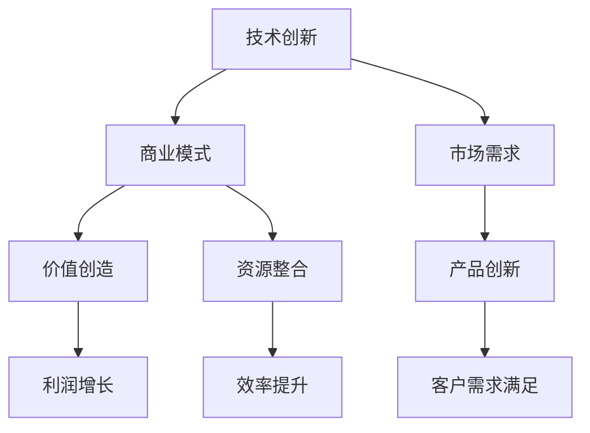

                 

# 技术创新与商业模式：找准创业的突破口

> 关键词：技术创新、商业模式、创业、商业策略、市场定位、人工智能、数字化转型

> 摘要：在当今快速变化的技术时代，创业不再是少数人的游戏，而是广泛参与者共同参与的盛宴。然而，如何找到适合自己的创新点和商业模式，是每一个创业者在初创阶段必须面对的重大挑战。本文将从技术创新和商业模式两个方面，通过实例和案例分析，帮助创业者找到自己的突破口，实现创业梦想。

## 1. 背景介绍

### 1.1 目的和范围

本文旨在探讨如何通过技术创新和商业模式创新，找到创业的突破口。文章将首先介绍技术创新和商业模式的定义和重要性，然后通过具体案例，展示如何在实际创业过程中运用这些概念。文章不仅适用于有志于创业的年轻人，也希望能为现有企业寻找新的商业模式提供启示。

### 1.2 预期读者

预期读者包括：
- 创业者：无论是处于初创阶段，还是希望在现有业务中引入新模式的创业者。
- 企业家：寻求通过技术创新和商业模式创新提升企业竞争力的企业家。
- 研究人员：对技术创新和商业模式有兴趣的研究者。
- 投资者：寻求了解创业和投资机会的投资者。

### 1.3 文档结构概述

本文将分为以下几个部分：
- 第1部分：背景介绍，包括目的、预期读者和文档结构概述。
- 第2部分：核心概念与联系，介绍技术创新和商业模式的核心概念，并提供流程图。
- 第3部分：核心算法原理 & 具体操作步骤，通过伪代码详细阐述创新算法和操作流程。
- 第4部分：数学模型和公式 & 详细讲解 & 举例说明，使用latex格式展示相关数学公式和实例。
- 第5部分：项目实战：代码实际案例和详细解释说明，提供具体项目的代码和解读。
- 第6部分：实际应用场景，分析技术创新和商业模式在不同领域的应用。
- 第7部分：工具和资源推荐，包括学习资源、开发工具和最新研究成果。
- 第8部分：总结：未来发展趋势与挑战，探讨技术创新和商业模式的发展方向。
- 第9部分：附录：常见问题与解答，回答读者可能关心的问题。
- 第10部分：扩展阅读 & 参考资料，提供更多相关阅读材料。

### 1.4 术语表

#### 1.4.1 核心术语定义

- 技术创新：通过引入新的技术或改进现有技术，创造新产品或服务的过程。
- 商业模式：企业如何创造、传递和捕获价值的策略和结构。
- 创业：创建新企业或新业务的过程，通常伴随着技术创新和商业模式创新。
- 市场定位：确定产品或服务在市场中的特定位置，以满足特定客户群体的需求。

#### 1.4.2 相关概念解释

- 商业生态：一个由多个企业、组织和个人组成的网络，通过相互合作实现共同目标。
- 商业模式画布：一种用于描述企业如何创造和传递价值的工具，包括关键合作伙伴、客户关系、渠道、客户细分、收入来源、关键活动、关键资源、关键合作伙伴和成本结构等。
- 需求挖掘：通过市场调研、用户访谈等方式，发现并分析潜在客户的需求。

#### 1.4.3 缩略词列表

- AI：人工智能
- IoT：物联网
- ML：机器学习
- DS：数据科学
- SaaS：软件即服务
- PaaS：平台即服务
- IaaS：基础设施即服务

## 2. 核心概念与联系

技术创新和商业模式是创业成功的关键要素，它们之间相互关联，共同推动企业的成长。下面，我们将通过一个Mermaid流程图，展示这两个概念之间的关系。



### 2.1 技术创新与市场需求

技术创新通常源于对市场需求的洞察。企业通过需求挖掘和分析，发现市场中的未满足需求，然后利用技术手段来满足这些需求。这个过程包括以下几个步骤：

1. **需求识别**：通过市场调研、用户访谈等方式，识别出潜在的客户需求。
2. **需求分析**：对收集到的需求进行分类、筛选和分析，确定哪些需求具有商业价值。
3. **技术评估**：评估现有技术是否能够满足需求，或是否需要开发新的技术。
4. **产品定义**：基于技术评估，定义出可以满足客户需求的新产品或服务。

### 2.2 商业模式与价值创造

商业模式是企业创造、传递和捕获价值的方式。一个成功的商业模式需要解决以下几个关键问题：

1. **价值定位**：确定企业要为哪个客户群体提供价值。
2. **价值创造**：通过产品或服务，为企业提供独特的价值。
3. **价值传递**：确定如何将价值传递给客户。
4. **价值捕获**：确定企业如何从客户那里获得回报。

### 2.3 资源整合与效率提升

技术创新和商业模式的实施需要企业的资源支持。企业需要整合内部和外部资源，以提高运营效率和竞争力。这个过程包括以下几个步骤：

1. **资源识别**：识别企业所需的资源，包括资金、人力、技术等。
2. **资源整合**：通过合作、并购等方式，整合所需的资源。
3. **资源优化**：优化资源配置，提高资源利用效率。
4. **效率评估**：定期评估效率提升情况，并根据反馈进行调整。

## 3. 核心算法原理 & 具体操作步骤

在技术创新和商业模式设计中，核心算法发挥着至关重要的作用。以下我们将通过伪代码，详细阐述一个用于需求分析的算法原理和操作步骤。

```pseudo
// 需求分析算法
Algorithm DemandAnalysis(clientList, marketData)
    Input: clientList - 客户列表
           marketData - 市场数据

    Output: demandList - 需求列表

    1. Initialize demandList as an empty list
    2. For each client in clientList
        a. Collect client's requirements
        b. Analyze client's requirements
        c. Classify requirements into categories
        d. Add categorized requirements to demandList
    3. For each category in demandList
        a. Analyze frequency of requirements in the category
        b. Determine the most popular requirements
        c. Prioritize popular requirements based on their frequency
    4. Return demandList
```

### 3.1 算法原理

该算法的核心是通过对客户需求的收集和分析，将需求分类并确定优先级。具体原理如下：

1. **需求收集**：通过问卷调查、用户访谈等方式，收集客户的需求信息。
2. **需求分析**：对收集到的需求进行内容分析，识别出关键需求和痛点。
3. **需求分类**：将需求按照类型进行分类，如功能需求、性能需求、用户体验等。
4. **需求优先级确定**：分析每个分类下需求的频率，确定哪些需求是市场上最为迫切的。

### 3.2 具体操作步骤

1. **初始化需求列表**：创建一个空的需求列表，用于存储所有分类后的需求。
2. **循环遍历客户列表**：
   - 对于每个客户，收集其具体的需求信息。
   - 分析需求信息，识别出需求中的关键要素。
   - 将需求按照类型进行分类，并添加到需求列表中。
3. **循环遍历需求列表中的每个分类**：
   - 统计每个分类下需求的频率。
   - 根据频率确定需求的优先级。
   - 将优先级最高的需求排序，并输出需求列表。

## 4. 数学模型和公式 & 详细讲解 & 举例说明

在需求分析过程中，数学模型和公式可以有效地帮助我们量化需求，评估技术方案的商业可行性。以下我们将使用LaTeX格式展示相关数学公式，并给出详细的解释和实例。

### 4.1 需求频率计算

需求频率是评估需求热度的关键指标，计算公式如下：

$$
f_i = \frac{n_i}{N}
$$

其中，$f_i$ 表示第$i$类需求的频率，$n_i$ 表示第$i$类需求的数量，$N$ 表示总的需求数量。

### 4.2 需求优先级排序

为了确定需求优先级，可以使用优先级排序公式：

$$
P_i = w_i \times f_i
$$

其中，$P_i$ 表示第$i$类需求的优先级，$w_i$ 表示第$i$类需求的权重，$f_i$ 表示第$i$类需求的频率。

### 4.3 举例说明

假设我们收集了以下需求数据：

| 需求类别 | 需求数量 | 需求权重 |
| :---: | :---: | :---: |
| 功能需求 | 100 | 0.5 |
| 性能需求 | 80 | 0.3 |
| 用户体验 | 60 | 0.2 |

首先，计算每个类别的需求频率：

$$
f_{功能需求} = \frac{100}{100 + 80 + 60} = 0.4
$$

$$
f_{性能需求} = \frac{80}{100 + 80 + 60} = 0.32
$$

$$
f_{用户体验} = \frac{60}{100 + 80 + 60} = 0.24
$$

然后，计算每个类别的需求优先级：

$$
P_{功能需求} = 0.5 \times 0.4 = 0.2
$$

$$
P_{性能需求} = 0.3 \times 0.32 = 0.096
$$

$$
P_{用户体验} = 0.2 \times 0.24 = 0.048
$$

根据优先级排序，功能需求的优先级最高，其次是性能需求，用户体验需求最低。

## 5. 项目实战：代码实际案例和详细解释说明

为了更好地理解技术创新和商业模式在实际项目中的应用，我们选择了一个具体的项目——智能家居系统。该项目通过物联网技术，实现家庭设备之间的互联互通，提高用户的居住舒适度和生活品质。

### 5.1 开发环境搭建

为了搭建智能家居系统的开发环境，我们需要准备以下工具和软件：

- 操作系统：Windows/Linux/MacOS
- 编程语言：Python
- 开发环境：PyCharm/VSCode
- 数据库：MySQL/PostgreSQL
- 物联网平台：Arduino/ESP8266/ESP32

### 5.2 源代码详细实现和代码解读

以下是一个智能家居系统的简化代码实现，主要用于控制家庭灯光和温度。

```python
import time
import board
import busio
import mysql.connector

# 初始化数据库连接
db = mysql.connector.connect(
    host="localhost",
    user="yourusername",
    password="yourpassword",
    database="smart_home"
)

# 初始化GPIO
i2c = busio.I2C(scl=board.SCL_PIN, sda=board.SDA_PIN, frequency=100000)

# 初始化温度传感器
temperature_sensor = i2c.scan()[0]

# 初始化灯光控制模块
light_control = i2c.scan()[1]

# 设置灯光状态
def set_light_state(state):
    light_control.write_i2c_block_data(0x23, 0x00, [state])

# 设置温度控制目标
def set_temperature_target(target_temp):
    query = "INSERT INTO temperature_targets (target_temp) VALUES (%s)"
    db.cursor().execute(query, (target_temp,))
    db.commit()

# 获取当前温度
def get_current_temperature():
    query = "SELECT current_temp FROM temperature_readings ORDER BY id DESC LIMIT 1"
    result = db.cursor().execute(query)
    return result.fetchone()[0]

# 循环监控温度并控制灯光
while True:
    current_temp = get_current_temperature()
    target_temp = db.cursor().execute("SELECT target_temp FROM temperature_targets ORDER BY id DESC LIMIT 1")
    target_temp = target_temp.fetchone()[0]

    if current_temp < target_temp:
        set_light_state(1)  # 打开灯光
    else:
        set_light_state(0)  # 关闭灯光

    time.sleep(60)  # 每60秒监控一次
```

### 5.3 代码解读与分析

1. **数据库连接**：首先，我们使用MySQL数据库存储温度读数和目标温度。通过`mysql.connector`库，连接到本地数据库。

2. **初始化GPIO和传感器**：使用`board`和`busio`库初始化GPIO接口和I2C总线，连接温度传感器和灯光控制模块。

3. **设置灯光状态**：定义一个函数`set_light_state`，用于根据温度目标控制灯光的开关状态。

4. **设置温度控制目标**：定义一个函数`set_temperature_target`，用于向数据库插入新的温度目标。

5. **获取当前温度**：定义一个函数`get_current_temperature`，用于从数据库获取最新的温度读数。

6. **循环监控温度并控制灯光**：使用一个无限循环，不断从数据库获取当前温度和目标温度，根据温度差异控制灯光的开关。

该代码实现了一个简单的智能家居系统，用于控制家庭灯光和温度。在实际应用中，还可以扩展功能，如添加湿度传感器、远程控制、语音交互等。

## 6. 实际应用场景

技术创新和商业模式在各个领域都有着广泛的应用，下面我们列举几个典型的实际应用场景：

### 6.1 物联网（IoT）

物联网技术通过连接各种智能设备，实现了数据的实时采集和分析，从而为企业提供了丰富的商业机会。例如，在智能家居领域，通过物联网技术，可以实现家庭设备之间的互联互通，提高用户的生活品质。在工业领域，物联网技术可以用于设备监控、故障预测和远程维护，提高生产效率和降低运营成本。

### 6.2 人工智能（AI）

人工智能技术在各行各业都有着广泛的应用。在医疗领域，人工智能可以用于疾病诊断、药物研发和健康监测；在金融领域，人工智能可以用于风险评估、欺诈检测和个性化投资建议。在零售领域，人工智能可以帮助企业实现精准营销、库存管理和供应链优化。

### 6.3 大数据

大数据技术通过处理海量数据，帮助企业发现商业机会、优化决策和提升效率。例如，在物流领域，通过分析大数据，可以实现路线优化、运输成本控制和客户需求预测。在广告领域，大数据技术可以帮助企业实现精准投放、提高广告效果。

### 6.4 区块链

区块链技术通过去中心化的方式，实现数据的不可篡改和透明性，为金融、供应链、版权保护等领域带来了新的商业模式。例如，在金融领域，区块链技术可以用于支付、跨境交易和信用评级；在供应链领域，区块链技术可以实现供应链的透明化和追踪。

## 7. 工具和资源推荐

为了帮助读者更好地了解技术创新和商业模式的最新动态，我们推荐以下工具和资源：

### 7.1 学习资源推荐

#### 7.1.1 书籍推荐

- 《创新者的窘境》
- 《商业模式新生代》
- 《智能时代》
- 《区块链：从数字货币到信用社会》

#### 7.1.2 在线课程

- Coursera：人工智能、大数据、区块链等相关课程
- edX：技术创新与商业模式的在线课程
- Udemy：众多关于技术创业和商业策略的课程

#### 7.1.3 技术博客和网站

- Medium：众多关于技术创新和商业模式的博客文章
- HackerRank：编程挑战和实践项目
- TechCrunch：最新的科技和创业动态

### 7.2 开发工具框架推荐

#### 7.2.1 IDE和编辑器

- PyCharm：Python编程的集成开发环境
- Visual Studio Code：跨平台的编程编辑器
- IntelliJ IDEA：Java编程的集成开发环境

#### 7.2.2 调试和性能分析工具

- GDB：Linux平台下的调试工具
- JMeter：性能测试工具
- VisualVM：Java虚拟机的性能分析工具

#### 7.2.3 相关框架和库

- TensorFlow：深度学习框架
- Flask：Python Web开发框架
- Spring Boot：Java Web开发框架
- React：前端开发框架
- Vue.js：前端开发框架

### 7.3 相关论文著作推荐

#### 7.3.1 经典论文

- "The Innovator's Dilemma" by Clayton M. Christensen
- "Business Model Generation" by Alex Osterwalder and Yves Pigneur
- "The Lean Startup" by Eric Ries
- "Blockchain: Blueprint for a New Economy" by Melanie Swan

#### 7.3.2 最新研究成果

- "AI and Robotics: Challenges and Opportunities in the Age of Automation"
- "Blockchain for Business: A Practical Guide to Creating Systems and Processes for Tomorrow's World"
- "Data-Driven Innovation: Insights from the Economics of Artificial Intelligence"
- "The Future of Humanity: Terraforming Mars, Interstellar Travel, Immortality, and Our Destiny Beyond Earth" by Michio Kaku

#### 7.3.3 应用案例分析

- "Blockchain in Healthcare: Use Cases and Opportunities"
- "The Future of Supply Chain: How Blockchain is Transforming the Industry"
- "AI in Retail: The Future of Shopping"
- "IoT in Agriculture: Enhancing Food Security and Sustainability through Smart Farming"

## 8. 总结：未来发展趋势与挑战

随着技术的不断进步，技术创新和商业模式创新在未来的发展中将继续扮演重要角色。以下是未来发展趋势和挑战的总结：

### 8.1 发展趋势

1. **技术创新将继续推动产业变革**：人工智能、物联网、区块链等新兴技术将继续推动传统行业的转型升级，带来新的商业模式和产业机会。
2. **商业模式创新将更加注重用户体验**：以用户为中心的设计理念将贯穿整个商业创新过程，企业将更加关注如何为用户提供更优质的产品和服务。
3. **跨界融合将带来更多创新机会**：不同领域的跨界融合将产生新的商业机会，为企业提供更多创新思路。
4. **数据将成为新的生产要素**：随着大数据、人工智能等技术的发展，数据的价值将得到进一步提升，成为企业创新和发展的核心资源。

### 8.2 挑战

1. **技术创新的风险和不确定性**：技术创新往往伴随着高风险和高不确定性，企业需要在研发过程中不断调整和优化，以降低技术失败的风险。
2. **商业模式创新的竞争压力**：在激烈的市场竞争中，企业需要不断创新商业模式，以获取竞争优势，但同时也面临着其他企业的竞争压力。
3. **数据隐私和安全问题**：随着数据在商业创新中的重要性增加，数据隐私和安全问题将日益突出，企业需要建立完善的数据安全管理体系。
4. **技术伦理和社会责任**：随着技术的不断进步，企业需要承担更多的社会责任，关注技术伦理问题，确保技术的应用不会对社会和人类造成负面影响。

## 9. 附录：常见问题与解答

### 9.1 如何找到适合自己的技术创新点？

1. **关注市场需求**：通过市场调研和用户反馈，了解客户的需求和痛点。
2. **跟踪行业动态**：关注行业内的技术创新和趋势，寻找可以借鉴和创新的点。
3. **发挥自身优势**：结合自身的专业技能和资源，寻找能够发挥自身优势的创新领域。
4. **合作与交流**：与他人合作，共同探讨和发现创新点。

### 9.2 如何设计和实施有效的商业模式？

1. **明确价值主张**：确定企业要为哪些客户提供价值，以及如何实现价值传递。
2. **构建商业模式画布**：使用商业模式画布，梳理企业的关键合作伙伴、客户关系、渠道、客户细分、收入来源等。
3. **评估商业模式可行性**：通过市场调研、财务分析等方法，评估商业模式的可行性和盈利能力。
4. **持续优化和调整**：根据市场反馈和运营数据，不断优化和调整商业模式，以适应市场变化。

### 9.3 技术创新和商业模式创新的关系是什么？

技术创新和商业模式创新密切相关。技术创新为商业模式创新提供技术基础，而商业模式创新则利用技术创新创造商业价值。一个成功的商业模式往往依赖于技术创新的支持，而技术创新的成功也离不开有效的商业模式来发挥其商业潜力。

## 10. 扩展阅读 & 参考资料

为了深入了解技术创新和商业模式的各个方面，我们推荐以下扩展阅读和参考资料：

- 《创新者的窘境》：[Clayton M. Christensen](https://www.claytonchristensen.com/)
- 《商业模式新生代》：[Alex Osterwalder](https://www.alexosterwalder.com/)
- 《智能时代》：[吴军](https://www.junglebook.org/)
- 《区块链：从数字货币到信用社会》：[Melanie Swan](https://www.melanie.swan)
- Coursera：[深度学习专项课程](https://www.coursera.org/specializations/deeplearning)
- edX：[大数据分析课程](https://www.edx.org/professional-certificate/microsoft-business-analyst)
- HackerRank：[编程挑战](https://www.hackerrank.com/domains/tutorials/10-days-of-javascript)
- TechCrunch：[科技与创业新闻](https://techcrunch.com/)
- 《物联网架构设计与实践》：[陈熙](https://www.amazon.com/Internet-of-Things-Architecture-Design-Implementation/dp/1119294241)
- 《区块链技术原理与架构设计》：[李笑来](https://www.amazon.com/Blockchain-Technology-Principles-Architecture-Applications/dp/0071807755)

通过以上扩展阅读和参考资料，您可以更深入地了解技术创新和商业模式的核心概念、应用实践和未来趋势。希望本文能为您的创业之路提供有价值的启示。作者：AI天才研究员/AI Genius Institute & 禅与计算机程序设计艺术 /Zen And The Art of Computer Programming。

