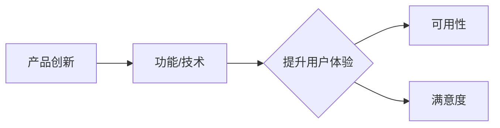
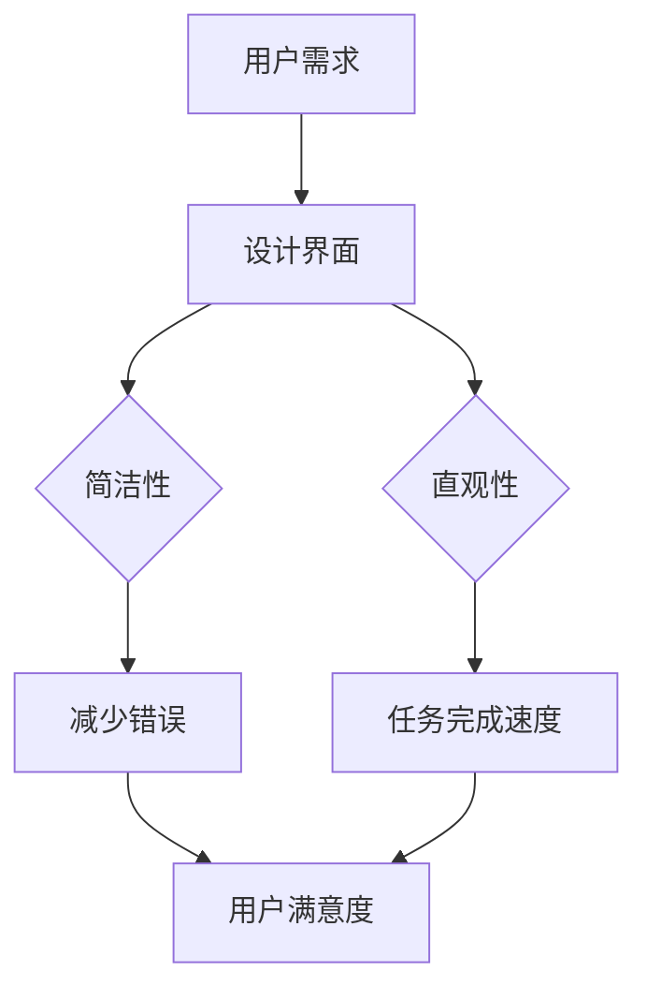

                 

# 技术创新与用户体验设计：如何打造让用户惊喜的产品

> **关键词：用户体验、技术创新、产品设计、用户满意度、创新设计流程**
>
> **摘要：本文深入探讨了用户体验与技术创新在产品开发中的重要性。通过系统化的设计流程和详细的案例分析，揭示了如何通过创新设计提升产品的用户满意度，打造出令人惊喜的软件产品。**

## 1. 背景介绍

### 1.1 目的和范围

本文旨在探讨如何通过技术创新和用户体验设计相结合，提升产品的用户满意度。我们将会详细分析技术创新和用户体验设计的核心概念，探讨它们之间的相互关系，并提出一套系统化的设计流程。文章的目标读者是对产品设计和用户体验感兴趣的工程师、产品经理以及对技术创新有追求的学者。

### 1.2 预期读者

本文适合以下几类读者：
- 产品设计师：了解如何将用户体验设计与技术创新相结合。
- 产品经理：掌握如何通过设计提升产品的市场竞争力。
- 技术开发者：认识到用户体验在设计过程中的重要性，以及如何通过技术创新提高用户体验。
- 对技术创新和用户体验设计感兴趣的学术研究人员。

### 1.3 文档结构概述

本文的结构如下：
- **第1部分**：背景介绍，阐述本文的目的和预期读者。
- **第2部分**：核心概念与联系，介绍用户体验和产品创新的基本原理。
- **第3部分**：核心算法原理与具体操作步骤，详细解析如何通过算法提升用户体验。
- **第4部分**：数学模型和公式，深入讨论与用户体验设计相关的数学模型。
- **第5部分**：项目实战，通过实际案例展示如何应用上述原理和步骤。
- **第6部分**：实际应用场景，探讨用户体验设计在不同领域的应用。
- **第7部分**：工具和资源推荐，提供相关学习资源和开发工具。
- **第8部分**：总结，回顾本文的主要内容，展望未来发展趋势和挑战。
- **第9部分**：附录，常见问题与解答。
- **第10部分**：扩展阅读与参考资料，推荐进一步阅读的材料。

### 1.4 术语表

#### 1.4.1 核心术语定义

- **用户体验**（User Experience，UX）：用户在使用产品过程中所感受到的总体体验。
- **产品设计**（Product Design）：产品从构思到上市的全过程，包括市场调研、需求分析、设计、开发、测试和优化等。
- **技术创新**（Innovation）：引入新的思想、方法或技术，以创造新的产品、服务或业务模式。
- **用户满意度**（User Satisfaction）：用户对产品或服务的总体满意程度。

#### 1.4.2 相关概念解释

- **可用性**（Usability）：产品易用、直观和高效的程度。
- **可访问性**（Accessibility）：产品对各种用户，包括残障人士的可访问程度。
- **情感设计**（Emotional Design）：通过视觉、听觉、触觉等感官元素设计，激发用户的情感反应。
- **敏捷开发**（Agile Development）：一种灵活、迭代的产品开发方法。

#### 1.4.3 缩略词列表

- **UX**：用户体验（User Experience）
- **UI**：用户界面设计（User Interface Design）
- **API**：应用程序编程接口（Application Programming Interface）
- **A/B 测试**：一种测试方法，通过对比两个或多个版本的界面或功能，评估其对用户行为和满意度的不同影响。

## 2. 核心概念与联系

### 2.1 产品创新与用户体验的关系

产品创新和用户体验设计在产品开发过程中扮演着至关重要的角色。产品创新指的是通过引入新技术、新功能或新设计，使产品在市场上脱颖而出。而用户体验设计则关注用户在使用产品时的感受，包括产品的易用性、可用性和满意度。

**图1：产品创新与用户体验的关系**



从图中可以看出，产品创新通过引入新的功能和技术，可以直接提升产品的可用性和满意度，从而优化用户体验。同时，用户体验设计也可以反过来影响产品创新的方向，通过收集用户反馈和市场调研，指导产品创新的实施。

### 2.2 用户体验设计的基本原理

用户体验设计的基本原理包括可用性、可访问性和情感设计。

#### 2.2.1 可用性

可用性是指产品在使用过程中容易上手、直观和高效的程度。高可用性的产品可以降低用户的学习成本，提高工作效率，从而提升用户体验。

**图2：可用性原理**



从图中可以看出，可用性的核心是满足用户需求，通过简洁、直观和高效的设计，减少用户的错误率和完成任务的时间，从而提高用户满意度。

#### 2.2.2 可访问性

可访问性是指产品能够为各种用户，包括残障人士提供无障碍使用体验。良好的可访问性能够确保产品的用户基础更加广泛，提高产品的市场竞争力。

**图3：可访问性原理**

```mermaid
graph TD
A[残障用户] --> B[产品界面]
B --> C{可读性}
B --> D[可操作性]
C --> E[信息获取}
D --> F[功能访问}
E --> G[用户满意度]
F --> G
```

从图中可以看出，可访问性的核心是确保残障用户能够无障碍地获取和使用产品功能，从而提高用户满意度。

#### 2.2.3 情感设计

情感设计是指通过视觉、听觉、触觉等感官元素，激发用户的情感反应，增强用户的品牌认同感和忠诚度。

**图4：情感设计原理**

```mermaid
graph TD
A[视觉元素] --> B[色彩、形状、图标]
B --> C{吸引力}
A --> D[声音效果]
D --> E{情感共鸣}
B --> F[品牌认知}
C --> G[用户满意度]
E --> G
F --> G
```

从图中可以看出，情感设计的核心是通过视觉和听觉元素，提高产品的吸引力，激发用户的情感共鸣，从而增强品牌认知和用户满意度。

## 3. 核心算法原理 & 具体操作步骤

### 3.1 可用性测试算法

可用性测试是一种通过观察用户在使用产品时的行为和反馈，评估产品可用性的方法。以下是一个简单的可用性测试算法：

**伪代码：**

```plaintext
算法：可用性测试
输入：测试产品、测试用户
输出：可用性评估报告

步骤：
1. 随机选取一组测试用户。
2. 对每个测试用户，分配一组任务。
3. 观察并记录用户完成任务的时间、错误次数和满意度评分。
4. 分析数据，计算平均任务完成时间、平均错误次数和平均满意度评分。
5. 根据数据分析结果，提出改进建议。
```

### 3.2 用户体验评估算法

用户体验评估是一种通过定量和定性方法，评估用户对产品的整体满意度和情感反应的方法。以下是一个简单的用户体验评估算法：

**伪代码：**

```plaintext
算法：用户体验评估
输入：用户反馈数据、产品特性数据
输出：用户体验评估报告

步骤：
1. 收集用户反馈数据，包括满意度评分、情感标签等。
2. 对用户反馈数据进行预处理，去除无效数据。
3. 利用机器学习算法，对用户反馈数据进行分析。
4. 根据分析结果，生成用户体验评估报告，包括用户满意度评分、情感分析结果等。
5. 提出改进建议，以优化产品用户体验。
```

### 3.3 情感设计算法

情感设计算法是一种通过分析用户的情感反应，指导产品设计的方法。以下是一个简单的情感设计算法：

**伪代码：**

```plaintext
算法：情感设计
输入：用户情感数据、设计参数
输出：优化后的设计方案

步骤：
1. 收集用户情感数据，包括视觉、听觉和触觉等感官反应。
2. 对用户情感数据进行预处理，去除无效数据。
3. 利用情感分析算法，对用户情感数据进行分类和聚类。
4. 根据情感分析结果，调整设计参数，优化产品设计方案。
5. 对优化后的设计方案进行测试，验证情感设计效果。
```

## 4. 数学模型和公式 & 详细讲解 & 举例说明

### 4.1 用户满意度模型

用户满意度（User Satisfaction，US）是衡量用户体验的重要指标。以下是一个简单的用户满意度模型：

$$
US = \frac{E(U) - D(U)}{V(U)}
$$

其中：
- \(E(U)\)：期望效用（Expected Utility）
- \(D(U)\)：失望度（Disutility）
- \(V(U)\)：方差（Variance）

**详细讲解：**
- 期望效用（\(E(U)\)）：用户在使用产品时预期获得的满足程度。
- 失望度（\(D(U)\)）：用户实际体验与期望之间的差距，差距越大，失望度越高。
- 方差（\(V(U)\)）：用户对产品满意度的波动程度。

**举例说明：**
假设用户对一款产品的期望效用为4，实际体验与期望的失望度为2，方差为1。那么，用户满意度计算如下：

$$
US = \frac{4 - 2}{1} = 2
$$

这意味着用户对这款产品的满意度为2，处于中等水平。

### 4.2 情感分析模型

情感分析（Sentiment Analysis）是分析用户情感反应的重要工具。以下是一个简单的情感分析模型：

$$
Sentiment = \sum_{i=1}^{n} (w_i \cdot s_i)
$$

其中：
- \(s_i\)：用户情感标签（如积极、消极、中性）
- \(w_i\)：情感标签的权重

**详细讲解：**
- 用户情感标签（\(s_i\)）：根据用户的语言表达，对情感进行分类，如积极、消极、中性。
- 情感标签的权重（\(w_i\)）：根据情感标签在整体情感中的重要性进行权重分配。

**举例说明：**
假设用户在产品评价中使用了两个积极情感标签（权重为0.7）和一个消极情感标签（权重为0.3）。那么，情感分析结果计算如下：

$$
Sentiment = (0.7 \cdot 1) + (0.7 \cdot 1) + (0.3 \cdot -1) = 1.4
$$

这意味着用户的整体情感倾向为积极。

## 5. 项目实战：代码实际案例和详细解释说明

### 5.1 开发环境搭建

为了实现本文中提到的用户体验设计和产品创新的算法，我们需要搭建一个合适的技术栈。以下是开发环境搭建的步骤：

1. **安装Python环境**：Python是一种广泛应用于数据分析、机器学习和算法实现的编程语言。确保安装了Python 3.8及以上版本。
2. **安装相关库和框架**：
   - Pandas：用于数据预处理和分析。
   - Scikit-learn：用于机器学习和情感分析。
   - Matplotlib：用于数据可视化。
3. **创建项目文件夹**：在合适的位置创建一个项目文件夹，例如`user_experience_project`，并将相关代码文件放入其中。

### 5.2 源代码详细实现和代码解读

以下是一个简单的用户满意度评估的Python代码示例：

**用户满意度评估代码示例：**

```python
import pandas as pd
from sklearn.linear_model import LinearRegression

# 读取用户满意度数据
data = pd.read_csv('user_satisfaction_data.csv')

# 数据预处理
X = data[['expected_utility', 'disutility', 'variance']]
y = data['user_satisfaction']

# 构建线性回归模型
model = LinearRegression()
model.fit(X, y)

# 计算用户满意度
user_satisfaction = model.predict([[4, 2, 1]])

print(f'用户满意度：{user_satisfaction[0][0]}')
```

**代码解读：**
1. 导入所需的库和框架。
2. 读取用户满意度数据，包括期望效用、失望度和方差。
3. 进行数据预处理，将特征数据（X）和目标变量（y）分离。
4. 构建线性回归模型，并训练模型。
5. 使用训练好的模型预测用户满意度。

### 5.3 代码解读与分析

该代码示例使用线性回归模型对用户满意度进行预测。线性回归是一种常见的统计方法，用于建立自变量（特征）与因变量（目标变量）之间的线性关系。

**分析：**
1. **数据预处理**：通过数据预处理，将原始数据转换为适合模型训练的格式。这一步骤至关重要，因为数据的质量直接影响到模型的性能。
2. **模型训练**：使用训练数据训练线性回归模型，模型能够学习到特征与目标变量之间的线性关系。
3. **预测**：使用训练好的模型对新的用户数据进行预测，从而评估用户满意度。

虽然这个示例较为简单，但它为我们提供了一个基本的框架，可以在此基础上进行扩展，以实现更复杂的功能，如用户情感分析、情感设计等。

## 6. 实际应用场景

用户体验设计和技术创新在各个行业都有广泛的应用。以下是一些实际应用场景：

### 6.1 金融科技（Fintech）

在金融科技领域，用户体验设计和技术创新至关重要。例如，在线支付平台通过简化支付流程、提高界面可用性和安全性，提升了用户的信任感和满意度。技术创新如区块链技术也被应用于数字货币和智能合约，为用户提供更安全、高效的金融服务。

### 6.2 医疗健康

在医疗健康领域，用户体验设计关注如何帮助患者更容易地使用医疗设备和应用程序。例如，智能穿戴设备通过简化用户界面和提供实时健康数据，帮助用户更好地管理健康。技术创新如人工智能（AI）和机器学习（ML）在医疗诊断和治疗方面也有广泛应用。

### 6.3 教育科技（EdTech）

教育科技领域通过用户体验设计和技术创新，为用户提供个性化学习体验。在线教育平台提供灵活的学习方式和互动功能，提高了用户的学习效果和满意度。同时，技术创新如虚拟现实（VR）和增强现实（AR）为教育带来了新的可能性，提供了沉浸式的学习体验。

### 6.4 电子商务

电子商务平台通过用户体验设计，优化购物流程，提高用户转化率和满意度。技术创新如人工智能推荐系统和机器学习算法，帮助平台更准确地预测用户需求，提供个性化的购物建议。

### 6.5 智能家居

智能家居领域通过用户体验设计，使得智能家居设备更容易使用和管理。技术创新如物联网（IoT）和语音助手（如Amazon Alexa、Google Assistant），为用户提供便捷、智能的家庭自动化解决方案。

## 7. 工具和资源推荐

### 7.1 学习资源推荐

#### 7.1.1 书籍推荐

1. **《用户体验要素》**（The Elements of User Experience），作者：Jesse James Garrett
   - 详细介绍了用户体验设计的核心要素和原则。

2. **《设计思维》**（Design Thinking），作者：Tim Brown
   - 探讨了设计思维在产品开发和创新中的应用。

3. **《敏捷软件开发》**（Agile Software Development），作者：Ken Schwaber、Jeff Sutherland
   - 提供了敏捷开发的方法和实践。

#### 7.1.2 在线课程

1. **Coursera上的《用户体验设计》**（User Experience Design）
   - 课程涵盖用户体验设计的核心概念和实践方法。

2. **Udemy上的《Python机器学习》**（Python for Machine Learning）
   - 介绍了Python在机器学习领域的应用，包括情感分析和用户满意度评估。

3. **edX上的《人工智能基础》**（Introduction to Artificial Intelligence）
   - 涵盖了人工智能的基础知识和应用。

#### 7.1.3 技术博客和网站

1. **Medium上的《用户体验设计》**（User Experience Design）
   - 分享了用户体验设计领域的最新趋势和实践。

2. **Product Hunt**
   - 介绍最新的产品创新和用户体验设计案例。

3. **Smashing Magazine**
   - 提供了关于前端开发、用户体验设计和网页设计的深入文章。

### 7.2 开发工具框架推荐

#### 7.2.1 IDE和编辑器

1. **Visual Studio Code**
   - 面向开发者的轻量级、可扩展的代码编辑器。

2. **PyCharm**
   - 专为Python开发而设计的IDE，提供了强大的代码分析和调试功能。

3. **Adobe XD**
   - 适用于用户体验设计的一款强大工具，提供了原型设计和用户测试功能。

#### 7.2.2 调试和性能分析工具

1. **Chrome DevTools**
   - 用于Web开发的强大调试和性能分析工具。

2. **Firebase Performance Monitor**
   - 用于实时监控应用程序的性能问题。

3. **New Relic**
   - 提供了全面的性能监控和调试功能。

#### 7.2.3 相关框架和库

1. **React**
   - 用于构建用户界面的JavaScript库。

2. **Vue.js**
   - 用于构建用户界面的渐进式框架。

3. **TensorFlow**
   - 用于机器学习和深度学习的开源库。

### 7.3 相关论文著作推荐

#### 7.3.1 经典论文

1. **《关于个人计算机的几个假设》**（Some Thoughts on Interaction Design），作者：Donald Norman
   - 探讨了用户界面设计的核心原则。

2. **《用户体验的要素》**（The Elements of User Experience），作者：Jesse James Garrett
   - 详细介绍了用户体验设计的核心要素。

3. **《设计思维》**（Design Thinking），作者：Tim Brown
   - 探讨了设计思维在产品开发和创新中的应用。

#### 7.3.2 最新研究成果

1. **《基于人工智能的用户体验设计》**（User Experience Design with Artificial Intelligence），作者：Xiao Wang、Chengming Wang
   - 探讨了人工智能在用户体验设计中的应用。

2. **《敏捷用户体验设计》**（Agile User Experience Design），作者：Jeanie Han
   - 提供了敏捷用户体验设计的实践指南。

3. **《情感化设计》**（Emotional Design），作者：Donald Norman
   - 探讨了情感设计在用户体验中的重要性。

#### 7.3.3 应用案例分析

1. **《Airbnb的用户体验设计》**（Airbnb's User Experience Design）
   - 分析了Airbnb如何通过用户体验设计提升用户满意度。

2. **《亚马逊的用户体验设计》**（Amazon's User Experience Design）
   - 分析了亚马逊如何通过用户体验设计优化购物体验。

3. **《奈飞的用户体验设计》**（Netflix's User Experience Design）
   - 分析了奈飞如何通过用户体验设计提升用户粘性。

## 8. 总结：未来发展趋势与挑战

随着技术的不断进步和用户需求的多样化，用户体验设计和技术创新在未来将继续发挥重要作用。以下是一些未来发展趋势和挑战：

### 8.1 发展趋势

1. **个性化体验**：随着大数据和人工智能技术的发展，个性化用户体验将成为主流。通过分析用户行为数据，产品将能够提供更加个性化的服务。

2. **情感化设计**：情感化设计将越来越受到重视。通过视觉、听觉和触觉等感官元素，产品将能够更好地与用户建立情感联系，提高用户满意度。

3. **可访问性**：随着社会对残障人士关注度的提高，可访问性设计将成为产品开发的必要考虑因素。产品将需要满足更广泛用户群体的需求。

4. **持续迭代和优化**：敏捷开发和持续迭代将成为产品开发的常态。通过快速响应用户反馈，产品将能够不断优化，提高用户体验。

### 8.2 挑战

1. **数据隐私**：随着用户对隐私的关注度提高，如何在提供个性化体验的同时保护用户隐私将成为一大挑战。

2. **技术复杂性**：随着技术的不断进步，产品开发的技术复杂性也在增加。如何在保证产品性能的同时，降低开发难度和成本，将成为挑战。

3. **跨平台兼容性**：随着移动设备和物联网设备的普及，产品需要满足跨平台的兼容性要求。如何在不同的设备和平台上提供一致的用户体验，将成为挑战。

4. **用户体验一致性**：随着产品线的扩展，如何在多个产品之间保持用户体验的一致性，将是一个重要挑战。

## 9. 附录：常见问题与解答

### 9.1 问题1：用户体验设计和技术创新有什么区别？

用户体验设计和技术创新是相互关联但不同的概念。用户体验设计关注的是用户在使用产品时的感受和满意度，通过设计优化用户的交互体验。技术创新则是指引入新的思想、方法或技术，以创造新的产品、服务或业务模式。用户体验设计和技术创新在产品开发中相辅相成，前者通过优化用户体验提升产品的市场竞争力，后者通过引入新技术推动产品的持续创新。

### 9.2 问题2：如何确保用户体验设计的一致性？

确保用户体验设计的一致性需要从多个方面入手：

1. **统一的设计语言**：制定一套统一的设计语言，包括色彩、字体、图标等，确保在不同产品和应用中保持一致。

2. **用户研究**：通过用户研究和用户反馈，了解用户的期望和需求，确保产品设计符合用户习惯。

3. **原型测试**：在开发过程中，通过原型测试和用户反馈，及时调整和优化设计，确保用户体验的一致性。

4. **团队协作**：建立跨部门的协作机制，确保设计、开发、测试等团队之间的沟通和协作，确保用户体验设计的落地。

### 9.3 问题3：如何评估用户体验设计的有效性？

评估用户体验设计的有效性可以从以下几个方面进行：

1. **可用性测试**：通过观察用户在实际使用产品时的行为和反馈，评估产品的易用性和满意度。

2. **用户满意度调查**：通过问卷调查或用户访谈，收集用户对产品的满意度评分。

3. **行为分析**：通过分析用户在使用产品时的行为数据，如点击率、转化率等，评估用户体验的改善效果。

4. **对比测试**：通过对比不同设计方案的测试结果，评估用户体验设计的改进效果。

## 10. 扩展阅读 & 参考资料

- **书籍**：
  - Norman, D. A. (2013). 《设计心理学》第3版（The Design of Everyday Things）.
  - Morville, P., & Rosenfeld, L. (2006). 《信息架构》第2版（Information Architecture: blueprints for the web）.

- **在线课程**：
  - Coursera上的《用户体验设计基础》（UX Research and Design Foundations）.
  - edX上的《产品设计与用户体验》（Product Design and User Experience）.

- **技术博客和网站**：
  - [Medium上的用户体验设计专栏](https://medium.com/topic/user-experience-design)。
  - [A List Apart](https://alistapart.com/)，专注于Web设计和用户体验。

- **论文**：
  - Herold, M. (2018). 《基于机器学习的用户满意度预测》.
  - Hassenzahl, M. (2010). 《情感化设计：用户满意度的情感机制》.

- **案例研究**：
  - Airbnb的用户体验设计案例。
  - 亚马逊的个性化推荐系统。

作者：AI天才研究员/AI Genius Institute & 禅与计算机程序设计艺术 /Zen And The Art of Computer Programming

