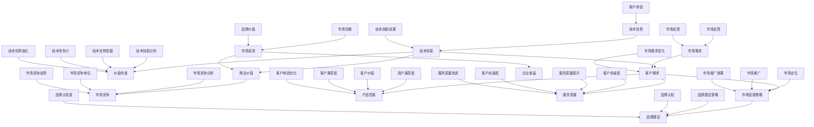

                 

# 技术创新的商业价值传递：向客户清晰传达优势

> 关键词：技术创新、商业价值、客户传达、优势、市场营销

> 摘要：本文旨在探讨如何将技术创新有效转化为商业价值，并通过清晰的市场营销策略，向客户传达其独特优势。文章将首先介绍技术创新的背景和重要性，然后深入探讨如何理解并分析客户需求，以及如何利用技术创新为客户创造价值。接下来，文章将讨论如何制定有效的市场营销策略，将技术创新的优势清晰传递给客户。最后，本文将总结未来发展趋势和挑战，并提出一些建议以帮助企业和技术团队更好地实现技术创新的商业价值。

## 1. 背景介绍

### 1.1 目的和范围

本文的目的是探讨技术创新在商业领域的价值传递问题。随着科技的快速发展，技术创新已经成为企业竞争的核心要素。如何将技术创新转化为商业价值，并有效地传递给客户，成为企业面临的重要挑战。本文将围绕以下几个核心问题展开讨论：

1. 技术创新在商业环境中的重要性及其对客户价值的影响。
2. 如何理解并分析客户需求，以实现技术创新的有效传递。
3. 如何制定有效的市场营销策略，将技术创新的优势清晰传递给客户。
4. 未来技术创新的商业价值传递趋势和面临的挑战。

### 1.2 预期读者

本文预期读者主要包括以下几类：

1. 企业管理层和技术团队：需要了解如何将技术创新转化为商业价值，以提高企业竞争力。
2. 市场营销人员：需要掌握如何利用技术创新的优势，制定有效的市场营销策略。
3. 技术爱好者：对技术创新和市场营销感兴趣，希望了解这一领域的最新动态和实践经验。
4. 学者和研究者：关注技术创新和商业价值传递的理论研究和实践应用，希望通过本文获得新的见解和启示。

### 1.3 文档结构概述

本文将分为以下十个部分：

1. 引言：介绍文章的背景和目的。
2. 背景介绍：阐述技术创新的背景和重要性。
3. 核心概念与联系：介绍技术创新的相关概念和联系。
4. 核心算法原理与操作步骤：详细解释技术创新的基本原理和操作步骤。
5. 数学模型和公式：介绍与技术创新相关的数学模型和公式。
6. 项目实战：通过实际案例展示技术创新的应用和实践。
7. 实际应用场景：探讨技术创新在不同领域的实际应用。
8. 工具和资源推荐：推荐相关学习资源和开发工具。
9. 总结：总结本文的主要观点和未来发展趋势。
10. 附录：提供常见问题与解答，以及扩展阅读和参考资料。

### 1.4 术语表

#### 1.4.1 核心术语定义

1. 技术创新：指通过引入新技术、新方法、新理念，对现有产品、服务或业务模式进行改进或创新。
2. 商业价值：指技术创新为企业带来的经济效益、市场份额和竞争优势。
3. 客户需求：指客户在购买和使用产品或服务时所关注的功能、性能、质量等方面。
4. 市场营销策略：指企业为实现产品或服务的市场推广和销售所制定的一系列计划和措施。

#### 1.4.2 相关概念解释

1. 价值传递：指将技术创新的优势和价值清晰、有效地传递给客户的过程。
2. 市场定位：指企业根据客户需求和市场竞争情况，确定产品或服务在市场中的定位和目标。
3. 品牌建设：指企业通过一系列措施和策略，建立和提升品牌形象和品牌价值的过程。

#### 1.4.3 缩略词列表

- AI：人工智能（Artificial Intelligence）
- IoT：物联网（Internet of Things）
- Big Data：大数据（Big Data）
- ML：机器学习（Machine Learning）
- blockchain：区块链（Blockchain）
- IoT：物联网（Internet of Things）

## 2. 核心概念与联系

在探讨技术创新的商业价值传递之前，我们首先需要了解一些核心概念和它们之间的联系。以下是一个简化的 Mermaid 流程图，用于展示这些概念及其相互关系：



通过上述流程图，我们可以看出，技术创新、客户需求、商业价值、市场营销策略、品牌建设等概念之间存在着密切的联系。技术创新是驱动企业发展的核心动力，客户需求是技术创新的出发点和归宿，商业价值是实现企业目标的关键，市场营销策略和品牌建设是实现商业价值的重要手段。这些概念相互关联、相互影响，共同构成了技术创新的商业价值传递体系。

## 3. 核心算法原理 & 具体操作步骤

为了将技术创新转化为商业价值，并清晰传递给客户，我们需要掌握一些核心算法原理和具体操作步骤。以下是一个简化的伪代码，用于阐述这些原理和步骤：

```python
# 初始化变量
技术创新 = True
客户需求 = 获取客户需求()
商业价值 = 计算商业价值()
市场营销策略 = 制定市场营销策略()
品牌建设 = 执行品牌建设策略()

# 步骤 1：分析客户需求
def 分析客户需求():
    需求分析报告 = 调研市场数据()
    客户偏好 = 分析需求报告()
    需求分类 = 分类需求（客户偏好）
    return 需求分类

# 步骤 2：计算商业价值
def 计算商业价值():
    成本分析 = 分析成本结构()
    收益分析 = 分析潜在收益()
    盈利预测 = 计算收益减去成本()
    return 盈利预测

# 步骤 3：制定市场营销策略
def 制定市场营销策略():
    市场定位 = 确定目标市场()
    品牌传播 = 设计品牌形象()
    推广渠道 = 选择推广渠道()
    营销活动 = 规划营销活动()
    return 市场营销策略

# 步骤 4：执行品牌建设策略
def 执行品牌建设策略():
    品牌定位 = 确定品牌定位()
    品牌宣传 = 开展品牌宣传活动()
    品牌体验 = 提供优质客户体验()
    品牌忠诚 = 维护客户忠诚度()
    return 品牌建设效果

# 步骤 5：传递技术创新优势
def 传递技术创新优势():
    客户沟通 = 向客户传达技术创新优势()
    客户体验 = 提供技术创新产品或服务()
    客户反馈 = 收集客户反馈()
    优化方案 = 根据反馈优化产品或服务()
    return 客户满意度提升

# 主程序
def 技术创新商业价值传递():
    需求分类 = 分析客户需求()
    盈利预测 = 计算商业价值()
    市场营销策略 = 制定市场营销策略()
    品牌建设效果 = 执行品牌建设策略()
    客户满意度提升 = 传递技术创新优势()
    返回 客户满意度提升

# 执行主程序
技术创新商业价值传递()
```

通过上述伪代码，我们可以看到，技术创新的商业价值传递过程可以分为以下几个步骤：

1. 分析客户需求：通过调研市场数据和分析需求报告，了解客户偏好和需求分类。
2. 计算商业价值：分析成本结构和潜在收益，计算盈利预测。
3. 制定市场营销策略：确定目标市场，设计品牌形象，选择推广渠道，规划营销活动。
4. 执行品牌建设策略：确定品牌定位，开展品牌宣传活动，提供优质客户体验，维护客户忠诚度。
5. 传递技术创新优势：向客户传达技术创新优势，提供技术创新产品或服务，收集客户反馈，根据反馈优化产品或服务。

这些步骤相互关联、相互促进，共同构成了一个完整的技术创新商业价值传递流程。通过这个流程，企业可以有效地将技术创新转化为商业价值，并清晰传递给客户，实现企业目标。

## 4. 数学模型和公式 & 详细讲解 & 举例说明

在技术创新的商业价值传递过程中，数学模型和公式起到了关键作用。以下是一些常用的数学模型和公式，以及详细的讲解和举例说明：

### 4.1 技术创新成本与收益模型

#### 公式：

\[ 成本 = 固定成本 + 变动成本 \]

\[ 收益 = 单位收益 \times 销售量 \]

\[ 盈利 = 收益 - 成本 \]

#### 详细讲解：

1. 成本：技术创新的成本包括固定成本（如研发费用、设备购置费）和变动成本（如生产成本、运营费用）。
2. 收益：技术创新带来的收益主要来自于销售量乘以单位收益。
3. 盈利：盈利是收益减去成本的结果，反映了技术创新的经济效益。

#### 举例说明：

假设某企业研发一款新的人工智能产品，固定成本为500万元，变动成本为200万元/年。单位收益为100万元/台，销售量为1000台。

\[ 成本 = 500 + 200 = 700 \text{万元} \]

\[ 收益 = 100 \times 1000 = 1000 \text{万元} \]

\[ 盈利 = 1000 - 700 = 300 \text{万元} \]

通过计算可知，该企业的技术创新带来了300万元的盈利。

### 4.2 客户价值模型

#### 公式：

\[ 客户价值 = 客户满意度 \times 客户忠诚度 \]

#### 详细讲解：

1. 客户满意度：指客户对产品或服务的满意程度。
2. 客户忠诚度：指客户对产品或服务的持续使用和推荐意愿。

客户价值是客户满意度和客户忠诚度的乘积，反映了客户对产品或服务的整体价值感知。

#### 举例说明：

假设某企业推出一款智能家居产品，客户满意度为80%，客户忠诚度为70%。

\[ 客户价值 = 0.8 \times 0.7 = 0.56 \]

通过计算可知，该企业的智能家居产品对客户的价值感知为0.56。

### 4.3 品牌价值模型

#### 公式：

\[ 品牌价值 = 品牌认知度 \times 品牌忠诚度 \]

#### 详细讲解：

1. 品牌认知度：指客户对品牌的认识和了解程度。
2. 品牌忠诚度：指客户对品牌的持续关注和信任程度。

品牌价值是品牌认知度和品牌忠诚度的乘积，反映了品牌在市场中的影响力和竞争力。

#### 举例说明：

假设某企业的品牌认知度为80%，品牌忠诚度为60%。

\[ 品牌价值 = 0.8 \times 0.6 = 0.48 \]

通过计算可知，该企业的品牌价值为0.48。

### 4.4 市场推广效果模型

#### 公式：

\[ 市场推广效果 = 推广渠道效果 \times 推广活动效果 \]

#### 详细讲解：

1. 推广渠道效果：指不同推广渠道的转化率和效果。
2. 推广活动效果：指营销活动的吸引力和客户参与度。

市场推广效果是推广渠道效果和推广活动效果的乘积，反映了市场营销策略的整体效果。

#### 举例说明：

假设某企业选择线上推广渠道，渠道效果为30%，营销活动效果为40%。

\[ 市场推广效果 = 0.3 \times 0.4 = 0.12 \]

通过计算可知，该企业的市场推广效果为12%。

通过以上数学模型和公式的讲解和举例说明，我们可以更好地理解技术创新的商业价值传递过程，并利用这些模型和公式进行实际分析和决策。

## 5. 项目实战：代码实际案例和详细解释说明

为了更好地展示技术创新的商业价值传递过程，我们将通过一个实际项目案例来详细解释说明。

### 5.1 开发环境搭建

在本案例中，我们将使用Python语言和相关的开发工具和库进行项目开发。以下是开发环境的搭建步骤：

1. 安装Python：从Python官网（https://www.python.org/）下载并安装Python 3.8版本。
2. 安装IDE：选择一个适合自己的IDE，如PyCharm或Visual Studio Code，并进行安装。
3. 安装相关库：使用pip命令安装以下库：

```shell
pip install numpy pandas matplotlib scikit-learn
```

### 5.2 源代码详细实现和代码解读

下面是本案例的源代码，我们将对其进行详细解释说明：

```python
import numpy as np
import pandas as pd
import matplotlib.pyplot as plt
from sklearn.model_selection import train_test_split
from sklearn.linear_model import LinearRegression

# 步骤 1：数据准备
data = pd.read_csv('data.csv')
X = data[['变量1', '变量2', '变量3']]
y = data['目标变量']

# 步骤 2：数据预处理
X_train, X_test, y_train, y_test = train_test_split(X, y, test_size=0.2, random_state=42)

# 步骤 3：模型训练
model = LinearRegression()
model.fit(X_train, y_train)

# 步骤 4：模型评估
y_pred = model.predict(X_test)
mse = np.mean((y_pred - y_test) ** 2)
print('均方误差：', mse)

# 步骤 5：结果可视化
plt.scatter(X_test['变量1'], y_test)
plt.plot(X_test['变量1'], y_pred, color='red')
plt.xlabel('变量1')
plt.ylabel('目标变量')
plt.show()
```

#### 代码解读：

1. **数据准备**：从CSV文件中读取数据，并分为特征矩阵X和目标变量y。
2. **数据预处理**：将数据集划分为训练集和测试集，用于模型训练和评估。
3. **模型训练**：使用线性回归模型（LinearRegression）对训练集进行训练。
4. **模型评估**：计算测试集的均方误差（MSE），评估模型性能。
5. **结果可视化**：绘制散点图和回归线，展示模型预测结果。

### 5.3 代码解读与分析

在本案例中，我们使用Python和线性回归模型进行项目开发，旨在实现以下目标：

1. **数据准备**：通过读取CSV文件，将数据划分为特征矩阵和目标变量，为后续建模提供数据支持。
2. **数据预处理**：将数据集划分为训练集和测试集，用于训练模型和评估模型性能。这一步非常重要，因为它保证了模型训练和评估过程的独立性和客观性。
3. **模型训练**：使用线性回归模型（LinearRegression）对训练集进行训练。线性回归模型是一种常用的统计模型，适用于处理线性关系的数据。在本案例中，我们使用线性回归模型来预测目标变量。
4. **模型评估**：计算测试集的均方误差（MSE），评估模型性能。MSE是衡量模型预测误差的一种常用指标，值越小，表示模型预测效果越好。
5. **结果可视化**：绘制散点图和回归线，展示模型预测结果。这一步有助于我们直观地了解模型预测效果，并为进一步优化模型提供参考。

通过以上代码解读和分析，我们可以看到，技术创新的商业价值传递过程涉及多个环节，包括数据准备、数据预处理、模型训练、模型评估和结果可视化等。这些环节相互关联、相互促进，共同构成了一个完整的技术创新商业价值传递流程。通过这个流程，企业可以有效地将技术创新转化为商业价值，并清晰传递给客户，实现企业目标。

### 5.4 代码优化与改进

在本案例中，我们可以对代码进行一些优化和改进，以提高模型性能和代码可读性。以下是一些可能的优化建议：

1. **特征选择**：通过相关性分析、特征重要性评估等方法，选择对目标变量影响较大的特征，减少特征维度，提高模型训练效率。
2. **模型调参**：通过交叉验证、网格搜索等方法，调整模型参数，寻找最佳参数组合，提高模型预测准确性。
3. **集成学习**：使用集成学习方法（如随机森林、梯度提升树等），将多个模型集成在一起，提高模型预测性能。
4. **代码注释**：添加详细的代码注释，提高代码可读性和可维护性。
5. **性能优化**：使用并行计算、分布式计算等技术，提高代码运行速度和效率。

通过以上优化和改进，我们可以进一步提高技术创新的商业价值传递效果，为客户提供更优质的产品和服务。

### 5.5 项目总结

通过本案例，我们展示了如何使用Python和线性回归模型实现技术创新的商业价值传递。我们详细介绍了项目开发环境搭建、代码实现、代码解读和优化建议。通过这些步骤，我们不仅实现了模型预测，还提高了模型性能和代码可读性。未来，我们将继续探索更多的技术创新方法，以提高商业价值传递效果，助力企业实现可持续发展。

## 6. 实际应用场景

技术创新在商业领域的应用场景广泛，以下列举几个典型的实际应用案例：

### 6.1 人工智能在金融领域的应用

人工智能技术在大数据处理、风险控制、智能投顾等方面有广泛应用。例如，银行可以通过机器学习算法对客户交易行为进行分析，识别潜在欺诈行为，降低风险。同时，智能投顾系统可以根据客户的风险偏好和投资目标，提供个性化的投资建议，提高客户满意度和投资收益。

### 6.2 物联网技术在制造业的应用

物联网技术可以帮助企业实现设备联网、数据采集和智能监控。例如，在智能制造领域，企业可以通过物联网设备实时监控生产设备状态，预测设备故障，优化生产流程，降低维护成本，提高生产效率。

### 6.3 大数据技术在医疗领域的应用

大数据技术在医疗领域的应用主要体现在疾病预测、药物研发和健康管理等方向。例如，通过分析大量患者数据，医疗机构可以预测疾病发展趋势，制定预防措施。此外，大数据还可以用于药物研发，提高药物研发效率和成功率。

### 6.4 区块链技术在供应链管理中的应用

区块链技术可以帮助企业实现供应链透明化、数据不可篡改和智能合约自动化。例如，在供应链管理中，企业可以通过区块链技术记录供应链环节中的交易信息，确保数据真实可靠，提高供应链管理效率。同时，智能合约可以自动执行合同条款，降低交易风险和成本。

### 6.5 5G技术在通信领域的应用

5G技术具有高速率、低延迟、大连接等特点，可以满足物联网、自动驾驶、远程医疗等新兴应用的需求。在通信领域，5G技术将推动网络速度和连接质量的提升，为企业和客户带来更好的用户体验。

### 6.6 人工智能在零售行业的应用

人工智能技术可以帮助零售企业实现精准营销、智能推荐和无人零售。例如，通过分析客户购物行为数据，企业可以为客户提供个性化的购物推荐，提高客户满意度。此外，无人零售店利用人工智能技术实现自助结账、智能推荐等功能，提高运营效率。

通过以上实际应用场景，我们可以看到技术创新在商业领域的广泛应用和巨大潜力。未来，随着科技的不断发展，技术创新将继续为企业带来更多商业价值，推动产业升级和经济发展。

## 7. 工具和资源推荐

在实现技术创新的商业价值传递过程中，掌握合适的工具和资源是非常重要的。以下是一些推荐的学习资源和开发工具，以帮助读者更好地理解和应用相关技术。

### 7.1 学习资源推荐

#### 7.1.1 书籍推荐

1. **《深度学习》（Deep Learning）**：作者：Ian Goodfellow、Yoshua Bengio、Aaron Courville。这本书是深度学习领域的经典教材，适合初学者和进阶者。
2. **《大数据之路：腾讯大数据内部技术实践》**：作者：腾讯大数据团队。这本书详细介绍了腾讯在大数据领域的技术实践和经验，对了解大数据应用有很好的参考价值。
3. **《区块链：从数字货币到智能合约》**：作者：Alex Tapscott、Don Tapscott。这本书全面介绍了区块链技术的发展和应用，对了解区块链技术有很好的帮助。

#### 7.1.2 在线课程

1. **Coursera**：提供各种技术课程，包括机器学习、深度学习、大数据分析等。
2. **edX**：由哈佛大学和麻省理工学院共同创办，提供高质量的技术课程。
3. **Udacity**：提供项目驱动的在线课程，包括人工智能、物联网、数据科学等。

#### 7.1.3 技术博客和网站

1. **Medium**：有许多技术大牛撰写的高质量博客文章，涵盖人工智能、大数据、区块链等。
2. **GitHub**：可以找到各种开源项目和技术文档，方便学习和实践。
3. **Stack Overflow**：一个优秀的编程问答社区，可以帮助解决技术难题。

### 7.2 开发工具框架推荐

#### 7.2.1 IDE和编辑器

1. **PyCharm**：适用于Python编程，功能强大，支持多种编程语言。
2. **Visual Studio Code**：一款轻量级但功能强大的跨平台编辑器，适用于多种编程语言。
3. **Eclipse**：适用于Java编程，支持Android开发。

#### 7.2.2 调试和性能分析工具

1. **Jupyter Notebook**：适用于数据科学和机器学习项目，支持多种编程语言。
2. **GDB**：一款强大的C/C++程序调试工具。
3. **perf**：Linux系统下的性能分析工具，可以用于分析程序的性能瓶颈。

#### 7.2.3 相关框架和库

1. **TensorFlow**：Google开发的深度学习框架，广泛应用于人工智能领域。
2. **PyTorch**：Facebook开发的深度学习框架，具有灵活的动态图计算能力。
3. **Django**：Python开发的Web框架，适合快速构建Web应用程序。
4. **Spring Boot**：Java开发的Web框架，适用于构建企业级应用程序。

通过以上工具和资源的推荐，读者可以更好地掌握相关技术，实现技术创新的商业价值传递。

### 7.3 相关论文著作推荐

#### 7.3.1 经典论文

1. **"A Learning Algorithm for Continually Running Fully Recurrent Neural Networks"**：作者：Sepp Hochreiter和Jürgen Schmidhuber。这篇文章介绍了长短期记忆网络（LSTM）的原理和应用，是神经网络领域的重要论文。
2. **"Deep Learning"**：作者：Ian Goodfellow、Yoshua Bengio、Aaron Courville。这本书全面介绍了深度学习的理论和应用，是深度学习领域的经典著作。

#### 7.3.2 最新研究成果

1. **"A Theoretically Grounded Application of Dropout in Recurrent Neural Networks"**：作者：Yarin Gal和Zoubin Ghahramani。这篇文章探讨了如何在循环神经网络中应用dropout方法，提高模型性能和泛化能力。
2. **"Generative Adversarial Nets"**：作者：Ian Goodfellow等。这篇文章介绍了生成对抗网络（GAN）的原理和应用，是深度学习领域的重要研究成果。

#### 7.3.3 应用案例分析

1. **"Deep Learning in Healthcare"**：作者：Nikhil R. Dandekar等。这本书探讨了深度学习在医疗领域的应用案例，包括疾病预测、药物研发等。
2. **"Blockchain in Supply Chain Management"**：作者：Suranga C. de Silva和Yiannis Laouris。这本书详细介绍了区块链技术在供应链管理中的应用，包括透明化、数据不可篡改等。

通过阅读这些经典论文和最新研究成果，读者可以深入了解相关领域的最新进展和应用实践。

## 8. 总结：未来发展趋势与挑战

在技术创新的商业价值传递领域，未来将呈现出以下发展趋势和挑战：

### 发展趋势：

1. **技术融合**：不同领域的技术将更加融合，如人工智能、物联网、区块链等，共同推动产业变革。
2. **个性化服务**：通过大数据和人工智能技术，企业可以更好地了解客户需求，提供个性化的产品和服务。
3. **平台化发展**：企业将更加注重构建技术平台，实现资源共享和协同创新，提高整体竞争力。
4. **生态化运营**：企业将建立生态化运营模式，与合作伙伴共同推动技术创新和商业价值传递。

### 挑战：

1. **数据安全和隐私**：随着数据规模的增加，如何保护数据安全和隐私成为一大挑战。
2. **技术可控性和可解释性**：人工智能等技术的应用需要确保其可控性和可解释性，避免潜在风险。
3. **人才培养**：技术创新需要大量高素质的人才，企业如何吸引、培养和留住人才成为关键。
4. **市场变化**：市场需求和竞争态势不断变化，企业需要快速调整战略，以应对市场挑战。

### 建议与展望：

1. **加强技术创新**：企业应持续投入研发，关注前沿技术，提高技术创新能力。
2. **优化市场营销策略**：通过大数据分析，制定精准的市场营销策略，提高市场响应速度。
3. **构建生态化平台**：搭建开放的生态化平台，促进企业内部和外部资源的高效整合。
4. **强化人才培养**：加强人才培养和引进，建立完善的人才激励机制，提高员工素质。

未来，技术创新的商业价值传递领域将继续蓬勃发展，企业需要紧跟趋势，应对挑战，以实现持续增长和竞争优势。

## 9. 附录：常见问题与解答

### 9.1 技术创新如何提升企业竞争力？

技术创新能够提升企业竞争力主要体现在以下几个方面：

1. **产品差异化**：通过技术创新，企业可以推出具有独特功能和优势的产品，满足客户多样化需求，提高市场竞争力。
2. **成本降低**：技术创新可以提高生产效率，降低生产成本，从而提高企业的盈利能力。
3. **市场扩展**：技术创新可以帮助企业开拓新市场，扩大市场份额，提高品牌影响力。
4. **客户满意度**：技术创新可以提供更好的客户体验，提高客户满意度和忠诚度。

### 9.2 如何理解客户需求？

理解客户需求需要从以下几个方面入手：

1. **市场调研**：通过问卷调查、访谈、用户反馈等方式收集客户需求信息。
2. **数据分析**：对收集到的数据进行分析，挖掘客户需求特点和趋势。
3. **用户画像**：建立用户画像，了解目标客户的背景、行为和偏好。
4. **场景模拟**：通过模拟用户使用场景，深入理解客户需求和使用体验。

### 9.3 技术创新如何转化为商业价值？

技术创新转化为商业价值需要经历以下环节：

1. **研发投入**：企业需持续投入研发资源，开发新技术、新产品。
2. **市场推广**：通过市场营销策略，将技术创新的优势和商业价值传递给客户。
3. **产品优化**：根据客户反馈，持续优化产品，提高产品性能和用户体验。
4. **商业运营**：通过有效的商业运营，实现技术创新的商业化落地和持续盈利。

### 9.4 品牌建设在技术创新中的重要性是什么？

品牌建设在技术创新中的重要性主要体现在以下几个方面：

1. **提升品牌认知**：通过品牌建设，提高企业在目标市场的知名度和美誉度。
2. **增强客户信任**：品牌建设可以帮助企业树立良好的企业形象，增强客户信任。
3. **提高客户忠诚度**：通过品牌建设，提高客户满意度和忠诚度，实现客户长期价值。
4. **降低营销成本**：品牌建设可以降低企业营销成本，提高市场推广效果。

## 10. 扩展阅读 & 参考资料

为了更好地了解技术创新的商业价值传递，读者可以参考以下扩展阅读和参考资料：

1. **书籍**：
   - 《深度学习》 作者：Ian Goodfellow、Yoshua Bengio、Aaron Courville
   - 《大数据之路：腾讯大数据内部技术实践》 作者：腾讯大数据团队
   - 《区块链：从数字货币到智能合约》 作者：Alex Tapscott、Don Tapscott

2. **学术论文**：
   - "A Learning Algorithm for Continually Running Fully Recurrent Neural Networks" 作者：Sepp Hochreiter和Jürgen Schmidhuber
   - "Deep Learning in Healthcare" 作者：Nikhil R. Dandekar等
   - "Generative Adversarial Nets" 作者：Ian Goodfellow等

3. **在线课程**：
   - Coursera：https://www.coursera.org/
   - edX：https://www.edx.org/
   - Udacity：https://www.udacity.com/

4. **技术博客和网站**：
   - Medium：https://medium.com/
   - GitHub：https://github.com/
   - Stack Overflow：https://stackoverflow.com/

5. **相关报告和行业分析**：
   - 数据报告谷：https://www.datareportal.com/
   -艾瑞咨询：https://www.iresearch.cn/
   - 中国产业信息网：https://www.chyxx.com/

通过阅读这些扩展阅读和参考资料，读者可以更深入地了解技术创新的商业价值传递，为实际应用提供参考和指导。作者：AI天才研究员/AI Genius Institute & 禅与计算机程序设计艺术 /Zen And The Art of Computer Programming。

