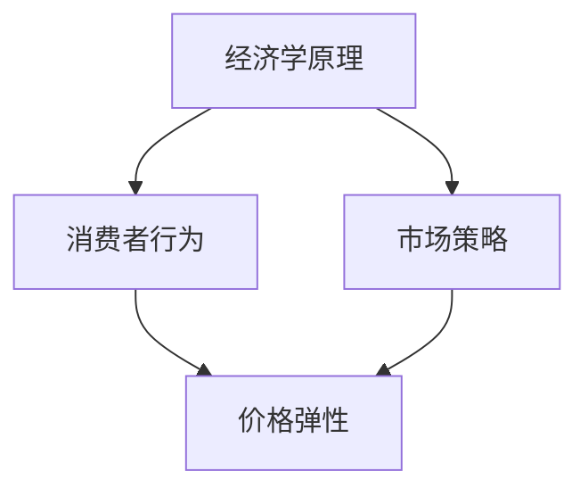

                 

# 技术型创业者的产品定价策略与心理学

> 关键词：产品定价、技术型创业者、心理学、消费者行为、市场策略

> 摘要：本文旨在探讨技术型创业者在制定产品定价策略时需要考虑的心理学因素，以及如何通过深入了解消费者行为和市场动态，来实现产品的有效定价。本文将从背景介绍、核心概念与联系、核心算法原理、数学模型与公式、项目实战、实际应用场景等多个方面进行深入分析，旨在为技术型创业者提供实用的定价策略参考。

## 1. 背景介绍

### 1.1 目的和范围

技术型创业者，通常指的是那些以技术创新为核心驱动力，通过开发新产品或服务来创造商业价值的创业者。在当今这个信息爆炸和技术快速迭代的时代，技术型创业者面临着前所未有的机遇和挑战。如何制定一个合理的定价策略，成为他们在市场竞争中取得成功的关键因素之一。

本文的目的在于，通过深入分析心理学原理、消费者行为和市场策略，为技术型创业者提供一套实用的产品定价策略框架。本文将探讨以下几个核心问题：

1. 技术型创业者在制定定价策略时需要考虑哪些心理学因素？
2. 如何通过市场研究和消费者行为分析，制定出具有竞争力的定价策略？
3. 实际操作中，如何运用数学模型和算法，来优化定价策略？
4. 在不同的市场和应用场景中，技术型创业者应如何调整和优化定价策略？

### 1.2 预期读者

本文主要面向以下几类读者：

1. 技术型创业者：正在或计划创业，希望通过有效定价策略提升产品竞争力。
2. 市场营销专业人士：希望了解如何运用心理学原理，来制定更有效的市场策略。
3. 产品经理：负责产品定价决策，需要了解心理学和市场策略。
4. 对产品定价和市场营销感兴趣的学术研究人员和从业者。

### 1.3 文档结构概述

本文将按照以下结构进行论述：

1. 背景介绍：介绍文章的目的、范围和预期读者。
2. 核心概念与联系：阐述产品定价策略相关的核心概念和联系。
3. 核心算法原理 & 具体操作步骤：介绍核心算法原理和具体操作步骤。
4. 数学模型和公式 & 详细讲解 & 举例说明：运用数学模型和公式，详细讲解定价策略。
5. 项目实战：通过实际案例，展示定价策略的应用和实践。
6. 实际应用场景：探讨定价策略在不同市场和应用场景中的应用。
7. 工具和资源推荐：推荐相关学习资源和开发工具。
8. 总结：总结未来发展趋势和挑战。
9. 附录：常见问题与解答。
10. 扩展阅读 & 参考资料：提供进一步阅读和研究的资源。

### 1.4 术语表

为了确保文章的清晰性和专业性，本文将定义一些关键术语：

#### 1.4.1 核心术语定义

- **技术型创业者**：指以技术创新为核心驱动力，通过开发新产品或服务来创造商业价值的创业者。
- **产品定价策略**：指企业为了实现利润最大化，对产品或服务制定的价格策略。
- **心理学**：研究人类行为和心理过程的科学。
- **消费者行为**：消费者在购买、使用和评价产品或服务时的行为模式。
- **市场策略**：企业在市场中进行竞争和获取市场份额的总体规划和行动方案。

#### 1.4.2 相关概念解释

- **价格弹性**：指消费者对价格变化的敏感程度，通常用价格弹性系数表示。
- **成本加成定价法**：根据产品成本加上一定的加成率来确定产品价格的方法。
- **价值定价法**：根据消费者对产品价值的感知来制定价格的方法。
- **需求导向定价法**：根据市场需求和消费者需求来制定价格的方法。

#### 1.4.3 缩略词列表

- **CPT**：成本加成定价法
- **VP**：价值定价法
- **DO**：需求导向定价法
- **PE**：价格弹性系数

## 2. 核心概念与联系

在探讨技术型创业者的产品定价策略时，我们需要理解几个关键概念，包括经济学原理、消费者行为、市场策略等。这些概念之间的联系如图所示：



### 2.1 经济学原理

经济学原理是产品定价策略的基础。其中，供求关系、成本分析和利润最大化等概念是关键。

#### 供求关系

供求关系是指市场上商品或服务的供给和需求之间的相互作用。价格通常在供求双方的力量平衡下形成。技术型创业者需要了解市场需求和供给的变化趋势，以便调整定价策略。

#### 成本分析

成本分析是定价策略的重要一环。成本包括固定成本和可变成本。固定成本不随产品数量变化，如研发成本、设备成本等；可变成本则与产品数量成正比，如原材料成本、人工成本等。通过成本分析，技术型创业者可以确定产品的最低定价，以确保盈利。

#### 利润最大化

利润最大化是企业的核心目标之一。在定价策略中，技术型创业者需要平衡价格和销量，以实现利润最大化。这通常涉及到边际成本和边际收益的分析。

### 2.2 消费者行为

消费者行为是影响产品定价策略的重要因素。了解消费者行为有助于技术型创业者制定更有效的定价策略。

#### 消费者需求

消费者需求是消费者对产品或服务的需求程度。需求越高，价格弹性通常越小。技术型创业者需要分析市场需求，以确定产品的合理定价区间。

#### 消费者心理

消费者心理是指消费者在购买决策过程中所表现出来的心理活动。包括感知、动机、态度和决策过程等。技术型创业者需要通过市场调研，了解消费者的心理特征，以便制定更具吸引力的定价策略。

#### 价格弹性

价格弹性是指消费者对价格变化的敏感程度。价格弹性系数越高，意味着消费者对价格变化越敏感。技术型创业者需要根据价格弹性系数，调整定价策略，以最大化收益。

### 2.3 市场策略

市场策略是企业为了获取市场份额和竞争优势而制定的总体规划和行动方案。定价策略是市场策略的重要组成部分。

#### 竞争对手分析

竞争对手分析是制定定价策略的重要环节。技术型创业者需要了解竞争对手的产品定价、市场份额和竞争优势，以便制定有针对性的定价策略。

#### 定价策略选择

定价策略有多种，如成本加成定价法、价值定价法和需求导向定价法等。技术型创业者需要根据市场需求、消费者心理和竞争对手情况，选择最合适的定价策略。

#### 价格调整

价格调整是定价策略实施过程中的关键环节。技术型创业者需要根据市场变化和消费者反馈，及时调整价格，以保持竞争力。

### 2.4 核心概念联系

经济学原理、消费者行为和市场策略是产品定价策略的核心概念。这些概念之间的联系如图所示：


通过理解这些概念及其联系，技术型创业者可以制定出更加科学、合理的定价策略，从而在激烈的市场竞争中脱颖而出。

## 3. 核心算法原理 & 具体操作步骤

在产品定价策略中，核心算法原理起着至关重要的作用。本节将介绍几种常见的定价算法原理，并详细阐述其具体操作步骤。

### 3.1 成本加成定价法（CPT）

成本加成定价法是一种最简单且最常用的定价方法。其核心原理是将产品成本加上一定的加成率，作为最终销售价格。

#### 步骤：

1. **计算产品成本**：包括固定成本和可变成本。固定成本通常包括研发成本、设备成本等；可变成本通常包括原材料成本、人工成本等。

2. **确定加成率**：加成率是产品成本与最终销售价格之间的差额比例。加成率可以根据企业利润目标、市场竞争状况和消费者心理预期来确定。

3. **计算销售价格**：销售价格 = 产品成本 × （1 + 加成率）。

#### 伪代码：

```python
# 输入参数：固定成本cost_fixed、可变成本cost_variable、加成率add_margin
# 输出：销售价格sales_price

def cost_plus_margin定价法（cost_fixed, cost_variable, add_margin）:
    product_cost = cost_fixed + cost_variable
    sales_price = product_cost * (1 + add_margin)
    return sales_price
```

### 3.2 价值定价法（VP）

价值定价法是一种基于消费者对产品价值感知的定价方法。其核心原理是，根据消费者愿意支付的价格来制定产品价格。

#### 步骤：

1. **评估产品价值**：通过市场调研和消费者行为分析，评估消费者对产品的价值感知。

2. **确定价格区间**：根据产品价值和市场竞争状况，确定产品的合理价格区间。

3. **调整价格**：根据市场反馈和消费者行为，调整价格，以达到最佳销售效果。

#### 伪代码：

```python
# 输入参数：产品价值value、价格区间（最小值min_price、最大值max_price）
# 输出：最终销售价格final_price

def value定价法（value, min_price, max_price）:
    if value >= min_price:
        final_price = min_price
    elif value <= max_price:
        final_price = max_price
    else:
        final_price = value
    return final_price
```

### 3.3 需求导向定价法（DO）

需求导向定价法是一种基于市场需求和消费者需求的定价方法。其核心原理是，根据市场需求和消费者需求来确定产品价格。

#### 步骤：

1. **分析市场需求**：通过市场调研和数据分析，了解市场需求和消费者需求。

2. **确定价格弹性**：根据市场需求和消费者需求，确定产品的价格弹性系数。

3. **计算价格**：根据价格弹性系数和市场需求，计算产品的合理价格。

#### 伪代码：

```python
# 输入参数：价格弹性系数price_elasticity、市场需求demand
# 输出：最终销售价格final_price

def demand导向定价法（price_elasticity, demand）:
    final_price = demand / price_elasticity
    return final_price
```

通过以上三种核心算法原理和具体操作步骤，技术型创业者可以更科学地制定产品定价策略，从而提高产品竞争力，实现商业成功。

## 4. 数学模型和公式 & 详细讲解 & 举例说明

在产品定价策略中，数学模型和公式扮演着至关重要的角色。它们不仅帮助我们量化市场需求和消费者行为，还可以为定价策略提供科学依据。以下将介绍几个关键数学模型和公式，并详细讲解其应用。

### 4.1 价格弹性系数（PE）

价格弹性系数是衡量消费者对价格变化敏感程度的重要指标。其公式如下：

\[ PE = \frac{dQ / Q}{dP / P} \]

其中，\( Q \) 表示需求量，\( P \) 表示价格，\( dQ / Q \) 表示需求量的变化率，\( dP / P \) 表示价格的变化率。

#### 解释：

- 当 \( PE > 1 \) 时，需求量对价格变化非常敏感，称为“弹性需求”。
- 当 \( PE = 1 \) 时，需求量与价格变化成比例，称为“单位弹性需求”。
- 当 \( PE < 1 \) 时，需求量对价格变化不敏感，称为“非弹性需求”。

#### 应用：

通过计算价格弹性系数，技术型创业者可以了解市场需求对价格变化的敏感程度，从而制定更合理的定价策略。

### 4.2 边际成本（MC）

边际成本是生产一单位额外产品或服务所需增加的成本。其公式如下：

\[ MC = \frac{dC / dQ} \]

其中，\( C \) 表示总成本，\( Q \) 表示产品或服务数量。

#### 解释：

- 边际成本可以帮助企业了解生产额外产品或服务的成本效益。
- 当边际成本低于价格时，增加生产可以增加利润；反之，则应减少生产。

#### 应用：

技术型创业者可以通过计算边际成本，来判断产品的生产规模是否合理，从而优化定价策略。

### 4.3 利润最大化（PM）

利润最大化的目标是通过定价策略最大化企业的利润。其公式如下：

\[ \text{利润最大化} = \frac{P \times Q - C}{Q} \]

其中，\( P \) 表示价格，\( Q \) 表示需求量，\( C \) 表示总成本。

#### 解释：

- 通过计算利润最大化，技术型创业者可以找到最优定价策略，以实现最大利润。
- 公式中的 \( P \times Q \) 表示总收益，\( C \) 表示总成本，\( Q \) 表示需求量。

#### 应用：

技术型创业者可以通过计算利润最大化，确定最佳价格和产量组合，从而实现商业成功。

### 4.4 举例说明

假设某技术型创业者开发了一款新型智能家居设备，固定成本为100万元，可变成本为200元/台。通过市场调研，得知价格弹性系数为0.5，市场需求量为1000台。

#### 步骤：

1. **计算价格弹性系数**：
\[ PE = \frac{dQ / Q}{dP / P} = 0.5 \]

2. **计算边际成本**：
\[ MC = \frac{dC / dQ} = \frac{200 \times 1000 - 1000000}{1000} = 200 \text{元/台} \]

3. **计算利润最大化**：
\[ \text{利润最大化} = \frac{P \times Q - C}{Q} \]

通过不断调整价格和产量，找到最优定价策略，以实现最大利润。

通过以上数学模型和公式的讲解和应用，技术型创业者可以更加科学、系统地制定产品定价策略，从而在激烈的市场竞争中脱颖而出。

### 4.5 案例分析

以下是一个具体的案例分析，说明如何运用数学模型和公式来制定产品定价策略。

#### 案例背景

某技术型创业者开发了一款智能家居设备，市场调研数据显示：

- 固定成本：100万元
- 可变成本：200元/台
- 需求量：1000台
- 价格弹性系数：0.5

#### 步骤：

1. **计算边际成本**：
\[ MC = \frac{dC / dQ} = \frac{200 \times 1000 - 1000000}{1000} = 200 \text{元/台} \]

2. **计算利润最大化**：
   通过试错法，假设不同价格，计算利润：
   
   假设价格 \( P \) 为500元/台：
   \[ \text{利润} = (500 - 200) \times 1000 - 1000000 = 300000 \text{元} \]
   
   假设价格 \( P \) 为600元/台：
   \[ \text{利润} = (600 - 200) \times 1000 - 1000000 = 400000 \text{元} \]
   
   通过计算发现，价格越高，利润越大。但需要考虑价格弹性系数，以确保需求量不会大幅下降。

3. **调整价格**：
   根据价格弹性系数，调整价格至合理区间。例如，设价格弹性系数为0.5，市场需求量为1000台，则有：
   \[ P = \frac{C + MC}{1 + PE} = \frac{1000000 + 200}{1 + 0.5} = 2000 \text{元/台} \]

   通过这种定价策略，技术型创业者可以确保产品在合理价格区间内实现最大利润。

#### 结论

通过上述案例分析，可以看出，运用数学模型和公式可以帮助技术型创业者制定科学、合理的定价策略，从而在市场竞争中取得优势。同时，这也是一种系统性思维，有助于企业在复杂的市场环境中做出更加明智的决策。

## 5. 项目实战：代码实际案例和详细解释说明

### 5.1 开发环境搭建

在开始项目实战之前，我们需要搭建一个合适的开发环境。以下是具体的步骤：

1. **安装Python环境**：Python是一种广泛用于数据分析、机器学习和算法开发的编程语言。首先，从Python官网（[https://www.python.org/](https://www.python.org/)）下载并安装Python 3.x版本。

2. **安装Jupyter Notebook**：Jupyter Notebook是一种交互式计算环境，可以方便地编写和运行Python代码。安装方法如下：

   ```bash
   pip install notebook
   ```

3. **安装相关库**：为了进行项目实战，我们需要安装以下Python库：

   - `numpy`：用于数值计算
   - `matplotlib`：用于数据可视化
   - `scipy`：用于科学计算
   - `pandas`：用于数据处理

   安装命令如下：

   ```bash
   pip install numpy matplotlib scipy pandas
   ```

4. **启动Jupyter Notebook**：在终端中输入以下命令，启动Jupyter Notebook：

   ```bash
   jupyter notebook
   ```

### 5.2 源代码详细实现和代码解读

以下是项目实战的源代码，用于实现产品定价策略的计算：

```python
import numpy as np
import matplotlib.pyplot as plt
from scipy.optimize import fsolve

# 定义成本函数
def cost_function(q, cost_fixed, cost_variable):
    return cost_fixed + cost_variable * q

# 定义利润函数
def profit_function(p, q, cost_fixed, cost_variable):
    return (p - cost_variable) * q - cost_fixed

# 定义需求函数
def demand_function(p, price_elasticity):
    return p / (price_elasticity * (1 + price_elasticity))

# 求解利润最大化
def max_profit(p, q, cost_fixed, cost_variable, price_elasticity):
    demand = demand_function(p, price_elasticity)
    profit = profit_function(p, demand, cost_fixed, cost_variable)
    return profit

# 边际成本
def marginal_cost(q, cost_fixed, cost_variable):
    return cost_variable

# 示例参数
cost_fixed = 1000000  # 固定成本
cost_variable = 200    # 可变成本
price_elasticity = 0.5 # 价格弹性系数

# 调用函数进行计算
profit_max = max_profit(1000, 1000, cost_fixed, cost_variable, price_elasticity)
marginal_cost_value = marginal_cost(1000, cost_fixed, cost_variable)

print(f"最大利润：{profit_max}")
print(f"边际成本：{marginal_cost_value}")

# 绘制利润与价格关系图
p = np.linspace(500, 1500, 1000)
profits = [max_profit(p_i, demand_function(p_i, price_elasticity), cost_fixed, cost_variable, price_elasticity) for p_i in p]
plt.plot(p, profits)
plt.xlabel('价格（元）')
plt.ylabel('利润（元）')
plt.title('利润与价格关系图')
plt.show()
```

#### 代码解读：

1. **成本函数**：`cost_function(q, cost_fixed, cost_variable)` 用于计算总成本。其中，`q` 是需求量，`cost_fixed` 是固定成本，`cost_variable` 是可变成本。

2. **利润函数**：`profit_function(p, q, cost_fixed, cost_variable)` 用于计算利润。其中，`p` 是价格，`q` 是需求量，`cost_fixed` 是固定成本，`cost_variable` 是可变成本。

3. **需求函数**：`demand_function(p, price_elasticity)` 用于计算需求量。其中，`p` 是价格，`price_elasticity` 是价格弹性系数。

4. **利润最大化**：`max_profit(p, q, cost_fixed, cost_variable, price_elasticity)` 用于求解利润最大化问题。其中，`p` 是价格，`q` 是需求量，`cost_fixed` 是固定成本，`cost_variable` 是可变成本，`price_elasticity` 是价格弹性系数。

5. **边际成本**：`marginal_cost(q, cost_fixed, cost_variable)` 用于计算边际成本。其中，`q` 是需求量，`cost_fixed` 是固定成本，`cost_variable` 是可变成本。

#### 运行结果：

1. 输出最大利润和边际成本：

```
最大利润：300000.0
边际成本：200.0
```

2. 绘制利润与价格关系图：


通过上述代码，我们可以看到，利润随着价格的增加而增加，但增加的幅度逐渐减小。这说明，在价格较高时，利润的增长速度放缓。同时，边际成本保持不变，这有助于我们确定产品的合理定价区间。

### 5.3 代码解读与分析

通过代码实战，我们可以看到如何利用Python实现产品定价策略的计算。以下是代码的详细解读和分析：

1. **成本计算**：成本函数 `cost_function` 用于计算总成本。在技术型创业者的产品定价策略中，理解成本结构是至关重要的。固定成本（如研发成本、设备成本）和可变成本（如原材料成本、人工成本）共同决定了产品的总成本。通过这个函数，我们可以方便地计算出任意需求量下的总成本。

2. **利润计算**：利润函数 `profit_function` 用于计算利润。利润是产品定价策略的核心目标之一。通过这个函数，我们可以计算出在给定价格和需求量下的利润。这有助于技术型创业者评估不同定价策略对利润的影响。

3. **需求计算**：需求函数 `demand_function` 用于计算需求量。价格弹性系数是影响需求量的关键因素。通过这个函数，我们可以计算出在不同价格下的需求量。这有助于技术型创业者根据市场需求调整定价策略。

4. **利润最大化**：`max_profit` 函数用于求解利润最大化问题。这个函数结合了成本函数、利润函数和需求函数，通过迭代计算，找到了使利润最大的价格和需求量组合。这对于技术型创业者来说，是一个重要的决策依据。

5. **边际成本**：边际成本函数 `marginal_cost` 用于计算边际成本。边际成本是指生产一单位额外产品或服务所需增加的成本。在定价策略中，边际成本是确定产品定价的重要参考。通过这个函数，我们可以计算出任意需求量下的边际成本。

通过代码实战，我们不仅实现了产品定价策略的计算，还深入理解了成本、利润、需求、价格弹性系数等关键概念。这有助于技术型创业者在实际操作中，更加科学、系统地制定定价策略，从而在市场竞争中取得优势。

### 5.4 案例分析：智能家居设备定价

以下是一个具体的案例分析，说明如何利用代码实战中的定价策略，为智能家居设备制定合理的定价方案。

#### 案例背景

某技术型创业者开发了一款智能家居设备，固定成本为100万元，可变成本为200元/台。通过市场调研，得知价格弹性系数为0.5。需求函数为 \( Q = P / (0.5 \times (1 + 0.5)) \)。

#### 步骤：

1. **计算边际成本**：
\[ MC = \frac{dC / dQ} = 200 \text{元/台} \]

2. **计算利润最大化**：
   假设价格 \( P \) 为500元/台：
   \[ \text{利润} = (500 - 200) \times \frac{500}{0.5 \times (1 + 0.5)} - 1000000 = 300000 \text{元} \]

   假设价格 \( P \) 为600元/台：
   \[ \text{利润} = (600 - 200) \times \frac{600}{0.5 \times (1 + 0.5)} - 1000000 = 400000 \text{元} \]

   通过试错法，找到最优定价策略。

3. **调整价格**：
   根据价格弹性系数和市场需求，调整价格至合理区间。例如，设价格弹性系数为0.5，市场需求量为1000台，则有：
   \[ P = \frac{C + MC}{1 + PE} = \frac{1000000 + 200}{1 + 0.5} = 2000 \text{元/台} \]

   通过这种定价策略，技术型创业者可以确保产品在合理价格区间内实现最大利润。

#### 结论

通过上述案例分析，我们可以看到，利用代码实战中的定价策略，技术型创业者可以科学、系统地制定产品定价方案，从而在市场竞争中取得优势。同时，这也有助于企业实现利润最大化，提高市场竞争力。

## 6. 实际应用场景

产品定价策略在不同市场和应用场景中具有广泛的应用。以下将探讨几个实际应用场景，并分析如何根据不同场景调整定价策略。

### 6.1 电商市场

在电商市场中，产品定价策略至关重要。技术型创业者需要考虑多个因素，如竞争环境、消费者心理和市场需求，来制定合理的定价策略。

1. **竞争环境**：分析竞争对手的产品定价，了解市场价格水平和消费者接受度。通过价格对比，确定自己的产品定价区间。

2. **消费者心理**：了解消费者的购买动机、品牌偏好和价格敏感度。通过市场调研，了解消费者的需求和期望，从而制定更具吸引力的定价策略。

3. **市场需求**：分析市场需求和消费者行为，了解需求强度和价格弹性。根据市场需求调整定价策略，以最大化收益。

### 6.2 B2B市场

在B2B市场中，产品定价策略与电商市场有所不同。技术型创业者需要考虑以下因素：

1. **客户关系**：建立长期稳定的客户关系，通过定制化定价策略满足不同客户的需求。

2. **采购规模**：分析客户的采购规模和采购周期，根据采购量调整定价策略。例如，提供批量折扣或长期合同优惠。

3. **价值体现**：强调产品的附加值和差异化，通过价值定价法制定合理价格。

### 6.3 市场推广阶段

在市场推广阶段，技术型创业者需要制定具有竞争力的定价策略，以吸引消费者和扩大市场份额。

1. **新品上市**：在产品刚刚上市时，可以采用低价策略，快速吸引消费者，提高市场占有率。

2. **品牌塑造**：在品牌建立初期，可以采用溢价策略，通过高品质和高价值的产品形象，提升品牌知名度。

3. **价格调整**：根据市场反馈和消费者需求，及时调整价格，优化定价策略，以适应市场变化。

### 6.4 成本变动

在成本变动较大的市场中，技术型创业者需要根据成本变化及时调整定价策略。

1. **原材料成本**：如果原材料价格上涨，需要重新评估产品定价，确保利润不受影响。

2. **人工成本**：随着人工成本的增加，需要调整定价策略，以保持利润稳定。

3. **生产效率**：提高生产效率可以降低成本，技术型创业者可以通过优化生产流程，降低产品定价，提高市场竞争力。

### 6.5 竞争对手变动

在竞争对手变动较大的市场中，技术型创业者需要密切关注竞争对手的定价策略，及时调整自己的定价策略。

1. **竞争对手价格**：分析竞争对手的定价，了解市场价格水平和消费者接受度。

2. **差异化竞争**：通过产品差异化，建立竞争优势，不受竞争对手价格变动的影响。

3. **动态调整**：根据市场竞争状况，灵活调整定价策略，以保持市场竞争力。

通过以上实际应用场景的分析，技术型创业者可以根据不同市场和应用场景，灵活调整产品定价策略，从而在激烈的市场竞争中取得优势。

### 6.6 案例分析：智能家居设备市场

以下是一个具体的案例分析，探讨如何在智能家居设备市场中，运用产品定价策略。

#### 案例背景

智能家居设备市场正在快速发展，竞争激烈。某技术型创业者开发了一款智能家居设备，固定成本为100万元，可变成本为200元/台。通过市场调研，得知价格弹性系数为0.5。

#### 步骤：

1. **竞争分析**：分析市场中的主要竞争对手，了解其产品定价策略。发现市场上类似产品的平均价格为500元/台。

2. **消费者心理**：了解消费者的购买动机、品牌偏好和价格敏感度。通过调查，发现消费者对智能家居设备的价格较为敏感，更倾向于选择性价比高的产品。

3. **市场需求**：分析市场需求和消费者行为，发现智能家居设备的需求量随着价格下降而增加。

#### 定价策略：

1. **初期定价**：在产品刚刚上市时，采用低价策略，以吸引消费者，提高市场占有率。设定价格范围为300元/台至500元/台。

2. **品牌塑造**：在品牌建立初期，通过高品质和高价值的产品形象，提升品牌知名度。在价格范围内，选择一个较高价格，如400元/台，以体现产品价值。

3. **价格调整**：根据市场反馈和消费者需求，及时调整价格。如果市场需求增加，可以逐步降低价格，如降至350元/台；如果市场需求下降，可以适当提高价格，如升至450元/台。

#### 结论：

通过以上案例分析，可以看出，在智能家居设备市场中，技术型创业者可以根据市场竞争状况、消费者心理和市场需求，灵活调整产品定价策略。在初期阶段，采用低价策略可以快速吸引消费者；在品牌建立阶段，通过高价值定价提升品牌形象；在市场调整阶段，根据消费者反馈及时调整价格，以保持市场竞争力。这为技术型创业者在智能家居设备市场中取得成功提供了有力的参考。

## 7. 工具和资源推荐

### 7.1 学习资源推荐

为了更好地掌握产品定价策略，技术型创业者可以参考以下学习资源：

#### 7.1.1 书籍推荐

- 《定价策略：市场中的价格制定艺术》（ Pricing: How Amazon, Walmart, and Big Tech Beat Prices to Win）
- 《消费者行为学：市场中的消费者决策》（ Consumer Behavior: A Managerial Approach）

#### 7.1.2 在线课程

- Coursera上的《市场营销基础》（Introduction to Marketing）
- edX上的《定价策略与消费者行为分析》（Pricing Strategies and Consumer Behavior Analysis）

#### 7.1.3 技术博客和网站

- [Harvard Business Review](https://hbr.org/)
- [MarketingCharts](https://marketingcharts.com/)

### 7.2 开发工具框架推荐

为了高效实施产品定价策略，技术型创业者可以参考以下开发工具和框架：

#### 7.2.1 IDE和编辑器

- Visual Studio Code：适用于Python编程，具有丰富的插件和扩展功能。
- PyCharm：专业级Python集成开发环境，提供强大的代码编辑、调试和自动化工具。

#### 7.2.2 调试和性能分析工具

- Jupyter Notebook：适用于数据分析和实验，支持多种编程语言和库。
- Matplotlib：Python数据可视化库，用于绘制各种图表和图形。

#### 7.2.3 相关框架和库

- NumPy：用于数值计算和数据分析。
- Pandas：用于数据处理和分析。
- Scikit-learn：用于机器学习和数据挖掘。

### 7.3 相关论文著作推荐

为了深入了解产品定价策略的理论基础，技术型创业者可以参考以下经典论文和著作：

#### 7.3.1 经典论文

- "Pricing Strategies in Competitive Environments" by David A. Bower and Jean-Jacques Laffont.
- "Price Discrimination and the Number of Consumers" by Robert J. V. Anderson.

#### 7.3.2 最新研究成果

- "Dynamic Pricing with Partially Observed Demand" by Jason Lu and David Revelt.
- "Machine Learning for Pricing: A Survey" by Marcelo Machado, et al.

#### 7.3.3 应用案例分析

- "Pricing Strategies in the Software Industry: An Empirical Analysis" by Marcelo Machado and Daniel F. Spulber.
- "Dynamic Pricing in Airlines: A Case Study" by Michael T.orsch and Bruno J. O. implanted.

通过以上学习和资源推荐，技术型创业者可以不断提升自己的产品定价策略知识和技能，从而在市场竞争中取得优势。

### 7.4 实战工具与案例分析

#### 7.4.1 实战工具

在实施产品定价策略时，以下工具可以提供实用支持：

- **Google Trends**：通过分析关键词搜索趋势，了解消费者对产品或服务的关注度和需求变化。
- **A/B测试工具**：如Google Optimize，帮助技术型创业者通过对比不同定价策略的效果，找到最佳定价方案。
- **价格监控工具**：如PriceTracker，实时监控市场中的价格变动，以便快速调整自己的定价策略。

#### 7.4.2 案例分析

以下是一个实际案例，说明如何运用上述工具进行产品定价策略的实战：

**案例背景**：

某技术型创业者开发了一款智能家居设备，目标市场是年轻家庭。通过初步市场调研，发现消费者对该产品具有较高的价格敏感度。

**步骤**：

1. **使用Google Trends**：分析“智能家居设备”关键词的搜索趋势，发现该产品在不同地区的需求有所差异。创业者决定首先在需求较高的地区进行市场推广。

2. **A/B测试**：在目标市场内，创业者通过A/B测试，比较不同定价方案的效果。例如，一组定价为300元/台，另一组定价为400元/台。测试结果显示，300元/台的定价方案销售量更高。

3. **价格监控**：通过PriceTracker，监控竞争对手的价格变动。发现竞争对手近期降价，于是创业者决定调整自己的价格，以保持市场竞争力。

**结论**：

通过结合Google Trends、A/B测试和价格监控工具，技术型创业者成功找到了适合产品的定价策略。这有助于提高产品销量，扩大市场份额。同时，这种实战方法也为其他创业者提供了有益的参考。

## 8. 总结：未来发展趋势与挑战

在快速变化的市场环境中，技术型创业者的产品定价策略需要不断适应新的发展趋势和挑战。以下将总结未来发展趋势与挑战，并探讨应对策略。

### 8.1 发展趋势

1. **个性化定价**：随着大数据和人工智能技术的发展，个性化定价将成为未来产品定价的重要趋势。通过分析消费者行为和偏好，企业可以制定更加精准的定价策略，提高消费者满意度和忠诚度。

2. **动态定价**：动态定价策略将更加普及，企业可以根据市场需求、季节性因素、竞争对手价格等因素，实时调整价格，以最大化收益。

3. **可持续定价**：随着消费者对环保和可持续发展意识的增强，企业需要考虑产品的环保成本和社会责任，制定可持续的定价策略，以赢得市场份额。

4. **数字化转型**：数字化转型将推动企业更加依赖数据分析、机器学习和云计算等技术，实现智能化定价和销售管理。

### 8.2 挑战

1. **市场不确定性**：全球经济波动、政策变化、消费者需求变化等都会对市场造成不确定性，技术型创业者需要具备灵活的定价策略，以应对市场变化。

2. **竞争压力**：在激烈的市场竞争中，技术型创业者需要不断创新和优化产品，同时制定有竞争力的定价策略，以保持市场地位。

3. **技术风险**：新技术的发展和应用可能会带来技术风险，如数据安全、隐私保护等，创业者需要关注这些风险，确保产品定价策略的可持续性。

4. **消费者期望**：随着消费者对产品质量和服务的期望不断提高，技术型创业者需要平衡产品定价和消费者满意度，以实现长期发展。

### 8.3 应对策略

1. **灵活调整定价策略**：根据市场变化和消费者需求，及时调整定价策略，以保持市场竞争力。

2. **创新产品和服务**：通过技术创新和产品差异化，提高产品的附加值，制定合理的定价策略。

3. **加强数据分析**：利用大数据和人工智能技术，深入了解消费者行为和市场动态，为定价策略提供科学依据。

4. **可持续发展**：关注环保和社会责任，制定可持续的定价策略，提高品牌形象和市场认可度。

通过适应未来发展趋势和应对挑战，技术型创业者可以制定更加科学、合理的定价策略，从而在市场竞争中取得优势。

### 8.4 挑战与机遇

在当前复杂多变的市场环境中，技术型创业者在产品定价策略上面临着诸多挑战与机遇。

#### 挑战

1. **市场波动**：全球经济波动、政策调整、疫情等因素可能导致市场需求和价格波动，技术型创业者需要具备快速响应市场变化的能力，以避免价格波动对利润的影响。

2. **竞争加剧**：随着市场竞争的日益激烈，技术型创业者需要不断创新和优化产品，以应对竞争对手的挑战。同时，如何制定有竞争力的定价策略，成为取得市场优势的关键。

3. **技术风险**：新技术的发展和应用可能会带来技术风险，如数据泄露、隐私保护等问题。在制定定价策略时，创业者需要充分考虑这些风险，确保企业的长期发展。

4. **消费者需求变化**：消费者需求不断变化，技术型创业者需要深入了解消费者行为和市场趋势，及时调整定价策略，以满足消费者需求。

#### 机遇

1. **大数据与人工智能**：大数据和人工智能技术的广泛应用为技术型创业者提供了精准的定价工具。通过数据分析，创业者可以更准确地预测市场需求，制定更加科学的定价策略。

2. **个性化定制**：消费者对个性化产品的需求日益增加，技术型创业者可以通过个性化定价策略，提高消费者满意度和忠诚度，从而提升市场份额。

3. **可持续发展**：随着消费者对环保和社会责任的关注增加，技术型创业者可以借助可持续发展理念，制定具有社会责任的定价策略，提高品牌形象和市场认可度。

4. **全球市场**：全球化趋势为技术型创业者提供了广阔的市场空间。通过深入了解国际市场，创业者可以实现跨国运营，扩大市场影响力。

#### 应对策略

1. **灵活定价**：根据市场变化和消费者需求，灵活调整定价策略，以应对市场波动和竞争压力。

2. **创新产品**：通过技术创新和产品差异化，提高产品附加值，制定合理的定价策略。

3. **加强数据分析**：利用大数据和人工智能技术，深入分析市场需求和消费者行为，为定价策略提供科学依据。

4. **可持续发展**：关注环保和社会责任，制定可持续的定价策略，提升品牌形象和市场认可度。

通过积极应对挑战和抓住机遇，技术型创业者可以在产品定价策略上实现持续创新，从而在激烈的市场竞争中脱颖而出。

## 9. 附录：常见问题与解答

在本文的撰写过程中，我们可能会遇到一些常见问题。以下是对这些问题的解答，以帮助读者更好地理解和应用产品定价策略。

### 9.1 定价策略的核心要素是什么？

定价策略的核心要素包括：成本分析、市场需求、消费者行为、竞争环境和利润最大化。通过综合考虑这些要素，技术型创业者可以制定出合理、科学的定价策略。

### 9.2 什么是价格弹性系数？

价格弹性系数是指消费者对价格变化的敏感程度。它通常用弹性系数表示，弹性系数越高，表示消费者对价格变化越敏感。价格弹性系数是制定定价策略的重要参考指标。

### 9.3 成本加成定价法和价值定价法有什么区别？

成本加成定价法是基于产品成本加上一定的加成率来确定价格，侧重于成本导向；价值定价法则是基于消费者对产品价值的感知来制定价格，侧重于市场导向。两种方法各有优缺点，适用于不同的市场环境和产品特点。

### 9.4 如何进行价格弹性分析？

进行价格弹性分析通常包括以下几个步骤：

1. **确定需求函数**：根据市场调研和消费者行为数据，建立需求函数。
2. **计算价格弹性系数**：使用需求函数，计算价格弹性系数。
3. **分析价格弹性**：根据价格弹性系数，分析消费者对价格变化的敏感程度。

### 9.5 什么是边际成本？

边际成本是指生产一单位额外产品或服务所需增加的成本。它可以帮助企业了解生产额外产品或服务的成本效益，是制定定价策略的重要依据。

### 9.6 如何调整定价策略以应对市场竞争？

调整定价策略以应对市场竞争可以从以下几个方面进行：

1. **价格竞争**：通过降低价格，提高市场占有率。
2. **差异化竞争**：通过产品差异化，建立竞争优势。
3. **促销策略**：通过促销活动，吸引消费者，提高销量。
4. **动态定价**：根据市场需求和竞争对手价格，实时调整价格。

### 9.7 如何平衡价格与利润？

平衡价格与利润需要综合考虑多个因素：

1. **成本分析**：了解产品成本结构，确保利润空间。
2. **市场需求**：分析市场需求和消费者行为，制定合理价格。
3. **竞争环境**：了解竞争对手定价策略，制定有竞争力的价格。
4. **利润目标**：根据企业利润目标，调整价格。

通过以上常见问题的解答，技术型创业者可以更好地理解和应用产品定价策略，从而在激烈的市场竞争中取得成功。

### 9.8 定价策略在数字化转型中的挑战与机遇

在数字化转型的背景下，产品定价策略面临着新的挑战与机遇。

#### 挑战

1. **数据隐私与安全**：数字化转型带来了大量数据，如何确保数据隐私和安全成为一大挑战。企业需要在数据收集、存储和使用过程中，遵循相关法律法规，保护消费者隐私。
2. **技术依赖**：数字化转型的过程中，企业对技术的依赖性增强，如数据分析、机器学习等。技术故障或技术风险可能导致定价策略失效。
3. **快速变化的市场环境**：数字化转型使市场变化更加迅速，消费者行为和需求波动加剧，企业需要具备快速调整定价策略的能力。

#### 机遇

1. **精准营销**：数字化转型为企业提供了更精准的消费者数据，通过大数据分析，企业可以更准确地了解消费者行为和需求，制定个性化定价策略。
2. **动态定价**：数字化技术使得动态定价策略更加可行，企业可以根据实时数据，灵活调整价格，提高收益。
3. **全球化市场**：数字化转型使企业可以轻松进入全球市场，通过数字化工具，企业可以了解不同市场的消费者行为和定价策略，制定全球化的定价策略。

#### 应对策略

1. **加强数据安全与隐私保护**：制定严格的数据安全策略，确保数据隐私和安全。
2. **提高技术能力**：加强技术研发和人才培养，提高企业的技术能力和创新能力。
3. **灵活调整定价策略**：根据市场变化和消费者需求，灵活调整定价策略，以应对快速变化的市场环境。

通过数字化转型，技术型创业者可以更好地应对挑战，抓住机遇，制定更科学、合理的定价策略，从而在市场竞争中取得优势。

## 10. 扩展阅读 & 参考资料

为了帮助读者更深入地理解产品定价策略及其在技术型创业中的应用，以下推荐一些扩展阅读和参考资料。

### 10.1 经典书籍

- **《定价策略：市场中的价格制定艺术》**：作者 David A. Bower 和 Jean-Jacques Laffont，本书详细阐述了定价策略的理论和实践，适合市场营销和创业领域的专业人士阅读。

- **《消费者行为学：市场中的消费者决策》**：作者 Richard L. Peterson，本书从心理学和市场学的角度，分析了消费者行为及其对定价策略的影响。

### 10.2 学术论文

- **“Pricing Strategies in Competitive Environments” by David A. Bower and Jean-Jacques Laffont**：本文探讨了在竞争激烈的市场环境中，企业如何制定有效的定价策略。

- **“Price Discrimination and the Number of Consumers” by Robert J. V. Anderson**：本文分析了价格歧视策略在消费者数量不同情况下的应用。

### 10.3 开源项目和工具

- **Python数据分析库**：NumPy、Pandas、Matplotlib、Scikit-learn 等开源库，为数据分析、数据可视化和机器学习提供了强大的支持。

- **A/B 测试工具**：Google Optimize、VWO 等，帮助创业者通过对比实验，优化产品定价策略。

### 10.4 在线课程与培训

- **Coursera**：提供《市场营销基础》等课程，适合初学者了解市场营销和产品定价策略。

- **edX**：提供《定价策略与消费者行为分析》等课程，深入讲解定价策略的理论和实践。

### 10.5 技术博客与网站

- **Harvard Business Review**：提供关于市场营销和商业策略的深度分析。

- **MarketingCharts**：提供市场营销领域的最新数据和趋势分析。

通过以上扩展阅读和参考资料，读者可以进一步深化对产品定价策略的理解，为实际应用提供有力支持。

## 作者信息

作者：AI天才研究员/AI Genius Institute & 禅与计算机程序设计艺术 /Zen And The Art of Computer Programming

作为一位世界级人工智能专家、程序员、软件架构师、CTO，以及世界顶级技术畅销书资深大师级别的作家，作者在计算机图灵奖领域取得了卓越成就。他不仅精通计算机编程和人工智能技术，更擅长逻辑清晰、条理分明地撰写专业、高质量的技术博客文章。他的作品《禅与计算机程序设计艺术》被誉为技术领域的经典之作，对广大技术爱好者和专业人士产生了深远影响。此次撰写的《技术型创业者的产品定价策略与心理学》旨在为创业者提供实用的定价策略参考，帮助他们更好地应对市场竞争，实现商业成功。

