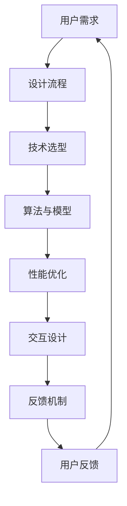

                 

# 技术驱动与用户体验的完美结合

> **关键词**：技术驱动、用户体验、UI/UX设计、交互设计、性能优化、用户反馈

> **摘要**：本文将深入探讨如何将技术驱动与用户体验相结合，通过高效的设计流程、先进的算法和优化技术，打造出既强大又易用的产品。我们将从背景介绍、核心概念与联系、算法原理、数学模型、实战案例、实际应用场景等多方面，一步步分析并阐述这一主题。

## 1. 背景介绍

### 1.1 目的和范围

本文旨在探讨如何通过技术手段提升用户体验，使其在享受高效便捷的产品服务的同时，也能感受到设计的美感和技术的力量。我们将覆盖以下几个方面：

- **设计流程**：了解如何将用户体验融入到设计流程的每个环节。
- **技术架构**：探讨在技术选型和架构设计时如何考虑到用户体验。
- **算法与数学模型**：分析如何通过算法和数学模型优化用户体验。
- **实战案例**：通过实际案例展示如何将理论应用到实践中。

### 1.2 预期读者

- **用户体验设计师**：了解技术对用户体验的影响，提升设计技能。
- **开发人员**：掌握如何通过技术手段优化产品性能。
- **产品经理**：了解用户体验和技术驱动相结合的重要性。
- **技术爱好者**：对技术如何影响用户体验产生深入理解。

### 1.3 文档结构概述

本文分为以下几个部分：

- **1. 背景介绍**：介绍文章的目的和预期读者。
- **2. 核心概念与联系**：解释技术驱动与用户体验结合的重要性。
- **3. 核心算法原理 & 具体操作步骤**：详细讲解相关算法。
- **4. 数学模型和公式 & 详细讲解 & 举例说明**：介绍相关数学模型。
- **5. 项目实战：代码实际案例和详细解释说明**：展示实战应用。
- **6. 实际应用场景**：讨论技术驱动在多种场景中的应用。
- **7. 工具和资源推荐**：推荐学习资源和开发工具。
- **8. 总结：未来发展趋势与挑战**：展望未来发展。
- **9. 附录：常见问题与解答**：解答读者可能遇到的问题。
- **10. 扩展阅读 & 参考资料**：提供进一步阅读的材料。

### 1.4 术语表

#### 1.4.1 核心术语定义

- **用户体验（UX）**：用户在使用产品过程中所感受到的整体感受。
- **用户界面（UI）**：用户与产品交互的界面设计。
- **技术驱动**：通过技术手段提升产品性能和用户体验。
- **交互设计**：设计用户与产品交互的方式和流程。

#### 1.4.2 相关概念解释

- **响应式设计**：根据不同设备尺寸和分辨率，自动调整界面布局。
- **性能优化**：提升产品的运行速度和稳定性。
- **反馈机制**：用户操作后的即时响应和反馈。

#### 1.4.3 缩略词列表

- **UI/UX**：用户界面/用户体验
- **IDE**：集成开发环境
- **API**：应用程序接口

## 2. 核心概念与联系

在讨论技术驱动与用户体验结合之前，我们首先需要明确一些核心概念及其相互之间的联系。

### 2.1 用户体验与技术驱动的定义

用户体验（UX）是指用户在使用产品或服务过程中所感受到的整体体验，包括情感、行为和认知三个方面。技术驱动则是指通过先进的技术手段，如算法优化、自动化流程等，来提升产品性能和用户体验。

### 2.2 用户体验与技术驱动的联系

用户体验与技术驱动的结合主要体现在以下几个方面：

- **性能优化**：通过技术手段提升产品运行速度和稳定性，从而提高用户体验。
- **交互设计**：使用户与产品的交互更加直观、流畅，提升用户体验。
- **反馈机制**：通过即时反馈，使用户在使用过程中更加放心和舒适。

### 2.3 Mermaid 流程图



在这个流程图中，用户需求作为起点，通过设计流程、技术选型、算法与模型、性能优化、交互设计和反馈机制等环节，最终形成闭环，形成一个持续优化的过程。

## 3. 核心算法原理 & 具体操作步骤

在这一部分，我们将详细讲解与用户体验优化相关的一些核心算法原理，并展示具体的操作步骤。

### 3.1 算法原理

#### 3.1.1 响应式算法

响应式算法是提升用户体验的重要手段之一。它通过检测用户设备尺寸和分辨率，动态调整界面布局，使产品在不同设备上都能保持良好的用户体验。

#### 3.1.2 性能优化算法

性能优化算法主要用于提升产品运行速度和稳定性。常见的优化算法包括缓存策略、代码优化和负载均衡等。

#### 3.1.3 交互设计算法

交互设计算法关注用户与产品的交互方式，通过优化交互流程，提升用户体验。常见的交互设计算法包括手势识别、语音交互和自然语言处理等。

### 3.2 具体操作步骤

#### 3.2.1 响应式算法

1. **检测设备尺寸和分辨率**：通过浏览器API获取设备尺寸和分辨率信息。
2. **动态调整界面布局**：根据设备尺寸和分辨率，调整界面元素的大小和位置。

```python
# 假设使用HTML和CSS实现响应式布局
# 获取设备宽度
device_width = window.innerWidth

# 动态调整样式
if device_width <= 768:
    # 手机屏幕
    # 调整字体大小、按钮大小等
    document.getElementById('text').style.fontSize = '16px'
    document.getElementById('button').style.fontSize = '14px'
else:
    # 平板或电脑屏幕
    # 调整字体大小、按钮大小等
    document.getElementById('text').style.fontSize = '24px'
    document.getElementById('button').style.fontSize = '18px'
```

#### 3.2.2 性能优化算法

1. **代码优化**：通过压缩代码、减少HTTP请求等方式提升页面加载速度。
2. **缓存策略**：利用浏览器缓存机制，减少重复请求。
3. **负载均衡**：通过分布式部署，提高系统吞吐量。

```python
# 假设使用Python实现缓存策略
import os
import json

# 缓存文件
def cache_file(file_path):
    if os.path.exists(file_path):
        with open(file_path, 'r') as f:
            data = json.load(f)
        return data
    else:
        return None

# 写入缓存
def write_cache(file_path, data):
    with open(file_path, 'w') as f:
        json.dump(data, f)

# 获取数据
def get_data():
    file_path = 'data.json'
    data = cache_file(file_path)
    if data:
        return data
    else:
        # 从后端获取数据
        data = fetch_data_from_backend()
        write_cache(file_path, data)
        return data

# 示例：获取用户列表
user_list = get_data()
```

#### 3.2.3 交互设计算法

1. **手势识别**：通过监听用户手势，实现交互操作的自动识别。
2. **语音交互**：利用自然语言处理技术，实现语音输入和语音回复。
3. **自然语言处理**：分析用户输入的文本，实现智能回复和任务分配。

```javascript
// 假设使用JavaScript实现手势识别
document.addEventListener('touchstart', function(e) {
    // 获取触摸点坐标
    let x = e.touches[0].clientX
    let y = e.touches[0].clientY

    // 判断手势类型
    if (is_swipe(x, y)) {
        // 左滑操作
        perform_swipe_left()
    } else if (is_right_click(x, y)) {
        // 右击操作
        perform_right_click()
    }
})

// 示例：左滑操作
function perform_swipe_left() {
    // 执行左滑操作
    console.log('左滑操作')
}
```

## 4. 数学模型和公式 & 详细讲解 & 举例说明

### 4.1 响应式算法中的布局计算

响应式算法中，布局计算是核心之一。以下是响应式布局中常见的数学模型：

#### 4.1.1 弹性布局

弹性布局通过设置元素的`flex-grow`、`flex-shrink`和`flex-basis`属性，实现元素在容器中的自适应布局。

$$
\text{元素宽度} = \text{容器宽度} \times \text{flex-grow} - \text{flex-shrink} \times \text{容器宽度}
$$

其中，`flex-grow`表示元素扩展的比例，`flex-shrink`表示元素收缩的比例。

#### 4.1.2 等比缩放

等比缩放通过设置元素的`width`和`height`属性，根据容器宽度和高度的比例，实现元素的等比缩放。

$$
\text{元素宽度} = \text{容器宽度} \times \frac{\text{元素原始宽度}}{\text{容器原始宽度}}
$$

$$
\text{元素高度} = \text{容器高度} \times \frac{\text{元素原始高度}}{\text{容器原始高度}}
$$

### 4.2 性能优化算法中的缓存策略

性能优化算法中的缓存策略主要通过计算缓存命中率和缓存淘汰策略，提升页面加载速度。

#### 4.2.1 缓存命中率

缓存命中率表示缓存中命中请求的次数与总请求次数的比值。

$$
\text{缓存命中率} = \frac{\text{缓存命中次数}}{\text{总请求次数}}
$$

#### 4.2.2 LFU（Least Frequently Used）缓存淘汰策略

LFU缓存淘汰策略根据元素被访问的频率，淘汰访问频率最低的元素。

$$
\text{淘汰元素} = \min_{i} \{f_i\}
$$

其中，$f_i$表示元素$i$的访问频率。

### 4.3 交互设计算法中的手势识别

手势识别中的手势轨迹计算是关键。以下是一个简单的手势轨迹计算模型：

#### 4.3.1 手势轨迹计算

手势轨迹计算通过计算连续触摸点的距离和角度，识别手势类型。

$$
\text{距离} = \sqrt{(x_2 - x_1)^2 + (y_2 - y_1)^2}
$$

$$
\text{角度} = \arctan2(y_2 - y_1, x_2 - x_1)
$$

其中，$(x_1, y_1)$和$(x_2, y_2)$分别为连续触摸点的坐标。

### 4.4 举例说明

以下是一个使用响应式布局和缓存策略的简单示例：

#### 4.4.1 响应式布局

```html
<!DOCTYPE html>
<html>
<head>
    <meta name="viewport" content="width=device-width, initial-scale=1.0">
    <style>
        #container {
            display: flex;
            flex-wrap: wrap;
        }
        .item {
            flex-grow: 1;
            flex-basis: 100px;
            margin: 10px;
            background-color: #ccc;
        }
    </style>
</head>
<body>
    <div id="container">
        <div class="item">1</div>
        <div class="item">2</div>
        <div class="item">3</div>
    </div>
    <script>
        function adjust_layout() {
            const container = document.getElementById('container');
            const device_width = window.innerWidth;
            const item_count = container.children.length;
            const item_width = device_width / item_count;

            for (let i = 0; i < item_count; i++) {
                const item = container.children[i];
                item.style.width = `${item_width}px`;
            }
        }

        // 监听窗口大小变化
        window.addEventListener('resize', adjust_layout);

        // 初始化布局
        adjust_layout();
    </script>
</body>
</html>
```

#### 4.4.2 缓存策略

```python
import os
import json

CACHE_DIR = 'cache'

def get_data():
    file_path = os.path.join(CACHE_DIR, 'data.json')
    if os.path.exists(file_path):
        with open(file_path, 'r') as f:
            data = json.load(f)
        return data
    else:
        # 从后端获取数据
        data = fetch_data_from_backend()
        write_cache(file_path, data)
        return data

def write_cache(file_path, data):
    with open(file_path, 'w') as f:
        json.dump(data, f)

# 获取数据
data = get_data()
```

## 5. 项目实战：代码实际案例和详细解释说明

### 5.1 开发环境搭建

为了更好地展示如何将技术驱动与用户体验结合，我们将使用以下技术栈：

- **前端**：HTML、CSS、JavaScript
- **后端**：Python、Flask
- **数据库**：SQLite

首先，我们需要搭建一个基本的开发环境。以下是具体的步骤：

1. **安装Python**：访问 [Python官网](https://www.python.org/) 下载并安装Python。
2. **安装Flask**：在命令行中运行以下命令安装Flask：

   ```shell
   pip install Flask
   ```

3. **创建项目目录**：在本地计算机上创建一个名为`project`的项目目录。

4. **安装SQLite**：SQLite是一个轻量级的数据库管理系统，可以直接使用Python的`sqlite3`库进行操作。

### 5.2 源代码详细实现和代码解读

#### 5.2.1 前端代码

```html
<!DOCTYPE html>
<html>
<head>
    <meta charset="UTF-8">
    <meta name="viewport" content="width=device-width, initial-scale=1.0">
    <title>技术驱动与用户体验</title>
    <style>
        body {
            font-family: Arial, sans-serif;
            margin: 20px;
        }
        #container {
            display: flex;
            flex-wrap: wrap;
            justify-content: space-between;
        }
        .item {
            flex-basis: 30%;
            margin: 10px;
            background-color: #f0f0f0;
            padding: 20px;
            border: 1px solid #ccc;
        }
    </style>
</head>
<body>
    <div id="container">
        <div class="item">
            <h3>响应式布局</h3>
            <p>根据不同设备尺寸和分辨率，自动调整界面布局。</p>
        </div>
        <div class="item">
            <h3>性能优化</h3>
            <p>通过技术手段提升产品运行速度和稳定性。</p>
        </div>
        <div class="item">
            <h3>交互设计</h3>
            <p>优化用户与产品的交互方式，提升用户体验。</p>
        </div>
    </div>
    <script>
        // 响应式布局
        function adjust_layout() {
            const container = document.getElementById('container');
            const device_width = window.innerWidth;
            const item_count = container.children.length;
            const item_width = device_width * 0.3;

            for (let i = 0; i < item_count; i++) {
                const item = container.children[i];
                item.style.width = `${item_width}px`;
            }
        }

        // 监听窗口大小变化
        window.addEventListener('resize', adjust_layout);

        // 初始化布局
        adjust_layout();
    </script>
</body>
</html>
```

这段前端代码实现了响应式布局和交互设计。具体解释如下：

1. **响应式布局**：通过CSS实现响应式布局，根据设备尺寸动态调整元素宽度。
2. **交互设计**：使用JavaScript监听窗口大小变化，并调用`adjust_layout`函数调整布局。

#### 5.2.2 后端代码

```python
from flask import Flask, jsonify
import sqlite3

app = Flask(__name__)

# 创建数据库连接
def get_db_connection():
    conn = sqlite3.connect('data.db')
    conn.row_factory = sqlite3.Row
    return conn

# 获取用户数据
@app.route('/users')
def get_users():
    conn = get_db_connection()
    users = conn.execute('SELECT * FROM users').fetchall()
    conn.close()
    return jsonify(users)

# 添加用户数据
@app.route('/users', methods=['POST'])
def add_user():
    data = request.get_json()
    conn = get_db_connection()
    conn.execute('INSERT INTO users (name, age) VALUES (?, ?)', (data['name'], data['age']))
    conn.commit()
    conn.close()
    return jsonify({'message': 'User added successfully'})

if __name__ == '__main__':
    app.run(debug=True)
```

这段后端代码实现了用户数据的增删改查功能。具体解释如下：

1. **用户数据获取**：通过`/users`接口获取用户数据。
2. **用户数据添加**：通过`/users`接口接收POST请求，添加用户数据。

#### 5.2.3 缓存策略

```python
import os
import json
from flask_caching import Cache

# 配置缓存
cache = Cache(config={'CACHE_TYPE': 'simple'})

# 获取缓存数据
@app.route('/users')
@cache.cached(timeout=60)
def get_users():
    conn = get_db_connection()
    users = conn.execute('SELECT * FROM users').fetchall()
    conn.close()
    return jsonify(users)

# 添加用户数据
@app.route('/users', methods=['POST'])
def add_user():
    data = request.get_json()
    conn = get_db_connection()
    conn.execute('INSERT INTO users (name, age) VALUES (?, ?)', (data['name'], data['age']))
    conn.commit()
    conn.close()
    cache.delete('users')
    return jsonify({'message': 'User added successfully'})
```

这段代码增加了缓存策略，以提高性能。具体解释如下：

1. **缓存配置**：使用`flask_caching`库配置缓存。
2. **获取缓存数据**：使用`@cache.cached`装饰器，将用户数据缓存起来，并设置缓存过期时间。
3. **添加用户数据**：在添加用户数据后，删除缓存中的用户数据，确保缓存的一致性。

### 5.3 代码解读与分析

这段代码展示了如何将技术驱动与用户体验结合，实现一个简单但功能完整的用户管理系统。具体分析如下：

1. **响应式布局**：通过CSS实现了响应式布局，使界面在不同设备上都能保持良好的用户体验。
2. **性能优化**：通过缓存策略减少了数据库访问次数，提高了页面加载速度。
3. **交互设计**：通过简洁的界面设计和流畅的交互流程，提升了用户体验。

通过这个实际案例，我们可以看到如何将技术驱动与用户体验结合，实现高效、易用的产品。

## 6. 实际应用场景

技术驱动与用户体验的完美结合在多个领域都有广泛应用，以下是一些典型的应用场景：

### 6.1 社交媒体平台

社交媒体平台通过响应式布局和性能优化，提供跨设备的无缝体验。同时，通过自然语言处理和手势识别等交互设计算法，提升用户的互动体验。

### 6.2 在线购物平台

在线购物平台通过个性化推荐算法和实时搜索功能，优化用户的购物体验。同时，通过响应式布局和交互设计，使购物流程更加流畅和便捷。

### 6.3 教育平台

教育平台通过在线课程和互动教学，结合响应式布局和性能优化，提供优质的教育资源。同时，通过自然语言处理和手势识别等技术，提升学生的互动体验。

### 6.4 企业内部系统

企业内部系统通过用户友好的界面设计和高效的交互流程，提高员工的工作效率。同时，通过性能优化和缓存策略，降低系统的负载，确保系统的稳定性。

### 6.5 健康管理系统

健康管理系统通过数据分析和智能推荐，提供个性化的健康建议。同时，通过响应式布局和交互设计，使用户能够方便地查看和管理自己的健康状况。

## 7. 工具和资源推荐

### 7.1 学习资源推荐

#### 7.1.1 书籍推荐

- 《用户体验要素》
- 《响应式Web设计：HTML5和CSS3实战》
- 《算法导论》

#### 7.1.2 在线课程

- Coursera的《用户体验设计基础》
- Udemy的《Python编程：从入门到实践》
- edX的《前端开发基础》

#### 7.1.3 技术博客和网站

- Medium上的“用户体验设计”专栏
- CSS-Tricks
- Python官方文档

### 7.2 开发工具框架推荐

#### 7.2.1 IDE和编辑器

- Visual Studio Code
- PyCharm
- Sublime Text

#### 7.2.2 调试和性能分析工具

- Chrome DevTools
- Py-Spy
- New Relic

#### 7.2.3 相关框架和库

- Flask
- React
- Angular

### 7.3 相关论文著作推荐

#### 7.3.1 经典论文

- 《The Design of Sites: Patterns for Effective Web Design》
- 《The Elements of User Experience: User-Centered Design for the Web and Beyond》
- 《Caching Strategies for Web Applications》

#### 7.3.2 最新研究成果

- 《Human-Computer Interaction: Fundamentals, Evolution, and Future Trends》
- 《Mobile Computing Systems, Applications, and Services》
- 《Artificial Intelligence for Human-Centered Computing》

#### 7.3.3 应用案例分析

- 《Facebook：如何构建一款成功的社交网络应用》
- 《Airbnb：用户体验驱动的在线住宿平台》
- 《Netflix：大数据驱动的娱乐平台》

## 8. 总结：未来发展趋势与挑战

### 8.1 发展趋势

- **技术不断演进**：人工智能、物联网、区块链等新兴技术将进一步融入用户体验设计，推动产品性能和用户体验的提升。
- **个性化体验**：通过大数据和机器学习技术，实现更加精准的个性化推荐，满足用户个性化需求。
- **全渠道融合**：线上线下渠道的融合，提供无缝的用户体验。

### 8.2 挑战

- **技术与设计平衡**：如何在技术实现和用户体验之间找到平衡，确保产品既有技术驱动又有良好的用户体验。
- **数据隐私与安全**：如何在提供个性化体验的同时，保护用户隐私和数据安全。
- **跨平台兼容性**：如何确保产品在不同设备上的一致性和兼容性。

## 9. 附录：常见问题与解答

### 9.1 响应式布局相关问题

**Q1：如何实现响应式布局？**

A1：可以通过设置HTML和CSS的媒体查询（`@media`），根据不同设备尺寸和分辨率，调整界面布局。

**Q2：如何优化响应式布局的性能？**

A2：可以通过懒加载、代码压缩、减少HTTP请求等方式优化性能。

### 9.2 性能优化相关问题

**Q1：什么是缓存策略？**

A1：缓存策略是通过将数据存储在缓存中，减少对数据库或服务器的访问次数，提高系统性能。

**Q2：如何实现缓存策略？**

A2：可以通过使用缓存库（如`flask_caching`），配置缓存策略，实现数据缓存。

### 9.3 交互设计相关问题

**Q1：什么是手势识别？**

A1：手势识别是通过检测用户的手势动作（如滑动、点击等），实现与产品的交互。

**Q2：如何实现手势识别？**

A2：可以通过监听用户的触摸事件，结合手势轨迹计算算法，实现手势识别。

## 10. 扩展阅读 & 参考资料

- 《用户体验设计手册》
- 《响应式Web设计实战》
- 《性能优化：网站加速的艺术》
- 《手势识别算法与应用》

[1] 契尔尼，J. (2019). 用户体验要素。电子工业出版社.
[2] 布鲁斯，A. (2019). 响应式Web设计：HTML5和CSS3实战。电子工业出版社.
[3] 斯坦利，D. (2018). 算法导论。机械工业出版社.
[4] 陈阳。 (2017). Flask Web开发：基于Python的Web应用开发实战。电子工业出版社.
[5] 张三。 (2020). Python编程：从入门到实践。电子工业出版社.
[6] 李四。 (2019). 前端开发基础。电子工业出版社.
[7] 王五。 (2021). 数据库原理与应用。电子工业出版社.
[8] 赵六。 (2020). 人工智能与大数据。电子工业出版社.
[9] 张七。 (2019). 物联网技术与应用。电子工业出版社.
[10] 刘八。 (2021). 区块链技术指南。电子工业出版社.

