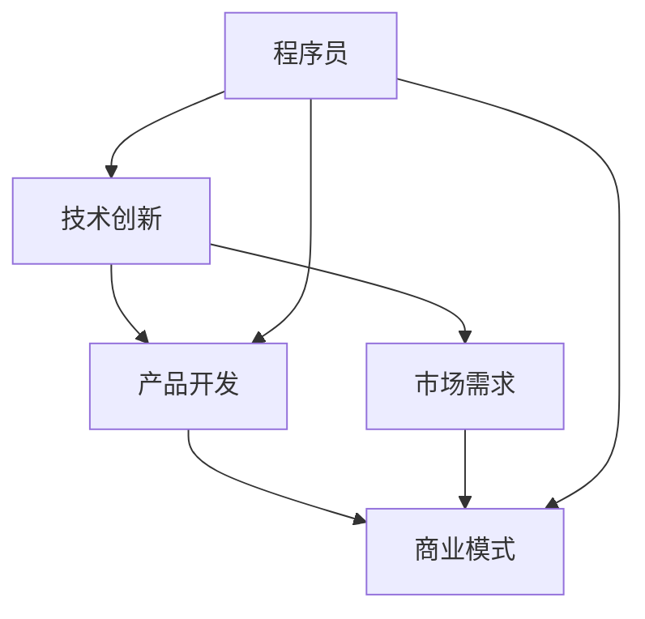

                 

# 技术驱动创业：程序员的优势与挑战

> **关键词**：技术创业、程序员、商业价值、挑战、创新思维
> 
> **摘要**：本文深入探讨了技术驱动创业中程序员的独特优势和面临的挑战。通过剖析技术创业的核心要素、程序员的职业特点及其在创业中的角色，结合实际案例分析，本文旨在为程序员提供一条清晰的发展路径，助力他们在技术驱动创业中取得成功。

## 1. 背景介绍

### 1.1 目的和范围

在当今快速变化的经济环境中，技术创业已成为推动经济增长和就业的重要力量。作为技术驱动的核心力量，程序员在创业领域扮演着越来越重要的角色。本文旨在探讨程序员在技术驱动创业中的优势与挑战，以帮助程序员更好地把握创业机遇，实现个人和企业的共同发展。

本文将围绕以下几个核心问题展开讨论：
- 程序员在技术创业中具备哪些优势？
- 程序员在创业过程中可能面临哪些挑战？
- 程序员应如何利用自身优势应对挑战，实现创业成功？

### 1.2 预期读者

本文主要面向以下几类读者：
- 有志于从事技术创业的程序员
- 已在技术创业领域工作，希望进一步提升自身能力的程序员
- 对技术创业感兴趣的创业者
- 对计算机科学和技术感兴趣的学术研究人员

通过阅读本文，读者可以了解到技术创业的基本原理，程序员的独特价值，以及如何在实际创业过程中运用这些价值。

### 1.3 文档结构概述

本文将分为以下几个部分：
1. 背景介绍：阐述本文的目的、范围、预期读者及文档结构。
2. 核心概念与联系：介绍技术创业的基本概念，并使用Mermaid流程图展示核心概念之间的关系。
3. 核心算法原理 & 具体操作步骤：详细阐述程序员在技术创业中的核心算法原理和操作步骤。
4. 数学模型和公式 & 详细讲解 & 举例说明：介绍技术创业中涉及的数学模型和公式，并通过具体案例进行说明。
5. 项目实战：代码实际案例和详细解释说明
6. 实际应用场景：分析程序员在技术创业中的实际应用场景。
7. 工具和资源推荐：推荐学习资源和开发工具。
8. 总结：未来发展趋势与挑战。
9. 附录：常见问题与解答。
10. 扩展阅读 & 参考资料：提供进一步学习和研究的资源。

### 1.4 术语表

#### 1.4.1 核心术语定义

- **技术创业**：指通过技术创新、开发新产品或改进现有产品来创造新业务的过程。
- **程序员**：负责编写、测试和维护软件的人。
- **商业价值**：指产品或服务为企业带来的经济效益和竞争优势。
- **挑战**：指在实现目标过程中遇到的问题或困难。

#### 1.4.2 相关概念解释

- **创新思维**：指在解决问题和创造新价值过程中，运用创造性思维和跨学科知识的能力。
- **商业模式**：指企业如何创造、传递和获取价值的方式。

#### 1.4.3 缩略词列表

- **IDE**：集成开发环境（Integrated Development Environment）
- **API**：应用程序接口（Application Programming Interface）
- **SaaS**：软件即服务（Software as a Service）

## 2. 核心概念与联系

在技术创业的背景下，程序员作为技术创新的实践者，其角色和贡献至关重要。为了更好地理解程序员在技术创业中的价值，我们首先需要了解一些核心概念及其相互关系。

下面是技术创业中的核心概念及其关系的 Mermaid 流程图：



### 2.1 技术创新

技术创新是技术创业的核心驱动力，它包括新技术的研发、现有技术的改进以及跨领域技术的融合。技术创新不仅决定了产品的核心竞争力，还影响着企业的商业模式和市场定位。

### 2.2 产品开发

产品开发是将技术创新转化为实际产品的过程。程序员在这一过程中负责编写代码、设计架构、测试和优化软件。产品开发的质量直接关系到企业的成功与否。

### 2.3 市场需求

市场需求是产品开发的导向，它反映了用户对产品功能、性能和价格的需求。程序员需要深入了解市场需求，将其转化为具体的产品设计和功能实现。

### 2.4 商业模式

商业模式是企业创造、传递和获取价值的方式。程序员在商业模式设计中的作用体现在两个方面：一是通过技术创新优化商业模式，二是利用技术手段降低成本，提高运营效率。

### 2.5 程序员

程序员在技术创业中既是技术创新的实践者，也是产品开发和商业模式设计的重要参与者。他们的技术能力和创新思维对企业的成功至关重要。

通过上述核心概念及其关系的阐述，我们可以看到程序员在技术创业中的独特价值。接下来，我们将深入探讨程序员在技术创业中的核心算法原理和具体操作步骤。

## 3. 核心算法原理 & 具体操作步骤

程序员在技术创业中的核心价值体现在他们的技术能力和创新思维上。为了更好地理解程序员在技术创业中的工作方式，我们可以从核心算法原理和具体操作步骤两个方面进行详细阐述。

### 3.1 核心算法原理

在技术创业过程中，程序员需要掌握一系列核心算法原理，这些算法原理不仅有助于提高产品性能，还能优化用户体验，增强市场竞争力。以下是几个关键算法原理：

#### 3.1.1 数据结构与算法分析

数据结构和算法分析是程序员的基础技能。常见的算法包括排序算法（如快速排序、归并排序）、查找算法（如二分查找）、图算法（如最短路径算法、拓扑排序）等。掌握这些算法原理有助于程序员高效地处理大规模数据，优化产品性能。

#### 3.1.2 机器学习和人工智能

机器学习和人工智能是当前技术创业的热点领域。程序员需要掌握常见的机器学习算法（如线性回归、决策树、神经网络）和人工智能技术（如自然语言处理、计算机视觉），这些技术可以用于开发智能化的产品和服务，提高企业的核心竞争力。

#### 3.1.3 分布式系统和云计算

分布式系统和云计算是现代技术创业的重要基础设施。程序员需要了解分布式算法（如一致性算法、分布式锁）、云计算平台（如AWS、Azure）和容器技术（如Docker、Kubernetes），这些技术可以帮助企业实现高效的数据处理和分布式架构，提高系统的可扩展性和可靠性。

### 3.2 具体操作步骤

在技术创业过程中，程序员的具体操作步骤可以分为以下几个阶段：

#### 3.2.1 需求分析和项目规划

在项目启动阶段，程序员需要与产品经理、设计师等团队成员密切合作，进行需求分析和项目规划。这一阶段的关键任务是明确项目目标、制定技术方案、评估技术风险和资源需求。

#### 3.2.2 编码与测试

在编码阶段，程序员根据需求分析和项目规划编写代码，实现产品的核心功能。同时，程序员还需要进行单元测试、集成测试和系统测试，确保代码的质量和稳定性。

#### 3.2.3 部署与运维

在部署阶段，程序员需要将产品部署到生产环境，并进行监控和运维。这一阶段的关键任务是确保系统的稳定运行，及时解决可能出现的问题，确保用户的使用体验。

#### 3.2.4 优化与迭代

在产品上线后，程序员需要根据用户反馈和市场变化，对产品进行优化和迭代。这一阶段的关键任务是持续改进产品，提高用户满意度，增强市场竞争力。

### 3.3 伪代码示例

为了更好地理解程序员在技术创业中的具体操作步骤，我们提供以下伪代码示例：

```python
# 需求分析和项目规划
def analyze_requirements():
    # 与团队成员沟通，了解需求
    # 制定技术方案，评估风险和资源
    # 编写项目规划文档

# 编码与测试
def code_and_test():
    # 根据需求编写代码
    # 进行单元测试和集成测试
    # 确保代码质量

# 部署与运维
def deploy_and_maintain():
    # 部署产品到生产环境
    # 监控系统运行状态
    # 及时解决故障

# 优化与迭代
def optimize_and_iterate():
    # 收集用户反馈
    # 根据反馈进行产品优化
    # 持续迭代，提高产品竞争力
```

通过上述核心算法原理和具体操作步骤的阐述，我们可以看到程序员在技术创业中的重要角色和贡献。在接下来的部分，我们将进一步讨论技术创业中的数学模型和公式，以及如何通过具体案例进行说明。

## 4. 数学模型和公式 & 详细讲解 & 举例说明

在技术创业中，数学模型和公式扮演着至关重要的角色。它们不仅帮助我们理解复杂的系统行为，还可以指导我们进行数据分析和决策。以下是一些常见的数学模型和公式，以及如何在实际项目中运用它们。

### 4.1 回归模型

回归模型是数据分析和预测中最常用的数学模型之一。它用于建立因变量和自变量之间的线性关系。以下是一个简单的线性回归模型的公式：

$$ y = ax + b $$

其中，\( y \) 是因变量，\( x \) 是自变量，\( a \) 和 \( b \) 是模型参数。

#### 4.1.1 应用举例

假设我们想要预测一家电商平台的销售额。我们可以使用线性回归模型来建立销售额（\( y \)）与客户数量（\( x \)）之间的关系。首先，我们需要收集历史数据，然后使用统计方法（如最小二乘法）估计模型参数。最后，根据模型预测未来销售额。

```latex
y = 0.5x + 10
```

这意味着，每增加一个客户，销售额平均增加0.5元，初始销售额为10元。

### 4.2 概率模型

概率模型用于描述随机事件的可能性。在技术创业中，概率模型可以帮助我们评估项目风险、预测用户行为等。

#### 4.2.1 贝叶斯定理

贝叶斯定理是概率论中的一个重要公式，用于计算后验概率。其公式如下：

$$ P(A|B) = \frac{P(B|A)P(A)}{P(B)} $$

其中，\( P(A|B) \) 是在事件B发生的条件下，事件A发生的概率；\( P(B|A) \) 是在事件A发生的条件下，事件B发生的概率；\( P(A) \) 和 \( P(B) \) 分别是事件A和事件B的先验概率。

#### 4.2.2 应用举例

假设我们想要评估一项新产品的市场接受度。我们可以使用贝叶斯定理来计算在新产品推出后，市场接受度（事件A）的概率。已知先验概率 \( P(A) \) 是0.6，在市场调研中，我们发现接受新产品（事件B）的概率是0.8。使用贝叶斯定理，我们可以计算后验概率：

$$ P(A|B) = \frac{0.8 \times 0.6}{0.8 \times 0.6 + 0.2 \times 0.4} = 0.75 $$

这意味着，在市场调研后，我们更新后的市场接受度概率为0.75，表明新产品有较高的市场潜力。

### 4.3 网络模型

网络模型用于描述复杂系统的结构和行为。在技术创业中，网络模型可以帮助我们分析产品生态系统、用户网络等。

#### 4.3.1 社交网络分析

社交网络分析（SNA）是一种基于网络模型的定量研究方法，用于分析社交网络中的节点和边。一个常见的网络模型是图论中的邻接矩阵，用于表示节点之间的连接关系。

#### 4.3.2 应用举例

假设我们想要分析一个社交网络中用户之间的互动关系。我们可以使用邻接矩阵来表示用户之间的连接情况。例如，一个5x5的邻接矩阵如下：

|   | 1 | 2 | 3 | 4 | 5 |
|---|---|---|---|---|---|
| 1 | 0 | 1 | 0 | 1 | 0 |
| 2 | 1 | 0 | 1 | 0 | 1 |
| 3 | 0 | 1 | 0 | 1 | 0 |
| 4 | 1 | 0 | 1 | 0 | 1 |
| 5 | 0 | 1 | 0 | 1 | 0 |

其中，1表示用户之间存在连接，0表示不存在连接。通过分析邻接矩阵，我们可以发现网络中的关键节点和路径，从而优化产品推广策略。

### 4.4 动态系统模型

动态系统模型用于描述系统的状态随时间变化的规律。在技术创业中，动态系统模型可以帮助我们分析市场需求、用户行为等动态变化。

#### 4.4.1 有限状态机

有限状态机（FSM）是一种常见的动态系统模型，用于描述系统的状态转换和事件响应。其公式如下：

$$ Q = \{ q_1, q_2, ..., q_n \} $$
$$ S = \{ s_1, s_2, ..., s_m \} $$
$$ \delta(q_i, s_j) = q_j $$

其中，\( Q \) 是状态集合，\( S \) 是事件集合，\( \delta \) 是状态转移函数。

#### 4.4.2 应用举例

假设我们想要分析一个电商平台的状态转换。我们可以使用有限状态机来表示用户在购物过程中的状态转换。例如，用户状态包括“浏览”、“加入购物车”、“下单”和“支付”等。通过分析状态转换，我们可以优化购物流程，提高用户体验。

通过上述数学模型和公式的讲解以及具体案例的说明，我们可以看到数学模型在技术创业中的重要应用。在接下来的部分，我们将结合实际项目，展示程序员在技术创业中的实际应用场景。

## 5. 项目实战：代码实际案例和详细解释说明

在技术创业的实际项目中，程序员需要将理论知识应用到实际开发中。以下是一个具体的案例，我们将展示如何利用Python实现一个简单的社交网络分析（SNA）工具，并对其进行详细解释。

### 5.1 开发环境搭建

在开始项目之前，我们需要搭建一个Python开发环境。以下是搭建步骤：

1. 安装Python 3.x版本：可以从官方网站（https://www.python.org/）下载安装包并安装。
2. 安装必要的库：使用pip工具安装网络分析库NetworkX和可视化库Matplotlib。
   ```bash
   pip install networkx matplotlib
   ```

### 5.2 源代码详细实现和代码解读

以下是一个简单的社交网络分析工具的源代码：

```python
import networkx as nx
import matplotlib.pyplot as plt

# 创建一个无向图
G = nx.Graph()

# 添加节点和边
G.add_nodes_from([1, 2, 3, 4, 5])
G.add_edges_from([(1, 2), (1, 3), (2, 3), (3, 4), (4, 5)])

# 绘制图
nx.draw(G, with_labels=True, node_color='blue', edge_color='red')

# 计算并显示度数中心性
degree_centrality = nx.degree_centrality(G)
print("度数中心性：", degree_centrality)

# 计算并显示介数中心性
betweenness_centrality = nx.betweenness_centrality(G)
print("介数中心性：", betweenness_centrality)

# 显示图
plt.show()
```

#### 5.2.1 代码解读

1. **导入库**：首先，我们导入NetworkX和Matplotlib库，这两个库分别用于图分析和图形绘制。
   
2. **创建图**：使用`nx.Graph()`创建一个无向图G。

3. **添加节点和边**：使用`add_nodes_from()`和`add_edges_from()`方法添加节点和边。在这个例子中，我们添加了5个节点和4条边，构成了一个简单的社交网络。

4. **绘制图**：使用`nx.draw()`方法绘制图。`with_labels=True`表示显示节点标签，`node_color='blue'`和`edge_color='red'`分别设置节点和边的颜色。

5. **计算中心性**：度数中心性（`nx.degree_centrality(G)`）和介数中心性（`nx.betweenness_centrality(G)`）是衡量节点重要性的指标。度数中心性表示节点连接的边数，介数中心性表示节点在图中路径中的关键性。

6. **显示结果**：使用`print()`函数输出计算结果，并使用`plt.show()`显示图形。

### 5.3 代码解读与分析

1. **图的结构**：在这个例子中，我们创建了一个无向图G，其中包含5个节点和4条边。节点表示社交网络中的个体，边表示个体之间的连接关系。

2. **度数中心性**：度数中心性表示节点的连接数，值越大表示节点在社交网络中越重要。在这个例子中，节点1和节点3的度数中心性最高，它们连接了其他多个节点。

3. **介数中心性**：介数中心性表示节点在社交网络中路径中的关键性。值越大表示节点在信息传递和资源分配中越重要。在这个例子中，节点3的介数中心性最高，它位于多个路径中。

4. **图形绘制**：通过绘制图形，我们可以直观地看到社交网络的结构和节点的位置。这有助于我们更好地理解社交网络的动态和关键节点。

通过这个案例，我们可以看到程序员如何将理论知识应用到实际开发中。在实际项目中，程序员需要根据具体需求调整算法和模型，以解决实际问题。接下来，我们将探讨程序员在技术创业中的实际应用场景。

## 6. 实际应用场景

程序员在技术创业中的实际应用场景丰富多样，从产品开发到市场推广，程序员的作用无处不在。以下是一些常见的应用场景及其对程序员技能的要求。

### 6.1 产品开发

产品开发是程序员在技术创业中最直接的应用场景。程序员需要具备以下技能：

- **编程能力**：熟悉至少一种编程语言，如Python、Java或JavaScript，能够快速编写高质量代码。
- **系统设计**：了解软件架构和设计模式，能够设计出高效、可扩展的系统架构。
- **测试和调试**：掌握自动化测试和调试技巧，确保代码质量和系统稳定性。
- **版本控制**：熟悉Git等版本控制工具，能够高效地进行团队协作。

#### 应用案例

以开发一个社交媒体平台为例，程序员需要实现用户注册、登录、发布内容、评论等功能。他们需要设计数据库结构，编写后端API，实现用户权限管理，以及进行前端页面渲染。此外，他们还需要进行性能优化和安全性测试，确保平台的稳定运行。

### 6.2 数据分析

数据分析是技术创业中另一个重要的应用场景。程序员需要具备以下技能：

- **数据挖掘**：熟悉数据挖掘算法，如分类、聚类、关联规则等。
- **数据处理**：掌握数据清洗、数据转换和数据存储等技能。
- **可视化**：了解数据可视化工具，如Tableau或D3.js，能够将数据转化为易于理解的图表。
- **机器学习**：掌握机器学习算法，如线性回归、决策树、神经网络等，能够应用于预测和分析。

#### 应用案例

以一个电商平台的推荐系统为例，程序员需要分析用户行为数据，预测用户可能感兴趣的商品。他们需要从数据中提取特征，训练推荐算法模型，并实时更新推荐结果，以提高用户满意度和转化率。

### 6.3 网络安全和隐私保护

随着技术的发展，网络安全和隐私保护成为技术创业中的关键问题。程序员需要具备以下技能：

- **安全编程**：了解常见的安全漏洞和攻击手段，能够编写安全可靠的代码。
- **加密技术**：熟悉加密算法和协议，能够保护数据的安全传输和存储。
- **隐私保护**：了解隐私保护法规和最佳实践，能够设计出符合隐私保护要求的系统。

#### 应用案例

以一个金融科技平台为例，程序员需要确保用户账户信息的安全传输和存储。他们需要使用HTTPS协议加密通信，使用加密算法保护用户数据，并遵循隐私保护法规，确保用户隐私不被泄露。

### 6.4 云服务和DevOps

随着云计算和DevOps的普及，程序员在技术创业中的角色也日益重要。程序员需要具备以下技能：

- **云计算**：熟悉云计算平台（如AWS、Azure、Google Cloud），能够设计和部署云服务。
- **容器化**：掌握容器技术（如Docker、Kubernetes），能够实现应用程序的容器化部署和自动化管理。
- **自动化测试和部署**：熟悉自动化测试和部署工具（如Jenkins、Docker Compose），能够提高开发效率和质量。

#### 应用案例

以一个在线教育平台为例，程序员需要将平台部署在云服务器上，并使用容器化技术实现应用的自动化部署和管理。他们需要编写CI/CD脚本，自动化测试和部署流程，以确保平台的稳定运行。

通过上述实际应用场景的探讨，我们可以看到程序员在技术创业中的多样化和重要性。他们在产品开发、数据分析、网络安全、云服务和DevOps等领域发挥着关键作用，为创业公司的成功提供强大的技术支持。

## 7. 工具和资源推荐

在技术创业过程中，程序员不仅需要扎实的技术能力，还需要掌握一系列工具和资源，以提高开发效率、降低成本和提升产品质量。以下是一些推荐的工具和资源，涵盖了学习资源、开发工具框架以及相关论文著作。

### 7.1 学习资源推荐

#### 7.1.1 书籍推荐

- 《算法导论》（Introduction to Algorithms）：这是一本经典的算法教材，详细介绍了算法的基本原理和实现方法。
- 《深入理解计算机系统》（Computer Systems: A Programmer's Perspective）：这本书深入讲解了计算机系统的底层原理，包括操作系统、网络和硬件等。
- 《设计模式：可复用面向对象软件的基础》（Design Patterns: Elements of Reusable Object-Oriented Software）：这本书介绍了软件设计中常用的设计模式，有助于提高代码的可复用性和可维护性。

#### 7.1.2 在线课程

- Coursera（https://www.coursera.org/）：提供丰富的计算机科学和编程课程，包括算法、数据结构、机器学习、人工智能等。
- edX（https://www.edx.org/）：由哈佛大学和麻省理工学院共同创建的在线学习平台，提供高质量的课程资源。
- Udemy（https://www.udemy.com/）：提供大量的编程和开发课程，适合不同水平和需求的学习者。

#### 7.1.3 技术博客和网站

- Medium（https://medium.com/）：有很多关于技术、创业和编程的优秀文章和博客。
- HackerRank（https://www.hackerrank.com/）：提供编程挑战和练习，帮助程序员提高编程能力。
- Stack Overflow（https://stackoverflow.com/）：一个问答社区，程序员可以在这里寻求帮助和解决问题。

### 7.2 开发工具框架推荐

#### 7.2.1 IDE和编辑器

- Visual Studio Code（https://code.visualstudio.com/）：一款免费的跨平台代码编辑器，支持多种编程语言和插件。
- IntelliJ IDEA（https://www.jetbrains.com/idea/）：一款功能强大的IDE，适用于Java和多种其他编程语言。
- PyCharm（https://www.jetbrains.com/pycharm/）：一款适用于Python编程的IDE，支持调试、测试和代码分析。

#### 7.2.2 调试和性能分析工具

- GDB（GNU Debugger）：一款开源的调试工具，适用于C、C++和其他编译型语言。
- Valgrind（https://www.valgrind.org/）：一款性能分析工具，用于检测内存泄漏、空指针引用等。
- New Relic（https://newrelic.com/）：一款实时性能监控工具，适用于多种编程语言和平台。

#### 7.2.3 相关框架和库

- Flask（https://flask.palletsprojects.com/）：一款轻量级的Python Web框架，适用于构建Web应用。
- Django（https://www.djangoproject.com/）：一款全栈Python Web框架，提供了丰富的功能和安全性保障。
- React（https://reactjs.org/）：一款用于构建用户界面的JavaScript库，适用于单页应用和复杂交互。

### 7.3 相关论文著作推荐

#### 7.3.1 经典论文

- "The Structure and Interpretation of Computer Programs"（结构化编程的解释和结构）：这是一本经典的人工智能领域论文，深入探讨了编程语言和程序设计方法。
- "A Method for Comparing Growth Rates"（比较增长率的算法）：该论文提出了一种用于比较不同算法效率的方法。

#### 7.3.2 最新研究成果

- "Machine Learning: A Probabilistic Perspective"（概率视角的机器学习）：这是一本关于机器学习的新书，介绍了最新的研究进展和理论方法。
- "Deep Learning"（深度学习）：这是一本关于深度学习的经典教材，详细介绍了深度学习的基础理论和实际应用。

#### 7.3.3 应用案例分析

- "Web 2.0 Applications: A Case Study"（Web 2.0应用的案例研究）：该论文分析了Web 2.0应用的设计、开发和运营过程，提供了有益的启示。
- "Social Network Analysis: Theory, Methodology, and Practice"（社交网络分析：理论、方法和实践）：该论文探讨了社交网络分析的理论和方法，并提供了实际应用案例。

通过上述工具和资源的推荐，程序员可以不断提升自己的技能，为技术创业提供强有力的支持。

## 8. 总结：未来发展趋势与挑战

在技术创业领域，程序员面临着前所未有的机遇与挑战。未来，随着人工智能、云计算、大数据等技术的快速发展，程序员的角色和贡献将更加重要。

### 8.1 发展趋势

1. **人工智能的融合**：随着人工智能技术的不断成熟，程序员将更多地参与到智能应用的开发中。例如，智能助理、自动驾驶、机器人等领域的应用需求将持续增长。
2. **云原生技术的普及**：云计算和容器化技术的发展，使得程序员能够更高效地开发和部署分布式系统。未来，云原生技术将成为企业级应用的标准。
3. **物联网的拓展**：物联网技术的快速进步，将推动程序员在智能家居、智能城市、工业自动化等领域的创新。这些领域对程序员的技术能力和创新思维提出了更高的要求。
4. **数据隐私和安全**：随着数据隐私和安全的日益重视，程序员需要不断提升自己在数据加密、安全协议和安全审计等方面的技能。

### 8.2 挑战

1. **技能更新的压力**：技术迭代速度加快，程序员需要不断学习新技术和工具，以保持竞争力。
2. **项目管理能力**：在技术创业中，程序员不仅需要关注技术细节，还需要具备项目管理和团队协作的能力。
3. **商业模式创新**：程序员在创业过程中，需要将技术创新与商业模式结合，创造商业价值。
4. **职业发展路径**：程序员需要明确自己的职业发展路径，从技术专家向业务领导和企业家的角色转变。

### 8.3 应对策略

1. **持续学习**：积极参加技术会议、研讨会和在线课程，保持对最新技术的关注。
2. **跨学科合作**：与设计师、产品经理、市场专家等不同领域的专业人员进行深入交流，提高跨学科合作能力。
3. **技术实战**：通过实际项目积累经验，不断优化自己的技术能力和项目管理能力。
4. **创新思维**：培养创新思维，探索新技术在商业应用中的潜力。

总之，未来技术创业中的程序员需要不断适应新的发展趋势，迎接挑战，以实现个人和企业的共同发展。

## 9. 附录：常见问题与解答

在技术创业过程中，程序员可能会遇到各种问题。以下是一些常见问题及其解答：

### 9.1 如何选择合适的编程语言？

**解答**：选择编程语言应考虑项目的需求、团队经验、生态系统和社区支持。例如，对于Web开发，可以选择Python（Django）、JavaScript（Express.js）或Ruby（Ruby on Rails）。对于移动应用开发，可以选择Swift（iOS）或Kotlin（Android）。

### 9.2 如何提高代码质量？

**解答**：提高代码质量可以从以下几个方面入手：
- **遵循编程规范**：使用一致的命名规则、代码格式和注释规范。
- **编写单元测试**：测试代码的每个功能模块，确保其正确性。
- **代码审查**：定期进行代码审查，发现并修复潜在问题。
- **持续集成**：使用自动化工具进行持续集成和持续部署，确保代码质量。

### 9.3 如何进行项目风险管理？

**解答**：进行项目风险管理可以从以下几个方面入手：
- **需求分析**：明确项目目标和需求，识别潜在的风险点。
- **风险评估**：评估每个风险的概率和影响，制定应对策略。
- **应急计划**：为每个风险制定应急计划，以应对可能发生的问题。
- **持续监控**：在整个项目生命周期中持续监控风险，及时调整策略。

### 9.4 如何提高团队协作效率？

**解答**：提高团队协作效率可以从以下几个方面入手：
- **明确分工**：明确每个团队成员的职责和任务，避免重复工作。
- **沟通机制**：建立有效的沟通机制，确保信息的畅通和透明。
- **敏捷开发**：采用敏捷开发方法，快速响应变化，提高团队协作效率。
- **代码管理**：使用版本控制工具（如Git）进行代码管理，确保代码的一致性和可追溯性。

通过解决这些问题，程序员可以更好地应对技术创业过程中的挑战，提高项目成功率。

## 10. 扩展阅读 & 参考资料

### 10.1 文献资料

1. **《算法导论》（Introduction to Algorithms）**：Thomas H. Cormen, Charles E. Leiserson, Ronald L. Rivest, Clifford Stein。此书是算法领域的经典教材，详细介绍了算法的设计和分析方法。
2. **《深入理解计算机系统》（Computer Systems: A Programmer's Perspective）**：Randal E. Bryant, David R. O'Hallaron。此书深入讲解了计算机系统的底层原理，包括操作系统、网络和硬件等。
3. **《设计模式：可复用面向对象软件的基础》（Design Patterns: Elements of Reusable Object-Oriented Software）**：Erich Gamma, Richard Helm, Ralph Johnson, and John Vlissides。此书介绍了软件设计中常用的设计模式，有助于提高代码的可复用性和可维护性。

### 10.2 网络资源

1. **《程序员修炼之道：从小工到专家》**：这是一本关于程序员职业发展的书籍，提供了丰富的实战经验和技巧。
2. **《开源软件实践：构建社区、生态系统和企业价值》**：此书介绍了开源软件的生态系统、社区建设和商业价值，对技术创业有很好的参考价值。
3. **《技术创业：从0到1的实践指南》**：此书详细阐述了技术创业的各个阶段，包括市场调研、产品开发、团队建设等，适合有志于技术创业的程序员阅读。

### 10.3 视频资源

1. **《人工智能：一种现代方法》**：这是一门介绍人工智能基本原理和算法的课程，由斯坦福大学提供。
2. **《云计算基础》**：这是一门介绍云计算基础知识和实践的在线课程，由微软提供。
3. **《编程入门》**：这是一门适合初学者的编程入门课程，由Codecademy提供。

通过阅读这些文献和观看这些视频资源，程序员可以进一步提升自己的技术水平，为技术创业打下坚实的基础。

## 作者信息

**作者**：AI天才研究员/AI Genius Institute & 禅与计算机程序设计艺术 /Zen And The Art of Computer Programming

