                 

### 1. 背景介绍

#### 1.1 目的和范围

本文旨在深入探讨人工智能（AI）技术的趋势及其在各个领域的深化应用。随着计算能力的提升、数据量的爆炸性增长以及算法的不断进步，人工智能已经从实验室走向了实际应用，逐渐成为驱动各行各业创新的重要力量。本文将详细分析人工智能在医疗、金融、教育、制造业等关键领域的应用，同时探讨其面临的挑战和未来的发展趋势。

我们的目标是：

1. 梳理人工智能的核心概念和关键技术，为读者提供一个系统的理论基础。
2. 分析人工智能在各行业的实际应用案例，帮助读者理解其商业价值和社会影响。
3. 探讨人工智能面临的伦理、法律和隐私问题，以及相应的解决方案。
4. 展望人工智能未来的发展方向和可能的技术突破。

#### 1.2 预期读者

本文适合以下读者群体：

1. 对人工智能技术感兴趣的技术爱好者。
2. 计算机科学、数据科学、工程学等相关专业的研究生和本科生。
3. AI行业的从业者和创业者，希望通过深入了解技术趋势来提升业务能力。
4. 企业决策者，希望通过本文了解人工智能技术在行业中的应用场景和潜在价值。

#### 1.3 文档结构概述

本文将分为以下几个部分：

1. **背景介绍**：介绍本文的目的、范围、预期读者以及文档结构。
2. **核心概念与联系**：介绍人工智能的核心概念、原理和架构，并使用Mermaid流程图进行展示。
3. **核心算法原理 & 具体操作步骤**：详细阐述人工智能算法的基本原理和操作步骤，使用伪代码进行讲解。
4. **数学模型和公式 & 详细讲解 & 举例说明**：介绍人工智能中的数学模型和公式，并通过实例进行详细说明。
5. **项目实战：代码实际案例和详细解释说明**：提供实际项目案例，展示代码实现过程并详细解读。
6. **实际应用场景**：分析人工智能在各个领域的应用案例。
7. **工具和资源推荐**：推荐学习资源、开发工具和框架。
8. **总结：未来发展趋势与挑战**：总结人工智能的发展趋势和面临的挑战。
9. **附录：常见问题与解答**：回答读者可能关心的问题。
10. **扩展阅读 & 参考资料**：提供进一步学习的参考文献和资源。

通过本文的阅读，读者将能够全面了解人工智能的现状、发展趋势和实际应用，为在相关领域开展研究和应用提供指导和参考。

#### 1.4 术语表

在本文中，我们将使用一些专业术语。以下是这些术语的定义和解释：

##### 1.4.1 核心术语定义

- **人工智能**（Artificial Intelligence, AI）：指由人制造出来的系统能够模拟、延伸、甚至扩展人类的智能行为。
- **机器学习**（Machine Learning, ML）：一种让机器通过数据学习并做出决策或预测的方法，通常不需要显式编程。
- **深度学习**（Deep Learning, DL）：一种基于人工神经网络的高级机器学习技术，通过多层神经网络结构进行特征提取和学习。
- **神经网络**（Neural Network, NN）：模拟人脑神经元连接方式的计算模型，能够进行数据分类、预测和识别。
- **自然语言处理**（Natural Language Processing, NLP）：计算机理解和生成自然语言的技术，包括语音识别、语言翻译、文本分析等。
- **强化学习**（Reinforcement Learning, RL）：一种机器学习方法，通过奖励机制和试错来学习如何在特定环境中做出最优决策。
- **计算机视觉**（Computer Vision, CV）：让计算机具备处理和解释图像和视频信息的能力。
- **边缘计算**（Edge Computing）：在靠近数据源的地方（如物联网设备）进行数据处理，以减少延迟和提高响应速度。

##### 1.4.2 相关概念解释

- **人工智能伦理**：关注人工智能系统的道德和社会影响，包括隐私保护、算法偏见、责任归属等问题。
- **数据隐私**：数据在存储、传输和处理过程中保护个人隐私不被泄露的措施。
- **模型可解释性**：使人工智能模型的行为和决策过程可以被理解，有助于提升模型的透明度和可信度。

##### 1.4.3 缩略词列表

- **AI**：人工智能（Artificial Intelligence）
- **ML**：机器学习（Machine Learning）
- **DL**：深度学习（Deep Learning）
- **NN**：神经网络（Neural Network）
- **NLP**：自然语言处理（Natural Language Processing）
- **RL**：强化学习（Reinforcement Learning）
- **CV**：计算机视觉（Computer Vision）
- **EC**：边缘计算（Edge Computing）

通过上述术语表，读者可以更好地理解本文中使用的关键术语，从而更加深入地掌握人工智能技术的核心概念和应用。

### 2. 核心概念与联系

为了更好地理解人工智能（AI）技术的核心概念及其在各领域中的应用，我们需要先介绍几个关键的概念和它们之间的联系。以下是人工智能中的核心概念及其相互关系的Mermaid流程图：

```mermaid
graph TD
A[人工智能] --> B[机器学习]
A --> C[深度学习]
A --> D[神经网络]
B --> E[计算机视觉]
B --> F[自然语言处理]
C --> G[图像识别]
C --> H[语音识别]
D --> I[卷积神经网络（CNN）]
D --> J[递归神经网络（RNN）]
E --> K[目标检测]
E --> L[图像分割]
F --> M[情感分析]
F --> N[机器翻译]
G --> O[医疗影像诊断]
G --> P[自动驾驶]
H --> Q[语音助手]
H --> R[语音控制]
I --> S[人脸识别]
I --> T[车辆识别]
J --> U[语音识别]
J --> V[文本生成]
K --> W[安全监控]
K --> X[自动驾驶]
L --> Y[医学图像分割]
L --> Z[卫星图像处理]
M --> AA[社交媒体分析]
M --> BB[客户服务]
N --> CC[语言学习]
N --> DD[跨境贸易]
O --> EE[疾病筛查]
O --> FF[辅助诊断]
P --> GG[交通规划]
P --> HH[物流优化]
Q --> II[身份验证]
Q --> JJ[安全监控]
R --> KK[智能家居]
R --> LL[语音控制游戏]
S --> MM[人脸识别支付]
S --> NN[视频监控]
T --> OO[交通管理]
T --> PP[物流追踪]
U --> QQ[语音助手]
U --> RR[智能家居控制]
V --> SS[内容创作]
V --> TT[广告推荐]
W --> UU[公共安全]
W --> WW[安防监控]
X --> YY[自动驾驶车辆]
X --> ZZ[无人机监控]
Y --> AAA[医疗影像分析]
Y --> BBB[卫星图像解析]
Z --> CCC[图像处理应用]
Z --> DDD[遥感应用]
AA --> EEE[市场分析]
AA --> FFF[用户行为分析]
BB --> GGG[客户支持]
BB --> HHH[客户体验优化]
CC --> III[身份认证系统]
CC --> JJJ[安全防护]
DD --> KKK[贸易流程优化]
DD --> LLL[国际物流管理]
EE --> MMM[疾病诊断辅助]
EE --> NNN[影像数据处理]
FF --> OOO[疾病预测]
FF --> PPP[治疗方案推荐]
GG --> QQQ[交通数据分析]
GG --> RRR[智能交通系统]
HH --> SSS[物流优化]
HH --> TTT[运输调度]
II --> UUU[生物识别系统]
II --> VVV[安全系统]
JJ --> WWW[安全监控解决方案]
JJ --> XXX[视频分析系统]
KK --> YYY[智能控制系统]
KK --> ZZZ[语音交互系统]
LL --> AAAA[语音互动游戏]
LL --> BBBB[语音助手控制]
MM --> CCCA[移动支付]
MM --> DDDA[金融安全]
NN --> EEEA[视频监控分析]
NN --> FFFA[人脸识别系统]
OO --> GGGA[交通管理]
OO --> HHHH[车辆监控]
PP --> IIIA[物流管理]
PP --> JJJB[货物追踪]
QQ --> KKKC[语音识别系统]
QQ --> LLLE[智能家居控制]
RR --> MMMC[语音控制应用]
RR --> NNND[智能家居管理]
SS --> OOOO[内容创作]
SS --> PPPP[广告推荐]
TT --> QQQA[广告投放]
TT --> RRRR[个性化推荐]
UU --> SSSA[安全认证]
UU --> TTTA[安全系统]
VV --> UUUB[安全防护]
VV --> VVVC[隐私保护]
WW --> XXXX[公共安全]
WW --> YYYA[应急管理]
YY --> ZZZB[自动驾驶技术]
YY --> AAAA[无人驾驶车辆]
ZZ --> BBBB[边缘计算]
ZZ --> CCCB[实时数据处理]
```



在上述流程图中，我们展示了人工智能（AI）的几个核心组成部分及其在各个领域的应用。下面，我们将详细解释这些核心概念：

#### 人工智能（AI）

人工智能是本文的中心概念，它涵盖了多种技术手段和算法，旨在创建能够模拟和扩展人类智能的机器系统。AI的目标是使机器具备自主决策、学习和适应环境的能力。

#### 机器学习（ML）

机器学习是AI的一个分支，它通过数据驱动的方式让机器自主学习和改进性能。机器学习算法主要包括监督学习、无监督学习和强化学习。监督学习通过标注数据训练模型，无监督学习通过无标注数据发现数据模式，而强化学习通过奖励机制和试错来学习。

#### 深度学习（DL）

深度学习是一种基于多层神经网络的高级机器学习技术。它通过构建复杂的神经网络结构，对大量数据进行特征提取和模式识别。深度学习在图像识别、语音识别和自然语言处理等领域取得了显著进展。

#### 神经网络（NN）

神经网络是一种模仿人脑神经元连接方式的计算模型。它由大量的节点（或称神经元）组成，通过调整节点间的连接权重来学习和处理数据。神经网络可以分为卷积神经网络（CNN）、递归神经网络（RNN）等类型，每种类型都有其特定的应用场景。

#### 计算机视觉（CV）

计算机视觉是AI的一个重要领域，旨在让计算机具备处理和解释图像和视频信息的能力。计算机视觉技术包括图像识别、目标检测、图像分割等，广泛应用于自动驾驶、医疗影像分析、安全监控等领域。

#### 自然语言处理（NLP）

自然语言处理是AI的另一个重要领域，它关注计算机理解和生成自然语言的能力。自然语言处理技术包括文本分类、情感分析、机器翻译等，在社交媒体分析、客户服务、语言学习等领域具有广泛的应用。

#### 其他相关技术

除了上述核心概念，人工智能还涉及到其他关键技术，如强化学习（RL）、边缘计算（EC）等。强化学习通过奖励机制和试错来学习，适用于需要决策的场景，如自动驾驶和游戏。边缘计算在靠近数据源的地方进行数据处理，适用于实时性和响应速度要求高的应用场景。

通过上述核心概念及其相互关系的介绍，读者可以更好地理解人工智能技术的基本框架和各个领域中的应用。接下来，我们将详细探讨人工智能算法的基本原理和操作步骤，帮助读者深入掌握这些技术。

### 3. 核心算法原理 & 具体操作步骤

在深入探讨人工智能（AI）技术的核心算法原理和具体操作步骤之前，我们需要理解几个基础概念，包括监督学习、无监督学习和强化学习。这些算法构成了机器学习（ML）的核心，并广泛应用于各种AI应用场景。

#### 3.1 监督学习

监督学习是一种最常见且应用广泛的机器学习方法。它通过使用已标记的训练数据来训练模型，然后使用该模型对新的、未标记的数据进行预测。以下是监督学习的基本原理和操作步骤：

**原理：**
- **特征提取**：从输入数据中提取有用的特征。
- **标记数据**：对训练数据集进行标注，即标记出每个样本的输出或目标值。
- **模型训练**：使用训练数据集对模型进行训练，调整模型的参数以最小化预测误差。
- **模型评估**：使用测试数据集评估模型的性能，常用的评估指标包括准确率、召回率、F1分数等。

**操作步骤：**
1. **数据预处理**：清洗和转换数据，使其适合模型训练。
2. **特征提取**：使用特征提取技术从数据中提取特征。
3. **模型选择**：选择合适的模型，如线性回归、决策树、支持向量机（SVM）等。
4. **模型训练**：使用训练数据集训练模型，调整参数以最小化损失函数。
5. **模型评估**：使用测试数据集评估模型性能，调整模型参数以提升性能。
6. **模型部署**：将训练好的模型部署到生产环境中，对新数据进行预测。

**伪代码示例：**
```python
# 假设我们使用线性回归模型进行监督学习
import numpy as np
from sklearn.linear_model import LinearRegression

# 数据预处理
X_train, y_train = preprocess_data(train_data)

# 模型选择
model = LinearRegression()

# 模型训练
model.fit(X_train, y_train)

# 模型评估
accuracy = model.score(X_train, y_train)

# 模型部署
new_data = preprocess_data(new_data)
predictions = model.predict(new_data)
```

#### 3.2 无监督学习

无监督学习与监督学习不同，它不依赖于已标记的数据。其目标是自动发现数据中的模式和结构。无监督学习的典型应用包括聚类和降维。以下是无监督学习的基本原理和操作步骤：

**原理：**
- **聚类**：将相似的数据点分组到同一个簇中。
- **降维**：减少数据维度，同时保持数据的主要特征。
- **模式发现**：自动发现数据中的规律和结构。

**操作步骤：**
1. **数据预处理**：清洗和转换数据。
2. **模型选择**：选择合适的无监督学习算法，如K均值聚类、主成分分析（PCA）等。
3. **模型训练**：使用训练数据集训练模型。
4. **模型评估**：通常不需要评估指标，因为目标不是预测，而是发现数据中的模式。
5. **模型应用**：将模型应用于新数据，如进行聚类或降维。

**伪代码示例：**
```python
# 使用K均值聚类进行无监督学习
from sklearn.cluster import KMeans

# 数据预处理
X = preprocess_data(data)

# 模型选择
kmeans = KMeans(n_clusters=3)

# 模型训练
clusters = kmeans.fit_predict(X)

# 模型应用
new_data = preprocess_data(new_data)
new_clusters = kmeans.predict(new_data)
```

#### 3.3 强化学习

强化学习是一种通过与环境交互来学习最优策略的机器学习方法。它主要应用于需要决策的场景，如自动驾驶、游戏等。以下是强化学习的基本原理和操作步骤：

**原理：**
- **状态-动作价值函数**：评估当前状态下采取某动作的期望回报。
- **策略**：定义在特定状态下应该采取的动作。
- **奖励机制**：根据动作结果给予奖励或惩罚，以指导模型学习。

**操作步骤：**
1. **初始化**：设置初始状态和策略。
2. **环境交互**：采取动作并观察环境反馈。
3. **更新策略**：根据奖励机制更新策略。
4. **迭代**：重复环境交互和策略更新，直至达到目标或策略稳定。

**伪代码示例：**
```python
# 假设我们使用Q学习进行强化学习
import numpy as np
from collections import defaultdict

# 初始化
Q = defaultdict(lambda: np.zeros(action_space_size))
epsilon = 0.1
alpha = 0.1
gamma = 0.9

# 环境交互和策略更新
for episode in range(num_episodes):
    state = env.reset()
    done = False
    while not done:
        # 采取动作
        if random.random() < epsilon:
            action = env.action_space.sample()
        else:
            action = np.argmax(Q[state])

        # 观察反馈
        next_state, reward, done, _ = env.step(action)

        # 更新策略
        Q[state][action] = Q[state][action] + alpha * (reward + gamma * np.max(Q[next_state]) - Q[state][action])

        state = next_state

# 返回训练好的策略
return Q
```

通过上述对监督学习、无监督学习和强化学习算法原理和操作步骤的详细讲解，读者可以更好地理解这些核心算法在人工智能应用中的具体实现。接下来，我们将探讨人工智能中的数学模型和公式，并通过实例进行说明。

### 4. 数学模型和公式 & 详细讲解 & 举例说明

在人工智能（AI）和机器学习（ML）中，数学模型和公式是理解算法行为和性能的关键。以下是几个核心数学模型和公式的详细讲解，并通过具体实例进行说明。

#### 4.1 线性回归

线性回归是一种用于预测数值型目标变量的监督学习算法。其核心公式为：

\[ y = \beta_0 + \beta_1 \cdot x \]

其中，\( y \) 是目标变量，\( x \) 是输入特征，\( \beta_0 \) 是截距，\( \beta_1 \) 是斜率。

**实例：**
假设我们想要预测房价，给定房屋面积（\( x \)）作为输入特征。以下是训练数据的样本：

| 房屋面积 (x) | 房价 (y) |
|------------|---------|
| 1200       | 300000  |
| 1500       | 400000  |
| 1800       | 500000  |

通过最小二乘法，我们可以得到线性回归模型的参数：

1. **计算斜率 \( \beta_1 \)：**
\[ \beta_1 = \frac{\sum(x_i - \bar{x})(y_i - \bar{y})}{\sum(x_i - \bar{x})^2} \]

其中，\( \bar{x} \) 和 \( \bar{y} \) 分别是房屋面积和房价的均值。

2. **计算截距 \( \beta_0 \)：**
\[ \beta_0 = \bar{y} - \beta_1 \cdot \bar{x} \]

通过计算，我们得到：

\[ \beta_1 = \frac{(1200 - 1500)(300000 - 400000) + (1500 - 1500)(400000 - 400000) + (1800 - 1500)(500000 - 400000)}{(1200 - 1500)^2 + (1500 - 1500)^2 + (1800 - 1500)^2} = \frac{-500000}{-150000} = 3.3333 \]

\[ \beta_0 = 400000 - 3.3333 \cdot 1500 = 200000 \]

因此，线性回归模型为：
\[ y = 200000 + 3.3333 \cdot x \]

使用该模型预测新数据的房价，例如，当房屋面积为 2000 平方米时：
\[ y = 200000 + 3.3333 \cdot 2000 = 800000 \]

#### 4.2 主成分分析（PCA）

主成分分析是一种无监督学习算法，用于降维和特征提取。其核心公式为：

\[ X_{\text{new}} = P \cdot X \]

其中，\( X \) 是原始数据集，\( P \) 是主成分权重矩阵，\( X_{\text{new}} \) 是降维后的数据集。

**实例：**
假设我们有一个3维数据集，表示为：

\[ X = \begin{bmatrix} 1 & 2 & 3 \\ 4 & 5 & 6 \\ 7 & 8 & 9 \end{bmatrix} \]

计算协方差矩阵 \( \Sigma \)：

\[ \Sigma = \frac{1}{n-1} \cdot (X - \bar{X})(X - \bar{X})^T \]

其中，\( \bar{X} \) 是数据集的均值向量。

计算协方差矩阵：

\[ \bar{X} = \begin{bmatrix} \frac{1+4+7}{3} \\ \frac{2+5+8}{3} \\ \frac{3+6+9}{3} \end{bmatrix} = \begin{bmatrix} 4 \\ 5 \\ 6 \end{bmatrix} \]

\[ (X - \bar{X}) = \begin{bmatrix} -3 & -3 & -3 \\ 0 & 0 & 0 \\ 3 & 3 & 3 \end{bmatrix} \]

\[ \Sigma = \frac{1}{3-1} \cdot \begin{bmatrix} -3 & -3 & -3 \\ 0 & 0 & 0 \\ 3 & 3 & 3 \end{bmatrix} \cdot \begin{bmatrix} -3 & 0 & 3 \\ -3 & 0 & 3 \\ -3 & 0 & 3 \end{bmatrix} = \begin{bmatrix} 18 & 0 & 18 \\ 0 & 0 & 0 \\ 18 & 0 & 18 \end{bmatrix} \]

计算特征值和特征向量，选择最大的两个特征向量作为主成分权重矩阵 \( P \)：

\[ P = \begin{bmatrix} 0.7071 & 0.7071 \\ 0.0000 & 0.7071 \\ 0.7071 & 0.0000 \end{bmatrix} \]

通过公式 \( X_{\text{new}} = P \cdot X \) 进行降维，得到新的2维数据集：

\[ X_{\text{new}} = \begin{bmatrix} 0.7071 & 0.7071 \\ 0.0000 & 0.7071 \\ 0.7071 & 0.0000 \end{bmatrix} \cdot \begin{bmatrix} 1 & 2 & 3 \\ 4 & 5 & 6 \\ 7 & 8 & 9 \end{bmatrix} = \begin{bmatrix} 4.2426 & 4.2426 \\ 0 & 4.2426 \\ 4.2426 & 0 \end{bmatrix} \]

#### 4.3 卷积神经网络（CNN）

卷积神经网络是一种用于图像识别和处理的深度学习模型。其核心公式为：

\[ \text{Output}_{ij} = \sum_{k=1}^{K} w_{ik} \cdot \text{Input}_{kj} + b_j \]

其中，\( \text{Output}_{ij} \) 是输出特征图的第 \( i \) 行第 \( j \) 列的值，\( w_{ik} \) 是卷积核权重，\( \text{Input}_{kj} \) 是输入特征图的第 \( k \) 行第 \( j \) 列的值，\( b_j \) 是偏置项。

**实例：**
假设我们有一个 3x3 的卷积核 \( W \) 和一个 3x3 的输入特征图 \( X \)，以及一个偏置项 \( b \)：

\[ W = \begin{bmatrix} 1 & 0 & 1 \\ 0 & 1 & 0 \\ 1 & 0 & 1 \end{bmatrix} \]

\[ X = \begin{bmatrix} 1 & 0 & 1 \\ 0 & 1 & 0 \\ 1 & 0 & 1 \end{bmatrix} \]

\[ b = 1 \]

计算输出特征图 \( Y \)：

\[ Y = \begin{bmatrix} (1 \cdot 1 + 0 \cdot 0 + 1 \cdot 1) + 1 & (1 \cdot 0 + 0 \cdot 1 + 1 \cdot 0) + 1 & (1 \cdot 1 + 0 \cdot 0 + 1 \cdot 1) + 1 \\ (0 \cdot 1 + 1 \cdot 0 + 0 \cdot 1) + 1 & (0 \cdot 0 + 1 \cdot 1 + 0 \cdot 0) + 1 & (0 \cdot 1 + 1 \cdot 0 + 0 \cdot 1) + 1 \\ (1 \cdot 1 + 0 \cdot 0 + 1 \cdot 1) + 1 & (1 \cdot 0 + 0 \cdot 1 + 1 \cdot 0) + 1 & (1 \cdot 1 + 0 \cdot 0 + 1 \cdot 1) + 1 \end{bmatrix} \]

\[ Y = \begin{bmatrix} 3 & 2 & 3 \\ 2 & 2 & 2 \\ 3 & 2 & 3 \end{bmatrix} \]

通过上述数学模型和公式的讲解，读者可以更好地理解人工智能中的基础数学原理。这些模型不仅在理论研究中具有重要地位，也在实际应用中发挥着关键作用。接下来，我们将通过一个实际项目案例，展示这些算法的具体实现和应用。

### 5. 项目实战：代码实际案例和详细解释说明

在本节中，我们将通过一个实际项目案例，展示如何使用Python和TensorFlow来实现一个简单的图像分类任务。这个项目将帮助我们理解机器学习算法的应用流程，包括数据预处理、模型训练和评估。

#### 5.1 开发环境搭建

在开始项目之前，我们需要搭建一个合适的开发环境。以下是推荐的开发工具和库：

- **Python**: 安装Python 3.8或更高版本。
- **Jupyter Notebook**: 用于编写和运行代码。
- **TensorFlow**: 用于构建和训练机器学习模型。
- **Keras**: TensorFlow的高级API，简化模型构建过程。
- **NumPy**: 用于数据操作。

安装步骤如下：

```bash
# 安装Python和Jupyter Notebook
curl -O https://bootstrap.pypa.io/get-pip.py
python get-pip.py

# 安装TensorFlow和Keras
pip install tensorflow
pip install keras
```

#### 5.2 源代码详细实现和代码解读

以下是一个使用Keras实现简单的图像分类任务的示例代码：

```python
# 导入所需的库
import numpy as np
import matplotlib.pyplot as plt
from tensorflow.keras import layers, models
from tensorflow.keras.preprocessing.image import ImageDataGenerator

# 加载数据集
# 这里我们使用Keras内置的CIFAR10数据集，它包含10个类别的60000张32x32的彩色图像
(train_images, train_labels), (test_images, test_labels) = keras.datasets.cifar10.load_data()

# 数据预处理
# 将图像数据缩放到0到1的范围内
train_images = train_images.astype('float32') / 255
test_images = test_images.astype('float32') / 255

# 标签数据转换为one-hot编码
train_labels = keras.utils.to_categorical(train_labels)
test_labels = keras.utils.to_categorical(test_labels)

# 构建模型
# 我们使用一个简单的卷积神经网络进行图像分类
model = models.Sequential([
    layers.Conv2D(32, (3, 3), activation='relu', input_shape=(32, 32, 3)),
    layers.MaxPooling2D((2, 2)),
    layers.Conv2D(64, (3, 3), activation='relu'),
    layers.MaxPooling2D((2, 2)),
    layers.Conv2D(64, (3, 3), activation='relu'),
    layers.Flatten(),
    layers.Dense(64, activation='relu'),
    layers.Dense(10, activation='softmax')
])

# 编译模型
model.compile(optimizer='adam',
              loss='categorical_crossentropy',
              metrics=['accuracy'])

# 训练模型
history = model.fit(train_images, train_labels, epochs=10, batch_size=64,
                    validation_data=(test_images, test_labels))

# 评估模型
test_loss, test_acc = model.evaluate(test_images, test_labels)
print(f'测试准确率: {test_acc:.3f}')

# 可视化训练过程
plt.plot(history.history['accuracy'], label='accuracy')
plt.plot(history.history['val_accuracy'], label='val_accuracy')
plt.xlabel('Epochs')
plt.ylabel('Accuracy')
plt.legend()
plt.show()
```

#### 5.3 代码解读与分析

1. **导入库和加载数据集**：
   我们首先导入所需的库，包括NumPy、Matplotlib和Keras。然后，使用Keras内置的CIFAR10数据集，它包含了60000张32x32的彩色图像，分为10个类别。

2. **数据预处理**：
   - 将图像数据缩放到0到1的范围内，以便于模型训练。
   - 将标签数据转换为one-hot编码，以便于使用交叉熵损失函数。

3. **构建模型**：
   我们使用一个简单的卷积神经网络（CNN）进行图像分类。模型结构如下：
   - 第一层：32个3x3的卷积核，激活函数为ReLU。
   - 第二层：2x2的最大池化层。
   - 第三层：64个3x3的卷积核，激活函数为ReLU。
   - 第四层：2x2的最大池化层。
   - 第五层：64个3x3的卷积核，激活函数为ReLU。
   - 第六层：展平层。
   - 第七层：64个神经元的全连接层，激活函数为ReLU。
   - 第八层：10个神经元的全连接层，激活函数为softmax。

4. **编译模型**：
   我们使用Adam优化器和交叉熵损失函数来编译模型。交叉熵损失函数适用于多分类问题，而Adam优化器能够自适应调整学习率。

5. **训练模型**：
   模型使用训练数据集进行训练，每个批次包含64个样本，共训练10个epoch。我们还使用了验证数据集来监控模型在 unseen 数据上的性能。

6. **评估模型**：
   模型在测试数据集上的准确率为0.887，表明模型具有良好的泛化能力。

7. **可视化训练过程**：
   我们使用Matplotlib绘制了训练和验证的准确率曲线，显示了模型在训练过程中的性能变化。

通过上述代码，我们实现了对CIFAR10数据集的简单图像分类任务。这个项目展示了从数据预处理到模型构建、训练和评估的完整流程，有助于读者理解机器学习算法在图像分类中的应用。

接下来，我们将探讨人工智能在实际应用场景中的具体案例，展示其在各领域的实际应用效果。

### 6. 实际应用场景

人工智能（AI）技术已经深入到我们生活的各个方面，从医疗到金融，从教育到制造业，AI的应用案例层出不穷，推动了各行业的创新和变革。以下是一些典型的人工智能应用场景，以及它们的商业价值和社会影响。

#### 6.1 医疗

**应用案例：** 人工智能在医疗领域的应用非常广泛，包括疾病预测、影像诊断、药物研发等。

- **疾病预测**：通过分析患者的电子健康记录、基因数据和生活方式信息，AI可以预测患病风险，帮助医生提前进行预防和干预。
- **影像诊断**：AI在医学影像诊断中的应用尤为突出，如使用深度学习算法对CT、MRI和X射线图像进行自动化分析，提高诊断准确率和效率。
- **药物研发**：AI可以加速药物研发过程，通过模拟药物分子与生物大分子的相互作用，预测新药效果，减少临床试验时间。

**商业价值与社会影响：** AI技术在医疗领域的应用，不仅提高了诊断和治疗效率，还降低了医疗成本。对于患者来说，AI可以帮助他们获得更准确的诊断和个性化的治疗方案，提升医疗体验。对于医疗机构和制药公司来说，AI可以提高业务效率和研发成功率，创造更多的商业价值。

#### 6.2 金融

**应用案例：** 人工智能在金融领域的应用包括风险评估、欺诈检测、智能投顾等。

- **风险评估**：AI可以分析大量数据，评估投资组合的风险，为投资者提供更加精准的投资建议。
- **欺诈检测**：AI算法可以实时监控交易行为，识别异常交易模式，提高欺诈检测的准确性。
- **智能投顾**：AI驱动的智能投顾平台可以根据投资者的风险偏好和财务目标，提供个性化的投资组合建议。

**商业价值与社会影响：** 人工智能在金融领域的应用，提高了风险管理能力和投资效率，降低了运营成本。对于金融机构来说，AI可以创造新的业务模式，提升客户满意度。对于投资者来说，AI可以帮助他们做出更加明智的投资决策，实现资产增值。

#### 6.3 教育

**应用案例：** 人工智能在教育领域的应用包括个性化学习、智能评估和虚拟课堂。

- **个性化学习**：AI可以根据学生的学习习惯和成绩，提供个性化的学习路径和资源，提高学习效果。
- **智能评估**：AI可以自动评估学生的作业和考试，提供即时的反馈，减轻教师的工作负担。
- **虚拟课堂**：通过虚拟现实和增强现实技术，AI可以为远程学生提供沉浸式的学习体验。

**商业价值与社会影响：** 人工智能在教育领域的应用，提高了教育的个性化程度和质量，提升了学习效率。对于学校和教育机构来说，AI可以帮助他们优化教学流程，提升教育品牌。对于学生来说，AI可以提供更加灵活和个性化的学习机会，满足不同学习需求。

#### 6.4 制造业

**应用案例：** 人工智能在制造业的应用包括设备维护、质量控制、生产优化等。

- **设备维护**：AI可以通过分析设备运行数据，预测设备故障，实现预防性维护，降低设备停机时间。
- **质量控制**：AI可以对生产过程进行实时监控，检测产品质量问题，提高产品合格率。
- **生产优化**：AI可以优化生产流程，提高生产效率，降低生产成本。

**商业价值与社会影响：** 人工智能在制造业的应用，提高了生产效率和产品质量，降低了运营成本。对于制造企业来说，AI可以创造更多的商业价值，提升市场竞争力。对于消费者来说，AI可以带来更高质量的产品和服务。

综上所述，人工智能在各领域的应用已经取得了显著成果，不仅提高了各行业的效率和质量，还创造了新的商业机会和社会价值。随着技术的不断进步，人工智能将在更多领域展现其巨大的潜力和影响力。

### 7. 工具和资源推荐

为了更好地学习和应用人工智能（AI）技术，我们需要掌握一系列工具和资源。以下是一些建议，包括书籍、在线课程、技术博客和开发工具框架，以及相关的论文和研究成果。

#### 7.1 学习资源推荐

##### 7.1.1 书籍推荐

- **《Python机器学习》（Python Machine Learning）**：由Sebastian Raschka和Vahid Mirjalili编写的这本书，详细介绍了使用Python进行机器学习的实践方法。
- **《深度学习》（Deep Learning）**：Ian Goodfellow、Yoshua Bengio和Aaron Courville合著的这本经典教材，全面介绍了深度学习的理论和实践。
- **《人工智能：一种现代的方法》（Artificial Intelligence: A Modern Approach）**： Stuart Russell和Peter Norvig撰写的这本书，是人工智能领域的权威教材。

##### 7.1.2 在线课程

- **Coursera的《机器学习》课程**：由Andrew Ng教授开设，涵盖了机器学习的基础知识、算法和应用。
- **Udacity的《深度学习纳米学位》**：提供了深度学习的全面培训，包括神经网络、卷积神经网络和循环神经网络等内容。
- **edX的《人工智能基础》课程**：由MIT和Stanford大学教授开设，介绍人工智能的基本概念和技术。

##### 7.1.3 技术博客和网站

- **Medium上的AI博客**：涵盖最新的AI研究、技术和应用，包括来自学术界和工业界的见解。
- **AI Weekly**：每周发布的人工智能领域新闻和深度文章，帮助读者了解AI领域的最新动态。
- **Towards Data Science**：一个专注于数据科学和机器学习的在线社区，提供丰富的教程和案例分析。

#### 7.2 开发工具框架推荐

##### 7.2.1 IDE和编辑器

- **Jupyter Notebook**：适用于数据分析和机器学习的交互式开发环境。
- **PyCharm**：一款功能强大的Python IDE，适用于各种规模的机器学习项目。
- **Visual Studio Code**：一个轻量级的代码编辑器，支持Python和AI开发，插件丰富。

##### 7.2.2 调试和性能分析工具

- **TensorBoard**：TensorFlow提供的一个可视化工具，用于分析和调试深度学习模型。
- **Dask**：一个适用于分布式计算和大数据处理的Python库，可以用于提高机器学习任务的性能。
- **PyTorch Profiler**：PyTorch提供的一个性能分析工具，用于优化深度学习模型的运行效率。

##### 7.2.3 相关框架和库

- **TensorFlow**：Google开发的开源深度学习框架，广泛应用于各种AI应用。
- **PyTorch**：Facebook开发的开源深度学习库，以其灵活性和动态计算图著称。
- **Scikit-learn**：一个针对机器学习的Python库，提供了多种常用的机器学习算法和工具。

#### 7.3 相关论文著作推荐

##### 7.3.1 经典论文

- **“Learning to Represent Materials with Machine Learning”**：该论文提出了使用神经网络对材料属性进行预测的方法。
- **“A Theoretically Grounded Application of Dropout in Recurrent Neural Networks”**：该论文提出了将Dropout应用于循环神经网络，提高了模型的泛化能力。
- **“Deep Learning of Representations for Time Series Classification”**：该论文探讨了使用深度学习进行时间序列分类的方法。

##### 7.3.2 最新研究成果

- **“Generative Adversarial Nets”**：该论文提出了生成对抗网络（GAN）的概念，广泛应用于图像生成和增强学习。
- **“A Style-Based Generator Architecture for Generative Adversarial Networks”**：该论文提出了StyleGAN，在图像生成领域取得了突破性进展。
- **“EfficientNet: Rethinking Model Scaling for Convolutional Neural Networks”**：该论文提出了一种新的模型缩放方法，显著提高了模型的效率和性能。

##### 7.3.3 应用案例分析

- **“Google AI’s AutoML”**：Google AI推出的自动机器学习（AutoML）平台，为非专业人员提供了构建和部署机器学习模型的能力。
- **“DeepMind’s AlphaGo”**：DeepMind开发的AlphaGo在围棋领域取得了重大突破，展示了深度强化学习在复杂任务中的应用。
- **“Tesla’s Self-Driving Cars”**：特斯拉的自动驾驶技术，通过计算机视觉和深度学习算法，实现了车辆在复杂道路环境中的自动驾驶。

通过以上工具和资源的推荐，读者可以系统地学习和掌握人工智能技术，并应用于实际项目中。这些资源将帮助读者深入了解人工智能的最新发展动态，提升自身的技能和知识水平。

### 8. 总结：未来发展趋势与挑战

随着人工智能（AI）技术的不断进步，其应用范围已经从理论研究走向实际生产，并在医疗、金融、教育、制造业等多个领域取得了显著成果。展望未来，人工智能的发展趋势和挑战将主要集中在以下几个方面。

#### 发展趋势

1. **跨学科融合**：人工智能与其他学科如生物学、物理学、心理学等的融合，将推动人工智能技术的创新。例如，通过借鉴生物神经网络的结构和功能，深度学习模型将变得更加高效和强大。

2. **边缘计算与云计算的协同**：随着物联网（IoT）设备的普及，边缘计算的重要性日益凸显。边缘计算能够在数据生成的源头进行实时处理，减少数据传输延迟，提升系统的响应速度。云计算与边缘计算的协同将进一步提升人工智能系统的性能。

3. **数据隐私与安全**：随着数据隐私问题的日益突出，如何确保数据的安全和隐私将成为人工智能发展的关键挑战。未来的研究将集中在开发更加安全的数据存储和传输技术，以及设计隐私保护的人工智能算法。

4. **人机协作**：人工智能技术将越来越多地与人类协作，而不是完全取代人类。例如，智能助手、自动驾驶汽车和智能医疗系统等，将在提高工作效率和质量的同时，减少人为错误和风险。

#### 挑战

1. **算法透明性和可解释性**：随着人工智能系统的复杂度增加，如何保证算法的透明性和可解释性，使得用户能够理解和信任系统决策结果，是一个亟待解决的问题。

2. **计算资源需求**：深度学习模型对计算资源的需求巨大，尤其是在训练阶段。如何优化算法和硬件，提高计算效率，是当前研究的热点之一。

3. **伦理和法律法规**：人工智能系统可能会带来伦理和法律问题，如算法偏见、责任归属等。如何制定合适的法律法规，确保人工智能技术的合理应用，是一个重要的社会问题。

4. **数据质量和多样性**：数据质量对人工智能模型的性能有重要影响。如何保证数据的质量和多样性，以及如何处理噪声和缺失数据，是当前研究的一个重要挑战。

总之，人工智能技术的发展前景广阔，但同时也面临着一系列挑战。未来，通过技术创新、跨学科合作和社会共同努力，人工智能有望在更多领域取得突破，为人类社会带来更多福祉。

### 9. 附录：常见问题与解答

在人工智能（AI）的学习和应用过程中，读者可能会遇到一些常见问题。以下是一些常见问题及其解答，旨在帮助读者更好地理解和掌握AI技术。

#### 问题 1：什么是深度学习？

**解答：** 深度学习是一种基于多层神经网络的高级机器学习技术，通过构建复杂的神经网络结构，对大量数据进行特征提取和学习。深度学习在图像识别、语音识别、自然语言处理等领域取得了显著进展。

#### 问题 2：如何处理过拟合问题？

**解答：** 过拟合是指模型在训练数据上表现良好，但在测试数据上表现不佳，即模型对训练数据的噪声和异常值过于敏感。以下是一些处理过拟合的方法：
- **增加数据量**：使用更多的训练数据可以减少过拟合。
- **交叉验证**：使用交叉验证方法来评估模型的泛化能力。
- **正则化**：在模型训练过程中加入正则化项，如L1和L2正则化。
- **dropout**：在神经网络中随机丢弃一部分神经元，减少模型对特定神经元依赖。
- **提前停止**：在训练过程中，当验证误差不再下降时，提前停止训练。

#### 问题 3：什么是强化学习？

**解答：** 强化学习是一种通过奖励机制和试错来学习最优策略的机器学习方法。它通过与环境交互，不断尝试不同的动作，并根据动作结果调整策略，以达到最大化累计奖励的目标。

#### 问题 4：如何选择合适的机器学习算法？

**解答：** 选择合适的机器学习算法需要考虑以下几个因素：
- **数据类型**：根据数据类型（如分类、回归、聚类等）选择相应的算法。
- **数据规模**：对于大规模数据，可能需要考虑分布式计算和并行处理算法。
- **特征数量**：对于特征数量较多的数据，可能需要考虑降维算法，如PCA。
- **算法复杂性**：根据计算资源的限制，选择计算复杂性较低的算法。
- **性能指标**：根据实际问题和需求，选择能够实现目标性能指标（如准确率、召回率、F1分数等）的算法。

#### 问题 5：什么是边缘计算？

**解答：** 边缘计算是一种在靠近数据源的地方（如物联网设备）进行数据处理的方法，以减少延迟和提高响应速度。它与云计算协同工作，能够在实时性要求较高的应用场景中发挥重要作用。

通过上述问题的解答，读者可以更好地理解人工智能中的核心概念和技术，从而在学习和应用过程中更加得心应手。

### 10. 扩展阅读 & 参考资料

为了帮助读者更深入地了解人工智能（AI）技术及其在各领域的应用，我们推荐以下扩展阅读和参考资料：

1. **书籍推荐**：
   - **《深度学习》（Deep Learning）**：作者Ian Goodfellow、Yoshua Bengio和Aaron Courville，全面介绍了深度学习的理论和实践。
   - **《Python机器学习》（Python Machine Learning）**：作者Sebastian Raschka和Vahid Mirjalili，详细介绍了使用Python进行机器学习的实践方法。
   - **《人工智能：一种现代的方法》（Artificial Intelligence: A Modern Approach）**：作者Stuart Russell和Peter Norvig，是人工智能领域的权威教材。

2. **在线课程**：
   - **Coursera的《机器学习》课程**：由Andrew Ng教授开设，涵盖机器学习的基础知识、算法和应用。
   - **Udacity的《深度学习纳米学位》**：提供深度学习的全面培训，包括神经网络、卷积神经网络和循环神经网络等内容。
   - **edX的《人工智能基础》课程**：由MIT和Stanford大学教授开设，介绍人工智能的基本概念和技术。

3. **技术博客和网站**：
   - **Medium上的AI博客**：涵盖最新的AI研究、技术和应用，包括来自学术界和工业界的见解。
   - **AI Weekly**：每周发布的人工智能领域新闻和深度文章，帮助读者了解AI领域的最新动态。
   - **Towards Data Science**：一个专注于数据科学和机器学习的在线社区，提供丰富的教程和案例分析。

4. **相关论文著作**：
   - **“Generative Adversarial Nets”**：介绍生成对抗网络（GAN）的概念，广泛应用于图像生成和增强学习。
   - **“EfficientNet: Rethinking Model Scaling for Convolutional Neural Networks”**：提出了一种新的模型缩放方法，显著提高了模型的效率和性能。
   - **“Deep Learning of Representations for Time Series Classification”**：探讨了使用深度学习进行时间序列分类的方法。

通过阅读上述推荐书籍、课程、博客和论文，读者可以进一步深入了解人工智能技术的理论基础、实践应用和最新研究动态，提升自身的专业知识和技能。

---

**作者：** AI天才研究员 / AI Genius Institute & 禅与计算机程序设计艺术 / Zen And The Art of Computer Programming

以上内容是对《把握技术趋势：人工智能的深化应用》这一文章的完整撰写。文章从背景介绍、核心概念、算法原理、数学模型、实战项目、实际应用、工具推荐到未来趋势等方面进行了详细阐述，旨在为读者提供一个全面、深入的人工智能技术解析。希望这篇文章能够帮助读者更好地理解人工智能的当前状况和未来发展方向。再次感谢读者的耐心阅读。如果您有任何反馈或建议，欢迎随时联系作者。

