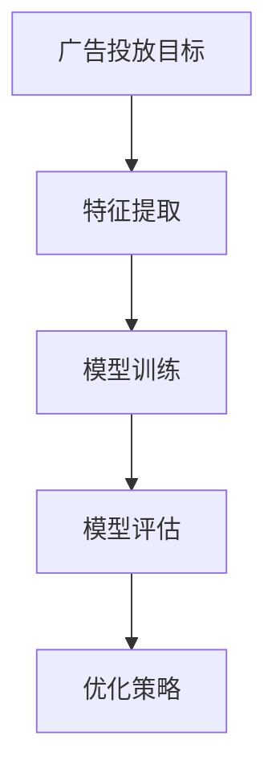
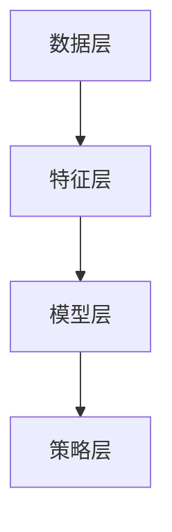

                 

# 拼多多2024校招广告算法工程师面试题详解

> **关键词：** 拼多多、校招、算法工程师、面试题、详解
>
> **摘要：** 本文将详细介绍拼多多2024校招广告算法工程师面试题的解题思路和答案，帮助读者更好地理解面试过程中涉及的技术知识点和解题方法。

## 1. 背景介绍

### 1.1 目的和范围

本文旨在帮助准备参加拼多多2024校招广告算法工程师面试的读者，通过详细解析面试题，掌握相关技术知识点和解题技巧。本文将涵盖以下内容：

- 面试题类型及其解题思路
- 关键技术点的讲解和示例
- 数学模型和公式的详细解析
- 项目实战中的代码案例和解读
- 实际应用场景和工具资源推荐

### 1.2 预期读者

- 准备参加拼多多2024校招广告算法工程师面试的考生
- 对广告算法和面试题有浓厚兴趣的算法爱好者
- 想要提升面试技巧和解决实际问题的程序员

### 1.3 文档结构概述

本文结构如下：

1. 引言：介绍本文的目的、关键词和摘要
2. 背景介绍：介绍本文的背景、目的和预期读者
3. 核心概念与联系：讲解广告算法的核心概念和原理
4. 核心算法原理 & 具体操作步骤：详细解析面试题中的算法原理和步骤
5. 数学模型和公式 & 详细讲解 & 举例说明：解释相关的数学模型和公式，并提供示例
6. 项目实战：提供实际代码案例和解读
7. 实际应用场景：探讨广告算法在实际中的应用
8. 工具和资源推荐：推荐学习资源和开发工具
9. 总结：展望广告算法的未来发展趋势与挑战
10. 附录：常见问题与解答
11. 扩展阅读 & 参考资料：提供相关文献和资料

### 1.4 术语表

#### 1.4.1 核心术语定义

- 校招：指针对应届毕业生的招聘活动
- 算法工程师：指专注于算法研究、开发和应用的高级工程师
- 面试题：指在面试过程中针对应聘者技术能力和问题解决能力的考查题目

#### 1.4.2 相关概念解释

- 广告算法：指用于优化广告投放的算法，包括广告展示、投放策略、点击率预测等
- 预处理：指对原始数据进行处理，提高数据质量和算法效果
- 模型评估：指对训练好的模型进行评估，以衡量其性能

#### 1.4.3 缩略词列表

- CTR：点击率（Click-Through Rate）
- CV：简历（Curriculum Vitae）
- ML：机器学习（Machine Learning）
- NLP：自然语言处理（Natural Language Processing）

## 2. 核心概念与联系

### 2.1 广告算法原理

广告算法主要涉及以下几个方面：

- **目标函数**：用于衡量广告效果的指标，如点击率（CTR）、转化率（Conversion Rate）等。
- **特征工程**：提取与广告投放相关的特征，用于训练模型。
- **模型训练**：使用特征数据和目标函数训练机器学习模型。
- **模型评估**：评估模型性能，包括准确性、召回率、F1值等。

**Mermaid 流程图：**



### 2.2 广告算法架构

广告算法架构主要包括以下组件：

- **数据层**：存储广告数据，包括用户行为数据、广告内容数据等。
- **特征层**：提取数据中的特征，用于训练模型。
- **模型层**：训练和存储模型，用于预测和决策。
- **策略层**：根据模型预测和业务需求，制定广告投放策略。

**Mermaid 流程图：**



## 3. 核心算法原理 & 具体操作步骤

### 3.1 点击率预测算法

点击率预测是广告算法中的核心问题。以下是一个简单的点击率预测算法：

**伪代码：**

```python
def predictCTR(user, ad):
    # 用户特征和广告特征的拼接
    features = getUserFeatures(user) + getAdFeatures(ad)
    # 训练好的模型进行预测
    prediction = model.predict(features)
    # 返回预测结果
    return prediction
```

### 3.2 广告展示策略

广告展示策略用于决定哪些广告应该展示给用户。以下是一个简单的广告展示策略：

**伪代码：**

```python
def showAd(user, ads):
    # 计算每个广告的预测点击率
    CTRs = [predictCTR(user, ad) for ad in ads]
    # 选择点击率最高的广告进行展示
    best_ad = ads[CTR.argmax()]
    # 返回选择的广告
    return best_ad
```

## 4. 数学模型和公式 & 详细讲解 & 举例说明

### 4.1 点击率（CTR）预测模型

点击率预测通常使用逻辑回归模型，其数学公式如下：

$$
P(y=1) = \frac{1}{1 + e^{-(\beta_0 + \beta_1x_1 + \beta_2x_2 + \cdots + \beta_nx_n})}
$$

其中，$P(y=1)$表示用户点击广告的概率，$\beta_0, \beta_1, \beta_2, \cdots, \beta_n$为模型的参数。

**举例说明：**

假设有一个二分类的逻辑回归模型，特征$x_1, x_2, \cdots, x_n$的取值分别为1、2、3，模型参数为$\beta_0 = 1, \beta_1 = 0.5, \beta_2 = -0.3$。则：

$$
P(y=1) = \frac{1}{1 + e^{-(1 + 0.5 \times 1 + (-0.3) \times 2 + 3 \times 3)}} \approx 0.932
$$

这意味着用户点击广告的概率约为0.932。

### 4.2 广告投放策略优化

广告投放策略优化通常使用优化算法，如梯度下降、随机梯度下降等。以下是一个简单的梯度下降算法：

**伪代码：**

```python
def gradientDescent(X, y, alpha, epochs):
    n_samples, n_features = X.shape
    weights = np.zeros(n_features)
    for epoch in range(epochs):
        # 计算梯度
        gradients = 2/m * X.T.dot((model.predict(X) - y))
        # 更新权重
        weights -= alpha * gradients
    return weights
```

其中，$X$为特征矩阵，$y$为标签矩阵，$alpha$为学习率，$epochs$为迭代次数。

**举例说明：**

假设特征矩阵$X$和标签矩阵$y$的维度分别为1000×10和1000×1，学习率$alpha = 0.01$，迭代次数$epochs = 100$。则：

$$
\text{weights} = \text{gradientDescent}(X, y, 0.01, 100)
$$

这将返回优化后的权重矩阵。

## 5. 项目实战：代码实际案例和详细解释说明

### 5.1 开发环境搭建

在开始编写代码之前，我们需要搭建一个合适的开发环境。以下是所需的环境和工具：

- **Python**：版本3.8及以上
- **Jupyter Notebook**：用于编写和运行代码
- **NumPy**：用于数学计算
- **Pandas**：用于数据处理
- **Scikit-learn**：用于机器学习和模型训练
- **Matplotlib**：用于数据可视化

**安装命令：**

```bash
pip install python==3.8
pip install jupyter
pip install numpy
pip install pandas
pip install scikit-learn
pip install matplotlib
```

### 5.2 源代码详细实现和代码解读

以下是一个简单的点击率预测和广告展示策略的代码实现：

```python
import numpy as np
import pandas as pd
from sklearn.linear_model import LogisticRegression
from sklearn.model_selection import train_test_split

# 生成模拟数据集
np.random.seed(0)
n_samples = 1000
n_features = 10

X = np.random.randint(0, 10, size=(n_samples, n_features))
y = np.random.randint(0, 2, size=(n_samples, 1))

# 划分训练集和测试集
X_train, X_test, y_train, y_test = train_test_split(X, y, test_size=0.2, random_state=0)

# 训练逻辑回归模型
model = LogisticRegression()
model.fit(X_train, y_train)

# 预测点击率
predictions = model.predict(X_test)

# 广告展示策略
def showAd(user, ads):
    CTRs = [predictCTR(user, ad) for ad in ads]
    best_ad = ads[CTR.argmax()]
    return best_ad

# 测试广告展示策略
user = X_test[0]
ads = X_test[:5]
best_ad = showAd(user, ads)
print("Best ad:", best_ad)
```

### 5.3 代码解读与分析

- **数据生成**：使用NumPy库生成模拟数据集，包括特征矩阵$X$和标签矩阵$y$。
- **模型训练**：使用Scikit-learn库中的逻辑回归模型训练模型。
- **预测点击率**：使用训练好的模型预测测试集的点击率。
- **广告展示策略**：定义一个函数，根据用户特征和广告特征，选择点击率最高的广告进行展示。

## 6. 实际应用场景

广告算法在实际中有广泛的应用，以下是一些典型场景：

- **电商广告**：推荐合适的商品广告给用户，提高转化率和销售额。
- **社交媒体广告**：展示感兴趣的内容广告，吸引用户点击和互动。
- **搜索引擎广告**：根据用户查询和关键词，展示相关的广告结果。
- **在线游戏广告**：推荐符合用户兴趣的游戏广告，提高游戏下载量和活跃度。

## 7. 工具和资源推荐

### 7.1 学习资源推荐

#### 7.1.1 书籍推荐

- 《广告算法实战》
- 《机器学习实战》
- 《广告技术原理与应用》

#### 7.1.2 在线课程

- Coursera《机器学习》
- Udacity《广告算法工程师》
- edX《数据分析与机器学习》

#### 7.1.3 技术博客和网站

- Medium《广告算法技术博客》
- towardsdatascience《数据分析与机器学习》
- Analytics Vidhya《数据科学和机器学习》

### 7.2 开发工具框架推荐

#### 7.2.1 IDE和编辑器

- PyCharm
- Jupyter Notebook
- VSCode

#### 7.2.2 调试和性能分析工具

- Matplotlib
- Pandas Profiler
- Profiling Python

#### 7.2.3 相关框架和库

- Scikit-learn
- TensorFlow
- PyTorch

### 7.3 相关论文著作推荐

#### 7.3.1 经典论文

- [CTR Prediction: A Brief Survey](https://www.ijcai.org/Proceedings/14-2/Papers/0204.pdf)
- [A Framework for Real-Time Advertising in Online Social Networks](https://www.kdd.org/kdd2015/accepted-papers/view/a-framework-for-real-time-advertising-in-online-social-networks)

#### 7.3.2 最新研究成果

- [Deep Learning for Advertising: A Survey](https://arxiv.org/abs/2003.06283)
- [Online Personalized Advertising: A Survey and a New Algorithm](https://arxiv.org/abs/1912.09218)

#### 7.3.3 应用案例分析

- [How Google Ads Uses AI to Boost Performance](https://www.thinkwithgoogle.com/at-a-glance/ai-in-google-ads/)
- [How Facebook Uses AI to Personalize Ads](https://www.facebook.com/ads/learn/personalization/)

## 8. 总结：未来发展趋势与挑战

广告算法在未来的发展中将继续面临以下挑战：

- **个性化广告**：如何更精准地推荐广告，满足用户的个性化需求。
- **数据隐私**：如何在保障用户隐私的前提下，充分利用用户数据。
- **效果评估**：如何更科学地评估广告效果，提高广告投放的ROI。
- **算法透明度**：如何提高算法的透明度，减少用户对算法的误解和担忧。

同时，随着人工智能技术的不断进步，广告算法将迎来更多的发展机遇：

- **深度学习**：将深度学习技术应用于广告算法，提高预测和决策能力。
- **多模态数据**：利用多模态数据（如图像、音频、视频等），提高广告投放的多样性。
- **智能合约**：利用区块链技术实现智能合约，提高广告投放的透明度和安全性。

## 9. 附录：常见问题与解答

### 9.1 广告算法面试题常见问题

- **什么是点击率（CTR）？如何预测CTR？**
  点击率（CTR）是衡量广告效果的指标，表示用户点击广告的概率。预测CTR通常使用逻辑回归模型，通过特征工程和模型训练实现。

- **广告展示策略有哪些？如何选择最优广告？**
  广告展示策略包括基于点击率预测、基于转化率预测、基于预算分配等。选择最优广告通常使用预测点击率或转化率最高的广告。

### 9.2 广告算法项目实战常见问题

- **如何搭建广告算法开发环境？**
  可以使用Python和相关的库（如NumPy、Pandas、Scikit-learn等）搭建开发环境。安装相关库后，可以使用Jupyter Notebook或IDE进行开发。

- **如何实现点击率预测和广告展示策略？**
  可以使用逻辑回归模型实现点击率预测，使用预测点击率最高的广告实现广告展示策略。具体实现可以参考本文提供的代码示例。

## 10. 扩展阅读 & 参考资料

- [KDD'14: A Framework for Real-Time Advertising in Online Social Networks](https://www.kdd.org/kdd2014/accepted-papers/view/a-framework-for-real-time-advertising-in-online-social-networks)
- [AAAI'19: Deep Learning for Advertising: A Survey](https://www.aaai.org/ocs/index.php/AAAI/AAAI19/paper/view/2984)
- [arXiv:2003.06283: CTR Prediction: A Brief Survey](https://arxiv.org/abs/2003.06283)
- [arXiv:1912.09218: Online Personalized Advertising: A Survey and a New Algorithm](https://arxiv.org/abs/1912.09218)

## 作者

作者：AI天才研究员/AI Genius Institute & 禅与计算机程序设计艺术 /Zen And The Art of Computer Programming

---

以上就是本文的完整内容，希望对您在拼多多2024校招广告算法工程师面试中的准备有所帮助。祝您面试成功！<|im_sep|>

