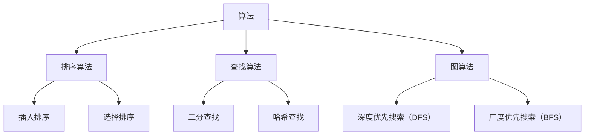

                 

# 2024拼多多多多买菜社招面试真题汇总及其解答

> **关键词**：拼多多、多多买菜、面试真题、算法、数据结构、系统设计、编程实践、技术栈

> **摘要**：本文将汇总2024年拼多多多多买菜社招的面试真题，针对每一个真题提供详细的解答思路和步骤。本文适合准备拼多多多多买菜社招面试的应聘者，以及希望提升技术能力的开发者。通过本文，您将了解到面试中常见的问题类型及其解决方法，为您的面试准备提供有力支持。

## 1. 背景介绍

### 1.1 目的和范围

本文的目的是为准备拼多多多多买菜社招面试的开发者提供一份全面的面试真题解答指南。我们将会涵盖以下几个方面：

1. **算法和数据结构**：包括常见的算法问题和数据结构问题，如排序算法、查找算法、图算法等。
2. **系统设计**：涉及系统架构、性能优化、负载均衡等系统设计相关的问题。
3. **编程实践**：包括编程风格、代码质量、算法复杂度分析等。
4. **技术栈**：涉及前端、后端、数据库、分布式系统等技术的面试题。

### 1.2 预期读者

本文适合以下几类读者：

1. **准备拼多多多多买菜社招面试的开发者**：通过本文，您可以了解面试中常见的问题类型及其解决方法。
2. **希望提升技术能力的开发者**：本文中的解答思路和步骤可以帮助您巩固和扩展技术知识。
3. **技术面试辅导人员**：本文可以作为面试辅导资料，帮助辅导人员更有效地指导应聘者。

### 1.3 文档结构概述

本文的结构如下：

1. **第1章：背景介绍**：介绍本文的目的、预期读者以及文档结构。
2. **第2章：核心概念与联系**：介绍算法和数据结构等核心概念，并提供流程图。
3. **第3章：核心算法原理 & 具体操作步骤**：详细讲解核心算法原理，并提供伪代码。
4. **第4章：数学模型和公式 & 详细讲解 & 举例说明**：介绍数学模型和公式，并提供示例。
5. **第5章：项目实战：代码实际案例和详细解释说明**：提供实际代码案例，并进行详细解读。
6. **第6章：实际应用场景**：介绍算法和技术的实际应用场景。
7. **第7章：工具和资源推荐**：推荐学习资源、开发工具和论文著作。
8. **第8章：总结：未来发展趋势与挑战**：总结本文内容，展望未来。
9. **第9章：附录：常见问题与解答**：解答常见问题。
10. **第10章：扩展阅读 & 参考资料**：提供扩展阅读资源。

### 1.4 术语表

#### 1.4.1 核心术语定义

- **算法**：解决特定问题的步骤和规则。
- **数据结构**：存储和组织数据的方式。
- **系统设计**：设计和实现系统的过程。
- **编程实践**：编写代码的规范和技巧。
- **技术栈**：开发者所需掌握的技术领域。

#### 1.4.2 相关概念解释

- **排序算法**：对数据进行排序的方法。
- **查找算法**：在数据中查找特定元素的方法。
- **图算法**：处理图中节点和边的方法。

#### 1.4.3 缩略词列表

- **DFS**：深度优先搜索（Depth-First Search）
- **BFS**：广度优先搜索（Breadth-First Search）
- **OOP**：面向对象编程（Object-Oriented Programming）
- **API**：应用程序编程接口（Application Programming Interface）
- **DBMS**：数据库管理系统（Database Management System）

## 2. 核心概念与联系

在面试中，理解算法和数据结构等核心概念是非常重要的。以下是一个简单的Mermaid流程图，展示了算法和数据结构之间的联系。



## 3. 核心算法原理 & 具体操作步骤

### 3.1 排序算法

排序算法是面试中的常见题目，以下是一个简单的冒泡排序算法的伪代码。

```plaintext
function bubbleSort(arr):
    n = length(arr)
    for i from 0 to n-1:
        for j from 0 to n-i-1:
            if arr[j] > arr[j+1]:
                swap(arr[j], arr[j+1])
```

### 3.2 查找算法

查找算法也很常见，以下是一个简单的二分查找算法的伪代码。

```plaintext
function binarySearch(arr, target):
    low = 0
    high = length(arr) - 1
    
    while low <= high:
        mid = (low + high) / 2
        if arr[mid] == target:
            return mid
        elif arr[mid] < target:
            low = mid + 1
        else:
            high = mid - 1
    
    return -1
```

### 3.3 图算法

图算法在面试中也是一个热门话题。以下是一个简单的深度优先搜索（DFS）算法的伪代码。

```plaintext
function DFS(graph, vertex):
    mark vertex as visited
    for each unvisited neighbor of vertex:
        DFS(graph, neighbor)
```

## 4. 数学模型和公式 & 详细讲解 & 举例说明

在面试中，理解数学模型和公式也是非常重要的。以下是一个简单的牛顿法求解方程的示例。

### 4.1 牛顿法求解方程

牛顿法是一种迭代算法，用于求解非线性方程。以下是其公式：

$$
x_{n+1} = x_n - \frac{f(x_n)}{f'(x_n)}
$$

其中，$x_n$是当前近似解，$f(x)$是目标函数，$f'(x)$是目标函数的导数。

### 4.2 举例说明

假设我们想要求解方程$f(x) = x^2 - 2 = 0$。

- 初始近似解：$x_0 = 1$
- 目标函数：$f(x) = x^2 - 2$
- 目标函数的导数：$f'(x) = 2x$

代入牛顿法公式，我们得到：

$$
x_1 = x_0 - \frac{f(x_0)}{f'(x_0)} = 1 - \frac{1^2 - 2}{2 \cdot 1} = 1 - \frac{-1}{2} = 1 + 0.5 = 1.5
$$

通过迭代，我们可以逐步逼近方程的解。

## 5. 项目实战：代码实际案例和详细解释说明

### 5.1 开发环境搭建

在开始项目实战之前，我们需要搭建一个合适的开发环境。以下是一个简单的步骤：

1. 安装Python 3.x版本。
2. 安装一个IDE，如PyCharm或VSCode。
3. 安装必要的依赖库，如Numpy、Pandas等。

### 5.2 源代码详细实现和代码解读

以下是实现一个简单的冒泡排序的Python代码示例。

```python
def bubble_sort(arr):
    n = len(arr)
    for i in range(n):
        for j in range(0, n-i-1):
            if arr[j] > arr[j+1]:
                arr[j], arr[j+1] = arr[j+1], arr[j]
    return arr

# 示例数据
arr = [64, 34, 25, 12, 22, 11, 90]

# 执行排序
sorted_arr = bubble_sort(arr)

# 打印结果
print("排序后的数组：", sorted_arr)
```

代码解读：

1. **定义函数**：`bubble_sort`函数接受一个数组`arr`作为输入。
2. **外层循环**：从最后一个元素开始，遍历到第二个元素。
3. **内层循环**：遍历当前未排序部分，如果当前元素大于下一个元素，则交换它们。
4. **返回结果**：返回排序后的数组。

### 5.3 代码解读与分析

这个简单的冒泡排序代码展示了排序算法的基本原理。分析如下：

- **时间复杂度**：$O(n^2)$，因为我们需要进行两层循环。
- **空间复杂度**：$O(1)$，因为我们只使用了常数级别的额外空间。
- **稳定性**：冒泡排序是稳定的排序算法，即相等的元素在排序后不会改变相对位置。

## 6. 实际应用场景

排序算法和查找算法在实际应用场景中非常常见，以下是一些示例：

- **数据统计和报告**：对大量数据进行分析和报告时，排序算法可以帮助我们快速查找和比较数据。
- **搜索引擎**：搜索引擎需要快速查找和排序关键词和网页，以便为用户提供准确的信息。
- **游戏开发**：游戏中的角色、道具和任务列表通常需要排序和查找，以便实现各种游戏逻辑。

## 7. 工具和资源推荐

### 7.1 学习资源推荐

#### 7.1.1 书籍推荐

- 《算法导论》（Introduction to Algorithms）
- 《编程之美》（Beauty of Programming）
- 《深度学习》（Deep Learning）

#### 7.1.2 在线课程

- Coursera的《算法基础》课程
- Udacity的《数据分析》课程
- edX的《计算机科学基础》课程

#### 7.1.3 技术博客和网站

- GitHub
- LeetCode
- HackerRank

### 7.2 开发工具框架推荐

#### 7.2.1 IDE和编辑器

- PyCharm
- VSCode
- IntelliJ IDEA

#### 7.2.2 调试和性能分析工具

- GDB
- Valgrind
- Python的pdb模块

#### 7.2.3 相关框架和库

- NumPy
- Pandas
- TensorFlow

### 7.3 相关论文著作推荐

#### 7.3.1 经典论文

- 《数据库系统概念》（Database System Concepts）
- 《计算机网络：自顶向下方法》（Computer Networking: A Top-Down Approach）

#### 7.3.2 最新研究成果

- 《深度学习： advances and challenges》（Deep Learning: Advances and Challenges）
- 《分布式系统原理与范型》（Principles of Distributed Systems）

#### 7.3.3 应用案例分析

- 《大数据：变革社会》（Big Data: A Revolution That Will Transform How We Live, Work, and Think）
- 《区块链革命：重构经济与世界》（Blockchain Revolution: How the Technology Behind Bitcoin Is Changing Money, Business, and the World）

## 8. 总结：未来发展趋势与挑战

随着技术的不断进步，算法和系统设计领域将继续发展。未来，以下趋势和挑战值得关注：

- **算法优化**：随着数据规模的增加，如何优化算法性能和资源消耗成为一个重要挑战。
- **人工智能与算法**：人工智能技术将进一步融合到算法设计中，为解决复杂问题提供新的思路。
- **分布式系统**：分布式系统的设计和管理将成为一项关键技术，以应对大规模数据处理和存储需求。
- **跨学科融合**：算法和系统设计将与其他领域（如生物学、经济学等）产生更多交叉和融合，推动技术发展。

## 9. 附录：常见问题与解答

### 9.1 如何准备面试？

**解答**：提前了解面试公司的技术需求和岗位要求，掌握相关技术知识和实践技能。同时，进行充分的模拟面试和实战练习，提升应对面试的能力。

### 9.2 如何提高编程能力？

**解答**：通过阅读技术书籍、参与开源项目、编写自己的代码等方式，不断积累编程经验和技巧。同时，参与编程竞赛和算法比赛，提升解决实际问题的能力。

### 9.3 如何进行系统设计？

**解答**：从需求分析入手，明确系统目标和技术要求。然后，进行系统架构设计，考虑系统的可扩展性、可靠性和性能。最后，进行详细的设计和实现，逐步构建系统。

## 10. 扩展阅读 & 参考资料

- 《算法导论》（Introduction to Algorithms）
- 《编程之美》（Beauty of Programming）
- 《深度学习》（Deep Learning）
- 《数据库系统概念》（Database System Concepts）
- 《计算机网络：自顶向下方法》（Computer Networking: A Top-Down Approach）
- 《大数据：变革社会》（Big Data: A Revolution That Will Transform How We Live, Work, and Think）
- 《区块链革命：重构经济与世界》（Blockchain Revolution: How the Technology Behind Bitcoin Is Changing Money, Business, and the World）

## 作者信息

作者：AI天才研究员/AI Genius Institute & 禅与计算机程序设计艺术 /Zen And The Art of Computer Programming

---

通过本文，您了解了2024年拼多多多多买菜社招面试的常见真题及其解答。希望本文对您的面试准备和技能提升有所帮助。祝您面试顺利！<|im_sep|>

