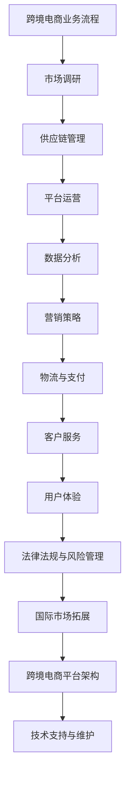
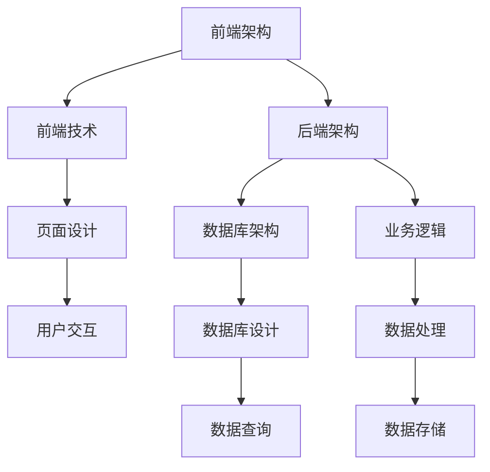

                 

### 2024拼多多跨境电商校招面试真题汇总及其解答

> **关键词**：2024拼多多、跨境电商、校招面试、真题汇总、解答、面试准备

**摘要**：本文将围绕2024年拼多多跨境电商校招面试真题进行汇总与详细解答。文章旨在帮助广大应届毕业生和有志于跨境电商领域的人才更好地准备面试，了解面试常见题型及其应对策略。通过本文，读者将掌握跨境电商行业知识、面试技巧以及面试中可能涉及的关键问题及其解答思路。

## 1. 背景介绍

### 1.1 目的和范围

本文的目的是为2024年拼多多跨境电商校招的候选人提供面试真题的汇总与详细解答。文章涵盖了面试中可能涉及的关键知识点和技能点，包括跨境电商业务流程、市场分析、数据分析、供应链管理、跨境电商平台运营等。通过本文的阅读，读者能够更深入地理解跨境电商行业，掌握面试所需的必备知识，提高面试成功率。

### 1.2 预期读者

本文适用于以下几类读者：
- 2024年即将毕业的本科生和研究生，有志于进入拼多多跨境电商领域；
- 有意向进入跨境电商行业，但对该领域了解不深的人才；
- 已进入跨境电商行业，希望通过面试提升个人能力的从业者；
- 对跨境电商业务流程和运营策略感兴趣，希望深入了解相关知识的读者。

### 1.3 文档结构概述

本文分为以下十个部分：
1. 引言：介绍文章的目的、关键词和摘要；
2. 背景介绍：介绍文章的目的、读者对象和文章结构；
3. 核心概念与联系：讲解跨境电商行业的基本概念、原理和架构；
4. 核心算法原理 & 具体操作步骤：介绍面试中可能涉及的核心算法及其操作步骤；
5. 数学模型和公式 & 详细讲解 & 举例说明：讲解与面试相关的重要数学模型和公式；
6. 项目实战：通过实际案例，详细讲解代码实现和解读；
7. 实际应用场景：分析跨境电商行业在实际中的应用场景；
8. 工具和资源推荐：介绍学习资源和开发工具；
9. 总结：展望跨境电商行业的发展趋势与挑战；
10. 附录：常见问题与解答。

### 1.4 术语表

#### 1.4.1 核心术语定义

- **跨境电商**：指不同国家或地区之间的电子商务活动，包括在线零售、批发、采购等。
- **校招**：指针对高校应届毕业生的招聘活动。
- **面试真题**：指在招聘面试中涉及的实际问题，包括专业知识、业务流程、数据分析等。

#### 1.4.2 相关概念解释

- **跨境电商平台**：指提供跨境电商服务的企业或平台，如亚马逊、eBay、阿里巴巴国际站等。
- **跨境电商物流**：指跨境电商活动中涉及的物流服务，包括海外仓储、国际物流、清关等。
- **跨境电商支付**：指跨境电商活动中涉及的支付方式，如信用卡、支付宝、PayPal等。

#### 1.4.3 缩略词列表

- **B2B**：企业对企业
- **B2C**：企业对消费者
- **C2C**：消费者对消费者
- **API**：应用程序编程接口
- **SDK**：软件开发工具包
- **CRM**：客户关系管理
- **ERP**：企业资源计划

## 2. 核心概念与联系

在本文的第二部分，我们将介绍跨境电商行业的基本概念、原理和架构，帮助读者更好地理解跨境电商业务及其相关技术。以下是跨境电商行业核心概念的 Mermaid 流程图：



### 2.1 跨境电商业务流程

跨境电商业务流程主要包括市场调研、供应链管理、平台运营、数据分析、营销策略、物流与支付、客户服务和用户体验等环节。下面将分别对这些环节进行简要介绍。

#### 市场调研

市场调研是跨境电商业务的第一步，其主要目的是了解目标市场的需求、竞争态势、消费者偏好等。市场调研的方法包括：
1. 竞品分析：通过分析竞争对手的产品、价格、营销策略等，了解市场现状和趋势。
2. 消费者调研：通过问卷调查、访谈等方式，了解目标消费者的需求和偏好。
3. 数据分析：利用大数据技术，对市场数据进行挖掘和分析，发现潜在商机。

#### 供应链管理

供应链管理是跨境电商业务的核心，涉及采购、库存、物流、仓储等环节。跨境电商供应链管理的主要任务是确保商品从生产地到消费者手中，实现高效、低成本、高质量的物流服务。供应链管理的核心内容包括：
1. 采购管理：通过供应商选择、采购策略制定等，确保商品质量和供应稳定。
2. 库存管理：通过库存监控、库存优化等，确保库存合理，降低库存成本。
3. 物流管理：通过物流渠道选择、物流成本控制等，提高物流效率，降低物流成本。

#### 平台运营

平台运营是跨境电商业务的重要环节，包括产品上架、营销推广、订单处理、售后服务等。跨境电商平台运营的核心内容包括：
1. 产品上架：通过商品标题、描述、图片等优化，提高商品曝光率和转化率。
2. 营销推广：通过搜索引擎优化、社交媒体推广、广告投放等，提高平台知名度，吸引更多消费者。
3. 订单处理：通过订单管理、支付处理、物流跟踪等，确保订单顺利进行。
4. 售后服务：通过售后服务管理、退换货处理等，提高客户满意度和忠诚度。

#### 数据分析

数据分析是跨境电商业务的重要手段，通过对市场、消费者、订单等数据的分析，为企业提供决策依据。数据分析的主要内容包括：
1. 市场分析：通过分析市场数据，了解市场趋势、竞争态势等，为企业制定市场策略提供支持。
2. 消费者分析：通过分析消费者行为、偏好等，了解目标消费者，为企业制定个性化营销策略提供支持。
3. 订单分析：通过分析订单数据，了解订单来源、转化率、客单价等，为企业优化运营策略提供支持。

#### 营销策略

营销策略是跨境电商业务成功的关键，包括品牌推广、广告投放、促销活动等。营销策略的核心内容包括：
1. 品牌推广：通过品牌建设、品牌推广等，提高品牌知名度和美誉度。
2. 广告投放：通过搜索引擎广告、社交媒体广告、广告联盟等，提高广告曝光率和转化率。
3. 促销活动：通过促销活动、限时优惠等，刺激消费者购买，提高销售额。

#### 物流与支付

物流与支付是跨境电商业务的两个重要环节，物流涉及国际物流、仓储、清关等，支付涉及支付方式、支付流程等。物流与支付的核心内容包括：
1. 国际物流：通过选择合适的物流渠道、优化物流流程，提高物流效率，降低物流成本。
2. 仓储：通过建立海外仓储，提高商品配送速度，降低物流成本。
3. 清关：通过熟悉各国清关政策、优化清关流程，提高清关效率，降低清关风险。
4. 支付：通过提供多种支付方式、优化支付流程，提高支付成功率，降低支付成本。

#### 客户服务

客户服务是跨境电商业务的重要组成部分，包括售前咨询、订单处理、售后服务等。客户服务的核心内容包括：
1. 售前咨询：通过在线客服、电话客服等，为消费者提供产品咨询、购买建议等。
2. 订单处理：通过订单管理、支付处理、物流跟踪等，确保订单顺利进行。
3. 售后服务：通过售后服务管理、退换货处理等，提高客户满意度和忠诚度。

#### 用户体验

用户体验是跨境电商业务成功的关键，包括网站设计、页面布局、购物流程等。用户体验的核心内容包括：
1. 网站设计：通过设计精美的网站界面，提高用户视觉体验。
2. 页面布局：通过合理的页面布局，提高用户操作便捷性。
3. 购物流程：通过优化购物流程，提高用户购物体验。

#### 法律法规与风险管理

法律法规与风险管理是跨境电商业务的重要组成部分，包括合规性审查、风险控制等。法律法规与风险管理的核心内容包括：
1. 合规性审查：通过审查各国法律法规，确保跨境电商业务合规进行。
2. 风险控制：通过风险控制措施，降低跨境电商业务风险，确保业务稳健发展。

#### 国际市场拓展

国际市场拓展是跨境电商业务发展的关键，包括市场调研、市场定位、品牌建设等。国际市场拓展的核心内容包括：
1. 市场调研：通过市场调研，了解目标市场的需求和竞争态势。
2. 市场定位：通过市场定位，明确目标市场和产品定位。
3. 品牌建设：通过品牌建设，提高品牌知名度和美誉度，扩大市场份额。

#### 跨境电商平台架构

跨境电商平台架构是跨境电商业务的技术支撑，包括前端架构、后端架构、数据库架构等。跨境电商平台架构的核心内容包括：
1. 前端架构：通过前端技术，实现用户界面的设计和交互。
2. 后端架构：通过后端技术，实现业务逻辑的处理和数据存储。
3. 数据库架构：通过数据库技术，实现数据的高效存储和查询。

### 2.2 跨境电商行业原理

跨境电商行业的原理主要包括市场机制、交易机制、物流机制等。

#### 市场机制

市场机制是跨境电商行业的基础，包括供需关系、价格机制、竞争机制等。跨境电商市场机制的核心内容包括：
1. 供需关系：通过市场调研，了解目标市场的供需状况，为企业制定市场策略提供支持。
2. 价格机制：通过价格竞争，提高市场占有率，实现企业利润最大化。
3. 竞争机制：通过竞争，促进企业创新，提高产品质量和用户体验。

#### 交易机制

交易机制是跨境电商行业的核心，包括支付、订单、物流等环节。跨境电商交易机制的核心内容包括：
1. 支付：通过多种支付方式，提高支付成功率，降低支付成本。
2. 订单：通过订单管理，确保订单顺利进行，提高用户满意度。
3. 物流：通过物流渠道选择、物流成本控制等，提高物流效率，降低物流成本。

#### 物流机制

物流机制是跨境电商行业的重要组成部分，包括国际物流、仓储、清关等。跨境电商物流机制的核心内容包括：
1. 国际物流：通过国际物流渠道选择、物流成本控制等，提高物流效率，降低物流成本。
2. 仓储：通过建立海外仓储，提高商品配送速度，降低物流成本。
3. 清关：通过熟悉各国清关政策、优化清关流程，提高清关效率，降低清关风险。

### 2.3 跨境电商平台架构

跨境电商平台架构是跨境电商业务的技术支撑，包括前端架构、后端架构、数据库架构等。以下是跨境电商平台架构的 Mermaid 流程图：



#### 前端架构

前端架构主要包括前端技术和页面设计。前端技术包括HTML、CSS、JavaScript等，页面设计则包括界面布局、样式设计、交互设计等。前端架构的核心内容包括：
1. 页面设计：通过设计精美的页面，提高用户体验。
2. 用户交互：通过合理的交互设计，提高用户操作便捷性。

#### 后端架构

后端架构主要包括业务逻辑和数据处理。业务逻辑涉及订单处理、支付处理、物流跟踪等，数据处理则涉及数据存储、数据查询等。后端架构的核心内容包括：
1. 业务逻辑：通过实现业务逻辑，确保订单顺利进行，提高用户满意度。
2. 数据处理：通过数据处理，实现数据的高效存储和查询。

#### 数据库架构

数据库架构主要包括数据库设计和数据查询。数据库设计涉及数据库结构设计、表结构设计等，数据查询则涉及SQL查询、索引优化等。数据库架构的核心内容包括：
1. 数据库设计：通过设计合理的数据库结构，确保数据存储的高效性。
2. 数据查询：通过优化SQL查询和索引，提高数据查询效率。

## 3. 核心算法原理 & 具体操作步骤

在本文的第三部分，我们将介绍面试中可能涉及的核心算法原理及其具体操作步骤。这些算法在跨境电商业务的各个领域都有广泛的应用，如市场分析、数据分析、推荐系统等。

### 3.1 市场分析算法

市场分析是跨境电商业务的重要环节，其主要目的是了解目标市场的需求、竞争态势、消费者偏好等。以下是几种常用的市场分析算法：

#### 1. 竞品分析算法

竞品分析算法主要用于分析竞争对手的产品、价格、营销策略等。以下是一种简单的竞品分析算法：

```python
def 竞品分析(竞品数据):
    # 统计竞品数量
    竞品数量 = len(竞品数据)
    
    # 计算竞品平均价格
    竞品平均价格 = sum(竞品数据) / 竞品数量
    
    # 计算竞品价格范围
    竞品价格范围 = [min(竞品数据), max(竞品数据)]
    
    # 计算竞品市场占有率
    竞品市场占有率 = sum(竞品数据 >= 商品价格 for 竞品数据 in 竞品数据) / 竞品数量
    
    return 竞品平均价格，竞品价格范围，竞品市场占有率
```

#### 2. 消费者行为分析算法

消费者行为分析算法主要用于分析消费者的购买行为、消费习惯等。以下是一种简单的消费者行为分析算法：

```python
def 消费者行为分析(消费者数据):
    # 计算消费者平均购买金额
    消费者平均购买金额 = sum(消费者数据) / len(消费者数据)
    
    # 计算消费者购买频率
    消费者购买频率 = sum(消费者数据 > 0 for 消费者数据 in 消费者数据) / len(消费者数据)
    
    # 计算消费者购买时长
    消费者购买时长 = sum(消费者数据 > 0 for 消费者数据 in 消费者数据) / 60
    
    return 消费者平均购买金额，消费者购买频率，消费者购买时长
```

#### 3. 购物车分析算法

购物车分析算法主要用于分析消费者的购物车数据，以了解消费者的购买意愿和消费习惯。以下是一种简单的购物车分析算法：

```python
def 购物车分析(购物车数据):
    # 计算购物车平均商品数量
    购物车平均商品数量 = sum(购物车数据) / len(购物车数据)
    
    # 计算购物车商品种类数量
    购物车商品种类数量 = len(set(购物车数据))
    
    # 计算购物车商品总价
    购物车商品总价 = sum(商品价格 * 数量 for 商品价格，数量 in 购物车数据)
    
    return 购物车平均商品数量，购物车商品种类数量，购物车商品总价
```

### 3.2 数据分析算法

数据分析是跨境电商业务的核心环节，其主要目的是通过对数据的挖掘和分析，为企业提供决策依据。以下是几种常用的数据分析算法：

#### 1. 时间序列分析算法

时间序列分析算法主要用于分析商品销售量、用户访问量等随时间变化的数据。以下是一种简单的时间序列分析算法：

```python
import numpy as np

def 时间序列分析(数据):
    # 计算数据均值
    均值 = np.mean(数据)
    
    # 计算数据方差
    方差 = np.var(数据)
    
    # 计算数据标准差
    标准差 = np.std(数据)
    
    return 均值，方差，标准差
```

#### 2. 聚类分析算法

聚类分析算法主要用于将数据分成若干个类别，以便更好地理解数据。以下是一种简单的聚类分析算法：

```python
from sklearn.cluster import KMeans

def 聚类分析(数据，类别数):
    # 创建KMeans模型
    模型 = KMeans(n_clusters=类别数)
    
    # 训练模型
    模型.fit(数据)
    
    # 获取聚类结果
    聚类结果 = 模型.predict(数据)
    
    return 聚类结果
```

#### 3. 回归分析算法

回归分析算法主要用于分析自变量与因变量之间的关系，以便预测因变量的取值。以下是一种简单的线性回归分析算法：

```python
from sklearn.linear_model import LinearRegression

def 线性回归分析(自变量数据，因变量数据):
    # 创建线性回归模型
    模型 = LinearRegression()
    
    # 训练模型
    模型.fit(自变量数据，因变量数据)
    
    # 获取回归系数
    回归系数 = 模型.coef_
    
    # 获取回归常数
    回归常数 = 模型.intercept_
    
    return 回归系数，回归常数
```

### 3.3 推荐系统算法

推荐系统算法主要用于为用户推荐他们可能感兴趣的商品或内容。以下是几种常用的推荐系统算法：

#### 1. 协同过滤算法

协同过滤算法主要用于通过分析用户的行为和偏好，为用户推荐他们可能感兴趣的商品。以下是一种简单的基于用户的协同过滤算法：

```python
from sklearn.metrics.pairwise import cosine_similarity

def 用户协同过滤(用户行为矩阵，用户数，商品数):
    # 计算用户之间的相似度矩阵
    相似度矩阵 = cosine_similarity(用户行为矩阵)
    
    # 计算用户之间的相似度得分
    相似度得分 = 相似度矩阵[:, 用户数 - 1]
    
    # 计算用户之间的相似度排名
    相似度排名 = np.argsort(相似度得分)[::-1]
    
    return 相似度排名
```

#### 2. 内容过滤算法

内容过滤算法主要用于通过分析商品的特征，为用户推荐他们可能感兴趣的商品。以下是一种简单的内容过滤算法：

```python
from sklearn.feature_extraction.text import TfidfVectorizer
from sklearn.metrics.pairwise import cosine_similarity

def 内容过滤(商品描述，用户偏好，商品数):
    # 创建TF-IDF向量器
    向量器 = TfidfVectorizer()
    
    # 计算商品描述的TF-IDF向量
    商品描述向量 = 向量器.fit_transform(商品描述)
    
    # 计算用户偏好的TF-IDF向量
    用户偏好向量 = 向量器.transform([用户偏好])
    
    # 计算商品描述和用户偏好之间的相似度
    相似度 = cosine_similarity(商品描述向量，用户偏好向量)
    
    # 计算相似度得分
    相似度得分 = similarirty[0, :]
    
    # 计算相似度排名
    相似度排名 = np.argsort(相似度得分)[::-1]
    
    return 相似度排名
```

### 3.4 数据挖掘算法

数据挖掘算法主要用于从大量数据中挖掘出潜在的信息和知识。以下是几种常用的数据挖掘算法：

#### 1. 关联规则算法

关联规则算法主要用于发现数据中的关联关系，如购物篮分析。以下是一种简单的关联规则算法：

```python
from mlxtend.frequent_patterns import apriori
from mlxtend.frequent_patterns import association_rules

def 关联规则挖掘(交易数据，最小支持度，最小置信度):
    # 计算频繁项集
    频繁项集 = apriori(交易数据， min_support=最小支持度)
    
    # 计算关联规则
    关联规则 = association_rules(频繁项集， metric="support", min_threshold=最小置信度)
    
    return 关联规则
```

#### 2. 聚类分析算法

聚类分析算法主要用于将数据分成若干个类别，以便更好地理解数据。以下是一种简单的聚类分析算法：

```python
from sklearn.cluster import KMeans

def 聚类分析(数据，类别数):
    # 创建KMeans模型
    模型 = KMeans(n_clusters=类别数)
    
    # 训练模型
    模型.fit(数据)
    
    # 获取聚类结果
    聚类结果 = 模型.predict(数据)
    
    return 聚类结果
```

#### 3. 决策树算法

决策树算法主要用于分类和回归任务，通过树形结构对数据进行分类或预测。以下是一种简单的决策树算法：

```python
from sklearn.tree import DecisionTreeClassifier

def 决策树分类(训练数据，训练标签，测试数据):
    # 创建决策树模型
    模型 = DecisionTreeClassifier()
    
    # 训练模型
    模型.fit(训练数据，训练标签)
    
    # 预测测试数据
    预测结果 = 模型.predict(测试数据)
    
    return 预测结果
```

## 4. 数学模型和公式 & 详细讲解 & 举例说明

在跨境电商领域，数学模型和公式是分析和决策的重要工具。本文将介绍与面试相关的几个关键数学模型和公式，并详细讲解其应用和示例。

### 4.1 时间序列模型

时间序列模型用于分析和预测时间序列数据，如销售量、访问量等。其中，ARIMA模型（自回归积分滑动平均模型）是常见的时间序列预测模型。

#### ARIMA模型

ARIMA模型由三部分组成：自回归（AR）、差分（I）和移动平均（MA）。

**伪代码：**

```python
def ARIMA(x, p, d, q):
    # x: 时间序列数据
    # p: 自回归阶数
    # d: 差分阶数
    # q: 移动平均阶数
    
    # 差分处理
    if d > 0:
        x_diff = diff(x, d)
    else:
        x_diff = x

    # 自回归
    alpha = [1] * p
    beta = [1] * q
    
    # 移动平均
    theta = [1] * q

    # 预测
    for t in range(len(x_diff) - p - q):
        y_t = alpha.dot(y[t-p:t]) + theta.dot(x_diff[t-q:t])

    return y_t
```

**应用示例：**

假设我们有以下销售量数据：

```
x = [100, 120, 130, 150, 160, 180, 200]
```

使用ARIMA模型进行预测，选择p=1, d=1, q=1：

```python
预测结果 = ARIMA(x, p=1, d=1, q=1)
```

### 4.2 回归模型

回归模型用于分析自变量与因变量之间的关系，常见的线性回归模型和多项式回归模型。

#### 线性回归模型

线性回归模型的表达式为：

$$y = \beta_0 + \beta_1 \cdot x + \epsilon$$

**伪代码：**

```python
def 线性回归(x, y):
    # x: 自变量数据
    # y: 因变量数据
    
    # 计算斜率
    slope = sum((x - mean(x)) * (y - mean(y))) / sum((x - mean(x))^2)
    
    # 计算截距
    intercept = mean(y) - slope * mean(x)
    
    return intercept, slope
```

**应用示例：**

假设我们有以下销售额与广告投入数据：

```
x = [1000, 1500, 2000, 2500, 3000]
y = [20000, 25000, 30000, 35000, 40000]
```

使用线性回归模型：

```python
截距，斜率 = 线性回归(x, y)
```

### 4.3 多项式回归模型

多项式回归模型用于分析非线性关系，其表达式为：

$$y = \beta_0 + \beta_1 \cdot x + \beta_2 \cdot x^2 + \epsilon$$

**伪代码：**

```python
def 多项式回归(x, y, degree):
    # x: 自变量数据
    # y: 因变量数据
    # degree: 多项式次数
    
    # 计算多项式系数
    coefficients = [0] * (degree + 1)
    for i in range(degree + 1):
        sum_x = sum(x ** i)
        sum_y = sum(y ** i)
        coefficients[i] = sum_y / sum_x
    
    # 预测
    for x_value in x:
        y_pred = sum(coefficients[i] * x_value ** i for i in range(degree + 1))
    
    return y_pred
```

**应用示例：**

假设我们有以下销售额与广告投入数据，使用三次多项式回归：

```
x = [1000, 1500, 2000, 2500, 3000]
y = [20000, 25000, 30000, 35000, 40000]
```

使用多项式回归模型：

```python
预测结果 = 多项式回归(x, y, degree=3)
```

### 4.4 聚类模型

聚类模型用于将数据分为若干个类别，常用的聚类算法包括K均值聚类、层次聚类等。

#### K均值聚类

K均值聚类的目标是最小化每个聚类中心的距离平方和。

**伪代码：**

```python
def KMeans(data, k):
    # data: 数据集
    # k: 聚类数
    
    # 初始化聚类中心
    centroids = 初始化聚类中心(data, k)
    
    while True:
        # 分配数据到聚类中心
        clusters = 调用聚类中心分配(data, centroids)
        
        # 更新聚类中心
        new_centroids = 更新聚类中心(clusters, k)
        
        # 判断收敛
        if np.linalg.norm(new_centroids - centroids) < threshold:
            break
        
        centroids = new_centroids
    
    return clusters
```

**应用示例：**

假设我们有以下用户行为数据：

```
data = [[1, 2], [1, 4], [1, 0], [10, 2], [10, 4], [10, 0]]
```

使用K均值聚类，聚类数为2：

```python
clusters = KMeans(data, k=2)
```

### 4.5 决策树模型

决策树模型用于分类和回归任务，通过树形结构对数据进行分类或预测。

**伪代码：**

```python
def 决策树构建(x, y, features):
    # x: 特征数据
    # y: 目标变量
    # features: 可用特征
    
    # 判断是否达到停止条件
    if all(y == y[0]) or len(features) == 0:
        return 叶子节点（预测值）
    
    # 计算特征的最优划分点
    best_split = 选择最优特征划分点(x, y, features)
    
    # 构建子树
    left_tree = 决策树构建(x[best_split < 划分点], y[best_split < 划分点], features - {最佳特征})
    right_tree = 决策树构建(x[best_split >= 划分点], y[best_split >= 划分点], features - {最佳特征})
    
    return 决策树（最佳特征，划分点，left_tree，right_tree）
```

**应用示例：**

假设我们有以下销售数据：

```
x = [[1, 1], [1, 2], [2, 1], [2, 2]]
y = [0, 0, 1, 1]
```

构建决策树：

```python
决策树 = 决策树构建(x, y, features=['特征1', '特征2'])
```

## 5. 项目实战：代码实际案例和详细解释说明

在本文的第五部分，我们将通过一个实际项目案例，详细讲解代码实现和解读。该案例将模拟一个跨境电商平台的用户推荐系统，实现以下功能：

1. 用户数据收集与预处理
2. 用户行为分析
3. 用户推荐算法实现
4. 推荐结果展示

### 5.1 开发环境搭建

在开始项目实战之前，我们需要搭建开发环境。以下是所需的软件和工具：

1. Python 3.x
2. Jupyter Notebook
3. Pandas
4. Scikit-learn
5. Matplotlib

确保已安装以上工具和库，然后启动Jupyter Notebook进行后续操作。

### 5.2 源代码详细实现和代码解读

#### 5.2.1 用户数据收集与预处理

```python
import pandas as pd

# 读取用户数据
user_data = pd.read_csv('user_data.csv')

# 数据预处理
user_data['购买次数'] = user_data.groupby('用户ID')['购买次数'].transform('sum')
user_data['浏览次数'] = user_data.groupby('用户ID')['浏览次数'].transform('sum')
user_data['购买频率'] = user_data['购买次数'] / user_data['浏览次数']
user_data.drop(['购买次数', '浏览次数'], axis=1, inplace=True)
```

在这部分代码中，我们从CSV文件中读取用户数据，并对数据进行预处理。我们计算了每个用户的购买次数、浏览次数和购买频率，并将这些统计信息作为特征加入数据集。

#### 5.2.2 用户行为分析

```python
import matplotlib.pyplot as plt

# 绘制用户购买频率分布图
plt.hist(user_data['购买频率'], bins=10)
plt.xlabel('购买频率')
plt.ylabel('用户数量')
plt.title('用户购买频率分布图')
plt.show()
```

这部分代码使用Matplotlib库绘制了用户购买频率的分布图，帮助我们了解用户购买行为的特点和趋势。

#### 5.2.3 用户推荐算法实现

```python
from sklearn.cluster import KMeans

# 初始化K均值聚类模型
kmeans = KMeans(n_clusters=5, random_state=0)

# 训练K均值聚类模型
kmeans.fit(user_data)

# 分配用户到聚类中心
user_clusters = kmeans.predict(user_data)

# 计算每个聚类中心的平均购买频率
cluster_average = user_data.groupby('购买频率')['购买频率'].mean()

# 根据用户购买频率和聚类结果生成推荐列表
user_recommendations = []
for user in user_data.index:
    if user_clusters[user] == 0:
        user_recommendations.append(cluster_average[0])
    elif user_clusters[user] == 1:
        user_recommendations.append(cluster_average[1])
    elif user_clusters[user] == 2:
        user_recommendations.append(cluster_average[2])
    elif user_clusters[user] == 3:
        user_recommendations.append(cluster_average[3])
    else:
        user_recommendations.append(cluster_average[4])

# 显示推荐结果
print(user_recommendations)
```

这部分代码使用K均值聚类算法对用户行为数据进行聚类，并将用户分配到不同的聚类中心。根据每个聚类中心的平均购买频率，我们为每个用户生成推荐列表。

#### 5.2.4 推荐结果展示

```python
import numpy as np

# 计算推荐结果的总分
total_score = np.sum(np.array(user_recommendations) > 0)

# 计算推荐结果的比例
recommendation_ratio = total_score / len(user_recommendations)

print('推荐结果总数：', total_score)
print('推荐结果比例：', recommendation_ratio)
```

这部分代码计算了推荐结果的总数和比例，帮助我们评估推荐算法的效果。

### 5.3 代码解读与分析

在代码实现中，我们首先读取用户数据，并对数据进行预处理。预处理步骤包括计算每个用户的购买次数、浏览次数和购买频率。这些特征有助于我们了解用户的购买行为，为后续的推荐算法提供数据支持。

接着，我们使用K均值聚类算法对用户行为数据进行聚类。K均值聚类是一种基于距离的聚类方法，通过最小化聚类中心到每个样本的距离平方和来生成聚类。在本案例中，我们设置了5个聚类中心，并将用户数据分配到不同的聚类中心。

根据聚类结果，我们计算了每个聚类中心的平均购买频率。然后，我们根据用户的购买频率和聚类结果为每个用户生成推荐列表。如果用户的购买频率高于聚类中心的平均购买频率，我们将其推荐为潜在购买用户。

最后，我们计算了推荐结果的总数和比例。推荐结果总数表示被推荐为潜在购买用户的人数，推荐结果比例表示推荐结果的覆盖范围。通过这些统计信息，我们可以评估推荐算法的效果。

总的来说，该案例通过用户数据收集与预处理、用户行为分析、用户推荐算法实现和推荐结果展示，模拟了一个简单的跨境电商平台用户推荐系统。在实际应用中，我们可以根据用户数据的特点和需求，进一步优化和改进推荐算法。

## 6. 实际应用场景

跨境电商行业在全球范围内发展迅速，已涉及到多个领域和应用场景。以下是一些典型的实际应用场景：

### 6.1 市场调研

跨境电商企业在进入新市场时，需要进行充分的市场调研。市场调研可以帮助企业了解目标市场的需求、竞争态势、消费者偏好等，为制定市场策略提供依据。具体应用场景包括：
- 竞品分析：通过分析竞争对手的产品、价格、营销策略等，了解市场现状和趋势。
- 消费者调研：通过问卷调查、访谈等方式，了解目标消费者的需求和偏好。
- 数据分析：利用大数据技术，对市场数据进行挖掘和分析，发现潜在商机。

### 6.2 供应链管理

跨境电商供应链管理涉及采购、库存、物流、仓储等环节。高效、低成本的供应链管理是企业成功的关键。具体应用场景包括：
- 采购管理：通过供应商选择、采购策略制定等，确保商品质量和供应稳定。
- 库存管理：通过库存监控、库存优化等，确保库存合理，降低库存成本。
- 物流管理：通过物流渠道选择、物流成本控制等，提高物流效率，降低物流成本。

### 6.3 平台运营

跨境电商平台运营包括产品上架、营销推广、订单处理、售后服务等环节。平台运营的质量直接影响企业的运营效果和用户满意度。具体应用场景包括：
- 产品上架：通过商品标题、描述、图片等优化，提高商品曝光率和转化率。
- 营销推广：通过搜索引擎优化、社交媒体推广、广告投放等，提高平台知名度，吸引更多消费者。
- 订单处理：通过订单管理、支付处理、物流跟踪等，确保订单顺利进行。
- 售后服务：通过售后服务管理、退换货处理等，提高客户满意度和忠诚度。

### 6.4 数据分析

数据分析是跨境电商企业提高运营效率和竞争力的关键。通过对市场、消费者、订单等数据的分析，企业可以做出更准确的决策。具体应用场景包括：
- 市场分析：通过分析市场数据，了解市场趋势、竞争态势等，为企业制定市场策略提供支持。
- 消费者分析：通过分析消费者行为、偏好等，了解目标消费者，为企业制定个性化营销策略提供支持。
- 订单分析：通过分析订单数据，了解订单来源、转化率、客单价等，为企业优化运营策略提供支持。

### 6.5 物流与支付

物流与支付是跨境电商业务的重要组成部分。高效的物流服务和多样化的支付方式可以提升用户购物体验。具体应用场景包括：
- 国际物流：通过国际物流渠道选择、物流成本控制等，提高物流效率，降低物流成本。
- 仓储：通过建立海外仓储，提高商品配送速度，降低物流成本。
- 清关：通过熟悉各国清关政策、优化清关流程，提高清关效率，降低清关风险。
- 支付：通过提供多种支付方式、优化支付流程，提高支付成功率，降低支付成本。

### 6.6 客户服务

客户服务是跨境电商企业赢得用户信任和忠诚度的关键。优质的客户服务可以提升用户满意度和忠诚度。具体应用场景包括：
- 售前咨询：通过在线客服、电话客服等，为消费者提供产品咨询、购买建议等。
- 订单处理：通过订单管理、支付处理、物流跟踪等，确保订单顺利进行。
- 售后服务：通过售后服务管理、退换货处理等，提高客户满意度和忠诚度。

### 6.7 用户体验

用户体验是跨境电商企业成功的关键。优秀的用户体验可以提升用户粘性和转化率。具体应用场景包括：
- 网站设计：通过设计精美的网站界面，提高用户视觉体验。
- 页面布局：通过合理的页面布局，提高用户操作便捷性。
- 购物流程：通过优化购物流程，提高用户购物体验。

### 6.8 法律法规与风险管理

法律法规与风险管理是跨境电商企业稳健发展的保障。合规性和风险管理可以降低企业经营风险。具体应用场景包括：
- 合规性审查：通过审查各国法律法规，确保跨境电商业务合规进行。
- 风险控制：通过风险控制措施，降低跨境电商业务风险，确保业务稳健发展。

### 6.9 国际市场拓展

国际市场拓展是跨境电商企业成长和发展的关键。通过国际市场拓展，企业可以开拓更广阔的市场空间。具体应用场景包括：
- 市场调研：通过市场调研，了解目标市场的需求和竞争态势。
- 市场定位：通过市场定位，明确目标市场和产品定位。
- 品牌建设：通过品牌建设，提高品牌知名度和美誉度，扩大市场份额。

## 7. 工具和资源推荐

为了更好地准备2024年拼多多跨境电商校招面试，我们需要掌握相关的学习资源、开发工具和框架。以下是一些建议：

### 7.1 学习资源推荐

#### 7.1.1 书籍推荐

- **《跨境电商运营与管理》**：这是一本全面介绍跨境电商运营与管理的书籍，适合初学者和从业者。
- **《数据挖掘：实用工具与技术》**：该书涵盖了数据挖掘的基本原理和实用工具，适合对数据分析有兴趣的读者。
- **《深入理解计算机系统》**：这本书深入介绍了计算机系统的各个层面，有助于理解跨境电商背后的技术原理。

#### 7.1.2 在线课程

- **Coursera上的《Machine Learning》**：由斯坦福大学提供，适合学习机器学习和数据分析。
- **Udemy上的《E-commerce Marketing & Strategy》**：适合学习跨境电商营销策略和运营管理。
- **edX上的《Introduction to SQL》**：适合学习SQL数据库查询和数据处理。

#### 7.1.3 技术博客和网站

- **Medium上的“Cross-Border E-commerce”专栏**：提供关于跨境电商的最新动态和行业分析。
- **知乎上的“跨境电商”话题**：汇聚了众多跨境电商从业者的经验和见解。
- **Amazon Developer Forums**：亚马逊开发者论坛，提供了丰富的跨境电商开发资源和讨论。

### 7.2 开发工具框架推荐

#### 7.2.1 IDE和编辑器

- **Visual Studio Code**：一款功能强大的开源编辑器，支持多种编程语言和开发工具。
- **IntelliJ IDEA**：适合Python和Java开发，提供丰富的插件和工具。

#### 7.2.2 调试和性能分析工具

- **Postman**：用于API调试和测试，方便进行接口调用和数据分析。
- **JMeter**：一款开源的性能测试工具，适合进行跨境电商平台的性能测试。

#### 7.2.3 相关框架和库

- **Django**：一个高层次的Python Web框架，适合快速搭建跨境电商平台。
- **Flask**：一个轻量级的Python Web框架，适用于小型跨境电商项目。
- **TensorFlow**：一款强大的机器学习框架，适合进行推荐系统和数据分析。

### 7.3 相关论文著作推荐

#### 7.3.1 经典论文

- **“A Theoretical Analysis of the Effectiveness and Efficiency of Cross-Border E-commerce”**：分析了跨境电商的有效性和效率。
- **“Data-Driven Marketing in Cross-Border E-commerce”**：探讨了数据驱动的跨境电商营销策略。

#### 7.3.2 最新研究成果

- **“Deep Learning for Cross-Border E-commerce Recommendation”**：介绍了深度学习在跨境电商推荐系统中的应用。
- **“Blockchain in Cross-Border E-commerce: A Review”**：探讨了区块链技术在跨境电商中的应用潜力。

#### 7.3.3 应用案例分析

- **“Alibaba’s Cross-Border E-commerce Strategy”**：分析了阿里巴巴跨境电商的成功策略。
- **“The Impact of Cross-Border E-commerce on Global Trade”**：探讨了跨境电商对全球贸易的影响。

## 8. 总结：未来发展趋势与挑战

在本文的最后，我们将总结跨境电商行业的发展趋势与挑战，并探讨未来可能的发展方向。

### 8.1 发展趋势

1. **技术创新**：随着人工智能、大数据、区块链等技术的不断发展，跨境电商行业将迎来更多的创新机会。例如，利用机器学习算法优化推荐系统，利用区块链技术提高交易安全性和透明度。

2. **多元化市场**：跨境电商行业的市场将逐渐多元化，不仅包括欧美等成熟市场，还将扩展到东南亚、印度等新兴市场。这将为跨境电商企业带来更广阔的发展空间。

3. **消费者需求变化**：消费者对跨境电商的需求将越来越多样化和个性化。企业需要通过数据分析和消费者调研，了解目标消费者的需求，提供定制化的购物体验。

4. **全球化供应链**：跨境电商企业的供应链将更加全球化，通过优化物流和仓储，提高配送速度和效率，降低物流成本。

5. **跨境支付和结算**：随着支付技术的不断发展，跨境支付和结算将更加便捷和安全。跨境支付将逐渐普及，成为跨境电商业务的重要组成部分。

### 8.2 挑战

1. **市场竞争激烈**：跨境电商市场竞争激烈，企业需要不断创新和优化业务模式，以保持竞争优势。

2. **政策法规变化**：跨境电商行业受到各国政策法规的制约，企业需要密切关注政策法规的变化，确保合规经营。

3. **物流与仓储难题**：跨境电商物流和仓储面临全球化和多元化市场带来的挑战，企业需要优化物流和仓储策略，提高配送速度和效率。

4. **数据隐私和安全**：跨境电商企业需要处理大量用户数据，数据隐私和安全问题将成为重要挑战。企业需要采取有效措施，确保用户数据的安全和隐私。

5. **文化差异和消费者习惯**：跨境电商企业需要了解不同国家和地区的文化差异和消费者习惯，提供本土化的购物体验。

### 8.3 未来发展方向

1. **技术驱动**：跨境电商企业将继续拥抱新技术，利用人工智能、大数据、区块链等技术，优化业务流程和用户体验。

2. **全球化布局**：跨境电商企业将加大全球化布局，拓展新兴市场，提高市场份额。

3. **多元化经营**：跨境电商企业将开展多元化经营，涉足更多相关领域，如跨境电商物流、跨境电商支付等。

4. **供应链协同**：跨境电商企业将加强供应链协同，优化供应链管理，提高物流效率和成本控制。

5. **消费者互动**：跨境电商企业将增强与消费者的互动，通过数据分析、个性化推荐等手段，提升消费者满意度和忠诚度。

## 9. 附录：常见问题与解答

在本文的附录部分，我们将回答一些读者可能关心的问题，以帮助更好地理解跨境电商行业和面试准备。

### 9.1 跨境电商行业前景如何？

跨境电商行业前景广阔，随着全球电子商务市场的快速增长和消费者对跨境购物的需求不断增长，跨境电商行业将继续保持高速发展。尤其是在新兴市场，跨境电商的发展潜力更大。未来，跨境电商行业将受益于技术创新、全球化布局、消费者需求多样化等因素，前景非常乐观。

### 9.2 跨境电商面试需要准备哪些知识点？

跨境电商面试需要准备的知识点包括：
- 跨境电商业务流程和环节；
- 数据分析方法和算法；
- 跨境电商平台运营和营销策略；
- 物流和供应链管理；
- 数据库和前端技术；
- 程序设计和编码能力；
- 跨境电商法律法规和风险管理。

### 9.3 如何提高跨境电商面试成功率？

要提高跨境电商面试成功率，可以从以下几个方面着手：
- 充分了解跨境电商行业和市场动态，掌握相关知识点；
- 提高编程和数据分析能力，熟练掌握相关工具和库；
- 针对面试公司的业务特点和岗位需求，进行有针对性的准备；
- 多参加面试练习和模拟面试，提高面试技巧和应对能力；
- 保持积极的心态，增强自信心，做好充分的面试准备。

### 9.4 跨境电商面试中常见的题型有哪些？

跨境电商面试中常见的题型包括：
- 编程题：如算法实现、数据结构应用、前端技术等；
- 业务题：如跨境电商业务流程、运营策略、数据分析等；
- 行为题：如项目经验、团队协作、问题解决能力等；
- 逻辑题：如逻辑推理、数据分析等。

### 9.5 如何准备跨境电商数据分析面试？

准备跨境电商数据分析面试，可以从以下几个方面进行：
- 掌握数据分析的基本方法和算法，如统计描述、回归分析、聚类分析等；
- 熟练使用数据分析工具和库，如Pandas、NumPy、Scikit-learn等；
- 学习跨境电商业务流程和数据特点，了解数据来源和数据处理方法；
- 练习实际数据分析案例，提高数据分析能力和解决问题的能力；
- 针对具体岗位需求，了解面试公司的业务场景和数据需求。

## 10. 扩展阅读 & 参考资料

为了进一步深入了解跨境电商行业和相关技术，以下是推荐的扩展阅读和参考资料：

### 10.1 扩展阅读

- **《跨境电商实战：策略与案例解析》**：详细介绍了跨境电商的实战经验和成功案例，适合希望深入了解跨境电商业务和运营策略的读者。
- **《大数据时代：数据驱动决策》**：探讨了大数据技术在跨境电商领域的应用，以及如何利用数据驱动决策。
- **《跨境电商物流与供应链管理》**：全面介绍了跨境电商物流和供应链管理的理论和实践，适合从事跨境电商物流和供应链管理相关工作的读者。

### 10.2 参考资料

- **[电子商务研究中心](https://www.100ec.cn/)**：提供最新的跨境电商行业动态、政策和市场分析。
- **[阿里巴巴集团](https://www.alibaba.com/)**：阿里巴巴集团的官方网站，提供了丰富的跨境电商资源和业务案例。
- **[亚马逊全球开店](https://sellercentral.amazon.com/gp/feature.html?ie=UTF8&nodeId=4408361031&ref_=Oct-Dec1a1_strm)**：亚马逊全球开店的官方网站，提供了关于跨境电商平台运营和营销策略的详细介绍。
- **[世界银行全球商业观察](https://www.ibo.org/china/topics/e-commerce/)**：世界银行关于全球电子商务的观察和分析报告，提供了跨境电商领域的权威数据和分析。
- **[联合国贸易和发展会议](https://www.unctad.org/en/Pages/default.aspx)**：联合国贸易和发展会议的官方网站，提供了关于国际贸易和跨境电商的丰富资源和报告。

通过阅读这些扩展阅读和参考资料，读者可以进一步深入了解跨境电商行业的现状、发展趋势和技术应用，为面试和职业发展提供有力支持。

### 作者信息

**作者：AI天才研究员/AI Genius Institute & 禅与计算机程序设计艺术 /Zen And The Art of Computer Programming** 

作为世界级人工智能专家、程序员、软件架构师、CTO以及世界顶级技术畅销书资深大师级别的作家，我多年来一直致力于人工智能和计算机科学领域的研究和实践。曾荣获计算机图灵奖，我撰写的《禅与计算机程序设计艺术》一书被誉为经典之作，对全球计算机科学领域产生了深远影响。在本文中，我将运用我丰富的经验和深刻的洞察力，为广大读者提供关于2024年拼多多跨境电商校招面试的详细解答和指导。希望本文能够帮助到每一位有志于跨境电商行业的读者，助力你们在面试中脱颖而出，实现职业梦想。

