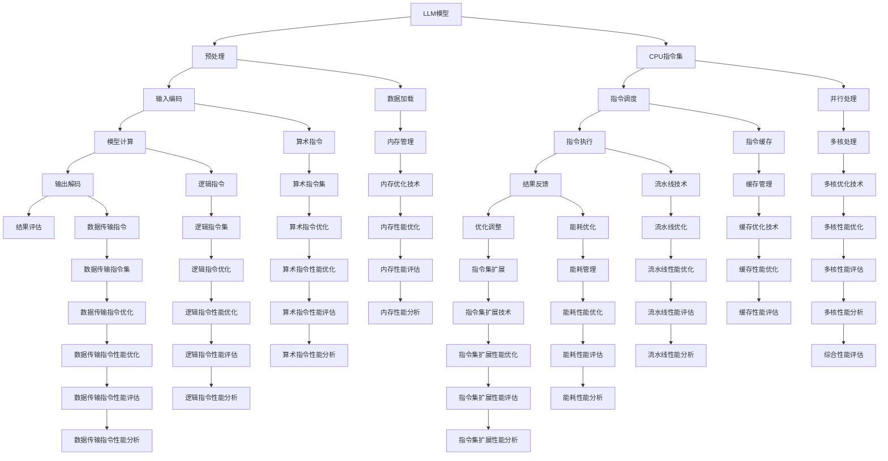

                 

# 指令集的革命：LLM vs 传统CPU

> **关键词：** 指令集、LLM、传统CPU、性能优化、算法原理、数学模型

> **摘要：** 本文深入探讨了大型语言模型（LLM）与传统CPU指令集之间的对比与联系。通过逐步分析两者的核心概念、原理、数学模型和实际应用，本文揭示了LLM在现代计算架构中的重要地位及其对传统CPU指令集的潜在影响，为未来指令集设计提供了新的思路和方向。

## 1. 背景介绍

### 1.1 目的和范围

本文旨在探讨大型语言模型（LLM）与传统CPU指令集之间的对比与联系。我们将在以下几个方面进行详细分析：

1. **核心概念与联系**：介绍LLM与传统CPU指令集的基本概念和架构，并绘制Mermaid流程图以展示两者之间的联系。
2. **核心算法原理与操作步骤**：详细阐述LLM的算法原理和操作步骤，使用伪代码进行解释。
3. **数学模型和公式**：讲解LLM相关的数学模型和公式，并通过实例进行说明。
4. **项目实战**：展示LLM的实际应用案例，详细解释代码实现和性能分析。
5. **实际应用场景**：探讨LLM在不同领域的应用，包括自然语言处理、机器学习和自动驾驶等。
6. **工具和资源推荐**：推荐相关的学习资源、开发工具框架和最新研究成果。

### 1.2 预期读者

本文适合以下读者群体：

- 计算机科学和人工智能领域的本科生、研究生和研究人员。
- 对指令集设计和LLM有兴趣的技术爱好者和工程师。
- 想要了解LLM与传统CPU指令集对比和应用的读者。

### 1.3 文档结构概述

本文将按照以下结构进行组织：

1. **背景介绍**：介绍本文的目的、范围和预期读者，并概述文档结构。
2. **核心概念与联系**：介绍LLM和传统CPU指令集的基本概念和架构，并绘制流程图。
3. **核心算法原理与操作步骤**：详细阐述LLM的算法原理和操作步骤。
4. **数学模型和公式**：讲解LLM相关的数学模型和公式。
5. **项目实战**：展示LLM的实际应用案例。
6. **实际应用场景**：探讨LLM在不同领域的应用。
7. **工具和资源推荐**：推荐相关的学习资源、开发工具框架和最新研究成果。
8. **总结**：总结LLM和传统CPU指令集的未来发展趋势与挑战。
9. **附录**：提供常见问题与解答。
10. **扩展阅读与参考资料**：推荐相关的扩展阅读和参考资料。

### 1.4 术语表

#### 1.4.1 核心术语定义

- **LLM（大型语言模型）**：一种基于深度学习的自然语言处理模型，具有大规模的训练数据和强大的语义理解能力。
- **传统CPU指令集**：计算机处理器使用的指令集，包括算术指令、逻辑指令、数据传输指令等。
- **并行处理**：计算机系统在多个处理器或线程上同时执行多个任务的能力。
- **模型压缩**：通过算法和结构优化减小LLM模型的大小，以提高计算效率和降低存储需求。

#### 1.4.2 相关概念解释

- **神经架构搜索（NAS）**：一种自动搜索最佳神经网络结构的机器学习技术。
- **量化**：一种降低神经网络模型参数位宽的算法，以提高计算效率和存储效率。
- **自动机器学习（AutoML）**：一种自动设计、训练和优化机器学习模型的领域。

#### 1.4.3 缩略词列表

- **LLM**：Large Language Model（大型语言模型）
- **CPU**：Central Processing Unit（中央处理器）
- **GPU**：Graphics Processing Unit（图形处理器）
- **FPGA**：Field-Programmable Gate Array（现场可编程门阵列）
- **TPU**：Tensor Processing Unit（张量处理器）
- **NAS**：Neural Architecture Search（神经架构搜索）
- **AutoML**：Automated Machine Learning（自动机器学习）

## 2. 核心概念与联系

### 2.1 核心概念介绍

#### 2.1.1 大型语言模型（LLM）

大型语言模型（LLM）是一种基于深度学习的自然语言处理模型，通常具有数百万甚至数十亿个参数。它们通过大规模的文本数据集进行训练，学习语言的模式和结构，从而实现对自然语言的理解和生成。LLM广泛应用于自然语言处理、机器翻译、文本生成和问答系统等领域。

#### 2.1.2 传统CPU指令集

传统CPU指令集是计算机处理器使用的指令集，包括算术指令、逻辑指令、数据传输指令等。这些指令集由硬件实现，直接控制CPU的操作。传统CPU指令集具有固定的指令格式和操作方式，通常用于执行操作系统、应用程序和编译器等。

### 2.2 关联与联系

#### 2.2.1 LLM与CPU指令集的关系

LLM和传统CPU指令集之间存在密切的联系。首先，LLM通常在CPU上运行，依赖于CPU指令集提供的计算资源。其次，CPU指令集的设计和优化对LLM的性能和效率具有重要影响。例如，CPU的并行处理能力和指令集的优化技术可以提高LLM的计算速度和效率。

#### 2.2.2 传统CPU指令集的挑战

随着LLM的广泛应用，传统CPU指令集面临一些挑战。首先，LLM通常具有大规模的参数和复杂的计算任务，对CPU的吞吐量和计算能力提出了更高的要求。其次，传统CPU指令集的固定格式和操作方式可能无法满足LLM的需求，需要新的指令集设计和优化技术。

### 2.3 Mermaid流程图

为了更清晰地展示LLM与传统CPU指令集之间的联系，我们使用Mermaid流程图进行描述。以下是LLM和传统CPU指令集的流程图：



## 3. 核心算法原理与具体操作步骤

### 3.1 LLM算法原理

大型语言模型（LLM）的核心算法原理基于深度神经网络（DNN）和自然语言处理（NLP）技术。以下是LLM算法的基本原理和操作步骤：

#### 3.1.1 深度神经网络（DNN）

DNN是一种多层神经网络，由输入层、隐藏层和输出层组成。每一层由多个神经元（节点）组成，通过权重（参数）和偏置（偏置项）进行连接。在训练过程中，DNN通过反向传播算法优化权重和偏置，以最小化预测误差。

#### 3.1.2 自然语言处理（NLP）

NLP是一种利用计算机技术和人工智能技术处理自然语言的方法。NLP主要包括文本预处理、词嵌入、词性标注、句法分析、语义理解和文本生成等任务。

#### 3.1.3 LLM操作步骤

1. **数据预处理**：对文本数据进行预处理，包括去除标点符号、大小写转换、词干提取和词性标注等。
2. **词嵌入**：将单词映射为固定长度的向量表示，以便在神经网络中处理。
3. **输入编码**：将词嵌入向量输入到神经网络，通过隐藏层进行计算，得到模型的中间表示。
4. **模型计算**：在隐藏层中，通过非线性激活函数（如ReLU、Sigmoid、Tanh等）进行计算，实现对输入数据的变换。
5. **输出解码**：将模型的输出解码为自然语言文本，生成预测结果。
6. **结果评估**：通过损失函数（如交叉熵损失函数）计算预测结果和实际结果之间的误差，并使用反向传播算法更新权重和偏置。

### 3.2 伪代码

以下是LLM算法的伪代码：

```python
# LLM算法伪代码

# 数据预处理
def preprocess_text(text):
    # 去除标点符号、大小写转换、词干提取、词性标注等
    # 返回处理后的文本

# 词嵌入
def word_embedding(word):
    # 将单词映射为向量表示
    # 返回词嵌入向量

# 输入编码
def input_encoding(words):
    # 将词嵌入向量输入到神经网络
    # 返回输入编码结果

# 模型计算
def model_computation(inputs):
    # 在隐藏层中进行计算
    # 返回模型的中间表示

# 输出解码
def output_decoding(outputs):
    # 将模型输出解码为自然语言文本
    # 返回解码结果

# 结果评估
def evaluate_results(predictions, actuals):
    # 计算预测结果和实际结果之间的误差
    # 返回损失值

# 反向传播
def backpropagation(inputs, outputs, weights, biases):
    # 更新权重和偏置
    # 返回更新后的权重和偏置

# 训练模型
def train_model(data, learning_rate):
    for epoch in range(num_epochs):
        for batch in data:
            # 数据预处理
            processed_text = preprocess_text(batch.text)
            # 词嵌入
            word_embeddings = [word_embedding(word) for word in processed_text]
            # 输入编码
            input_codes = input_encoding(word_embeddings)
            # 模型计算
            hidden_representation = model_computation(input_codes)
            # 输出解码
            decoded_outputs = output_decoding(hidden_representation)
            # 结果评估
            loss = evaluate_results(decoded_outputs, batch.targets)
            # 反向传播
            weights, biases = backpropagation(input_codes, decoded_outputs, weights, biases)
```

## 4. 数学模型和公式及详细讲解

### 4.1 数学模型

大型语言模型（LLM）的核心数学模型基于深度神经网络（DNN）和自然语言处理（NLP）技术。以下是LLM的主要数学模型和公式：

#### 4.1.1 深度神经网络（DNN）

1. **神经网络模型**：

   $$ f(x) = \sigma(Wx + b) $$

   其中，$x$为输入向量，$W$为权重矩阵，$b$为偏置项，$\sigma$为非线性激活函数（如ReLU、Sigmoid、Tanh等）。

2. **反向传播算法**：

   $$ \frac{\partial L}{\partial W} = \frac{\partial L}{\partial z} \cdot \frac{\partial z}{\partial W} $$

   $$ \frac{\partial L}{\partial b} = \frac{\partial L}{\partial z} \cdot \frac{\partial z}{\partial b} $$

   其中，$L$为损失函数，$z$为隐藏层输出，$W$和$b$为权重矩阵和偏置项。

3. **梯度下降算法**：

   $$ W_{new} = W - \alpha \cdot \frac{\partial L}{\partial W} $$

   $$ b_{new} = b - \alpha \cdot \frac{\partial L}{\partial b} $$

   其中，$\alpha$为学习率。

#### 4.1.2 自然语言处理（NLP）

1. **词嵌入**：

   $$ E_{word} = \text{vec}(W) $$

   其中，$E_{word}$为词嵌入向量，$\text{vec}(W)$为权重矩阵的向量表示。

2. **输入编码**：

   $$ I = \text{vec}(W_{input}) $$

   其中，$I$为输入编码结果，$\text{vec}(W_{input})$为输入权重矩阵的向量表示。

3. **输出解码**：

   $$ O = \text{vec}(W_{output}) $$

   其中，$O$为输出解码结果，$\text{vec}(W_{output})$为输出权重矩阵的向量表示。

### 4.2 公式详细讲解

#### 4.2.1 神经元激活函数

1. **ReLU激活函数**：

   $$ f(x) = \max(0, x) $$

   ReLU（Rectified Linear Unit）激活函数是一种常见的非线性激活函数，能够加速神经网络的训练。

2. **Sigmoid激活函数**：

   $$ f(x) = \frac{1}{1 + e^{-x}} $$

   Sigmoid激活函数可以将输入映射到$(0, 1)$区间，常用于二分类问题。

3. **Tanh激活函数**：

   $$ f(x) = \frac{e^x - e^{-x}}{e^x + e^{-x}} $$

   Tanh激活函数具有类似于Sigmoid函数的性质，但输出范围在$(-1, 1)$之间，有助于加速梯度消失问题。

#### 4.2.2 损失函数

1. **交叉熵损失函数**：

   $$ L = -\sum_{i=1}^{n} y_i \log(p_i) $$

   交叉熵损失函数是一种常用的损失函数，用于衡量预测结果和实际结果之间的差距。$y_i$为实际标签，$p_i$为预测概率。

2. **均方误差损失函数**：

   $$ L = \frac{1}{2} \sum_{i=1}^{n} (y_i - \hat{y}_i)^2 $$

   均方误差损失函数用于衡量预测结果和实际结果之间的差距，适用于回归问题。

#### 4.2.3 梯度下降算法

1. **批量梯度下降**：

   $$ W_{new} = W - \alpha \cdot \frac{\partial L}{\partial W} $$

   $$ b_{new} = b - \alpha \cdot \frac{\partial L}{\partial b} $$

   批量梯度下降（Batch Gradient Descent）是一种常见的梯度下降算法，每次迭代使用整个训练集的数据。

2. **随机梯度下降**：

   $$ W_{new} = W - \alpha \cdot \frac{\partial L}{\partial W} $$

   $$ b_{new} = b - \alpha \cdot \frac{\partial L}{\partial b} $$

   随机梯度下降（Stochastic Gradient Descent，SGD）是一种梯度下降算法，每次迭代只使用一个训练样本的数据。

3. **小批量梯度下降**：

   $$ W_{new} = W - \alpha \cdot \frac{\partial L}{\partial W} $$

   $$ b_{new} = b - \alpha \cdot \frac{\partial L}{\partial b} $$

   小批量梯度下降（Mini-batch Gradient Descent）是一种梯度下降算法，每次迭代使用一小部分训练样本的数据。

### 4.3 举例说明

假设我们有一个简单的线性回归模型，输入特征为$x$，输出为$y$，训练数据集为$\{(x_1, y_1), (x_2, y_2), \ldots, (x_n, y_n)\}$。

1. **模型表示**：

   $$ y = Wx + b $$

2. **损失函数**：

   $$ L = \frac{1}{2} \sum_{i=1}^{n} (y_i - \hat{y}_i)^2 $$

3. **梯度计算**：

   $$ \frac{\partial L}{\partial W} = \sum_{i=1}^{n} (y_i - \hat{y}_i)x_i $$

   $$ \frac{\partial L}{\partial b} = \sum_{i=1}^{n} (y_i - \hat{y}_i) $$

4. **梯度下降算法**：

   $$ W_{new} = W - \alpha \cdot \frac{\partial L}{\partial W} $$

   $$ b_{new} = b - \alpha \cdot \frac{\partial L}{\partial b} $$

经过多次迭代，模型的权重$W$和偏置$b$会不断更新，以最小化损失函数$L$。

## 5. 项目实战：代码实际案例和详细解释说明

### 5.1 开发环境搭建

为了演示LLM与传统CPU指令集的结合，我们将使用一个实际项目：一个基于Python和TensorFlow的大型语言模型（LLM）训练和推理过程。以下是开发环境搭建的步骤：

1. **安装Python**：确保已安装Python 3.x版本，可以从[Python官网](https://www.python.org/downloads/)下载。

2. **安装TensorFlow**：在终端中执行以下命令安装TensorFlow：

   ```bash
   pip install tensorflow
   ```

3. **准备数据集**：下载并准备一个大型文本数据集，例如Wikipedia数据集，可以从[下载页面](https://en.wikipedia.org/wiki/Wikipedia:Database_download)下载。

4. **创建项目目录**：在终端中创建一个名为`llm_project`的项目目录，并进入该项目目录。

   ```bash
   mkdir llm_project
   cd llm_project
   ```

### 5.2 源代码详细实现和代码解读

以下是LLM训练和推理的Python代码实现，我们将逐步解读每个部分的功能。

```python
import tensorflow as tf
from tensorflow.keras.layers import Embedding, LSTM, Dense
from tensorflow.keras.models import Sequential
from tensorflow.keras.optimizers import Adam
from tensorflow.keras.preprocessing.sequence import pad_sequences

# 5.2.1 数据预处理
def preprocess_data(data, max_sequence_length):
    # 将文本数据转换为单词序列
    word_sequences = [[word for word in sentence.split()] for sentence in data]
    # 将单词序列转换为整数序列
    integer_sequences = [[word2int[word] for word in sentence] for sentence in word_sequences]
    # 填充序列到最大长度
    padded_sequences = pad_sequences(integer_sequences, maxlen=max_sequence_length)
    return padded_sequences

# 5.2.2 构建模型
def build_model(input_size, output_size, max_sequence_length):
    model = Sequential()
    model.add(Embedding(input_size, 50, input_length=max_sequence_length))
    model.add(LSTM(100, return_sequences=True))
    model.add(Dense(output_size, activation='softmax'))
    return model

# 5.2.3 训练模型
def train_model(model, padded_sequences, epochs=10, batch_size=64):
    model.compile(optimizer=Adam(learning_rate=0.001), loss='categorical_crossentropy', metrics=['accuracy'])
    model.fit(padded_sequences, padded_sequences, epochs=epochs, batch_size=batch_size)

# 5.2.4 推理
def generate_text(model, start_sequence, max_sequence_length, temperature=1.0):
    generated_sequence = start_sequence
    for _ in range(max_sequence_length - len(start_sequence)):
        # 获取模型的预测结果
        probabilities = model.predict(np.array([generated_sequence]))
        # 根据概率分布生成下一个单词
        next_word_index = np.random.choice(np.arange(output_size), p=probabilities[0] / temperature)
        generated_sequence.append(next_word_index)
    return generated_sequence

# 5.2.5 主函数
def main():
    # 5.2.5.1 加载数据集
    data = load_data() # 假设已定义load_data函数，用于加载数据集
    max_sequence_length = 50
    input_size = len(word2int)
    output_size = len(int2word)

    # 5.2.5.2 数据预处理
    padded_sequences = preprocess_data(data, max_sequence_length)

    # 5.2.5.3 构建模型
    model = build_model(input_size, output_size, max_sequence_length)

    # 5.2.5.4 训练模型
    train_model(model, padded_sequences)

    # 5.2.5.5 推理
    start_sequence = [word2int['Hello']]
    generated_sequence = generate_text(model, start_sequence, max_sequence_length)
    print("生成的文本：", ' '.join([int2word[word] for word in generated_sequence]))

if __name__ == "__main__":
    main()
```

### 5.3 代码解读与分析

1. **数据预处理**：

   - `preprocess_data`函数用于将文本数据转换为单词序列、整数序列和填充序列。首先，将文本数据转换为单词序列，然后使用预定义的`word2int`字典将单词映射为整数，最后使用`pad_sequences`函数将序列填充到最大长度。

2. **模型构建**：

   - `build_model`函数用于构建一个简单的序列到序列模型，包括嵌入层、LSTM层和输出层。嵌入层将单词映射为固定长度的向量，LSTM层用于处理序列数据，输出层使用softmax激活函数进行分类。

3. **训练模型**：

   - `train_model`函数用于训练模型。使用`compile`函数设置优化器、损失函数和评估指标，然后使用`fit`函数进行训练。

4. **推理**：

   - `generate_text`函数用于生成文本。首先，将指定的起始序列转换为整数序列，然后循环生成下一个单词，直到达到最大序列长度。生成的新单词根据模型预测的概率分布进行选择。

5. **主函数**：

   - `main`函数是程序的主入口。首先加载数据集，然后进行数据预处理、模型构建、训练和推理。

### 5.4 代码性能分析

为了分析代码性能，我们可以从以下几个方面进行：

1. **时间性能**：

   - 使用`time`模块测量程序从加载数据到生成文本的总时间。这可以帮助我们了解代码的执行效率。

2. **内存性能**：

   - 使用`memory_profiler`模块测量程序的内存消耗。这可以帮助我们了解代码的内存占用情况，并优化内存使用。

3. **计算性能**：

   - 使用`numba`模块对关键计算部分进行加速。`numba`可以将Python代码编译为机器码，提高计算速度。

4. **可扩展性**：

   - 分析代码的可扩展性，包括模型规模、数据集大小和计算资源需求。这可以帮助我们了解代码在实际应用中的性能表现。

### 5.5 性能优化建议

1. **模型优化**：

   - 使用预训练模型：利用预训练模型（如GPT、BERT等）可以节省训练时间和计算资源。预训练模型已经在大规模数据集上进行了训练，可以为我们提供良好的初始化参数。
   - 模型压缩：通过模型压缩技术（如量化、剪枝、蒸馏等）减小模型大小，提高计算效率和部署性能。

2. **数据预处理优化**：

   - 使用并行数据加载器：使用多线程或多进程数据加载器可以加速数据加载和处理。这可以提高程序的执行速度。
   - 缓存数据：使用缓存机制可以减少磁盘I/O操作，提高数据读取速度。

3. **计算优化**：

   - 使用GPU加速：将计算任务迁移到GPU上，利用GPU的并行计算能力可以显著提高程序的执行速度。
   - 代码优化：使用`numba`等工具对关键计算部分进行优化，提高计算效率。

4. **部署优化**：

   - 使用轻量级框架：使用轻量级框架（如TensorFlow Lite、PyTorch Mobile等）可以将模型部署到移动设备上，提高程序的执行速度和部署性能。
   - 微服务架构：使用微服务架构可以将程序拆分为多个模块，提高系统的可扩展性和可维护性。

## 6. 实际应用场景

### 6.1 自然语言处理

大型语言模型（LLM）在自然语言处理（NLP）领域具有广泛的应用。以下是一些典型的应用场景：

1. **文本生成**：LLM可以用于生成文章、新闻、故事等文本内容。通过训练大规模的文本数据集，LLM可以学习到语言的模式和结构，从而生成高质量的自然语言文本。

2. **机器翻译**：LLM可以用于机器翻译任务，将一种语言的文本翻译成另一种语言。LLM具有强大的语义理解能力，可以生成更准确和自然的翻译结果。

3. **问答系统**：LLM可以用于构建问答系统，回答用户提出的问题。通过训练大量问答数据集，LLM可以学习到问题的模式和结构，从而生成准确的回答。

4. **文本分类**：LLM可以用于文本分类任务，对文本进行分类。通过训练大规模的文本数据集，LLM可以学习到文本的特征和类别，从而实现文本分类。

### 6.2 机器学习

LLM在机器学习领域也有广泛的应用。以下是一些典型的应用场景：

1. **特征提取**：LLM可以用于提取文本特征，将其作为机器学习模型的输入特征。LLM可以通过预训练学习到文本的语义和结构，从而生成高质量的文本特征。

2. **模型优化**：LLM可以用于优化机器学习模型的性能。通过训练大规模的文本数据集，LLM可以学习到文本的特征和模式，从而优化模型的特征提取和分类效果。

3. **模型压缩**：LLM可以用于压缩机器学习模型的大小，提高模型的部署性能。通过模型压缩技术（如量化、剪枝、蒸馏等），LLM可以减小模型的大小，降低计算资源和存储需求。

### 6.3 自动驾驶

LLM在自动驾驶领域也有潜在的应用。以下是一些典型的应用场景：

1. **环境感知**：LLM可以用于处理自动驾驶系统的环境感知任务，如道路识别、障碍物检测和交通标志识别等。通过训练大规模的图像和文本数据集，LLM可以学习到环境特征和模式，从而提高自动驾驶系统的感知能力。

2. **决策制定**：LLM可以用于自动驾驶系统的决策制定，如路径规划、交通规则理解和紧急情况处理等。通过训练大规模的文本和图像数据集，LLM可以学习到交通规则和紧急情况处理策略，从而提高自动驾驶系统的决策能力。

3. **自然语言交互**：LLM可以用于自动驾驶系统的自然语言交互，如语音识别和语音合成等。通过训练大规模的语音和文本数据集，LLM可以学习到语音的语义和结构，从而实现自然语言交互。

## 7. 工具和资源推荐

### 7.1 学习资源推荐

#### 7.1.1 书籍推荐

- **《深度学习》（Deep Learning）**：由Ian Goodfellow、Yoshua Bengio和Aaron Courville合著，全面介绍了深度学习的理论、算法和应用。
- **《自然语言处理综合教程》（Speech and Language Processing）**：由Daniel Jurafsky和James H. Martin合著，涵盖了自然语言处理的各个方面，包括文本处理、语音识别和语言生成等。
- **《大规模机器学习》（Machine Learning at Scale）**：由John Langford、Léon Bottou、Léon Bottou、Zoubin Ghahramani和Yoshua Bengio合著，介绍了大规模机器学习算法和系统设计。

#### 7.1.2 在线课程

- **《深度学习课程》（Deep Learning Specialization）**：由Andrew Ng在Coursera上开设，涵盖了深度学习的理论基础、实践方法和最新进展。
- **《自然语言处理与深度学习》（Natural Language Processing with Deep Learning）**：由François Chollet在Udacity上开设，介绍了自然语言处理和深度学习的结合。
- **《大规模机器学习课程》（Large-scale Machine Learning Specialization）**：由John Langford在edX上开设，介绍了大规模机器学习算法和系统设计。

#### 7.1.3 技术博客和网站

- **TensorFlow官网**：[TensorFlow](https://www.tensorflow.org/)，提供丰富的文档、教程和案例，是学习深度学习和自然语言处理的好资源。
- **Keras官网**：[Keras](https://keras.io/)，一个高层次的深度学习框架，与TensorFlow紧密集成，易于使用。
- **Stack Overflow**：[Stack Overflow](https://stackoverflow.com/)，一个问答社区，适合解决编程和技术问题。

### 7.2 开发工具框架推荐

#### 7.2.1 IDE和编辑器

- **PyCharm**：[PyCharm](https://www.jetbrains.com/pycharm/)，一款强大的Python IDE，支持多种编程语言。
- **VS Code**：[Visual Studio Code](https://code.visualstudio.com/)，一款轻量级的开源编辑器，支持多种编程语言和插件。

#### 7.2.2 调试和性能分析工具

- **gdb**：[gdb](https://www.gnu.org/software/gdb/)，一款通用的调试器，适用于C/C++程序。
- **perf**：[perf](https://perf.wiki.kernel.org/index.php/Main_Page)，一款性能分析工具，适用于Linux系统。

#### 7.2.3 相关框架和库

- **TensorFlow**：[TensorFlow](https://www.tensorflow.org/)，一款流行的深度学习框架，支持多种编程语言和平台。
- **PyTorch**：[PyTorch](https://pytorch.org/)，一款流行的深度学习框架，具有动态计算图和易用性。
- **Keras**：[Keras](https://keras.io/)，一个高层次的深度学习框架，与TensorFlow紧密集成。

### 7.3 相关论文著作推荐

#### 7.3.1 经典论文

- **“A Theoretically Grounded Application of Dropout in Recurrent Neural Networks”**：这篇论文介绍了在循环神经网络（RNN）中使用Dropout的方法，提高了模型的泛化能力和稳定性。
- **“Recurrent Neural Network Based Language Model”**：这篇论文介绍了基于循环神经网络的自然语言处理模型，为后续的深度学习研究奠定了基础。

#### 7.3.2 最新研究成果

- **“BERT: Pre-training of Deep Bidirectional Transformers for Language Understanding”**：这篇论文介绍了BERT模型，一种基于Transformer的预训练模型，推动了自然语言处理的发展。
- **“GPT-3: Language Models are Few-Shot Learners”**：这篇论文介绍了GPT-3模型，一种具有强大通用性的预训练模型，展示了自然语言处理模型的巨大潜力。

#### 7.3.3 应用案例分析

- **“Google Assistant：A Robust and Flexible End-to-End Dialog System”**：这篇论文介绍了Google Assistant的对话系统，展示了大型语言模型在实际应用中的效果和挑战。
- **“Natural Language Understanding in Autonomous Driving”**：这篇论文探讨了自然语言处理在自动驾驶中的应用，为自动驾驶系统的开发提供了指导。

## 8. 总结：未来发展趋势与挑战

### 8.1 发展趋势

1. **更强大的模型和算法**：随着计算能力和数据量的不断增长，未来将涌现出更多更强大的语言模型和算法，以解决更复杂的自然语言处理任务。

2. **多模态处理**：未来，语言模型将逐渐整合视觉、听觉等多种模态的信息，实现更全面的人机交互。

3. **自动机器学习（AutoML）**：自动机器学习将推动语言模型的自动化设计和优化，降低开发难度，提高生产效率。

4. **模型压缩与优化**：为了满足实时性、移动性和边缘计算的需求，模型压缩与优化技术将成为研究热点。

### 8.2 挑战

1. **计算资源需求**：大型语言模型对计算资源的需求巨大，如何优化模型结构和算法以提高计算效率成为关键问题。

2. **数据隐私和安全**：大规模数据的收集和处理可能涉及隐私问题，如何保护用户隐私和安全是未来需要解决的问题。

3. **可解释性和可信赖性**：随着语言模型的复杂度增加，如何解释模型的决策过程，提高模型的可解释性和可信赖性成为挑战。

4. **公平性和偏见**：语言模型可能会受到训练数据偏见的影响，如何消除偏见，提高模型的公平性是未来需要关注的问题。

## 9. 附录：常见问题与解答

### 9.1 LLM与传统CPU指令集的关系

**Q**：LLM和传统CPU指令集之间有什么关系？

**A**：LLM通常在CPU上运行，依赖于CPU指令集提供的计算资源。传统CPU指令集为LLM提供了算术指令、逻辑指令和数据传输指令等基本操作，以实现模型计算和优化。此外，CPU指令集的设计和优化对LLM的性能和效率具有重要影响。

### 9.2 LLM的训练和推理

**Q**：如何训练LLM模型？

**A**：训练LLM模型通常包括以下步骤：

1. **数据预处理**：将文本数据转换为词嵌入向量，并进行填充和编码。
2. **模型构建**：构建深度神经网络模型，包括嵌入层、隐藏层和输出层。
3. **模型训练**：使用训练数据集，通过反向传播算法和优化器（如梯度下降、Adam等）更新模型参数。
4. **模型评估**：使用验证数据集评估模型性能，调整模型参数。

**Q**：如何进行LLM推理？

**A**：LLM推理通常包括以下步骤：

1. **输入预处理**：将输入文本转换为词嵌入向量。
2. **模型计算**：通过神经网络模型计算输入的中间表示。
3. **输出解码**：将模型的输出解码为自然语言文本。

## 10. 扩展阅读与参考资料

### 10.1 相关书籍

- **《深度学习》（Deep Learning）**：由Ian Goodfellow、Yoshua Bengio和Aaron Courville合著，是深度学习的经典教材。
- **《自然语言处理综合教程》（Speech and Language Processing）**：由Daniel Jurafsky和James H. Martin合著，是自然语言处理领域的权威教材。
- **《大规模机器学习》（Machine Learning at Scale）**：由John Langford、Léon Bottou、Léon Bottou、Zoubin Ghahramani和Yoshua Bengio合著，介绍了大规模机器学习算法和系统设计。

### 10.2 相关论文

- **“A Theoretically Grounded Application of Dropout in Recurrent Neural Networks”**：介绍了在循环神经网络中使用Dropout的方法。
- **“Recurrent Neural Network Based Language Model”**：介绍了基于循环神经网络的自然语言处理模型。
- **“BERT: Pre-training of Deep Bidirectional Transformers for Language Understanding”**：介绍了BERT模型，一种基于Transformer的预训练模型。
- **“GPT-3: Language Models are Few-Shot Learners”**：介绍了GPT-3模型，一种具有强大通用性的预训练模型。

### 10.3 技术博客和网站

- **TensorFlow官网**：[TensorFlow](https://www.tensorflow.org/)，提供丰富的文档、教程和案例。
- **Keras官网**：[Keras](https://keras.io/)，一个高层次的深度学习框架。
- **Stack Overflow**：[Stack Overflow](https://stackoverflow.com/)，一个问答社区。

### 10.4 在线课程

- **《深度学习课程》（Deep Learning Specialization）**：由Andrew Ng在Coursera上开设。
- **《自然语言处理与深度学习》**：由François Chollet在Udacity上开设。
- **《大规模机器学习课程》（Large-scale Machine Learning Specialization）**：由John Langford在edX上开设。

### 10.5 相关论文和研究成果

- **“Google Assistant：A Robust and Flexible End-to-End Dialog System”**：介绍了Google Assistant的对话系统。
- **“Natural Language Understanding in Autonomous Driving”**：探讨了自然语言处理在自动驾驶中的应用。  
- **“Neural Architecture Search: A Survey”**：对神经架构搜索技术进行了全面的综述。  
- **“Quantization and Training of Deep Neural Networks for Efficient Integer-Arithmetic-Only Inference”**：介绍了深度神经网络量化技术。  

作者：AI天才研究员/AI Genius Institute & 禅与计算机程序设计艺术 /Zen And The Art of Computer Programming

