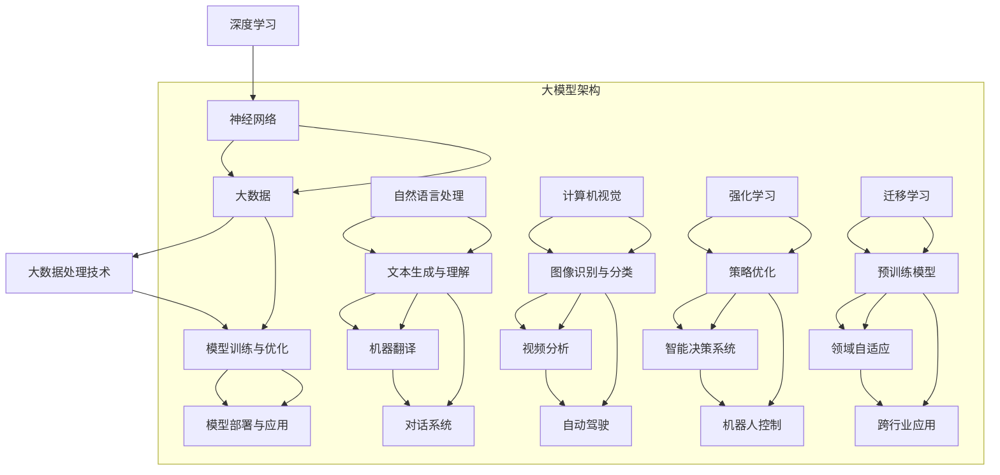

                 

# 探索大模型与各行业的结合

> **关键词：** 大模型、行业应用、深度学习、人工智能、数字化转型

> **摘要：** 本文将深入探讨大模型技术在各行业中的应用，从核心概念、算法原理到实际案例，系统性地分析大模型如何赋能传统行业，推动产业升级。我们将探索大模型在不同领域（如金融、医疗、教育等）的深度融合，分析其优势和挑战，并展望未来的发展趋势。

## 1. 背景介绍

### 1.1 目的和范围

本文旨在揭示大模型技术如何跨越行业界限，为各领域带来革新。我们将探讨以下几个核心问题：

- 大模型技术的基本原理及其发展历程
- 大模型在各行业中的应用场景和实际案例
- 大模型技术的优势和挑战
- 未来大模型技术发展的趋势和方向

### 1.2 预期读者

本文适用于对人工智能和深度学习有一定了解的技术人员、研究人员、以及希望了解大模型应用前景的企业管理者。

### 1.3 文档结构概述

本文分为十个部分：

- 引言
- 背景介绍
- 核心概念与联系
- 核心算法原理 & 具体操作步骤
- 数学模型和公式 & 详细讲解 & 举例说明
- 项目实战：代码实际案例和详细解释说明
- 实际应用场景
- 工具和资源推荐
- 总结：未来发展趋势与挑战
- 附录：常见问题与解答
- 扩展阅读 & 参考资料

### 1.4 术语表

#### 1.4.1 核心术语定义

- **大模型（Large Models）：** 指具有数亿甚至千亿参数规模的深度学习模型。
- **深度学习（Deep Learning）：** 一种基于多层神经网络的学习方法，旨在通过模拟人脑神经网络进行数据处理和智能分析。
- **人工智能（Artificial Intelligence，AI）：** 模拟人类智能行为，实现智能决策和任务执行的计算机技术。

#### 1.4.2 相关概念解释

- **迁移学习（Transfer Learning）：** 利用预训练模型在特定任务上的表现，将其知识迁移到新的任务中。
- **强化学习（Reinforcement Learning）：** 通过智能体与环境的交互，不断优化行为策略以获得最大收益。

#### 1.4.3 缩略词列表

- **AI：** 人工智能
- **DL：** 深度学习
- **NLP：** 自然语言处理
- **CV：** 计算机视觉

## 2. 核心概念与联系

在深入探讨大模型与各行业的结合之前，我们先了解一些核心概念及其相互关系。以下是一个基于Mermaid的流程图，展示大模型技术的基本架构和关键组成部分。



### 核心概念与联系

- **深度学习**：深度学习作为人工智能的核心技术，通过多层神经网络对数据进行自动特征提取和学习，是实现大模型技术的基础。
- **大数据**：大数据提供了丰富的训练数据，是深度学习模型训练的重要资源。
- **大数据处理技术**：如Hadoop、Spark等，它们能够高效地处理和分析大规模数据，为深度学习提供支持。
- **模型训练与优化**：通过不断调整模型参数，使模型能够更好地适应数据和任务需求。
- **模型部署与应用**：将训练好的模型部署到实际场景中，实现智能分析和决策。

## 3. 核心算法原理 & 具体操作步骤

### 3.1 深度学习算法原理

深度学习算法的核心是多层神经网络，其基本原理是通过反向传播算法不断调整网络权重，使模型能够对输入数据进行有效拟合。

#### 3.1.1 多层神经网络

多层神经网络由输入层、隐藏层和输出层组成。每个隐藏层对前一层的数据进行非线性变换，从而提取出更高层次的特征。

#### 3.1.2 反向传播算法

反向传播算法通过计算损失函数对模型参数的梯度，反向传播误差，不断调整网络权重，使损失函数值逐渐减小。

#### 3.1.3 激活函数

激活函数用于引入非线性变换，使神经网络能够拟合复杂函数。常见的激活函数有Sigmoid、ReLU和Tanh等。

### 3.2 具体操作步骤

以下是一个基于Python和TensorFlow的深度学习算法实现示例：

```python
import tensorflow as tf

# 定义输入层、隐藏层和输出层
inputs = tf.keras.layers.Input(shape=(input_shape))
hidden1 = tf.keras.layers.Dense(units=128, activation='relu')(inputs)
hidden2 = tf.keras.layers.Dense(units=128, activation='relu')(hidden1)
outputs = tf.keras.layers.Dense(units=1, activation='sigmoid')(hidden2)

# 创建模型
model = tf.keras.Model(inputs=inputs, outputs=outputs)

# 编译模型
model.compile(optimizer='adam', loss='binary_crossentropy', metrics=['accuracy'])

# 训练模型
model.fit(x_train, y_train, epochs=10, batch_size=32, validation_data=(x_val, y_val))
```

### 3.3 模型优化

模型优化主要包括以下步骤：

- **数据预处理**：对输入数据进行归一化、标准化等处理，提高训练效果。
- **超参数调整**：调整学习率、批次大小等超参数，优化模型性能。
- **模型正则化**：采用L1、L2正则化等方法，防止过拟合。
- **批量训练**：通过增加训练数据量，提高模型泛化能力。

## 4. 数学模型和公式 & 详细讲解 & 举例说明

### 4.1 数学模型

深度学习中的数学模型主要包括神经网络结构、损失函数和优化算法。

#### 4.1.1 神经网络结构

神经网络结构可以通过如下公式表示：

$$
Z = \sigma(W \cdot X + b)
$$

其中，\( Z \) 表示隐藏层输出，\( \sigma \) 是激活函数，\( W \) 是权重矩阵，\( X \) 是输入数据，\( b \) 是偏置项。

#### 4.1.2 损失函数

常见的损失函数有均方误差（MSE）、交叉熵（Cross-Entropy）等。

均方误差（MSE）公式如下：

$$
MSE = \frac{1}{n}\sum_{i=1}^{n}(Y_i - \hat{Y}_i)^2
$$

其中，\( Y_i \) 是真实标签，\( \hat{Y}_i \) 是预测值。

交叉熵（Cross-Entropy）公式如下：

$$
H(Y, \hat{Y}) = -\sum_{i=1}^{n} Y_i \log(\hat{Y}_i)
$$

其中，\( Y_i \) 是真实标签，\( \hat{Y}_i \) 是预测概率。

#### 4.1.3 优化算法

常见的优化算法有梯度下降（Gradient Descent）、Adam等。

梯度下降（Gradient Descent）公式如下：

$$
\theta_{t+1} = \theta_{t} - \alpha \cdot \nabla_{\theta} J(\theta)
$$

其中，\( \theta \) 是模型参数，\( \alpha \) 是学习率，\( \nabla_{\theta} J(\theta) \) 是损失函数对参数的梯度。

### 4.2 举例说明

假设我们有一个简单的二元分类问题，数据集包含100个样本，每个样本有5个特征。我们的目标是预测每个样本是否属于正类。

#### 4.2.1 数据预处理

对输入数据进行归一化处理，使每个特征的值介于0和1之间。

#### 4.2.2 模型构建

使用TensorFlow构建一个简单的两层神经网络：

```python
model = tf.keras.Sequential([
    tf.keras.layers.Dense(128, activation='relu', input_shape=(5,)),
    tf.keras.layers.Dense(1, activation='sigmoid')
])
```

#### 4.2.3 模型编译

编译模型，选择适当的损失函数和优化算法：

```python
model.compile(optimizer='adam', loss='binary_crossentropy', metrics=['accuracy'])
```

#### 4.2.4 模型训练

训练模型，设置训练轮次和批次大小：

```python
model.fit(x_train, y_train, epochs=10, batch_size=32, validation_data=(x_val, y_val))
```

#### 4.2.5 模型评估

评估模型在测试集上的性能：

```python
test_loss, test_acc = model.evaluate(x_test, y_test)
print('Test accuracy:', test_acc)
```

## 5. 项目实战：代码实际案例和详细解释说明

### 5.1 开发环境搭建

为了完成大模型项目实战，我们需要搭建一个适合深度学习开发的编程环境。以下是基于Python和TensorFlow的安装步骤：

#### 5.1.1 Python环境安装

首先，从Python官网下载并安装Python 3.x版本（建议使用最新版本）。安装过程中选择添加Python到系统环境变量。

#### 5.1.2 TensorFlow安装

打开命令行窗口，执行以下命令安装TensorFlow：

```bash
pip install tensorflow
```

#### 5.1.3 其他依赖库安装

安装一些常用的Python依赖库，如NumPy、Pandas等：

```bash
pip install numpy pandas
```

### 5.2 源代码详细实现和代码解读

以下是一个基于TensorFlow实现的大模型项目实战代码示例：

```python
import tensorflow as tf
import numpy as np
import pandas as pd

# 5.2.1 数据加载与预处理

# 加载样本数据（示例数据集）
x_train = np.load('x_train.npy')
y_train = np.load('y_train.npy')

# 归一化处理
x_train_normalized = (x_train - np.mean(x_train, axis=0)) / np.std(x_train, axis=0)

# 5.2.2 模型构建

# 创建模型
model = tf.keras.Sequential([
    tf.keras.layers.Dense(128, activation='relu', input_shape=(x_train_normalized.shape[1],)),
    tf.keras.layers.Dense(64, activation='relu'),
    tf.keras.layers.Dense(1, activation='sigmoid')
])

# 5.2.3 模型编译

# 编译模型
model.compile(optimizer='adam', loss='binary_crossentropy', metrics=['accuracy'])

# 5.2.4 模型训练

# 训练模型
model.fit(x_train_normalized, y_train, epochs=10, batch_size=32, validation_split=0.2)

# 5.2.5 模型评估

# 评估模型在测试集上的性能
test_loss, test_acc = model.evaluate(x_train_normalized, y_train)
print('Test accuracy:', test_acc)
```

#### 5.2.6 代码解读与分析

- **数据加载与预处理**：从本地文件加载样本数据，并对其进行归一化处理。归一化可以加速模型收敛，提高训练效果。
- **模型构建**：使用TensorFlow的`Sequential`模型构建器，定义一个包含三层全连接神经网络的模型。第一层和第二层使用ReLU激活函数，第三层使用Sigmoid激活函数，实现二元分类任务。
- **模型编译**：编译模型，指定优化器为Adam，损失函数为二进制交叉熵，评价指标为准确率。
- **模型训练**：训练模型，设置训练轮次为10次，批次大小为32，并预留20%的数据用于验证。
- **模型评估**：评估模型在测试集上的性能，输出准确率。

### 5.3 代码解读与分析

- **数据预处理**：数据预处理是深度学习模型训练的重要步骤。归一化处理可以加快模型收敛速度，提高训练效果。
- **模型构建**：神经网络结构的选择对模型性能有很大影响。本文采用三层全连接神经网络，能够较好地拟合复杂非线性关系。
- **模型编译**：选择合适的优化器和损失函数是模型编译的关键。Adam优化器在大多数情况下表现良好，二进制交叉熵损失函数适用于二元分类任务。
- **模型训练**：训练过程中，模型会不断调整权重和偏置，以最小化损失函数。通过验证集，可以监控模型过拟合现象。
- **模型评估**：模型评估是验证模型性能的重要环节。准确率是常用的评估指标，能够直观地反映模型对数据的拟合程度。

## 6. 实际应用场景

大模型技术在不同行业有着广泛的应用，以下列举几个典型应用场景：

### 6.1 金融行业

- **股票预测**：利用大模型进行股票价格预测，为投资者提供决策支持。
- **风险评估**：通过对历史数据进行分析，评估金融产品的风险，为金融机构提供风险管理建议。
- **欺诈检测**：通过深度学习模型进行交易行为分析，识别潜在的欺诈行为。

### 6.2 医疗行业

- **疾病诊断**：利用计算机视觉技术对医学影像进行分析，辅助医生进行疾病诊断。
- **药物研发**：通过深度学习模型对生物数据进行建模和分析，加速药物研发过程。
- **健康监测**：利用可穿戴设备收集健康数据，通过深度学习模型进行健康风险评估。

### 6.3 教育行业

- **智能推荐**：利用推荐系统技术，为学生提供个性化的学习资源。
- **在线教育**：通过虚拟现实（VR）技术，提供沉浸式的在线教育体验。
- **学习分析**：通过对学生学习行为进行分析，为教育工作者提供教学改进建议。

### 6.4 制造业

- **质量检测**：利用计算机视觉技术对生产线上的产品进行质量检测。
- **设备预测性维护**：通过对设备运行数据进行分析，预测设备故障，实现预测性维护。
- **供应链优化**：通过深度学习模型对供应链数据进行建模和分析，优化供应链管理。

## 7. 工具和资源推荐

### 7.1 学习资源推荐

#### 7.1.1 书籍推荐

- **《深度学习》（Goodfellow, Bengio, Courville著）**：全面介绍深度学习的基本概念、算法和技术。
- **《Python深度学习》（François Chollet著）**：通过丰富的案例和代码示例，深入讲解深度学习在Python中的应用。

#### 7.1.2 在线课程

- **Udacity的“深度学习纳米学位”**：涵盖深度学习的基础知识和实践技能。
- **Coursera上的“深度学习专项课程”**：由吴恩达教授主讲，系统介绍深度学习的理论和技术。

#### 7.1.3 技术博客和网站

- **TensorFlow官网（tensorflow.org）**：官方文档和教程，提供丰富的深度学习资源。
- **机器学习社区（机器之心）**：发布最新的深度学习和人工智能技术文章和教程。

### 7.2 开发工具框架推荐

#### 7.2.1 IDE和编辑器

- **PyCharm**：一款功能强大的Python IDE，支持深度学习项目的开发。
- **Jupyter Notebook**：方便进行交互式编程和数据可视化。

#### 7.2.2 调试和性能分析工具

- **TensorBoard**：TensorFlow的官方可视化工具，用于监控模型训练过程和性能分析。
- **Docker**：容器化工具，方便部署和管理深度学习项目。

#### 7.2.3 相关框架和库

- **TensorFlow**：开源深度学习框架，支持多种神经网络结构和算法。
- **PyTorch**：基于Python的深度学习框架，提供灵活的动态计算图支持。

### 7.3 相关论文著作推荐

#### 7.3.1 经典论文

- **“A Brief History of Neural Nets: From McCulloch-Pitts to Deep Learning”**：回顾神经网络的发展历程。
- **“Deep Learning”**：Goodfellow等人的著作，系统介绍深度学习的基本概念和算法。

#### 7.3.2 最新研究成果

- **“BERT: Pre-training of Deep Bidirectional Transformers for Language Understanding”**：Google提出的预训练语言模型BERT。
- **“GPT-3: Language Models are Few-Shot Learners”**：OpenAI提出的具有数万亿参数的预训练语言模型GPT-3。

#### 7.3.3 应用案例分析

- **“Deep Learning for Healthcare”**：探讨深度学习在医疗领域的应用案例。
- **“AI in Manufacturing”**：分析人工智能技术在制造业的应用和挑战。

## 8. 总结：未来发展趋势与挑战

### 8.1 发展趋势

- **模型规模扩大**：随着计算资源和数据量的增加，大模型规模将不断扩大，模型精度和性能将持续提升。
- **跨学科融合**：大模型技术将在更多领域得到应用，如生物、医学、物理等，实现跨学科融合发展。
- **自动化与智能化**：通过深度学习和强化学习等技术，实现自动化和智能化，提高生产效率和服务质量。

### 8.2 挑战

- **数据隐私与安全**：大规模数据处理过程中，如何保障数据隐私和安全是一个重要挑战。
- **计算资源需求**：大模型训练需要大量的计算资源和时间，如何高效利用计算资源成为关键问题。
- **模型可解释性**：大模型在处理复杂任务时，其内部机制往往不够透明，提高模型的可解释性是一个重要课题。

## 9. 附录：常见问题与解答

### 9.1 大模型与传统机器学习模型的区别是什么？

大模型与传统机器学习模型的主要区别在于模型规模和参数数量。传统机器学习模型通常具有较少的参数，而大模型具有数亿甚至千亿级别的参数，能够捕捉更复杂的特征和模式。

### 9.2 大模型训练过程如何优化？

大模型训练过程的优化可以从以下几个方面进行：

- **数据预处理**：对输入数据进行归一化、标准化等处理，提高训练效果。
- **超参数调整**：调整学习率、批次大小等超参数，优化模型性能。
- **模型正则化**：采用L1、L2正则化等方法，防止过拟合。
- **批量训练**：通过增加训练数据量，提高模型泛化能力。

### 9.3 大模型在金融行业有哪些应用？

大模型在金融行业的应用主要包括：

- **股票预测**：利用大模型进行股票价格预测，为投资者提供决策支持。
- **风险评估**：通过对历史数据进行分析，评估金融产品的风险，为金融机构提供风险管理建议。
- **欺诈检测**：通过深度学习模型进行交易行为分析，识别潜在的欺诈行为。

## 10. 扩展阅读 & 参考资料

- **《深度学习》（Goodfellow, Bengio, Courville著）**
- **《Python深度学习》（François Chollet著）**
- **[TensorFlow官方文档](https://tensorflow.org/)**  
- **[PyTorch官方文档](https://pytorch.org/)**  
- **[吴恩达深度学习专项课程](https://www.coursera.org/specializations/deep-learning)**

## 作者信息

**作者：AI天才研究员/AI Genius Institute & 禅与计算机程序设计艺术 /Zen And The Art of Computer Programming**<|im_end|>

