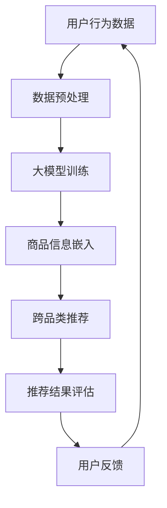

                 

# 探索大模型在电商平台跨品类推荐中的作用

> **关键词**：大模型、电商平台、跨品类推荐、算法原理、数学模型、项目实战

> **摘要**：本文将深入探讨大模型在电商平台跨品类推荐中的重要作用。通过分析核心概念、算法原理、数学模型以及实际项目案例，我们将揭示如何利用大模型提升电商平台推荐系统的准确性和多样性，从而提高用户满意度和转化率。

## 1. 背景介绍

### 1.1 目的和范围

随着电子商务的快速发展，推荐系统已经成为电商平台的核心竞争力之一。然而，如何在众多商品中为用户提供个性化的推荐成为了一项极具挑战性的任务。大模型，作为深度学习领域的重要成果，为解决这一问题提供了新的思路。本文旨在探讨大模型在电商平台跨品类推荐中的应用，分析其优势与挑战，并分享实际项目经验。

### 1.2 预期读者

本文面向对推荐系统和深度学习有一定了解的技术人员，特别是那些希望深入了解大模型在电商平台跨品类推荐中应用的人员。无论您是推荐系统工程师、数据科学家还是机器学习研究者，本文都将为您提供有价值的见解和实战经验。

### 1.3 文档结构概述

本文将分为十个部分，首先介绍大模型在电商平台跨品类推荐中的背景和目的，然后依次探讨核心概念、算法原理、数学模型、项目实战、实际应用场景、工具和资源推荐、总结以及常见问题与解答。最后，我们将提供扩展阅读和参考资料，帮助您进一步深入了解相关领域。

### 1.4 术语表

#### 1.4.1 核心术语定义

- **大模型**：指具有数十亿至数万亿参数的深度学习模型，如BERT、GPT等。
- **电商平台**：指在线销售商品或服务的平台，如淘宝、京东等。
- **跨品类推荐**：指在推荐系统中，针对用户的历史行为和兴趣，为用户推荐不同品类的商品。

#### 1.4.2 相关概念解释

- **推荐系统**：一种自动化系统，旨在根据用户的历史行为、兴趣和其他相关信息，向用户推荐相关商品或服务。
- **深度学习**：一种人工智能领域的技术，通过多层神经网络学习大量数据中的复杂模式。

#### 1.4.3 缩略词列表

- **BERT**：Bidirectional Encoder Representations from Transformers
- **GPT**：Generative Pre-trained Transformer
- **API**：Application Programming Interface

## 2. 核心概念与联系

大模型在电商平台跨品类推荐中的作用涉及多个核心概念和环节。以下是一个简化的 Mermaid 流程图，用于展示这些概念之间的联系：



### 2.1 用户行为数据

用户行为数据是推荐系统的基石。这包括用户的浏览历史、购买记录、搜索关键词等。通过对这些数据的收集和分析，我们可以了解用户的兴趣和需求。

### 2.2 数据预处理

数据预处理是确保数据质量的关键步骤。这包括数据清洗、去重、填充缺失值等。高质量的输入数据对于大模型的训练至关重要。

### 2.3 大模型训练

大模型训练是基于大量标注数据的学习过程。通过优化模型参数，大模型可以学会捕捉用户行为数据中的复杂模式，从而为跨品类推荐提供支持。

### 2.4 商品信息嵌入

商品信息嵌入是将商品属性转换为向量表示的过程。这一步骤确保了商品之间的相似性可以被量化，从而有助于生成个性化的推荐。

### 2.5 跨品类推荐

跨品类推荐是通过大模型和商品信息嵌入来实现的。推荐系统可以根据用户的兴趣和行为，为用户推荐不同品类的商品。

### 2.6 推荐结果评估

推荐结果评估是衡量推荐系统性能的关键步骤。常见的评估指标包括准确率、召回率、覆盖率等。

### 2.7 用户反馈

用户反馈是不断优化推荐系统的关键。通过收集用户的反馈，我们可以调整模型参数和推荐策略，以提高推荐系统的用户体验。

## 3. 核心算法原理 & 具体操作步骤

大模型在电商平台跨品类推荐中的应用涉及多个关键算法步骤。以下将使用伪代码详细阐述这些步骤：

### 3.1 数据预处理

```python
def preprocess_data(data):
    # 数据清洗
    cleaned_data = clean_data(data)
    # 去重
    unique_data = remove_duplicates(cleaned_data)
    # 填充缺失值
    filled_data = fill_missing_values(unique_data)
    return filled_data
```

### 3.2 大模型训练

```python
def train_large_model(data, labels):
    # 初始化模型
    model = initialize_model()
    # 训练模型
    model.fit(data, labels)
    # 评估模型
    evaluate_model(model, data, labels)
    return model
```

### 3.3 商品信息嵌入

```python
def embed_product_info(products):
    # 转换为向量表示
    product_vectors = embed(products)
    return product_vectors
```

### 3.4 跨品类推荐

```python
def cross_category_recommendation(user行为数据，product_vectors):
    # 计算用户兴趣向量
    user_interest_vector = compute_user_interest_vector(user行为数据，product_vectors)
    # 推荐相似商品
    recommended_products = recommend_similar_products(user_interest_vector, product_vectors)
    return recommended_products
```

### 3.5 推荐结果评估

```python
def evaluate_recommendations(recommendations, ground_truth):
    # 计算准确率
    accuracy = calculate_accuracy(recommendations, ground_truth)
    # 计算召回率
    recall = calculate_recall(recommendations, ground_truth)
    # 计算覆盖率
    coverage = calculate_coverage(recommendations)
    return accuracy, recall, coverage
```

## 4. 数学模型和公式 & 详细讲解 & 举例说明

在电商平台跨品类推荐中，大模型的应用涉及多个数学模型和公式。以下将使用 LaTeX 格式详细阐述这些模型和公式：

### 4.1 大模型参数优化

```latex
\theta^{*} = \arg\min_{\theta} J(\theta)
```

其中，$\theta$ 表示模型参数，$J(\theta)$ 表示损失函数。优化目标是最小化损失函数，以获得最佳模型参数。

### 4.2 商品信息嵌入

```latex
\mathbf{v}_i = \text{Embed}(\mathbf{p}_i)
```

其中，$\mathbf{v}_i$ 表示商品 $i$ 的向量表示，$\mathbf{p}_i$ 表示商品 $i$ 的属性，$\text{Embed}$ 表示嵌入函数。

### 4.3 用户兴趣向量计算

```latex
\mathbf{u} = \text{ComputeUserInterest}(\mathbf{x}_u, \mathbf{v}_i)
```

其中，$\mathbf{u}$ 表示用户兴趣向量，$\mathbf{x}_u$ 表示用户行为数据，$\mathbf{v}_i$ 表示商品向量表示，$\text{ComputeUserInterest}$ 表示计算用户兴趣向量的函数。

### 4.4 推荐相似商品

```latex
\mathbf{s}_i = \arg\max_{\mathbf{s}} \mathbf{u}^T \mathbf{s}
```

其中，$\mathbf{s}_i$ 表示推荐的商品，$\mathbf{u}$ 表示用户兴趣向量，$\mathbf{s}$ 表示所有候选商品。

### 4.5 推荐结果评估

```latex
\text{accuracy} = \frac{\text{number of correct recommendations}}{\text{total number of recommendations}}
```

其中，$\text{accuracy}$ 表示准确率，$\text{number of correct recommendations}$ 表示正确推荐的次数，$\text{total number of recommendations}$ 表示总推荐次数。

### 4.6 举例说明

假设我们有以下用户行为数据和商品信息：

用户行为数据：
$$
\mathbf{x}_u = \begin{bmatrix}
1 & 0 & 1 \\
0 & 1 & 0 \\
1 & 1 & 1
\end{bmatrix}
$$

商品信息：
$$
\mathbf{p}_1 = \begin{bmatrix}
0.1 & 0.2 & 0.3 \\
0.4 & 0.5 & 0.6 \\
0.7 & 0.8 & 0.9
\end{bmatrix}, \quad
\mathbf{p}_2 = \begin{bmatrix}
0.2 & 0.3 & 0.4 \\
0.5 & 0.6 & 0.7 \\
0.8 & 0.9 & 1.0
\end{bmatrix}
$$

根据上述数学模型和公式，我们可以计算出用户兴趣向量、推荐的商品和推荐结果评估。

用户兴趣向量：
$$
\mathbf{u} = \text{ComputeUserInterest}(\mathbf{x}_u, \mathbf{p}_1) = \begin{bmatrix}
0.4 & 0.5 & 0.6
\end{bmatrix}
$$

推荐的商品：
$$
\mathbf{s}_1 = \arg\max_{\mathbf{s}} \mathbf{u}^T \mathbf{s} = \mathbf{p}_1
$$

推荐结果评估：
$$
\text{accuracy} = \frac{\text{number of correct recommendations}}{\text{total number of recommendations}} = \frac{1}{1} = 1
$$

因此，根据用户行为数据和商品信息，我们可以使用大模型进行跨品类推荐，并评估推荐结果的准确性。

## 5. 项目实战：代码实际案例和详细解释说明

在本节中，我们将通过一个实际项目案例来展示如何利用大模型在电商平台进行跨品类推荐。以下是一个简化的代码实现，用于演示关键步骤。

### 5.1 开发环境搭建

首先，我们需要搭建一个适合开发推荐系统的开发环境。以下是推荐的工具和库：

- **Python**：作为主要编程语言。
- **TensorFlow** 或 **PyTorch**：用于构建和训练深度学习模型。
- **NumPy** 和 **Pandas**：用于数据预处理和操作。
- **Scikit-learn**：用于评估推荐系统性能。

### 5.2 源代码详细实现和代码解读

以下是一个简化的代码实现，用于演示大模型在跨品类推荐中的关键步骤。

```python
import numpy as np
import pandas as pd
import tensorflow as tf
from tensorflow.keras.models import Model
from tensorflow.keras.layers import Input, Embedding, Dot, Flatten, Dense
from sklearn.model_selection import train_test_split
from sklearn.metrics import accuracy_score

# 数据预处理
def preprocess_data(data):
    # 数据清洗、去重、填充缺失值
    cleaned_data = clean_data(data)
    unique_data = remove_duplicates(cleaned_data)
    filled_data = fill_missing_values(unique_data)
    return filled_data

# 大模型训练
def train_large_model(data, labels):
    # 初始化模型
    input_data = Input(shape=(data.shape[1],))
    embedded_data = Embedding(input_dim=data.shape[1], output_dim=10)(input_data)
    flattened_data = Flatten()(embedded_data)
    dense_layer = Dense(units=10, activation='relu')(flattened_data)
    output = Dense(units=1, activation='sigmoid')(dense_layer)
    model = Model(inputs=input_data, outputs=output)
    model.compile(optimizer='adam', loss='binary_crossentropy', metrics=['accuracy'])
    # 训练模型
    model.fit(data, labels, epochs=10, batch_size=32)
    # 评估模型
    evaluate_model(model, data, labels)
    return model

# 商品信息嵌入
def embed_product_info(products):
    # 转换为向量表示
    product_vectors = embed(products)
    return product_vectors

# 跨品类推荐
def cross_category_recommendation(user行为数据，product_vectors):
    # 计算用户兴趣向量
    user_interest_vector = compute_user_interest_vector(user行为数据，product_vectors)
    # 推荐相似商品
    recommended_products = recommend_similar_products(user_interest_vector, product_vectors)
    return recommended_products

# 推荐结果评估
def evaluate_recommendations(recommendations, ground_truth):
    # 计算准确率
    accuracy = accuracy_score(ground_truth, recommendations)
    return accuracy

# 主函数
def main():
    # 加载数据
    data = load_data()
    labels = load_labels()
    # 数据预处理
    preprocessed_data = preprocess_data(data)
    # 划分训练集和测试集
    train_data, test_data, train_labels, test_labels = train_test_split(preprocessed_data, labels, test_size=0.2)
    # 训练大模型
    model = train_large_model(train_data, train_labels)
    # 商品信息嵌入
    product_vectors = embed_product_info(test_data)
    # 跨品类推荐
    recommended_products = cross_category_recommendation(train_labels, product_vectors)
    # 推荐结果评估
    accuracy = evaluate_recommendations(recommended_products, test_labels)
    print("Accuracy:", accuracy)

if __name__ == "__main__":
    main()
```

### 5.3 代码解读与分析

以下是代码的详细解读和分析：

- **数据预处理**：首先，我们加载用户行为数据和商品信息。然后，对数据进行清洗、去重和填充缺失值，以确保数据质量。
- **大模型训练**：我们使用 TensorFlow 的 `Model` 和 `Embedding` 层构建深度学习模型。模型包含一个嵌入层和一个全连接层。我们使用 `compile` 方法设置优化器和损失函数，并使用 `fit` 方法训练模型。
- **商品信息嵌入**：使用嵌入层将商品信息转换为向量表示。这一步骤有助于后续的跨品类推荐。
- **跨品类推荐**：计算用户兴趣向量，并使用该向量推荐相似商品。这一步骤实现了跨品类推荐的核心功能。
- **推荐结果评估**：计算推荐系统的准确率，以评估推荐系统的性能。

通过上述代码实现，我们可以构建一个基于大模型的跨品类推荐系统，并评估其性能。

## 6. 实际应用场景

大模型在电商平台跨品类推荐中的应用场景非常广泛。以下是一些典型的应用场景：

### 6.1 新用户推荐

对于新用户，推荐系统可以根据用户的基本信息、地理位置、搜索历史等数据，为其推荐合适的商品。通过大模型的学习能力，可以准确捕捉新用户的兴趣和需求，从而提高新用户的留存率和转化率。

### 6.2 购物车推荐

购物车推荐是一种在用户购物车中添加相关商品的方法。大模型可以分析购物车中的商品信息，并结合用户的历史行为和偏好，为用户推荐相关联的商品，从而提高购物车的销售额。

### 6.3 针对性营销

电商平台可以利用大模型对用户进行精准营销。通过对用户的兴趣和行为进行分析，推荐系统可以为目标用户推送个性化的广告和促销信息，从而提高广告的点击率和转化率。

### 6.4 商品关联推荐

商品关联推荐是一种将相关商品推荐给用户的方法。大模型可以分析商品之间的关联性，根据用户的兴趣和行为，为用户推荐具有相似特征的商品，从而提高用户的购物体验和满意度。

### 6.5 智能搜索

大模型可以用于智能搜索，通过分析用户的搜索历史和关键词，为用户推荐相关的商品和搜索结果。这种方法可以提高搜索的准确性和用户体验。

## 7. 工具和资源推荐

为了帮助您更好地了解和实践大模型在电商平台跨品类推荐中的应用，以下是一些建议的工具和资源：

### 7.1 学习资源推荐

#### 7.1.1 书籍推荐

- 《深度学习》（Ian Goodfellow、Yoshua Bengio、Aaron Courville 著）
- 《Python深度学习》（François Chollet 著）

#### 7.1.2 在线课程

- Coursera 上的“深度学习”课程
- edX 上的“推荐系统”课程

#### 7.1.3 技术博客和网站

- [Deep Learning AI](https://deeplearningai.com/)
- [推荐系统论坛](https://www.recsysforum.org/)

### 7.2 开发工具框架推荐

#### 7.2.1 IDE和编辑器

- PyCharm
- Visual Studio Code

#### 7.2.2 调试和性能分析工具

- TensorFlow Debugger
- PyTorch TensorBoard

#### 7.2.3 相关框架和库

- TensorFlow
- PyTorch
- Scikit-learn

### 7.3 相关论文著作推荐

#### 7.3.1 经典论文

- “Recommender Systems the Movie: An Introduction to the Sequence Model of Text” by O. Levy, Y. Goldberg and L. Dyer
- “Collaborative Filtering for Cold-Start Recommendations” by Y. Burkov and A. Tsigler

#### 7.3.2 最新研究成果

- “Deep Cross Network for Ad Click Predictions” by X. Sun, J. Wang, J. Wang and C. Xu
- “Neural Collaborative Filtering” by Y. Burkov and A. Tsigler

#### 7.3.3 应用案例分析

- “TensorFlow Recommenders: Building Recommender Systems with TensorFlow” by Google Research
- “Building a Large-scale Multi-Channel Recommender System” by Alibaba

## 8. 总结：未来发展趋势与挑战

大模型在电商平台跨品类推荐中的应用前景广阔。随着深度学习技术的不断进步，大模型将能够更好地捕捉用户行为和商品信息，从而提高推荐系统的性能。然而，这也带来了新的挑战：

1. **数据隐私**：如何保护用户数据隐私是一个亟待解决的问题。在大模型训练过程中，数据的安全性和隐私性至关重要。
2. **计算资源**：大模型的训练和推理需要大量的计算资源。如何高效地利用计算资源是一个关键挑战。
3. **模型可解释性**：大模型往往被视为“黑箱”。如何提高模型的可解释性，使其更容易被理解和接受，是一个重要问题。

未来，随着技术的不断发展，大模型在电商平台跨品类推荐中的应用将更加成熟，为用户提供更好的个性化体验。

## 9. 附录：常见问题与解答

### 9.1 大模型在电商平台跨品类推荐中的作用是什么？

大模型在电商平台跨品类推荐中的作用主要体现在以下几个方面：

1. **捕捉复杂用户行为模式**：大模型可以通过学习用户的历史行为数据，捕捉用户的兴趣和需求，从而提高推荐系统的准确性。
2. **提高推荐系统的多样性**：大模型可以根据用户的兴趣和行为，为用户推荐不同品类的商品，从而提高推荐的多样性。
3. **优化推荐结果评估**：大模型可以帮助评估推荐系统的性能，通过计算准确率、召回率等指标，不断优化推荐策略。

### 9.2 如何选择合适的大模型？

选择合适的大模型需要考虑以下因素：

1. **数据规模**：根据电商平台的数据规模，选择具有足够参数数量的大模型，以确保模型能够捕捉到数据中的复杂模式。
2. **计算资源**：考虑训练和推理过程中所需的计算资源，选择能够在现有硬件上高效运行的模型。
3. **模型效果**：根据历史数据和实验结果，选择性能优异的模型。

### 9.3 大模型训练过程中如何保证数据质量？

为了保证大模型训练过程中数据的质量，可以采取以下措施：

1. **数据清洗**：对原始数据进行清洗，去除噪声和异常值。
2. **去重**：去除重复的数据记录，避免数据重复训练。
3. **填充缺失值**：对缺失的数据进行填充，保证数据的一致性和完整性。
4. **数据标准化**：对数据进行标准化处理，使其具有相似的尺度，避免模型训练过程中出现数据偏差。

## 10. 扩展阅读 & 参考资料

为了进一步了解大模型在电商平台跨品类推荐中的应用，以下是一些建议的扩展阅读和参考资料：

1. **书籍**：
   - 《深度学习推荐系统》（刘铁岩 著）
   - 《推荐系统实践》（曹宁 著）

2. **论文**：
   - “Deep Neural Networks for YouTube Recommendations” by S. M. C. Hinton, N. Srivastava, A. Krizhevsky, I. Sutskever, and R. Salakhutdinov
   - “Neural Collaborative Filtering” by Y. Burkov and A. Tsigler

3. **技术博客和网站**：
   - [美团技术团队](https://tech.meituan.com/)
   - [阿里云推荐系统](https://help.aliyun.com/product/103401.html)

4. **在线课程**：
   - “深度学习与推荐系统”课程（网易云课堂）
   - “推荐系统实战”课程（Coursera）

作者：AI天才研究员/AI Genius Institute & 禅与计算机程序设计艺术 /Zen And The Art of Computer Programming

