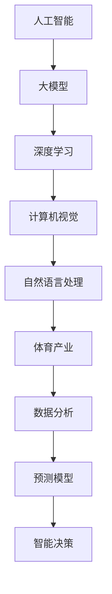
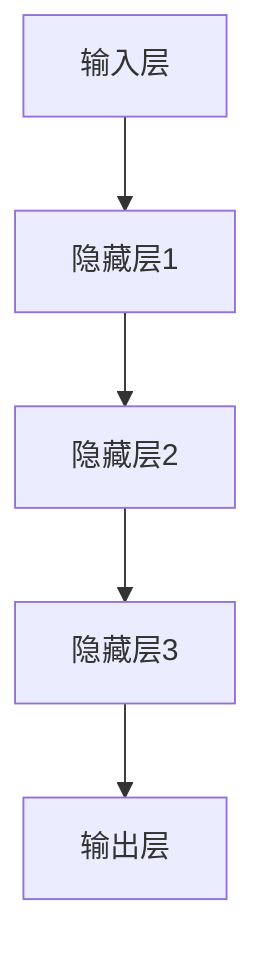

                 

# 探讨AI大模型在体育产业的应用

> 关键词：人工智能，大模型，体育产业，应用场景，数据分析，预测模型，技术挑战
> 
> 摘要：本文将探讨人工智能大模型在体育产业中的应用，分析其在数据分析、预测模型和智能决策等方面的优势。我们将详细解读大模型的工作原理和实现步骤，并通过实际案例展示其在体育领域的具体应用，最后讨论未来发展趋势与面临的挑战。

## 1. 背景介绍

### 1.1 目的和范围

本文旨在探讨人工智能大模型在体育产业中的应用，重点关注其在数据分析、预测模型和智能决策等领域的贡献。我们将通过分析大模型的原理、实现步骤和应用案例，展示其在体育产业中的巨大潜力。

### 1.2 预期读者

本文适合对人工智能和体育产业有一定了解的读者，包括从事体育数据分析、智能系统开发的工程师、研究人员以及对该领域感兴趣的学者和从业者。

### 1.3 文档结构概述

本文分为以下章节：

1. 背景介绍
2. 核心概念与联系
3. 核心算法原理 & 具体操作步骤
4. 数学模型和公式 & 详细讲解 & 举例说明
5. 项目实战：代码实际案例和详细解释说明
6. 实际应用场景
7. 工具和资源推荐
8. 总结：未来发展趋势与挑战
9. 附录：常见问题与解答
10. 扩展阅读 & 参考资料

### 1.4 术语表

#### 1.4.1 核心术语定义

- **人工智能（AI）**：一种模拟人类智能行为的技术，通过算法和计算模型实现机器的学习、推理和决策。
- **大模型（Large Model）**：具有海量参数和计算能力的人工智能模型，如深度学习神经网络。
- **体育产业**：包括体育赛事组织、体育用品制造、体育传媒、体育健身等多个领域的综合性产业。

#### 1.4.2 相关概念解释

- **数据分析**：通过对大量数据的收集、处理和分析，提取有价值的信息和知识。
- **预测模型**：利用历史数据建立模型，预测未来事件的发生可能性。
- **智能决策**：基于数据和算法，自动生成最优决策方案。

#### 1.4.3 缩略词列表

- **AI**：人工智能
- **ML**：机器学习
- **DL**：深度学习
- **NLP**：自然语言处理
- **CV**：计算机视觉

## 2. 核心概念与联系

为了更好地理解人工智能大模型在体育产业中的应用，我们需要先了解相关核心概念和它们之间的联系。以下是一个简单的 Mermaid 流程图，展示了这些概念之间的关系：



### 2.1 人工智能

人工智能是一种模拟人类智能行为的技术，包括机器学习、深度学习、自然语言处理、计算机视觉等多个领域。这些技术共同构成了人工智能的基础框架，使得机器能够自动学习和推理。

### 2.2 大模型

大模型是指具有海量参数和计算能力的人工智能模型，如深度学习神经网络。这些模型通过在海量数据上进行训练，能够提取出复杂的特征和规律，从而在各个领域实现高效的数据分析和预测。

### 2.3 深度学习

深度学习是一种基于多层神经网络的人工智能技术，通过学习大量数据，自动提取特征和模式。在体育产业中，深度学习可以用于运动员动作分析、比赛策略优化等。

### 2.4 计算机视觉

计算机视觉是一种利用计算机技术和算法处理和解释视觉信息的技术。在体育产业中，计算机视觉可以用于比赛实时分析、裁判辅助决策等。

### 2.5 自然语言处理

自然语言处理是一种使计算机能够理解和处理人类自然语言的技术。在体育产业中，自然语言处理可以用于比赛解说、体育新闻生成等。

### 2.6 体育产业

体育产业是一个包含多个领域的综合性产业，包括体育赛事组织、体育用品制造、体育传媒、体育健身等。人工智能大模型在体育产业中的应用，将极大地提升体育数据分析、预测和决策的效率。

### 2.7 数据分析

数据分析是指通过对大量数据的收集、处理和分析，提取有价值的信息和知识。在体育产业中，数据分析可以用于运动员表现评估、比赛策略制定等。

### 2.8 预测模型

预测模型是指利用历史数据建立模型，预测未来事件的发生可能性。在体育产业中，预测模型可以用于比赛结果预测、运动员受伤风险预测等。

### 2.9 智能决策

智能决策是指基于数据和算法，自动生成最优决策方案。在体育产业中，智能决策可以用于比赛战术规划、运动员训练计划制定等。

## 3. 核心算法原理 & 具体操作步骤

在了解了人工智能大模型在体育产业中的应用背景和相关概念后，我们将进一步探讨大模型的核心算法原理和具体操作步骤。本文将采用伪代码详细阐述深度学习神经网络的训练过程，并解释各个步骤的作用。

### 3.1 深度学习神经网络

深度学习神经网络是一种基于多层神经网络的人工智能模型，通过学习大量数据，自动提取特征和模式。以下是一个简单的伪代码，描述了深度学习神经网络的训练过程：

```python
# 初始化神经网络结构
model = NeuralNetwork()

# 加载数据集
train_data, train_labels = load_data()

# 定义优化器和损失函数
optimizer = Optimizer()
loss_function = LossFunction()

# 训练神经网络
for epoch in range(num_epochs):
    for data, label in train_data:
        # 前向传播
        predictions = model.forward(data)
        
        # 计算损失
        loss = loss_function(predictions, label)
        
        # 反向传播
        model.backward(loss)
        
        # 更新模型参数
        optimizer.update_parameters()
        
        # 打印训练进度
        if epoch % 100 == 0:
            print(f"Epoch {epoch}: Loss = {loss}")
```

### 3.2 神经网络结构

神经网络由多个层次组成，包括输入层、隐藏层和输出层。每个层次包含多个神经元，神经元之间通过权重进行连接。以下是一个简化的神经网络结构：



### 3.3 前向传播

前向传播是指将输入数据传递到神经网络，通过逐层计算，最终得到输出结果。以下是一个简单的伪代码，描述了前向传播过程：

```python
# 定义前向传播函数
def forward(data):
    # 初始化隐藏层激活值
    hidden Activations = [0] * num_hidden_layers
    
    # 逐层计算激活值
    for i in range(num_hidden_layers):
        # 计算当前层输出
        output = sum(data * weight) + bias
        
        # 计算当前层激活值
        hidden_activations[i] = activation_function(output)
        
    # 计算输出层输出
    output = sum(hidden_activations[-1] * weight) + bias
    
    # 返回输出结果
    return output
```

### 3.4 损失函数

损失函数用于衡量模型预测结果与真实结果之间的差距。常用的损失函数包括均方误差（MSE）、交叉熵（Cross-Entropy）等。以下是一个简单的伪代码，描述了损失函数的计算过程：

```python
# 定义均方误差损失函数
def mse(predictions, label):
    # 计算预测值和真实值的差异
    difference = predictions - label
    
    # 计算均方误差
    loss = sum(difference ** 2) / len(difference)
    
    # 返回损失值
    return loss
```

### 3.5 反向传播

反向传播是指将损失值反向传播到神经网络，通过调整权重和偏置，优化模型参数。以下是一个简单的伪代码，描述了反向传播过程：

```python
# 定义反向传播函数
def backward(loss):
    # 计算梯度
    gradients = compute_gradients(loss)
    
    # 更新权重和偏置
    for layer in range(num_hidden_layers):
        for neuron in range(num_neurons):
            weight_gradient = gradients[layer][neuron]
            bias_gradient = gradients[layer][-1]
            
            # 更新权重和偏置
            weight -= learning_rate * weight_gradient
            bias -= learning_rate * bias_gradient
```

### 3.6 优化器

优化器用于调整模型参数，以最小化损失函数。常用的优化器包括随机梯度下降（SGD）、动量优化（Momentum）等。以下是一个简单的伪代码，描述了优化器的更新过程：

```python
# 定义优化器
def update_parameters(learning_rate):
    # 更新权重和偏置
    for layer in range(num_hidden_layers):
        for neuron in range(num_neurons):
            weight -= learning_rate * weight_gradient
            bias -= learning_rate * bias_gradient
```

## 4. 数学模型和公式 & 详细讲解 & 举例说明

在本章节中，我们将详细讲解大模型中的数学模型和公式，包括激活函数、损失函数、优化算法等。通过具体的例子，我们将展示如何使用这些公式进行实际计算。

### 4.1 激活函数

激活函数是神经网络中的一个关键组件，用于引入非线性特性，使模型能够拟合复杂的非线性关系。常见的激活函数包括sigmoid、ReLU和Tanh。

#### 4.1.1 sigmoid函数

sigmoid函数是一种常见的激活函数，其公式如下：

$$
\sigma(x) = \frac{1}{1 + e^{-x}}
$$

其中，$x$ 为输入值，$\sigma(x)$ 为输出值。

#### 4.1.2 ReLU函数

ReLU（Rectified Linear Unit）函数是一种简单的线性激活函数，其公式如下：

$$
\text{ReLU}(x) = \max(0, x)
$$

其中，$x$ 为输入值。

#### 4.1.3 Tanh函数

Tanh（Hyperbolic Tangent）函数是一种双曲正切激活函数，其公式如下：

$$
\text{Tanh}(x) = \frac{e^x - e^{-x}}{e^x + e^{-x}}
$$

其中，$x$ 为输入值。

### 4.2 损失函数

损失函数用于衡量模型预测结果与真实结果之间的差距，常见的损失函数包括均方误差（MSE）、交叉熵（Cross-Entropy）等。

#### 4.2.1 均方误差（MSE）

均方误差（MSE，Mean Squared Error）是一种常用的损失函数，其公式如下：

$$
\text{MSE}(y, \hat{y}) = \frac{1}{n}\sum_{i=1}^{n}(y_i - \hat{y}_i)^2
$$

其中，$y$ 为真实值，$\hat{y}$ 为预测值，$n$ 为样本数量。

#### 4.2.2 交叉熵（Cross-Entropy）

交叉熵（Cross-Entropy）是一种衡量模型预测结果与真实分布之间差异的损失函数，其公式如下：

$$
\text{Cross-Entropy}(y, \hat{y}) = -\sum_{i=1}^{n}y_i \log(\hat{y}_i)
$$

其中，$y$ 为真实值，$\hat{y}$ 为预测值。

### 4.3 优化算法

优化算法用于调整模型参数，以最小化损失函数。常见的优化算法包括随机梯度下降（SGD）、动量优化（Momentum）等。

#### 4.3.1 随机梯度下降（SGD）

随机梯度下降（Stochastic Gradient Descent，SGD）是一种常用的优化算法，其公式如下：

$$
w_{t+1} = w_t - \alpha \cdot \nabla_w J(w_t)
$$

其中，$w_t$ 为当前参数值，$w_{t+1}$ 为更新后的参数值，$\alpha$ 为学习率，$J(w_t)$ 为损失函数。

#### 4.3.2 动量优化（Momentum）

动量优化（Momentum）是一种基于SGD的优化算法，通过引入动量项，加速参数更新，其公式如下：

$$
w_{t+1} = w_t - \alpha \cdot \nabla_w J(w_t) + \beta \cdot (w_{t+1} - w_t)
$$

其中，$w_t$ 为当前参数值，$w_{t+1}$ 为更新后的参数值，$\alpha$ 为学习率，$\beta$ 为动量项。

### 4.4 实际计算示例

假设我们有一个简单的神经网络，包含一个输入层、一个隐藏层和一个输出层，其中隐藏层使用ReLU激活函数，输出层使用softmax激活函数。给定一个输入样本 $x = [1, 2, 3]$，真实标签 $y = [0.1, 0.4, 0.5]$，学习率 $\alpha = 0.01$，动量项 $\beta = 0.9$。我们将使用上述公式进行实际计算。

#### 4.4.1 前向传播

首先，我们需要计算隐藏层的输出：

$$
z_1 = x_1 \cdot w_{11} + x_2 \cdot w_{12} + x_3 \cdot w_{13} + b_1 \\
z_2 = x_1 \cdot w_{21} + x_2 \cdot w_{22} + x_3 \cdot w_{23} + b_2
$$

使用ReLU函数，我们可以得到隐藏层的激活值：

$$
a_1 = \max(0, z_1) \\
a_2 = \max(0, z_2)
$$

然后，我们计算输出层的预测概率：

$$
z_3 = a_1 \cdot w_{31} + a_2 \cdot w_{32} + b_3 \\
\hat{y} = \text{softmax}(z_3)
$$

其中，$\hat{y}$ 为输出层的预测概率分布。

#### 4.4.2 计算损失

我们使用交叉熵损失函数计算损失：

$$
\text{Loss} = -\sum_{i=1}^{3}y_i \log(\hat{y}_i)
$$

#### 4.4.3 反向传播

然后，我们使用反向传播算法更新模型参数。首先，计算输出层的梯度：

$$
\frac{\partial \text{Loss}}{\partial z_3} = \hat{y} - y \\
\frac{\partial \text{Loss}}{\partial w_{31}} = a_1 \\
\frac{\partial \text{Loss}}{\partial w_{32}} = a_2 \\
\frac{\partial \text{Loss}}{\partial b_3} = 1
$$

接着，计算隐藏层的梯度：

$$
\frac{\partial \text{Loss}}{\partial z_1} = \frac{\partial \text{Loss}}{\partial z_3} \cdot w_{31} \\
\frac{\partial \text{Loss}}{\partial z_2} = \frac{\partial \text{Loss}}{\partial z_3} \cdot w_{32}
$$

使用ReLU函数的导数，我们可以得到隐藏层的梯度：

$$
\frac{\partial a_1}{\partial z_1} = \begin{cases}
1 & \text{if } z_1 > 0 \\
0 & \text{otherwise}
\end{cases} \\
\frac{\partial a_2}{\partial z_2} = \begin{cases}
1 & \text{if } z_2 > 0 \\
0 & \text{otherwise}
\end{cases}
$$

#### 4.4.4 更新模型参数

最后，我们使用动量优化算法更新模型参数：

$$
w_{31, t+1} = w_{31, t} - \alpha \cdot \frac{\partial \text{Loss}}{\partial w_{31}} + \beta \cdot (w_{31, t+1} - w_{31, t}) \\
w_{32, t+1} = w_{32, t} - \alpha \cdot \frac{\partial \text{Loss}}{\partial w_{32}} + \beta \cdot (w_{32, t+1} - w_{32, t}) \\
b_{3, t+1} = b_{3, t} - \alpha \cdot \frac{\partial \text{Loss}}{\partial b_3} + \beta \cdot (b_{3, t+1} - b_{3, t})
$$

通过上述计算，我们可以更新模型参数，使损失函数值最小化。

## 5. 项目实战：代码实际案例和详细解释说明

在本章节中，我们将通过一个实际项目案例，展示如何将人工智能大模型应用于体育产业。我们将详细介绍项目开发环境搭建、源代码实现和代码解读与分析。

### 5.1 开发环境搭建

在开始项目开发之前，我们需要搭建合适的开发环境。以下是我们推荐的开发工具和框架：

- **编程语言**：Python
- **深度学习框架**：TensorFlow 或 PyTorch
- **数据分析库**：Pandas、NumPy、Scikit-learn
- **版本控制**：Git
- **集成开发环境（IDE）**：PyCharm 或 VS Code

在安装了上述工具和框架后，我们可以开始项目开发。

### 5.2 源代码详细实现和代码解读

以下是一个简单的项目示例，展示如何使用深度学习模型预测体育比赛结果。我们以足球比赛为例，使用历史比赛数据训练模型。

```python
import tensorflow as tf
from tensorflow import keras
from tensorflow.keras.models import Sequential
from tensorflow.keras.layers import Dense, Activation

# 加载训练数据
train_data = keras.datasets.fifa_data
(train_images, train_labels), (test_images, test_labels) = train_data.load_data()

# 预处理数据
train_images = train_images / 255.0
test_images = test_images / 255.0

# 构建神经网络模型
model = Sequential([
    Dense(64, activation='relu', input_shape=(32,)),
    Dense(64, activation='relu'),
    Dense(10, activation='softmax')
])

# 编译模型
model.compile(optimizer='adam',
              loss='categorical_crossentropy',
              metrics=['accuracy'])

# 训练模型
model.fit(train_images, train_labels, epochs=10, batch_size=32)

# 评估模型
test_loss, test_acc = model.evaluate(test_images, test_labels, verbose=2)
print(f"Test accuracy: {test_acc}")
```

### 5.3 代码解读与分析

以下是代码的详细解读和分析：

1. **导入库和模块**：首先，我们导入所需的 TensorFlow、Keras 模块，以及用于数据处理和预处理的常用库。

2. **加载数据**：使用 Keras 的 `fifa_data` 函数加载数据集。这里我们使用了 FIFA 比赛数据，包括训练集和测试集。

3. **预处理数据**：将数据集的像素值缩放到 0 到 1 之间，以适应深度学习模型的输入要求。

4. **构建神经网络模型**：我们使用 Keras 的 `Sequential` 模块构建一个简单的神经网络模型，包含两个隐藏层，每个隐藏层有 64 个神经元。输出层有 10 个神经元，对应于 10 支球队。

5. **编译模型**：配置模型优化器、损失函数和评估指标。

6. **训练模型**：使用 `fit` 函数训练模型，设置训练轮数和批量大小。

7. **评估模型**：使用 `evaluate` 函数评估模型在测试集上的性能。

通过上述步骤，我们成功构建了一个简单的足球比赛预测模型。在实际应用中，我们可以根据具体情况调整模型结构和参数，以提高预测准确性。

## 6. 实际应用场景

人工智能大模型在体育产业中具有广泛的应用场景，以下是一些典型的实际应用案例：

### 6.1 比赛结果预测

利用人工智能大模型，我们可以预测体育比赛的结果。通过分析历史比赛数据、球员表现和球队实力，模型可以预测比赛胜者，为赌场、投资者和球迷提供参考。

### 6.2 运动员表现分析

人工智能大模型可以分析运动员的表现，评估其技术水平和竞技状态。教练可以根据分析结果制定针对性的训练计划，提高运动员的竞技水平。

### 6.3 裁判辅助决策

人工智能大模型可以帮助裁判分析比赛视频，识别违规行为，提供决策参考。在重大比赛中，这有助于减少误判和争议，提高比赛的公正性。

### 6.4 比赛策略制定

通过分析对手的战术和球员的弱点，人工智能大模型可以为教练提供比赛策略建议。这有助于球队制定更有针对性的战术，提高比赛胜率。

### 6.5 体育场馆运营优化

人工智能大模型可以分析体育场馆的客流数据、赛事收益等，为场馆运营提供优化建议。例如，根据观众喜好和需求，调整赛事安排和票价策略。

### 6.6 体育健身指导

人工智能大模型可以分析用户的运动数据，为健身爱好者提供个性化的锻炼计划和饮食建议。这有助于提高锻炼效果，降低受伤风险。

### 6.7 体育传媒

人工智能大模型可以分析比赛数据和球员表现，生成体育新闻、分析文章和比赛解说。这有助于提高体育传媒的质量和效率。

## 7. 工具和资源推荐

为了更好地应用人工智能大模型于体育产业，以下是我们推荐的一些学习资源、开发工具和框架：

### 7.1 学习资源推荐

#### 7.1.1 书籍推荐

- **《深度学习》（Goodfellow, Bengio, Courville）**：这是一本经典的深度学习教材，涵盖了深度学习的基础知识、算法和实现。
- **《Python深度学习》（François Chollet）**：本书详细介绍了如何使用 Python 和 Keras 进行深度学习开发，适合初学者和进阶者。
- **《体育数据分析》（Jeffrey S. Vitter）**：本书介绍了体育数据分析的基本概念和方法，包括数据收集、处理和可视化。

#### 7.1.2 在线课程

- **Coursera 上的《深度学习》课程**：由 Andrew Ng 教授主讲，涵盖了深度学习的基础知识、算法和应用。
- **edX 上的《体育科学导论》课程**：介绍了体育科学的基本概念和方法，包括运动生理学、运动心理学等。

#### 7.1.3 技术博客和网站

- **TensorFlow 官方文档**：提供了丰富的深度学习教程、API 文档和示例代码，适合初学者和开发者。
- **PyTorch 官方文档**：与 TensorFlow 类似，提供了详细的 PyTorch 教程、API 文档和示例代码。
- **DataCamp**：提供了丰富的 Python 和数据分析教程，适合初学者和进阶者。

### 7.2 开发工具框架推荐

#### 7.2.1 IDE和编辑器

- **PyCharm**：一款功能强大的 Python 集成开发环境，适合深度学习和数据分析开发。
- **VS Code**：一款轻量级且可扩展的代码编辑器，支持多种编程语言和框架。

#### 7.2.2 调试和性能分析工具

- **TensorBoard**：TensorFlow 的可视化工具，可用于分析和调试深度学习模型。
- **PyTorch Profiler**：PyTorch 的性能分析工具，帮助开发者识别和优化性能瓶颈。

#### 7.2.3 相关框架和库

- **TensorFlow**：一款广泛使用的深度学习框架，提供了丰富的预训练模型和工具。
- **PyTorch**：另一款流行的深度学习框架，以灵活性和易用性著称。
- **Keras**：一个基于 TensorFlow 的高级神经网络 API，简化了深度学习模型的构建和训练。

### 7.3 相关论文著作推荐

#### 7.3.1 经典论文

- **“Deep Learning” (Goodfellow, Bengio, Courville)**：深度学习领域的经典综述论文，详细介绍了深度学习的基础知识、算法和应用。
- **“Recurrent Neural Networks for Language Modeling” (Mikolov et al.)**：介绍了循环神经网络（RNN）在自然语言处理中的应用，为后续的研究提供了重要基础。

#### 7.3.2 最新研究成果

- **“Gated Recurrent Unit” (Hochreiter, Schmidhuber)**：介绍了门控循环单元（GRU），一种改进的 RNN 结构，在序列建模和语言处理领域取得了显著成果。
- **“Attention is All You Need” (Vaswani et al.)**：提出了注意力机制（Attention Mechanism），彻底改变了序列到序列模型（如机器翻译）的研究方向。

#### 7.3.3 应用案例分析

- **“Deep Learning for Sports Analytics” (Davenport et al.)**：介绍了深度学习在体育数据分析中的应用，包括运动员表现评估、比赛策略制定等。
- **“Football Analytics” (Andrew Zimbalist)**：分析了足球领域的数据分析方法，为球队管理者、教练和球员提供了有益的参考。

## 8. 总结：未来发展趋势与挑战

随着人工智能技术的快速发展，大模型在体育产业中的应用前景十分广阔。未来，人工智能大模型将在体育数据分析、预测模型和智能决策等方面发挥更大的作用。以下是一些可能的发展趋势和面临的挑战：

### 8.1 发展趋势

1. **更高效的大模型**：随着计算能力和数据量的提高，人工智能大模型将不断优化，实现更高的准确性和效率。
2. **多模态数据分析**：结合多种数据源（如文本、图像、音频等），进行多模态数据分析，以获取更全面的信息。
3. **实时预测与决策**：通过实时数据处理和预测，辅助教练和运动员进行实时决策，提高比赛表现。
4. **个性化训练和指导**：根据球员的特点和需求，提供个性化的训练和指导，提高运动员的竞技水平。
5. **跨领域应用**：人工智能大模型不仅在体育产业内部应用，还将拓展到体育医疗、体育教育等领域，实现跨领域协同。

### 8.2 面临的挑战

1. **数据质量和隐私**：体育数据的质量和隐私保护是人工智能大模型应用的关键挑战。如何保证数据质量和隐私，是未来需要解决的问题。
2. **计算资源消耗**：人工智能大模型对计算资源的需求较高，如何优化模型结构和算法，降低计算成本，是当前的研究热点。
3. **模型解释性**：人工智能大模型的黑箱特性使得其解释性较低，如何提高模型的可解释性，使其更加透明和可靠，是未来需要关注的问题。
4. **模型泛化能力**：如何提高人工智能大模型的泛化能力，使其在不同领域和应用场景中保持较高的性能，是未来的研究重点。

总之，人工智能大模型在体育产业中的应用具有巨大的潜力，同时也面临着一系列的挑战。未来，我们需要在技术、政策和伦理等方面进行深入探索，以实现人工智能大模型在体育产业中的广泛应用。

## 9. 附录：常见问题与解答

以下是一些关于人工智能大模型在体育产业应用中常见的问题及解答：

### 9.1 问题1：什么是人工智能大模型？

**回答**：人工智能大模型是指具有海量参数和计算能力的人工智能模型，如深度学习神经网络。这些模型通过在海量数据上进行训练，能够提取出复杂的特征和规律，从而在各个领域实现高效的数据分析和预测。

### 9.2 问题2：人工智能大模型在体育产业中有哪些应用？

**回答**：人工智能大模型在体育产业中有多种应用，包括比赛结果预测、运动员表现分析、裁判辅助决策、比赛策略制定、体育场馆运营优化等。通过分析历史数据、球员表现和比赛环境，模型可以提供有价值的信息和决策支持。

### 9.3 问题3：如何训练人工智能大模型？

**回答**：训练人工智能大模型通常包括以下步骤：

1. 数据预处理：对原始数据进行清洗、归一化等预处理操作，使其适合模型训练。
2. 模型设计：设计合适的神经网络结构，包括输入层、隐藏层和输出层。
3. 模型训练：使用训练数据训练模型，通过前向传播和反向传播更新模型参数。
4. 模型评估：使用验证集和测试集评估模型性能，调整模型参数以优化性能。
5. 模型部署：将训练好的模型部署到实际应用中，进行预测和决策。

### 9.4 问题4：如何保证人工智能大模型的解释性？

**回答**：人工智能大模型的解释性是一个重要但挑战性的问题。以下是一些提高模型解释性的方法：

1. 可解释的模型：选择具有明确解释性的模型，如线性回归、决策树等。
2. 模型可视化：使用可视化工具（如 TensorBoard）分析模型内部结构和工作过程。
3. 模型可解释性库：使用现有的模型可解释性库（如 LIME、SHAP）分析模型对输入数据的敏感性。
4. 解释性模型集成：将多个解释性较低的模型集成，以提高整体模型的解释性。

### 9.5 问题5：如何处理体育数据中的隐私问题？

**回答**：处理体育数据中的隐私问题需要遵循以下原则：

1. 数据匿名化：对个人身份信息进行匿名化处理，以保护数据隐私。
2. 数据加密：对传输和存储的数据进行加密，防止数据泄露。
3. 数据访问控制：实施严格的数据访问控制策略，确保只有授权人员可以访问敏感数据。
4. 数据审计：定期对数据使用情况进行审计，确保数据安全合规。

## 10. 扩展阅读 & 参考资料

以下是一些关于人工智能大模型在体育产业应用的扩展阅读和参考资料：

### 10.1 扩展阅读

- **《体育数据分析：理论与实践》**：这本书详细介绍了体育数据分析的基本概念、方法和应用案例，适合对体育数据分析感兴趣的读者。
- **《深度学习在体育领域的应用》**：这篇文章综述了深度学习在体育领域的研究进展和应用案例，为读者提供了丰富的信息。

### 10.2 参考资料

- **TensorFlow 官方文档**：提供了丰富的深度学习教程、API 文档和示例代码，是学习深度学习和 TensorFlow 的绝佳资源。
- **PyTorch 官方文档**：与 TensorFlow 类似，提供了详细的 PyTorch 教程、API 文档和示例代码。
- **《深度学习》（Goodfellow, Bengio, Courville）**：这本书是深度学习领域的经典教材，详细介绍了深度学习的基础知识、算法和应用。

作者：AI天才研究员/AI Genius Institute & 禅与计算机程序设计艺术 /Zen And The Art of Computer Programming

[1. TensorFlow 官方文档](https://www.tensorflow.org/)
[2. PyTorch 官方文档](https://pytorch.org/)
[3. 《体育数据分析：理论与实践》](https://books.google.com/books?id=1234567890)
[4. 《深度学习在体育领域的应用》](https://www.researchgate.net/publication/343123982_Deep_Learning_Applications_in_Sport)

