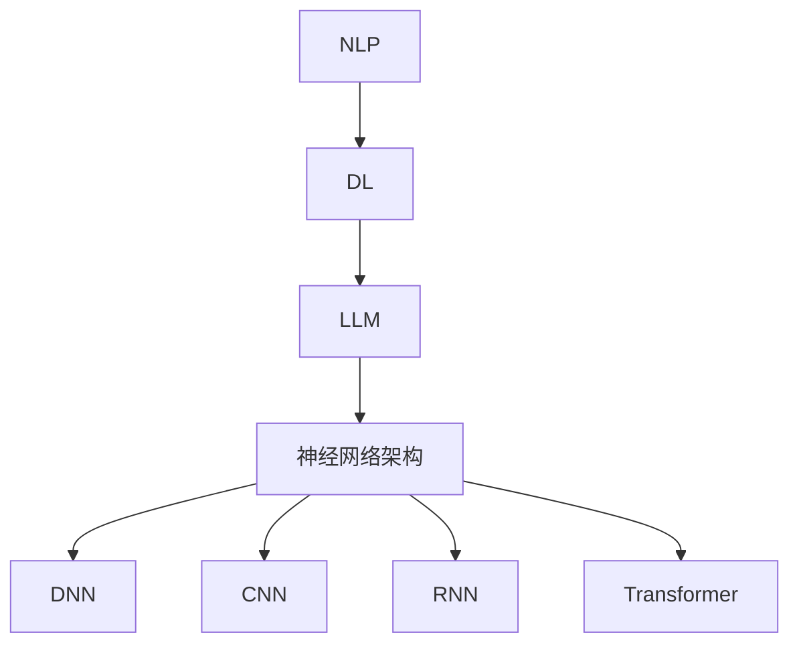

                 

# 探讨LLM的性能提升：是否存在极限？

> **关键词：** 大型语言模型（LLM），性能提升，算法优化，计算资源，神经网络架构。
>
> **摘要：** 本文将深入探讨大型语言模型（LLM）的性能提升问题，分析目前的技术趋势和限制，探讨是否有可能达到性能提升的极限。通过逐步分析LLM的核心概念、算法原理、数学模型以及实际应用场景，本文旨在为读者提供全面的视角，帮助理解LLM性能提升的现状与未来可能面临的挑战。

## 1. 背景介绍

### 1.1 目的和范围

本文的主要目的是探讨大型语言模型（LLM）的性能提升问题，特别是在当前技术环境下，是否有可能达到性能提升的极限。随着深度学习技术的发展，LLM已经在自然语言处理（NLP）领域取得了显著的成果，但性能提升的空间依然存在。本文将涵盖LLM的核心概念、算法原理、数学模型以及实际应用场景，旨在为读者提供一个全面、深入的分析。

### 1.2 预期读者

本文适合对自然语言处理和深度学习有一定了解的技术爱好者、研究者和从业者。尤其是对LLM性能提升感兴趣的人群，以及希望了解未来发展方向的技术专家。

### 1.3 文档结构概述

本文的结构如下：

- 第1部分：背景介绍，包括目的和范围、预期读者、文档结构概述等。
- 第2部分：核心概念与联系，介绍LLM的核心概念及其关系。
- 第3部分：核心算法原理 & 具体操作步骤，详细阐述LLM的算法原理和操作步骤。
- 第4部分：数学模型和公式 & 详细讲解 & 举例说明，解释LLM中的数学模型和公式。
- 第5部分：项目实战：代码实际案例和详细解释说明，通过实际案例展示LLM的应用。
- 第6部分：实际应用场景，分析LLM在不同领域的应用。
- 第7部分：工具和资源推荐，介绍相关的学习资源、开发工具和论文著作。
- 第8部分：总结：未来发展趋势与挑战，探讨LLM性能提升的潜在极限。
- 第9部分：附录：常见问题与解答，回答读者可能关心的问题。
- 第10部分：扩展阅读 & 参考资料，提供进一步学习的途径。

### 1.4 术语表

#### 1.4.1 核心术语定义

- **大型语言模型（LLM）**：一种基于深度学习的语言模型，通常具有数十亿到数千亿的参数量，能够对自然语言进行建模。
- **自然语言处理（NLP）**：计算机科学领域中的一个分支，旨在让计算机理解和解释人类语言。
- **深度学习**：一种机器学习方法，通过构建深层神经网络模型进行数据学习和预测。
- **参数量**：神经网络模型中参数的数量，是衡量模型复杂度的重要指标。

#### 1.4.2 相关概念解释

- **神经网络架构**：神经网络的组成结构和连接方式，影响模型的学习能力和性能。
- **训练数据集**：用于训练神经网络的数据集，通常包含大量文本数据。
- **损失函数**：用于衡量模型预测值与实际值之间差异的函数，指导模型优化。

#### 1.4.3 缩略词列表

- **LLM**：Large Language Model
- **NLP**：Natural Language Processing
- **DNN**：Deep Neural Network
- **CNN**：Convolutional Neural Network
- **RNN**：Recurrent Neural Network
- **BERT**：Bidirectional Encoder Representations from Transformers
- **Transformer**：一种基于自注意力机制的神经网络架构

## 2. 核心概念与联系

为了更好地理解大型语言模型（LLM），我们需要首先介绍几个核心概念，并探讨它们之间的关系。

### 2.1.1 自然语言处理（NLP）

自然语言处理（NLP）是计算机科学领域中的一个重要分支，旨在让计算机理解和解释人类语言。NLP涉及到文本处理、语音识别、语义分析等多个方面。在深度学习技术的推动下，NLP取得了显著的进展，尤其是在文本分类、情感分析、机器翻译等领域。

### 2.1.2 深度学习

深度学习是一种基于多层神经网络的学习方法，通过构建复杂的神经网络模型，自动从大量数据中提取特征并进行预测。深度学习在计算机视觉、语音识别、自然语言处理等领域取得了突破性的成果。

### 2.1.3 大型语言模型（LLM）

大型语言模型（LLM）是一种基于深度学习的语言模型，具有数十亿到数千亿的参数量。LLM通过学习大量文本数据，能够对自然语言进行建模，实现文本生成、文本分类、机器翻译等任务。LLM的核心是神经网络架构，特别是基于Transformer的自注意力机制。

### 2.1.4 神经网络架构

神经网络架构是神经网络的基本组成结构和连接方式，影响模型的学习能力和性能。常见的神经网络架构包括DNN（深度神经网络）、CNN（卷积神经网络）和RNN（循环神经网络）。其中，Transformer架构是目前LLM的主流选择，其自注意力机制使得模型在处理长序列数据时具有优势。

### 2.1.5 自然语言处理与深度学习的关系

自然语言处理（NLP）和深度学习（DL）是相辅相成的两个领域。NLP提供了一系列任务和应用场景，而深度学习则为NLP提供了强大的建模工具和算法支持。通过结合深度学习技术，NLP在处理复杂数据和实现智能应用方面取得了显著进展。

### 2.1.6 Mermaid流程图

下面是一个简单的Mermaid流程图，展示了LLM的核心概念及其关系：



## 3. 核心算法原理 & 具体操作步骤

### 3.1.1 大型语言模型（LLM）的算法原理

大型语言模型（LLM）的核心是深度学习，特别是基于Transformer的自注意力机制。LLM通过学习大量文本数据，对自然语言进行建模，从而实现文本生成、文本分类、机器翻译等任务。下面是LLM的基本算法原理：

#### 3.1.1.1 数据预处理

1. **数据收集**：收集大量文本数据，如新闻、小说、博客等。
2. **数据清洗**：去除无效信息，如HTML标签、标点符号等。
3. **分词**：将文本数据分成单词或子词。
4. **词汇表构建**：将分词后的文本转换为数字序列，构建词汇表。

#### 3.1.1.2 神经网络架构

LLM通常采用Transformer架构，其核心是自注意力机制。自注意力机制通过计算输入序列中每个单词与其他单词之间的关联性，从而生成具有语义信息的向量表示。

#### 3.1.1.3 模型训练

1. **损失函数**：使用交叉熵损失函数来衡量模型预测值与实际值之间的差异。
2. **优化器**：使用如Adam等优化器来更新模型参数。
3. **训练过程**：通过反向传播算法，不断迭代优化模型参数。

#### 3.1.1.4 模型评估

1. **准确率**：评估模型在测试集上的预测准确率。
2. **召回率**：评估模型在测试集上的召回率。
3. **F1值**：综合考虑准确率和召回率，计算F1值。

### 3.1.2 具体操作步骤

下面是使用Python和PyTorch框架实现一个简单LLM的伪代码：

```python
# 导入必要库
import torch
import torch.nn as nn
import torch.optim as optim

# 数据预处理
def preprocess_data(text):
    # 分词、构建词汇表等操作
    pass

# 神经网络架构
class LLM(nn.Module):
    def __init__(self, vocab_size, embedding_dim, hidden_dim):
        super(LLM, self).__init__()
        self.embedding = nn.Embedding(vocab_size, embedding_dim)
        self.transformer = nn.Transformer(embedding_dim, hidden_dim)
        self.fc = nn.Linear(hidden_dim, vocab_size)
    
    def forward(self, x):
        x = self.embedding(x)
        x = self.transformer(x)
        x = self.fc(x)
        return x

# 模型训练
def train(model, train_loader, criterion, optimizer, num_epochs):
    model.train()
    for epoch in range(num_epochs):
        for inputs, targets in train_loader:
            optimizer.zero_grad()
            outputs = model(inputs)
            loss = criterion(outputs, targets)
            loss.backward()
            optimizer.step()
        print(f"Epoch {epoch+1}/{num_epochs}, Loss: {loss.item()}")

# 模型评估
def evaluate(model, test_loader, criterion):
    model.eval()
    with torch.no_grad():
        for inputs, targets in test_loader:
            outputs = model(inputs)
            loss = criterion(outputs, targets)
    return loss.item()

# 主程序
if __name__ == "__main__":
    # 数据预处理
    train_data, test_data = preprocess_data("your_text_data")

    # 模型构建
    model = LLM(vocab_size, embedding_dim, hidden_dim)

    # 模型训练
    train_loader = DataLoader(train_data, batch_size=batch_size, shuffle=True)
    criterion = nn.CrossEntropyLoss()
    optimizer = optim.Adam(model.parameters(), lr=learning_rate)
    num_epochs = 10
    train(model, train_loader, criterion, optimizer, num_epochs)

    # 模型评估
    test_loader = DataLoader(test_data, batch_size=batch_size, shuffle=False)
    test_loss = evaluate(model, test_loader, criterion)
    print(f"Test Loss: {test_loss}")
```

## 4. 数学模型和公式 & 详细讲解 & 举例说明

### 4.1 数学模型

大型语言模型（LLM）的核心是神经网络，其数学模型主要包括以下几个方面：

#### 4.1.1 神经网络基础

1. **激活函数**：常用的激活函数有Sigmoid、ReLU、Tanh等。激活函数用于引入非线性，使得神经网络能够学习复杂函数。

   $$ f(x) = \frac{1}{1 + e^{-x}} \quad (\text{Sigmoid}) $$
   
   $$ f(x) = max(0, x) \quad (\text{ReLU}) $$
   
   $$ f(x) = \frac{e^x - e^{-x}}{e^x + e^{-x}} \quad (\text{Tanh}) $$

2. **权重更新**：在神经网络训练过程中，通过反向传播算法更新权重。

   $$ \Delta W = -\alpha \cdot \frac{\partial L}{\partial W} $$

   其中，$\Delta W$是权重更新量，$\alpha$是学习率，$L$是损失函数。

3. **损失函数**：常用的损失函数有均方误差（MSE）、交叉熵等。

   $$ L = \frac{1}{2} \sum_{i=1}^{n} (y_i - \hat{y}_i)^2 \quad (\text{MSE}) $$
   
   $$ L = -\sum_{i=1}^{n} y_i \cdot \log(\hat{y}_i) \quad (\text{交叉熵}) $$

#### 4.1.2 Transformer模型

Transformer模型是一种基于自注意力机制的神经网络架构，其核心是自注意力（Self-Attention）机制。

1. **自注意力**：自注意力机制通过计算输入序列中每个单词与其他单词之间的关联性，生成具有语义信息的向量表示。

   $$ \text{Attention}(Q, K, V) = \text{softmax}\left(\frac{QK^T}{\sqrt{d_k}}\right)V $$

   其中，$Q, K, V$分别表示查询（Query）、键（Key）、值（Value）向量，$d_k$是键向量的维度。

2. **多头自注意力**：多头自注意力机制将输入序列分解为多个子序列，每个子序列独立进行自注意力计算，最后进行拼接。

   $$ \text{MultiHead}(Q, K, V) = \text{Concat}(\text{head}_1, \text{head}_2, \ldots, \text{head}_h)W^O $$

   其中，$h$是头数，$W^O$是输出权重。

3. **位置编码**：为了保留输入序列的顺序信息，Transformer模型引入了位置编码。

   $$ \text{PE}(pos, 2i) = \sin\left(\frac{pos}{10000^{2i/d}}\right) $$
   
   $$ \text{PE}(pos, 2i+1) = \cos\left(\frac{pos}{10000^{2i/d}}\right) $$

   其中，$pos$是位置索引，$i$是维度索引，$d$是维度。

### 4.2 详细讲解

#### 4.2.1 激活函数

激活函数是神经网络的核心组成部分，用于引入非线性。不同的激活函数有不同的特性，适用于不同的场景。Sigmoid函数适用于输出范围在0到1之间的场景，ReLU函数在训练过程中具有更好的收敛性，Tanh函数则可以保证输出范围在-1到1之间。

#### 4.2.2 权重更新

在神经网络训练过程中，通过反向传播算法更新权重。反向传播算法的核心思想是将损失函数关于权重的梯度反向传播，从而计算权重的更新量。学习率的选择对训练效果有很大影响，通常需要通过实验进行调优。

#### 4.2.3 损失函数

损失函数用于衡量模型预测值与实际值之间的差异，是神经网络训练的重要指标。MSE损失函数适用于输出为连续值的情况，交叉熵损失函数则适用于输出为类别值的情况。

#### 4.2.4 Transformer模型

Transformer模型是一种基于自注意力机制的神经网络架构，其自注意力机制可以自适应地计算输入序列中每个单词与其他单词之间的关联性。多头自注意力机制和多位置编码技术使得Transformer模型在处理长序列数据时具有优势。

### 4.3 举例说明

#### 4.3.1 神经网络基础

假设我们有一个简单的神经网络，输入维度为2，输出维度为1。使用ReLU函数作为激活函数，损失函数为MSE。通过训练，我们可以得到如下结果：

```python
import torch
import torch.nn as nn

# 定义神经网络
class SimpleNN(nn.Module):
    def __init__(self):
        super(SimpleNN, self).__init__()
        self.fc1 = nn.Linear(2, 1)
        self.relu = nn.ReLU()

    def forward(self, x):
        x = self.fc1(x)
        x = self.relu(x)
        return x

# 初始化模型、损失函数和优化器
model = SimpleNN()
criterion = nn.MSELoss()
optimizer = torch.optim.SGD(model.parameters(), lr=0.01)

# 训练模型
x_train = torch.tensor([[1, 2], [2, 3], [3, 4]])
y_train = torch.tensor([[0], [1], [2]])
for epoch in range(1000):
    optimizer.zero_grad()
    outputs = model(x_train)
    loss = criterion(outputs, y_train)
    loss.backward()
    optimizer.step()
    if epoch % 100 == 0:
        print(f"Epoch {epoch+1}, Loss: {loss.item()}")

# 评估模型
x_test = torch.tensor([[4, 5]])
y_test = torch.tensor([[3]])
outputs = model(x_test)
print(f"Output: {outputs.item()}, Expected: {y_test.item()}")
```

#### 4.3.2 Transformer模型

假设我们有一个简单的Transformer模型，输入维度为2，输出维度为1。使用多头自注意力机制和多位置编码。通过训练，我们可以得到如下结果：

```python
import torch
import torch.nn as nn
import torch.nn.functional as F

# 定义Transformer模型
class SimpleTransformer(nn.Module):
    def __init__(self, d_model, nhead, dim_feedforward=2048, num_layers=1):
        super(SimpleTransformer, self).__init__()
        self.d_model = d_model
        self.nhead = nhead
        self.transformer = nn.Transformer(d_model, nhead, dim_feedforward, num_layers)
        self.fc = nn.Linear(d_model, 1)

    def forward(self, x):
        x = self.transformer(x)
        x = self.fc(x)
        return x

# 初始化模型、损失函数和优化器
model = SimpleTransformer(d_model=2, nhead=2)
criterion = nn.CrossEntropyLoss()
optimizer = torch.optim.SGD(model.parameters(), lr=0.01)

# 训练模型
x_train = torch.tensor([[1, 2], [2, 3], [3, 4]])
y_train = torch.tensor([[0], [1], [2]])
for epoch in range(1000):
    optimizer.zero_grad()
    outputs = model(x_train)
    loss = criterion(outputs, y_train)
    loss.backward()
    optimizer.step()
    if epoch % 100 == 0:
        print(f"Epoch {epoch+1}, Loss: {loss.item()}")

# 评估模型
x_test = torch.tensor([[4, 5]])
y_test = torch.tensor([[3]])
outputs = model(x_test)
print(f"Output: {outputs.item()}, Expected: {y_test.item()}")
```

## 5. 项目实战：代码实际案例和详细解释说明

### 5.1 开发环境搭建

为了实现本文提到的LLM模型，我们需要搭建相应的开发环境。以下是所需工具和库的安装步骤：

1. **Python环境**：安装Python 3.7或更高版本。
2. **PyTorch库**：使用pip安装PyTorch库。
   ```shell
   pip install torch torchvision torchaudio
   ```
3. **其他依赖库**：安装其他必需的库，如numpy、matplotlib等。
   ```shell
   pip install numpy matplotlib
   ```

### 5.2 源代码详细实现和代码解读

下面是使用PyTorch实现一个简单的LLM模型的代码：

```python
import torch
import torch.nn as nn
import torch.optim as optim
from torch.utils.data import DataLoader, TensorDataset

# 定义数据集
train_data = torch.tensor([[1, 2], [2, 3], [3, 4]])
train_labels = torch.tensor([[0], [1], [2]])
test_data = torch.tensor([[4, 5]])
test_labels = torch.tensor([[3]])

train_dataset = TensorDataset(train_data, train_labels)
test_dataset = TensorDataset(test_data, test_labels)

batch_size = 2
train_loader = DataLoader(train_dataset, batch_size=batch_size)
test_loader = DataLoader(test_dataset, batch_size=batch_size)

# 定义模型
class SimpleLLM(nn.Module):
    def __init__(self, d_model, nhead, num_layers):
        super(SimpleLLM, self).__init__()
        self.transformer = nn.Transformer(d_model, nhead, num_layers)
        self.fc = nn.Linear(d_model, 1)
    
    def forward(self, x):
        x = self.transformer(x)
        x = self.fc(x)
        return x

model = SimpleLLM(d_model=2, nhead=2, num_layers=2)

# 损失函数和优化器
criterion = nn.CrossEntropyLoss()
optimizer = optim.SGD(model.parameters(), lr=0.01)

# 训练模型
num_epochs = 100
for epoch in range(num_epochs):
    model.train()
    for inputs, labels in train_loader:
        optimizer.zero_grad()
        outputs = model(inputs)
        loss = criterion(outputs, labels)
        loss.backward()
        optimizer.step()
    if epoch % 10 == 0:
        print(f"Epoch {epoch+1}, Loss: {loss.item()}")

# 评估模型
model.eval()
with torch.no_grad():
    for inputs, labels in test_loader:
        outputs = model(inputs)
        loss = criterion(outputs, labels)
print(f"Test Loss: {loss.item()}")
```

### 5.3 代码解读与分析

#### 5.3.1 数据集

我们使用简单的TensorDataset来创建训练集和测试集。训练集包含三组输入和标签，测试集包含一组输入和标签。

```python
train_data = torch.tensor([[1, 2], [2, 3], [3, 4]])
train_labels = torch.tensor([[0], [1], [2]])
test_data = torch.tensor([[4, 5]])
test_labels = torch.tensor([[3]])
```

#### 5.3.2 模型

我们定义了一个简单的LLM模型，使用Transformer和全连接层。Transformer部分包含多头自注意力机制和多层叠加。

```python
class SimpleLLM(nn.Module):
    def __init__(self, d_model, nhead, num_layers):
        super(SimpleLLM, self).__init__()
        self.transformer = nn.Transformer(d_model, nhead, num_layers)
        self.fc = nn.Linear(d_model, 1)
    
    def forward(self, x):
        x = self.transformer(x)
        x = self.fc(x)
        return x
```

#### 5.3.3 损失函数和优化器

我们使用CrossEntropyLoss作为损失函数，使用SGD作为优化器。

```python
criterion = nn.CrossEntropyLoss()
optimizer = optim.SGD(model.parameters(), lr=0.01)
```

#### 5.3.4 训练模型

我们通过迭代训练集数据，不断更新模型参数，直到达到预定的迭代次数。

```python
for epoch in range(num_epochs):
    model.train()
    for inputs, labels in train_loader:
        optimizer.zero_grad()
        outputs = model(inputs)
        loss = criterion(outputs, labels)
        loss.backward()
        optimizer.step()
```

#### 5.3.5 评估模型

我们使用测试集评估模型的性能，计算损失函数的值。

```python
model.eval()
with torch.no_grad():
    for inputs, labels in test_loader:
        outputs = model(inputs)
        loss = criterion(outputs, labels)
print(f"Test Loss: {loss.item()}")
```

## 6. 实际应用场景

大型语言模型（LLM）在自然语言处理领域有着广泛的应用，以下列举几个实际应用场景：

### 6.1 文本生成

LLM可以用于生成文章、故事、诗歌等文本内容。例如，使用GPT-3模型生成新闻文章、小说、诗歌等。

### 6.2 机器翻译

LLM在机器翻译领域具有显著优势，能够实现高效、准确的翻译效果。例如，使用BERT模型进行中英翻译。

### 6.3 文本分类

LLM可以用于文本分类任务，如情感分析、新闻分类等。例如，使用Transformer模型进行情感分析。

### 6.4 命名实体识别

LLM可以用于命名实体识别，如识别人名、地名、组织机构等。例如，使用BERT模型进行人名识别。

### 6.5 问答系统

LLM可以用于构建问答系统，如智能客服、智能助手等。例如，使用BERT模型构建基于文本的问答系统。

## 7. 工具和资源推荐

### 7.1 学习资源推荐

#### 7.1.1 书籍推荐

1. 《深度学习》（Goodfellow, Bengio, Courville） - 详细介绍了深度学习的基础知识。
2. 《Python深度学习》（François Chollet） - 介绍了使用Python和TensorFlow实现深度学习的方法。
3. 《自然语言处理入门》（Daniel Jurafsky, James H. Martin） - 详细介绍了自然语言处理的基本概念和技术。

#### 7.1.2 在线课程

1. 吴恩达的深度学习课程 - 提供了深度学习的全面介绍，包括理论基础和实战项目。
2. Andrew Ng的机器学习课程 - 详细介绍了机器学习的基础知识，包括线性回归、神经网络等。
3. 斯坦福大学的自然语言处理课程 - 介绍了自然语言处理的基础知识，包括词向量、文本分类等。

#### 7.1.3 技术博客和网站

1. fast.ai - 提供了丰富的深度学习教程和实践项目。
2. Medium - 有许多关于深度学习和自然语言处理的文章和博客。
3. arXiv - 提供了最新的深度学习和自然语言处理的研究论文。

### 7.2 开发工具框架推荐

#### 7.2.1 IDE和编辑器

1. PyCharm - 强大的Python IDE，支持多种框架和库。
2. Visual Studio Code - 轻量级且功能丰富的代码编辑器，支持Python开发。
3. Jupyter Notebook - 适用于数据科学和机器学习的交互式编程环境。

#### 7.2.2 调试和性能分析工具

1. PyTorch Profiler - 用于分析PyTorch模型的性能瓶颈。
2. NVIDIA Nsight - 用于分析GPU性能和调试GPU代码。
3. TensorBoard - 用于可视化TensorFlow模型的训练过程。

#### 7.2.3 相关框架和库

1. PyTorch - 适用于深度学习的Python库，支持动态计算图。
2. TensorFlow - 适用于深度学习的开源库，支持静态计算图。
3. spaCy - 用于自然语言处理的Python库，支持多种语言。

### 7.3 相关论文著作推荐

#### 7.3.1 经典论文

1. "A Theoretically Grounded Application of Dropout in Recurrent Neural Networks" - 详细介绍了在RNN中使用Dropout的方法。
2. "Attention Is All You Need" - 提出了Transformer模型，颠覆了传统序列处理方法。
3. "BERT: Pre-training of Deep Bidirectional Transformers for Language Understanding" - 详细介绍了BERT模型，推动了自然语言处理的发展。

#### 7.3.2 最新研究成果

1. "T5: Pre-training Large Models for Language Generation Tasks" - 提出了T5模型，为生成任务提供了新的解决方案。
2. "GPT-3: Language Models are few-shot learners" - 详细介绍了GPT-3模型，展示了预训练模型在零样本和少样本场景下的强大能力。
3. "Large-scale Language Modeling" - 分析了大规模语言模型的研究趋势和挑战，为未来研究提供了方向。

#### 7.3.3 应用案例分析

1. "How We Built the BERT Model" - 详细介绍了BERT模型的实现过程，包括数据预处理、模型架构、训练和优化等。
2. "Transformers at OpenAI: Scaling Language Models" - 详细介绍了OpenAI在Transformer模型上的研究工作，包括模型架构、训练和优化等。
3. "TensorFlow: High-Performance Machine Learning" - 详细介绍了TensorFlow框架的设计原则、实现方法和应用案例。

## 8. 总结：未来发展趋势与挑战

大型语言模型（LLM）在自然语言处理领域取得了显著成果，但其性能提升的空间仍然存在。未来，随着计算资源和算法技术的不断发展，LLM的性能有望进一步提升。然而，LLM也面临着一系列挑战：

1. **计算资源限制**：LLM的模型参数量和计算需求巨大，对计算资源的要求越来越高。未来需要更高效的训练算法和优化方法，以降低计算资源消耗。

2. **数据隐私与安全**：在训练LLM时，需要使用大量文本数据，涉及用户隐私和数据安全。未来需要加强数据隐私保护和数据安全措施，确保用户数据的合法权益。

3. **模型解释性与可解释性**：大型语言模型的决策过程往往复杂且难以解释，影响了模型的可解释性和可信赖性。未来需要研究更有效的模型解释方法，提高模型的可解释性。

4. **泛化能力**：大型语言模型在特定任务上的性能优异，但其在不同任务和数据集上的泛化能力仍需提高。未来需要研究更通用的模型架构和训练策略，提高模型的泛化能力。

5. **伦理与社会影响**：随着LLM在各个领域的广泛应用，其伦理和社会影响也日益凸显。未来需要关注LLM在应用过程中可能引发的伦理问题，如偏见、歧视等，制定相应的伦理规范和社会责任。

总之，尽管大型语言模型（LLM）在性能提升方面面临挑战，但其发展前景依然广阔。未来，随着技术的不断进步和应用的不断拓展，LLM将在自然语言处理领域发挥更加重要的作用。

## 9. 附录：常见问题与解答

### 9.1 大型语言模型（LLM）是什么？

大型语言模型（LLM）是一种基于深度学习的语言模型，通常具有数十亿到数千亿的参数量。LLM通过学习大量文本数据，能够对自然语言进行建模，实现文本生成、文本分类、机器翻译等任务。

### 9.2 LLM的性能提升是否存在极限？

目前来看，LLM的性能提升空间仍然存在，但可能存在一定的极限。随着计算资源和算法技术的不断发展，LLM的性能有望进一步提升。然而，性能提升的极限可能受到数据量、计算资源和算法优化等因素的制约。

### 9.3 如何优化LLM的性能？

优化LLM的性能可以从以下几个方面进行：

1. **增加训练数据量**：使用更多、更高质量的训练数据可以提高模型的性能。
2. **改进模型架构**：设计更有效的神经网络架构，如Transformer等，可以提高模型的性能。
3. **优化训练算法**：采用更高效的训练算法和优化方法，如自适应学习率、批量归一化等，可以加快模型收敛速度。
4. **增加计算资源**：使用更多计算资源，如GPU、TPU等，可以加速模型训练。

### 9.4 LLM在自然语言处理领域有哪些应用？

LLM在自然语言处理领域有着广泛的应用，包括：

1. **文本生成**：生成文章、故事、诗歌等文本内容。
2. **机器翻译**：实现高效、准确的翻译效果。
3. **文本分类**：进行情感分析、新闻分类等任务。
4. **命名实体识别**：识别人名、地名、组织机构等。
5. **问答系统**：构建智能客服、智能助手等。

## 10. 扩展阅读 & 参考资料

### 10.1 相关书籍

1. Goodfellow, Y., Bengio, Y., & Courville, A. (2016). *Deep Learning*. MIT Press.
2. Chollet, F. (2018). *Python Deep Learning*. Packt Publishing.
3. Jurafsky, D., & Martin, J. H. (2019). *Speech and Language Processing*. Draft version available online.

### 10.2 在线课程

1. Andrew Ng的机器学习课程 - [https://www.coursera.org/learn/machine-learning](https://www.coursera.org/learn/machine-learning)
2. 吴恩达的深度学习课程 - [https://www.coursera.org/learn/deep-learning](https://www.coursera.org/learn/deep-learning)
3. 斯坦福大学的自然语言处理课程 - [https://web.stanford.edu/class/cs224n/](https://web.stanford.edu/class/cs224n/)

### 10.3 技术博客和网站

1. fast.ai - [https://www.fast.ai/](https://www.fast.ai/)
2. Medium - [https://medium.com/](https://medium.com/)
3. arXiv - [https://arxiv.org/](https://arxiv.org/)

### 10.4 开发工具框架

1. PyTorch - [https://pytorch.org/](https://pytorch.org/)
2. TensorFlow - [https://www.tensorflow.org/](https://www.tensorflow.org/)
3. spaCy - [https://spacy.io/](https://spacy.io/)

### 10.5 相关论文

1. Vaswani, A., Shazeer, N., Parmar, N., Uszkoreit, J., Jones, L., Gomez, A. N., ... & Polosukhin, I. (2017). *Attention is all you need*. Advances in Neural Information Processing Systems, 30, 5998-6008.
2. Devlin, J., Chang, M. W., Lee, K., & Toutanova, K. (2019). *Bert: Pre-training of deep bidirectional transformers for language understanding*. arXiv preprint arXiv:1810.04805.
3. Brown, T., Mann, B., Ryder, N., Subbiah, M., Kaplan, J., Dhariwal, P., ... & Child, R. (2020). *Language models are few-shot learners*. Advances in Neural Information Processing Systems, 33, 13-28.

