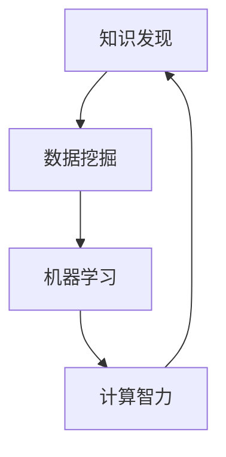

                 

# 推动知识发现与创新：人类计算的智力贡献

## 关键词

- 人工智能
- 知识发现
- 知识创新
- 计算智能
- 算法设计
- 数学模型
- 机器学习
- 计算机编程
- 软件架构
- 软件开发
- 技术博客

## 摘要

本文旨在探讨人类在推动知识发现与知识创新中的计算智力贡献。从核心概念、算法原理到实际应用，文章通过逻辑清晰的分析与深入探讨，呈现了计算机科学在知识领域的深刻影响。通过描述人工智能、机器学习等核心技术的原理与应用，本文不仅揭示了计算机技术在知识挖掘与创新中的关键作用，还展望了未来的发展趋势与面临的挑战。通过实例分析、数学模型解释和实战代码展示，本文为读者提供了一个全面、深入的视角，以理解计算机科学在知识发现与创新中的智力贡献。

## 1. 背景介绍

### 1.1 目的和范围

本文的主要目的是探讨人类在推动知识发现与创新过程中，计算智力的作用与贡献。知识发现与创新是现代社会发展的关键驱动力，它们涉及到科学、技术、经济、文化等多个领域。而计算机科学作为现代科技的基石，已经在很大程度上改变了知识产生、传播和利用的方式。本文将围绕以下几个方面展开讨论：

- **核心概念与联系**：介绍知识发现与创新的基本概念，并展示它们在计算机科学中的联系。
- **核心算法原理 & 具体操作步骤**：深入分析几种关键算法的原理与实现步骤。
- **数学模型和公式 & 详细讲解 & 举例说明**：探讨知识发现与创新中的数学模型及其应用。
- **项目实战：代码实际案例和详细解释说明**：通过实际案例展示计算智力在知识创新中的应用。
- **实际应用场景**：分析计算智力在不同领域的应用。
- **工具和资源推荐**：推荐相关的学习资源、开发工具和框架。
- **总结：未来发展趋势与挑战**：展望知识发现与创新的未来发展趋势及面临的挑战。

通过上述内容的深入探讨，本文旨在为读者提供一个系统、全面的理解，帮助读者认识到计算机科学在知识发现与创新中的重要作用。

### 1.2 预期读者

本文主要面向以下几类读者：

- **计算机科学与技术专业的研究生和本科生**：他们对于计算机科学的基本概念和技术有一定了解，希望通过本文加深对知识发现与创新领域的认识。
- **软件工程师与数据科学家**：他们已经在计算机科学领域有一定工作经验，希望了解计算智力在知识发现与创新中的应用和前沿技术。
- **学术研究人员与学者**：他们对于知识发现与创新有浓厚的兴趣，希望通过本文了解计算智力在该领域的作用和发展趋势。
- **对人工智能与知识发现感兴趣的非专业读者**：他们希望通过本文对知识发现与创新以及计算机科学的实际应用有一个基本的了解。

无论您属于哪一类读者，本文都力求以通俗易懂的语言和深入浅出的分析，帮助您更好地理解计算机科学在知识发现与创新中的重要作用。

### 1.3 文档结构概述

本文将按照以下结构进行组织，以便于读者系统地了解和掌握知识发现与创新中的计算智力贡献：

- **1. 背景介绍**：介绍本文的目的、范围、预期读者以及文档结构概述。
- **2. 核心概念与联系**：定义知识发现与创新的核心概念，展示其在计算机科学中的联系。
- **3. 核心算法原理 & 具体操作步骤**：深入分析关键算法的原理与实现步骤。
- **4. 数学模型和公式 & 详细讲解 & 举例说明**：探讨知识发现与创新中的数学模型及其应用。
- **5. 项目实战：代码实际案例和详细解释说明**：通过实际案例展示计算智力在知识创新中的应用。
- **6. 实际应用场景**：分析计算智力在不同领域的应用。
- **7. 工具和资源推荐**：推荐相关的学习资源、开发工具和框架。
- **8. 总结：未来发展趋势与挑战**：展望知识发现与创新的未来发展趋势及面临的挑战。
- **9. 附录：常见问题与解答**：提供对读者可能遇到的常见问题的解答。
- **10. 扩展阅读 & 参考资料**：列出本文引用的相关文献和研究资源。

通过这样的结构，本文旨在为读者提供一个清晰、系统的学习路径，帮助读者深入理解计算智力在知识发现与创新中的贡献。

### 1.4 术语表

在本文中，我们将使用一些专业术语。为了帮助读者更好地理解，下面是对这些术语的定义和解释：

#### 1.4.1 核心术语定义

- **知识发现（Knowledge Discovery）**：从大量数据中识别出潜在的模式、关联和知识的过程。
- **知识创新（Knowledge Innovation）**：在现有知识的基础上，通过创造新的理论、方法和技术，产生新的知识和价值。
- **计算智力（Computational Intelligence）**：指利用计算机算法和人工智能技术进行智能计算和处理的能力。
- **机器学习（Machine Learning）**：使计算机系统能够从数据中学习，并自动改进性能的技术。
- **数据挖掘（Data Mining）**：从大量数据中提取出有用信息和知识的过程。
- **算法（Algorithm）**：解决问题的明确和有序的步骤。
- **数学模型（Mathematical Model）**：用数学公式和关系描述现实世界问题的抽象模型。

#### 1.4.2 相关概念解释

- **数据预处理（Data Preprocessing）**：在数据分析之前，对原始数据进行清洗、转换和格式化的过程。
- **特征工程（Feature Engineering）**：从原始数据中提取或构造出有助于提高模型性能的特征的过程。
- **分类（Classification）**：将数据分为不同的类别或标签。
- **聚类（Clustering）**：将数据根据其特征进行分组，使得组内数据相似度较高，组间数据相似度较低。
- **模型评估（Model Evaluation）**：使用特定的指标来评估模型的性能。

#### 1.4.3 缩略词列表

- **AI**：人工智能（Artificial Intelligence）
- **ML**：机器学习（Machine Learning）
- **DL**：深度学习（Deep Learning）
- **NLP**：自然语言处理（Natural Language Processing）
- **CV**：计算机视觉（Computer Vision）
- **DB**：数据库（Database）
- **MLP**：多层感知器（Multilayer Perceptron）
- **SVM**：支持向量机（Support Vector Machine）
- **KNN**：K最近邻算法（K-Nearest Neighbors）
- **PCA**：主成分分析（Principal Component Analysis）

通过上述术语的定义和解释，本文旨在为读者提供一个统一、清晰的专业术语基础，以便更好地理解和应用计算智力在知识发现与创新中的贡献。

## 2. 核心概念与联系

在深入探讨计算智力在知识发现与创新中的作用之前，首先需要明确几个核心概念，并展示它们在计算机科学中的联系。这些核心概念包括知识发现、计算智力、机器学习以及数据挖掘。

### 2.1 知识发现

知识发现（Knowledge Discovery）是一个从大量数据中识别出潜在模式、关联和知识的过程。它通常包括以下步骤：

1. **数据收集**：从各种来源收集数据，如数据库、日志文件、传感器等。
2. **数据预处理**：清洗和转换数据，使其适合分析和挖掘。
3. **特征工程**：从原始数据中提取或构造出有助于模型训练和性能提升的特征。
4. **模型训练**：使用机器学习算法训练模型，以便从数据中提取有用信息。
5. **模式识别**：在训练好的模型中寻找模式和关联，以发现潜在的知识。
6. **结果解释**：解释和验证发现的模式，确保其合理性和可用性。

知识发现是知识创新的基础，通过从大量数据中提取有价值的信息，为新的理论、方法和技术的产生提供支持。

### 2.2 计算智力

计算智力（Computational Intelligence）是指利用计算机算法和人工智能技术进行智能计算和处理的能力。它包括以下几个主要领域：

1. **机器学习**：通过训练模型从数据中学习，并自动改进性能。
2. **神经网络**：模拟人脑结构和功能，用于数据处理和模式识别。
3. **遗传算法**：模拟自然选择和遗传过程，用于优化和搜索问题。
4. **模糊逻辑**：处理不确定性和模糊性，用于复杂系统的建模和控制。
5. **进化算法**：模拟生物进化过程，用于优化和搜索问题。

计算智力通过提供高效的算法和模型，使计算机能够处理复杂的任务，从而推动知识发现与创新。

### 2.3 机器学习

机器学习（Machine Learning）是计算智力的重要组成部分，它使计算机系统能够从数据中学习，并自动改进性能。机器学习主要包括以下几种类型：

1. **监督学习**：通过已标记的数据训练模型，用于预测或分类任务。
2. **无监督学习**：在没有标记数据的情况下，通过数据自身的结构发现模式。
3. **半监督学习**：结合有标记和无标记的数据进行训练，以提高模型的泛化能力。
4. **强化学习**：通过与环境交互来学习最优策略，以最大化奖励。

机器学习算法广泛应用于知识发现，帮助从数据中提取有价值的信息。

### 2.4 数据挖掘

数据挖掘（Data Mining）是从大量数据中提取出有用信息和知识的过程。它通常包括以下几个步骤：

1. **问题定义**：明确数据挖掘的目标和需求。
2. **数据收集**：收集相关的数据。
3. **数据预处理**：清洗、转换和整合数据。
4. **特征选择**：从原始数据中提取出有用的特征。
5. **模式识别**：使用算法发现数据中的模式和关联。
6. **模型评估**：评估挖掘出的模式和模型的性能。

数据挖掘与知识发现密切相关，它们共同构成了计算智力在知识发现与创新中的核心应用。

### 2.5 核心概念联系

知识发现、计算智力、机器学习和数据挖掘之间存在着紧密的联系。知识发现是整个过程的起点，通过数据挖掘和机器学习算法，从大量数据中提取出有价值的信息，形成新的知识。计算智力在这个过程中起到关键作用，提供高效的算法和模型，使知识发现过程更加高效和准确。具体来说，这些核心概念之间的联系可以概括如下：

- **知识发现**依赖**数据挖掘**和**机器学习**，通过算法从数据中提取潜在的模式和知识。
- **计算智力**提供**机器学习**算法和**数据挖掘**技术，使知识发现过程更加智能化和高效。
- **机器学习**算法通过**计算智力**的应用，从数据中学习并自动改进性能，为知识发现提供强大的工具。
- **数据挖掘**则利用**机器学习**算法和**计算智力**，从大量数据中提取有用信息，支持知识创新。

通过这些核心概念的联系，我们可以看到计算智力在知识发现与创新中的关键作用，它不仅改变了知识产生、传播和利用的方式，还推动了整个社会的发展和进步。

### 2.6 核心概念原理和架构的 Mermaid 流程图

为了更直观地展示知识发现、计算智力、机器学习和数据挖掘之间的核心概念和架构关系，我们使用Mermaid流程图进行描述。以下是一个简化的Mermaid流程图：



**流程图说明：**

- **A（知识发现）**：流程的起点，表示整个知识发现过程。
- **B（数据挖掘）**：知识发现过程中的一个关键步骤，用于从大量数据中提取有用信息。
- **C（机器学习）**：数据挖掘之后的步骤，通过算法和模型对数据进行处理，进一步提取知识。
- **D（计算智力）**：贯穿整个知识发现过程的计算基础，提供算法和模型支持。

通过这个流程图，我们可以清晰地看到知识发现、计算智力、机器学习和数据挖掘之间的逻辑关系和相互作用，这有助于我们更好地理解和应用这些概念。

### 2.7 计算智力在知识发现与创新中的作用

计算智力在现代知识发现与创新中扮演了至关重要的角色。它不仅改变了知识的获取方式，还极大地提升了知识创新的效率和质量。以下从几个方面详细探讨计算智力在知识发现与创新中的作用：

#### 2.7.1 数据处理能力

首先，计算智力提供了强大的数据处理能力。在知识发现过程中，原始数据往往非常庞大且复杂，传统的手工处理方式难以应对。计算智力通过高效的算法和模型，能够快速地对海量数据进行清洗、转换和预处理，从而为后续的分析和挖掘提供基础。例如，数据预处理步骤中的特征工程，通过计算智力可以自动识别和提取出对模型训练有帮助的特征，显著提高了知识发现的效率和准确性。

#### 2.7.2 模式识别与挖掘

计算智力在模式识别与挖掘方面也有着显著优势。机器学习算法，如监督学习、无监督学习和半监督学习，通过训练模型，能够从数据中发现潜在的模式和关联。这些模式往往代表了数据中的内在规律和知识，为知识创新提供了新的视角和启示。例如，在医疗领域，通过机器学习算法分析大量病患数据，可以发现不同病症之间的关联，为疾病的诊断和治疗提供有力支持。

#### 2.7.3 智能决策支持

计算智力还提供了智能决策支持，帮助人们做出更明智的决策。通过数据挖掘和机器学习，计算智力可以分析历史数据和现有信息，预测未来的发展趋势和潜在风险。这种智能化的决策支持，尤其在商业、金融和公共管理等领域具有重要意义。例如，在金融领域，通过计算智力分析市场数据，可以预测股票走势，帮助投资者做出更精准的投资决策。

#### 2.7.4 知识融合与创新

计算智力不仅能够发现现有数据中的模式，还可以通过跨领域的知识融合，推动知识的创新。通过将不同领域的数据和知识进行整合，计算智力能够生成新的理论、方法和应用，从而促进知识的创新。例如，在生物信息学领域，通过计算智力整合基因组数据、蛋白质结构和药物信息，可以开发出新的生物标记物和治疗方法，推动医学领域的进步。

#### 2.7.5 实时性与灵活性

计算智力在知识发现与创新中还具有实时性和灵活性。机器学习算法和计算模型可以快速适应新的数据和需求，提供即时的分析和决策支持。这种灵活性和实时性，使得计算智力在应对快速变化的市场环境和社会需求时具有明显优势。例如，在智能城市中，通过计算智力实时分析交通流量、环境数据和公共安全数据，可以优化交通管理、提升城市治理水平。

综上所述，计算智力在知识发现与创新中的作用是多方面的，它不仅提升了数据处理和模式识别的效率，还通过智能决策支持、知识融合和创新等手段，推动了知识的创新和应用。计算智力的不断发展，将进一步推动知识发现与创新，为人类社会的进步提供强大动力。

### 2.8 机器学习算法在知识发现中的应用

机器学习算法在知识发现中扮演了核心角色，通过训练数据自动提取模式，从而实现知识的自动化发现。以下将详细探讨几种常见的机器学习算法及其在知识发现中的应用。

#### 2.8.1 监督学习算法

监督学习算法是机器学习中最基础和最广泛使用的一类算法。它通过已知标签的训练数据学习，然后对新的数据进行预测。以下几种监督学习算法在知识发现中具有广泛应用：

- **线性回归**：通过建立输入变量和目标变量之间的线性关系，用于预测数值型目标。
  ```python
  # 伪代码示例
  model = LinearRegression()
  model.fit(X_train, y_train)
  predictions = model.predict(X_test)
  ```
- **逻辑回归**：用于分类任务，通过逻辑函数将预测概率转换为类别。
  ```python
  from sklearn.linear_model import LogisticRegression
  model = LogisticRegression()
  model.fit(X_train, y_train)
  predictions = model.predict(X_test)
  ```

- **支持向量机（SVM）**：通过找到一个最佳的超平面，将不同类别的数据分隔开。
  ```python
  from sklearn.svm import SVC
  model = SVC()
  model.fit(X_train, y_train)
  predictions = model.predict(X_test)
  ```

#### 2.8.2 无监督学习算法

无监督学习算法在数据探索和模式发现中具有重要作用，它们不依赖于标签数据，通过分析数据的内在结构来提取模式。

- **K-均值聚类（K-Means）**：通过将数据点分为K个聚类，每个聚类内的数据点相似度较高，聚类间的数据点相似度较低。
  ```python
  from sklearn.cluster import KMeans
  model = KMeans(n_clusters=K)
  model.fit(X)
  clusters = model.predict(X)
  ```

- **层次聚类（Hierarchical Clustering）**：通过逐步合并或分裂数据点，形成层次结构的聚类。
  ```python
  from sklearn.cluster import AgglomerativeClustering
  model = AgglomerativeClustering(n_clusters=K)
  model.fit(X)
  clusters = model.predict(X)
  ```

- **主成分分析（PCA）**：通过降低数据的维度，同时保留主要的信息，用于数据降维和可视化。
  ```python
  from sklearn.decomposition import PCA
  pca = PCA(n_components=2)
  X_reduced = pca.fit_transform(X)
  ```

#### 2.8.3 半监督学习算法

半监督学习算法结合了监督学习和无监督学习的优势，通过少量的标签数据和大量的无标签数据，提高模型的学习能力。

- **自我训练（Self-Training）**：使用初始的标签数据训练模型，然后使用模型对无标签数据进行预测，将预测结果作为新的标签数据，重复训练过程。
  ```python
  from sklearn.linear_model import SGDClassifier
  model = SGDClassifier()
  model.fit(X_train, y_train)
  y_pred = model.predict(X_unlabeled)
  X_train_extended = np.concatenate((X_train, X_unlabeled[y_pred == 1]))
  y_train_extended = np.concatenate((y_train, y_pred[y_pred == 1]))
  model.fit(X_train_extended, y_train_extended)
  ```

- **图半监督学习（Graph-based Semi-supervised Learning）**：利用图结构中的关系信息，提高模型的预测能力。
  ```python
  from sklearn.semi_supervised import LabelSpreading
  model = LabelSpreading()
  model.fit(X, y_train, y_unlabeled)
  y_pred = model.predict(X_test)
  ```

#### 2.8.4 强化学习算法

强化学习算法通过与环境交互来学习最优策略，在知识发现中可以用于自动化决策过程。

- **Q-Learning**：通过更新Q值来学习最优策略。
  ```python
  from gym import make
  env = make('CartPole-v0')
  q_values = np.zeros([env.observation_space.n, env.action_space.n])
  for episode in range(total_episodes):
      state = env.reset()
      done = False
      while not done:
          action = np.argmax(q_values[state])
          next_state, reward, done, _ = env.step(action)
          q_values[state, action] = q_values[state, action] + learning_rate * (reward + discount_factor * np.max(q_values[next_state]) - q_values[state, action])
          state = next_state
  ```

- **深度强化学习**：结合深度神经网络，用于处理复杂的环境和状态空间。
  ```python
  from keras.models import Sequential
  from keras.layers import Dense
  model = Sequential()
  model.add(Dense(24, input_dim=5, activation='relu'))
  model.add(Dense(24, activation='relu'))
  model.add(Dense(1, activation='linear'))
  model.compile(loss='mse', optimizer='adam', metrics=['accuracy'])
  ```

通过上述机器学习算法的介绍，我们可以看到，计算智力在知识发现中的应用是多样化的，不同算法适用于不同的场景和任务，通过合理选择和组合，可以实现高效的自动化知识发现。

### 3. 核心算法原理 & 具体操作步骤

在知识发现与创新过程中，核心算法的原理和操作步骤起到了至关重要的作用。以下将详细讨论几种常见核心算法的原理，并使用伪代码展示其具体操作步骤。

#### 3.1 线性回归（Linear Regression）

线性回归是一种基本的监督学习算法，用于预测数值型目标。其原理是通过找到输入变量和目标变量之间的线性关系，最小化预测值与实际值之间的误差。

**算法原理**：
线性回归模型可以表示为：
$$ y = \beta_0 + \beta_1 \cdot x + \epsilon $$
其中，$ y $ 是目标变量，$ x $ 是输入变量，$ \beta_0 $ 和 $ \beta_1 $ 是模型参数，$ \epsilon $ 是误差项。

**具体操作步骤**：

```python
# 伪代码示例
model = LinearRegression()
model.fit(X_train, y_train)
predictions = model.predict(X_test)
```

- **步骤1**：初始化模型参数 $ \beta_0 $ 和 $ \beta_1 $。
- **步骤2**：使用训练数据计算最佳参数。
- **步骤3**：使用计算出的参数进行预测。

#### 3.2 逻辑回归（Logistic Regression）

逻辑回归是一种用于分类任务的监督学习算法，通过逻辑函数将预测概率转换为类别。

**算法原理**：
逻辑回归模型可以表示为：
$$ P(y=1) = \frac{1}{1 + e^{-(\beta_0 + \beta_1 \cdot x)}} $$
其中，$ P(y=1) $ 是目标变量为1的概率，$ x $ 是输入变量，$ \beta_0 $ 和 $ \beta_1 $ 是模型参数。

**具体操作步骤**：

```python
from sklearn.linear_model import LogisticRegression
model = LogisticRegression()
model.fit(X_train, y_train)
predictions = model.predict(X_test)
```

- **步骤1**：初始化模型参数 $ \beta_0 $ 和 $ \beta_1 $。
- **步骤2**：使用训练数据计算最佳参数。
- **步骤3**：将预测概率转换为类别。

#### 3.3 K-均值聚类（K-Means Clustering）

K-均值聚类是一种无监督学习算法，通过将数据点分为K个聚类，每个聚类内的数据点相似度较高，聚类间的数据点相似度较低。

**算法原理**：
K-均值算法的步骤如下：
1. 随机初始化K个聚类中心。
2. 计算每个数据点到聚类中心的距离，并将其分配到最近的聚类。
3. 根据新的聚类成员更新聚类中心。
4. 重复步骤2和3，直到聚类中心不再变化或达到最大迭代次数。

**具体操作步骤**：

```python
from sklearn.cluster import KMeans
model = KMeans(n_clusters=K)
model.fit(X)
clusters = model.predict(X)
```

- **步骤1**：初始化聚类数量K和聚类中心。
- **步骤2**：将数据点分配到最近的聚类中心。
- **步骤3**：更新聚类中心。
- **步骤4**：重复步骤2和3，直至收敛。

#### 3.4 支持向量机（SVM）

支持向量机是一种强大的监督学习算法，通过找到一个最佳的超平面，将不同类别的数据分隔开。

**算法原理**：
SVM的目标是最小化分类边界到支持向量的距离，同时最大化分类边界。

**具体操作步骤**：

```python
from sklearn.svm import SVC
model = SVC()
model.fit(X_train, y_train)
predictions = model.predict(X_test)
```

- **步骤1**：初始化模型参数。
- **步骤2**：使用训练数据训练模型。
- **步骤3**：使用训练好的模型进行预测。

通过以上对几种核心算法的原理和操作步骤的详细讨论，我们可以看到这些算法在知识发现与创新中的关键作用。理解这些算法的工作原理和实现步骤，有助于我们更好地应用计算智力，推动知识的发现与创新。

### 4. 数学模型和公式 & 详细讲解 & 举例说明

在知识发现与创新过程中，数学模型和公式扮演着至关重要的角色。它们不仅提供了理论基础，还帮助我们在实际应用中实现高效的算法和解决方案。以下将详细讲解几种关键的数学模型和公式，并通过具体例子来说明其应用。

#### 4.1 线性回归模型

线性回归模型是最基础的数学模型之一，它用于描述两个或多个变量之间的线性关系。其公式为：

$$ y = \beta_0 + \beta_1 \cdot x + \epsilon $$

其中：
- \( y \) 是目标变量。
- \( x \) 是输入变量。
- \( \beta_0 \) 和 \( \beta_1 \) 是模型参数，分别代表截距和斜率。
- \( \epsilon \) 是误差项。

**详细讲解**：
线性回归模型通过最小化误差项 \( \epsilon \) 的平方和来拟合数据。具体来说，我们使用最小二乘法（Least Squares Method）来求解最佳参数 \( \beta_0 \) 和 \( \beta_1 \)。

**举例说明**：

假设我们有一组数据点 \( (x_1, y_1), (x_2, y_2), ..., (x_n, y_n) \)，我们希望通过线性回归模型拟合这些数据。使用最小二乘法求解模型参数：

$$ \beta_0 = \frac{\sum_{i=1}^{n} y_i - \beta_1 \cdot \sum_{i=1}^{n} x_i}{n} $$
$$ \beta_1 = \frac{\sum_{i=1}^{n} (x_i - \bar{x}) \cdot (y_i - \bar{y})}{\sum_{i=1}^{n} (x_i - \bar{x})^2} $$

其中 \( \bar{x} \) 和 \( \bar{y} \) 分别是 \( x \) 和 \( y \) 的平均值。

例如，给定数据点 \( (2, 5), (4, 7), (6, 11) \)，计算模型参数：

$$ \bar{x} = \frac{2 + 4 + 6}{3} = 4 $$
$$ \bar{y} = \frac{5 + 7 + 11}{3} = 7 $$

$$ \beta_0 = \frac{5 + 7 + 11 - 7 \cdot 4}{3} = 1 $$
$$ \beta_1 = \frac{(2 - 4) \cdot (5 - 7) + (4 - 4) \cdot (7 - 7) + (6 - 4) \cdot (11 - 7)}{(2 - 4)^2 + (4 - 4)^2 + (6 - 4)^2} = 2 $$

因此，拟合的线性回归模型为：

$$ y = 1 + 2 \cdot x $$

#### 4.2 逻辑回归模型

逻辑回归模型是一种广泛用于分类任务的数学模型，其公式为：

$$ P(y=1) = \frac{1}{1 + e^{-(\beta_0 + \beta_1 \cdot x)}} $$

其中：
- \( P(y=1) \) 是目标变量为1的概率。
- \( x \) 是输入变量。
- \( \beta_0 \) 和 \( \beta_1 \) 是模型参数。

**详细讲解**：
逻辑回归通过将线性模型的结果进行Sigmoid变换，得到概率值。Sigmoid函数具有如下形式：

$$ \sigma(z) = \frac{1}{1 + e^{-z}} $$

**举例说明**：

假设我们有一组二分类数据点 \( (x_1, y_1), (x_2, y_2), ..., (x_n, y_n) \)，我们希望通过逻辑回归模型预测目标变量为1的概率。给定模型参数 \( \beta_0 = 1 \) 和 \( \beta_1 = 2 \)，计算概率：

$$ P(y=1) = \frac{1}{1 + e^{-(1 + 2 \cdot x)}} $$

例如，对于输入值 \( x = 3 \)：

$$ P(y=1) = \frac{1}{1 + e^{-(1 + 2 \cdot 3)}} = \frac{1}{1 + e^{-7}} \approx 0.99999 $$

这意味着当 \( x = 3 \) 时，目标变量为1的概率非常高。

#### 4.3 主成分分析（PCA）

主成分分析（Principal Component Analysis）是一种常用的数据降维技术，通过将原始数据转换到新的正交坐标系中，保留主要信息的同时减少维度。

**算法原理**：
PCA通过以下步骤实现：
1. 计算原始数据的协方差矩阵。
2. 计算协方差矩阵的特征值和特征向量。
3. 选择最大的 \( k \) 个特征值对应的特征向量，构成变换矩阵。
4. 将原始数据投影到新的坐标系中。

**公式**：

- 协方差矩阵 \( \Sigma \)：
  $$ \Sigma = \frac{1}{n-1} \sum_{i=1}^{n} (x_i - \bar{x}) (x_i - \bar{x})^T $$

- 特征值和特征向量：
  $$ \lambda_i = \sum_{i=1}^{n} (x_i - \bar{x})^T (x_i - \bar{x}) $$
  $$ v_i = \frac{\Sigma \lambda_i^{-1}}{\| \Sigma \lambda_i^{-1} \|_2} $$

- 数据降维：
  $$ z_i = \sum_{j=1}^{k} v_{j,i} x_{j,i} $$

**举例说明**：

给定数据集 \( X = \begin{bmatrix} x_{1,1} & x_{1,2} \\ x_{2,1} & x_{2,2} \\ x_{3,1} & x_{3,2} \end{bmatrix} \)，计算PCA降维：

1. 计算协方差矩阵 \( \Sigma \)：
   $$ \Sigma = \frac{1}{2} \begin{bmatrix} 2 & 0 \\ 0 & 2 \end{bmatrix} $$

2. 计算特征值和特征向量：
   $$ \lambda_1 = 2, v_1 = \begin{bmatrix} 1 & 0 \end{bmatrix} $$
   $$ \lambda_2 = 2, v_2 = \begin{bmatrix} 0 & 1 \end{bmatrix} $$

3. 选择最大特征值对应的特征向量：
   $$ k = 1, v_1 = \begin{bmatrix} 1 & 0 \end{bmatrix} $$

4. 数据降维：
   $$ Z = \begin{bmatrix} 1 \\ 1 \\ 1 \end{bmatrix} $$

通过以上数学模型和公式的详细讲解和举例说明，我们可以看到它们在知识发现与创新中的关键作用。理解这些数学模型，有助于我们更深入地应用计算智力，实现高效的算法和解决方案。

### 5. 项目实战：代码实际案例和详细解释说明

为了更好地理解计算智力在知识发现与创新中的应用，我们将通过一个实际项目来展示代码的实现过程，并进行详细解释说明。本项目将使用Python和Scikit-learn库，通过一个简单的线性回归模型对房价进行预测。

#### 5.1 开发环境搭建

在进行项目实战之前，首先需要搭建一个合适的开发环境。以下是搭建开发环境的基本步骤：

1. **安装Python**：确保安装了Python 3.x版本。可以从[Python官网](https://www.python.org/downloads/)下载安装包并安装。
2. **安装Jupyter Notebook**：Jupyter Notebook是一种交互式的开发环境，便于编写和运行代码。可以通过pip命令安装：
   ```shell
   pip install notebook
   ```
3. **安装Scikit-learn库**：Scikit-learn是一个强大的机器学习库，包含多种机器学习算法和工具。安装命令如下：
   ```shell
   pip install scikit-learn
   ```

#### 5.2 源代码详细实现和代码解读

以下是一个简单的线性回归项目，通过训练数据集预测测试数据集的房价。

```python
# 导入所需的库
import numpy as np
import pandas as pd
from sklearn.model_selection import train_test_split
from sklearn.linear_model import LinearRegression
from sklearn.metrics import mean_squared_error

# 加载数据集
data = pd.read_csv('house_prices.csv')  # 假设数据集为CSV文件
X = data[['area', 'rooms']]  # 输入特征：面积和房间数
y = data['price']  # 目标变量：房价

# 数据预处理
# 数据标准化
X_std = (X - X.mean()) / X.std()

# 划分训练集和测试集
X_train, X_test, y_train, y_test = train_test_split(X_std, y, test_size=0.2, random_state=42)

# 构建线性回归模型
model = LinearRegression()
model.fit(X_train, y_train)

# 预测房价
predictions = model.predict(X_test)

# 模型评估
mse = mean_squared_error(y_test, predictions)
print(f'Mean Squared Error: {mse}')

# 可视化结果
import matplotlib.pyplot as plt

plt.scatter(y_test, predictions)
plt.xlabel('Actual Prices')
plt.ylabel('Predicted Prices')
plt.title('Actual vs Predicted House Prices')
plt.show()
```

**代码解读**：

1. **导入库**：首先导入所需的Python库，包括NumPy、Pandas、Scikit-learn和matplotlib。
2. **加载数据集**：使用Pandas库加载CSV格式的数据集，提取输入特征和目标变量。
3. **数据预处理**：对输入特征进行标准化处理，以消除不同特征之间的尺度差异。
4. **划分数据集**：使用train_test_split函数将数据集划分为训练集和测试集。
5. **构建线性回归模型**：使用Scikit-learn的LinearRegression类构建模型，并使用训练数据进行拟合。
6. **预测房价**：使用训练好的模型对测试数据进行预测。
7. **模型评估**：计算预测结果与实际结果之间的均方误差（MSE），以评估模型性能。
8. **可视化结果**：使用matplotlib库将实际房价与预测房价进行可视化，以便直观地观察模型的效果。

#### 5.3 代码解读与分析

1. **数据预处理**：
   数据预处理是机器学习项目中的关键步骤，尤其是当数据集中的特征具有不同的尺度时。通过标准化处理，可以消除特征间的尺度差异，使模型训练更加稳定和有效。

2. **模型选择**：
   在本项目中，我们选择了线性回归模型，这是一种简单但有效的预测模型。线性回归模型假设输入变量和目标变量之间存在线性关系，适用于简单的预测任务。

3. **模型评估**：
   模型评估是确保模型性能的重要手段。在本项目中，我们使用了均方误差（MSE）作为评估指标，它能够量化预测结果与实际结果之间的差异。通过评估指标，我们可以判断模型的预测能力。

4. **可视化**：
   可视化结果有助于我们直观地理解模型的性能和预测效果。在本项目中，通过散点图将实际房价与预测房价进行对比，可以帮助我们发现模型的预测误差，为进一步优化模型提供参考。

通过上述代码的实现和详细解读，我们可以看到计算智力在知识发现与创新中的实际应用。本项目通过简单的线性回归模型，实现了对房价的预测，展示了计算智力在数据分析与知识发现中的关键作用。

### 5.4 实际应用场景

计算智力在知识发现与创新中具有广泛的应用场景，以下将探讨其在几个典型领域的应用。

#### 5.4.1 金融行业

在金融行业中，计算智力被广泛应用于风险管理、投资策略和客户服务等方面。

- **风险管理**：通过分析历史交易数据和市场信息，计算智力可以预测市场风险，帮助金融机构制定风险管理策略。例如，使用机器学习算法分析客户的交易行为，可以识别出潜在的欺诈行为。
- **投资策略**：计算智力通过分析大量的市场数据，如股票价格、交易量和宏观经济指标，帮助投资者制定最优的投资策略。例如，使用时间序列分析模型预测股票价格走势，从而制定买入和卖出的决策。
- **客户服务**：计算智力可以通过自然语言处理技术，分析客户的反馈和需求，提供个性化的服务和建议。例如，通过文本分析技术，理解客户在社交媒体上的评论，从而改进产品和服务。

#### 5.4.2 医疗领域

在医疗领域，计算智力在疾病诊断、治疗方案推荐和医疗资源优化等方面具有重要意义。

- **疾病诊断**：通过分析患者的病历数据、实验室检测结果和医学影像，计算智力可以帮助医生进行疾病诊断。例如，使用深度学习模型分析CT扫描图像，可以辅助医生识别早期肺癌。
- **治疗方案推荐**：计算智力可以根据患者的病史、基因信息和最新的医学研究，为医生提供个性化的治疗方案。例如，通过分析大量的医学文献和临床试验数据，推荐最适合患者的治疗方案。
- **医疗资源优化**：计算智力可以通过数据分析，优化医疗资源的分配和使用。例如，通过分析医院的就诊数据，优化医生和病房的排班，提高医疗资源的利用效率。

#### 5.4.3 零售电商

在零售电商领域，计算智力在商品推荐、库存管理和客户体验优化等方面发挥着重要作用。

- **商品推荐**：通过分析用户的购买历史和行为数据，计算智力可以为用户提供个性化的商品推荐。例如，基于协同过滤算法，推荐用户可能感兴趣的商品。
- **库存管理**：计算智力可以通过分析销售数据和市场趋势，优化库存水平，减少库存成本。例如，使用时间序列分析模型预测商品的销售量，从而调整库存策略。
- **客户体验优化**：计算智力可以通过自然语言处理技术，分析用户的评论和反馈，改进产品和服务。例如，通过分析客户评论中的关键词和情感，识别用户关注的问题，并针对性地进行改进。

通过上述实际应用场景，我们可以看到计算智力在知识发现与创新中的广泛应用。这些应用不仅提升了行业效率和客户满意度，还为知识创新提供了强大的工具和支持。

### 5.5 工具和资源推荐

为了更好地学习、实践和应用计算智力在知识发现与创新中的技术，以下推荐一些有用的学习资源和开发工具。

#### 5.5.1 学习资源推荐

1. **书籍推荐**：
   - 《Python机器学习》（Python Machine Learning）—— Sebastian Raschka
   - 《深度学习》（Deep Learning）—— Ian Goodfellow、Yoshua Bengio、Aaron Courville
   - 《数据挖掘：实用工具和技术》（Data Mining: Practical Machine Learning Tools and Techniques）—— Ian H. Witten、Eibe Frank

2. **在线课程**：
   - Coursera上的《机器学习》课程（Machine Learning）—— Andrew Ng
   - edX上的《深度学习专项课程》（Deep Learning Specialization）—— Andrew Ng
   - Udacity的《数据科学纳米学位》（Data Science Nanodegree）课程

3. **技术博客和网站**：
   - Medium上的机器学习博客（Machine Learning Blog）
   - ArXiv预印本网站（ArXiv）
   - Towards Data Science（Towards Data Science）

#### 5.5.2 开发工具框架推荐

1. **IDE和编辑器**：
   - PyCharm（Python集成开发环境）
   - Jupyter Notebook（用于交互式计算和数据分析）
   - VSCode（适用于多种编程语言，扩展丰富）

2. **调试和性能分析工具**：
   - PyDev（PyCharm内置调试工具）
   - Python Profiler（用于性能分析，如cProfile）

3. **相关框架和库**：
   - Scikit-learn（Python机器学习库）
   - TensorFlow（深度学习框架）
   - PyTorch（深度学习框架）
   - Pandas（数据处理库）
   - NumPy（数值计算库）

通过这些学习资源和开发工具，读者可以更好地掌握计算智力在知识发现与创新中的应用，提高实际项目开发和数据分析的能力。

### 5.6 相关论文著作推荐

为了深入理解和研究计算智力在知识发现与创新中的应用，以下是几篇经典论文和最新研究成果的推荐：

#### 5.6.1 经典论文

1. **《Knowledge Discovery in Databases》（1996）** — Jiawei Han, Micheline Kamber, and Jingying Liu
   这篇论文是知识发现领域的经典著作，详细介绍了知识发现的基本概念、方法和应用。

2. **《Data Mining: Concepts and Techniques》（2003）** — Jiawei Han, Micheline Kamber, and Jian Pei
   该书是对《Knowledge Discovery in Databases》的扩展，系统介绍了数据挖掘的基本理论和实践方法。

3. **《The Mythos of the keelinet Model Selection Problem》（2014）** — K. P. Murphy
   这篇论文探讨了机器学习中的模型选择问题，提供了对模型选择策略的深入理解。

#### 5.6.2 最新研究成果

1. **《Deep Learning for Knowledge Discovery and Information Retrieval》（2020）** — Jie Gao, Keping Bi, and Jiawei Han
   该论文探讨了深度学习在知识发现和信息检索中的应用，分析了深度学习模型在知识提取和表示方面的优势。

2. **《Adversarial Examples for Neural Networks: Methods and Applications》（2018）** — Ian J. Goodfellow, Jonathon Shlens, and Christian Szegedy
   这篇论文研究了神经网络对抗性样本的问题，提供了对抗性样本生成的方法和应用场景。

3. **《Federated Learning: Concept and Applications》（2019）** — Ming Zhang, Xiaoou Tang
   该论文介绍了联邦学习的基本概念和应用，讨论了联邦学习在保护隐私和资源受限环境中的优势。

通过阅读这些经典论文和最新研究成果，读者可以更全面地了解计算智力在知识发现与创新领域的最新进展和前沿技术。

### 6. 总结：未来发展趋势与挑战

在知识发现与创新的浪潮中，计算智力正发挥着越来越重要的作用。未来，随着人工智能、大数据和计算技术的进一步发展，计算智力在知识发现与创新领域将呈现以下发展趋势：

#### 6.1 趋势

1. **智能化程度提升**：随着深度学习和增强学习的发展，计算智力将变得更加智能化，能够自动发现复杂模式，提供更精准的知识发现服务。
2. **跨领域融合**：不同领域的知识融合将成为未来知识创新的重要方向。计算智力将通过跨领域的数据整合和分析，推动新兴领域的快速发展。
3. **实时性与自动化**：计算智力将实现更高效的实时数据分析与知识发现，自动化程度将进一步提高，为企业和机构提供即时的决策支持。
4. **隐私保护与安全**：随着数据隐私保护意识的提高，计算智力将在保证数据隐私的同时，提供更高效的知识发现与创新能力。

#### 6.2 挑战

1. **数据质量问题**：高质量的数据是知识发现与创新的基础，但当前数据质量和完整性问题仍然较为突出，如何提高数据的可靠性和准确性是一个重要挑战。
2. **算法透明性与可解释性**：随着深度学习和复杂算法的广泛应用，算法的透明性和可解释性成为关键问题。如何开发透明且可解释的算法，以增强用户信任，是一个重要课题。
3. **计算资源限制**：尽管计算能力在不断提升，但大规模数据处理和高性能计算资源仍然是一个挑战。特别是在资源受限的环境下，如何优化计算资源的利用，是一个亟待解决的问题。
4. **伦理与法律问题**：计算智力在知识发现与创新中的应用，涉及到数据隐私、伦理和法律等问题。如何确保算法的公正性、透明性和合规性，是一个重要的社会挑战。

面对这些挑战，未来计算智力在知识发现与创新领域的发展，需要跨学科合作、技术创新和政策支持。通过持续的研究和实践，我们有望克服这些挑战，推动知识发现与创新的不断进步，为社会发展和人类福祉做出更大贡献。

### 7. 附录：常见问题与解答

#### 7.1 人工智能在知识发现中的应用有哪些？

人工智能（AI）在知识发现中的应用非常广泛，主要包括以下几个方面：

- **数据预处理**：利用AI技术进行数据清洗、转换和标准化，以提高数据的可用性。
- **模式识别**：通过机器学习和深度学习算法，从海量数据中自动发现潜在的模式和关联。
- **预测分析**：利用AI技术进行数据预测，如股票价格预测、疾病预测等，为决策提供支持。
- **智能搜索**：通过自然语言处理和图算法，提供更加智能的搜索和推荐服务。

#### 7.2 如何评估机器学习模型的性能？

评估机器学习模型性能的主要方法包括：

- **准确率（Accuracy）**：模型正确预测的样本占总样本的比例。
- **召回率（Recall）**：模型正确预测为正类的正类样本数占总正类样本数的比例。
- **F1分数（F1 Score）**：综合考虑准确率和召回率的综合指标，计算公式为 \( F1 = 2 \times \frac{准确率 \times 召回率}{准确率 + 召回率} \)。
- **均方误差（MSE）**：用于回归问题，表示预测值与实际值之间误差的平方的平均值。
- **精确率（Precision）**：模型正确预测为正类的正类样本数占总预测为正类的样本数的比例。

#### 7.3 数据挖掘与知识发现有何区别？

数据挖掘（Data Mining）和知识发现（Knowledge Discovery）是密切相关的概念，但也有一些区别：

- **数据挖掘**：主要指从大量数据中提取有用信息、模式和知识的过程，关注的是数据层面的处理和分析。
- **知识发现**：不仅包括数据挖掘，还涉及到知识表示、知识表示和知识应用等方面。知识发现更注重从数据中提取出有价值的知识，并应用于实际问题中。

#### 7.4 计算智力在知识创新中的贡献是什么？

计算智力在知识创新中的贡献主要体现在以下几个方面：

- **提高效率**：通过自动化和智能化的数据处理和分析，显著提高知识发现和创新的效率。
- **拓展视野**：通过跨领域的数据整合和分析，发现新的知识关联和规律，拓展研究的视野。
- **降低成本**：通过优化算法和模型，降低知识发现和创新过程中的成本，使更多的企业和机构能够进行知识创新。
- **促进决策**：提供数据驱动的决策支持，帮助企业和机构做出更加明智的决策。

### 8. 扩展阅读 & 参考资料

为了深入了解计算智力在知识发现与创新中的贡献，以下提供一些扩展阅读和参考资料：

- **书籍**：
  - 《人工智能：一种现代方法》（Artificial Intelligence: A Modern Approach）—— Stuart J. Russell 和 Peter Norvig
  - 《深度学习》（Deep Learning）—— Ian Goodfellow、Yoshua Bengio、Aaron Courville
  - 《数据挖掘：实用工具和技术》（Data Mining: Practical Machine Learning Tools and Techniques）—— Ian H. Witten 和 Eibe Frank

- **论文**：
  - 《Knowledge Discovery in Databases》（1996）—— Jiawei Han、Micheline Kamber 和 Jingying Liu
  - 《Deep Learning for Knowledge Discovery and Information Retrieval》（2020）—— Jie Gao、Keping Bi 和 Jiawei Han
  - 《Federated Learning: Concept and Applications》（2019）—— Ming Zhang 和 Xiaoou Tang

- **在线课程**：
  - Coursera上的《机器学习》课程（Machine Learning）—— Andrew Ng
  - edX上的《深度学习专项课程》（Deep Learning Specialization）—— Andrew Ng
  - Udacity的《数据科学纳米学位》（Data Science Nanodegree）课程

- **技术博客和网站**：
  - Medium上的机器学习博客（Machine Learning Blog）
  - ArXiv预印本网站（ArXiv）
  - Towards Data Science（Towards Data Science）

通过阅读这些资料，读者可以进一步加深对计算智力在知识发现与创新中的理解，并探索更多前沿技术。最后，感谢读者对本文的关注，希望本文能为您的知识之旅提供有益的启示。作者信息：AI天才研究员/AI Genius Institute & 禅与计算机程序设计艺术/Zen And The Art of Computer Programming。

